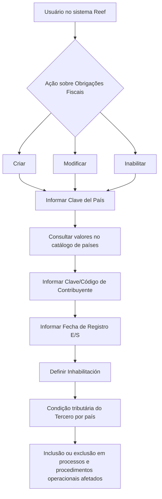

# Modificar Obligaciones Fiscales del Tercero — Especificação Funcional Reef

## 1. Metadados do Documento
- **Arquivo de Origem:** `Não identificado no conteúdo fornecido`
- **Tipo de Documento:** `Especificação Técnica / Funcional`
- **Domínio / Sistema:** `Reef / Mapfre`
- **Público-Alvo:** `Operação, Analistas Funcionais e Usuários do Sistema`
- **Data/Versão Identificada:** `Não identificada`

---

## 2. Resumo Executivo & Contexto de Negócio

O documento descreve a ação **“Modificar Obligaciones Fiscales del Tercero”** no sistema Reef. A ação permite administrar os países nos quais um Terceiro possui obrigações fiscais ou tributárias.

A funcionalidade contempla três ações possíveis: **criar**, **modificar** e **inabilitar** registros de obrigações fiscais. Esses registros identificam a condição tributária de um Terceiro em países específicos.

A manutenção das obrigações fiscais permite incluir ou excluir o Terceiro de processos e procedimentos operacionais da entidade que sejam impactados pela situação tributária identificada.

A sequência de captura ou modificação deve seguir a ordem dos campos apresentada no documento: da esquerda para a direita e de cima para baixo. O documento não detalha telas, permissões, contratos de integração, métodos HTTP ou persistência dos dados.

---

## 3. Arquitetura, Componentes & Tecnologias Envolvidas

Os elementos explicitamente citados são:

- **Reef:** sistema/documentação em que a funcionalidade está catalogada.
- **Mapfre:** contexto corporativo indicado pela referência `Mapfredocument` e pelo proprietário `agonzalez_mapfre.com`.
- **Tercero:** entidade cujas obrigações fiscais ou tributárias são administradas.
- **Catálogo de países:** fonte de possíveis valores para a chave do país.
- **Processos e procedimentos operacionais da entidade:** processos potencialmente afetados pela condição tributária do Terceiro.



> **Nota de Análise:** o conteúdo não apresenta arquitetura técnica de infraestrutura, banco de dados, APIs, microsserviços, integrações ou tecnologias de implementação.

---

## 4. Regras de Negócio, Especificações Funcionais & Processos

### Objetivo funcional

A ação permite criar ou identificar os países nos quais o Terceiro possui obrigações fiscais ou tributárias. Também permite modificar ou inabilitar informações de países que já tenham sido previamente identificados para o Terceiro.

A manutenção dessas informações permite considerar ou excluir o Terceiro dos processos e procedimentos operacionais da entidade que sejam afetados pela situação tributária.

### Ações possíveis

1. **CREAR:** criar uma identificação de obrigação fiscal ou tributária do Terceiro em um país.
2. **MODIFICAR:** alterar informações previamente identificadas para a obrigação fiscal ou tributária do Terceiro em um país.
3. **INHABILITAR:** indicar que o Terceiro deixou de ser obrigado tributário no país em questão.

### Sequência de captura ou modificação

A sequência de preenchimento ou alteração dos dados deve ocorrer:

1. Da esquerda para a direita.
2. De cima para baixo.
3. Conforme os campos listados na seção de Obrigações Fiscais.

### Campos funcionais

1. **Clave del País**
   - Contém o código do primeiro nível da estrutura geográfica: países.
   - Identifica o país no qual o Terceiro está registrado como obrigado tributário.
   - Os valores possíveis são obtidos no catálogo de países existente no sistema.

2. **Clave/Código de Contribuyente**
   - Identifica a chave ou o código do Terceiro como contribuinte local.
   - Está associado ao país no qual o Terceiro aparece como obrigado tributário.

3. **Fecha de Registro E/S**
   - Contém a data de entrada ou de saída do Terceiro no status de obrigação tributária.

4. **Inhabilitación**
   - Estabelece se o Terceiro deixou de ser obrigado tributário no país correspondente.

---

## 5. Tabelas de Parâmetros, Ambientes e Estruturas de Dados

| Item / Parâmetro | Descrição / Função | Tipo / Valores / Formato | Ambiente / Observações |
| :--- | :--- | :--- | :--- |
| CREAR | Cria ou identifica um país no qual o Terceiro possui obrigação fiscal ou tributária. | Ação funcional. | Valores detalhados não informados. |
| MODIFICAR | Altera a informação de um país previamente identificado para o Terceiro. | Ação funcional. | O documento não descreve critérios de alteração. |
| INHABILITAR | Inabilita informação previamente identificada de obrigação fiscal ou tributária. | Ação funcional. | Relacionada à condição de o Terceiro deixar de ser obrigado tributário. |
| Clave del País | Código do primeiro nível da estrutura geográfica, correspondente a países, no qual o Terceiro está identificado como obrigado tributário. | Código de país; valores existentes no catálogo de países do sistema. | Não são listados códigos de países no documento. |
| Clave/Código de Contribuyente | Chave ou código que identifica o Terceiro como contribuinte local no país da obrigação tributária. | Código/chave de contribuinte. | Formato não informado. |
| Fecha de Registro E/S | Data de entrada ou saída do Terceiro no status de obrigação tributária. | Data. | O formato da data não é informado. |
| Inhabilitación | Determina se o Terceiro deixou de ser obrigado tributário no país em questão. | Propriedade/indicador. | Valores permitidos não informados. |
| Catálogo de países | Fonte dos valores possíveis para a Clave del País. | Catálogo do sistema. | Estrutura e localização não detalhadas. |
| Reef | Sistema ou contexto documental mencionado no conteúdo. | Sistema/documentação. | A documentação aparece como “DOCUMENTACIÓN Reef”. |
| Owner | Proprietário indicado no documento. | `user:agonzalez_mapfre.com` | Associado ao conteúdo documental. |
| Lifecycle | Estado de ciclo de vida indicado. | `Approved Source` | Não há explicação adicional do status. |

---

## 6. Bateria de Perguntas & Respostas para RAG (FAQ Sintético)

### P1: Qual é o objetivo da ação “Modificar Obligaciones Fiscales del Tercero”?
**R:** A ação permite criar ou identificar os países nos quais um Terceiro possui obrigações fiscais ou tributárias, além de modificar ou inabilitar informações de países previamente identificados para esse Terceiro.

### P2: Quais ações estão disponíveis para administrar obrigações fiscais do Terceiro?
**R:** O documento lista três ações possíveis: **CREAR**, para criar ou identificar informações de obrigação fiscal; **MODIFICAR**, para alterar informações existentes; e **INHABILITAR**, para inabilitar informações previamente identificadas.

### P3: O que a “Clave del País” representa?
**R:** A Clave del País contém o código do primeiro nível da estrutura geográfica, correspondente aos países, no qual o Terceiro está identificado como obrigado tributário.

### P4: De onde vêm os valores permitidos para a Clave del País?
**R:** Os possíveis valores da Clave del País são obtidos a partir do catálogo de países existente no sistema.

### P5: Para que serve a Clave/Código de Contribuyente?
**R:** A Clave/Código de Contribuyente identifica a chave ou o código do Terceiro como contribuinte local no país em que o Terceiro aparece como obrigado tributário.

### P6: O que deve ser informado no campo Fecha de Registro E/S?
**R:** O campo Fecha de Registro E/S contém a data de entrada ou de saída do Terceiro no status de obrigação tributária.

### P7: O que significa a propriedade Inhabilitación?
**R:** A propriedade Inhabilitación estabelece se o Terceiro deixou de ser obrigado tributário no país associado ao registro.

### P8: Em qual ordem os campos de obrigação fiscal devem ser preenchidos ou modificados?
**R:** Os campos devem ser capturados ou modificados da esquerda para a direita e de cima para baixo, seguindo a sequência apresentada na seção de Obrigações Fiscais.

### P9: Qual é o impacto operacional de registrar uma obrigação tributária para um Terceiro?
**R:** O registro pode fazer com que o Terceiro seja considerado ou excluído de processos e procedimentos operacionais da entidade que sejam afetados pela situação fiscal ou tributária.

### P10: O documento informa os métodos HTTP ou contratos JSON da funcionalidade?
**R:** Não. O documento apresenta a finalidade funcional, as ações disponíveis e os campos de captura, mas não detalha métodos HTTP, contratos JSON, APIs ou integrações técnicas.

---

## 7. Glossário de Termos, Siglas & Conceitos-Chave

- **Tercero:** entidade para a qual são mantidas informações de obrigações fiscais ou tributárias.
- **Obligaciones Fiscales / Tributarias:** obrigações fiscais ou tributárias associadas ao Terceiro em determinado país.
- **Clave del País:** código do país, correspondente ao primeiro nível da estrutura geográfica.
- **Clave/Código de Contribuyente:** chave ou código que identifica o Terceiro como contribuinte local em um país.
- **Fecha de Registro E/S:** data de entrada ou saída no status de obrigação tributária.
- **Inhabilitación:** propriedade que indica se o Terceiro deixou de ser obrigado tributário em determinado país.
- **Reef:** nome do sistema ou da documentação citada no conteúdo.
- **E/S:** abreviação usada no campo “Fecha de Registro E/S”; o texto a associa a “Entrada o de Salida”.

---

## 8. Notas Críticas, Riscos & Limitações

- O nome do arquivo de origem, data e versão do documento não foram identificados no texto fornecido.
- O documento não informa formatos de dados, obrigatoriedade de campos, validações, mensagens de erro ou regras de consistência.
- O documento não apresenta valores possíveis para Inhabilitación.
- O documento não apresenta o conteúdo do catálogo de países nem os códigos de país aceitos.
- Não há detalhamento de perfis de acesso, permissões, auditoria, persistência de dados ou rastreabilidade das alterações.
- Não são descritos APIs, contratos JSON, métodos HTTP, microsserviços, banco de dados ou integrações.
- **Nota de Análise:** o documento lista ações e campos funcionais, porém não detalha o comportamento técnico do sistema após criar, modificar ou inabilitar uma obrigação fiscal.

---

## 9. Conteúdo Bruto Estruturado (Referência Fiel)

```text
--- [PÁGINA 1 DE 1] ---

MODIFICAR Obligaciones Fiscales del Tercero
Objetivo
Esta acción permite Crear o Identicar los países en los que el Tercero tiene Obligaciones Fiscales o Tributarias además de poder Modicar
ó Inhabilitar la información de aquellos países que hubieran sido previamente identicados para el Tercero, pudiendo de esta manera
contemplar o excluir al Tercero de aquellos procesos y procedimientos operativos de la entidad afectados por dicha situación.
Posibles Acciones
 CREAR ( )
 MODIFICAR ( )
 INHABILITAR ( )
Obligaciones Fiscales.
De Izquierda a Derecha y de Arriba hacia Abajo, los siguientes campos marcan la secuencia de captura o modicación del Tercero en el
sistema.
Clave del País (   )
Este Campo contiene el código del primer nivel de la estructura Geográca (países) en el que el Tercero está identicado como obligado
tributario, de acuerdo con la relación de posibles valores existentes en el catálogo de países existente en el Sistema.
Clave/Código de Contribuyente (  )
Este Dato permite identicar la clave o el código del Tercero como Contribuyente local en el País en el que aparece como obligado tributario.
Fecha de Registro E/S (  )
Este Campo contiene la Fecha de Entrada o de Salida del Tercero con el status de Obligación Tributaria.
Inhabilitación (  )
Esta propiedad establece si el Tercero ha dejado de ser Obligado Tributario en el País en cuestión.
Documentation / DOCUMENTACIÓN Reef
DOCUMENTACIÓN Reef
Mapfredocument
DOCUMENTACIÓN Reef
Owner
user:agonzalez_mapfre.com
Lifecycle
Approved Source
 /
 VL
Buscar Inicio Soluciones Arquitecturas APIs Componentes Cloud Documentación Zeus Reef Ayuda
ES
```
