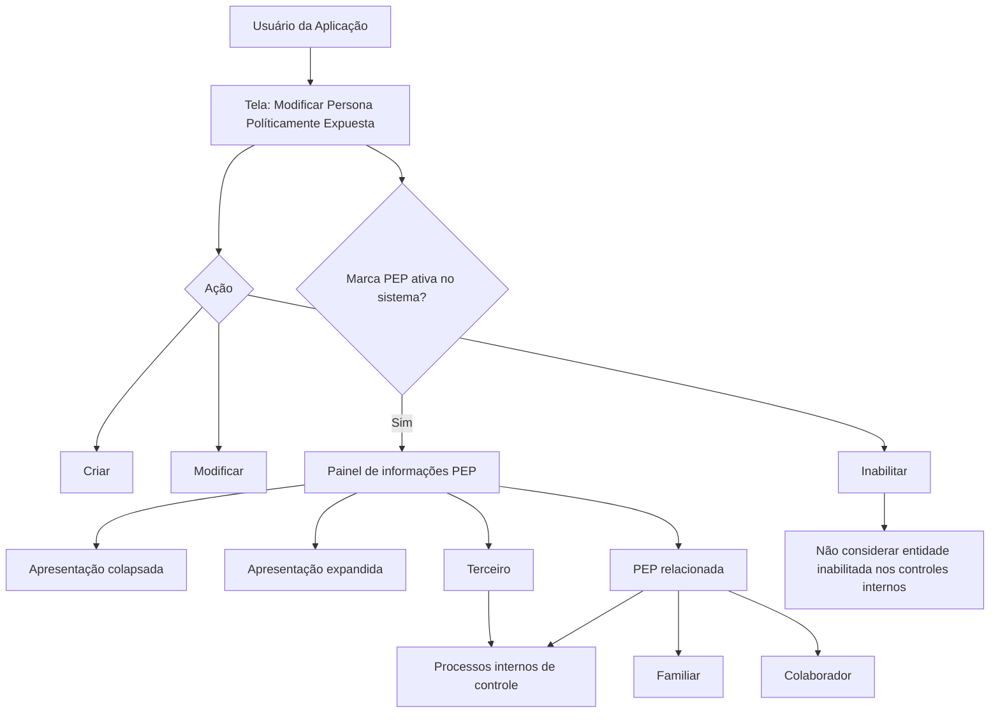

# Modificar Persona Políticamente Expuesta — Documentação Funcional REEF

## 1. Metadados do Documento
- **Arquivo de Origem:** Não identificado no conteúdo fornecido
- **Tipo de Documento:** Especificação Funcional
- **Domínio / Sistema:** REEF / Mapfre — gestão de Terceiros e Pessoa Politicamente Exposta
- **Público-Alvo:** Usuários da aplicação, analistas funcionais, equipes de controle interno e desenvolvedores
- **Data/Versão Identificada:** Não identificada
- **Proprietário identificado:** `user:agonzalez_mapfre.com`
- **Lifecycle identificado:** Approved Source

---

## 2. Resumo Executivo & Contexto de Negócio

O documento descreve a tela **“Modificar Persona Políticamente Expuesta”** no sistema REEF. A tela permite que usuários da aplicação identifiquem e criem um Terceiro como Pessoa Politicamente Exposta (PEP), ou relacionem o Terceiro a um Familiar ou Colaborador próximo que possua essa condição.

A funcionalidade também permite complementar, modificar ou inabilitar informações previamente existentes referentes à condição de Pessoa Politicamente Exposta do Terceiro ou de uma Pessoa Politicamente Exposta relacionada. As ações explicitamente listadas são **CRIAR**, **MODIFICAR** e **INABILITAR**.

Quando a marca que identifica que o Terceiro é, ou possui associação com, uma Pessoa Politicamente Exposta estiver ativa no sistema, o painel de informações correspondente é exibido. O conteúdo fornecido informa que esse painel pode aparecer de forma colapsada ou expandida.

A documentação define campos voltados ao registro de datas de alta e baixa, vínculo familiar ou de colaboração, cargo ou relação, e identificação documental da Pessoa Politicamente Exposta relacionada ao Segurado. A inabilitação informa ao sistema que o Terceiro ou a Pessoa Politicamente Exposta relacionada está desativada e, consequentemente, não deve ser considerada nos processos internos de controle existentes na entidade.

---

## 3. Arquitetura, Componentes & Tecnologias Envolvidas

O conteúdo fornecido não descreve arquitetura técnica, serviços, APIs, bancos de dados, métodos HTTP, contratos JSON, tecnologias de infraestrutura ou ambientes de implantação.

Os componentes funcionais explicitamente identificados são:

- Sistema ou documentação **REEF**.
- Entidade de negócio **Terceiro**.
- Entidade de negócio **Pessoa Politicamente Exposta**.
- Entidade de negócio **Pessoa Politicamente Exposta relacionada**.
- Classificações de relação: **Familiar** e **Colaborador**.
- Entidade mencionada: **Segurado**.
- Painel de informações PEP, com apresentação colapsada ou expandida.
- Catálogo de Cargos existente no sistema.
- Processos internos de controle da entidade.



> **Nota de Análise:** O diagrama representa exclusivamente relações funcionais sustentadas pelo texto. O documento não detalha camadas técnicas, persistência de dados, integrações, serviços ou responsabilidades de componentes de software.

---

## 4. Regras de Negócio, Especificações Funcionais & Processos

### 4.1 Objetivo da tela

A tela permite aos usuários da aplicação:

1. Identificar um Terceiro como Pessoa Politicamente Exposta.
2. Criar o registro de condição de Pessoa Politicamente Exposta para um Terceiro.
3. Relacionar o Terceiro com um Familiar ou Colaborador próximo que tenha condição de Pessoa Politicamente Exposta.
4. Complementar informações existentes do Terceiro relacionadas à condição de Pessoa Politicamente Exposta.
5. Modificar informações existentes do Terceiro relacionadas à condição de Pessoa Politicamente Exposta.
6. Inabilitar a condição do Terceiro ou da Pessoa Politicamente Exposta relacionada.

### 4.2 Ações disponíveis

O documento apresenta as seguintes ações possíveis:

- **CRIAR:** registrar a condição de Pessoa Politicamente Exposta ou uma relação com Pessoa Politicamente Exposta.
- **MODIFICAR:** alterar informações preexistentes referentes ao Terceiro ou à Pessoa Politicamente Exposta relacionada.
- **INABILITAR:** desativar o Terceiro ou a Pessoa Politicamente Exposta relacionada para que a entidade inabilitada não seja considerada nos processos internos de controle existentes na entidade.

> **Nota de Análise:** O texto não especifica permissões por perfil, critérios de transição entre as ações, confirmações de tela, mensagens de erro, obrigatoriedade de campos ou regras de auditoria.

### 4.3 Condição de exibição do painel

O painel de informações da Pessoa Politicamente Exposta é exibido somente quando estiver ativada a marca que identifica, no sistema, que:

- o Terceiro é uma Pessoa Politicamente Exposta; ou
- o Terceiro possui associação com uma Pessoa Politicamente Exposta.

O painel correspondente pode ser visualizado em duas formas:

- Colapsada.
- Expandida.

### 4.4 Sequência de captura ou modificação

O documento determina que os campos seguem uma sequência de captura ou modificação:

- Da esquerda para a direita.
- De cima para baixo.

### 4.5 Datas de condição PEP

#### Data de Alta como Pessoa Politicamente Exposta

Esse dado contém a data de alta:

- do Terceiro como Pessoa Politicamente Exposta; ou
- da Pessoa Politicamente Exposta relacionada com o Terceiro.

#### Data de Baixa como Pessoa Politicamente Exposta

Esse dado contém a data em que:

- o Terceiro causa baixa em sua condição ou relação; ou
- a Pessoa Politicamente Exposta relacionada causa baixa em sua relação com o Terceiro.

> **Nota de Análise:** O documento não define formato de data, validações cronológicas, comportamento para datas futuras, obrigatoriedade ou efeito operacional da data de baixa além da existência do campo.

### 4.6 Classificação do vínculo com PEP

O atributo **Familiar / Colaborador** permite identificar se a Pessoa Politicamente Exposta relacionada é:

- Familiar do Terceiro; ou
- Colaborador do Terceiro.

### 4.7 Cargo ou relação

O campo **Cargo o Relación con la Persona Políticamente Expuesta** identifica:

- a relação do Terceiro com a Pessoa Politicamente Exposta; ou
- o cargo do Terceiro ou da Pessoa Politicamente Exposta relacionada.

Os valores devem estar de acordo com os possíveis valores do catálogo de Cargos existente no sistema.

> **Nota de Análise:** O conteúdo não apresenta os valores desse catálogo de Cargos nem descreve sua origem, manutenção ou regras de seleção.

### 4.8 Identificação documental da PEP relacionada

O atributo **Tipo Documento Identificador de la Persona Políticamente Expuesta Relacionada** contém o tipo de documento da Pessoa Politicamente Exposta relacionada com o Segurado.

O atributo **Clave del Documento Identificador de la Persona Políticamente Relacionada** contém a chave do documento identificador da Pessoa Politicamente Exposta relacionada com o Segurado.

> **Nota de Análise:** O texto não lista tipos de documento aceitos, máscaras, tamanho da chave documental, validações de unicidade ou regras de consistência com cadastros existentes.

### 4.9 Inabilitação

A propriedade **Inhabilitación** informa ao sistema que uma das seguintes entidades está desativada:

- o Terceiro; ou
- a Pessoa Politicamente Exposta relacionada com o Terceiro.

Quando a inabilitação estiver aplicada, a entidade desativada não deve ser considerada nos processos internos de controle existentes na entidade.

---

## 5. Tabelas de Parâmetros, Ambientes e Estruturas de Dados

| Item / Parâmetro | Descrição / Função | Tipo / Valores / Formato | Ambiente / Observações |
| :--- | :--- | :--- | :--- |
| Tela “Modificar Persona Políticamente Expuesta” | Permite identificar, criar, complementar, modificar ou inabilitar informações relacionadas à condição PEP de um Terceiro ou de uma PEP relacionada. | Tela funcional | Sistema REEF; ambiente não identificado. |
| Ação CRIAR | Permite criar o registro da condição PEP ou da relação com PEP. | Ação de tela | Critérios de acionamento não detalhados. |
| Ação MODIFICAR | Permite alterar informações preexistentes do Terceiro ou da PEP relacionada. | Ação de tela | Não há detalhamento sobre campos editáveis. |
| Ação INABILITAR | Permite desativar o Terceiro ou a PEP relacionada para fins de controles internos. | Ação de tela | O documento não descreve reversão da inabilitação. |
| Marca de identificação PEP | Indica no sistema que o Terceiro é PEP ou possui PEP associada. | Marca / condição de exibição | Quando ativa, exibe o painel de informações correspondente. |
| Painel de informações PEP | Exibe informações relativas à condição PEP. | Painel de interface | Pode ser apresentado colapsado ou expandido. |
| Sequência de captura/modificação | Define a ordem de navegação ou preenchimento dos campos. | Regra de apresentação | Da esquerda para a direita e de cima para baixo. |
| Fecha de Alta como Persona Políticamente Expuesta | Armazena a data de alta do Terceiro como PEP ou da PEP relacionada ao Terceiro. | Data; formato não especificado | Não há regras de validação apresentadas. |
| Fecha de Baja como Persona Políticamente Expuesta | Armazena a data de baixa do Terceiro ou da PEP relacionada em sua relação com o Terceiro. | Data; formato não especificado | Não há efeito adicional explicitado no texto. |
| Familiar / Colaborador | Identifica se a PEP relacionada é Familiar ou Colaborador do Terceiro. | Atributo classificatório | Valores explicitamente citados: Familiar e Colaborador. |
| Cargo o Relación con la Persona Políticamente Expuesta | Identifica cargo ou relação do Terceiro ou da PEP relacionada. | Campo baseado em catálogo | Deve usar valores do catálogo de Cargos existente no sistema. |
| Tipo Documento Identificador de la Persona Políticamente Expuesta Relacionada | Informa o tipo de documento da PEP relacionada ao Segurado. | Tipo de documento; valores não especificados | Localizado no colapsador, segundo o documento. |
| Clave del Documento Identificador de la Persona Políticamente Relacionada | Informa a chave do documento identificador da PEP relacionada ao Segurado. | Chave documental; formato não especificado | Não há detalhes de validação ou máscara. |
| Inhabilitación | Indica que o Terceiro ou PEP relacionada está desativado. | Propriedade / estado | Entidade inabilitada não deve ser considerada nos processos internos de controle. |
| Catálogo de Cargos | Fonte de possíveis valores para o campo de cargo ou relação. | Catálogo do sistema | Valores não apresentados no documento. |
| REEF | Sistema ou domínio identificado na documentação. | Sistema / documentação | Não há detalhes técnicos adicionais. |
| Owner | Responsável identificado no cabeçalho da documentação. | Identificador de usuário | `user:agonzalez_mapfre.com` |
| Lifecycle | Estado documental informado no cabeçalho. | Estado documental | `Approved Source` |

---

## 6. Bateria de Perguntas & Respostas para RAG (FAQ Sintético)

### P1: Qual é o objetivo da tela “Modificar Persona Políticamente Expuesta” no sistema REEF?
**R:** A tela permite identificar e criar um Terceiro como Pessoa Politicamente Exposta, ou relacionar o Terceiro a um Familiar ou Colaborador próximo que tenha essa condição. A tela também permite complementar, modificar ou inabilitar informações preexistentes relacionadas ao Terceiro e à Pessoa Politicamente Exposta relacionada.

### P2: Quais ações estão disponíveis na funcionalidade de Pessoa Politicamente Exposta?
**R:** O documento lista três ações possíveis: **CRIAR**, **MODIFICAR** e **INABILITAR**. Criar registra a condição ou relação PEP; modificar altera informações existentes; e inabilitar desativa o Terceiro ou a Pessoa Politicamente Exposta relacionada para os processos internos de controle.

### P3: Quando o painel de informações da Pessoa Politicamente Exposta é exibido?
**R:** O painel é exibido quando a marca que identifica no sistema que o Terceiro é Pessoa Politicamente Exposta, ou possui uma Pessoa Politicamente Exposta associada, estiver ativada. O painel pode ser exibido de maneira colapsada ou expandida.

### P4: Qual é a sequência de captura ou modificação dos campos na tela?
**R:** A sequência de captura ou modificação dos campos deve seguir a orientação da esquerda para a direita e de cima para baixo.

### P5: O que registra o campo “Fecha de Alta como Persona Políticamente Expuesta”?
**R:** O campo registra a data de alta do Terceiro como Pessoa Politicamente Exposta ou a data de alta da Pessoa Politicamente Exposta relacionada com o Terceiro.

### P6: O que representa o campo “Fecha de Baja como Persona Políticamente Expuesta”?
**R:** O campo contém a data em que o Terceiro ou a Pessoa Politicamente Exposta relacionada causa baixa em sua relação com o Terceiro. O documento não detalha formato, validações ou regras adicionais relacionadas à data de baixa.

### P7: Como o sistema diferencia Familiar e Colaborador na relação com uma Pessoa Politicamente Exposta?
**R:** O atributo **Familiar / Colaborador** permite identificar se a Pessoa Politicamente Exposta relacionada é um Familiar ou um Colaborador do Terceiro.

### P8: De onde vêm os valores de cargo ou relação com a Pessoa Politicamente Exposta?
**R:** O campo **Cargo o Relación con la Persona Políticamente Expuesta** deve utilizar os possíveis valores do catálogo de Cargos existente no sistema. O documento não apresenta os valores disponíveis nesse catálogo.

### P9: Quais informações documentais são registradas para uma Pessoa Politicamente Exposta relacionada?
**R:** São registrados o tipo de documento identificador da Pessoa Politicamente Exposta relacionada com o Segurado e a chave desse documento identificador. O conteúdo não detalha tipos documentais aceitos, formato da chave ou regras de validação.

### P10: Qual é o efeito da inabilitação sobre os processos internos de controle?
**R:** A propriedade de inabilitação indica ao sistema que o Terceiro ou a Pessoa Politicamente Exposta relacionada com o Terceiro está desativada. Portanto, a entidade inabilitada não deve ser considerada nos processos de controle internos existentes na entidade.

### P11: O documento descreve APIs, métodos HTTP ou contratos JSON para a funcionalidade PEP?
**R:** Não. O conteúdo fornecido descreve a finalidade da tela, suas ações, campos e comportamento funcional. Não há detalhamento de APIs, métodos HTTP, contratos JSON, endpoints, integrações ou tecnologias de persistência.

### P12: O documento informa quais perfis de usuário podem criar, modificar ou inabilitar registros PEP?
**R:** Não. O documento afirma que usuários da aplicação podem executar as operações descritas, mas não especifica perfis, permissões, segregação de funções ou matriz de autorização.

---

## 7. Glossário de Termos, Siglas & Conceitos-Chave

- **REEF:** Sistema ou domínio documental identificado no conteúdo fornecido. O significado expandido da sigla não é informado.
- **PEP / Pessoa Politicamente Exposta:** Pessoa identificada na funcionalidade como politicamente exposta; pode ser o próprio Terceiro ou uma pessoa relacionada ao Terceiro.
- **Terceiro:** Entidade cadastral que pode ser identificada como Pessoa Politicamente Exposta ou associada a uma Pessoa Politicamente Exposta.
- **Pessoa Politicamente Exposta relacionada:** Pessoa com condição PEP relacionada ao Terceiro.
- **Familiar:** Classificação possível para a Pessoa Politicamente Exposta relacionada com o Terceiro.
- **Colaborador:** Classificação possível para a Pessoa Politicamente Exposta relacionada com o Terceiro.
- **Segurado:** Entidade mencionada como relacionada à identificação documental da Pessoa Politicamente Exposta relacionada.
- **Catálogo de Cargos:** Catálogo existente no sistema que fornece possíveis valores para o campo de cargo ou relação.
- **Inhabilitación / Inabilitação:** Propriedade que indica que o Terceiro ou a Pessoa Politicamente Exposta relacionada está desativada e não deve ser considerada nos processos internos de controle.
- **Colapsador:** Elemento de interface mencionado como contendo o atributo de tipo de documento identificador da Pessoa Politicamente Exposta relacionada.
- **Approved Source:** Estado de lifecycle exibido no cabeçalho da documentação.

---

## 8. Notas Críticas, Riscos & Limitações

- O documento não identifica o arquivo de origem, data de publicação, versão do documento ou versão da aplicação.
- Não há descrição de arquitetura técnica, APIs, integrações, banco de dados, serviços, eventos, filas, logs, URLs, servidores ou ambientes.
- Não são detalhados os métodos HTTP, contratos JSON, estruturas de payload, códigos de resposta ou mecanismos de autenticação.
- Não há matriz de permissões, perfis autorizados, fluxo de aprovação ou segregação de funções para criar, modificar ou inabilitar registros PEP.
- O documento não define obrigatoriedade de campos, validações de preenchimento, mensagens de erro, máscaras, formato de datas ou regras de consistência entre data de alta e data de baixa.
- O catálogo de Cargos é citado, porém os valores permitidos não são fornecidos.
- Os tipos de documento e o formato da chave do documento identificador não são apresentados.
- O comportamento da inabilitação é explicitado apenas para os processos internos de controle; não há informação sobre reativação, histórico, auditoria, retenção de dados ou impactos em processos externos.
- O termo **Segurado** é citado no contexto de identificação documental, mas o documento não explica sua relação de negócio com o Terceiro.
- O conteúdo menciona o sistema REEF e a documentação Mapfre, mas não detalha responsabilidades técnicas ou fronteiras entre sistemas.

---

## 9. Conteúdo Bruto Estruturado (Referência Fiel)

```text
--- [PÁGINA 1 DE 2] ---

MODIFICAR Persona Políticamente Expuesta

Objetivo

Esta Pantalla permite a los Usuarios de la Aplicación Identificar y Crear al Tercero como Persona Políticamente Expuesta o relacionarlo con algún Familiar o estrecho Colaborador que tenga dicha condición, además de Complementar, Modificar ó Inhabilitar ambas situaciones con la información Preexistente del Tercero.

Posibles Acciones

 CREAR ( )
 MODIFICAR ( )
 INHABILITAR ( )

Datos Persona Políticamente Expuesta

Siempre y cuando se haya activado la marca que identifica en el sistema que el Tercero es o tiene asociada una persona políticamente expuesta aparecerá el panel de información correspondiente de manera colapsada...

... o de manera extendida

De Izquierda a Derecha y de Arriba hacia Abajo, los siguientes campos marcan la secuencia de captura o modificación del Tercero en el sistema.

Fecha de Alta como Persona Políticamente Expuesta ( )

Este Dato contendrá la fecha de Alta del Tercero como Persona Políticamente Expuesta o de la Persona Políticamente Expuesta relacionada con el Tercero.

Fecha de Baja como Persona Políticamente Expuesta ( )

Este Dato contendrá la fecha en la que el Tercero o la Persona Políticamente Expuesta relacionada causa baja en su relación con el Tercero.

Documentation / DOCUMENTACIÓN Reef
DOCUMENTACIÓN Reef
Mapfredocument
DOCUMENTACIÓN Reef
Owner
user:agonzalez_mapfre.com
Lifecycle
Approved Source
 /
VL
Buscar Inicio Soluciones Arquitecturas APIs Componentes Cloud Documentación Zeus Reef Ayuda
ES


--- [PÁGINA 2 DE 2] ---

Familiar / Colaborador ( )

Este Atributo permite identificar si la Persona Políticamente Expuesta relacionada es un Familiar o un Colaborador del Tercero.

Cargo o Relación con la Persona Políticamente Expuesta ( )

Este Campo identifica la relación o el Cargo del Tercero o de la Persona Políticamente Expuesta relacionada, de acuerdo con los posibles valores del catálogo de Cargos existente en el Sistema.

Tipo Documento Identificador de la Persona Políticamente Expuesta Relacionada ( )

Este Atributo del colapsador contiene el tipo de documento de la Persona Políticamente Expuesta relacionada con el Asegurado.

Clave del Documento Identificador de la Persona Políticamente Relacionada ( )

Este Atributo contiene la clave del documento Identificador de la Persona Políticamente Expuesta relacionada con el Asegurado.

Inhabilitación ( )

Esta propiedad le indica al Sistema que o bien el Tercero o la Personas Políticamente Expuesta Relacionada con el Tercero está desactivada y por ende no debiera considerarse en los procesos de control internos existentes en la entidad.
```
