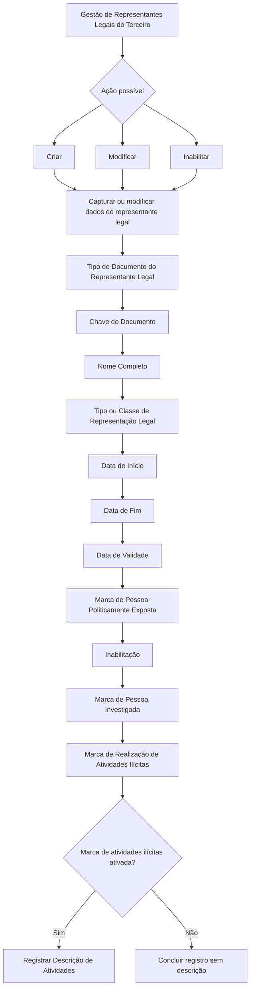

# Gestão de Representantes Legais de Terceiros — Documentação Reef

## 1. Metadados do Documento
- **Arquivo de Origem:** Não identificado no conteúdo fornecido
- **Tipo de Documento:** Especificação Funcional
- **Domínio / Sistema:** Reef / Mapfre — gestão de Terceiros
- **Público-Alvo:** Analistas funcionais, desenvolvedores, operação e áreas de negócio da entidade seguradora
- **Data/Versão Identificada:** Não identificada
- **Owner identificado:** `user:agonzalez_mapfre.com`
- **Lifecycle identificado:** `Approved Source`

---

## 2. Resumo Executivo & Contexto de Negócio

O documento descreve a funcionalidade de gestão de **Representantes Legais de um Terceiro** no sistema Reef. A representação legal é definida como a faculdade concedida por lei a uma pessoa para agir em nome de outra, recaindo sobre esta última os efeitos dos atos praticados. O exercício dessa representação pode ser obrigatório para o representante.

O objetivo funcional é registrar informações relativas aos representantes legais associados a um Terceiro. O documento apresenta três ações possíveis para o registro: **criar**, **modificar** e **inabilitar** um representante legal.

A captura ou modificação das informações segue uma sequência visual indicada como “da esquerda para a direita e de cima para baixo”. Os dados incluem identificação documental, nome completo, tipologia de representação, datas de início, fim e validade, além de marcas relacionadas a exposição política, investigação e realização de atividades ilícitas.

A entidade seguradora pode utilizar as classificações e marcas registradas para gerir e controlar essas circunstâncias em seus processos internos. A classificação de tipo ou classe de representação legal pode ser codificada localmente pela entidade seguradora para posterior uso e exploração interna.

O conteúdo fornecido não apresenta detalhes de arquitetura técnica, métodos HTTP, contratos JSON, persistência de dados, integrações, controle de acesso ou validações sistêmicas além da regra explícita para o preenchimento da descrição de atividades ilícitas.

---

## 3. Arquitetura, Componentes & Tecnologias Envolvidas

O conteúdo identifica o sistema ou repositório documental **Reef**, o contexto **Mapfre** e a entidade funcional **Representantes Legales del Tercero**. Não são descritos microsserviços, APIs, bancos de dados, protocolos, ambientes, linguagens, ferramentas de integração ou componentes de infraestrutura.

O fluxo abaixo representa exclusivamente a sequência funcional de captura ou modificação dos dados apresentada no documento.



**Nota de Análise:** o documento lista o contexto Reef e a documentação Mapfre, mas não detalha a arquitetura de software, as tecnologias utilizadas, os serviços envolvidos, os métodos de integração ou os contratos expostos.

---

## 4. Regras de Negócio, Especificações Funcionais & Processos

### 4.1 Objetivo funcional

A funcionalidade tem como propósito registrar as informações relativas aos **Representantes Legais do Terceiro**. O representante legal é uma pessoa que possui faculdade legal para atuar em nome de outra pessoa, com efeitos dos atos recaindo sobre a pessoa representada.

### 4.2 Ações disponíveis

O documento lista as seguintes ações possíveis:

1. **Criar:** registrar informações de um representante legal de um Terceiro.
2. **Modificar:** alterar informações existentes de um representante legal de um Terceiro.
3. **Inabilitar:** estabelecer que o representante legal não permanece habilitado para exercer essa função.

O documento não descreve condições de elegibilidade, permissões, confirmações, transições de estado, efeitos de auditoria ou tratamento de erros para as ações de criar, modificar e inabilitar.

### 4.3 Sequência de captura ou modificação

A sequência de preenchimento ou alteração é apresentada da esquerda para a direita e de cima para baixo. Os campos listados são:

1. Tipo de Documento do Representante Legal.
2. Chave do Documento.
3. Nome Completo.
4. Tipo ou Classe de Representação Legal.
5. Data de Início.
6. Data de Fim.
7. Data de Validade.
8. Marca de Pessoa Politicamente Exposta.
9. Inabilitação.
10. Marca de Pessoa Investigada.
11. Marca de Realização de Atividades Ilícitas.
12. Descrição de Atividades.

### 4.4 Identificação do representante legal

O **Tipo de Documento do Representante Legal** identifica o documento utilizado para identificar o representante legal, de acordo com os tipos de documentos existentes no sistema.

A **Chave do Documento** contém a chave documental do representante legal do Terceiro.

O campo **Nome Completo** permite registrar o nome completo do representante legal do Terceiro.

### 4.5 Classificação da representação legal

O atributo **Tipo/Classe de Representação Legal** armazena a classe ou tipologia de representação legal associada à pessoa. A codificação pode ser definida localmente pela entidade seguradora, visando utilização e exploração posteriores nos processos internos da entidade.

O documento não informa valores permitidos, catálogo de códigos, obrigatoriedade do campo ou regras de validação dessa classificação.

### 4.6 Datas associadas à representação

- **Data de Início:** indica a data de alta da pessoa como representante legal.
- **Data de Fim:** indica a data de baixa em que a pessoa deixa de atuar como representante legal do Terceiro.
- **Data de Validade:** indica a data a partir da qual a pessoa entra em vigor como representante legal do Terceiro.

O documento não define formato de data, relação de precedência entre as datas, validação cronológica ou comportamento para campos não informados.

### 4.7 Marcas de risco e controle interno

A **Marca de Pessoa Politicamente Exposta** permite identificar o representante legal como Pessoa Politicamente Exposta. Essa marca permite à entidade seguradora gerir e controlar internamente essa circunstância.

A **Marca de Pessoa Investigada** permite identificar o representante legal como pessoa investigada. Essa marca permite à entidade seguradora gerir e controlar internamente essa circunstância.

A **Marca de Realização de Atividades Ilícitas** permite identificar o representante legal como pessoa que realizou qualquer tipo de atividade ilícita. A identificação permite à entidade seguradora gerir e controlar internamente essa circunstância.

### 4.8 Regra condicional para descrição de atividades

A **Descrição de Atividades** somente pode ser registrada quando a marca de realização de atividades ilícitas estiver ativada. Esse atributo permite incluir um texto explicativo sobre as atividades ilícitas.

**Regra explícita:**

```text
Se a Marca de Realização de Atividades Ilícitas estiver ativada,
a Descrição de Atividades poderá registrar um texto esclarecedor
sobre essas atividades.
```

**Nota de Análise:** o documento não especifica comportamento para uma descrição preenchida quando a marca de realização de atividades ilícitas estiver desativada.

---

## 5. Tabelas de Parâmetros, Ambientes e Estruturas de Dados

### 5.1 Ações funcionais

| Item / Parâmetro | Descrição / Função | Tipo / Valores / Formato | Ambiente / Observações |
| :--- | :--- | :--- | :--- |
| Criar | Registra informações de um representante legal de um Terceiro. | Ação funcional | O documento não detalha pré-requisitos ou resultado da ação. |
| Modificar | Altera informações de um representante legal de um Terceiro. | Ação funcional | O documento não detalha campos editáveis nem regras de alteração. |
| Inabilitar | Estabelece que o representante legal permanece ou não habilitado para exercer como tal. | Ação funcional | O documento não detalha o efeito operacional da inabilitação. |

### 5.2 Campos de representante legal

| Item / Parâmetro | Descrição / Função | Tipo / Valores / Formato | Ambiente / Observações |
| :--- | :--- | :--- | :--- |
| Tipo de Documento do Representante Legal | Contém o documento com o qual o representante legal será identificado. | Tipos de documentos existentes no sistema | O catálogo de tipos de documento não foi fornecido. |
| Chave do Documento | Contém a chave do documento do representante legal do Terceiro. | Não especificado | O formato da chave não foi informado. |
| Nome Completo | Permite registrar o nome completo do representante legal do Terceiro. | Texto | Obrigatoriedade e tamanho não especificados. |
| Tipo/Classe de Representação Legal | Contém a classe ou tipologia de representação legal associada à pessoa. | Codificação local da entidade seguradora | Destinada ao uso e exploração em processos internos da entidade. |
| Data de Início | Indica a data de alta da pessoa como representante legal. | Data | Formato e validações não especificados. |
| Data de Fim | Indica a data de baixa em que a pessoa deixa de atuar como representante legal do Terceiro. | Data | Formato e validações não especificados. |
| Data de Validade | Indica a data a partir da qual a pessoa entra em vigor como representante legal do Terceiro. | Data | Formato e validações não especificados. |
| Marca de Pessoa Politicamente Exposta | Identifica o representante legal como Pessoa Politicamente Exposta. | Marca; valores não especificados | Utilizada para gestão e controle interno da entidade seguradora. |
| Inabilitação | Estabelece se o status do representante legal continua vigente ou está inabilitado para exercer como tal. | Marca ou status; valores não especificados | Não há detalhamento sobre transições de status. |
| Marca de Pessoa Investigada | Identifica o representante legal como pessoa investigada. | Marca; valores não especificados | Utilizada para gestão e controle interno da entidade seguradora. |
| Marca de Realização de Atividades Ilícitas | Identifica o representante legal como pessoa que realizou atividades ilícitas. | Marca; valores não especificados | Utilizada para gestão e controle interno da entidade seguradora. |
| Descrição de Atividades | Registra texto esclarecedor sobre atividades ilícitas. | Texto | Aplicável somente se a marca de realização de atividades ilícitas estiver ativada. |

### 5.3 Informações documentais identificadas

| Item / Parâmetro | Descrição / Função | Tipo / Valores / Formato | Ambiente / Observações |
| :--- | :--- | :--- | :--- |
| Documentação Reef | Área documental identificada no conteúdo. | Referência documental | O documento não especifica URL, repositório ou mecanismo de acesso. |
| Mapfre | Referência corporativa identificada no cabeçalho. | Organização / contexto | Sem detalhamento adicional no conteúdo. |
| Owner | Responsável identificado na página documental. | `user:agonzalez_mapfre.com` | Identificado literalmente no texto fornecido. |
| Lifecycle | Estado documental identificado. | `Approved Source` | Identificado literalmente no texto fornecido. |
| Idioma | Idioma exibido no cabeçalho. | `ES` | O conteúdo funcional está em espanhol. |

---

## 6. Bateria de Perguntas & Respostas para RAG (FAQ Sintético)

### P1: Qual é o objetivo da funcionalidade de Representantes Legais do Terceiro no Reef?
**R:** A funcionalidade tem como objetivo registrar as informações relativas aos representantes legais associados a um Terceiro. O documento define representação legal como a faculdade atribuída por lei a uma pessoa para atuar em nome de outra, recaindo sobre a pessoa representada os efeitos dos atos realizados.

### P2: Quais ações podem ser realizadas para um representante legal de um Terceiro?
**R:** O documento lista três ações possíveis: criar, modificar e inabilitar. Criar serve para registrar informações, modificar serve para alterar informações existentes e inabilitar estabelece se o representante legal está inabilitado para exercer como tal. O documento não detalha permissões, pré-requisitos ou efeitos técnicos dessas ações.

### P3: Qual é a sequência de captura dos dados de um representante legal?
**R:** A sequência indicada no documento é da esquerda para a direita e de cima para baixo: Tipo de Documento do Representante Legal, Chave do Documento, Nome Completo, Tipo/Classe de Representação Legal, Data de Início, Data de Fim, Data de Validade, Marca de Pessoa Politicamente Exposta, Inabilitação, Marca de Pessoa Investigada, Marca de Realização de Atividades Ilícitas e Descrição de Atividades.

### P4: Para que serve o campo Tipo de Documento do Representante Legal?
**R:** O campo Tipo de Documento do Representante Legal contém o documento utilizado para identificar o representante legal, de acordo com os tipos de documentos existentes no sistema. O documento não apresenta os tipos de documentos disponíveis.

### P5: O que representa a Chave do Documento?
**R:** A Chave do Documento contém a chave do documento do representante legal do Terceiro. O conteúdo fornecido não define estrutura, formato, tamanho ou regra de validação para essa chave.

### P6: Como a entidade seguradora utiliza o Tipo/Classe de Representação Legal?
**R:** O Tipo/Classe de Representação Legal armazena a classe ou tipologia de representação associada à pessoa. A entidade seguradora pode definir a codificação localmente para posterior utilização e exploração dessa informação em seus processos internos.

### P7: Qual é a diferença entre Data de Início, Data de Fim e Data de Validade?
**R:** A Data de Início indica a data de alta da pessoa como representante legal. A Data de Fim indica a data de baixa em que a pessoa deixa de atuar como representante legal do Terceiro. A Data de Validade indica a data a partir da qual a pessoa entra em vigor como representante legal do Terceiro.

### P8: Para que serve a Marca de Pessoa Politicamente Exposta?
**R:** A Marca de Pessoa Politicamente Exposta identifica o representante legal como Pessoa Politicamente Exposta. Essa identificação permite à entidade seguradora gerir e controlar internamente essa circunstância nos seus processos.

### P9: Qual é a finalidade da Marca de Pessoa Investigada?
**R:** A Marca de Pessoa Investigada identifica o representante legal como pessoa investigada. O documento informa que essa marca permite à entidade seguradora gerir e controlar essa circunstância em seus processos internos.

### P10: Quando a Descrição de Atividades pode ser preenchida?
**R:** A Descrição de Atividades pode registrar um texto explicativo sobre atividades ilícitas somente quando a Marca de Realização de Atividades Ilícitas estiver ativada.

### P11: O que informa a Marca de Realização de Atividades Ilícitas?
**R:** A Marca de Realização de Atividades Ilícitas identifica o representante legal como pessoa que realizou qualquer tipo de atividade ilícita. Segundo o documento, essa informação permite à entidade seguradora gerir e controlar internamente essa circunstância.

### P12: O documento especifica APIs, métodos HTTP ou contratos JSON para a gestão de representantes legais?
**R:** Não. O documento fornecido descreve a funcionalidade e os campos de captura, mas não detalha APIs, métodos HTTP, contratos JSON, integrações, persistência de dados, tecnologias ou arquitetura técnica.

---

## 7. Glossário de Termos, Siglas & Conceitos-Chave

- **Reef:** Nome identificado na área de documentação do conteúdo fornecido. O documento não expande o termo nem descreve sua arquitetura.
- **Mapfre:** Referência corporativa exibida no conteúdo documental.
- **Terceiro:** Entidade à qual o representante legal está associado.
- **Representante Legal:** Pessoa com faculdade concedida por lei para atuar em nome de outra pessoa, recaindo sobre a pessoa representada os efeitos desses atos.
- **Representação Legal:** Faculdade legal de uma pessoa agir em nome de outra.
- **Pessoa Politicamente Exposta:** Classificação registrada por meio de uma marca para permitir gestão e controle interno pela entidade seguradora.
- **Pessoa Investigada:** Classificação registrada por meio de uma marca para permitir gestão e controle interno pela entidade seguradora.
- **Inabilitação:** Propriedade que estabelece se o status do representante legal permanece vigente ou se está inabilitado para exercer como tal.
- **Data de Alta:** Data de início da pessoa como representante legal.
- **Data de Baixa:** Data em que a pessoa deixa de atuar como representante legal do Terceiro.
- **Lifecycle:** Metadado documental identificado como `Approved Source`.
- **Owner:** Responsável documental identificado como `user:agonzalez_mapfre.com`.

---

## 8. Notas Críticas, Riscos & Limitações

- O documento não informa o nome do arquivo de origem, a data, a versão ou o autor formal da especificação.
- O conteúdo não apresenta arquitetura de software, APIs, contratos de integração, modelos de dados, persistência, autenticação, autorização ou trilhas de auditoria.
- Não foram identificadas URLs de ambientes, servidores, portas, rotas de logs, pipelines de CI/CD ou configurações de implantação.
- O documento não define quais campos são obrigatórios, seus formatos, tamanhos máximos, valores permitidos ou mensagens de validação.
- Não há regras cronológicas explícitas entre Data de Início, Data de Fim e Data de Validade.
- Não há detalhamento sobre o comportamento da Descrição de Atividades quando a Marca de Realização de Atividades Ilícitas estiver desativada.
- O documento menciona que a codificação da classe ou tipologia de representação legal pode ser realizada localmente pela entidade seguradora, mas não apresenta catálogo, governança ou padrão de codificação.
- A informação sobre atividades ilícitas, pessoa investigada e pessoa politicamente exposta é apresentada como mecanismo de gestão e controle interno, sem detalhar processos, responsabilidades, retenção de dados ou controles de acesso.
- **Nota de Análise:** a expressão “Ejemplo:” aparece ao fim do conteúdo fornecido, mas nenhum exemplo subsequente foi disponibilizado.

---

## 9. Conteúdo Bruto Estruturado (Referência Fiel)

```text
--- [PÁGINA 1 DE 2] ---

MODIFICAR Representantes Legales del Tercero
Objetivo
La representación legal es la facultad otorgada por la Ley a una persona para obrar en nombre de otra, recayendo en esta los efectos de tales
actos. El ejercicio de esa representación puede ser obligatorio para el representante.
El propósito de esta acción es el registro de la información relativa a los Representantes Legales del Tercero.
Posibles Acciones
 CREAR ( )
 MODIFICAR ( )
 INHABILITAR ( )
Representantes Legales
De Izquierda a Derecha y de Arriba hacia Abajo, los siguientes campos marcan la secuencia de captura o modicación del Tercero en el
sistema.
Tipo Documento Representante Legal (  )
Este Atributo del colapsador contiene el Documento con el que se va a identicar al Representante Legal de acuerdo con los tipos de
documentos existentes en el sistema.
Clave del Documento (  )
Este Atributo contiene la clave del documento del Representante Legal del Tercero.
Nombre Completo ( )
Este Campo permite ingresar el nombre completo del Representante Legal del Tercero.
Tipo/Clase de Representación Legal (   )
Documentation / DOCUMENTACIÓN Reef
DOCUMENTACIÓN Reef
Mapfredocument
DOCUMENTACIÓN Reef
Owner
user:agonzalez_mapfre.com
Lifecycle
Approved Source
 / 
 VL
Buscar Inicio Soluciones Arquitecturas APIs Componentes Cloud Documentación Zeus Reef Ayuda
ES


--- [PÁGINA 2 DE 2] ---

Este dato contendrá la Clase o Tipología de Representación Legal que se va a asociar a la persona, de acuerdo con la codicación que se
quiera efectuar localmente por parte de la entidad aseguradora (para el posterior uso y explotación de esta información en los procesos
internos de la entidad).
Fecha Inicio (  )
Este Atributo indicará la Fecha de ALTA de la persona como Representante Legal.
Fecha Fin (  )
Este Atributo indicará la Fecha de BAJA en la que la persona deja de fungir como Representante Legal del Tercero.
Fecha de Validez ( )
Esta propiedad indicará la Fecha a partir de la cual entra en vigor como Representante Legal del Tercero.
Marca Persona Políticamente Expuesta (  )
Este Atributo permite identicar al Representante Legal como Persona Políticamente Expuesta, marca que permitiría a la entidad aseguradora
gestionar y controlar en sus procesos internos esta circunstancia.
Inhabilitación (  )
Esta propiedad establece si el status del Representante Legal sigue en vigor o bien está inhabilitado para ejercer como tal.
Marca Persona Investigada (  )
Este Campo permite identicar al Representante Legal como Persona Investigada, marca que permitiría a la entidad aseguradora gestionar y
controlar en sus procesos internos esta circunstancia.
Marca Realización Actividades Ilícitas (  )
Este Atributo permite identicar al Representante Legal como Persona que ha efectuado cualquier tipo de actividades ilícitas y por tanto la
entidad Aseguradora estaría capacitada para gestionar y controlar en sus procesos internos esta circunstancia.
Descripción de Actividades (  )
Únicamente en el caso que la marca de realización de actividades ilícitas haya sido activada, este atributo permitirá registrar un texto
aclaratorio sobre dichas actividades.
Ejemplo:
```
