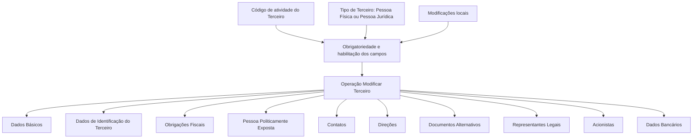

# Operação Modificar Terceiro — Processo e Blocos de Informação

## 1. Metadados do Documento
- **Arquivo de Origem:** Não identificado no conteúdo fornecido
- **Tipo de Documento:** Procedimento
- **Domínio / Sistema:** Reef / Mapfre
- **Público-Alvo:** Usuários do Sistema, Operação, Negócio
- **Data/Versão Identificada:** Não identificada

---

## 2. Resumo Executivo & Contexto de Negócio

O documento descreve a operação **Modificar Terceiro**, destinada a registrar, complementar, modificar e/ou inabilitar informações de um Terceiro no sistema. A operação é composta por blocos ou estruturas de informação que organizam os dados cadastrais, fiscais, de contato, representação legal, acionistas e dados bancários.

A obrigatoriedade e a habilitação dos campos não são uniformes. Esses comportamentos podem variar conforme o código de atividade do Terceiro e conforme o tipo de Terceiro, especificamente entre **Pessoa Física** e **Pessoa Jurídica**.

O documento também estabelece que modificações implementadas localmente podem alterar o comportamento da aplicação quanto à obrigatoriedade do registro de Dados do Terceiro. Portanto, as regras efetivas da operação podem depender de customizações locais não detalhadas no material.

A ordem de captura das informações nos blocos não é fixa. O usuário pode definir a sequência de preenchimento segundo seu próprio critério. Além disso, nem todas as atividades de Terceiros permitem registrar ou modificar dados em todas as estruturas apresentadas no processo.

---

## 3. Arquitetura, Componentes & Tecnologias Envolvidas

O conteúdo apresenta uma operação funcional composta por blocos de informação. Não há detalhamento de microsserviços, APIs, métodos HTTP, contratos JSON, banco de dados, ambientes técnicos, versões de software ou tecnologias de infraestrutura.

Os elementos citados incluem:
- Operação **Modificar Terceiro**.
- Blocos de Informação do cadastro de Terceiro.
- Sistema ou contexto documental **Reef**.
- Referências a **Mapfre** e **Mapfredocument**.
- Estado documental identificado como **Approved Source**.
- Referência de proprietário: `user:agonzalez_mapfre.com`.



**Nota de Análise:** O documento lista blocos de informação da operação, mas não especifica quais campos pertencem a cada bloco, quais campos são obrigatórios, nem quais atividades de Terceiros habilitam cada estrutura.

---

## 4. Regras de Negócio, Especificações Funcionais & Processos

### Finalidade da operação
A operação **Modificar Terceiro** permite executar uma ou mais das seguintes ações sobre informações de um Terceiro:
1. Registrar informações.
2. Complementar informações.
3. Modificar informações.
4. Inabilitar informações.

### Regras de obrigatoriedade e habilitação
1. A obrigatoriedade e/ou habilitação dos campos em cada bloco de dados pode variar de acordo com o **código de atividade do Terceiro**.
2. A obrigatoriedade e/ou habilitação dos campos também pode variar de acordo com o **Tipo de Terceiro**:
   - Pessoa Física.
   - Pessoa Jurídica.
3. Modificações implementadas localmente podem afetar o comportamento da aplicação em relação à obrigatoriedade do registro dos Dados do Terceiro.
4. Nem todas as atividades de Terceiros permitem registrar ou modificar informações em todas as estruturas de informação exibidas no processo.
5. Quando uma atividade não permitir registro ou modificação em determinada estrutura, essa restrição deve ser indicada e detalhada expressamente nos blocos de dados afetados.
6. O usuário pode variar a ordem de captura dos dados entre os blocos de informação.

### Blocos de informação identificados
- Dados Básicos.
- Dados de Identificação do Terceiro.
- Obrigações Fiscais.
- Pessoa Politicamente Exposta.
- Contatos.
- Direções.
- Documentos Alternativos.
- Representantes Legais.
- Acionistas.
- Dados Bancários.

**Nota de Análise:** O material menciona um “Exemplo de possíveis ações realizadas na mesma Operação de Modificação”, porém o exemplo não está detalhado no conteúdo extraído.

---

## 5. Tabelas de Parâmetros, Ambientes e Estruturas de Dados

| Item / Parâmetro | Descrição / Função | Tipo / Valores / Formato | Ambiente / Observações |
| :--- | :--- | :--- | :--- |
| Operação Modificar Terceiro | Permite registrar, complementar, modificar e/ou inabilitar informações do Terceiro. | Operação funcional | O documento não detalha interface, API ou transação técnica. |
| Código de atividade do Terceiro | Pode determinar obrigatoriedade e habilitação dos campos em blocos de informação. | Código de atividade | Valores não informados. |
| Tipo de Terceiro | Pode determinar obrigatoriedade e habilitação dos campos. | Pessoa Física; Pessoa Jurídica | Critérios detalhados não informados. |
| Modificações locais | Podem alterar o comportamento da aplicação quanto à obrigatoriedade dos Dados do Terceiro. | Customização local | Implementações locais não detalhadas. |
| Ordem de captura | Sequência de preenchimento dos blocos de informação. | Definida pelo usuário | Não há ordem obrigatória fixa descrita. |
| Dados Básicos | Bloco de informação da operação. | Estrutura de informação | Campos não detalhados. |
| Dados de Identificação do Terceiro | Bloco de informação da operação. | Estrutura de informação | Campos não detalhados. |
| Obrigações Fiscais | Bloco de informação exibido no processo. | Estrutura de informação | Regras e campos não detalhados. |
| Pessoa Politicamente Exposta | Bloco de informação exibido no processo. | Estrutura de informação | Critérios de classificação não detalhados. |
| Contatos | Bloco de informação da operação. | Estrutura de informação | Campos não detalhados. |
| Direções | Bloco de informação da operação. | Estrutura de informação | O termo é apresentado literalmente como “Direcciones” no conteúdo bruto. |
| Documentos Alternativos | Bloco de informação da operação. | Estrutura de informação | Campos e tipos de documento não detalhados. |
| Representantes Legais | Bloco de informação da operação. | Estrutura de informação | Regras não detalhadas. |
| Acionistas | Bloco de informação da operação. | Estrutura de informação | Regras não detalhadas. |
| Dados Bancários | Bloco de informação da operação. | Estrutura de informação | Campos bancários não detalhados. |
| Reef | Contexto documental identificado no cabeçalho. | Sistema / documentação | Relação técnica com a operação não detalhada. |
| Mapfre | Referência corporativa presente no conteúdo. | Organização / contexto | Papel específico não detalhado. |
| Owner | Proprietário exibido na plataforma documental. | `user:agonzalez_mapfre.com` | Valor reproduzido do conteúdo original. |
| Lifecycle | Estado do documento exibido na plataforma documental. | Approved Source | Sem data ou versão associada. |

---

## 6. Bateria de Perguntas & Respostas para RAG (FAQ Sintético)

### P1: Em que consiste a operação Modificar Terceiro?
**R:** A operação Modificar Terceiro consiste em registrar, complementar, modificar e/ou inabilitar informações relacionadas a um Terceiro no sistema.

### P2: Quais fatores podem alterar a obrigatoriedade dos campos no cadastro de um Terceiro?
**R:** A obrigatoriedade e/ou habilitação dos campos pode variar conforme o código de atividade do Terceiro, o tipo de Terceiro — Pessoa Física ou Pessoa Jurídica — e modificações implementadas localmente.

### P3: O tipo de Terceiro influencia os campos que podem ser preenchidos?
**R:** Sim. O documento informa que a obrigatoriedade e/ou habilitação dos campos pode variar quando o Tipo de Terceiro é Pessoa Física ou Pessoa Jurídica. Os critérios específicos para cada tipo não são detalhados.

### P4: O usuário deve preencher os blocos de informação em uma ordem fixa?
**R:** Não. O documento estabelece que a ordem de captura dos dados nos blocos de informação pode variar conforme o critério seguido pelo usuário no sistema.

### P5: Todas as atividades de Terceiros permitem alterar todos os blocos de informação?
**R:** Não. Nem todas as atividades de Terceiros permitem registrar ou modificar informações em todas as estruturas apresentadas no processo. As restrições devem ser explicitadas nos blocos de dados afetados.

### P6: Quais blocos de informação são citados na operação Modificar Terceiro?
**R:** São citados Dados Básicos, Dados de Identificação do Terceiro, Obrigações Fiscais, Pessoa Politicamente Exposta, Contatos, Direções, Documentos Alternativos, Representantes Legais, Acionistas e Dados Bancários.

### P7: As customizações locais podem impactar a operação Modificar Terceiro?
**R:** Sim. O documento informa que modificações implementadas localmente podem afetar o comportamento da aplicação em relação à obrigatoriedade do registro dos Dados do Terceiro.

### P8: O documento detalha os campos do bloco Dados Bancários?
**R:** Não. O documento apenas lista Dados Bancários como um bloco de informação no processo, sem descrever campos, formatos, validações ou critérios de obrigatoriedade.

### P9: O documento especifica métodos HTTP, APIs ou contratos JSON da operação?
**R:** Não. O conteúdo não apresenta métodos HTTP, endpoints, APIs, contratos JSON, serviços técnicos ou especificações de integração.

### P10: Como o documento orienta o tratamento de blocos não permitidos para determinada atividade de Terceiro?
**R:** O documento determina que, quando uma atividade de Terceiro não permitir registro ou modificação em determinada estrutura de informação, essa condição deve ser indicada e detalhada expressamente nos blocos de dados afetados.

---

## 7. Glossário de Termos, Siglas & Conceitos-Chave

- **Terceiro:** Entidade cujas informações podem ser registradas, complementadas, modificadas ou inabilitadas na operação descrita.
- **Pessoa Física:** Tipo de Terceiro mencionado como fator que pode influenciar a obrigatoriedade e habilitação dos campos.
- **Pessoa Jurídica:** Tipo de Terceiro mencionado como fator que pode influenciar a obrigatoriedade e habilitação dos campos.
- **Pessoa Politicamente Exposta:** Bloco de informação presente no processo. O documento não define critérios ou regras de identificação.
- **Dados Básicos:** Bloco de informação da operação Modificar Terceiro.
- **Dados de Identificação do Terceiro:** Bloco de informação da operação Modificar Terceiro.
- **Obrigações Fiscais:** Bloco de informação listado no processo.
- **Documentos Alternativos:** Bloco de informação listado no processo.
- **Representantes Legais:** Bloco de informação listado no processo.
- **Acionistas:** Bloco de informação listado no processo.
- **Dados Bancários:** Bloco de informação listado no processo.
- **Reef:** Referência ao contexto de documentação apresentada no conteúdo.
- **Mapfre:** Referência corporativa exibida na plataforma documental.
- **Lifecycle:** Campo de ciclo de vida documental exibido com o valor `Approved Source`.

---

## 8. Notas Críticas, Riscos & Limitações

- O conteúdo não identifica o arquivo original, a versão do documento, a data de publicação ou a data de atualização.
- O documento não apresenta detalhes de campos, formatos, validações específicas ou regras condicionais por código de atividade.
- Não há mapeamento entre códigos de atividade e os blocos de informação permitidos ou obrigatórios.
- As modificações locais podem afetar a obrigatoriedade dos dados, mas as customizações aplicáveis não são descritas.
- Não há definição técnica de APIs, integrações, serviços, banco de dados, URLs, ambientes, credenciais, logs ou procedimentos de erro.
- O termo exibido como “Direcciones” foi preservado no conteúdo bruto; a interpretação como “Direções” foi utilizada apenas para organizar a estrutura em português.
- O texto extraído contém caracteres potencialmente corrompidos, como `Modicar` e `Identicación`, o que pode indicar limitação no processo de extração do documento original.

---

## 9. Conteúdo Bruto Estruturado (Referência Fiel)

```text
--- [PÁGINA 1 DE 2] ---

OPERACIÓN MODIFICAR Tercero
¿En que consiste?
Esta operación consiste en Registrar, Complementar, Modicar y/o Inhabilitar la información del Tercero.
Premisas
La obligatoriedad y/o la habilitación de los campos en el registro de los datos de cada uno de los bloques o estructuras de información
puede variar de acuerdo con el código de actividad del Tercero.
La obligatoriedad y/o la habilitación de los campos en el registro de los datos de cada uno de los bloques o estructuras de información
también pueden variar si el Tipo de Tercero es una Persona Física o una Persona Jurídica.
Las modicaciones que se hubieran podido implementar localmente a su vez pueden afectar el comportamiento de la aplicación en
relación con la obligatoriedad en el registro de los Datos del Tercero.
Por último, el orden de captura de los datos en los distintos bloques de Información puede variar de acuerdo con el criterio seguido por el
Usuario en el Sistema.
Proceso
Datos
Básicos
Datos
Identificación
Obligaciones
Fiscales
Persona
Políticamente
Expuesta
Contactos Direcciones Documentos
Alternativos
Representantes
Legales Accionistas Datos
Bancarios
No todas las Actividades de los Terceros permiten registrar o modicar la información en todas las estructuras de Información que se
muestran en el Proceso dibujado, lo cual se indicará y detallará expresamente en los Bloques de Datos afectados.
BLOQUES de Información
 Datos Básicos ( )
 Datos Identicación Tercero ( )
 Persona Políticamente Expuesta(   )
 Contactos (   )
 Direcciones (   )
 Documentos Alternativos (   )
 Representantes Legales (   )
Ejemplo de posibles acciones realizadas en la misma Operación de Modicación:
Documentation / DOCUMENTACIÓN Reef
DOCUMENTACIÓN Reef
Mapfredocument
DOCUMENTACIÓN Reef
Owner
user:agonzalez_mapfre.com
Lifecycle
Approved Source
 / 
 VL
Buscar Inicio Soluciones Arquitecturas APIs Componentes Cloud Documentación Zeus Reef Ayuda
ES


--- [PÁGINA 2 DE 2] ---

Accionistas (   )
 Datos Bancarios (   )
Checking links...
```
