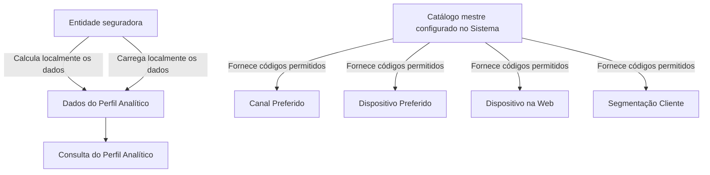

# Perfil Analítico do Terceiro — Consulta de Dados Calculados pela Entidade Seguradora

## 1. Metadados do Documento
- **Arquivo de Origem:** Não identificado no conteúdo fornecido
- **Tipo de Documento:** Especificação Funcional
- **Domínio / Sistema:** Reef / MAPFRE / Perfil Analítico do Terceiro
- **Público-Alvo:** Negócio, analistas funcionais, equipes de dados e desenvolvedores
- **Data/Versão Identificada:** Não identificada

---

## 2. Resumo Executivo & Contexto de Negócio

O documento descreve o bloco de informação **Perfil Analítico**, destinado à visualização de dados analíticos associados a um terceiro ou segurado. A ação explicitamente indicada é **CONSULTAR**, sem detalhamento de operações de criação, edição, exclusão ou integração técnica.

Os dados do Perfil Analítico são calculados e carregados localmente pela entidade seguradora. A entidade seguradora é indicada como responsável final pela qualidade e coerência dos dados apresentados. O documento não detalha os modelos estatísticos, processos de carga, periodicidade de atualização, origem dos dados ou regras de governança aplicadas.

O Perfil Analítico reúne indicadores de valor e relacionamento do cliente, propensão comercial, comportamento digital, preferências de contato, indicadores de crédito e presença em canais digitais. Entre os elementos descritos estão C.L.T.V., probabilidade de abandono, probabilidades de up selling e cross selling por ramo, índice de relação, integralidade, recorrência de navegação e segmentação de cliente.

Alguns atributos dependem de catálogos mestres configurados no sistema. Especificamente, os valores de **Canal Preferido**, **Dispositivo Preferido**, **Dispositivo na Web** e **Segmentação Cliente** devem utilizar códigos definidos em seus catálogos associados.

---

## 3. Arquitetura, Componentes & Tecnologias Envolvidas

O conteúdo disponibilizado não apresenta uma arquitetura técnica detalhada, microsserviços, APIs, protocolos, bancos de dados, servidores, URLs, ambientes, métodos HTTP ou contratos de integração.

Os componentes e contextos explicitamente mencionados são:

| Componente / Contexto | Papel descrito no documento |
| :--- | :--- |
| Perfil Analítico | Bloco de informação para visualização de dados analíticos do terceiro ou segurado. |
| Entidade seguradora | Realiza localmente o cálculo e a carga das informações; é responsável final pela qualidade e coerência dos dados. |
| Sistema | Possui catálogo mestre configurado para códigos de determinados atributos. |
| MAPFRE | Organização referenciada nas interações, produtos, serviços, página web e aplicações. |
| Reef | Contexto de documentação exibido no conteúdo bruto. |
| Ramo Técnico de Automóveis | Referência para as probabilidades de up selling e cross selling MOTOR. |
| Produto de Hogar | Referência para probabilidades de up selling e cross selling Hogar. |
| Produto de Salud | Referência para probabilidades de up selling e cross selling Salud. |



> **Nota de Análise:** O documento não especifica como a entidade seguradora calcula os dados, como realiza a carga local, quais interfaces disponibilizam a consulta ou quais controles validam a qualidade e a coerência das informações.

---

## 4. Regras de Negócio, Especificações Funcionais & Processos

### Ação disponível
- A ação indicada para o bloco de informação Perfil Analítico é **CONSULTAR**.
- O documento não descreve permissões, perfis de acesso, filtros, critérios de busca, paginação, exportação ou funcionalidades de alteração dos dados.

### Responsabilidade sobre os dados
- A entidade seguradora realiza localmente o cálculo e a carga das informações do Perfil Analítico.
- A entidade seguradora é a responsável final pela qualidade e coerência dos dados.
- O documento não define indicadores de qualidade, validações de consistência, processos de aprovação ou tratamento de dados ausentes.

### Regras de catálogo mestre
Os seguintes atributos devem conter códigos de acordo com os valores existentes no catálogo mestre configurado no Sistema:
- Canal Preferido;
- Dispositivo Preferido;
- Dispositivo na Web;
- Segmentação Cliente.

O documento não informa os códigos concretos, a estrutura dos catálogos, responsáveis pela manutenção, vigência dos valores ou comportamento para códigos inválidos.

### Regras específicas por atributo

- **C.L.T.V.:** representa o *customer lifetime value*, ou valor do tempo de vida do cliente. É uma previsão sobre a quantidade de dinheiro que a empresa espera receber de um usuário durante todo o período em que o usuário permanecer como cliente.
  - Caso o dado de C.L.T.V. não esteja disponível, deve ser incluída a margem de contribuição.
  - Caso a margem de contribuição também não esteja disponível, deve ser incluído o ratio combinado.

- **Probabilidade de Abandono:** representa uma previsão de abandono usada para identificar antecipadamente consumidores com alta probabilidade de deixarem de ser clientes da empresa. O campo contém o valor atribuído pela entidade de acordo com seus modelos estatísticos.

- **Probabilidade Up Selling MOTOR:** probabilidade associada à técnica de venda adicional, na qual o cliente é convidado a comprar artigos mais caros, atualizações ou complementos para gerar maior receita para a entidade seguradora. A probabilidade é referenciada ao Ramo Técnico de Automóveis.

- **Probabilidade Cross Selling MOTOR:** probabilidade associada à venda cruzada de produtos complementares aos produtos que o cliente consome ou pretende consumir. A probabilidade é referenciada ao Ramo Técnico de Automóveis.

- **Probabilidade Up Selling Hogar:** segue a mesma definição apresentada para Probabilidade Up Selling MOTOR, mas aplicada ao Produto de Hogar.

- **Probabilidade Cross Selling Hogar:** segue a mesma definição apresentada para Probabilidade Cross Selling MOTOR, mas aplicada ao Produto de Hogar.

- **Probabilidade Up Selling Salud:** segue a mesma definição apresentada para Probabilidade Up Selling MOTOR, mas aplicada ao Produto de Salud.

- **Probabilidade Cross Selling Salud:** segue a mesma definição apresentada para Probabilidade Cross Selling MOTOR, mas aplicada ao Produto de Salud.

- **Indicador Saturação:** indica o número total de contatos recebidos pelo cliente por parte da MAPFRE, considerando todos os produtos e serviços contratados.

- **Índice Relação:** mostra o número de apólices contratadas pelo cliente, independentemente do ramo em que as apólices foram emitidas.

- **Integralidade:** mostra o número de produtos e apólices contratados em diferentes ramos pelo cliente.

- **Quantidade de Beneficiários:** mostra o número de beneficiários do cliente.

- **Canal Preferido:** indica o canal de contato preferido pelo cliente para interagir com a MAPFRE; os valores possíveis estão no catálogo associado.

- **Dispositivo Preferido:** indica o dispositivo preferido utilizado pelo cliente para interagir com a MAPFRE; os valores possíveis estão no catálogo associado.

- **Credit Score:** é uma pontuação de crédito, expressa numericamente, baseada em análise do nível dos arquivos de crédito de uma pessoa para representar a sua solvência. A solvência é baseada principalmente em relatório de crédito geralmente obtido em bureaux de crédito.

- **Hora Dia:** deve indicar a faixa horária do dia em que o segurado navega pela Internet.

- **Recorrência:** representa a faixa horária de maior recorrência em que o cliente navega pela Internet.

- **Frequência Visita:** mostra o número de vezes em que o cliente visita a página web da MAPFRE.

- **Visitantes Multi Dispositivo:** indica se o segurado visitou a página web da MAPFRE a partir de mais de um dispositivo diferente.

- **Tempo na Web:** mede, em segundos, o tempo durante o qual o cliente navega pela web da MAPFRE.

- **Sections Site:** mostra a seção da página web em que o cliente contratou o produto ou serviço da MAPFRE.

- **Dispositivo na Web:** registra o dispositivo utilizado pelo cliente para acessar serviços ou a página web da MAPFRE; os valores possíveis estão no catálogo associado.

- **Followers:** contém o número de seguidores do segurado, conforme os procedimentos de cálculo da entidade seguradora. O documento define *Follower* como pessoa interessada em algo ou alguém, que acompanha sua evolução, trabalho ou trajetória, especialmente nas redes sociais.

- **Suscriptores:** indica o número de inscritos que o cliente possui em seu canal do YouTube.

- **App Engagement:** mede o número de aplicações diferentes da MAPFRE utilizadas pelo cliente.

- **Segmentação Cliente:** identifica a segmentação atual do cliente; os valores possíveis estão no catálogo associado.

---

## 5. Tabelas de Parâmetros, Ambientes e Estruturas de Dados

| Item / Parâmetro | Descrição / Função | Tipo / Valores / Formato | Ambiente / Observações |
| :--- | :--- | :--- | :--- |
| Ação | Consulta do bloco Perfil Analítico | `CONSULTAR` | Não há outras ações descritas. |
| C.L.T.V. | Previsão de receita esperada durante o relacionamento do usuário como cliente | Não especificado | Se indisponível, usar margem de contribuição; se também indisponível, usar ratio combinado. |
| Margem de contribuição | Dado substituto para C.L.T.V. | Não especificado | Usado somente se C.L.T.V. não estiver disponível. |
| Ratio combinado | Dado substituto final para C.L.T.V. | Não especificado | Usado se C.L.T.V. e margem de contribuição não estiverem disponíveis. |
| Probabilidade de Abandono | Previsão de chance de o consumidor deixar de ser cliente | Não especificado | Valor atribuído pela entidade conforme modelos estatísticos. |
| Probabilidade Up Selling MOTOR | Probabilidade de venda adicional no Ramo Técnico de Automóveis | Não especificado | Referenciada ao ramo de Automóveis. |
| Probabilidade Cross Selling MOTOR | Probabilidade de venda de produtos complementares no Ramo Técnico de Automóveis | Não especificado | Referenciada ao ramo de Automóveis. |
| Probabilidade Up Selling Hogar | Probabilidade de venda adicional para Produto de Hogar | Não especificado | Mesma lógica de Up Selling MOTOR, aplicada a Hogar. |
| Probabilidade Cross Selling Hogar | Probabilidade de venda cruzada para Produto de Hogar | Não especificado | Mesma lógica de Cross Selling MOTOR, aplicada a Hogar. |
| Probabilidade Up Selling Salud | Probabilidade de venda adicional para Produto de Salud | Não especificado | Mesma lógica de Up Selling MOTOR, aplicada a Salud. |
| Probabilidade Cross Selling Salud | Probabilidade de venda cruzada para Produto de Salud | Não especificado | Mesma lógica de Cross Selling MOTOR, aplicada a Salud. |
| Indicador Saturação | Número total de contatos recebidos pelo cliente da MAPFRE | Número | Considera todos os produtos e serviços contratados. |
| Índice Relação | Número de apólices contratadas pelo cliente | Número | Independe do ramo de emissão das apólices. |
| Integralidade | Número de produtos e apólices de diferentes ramos contratados | Número | Não há fórmula de cálculo descrita. |
| Quantidade de Beneficiários | Número de beneficiários do cliente | Número | Não há critérios de inclusão detalhados. |
| Canal Preferido | Canal preferido de contato do cliente com a MAPFRE | Código de catálogo | Valores definidos no catálogo associado. |
| Dispositivo Preferido | Dispositivo preferido de interação do cliente com a MAPFRE | Código de catálogo | Valores definidos no catálogo associado. |
| Credit Score | Pontuação numérica de solvência baseada em análise de arquivos de crédito | Pontuação numérica | Baseada principalmente em relatório de crédito de bureaux de crédito. |
| Hora Dia | Faixa horária do dia em que o segurado navega na Internet | Faixa horária | Formato e valores não especificados. |
| Recorrência | Faixa horária de maior recorrência de navegação do cliente | Faixa horária | Formato e valores não especificados. |
| Frequência Visita | Número de visitas à página web da MAPFRE | Número | Período de medição não especificado. |
| Visitantes Multi Dispositivo | Indica acesso à página web por mais de um dispositivo | Não especificado | O documento não define valores booleanos ou critérios temporais. |
| Tempo na Web | Tempo de navegação do cliente na web da MAPFRE | Segundos | Janela de medição não especificada. |
| Sections Site | Seção da página web onde ocorreu a contratação | Não especificado | Não há catálogo ou estrutura de seções apresentada. |
| Dispositivo na Web | Dispositivo usado para acessar serviços ou página web da MAPFRE | Código de catálogo | Valores definidos no catálogo associado. |
| Followers | Número de seguidores do segurado | Número | Calculado conforme procedimentos da entidade seguradora. |
| Suscriptores | Número de inscritos no canal de YouTube do cliente | Número | Não há integração ou origem detalhada. |
| App Engagement | Número de aplicações MAPFRE diferentes utilizadas pelo cliente | Número | Não há período de medição especificado. |
| Segmentação Cliente | Segmentação atual do cliente | Código de catálogo | Valores definidos no catálogo associado. |

---

## 6. Bateria de Perguntas & Respostas para RAG (FAQ Sintético)

### P1: Qual é o objetivo do bloco de informação Perfil Analítico?
**R:** O bloco de informação Perfil Analítico tem como objetivo permitir a visualização dos dados do perfil analítico de um terceiro ou segurado. Os dados são calculados e carregados localmente pela entidade seguradora, que mantém a responsabilidade final pela qualidade e coerência dessas informações.

### P2: Qual ação está disponível para o Perfil Analítico?
**R:** O documento apresenta exclusivamente a ação **CONSULTAR** para o Perfil Analítico. Não há descrição de ações de criação, alteração, exclusão, exportação ou aprovação dos dados.

### P3: Quem é responsável pela qualidade e coerência dos dados do Perfil Analítico?
**R:** A entidade seguradora é responsável pela qualidade e coerência dos dados do Perfil Analítico. O documento informa que o cálculo e a carga das informações são realizados localmente pela própria entidade seguradora.

### P4: Qual é a regra de fallback quando o C.L.T.V. não está disponível?
**R:** Quando o C.L.T.V. não está disponível, deve ser utilizada a margem de contribuição. Se a margem de contribuição também não estiver disponível, deve ser utilizado o ratio combinado.

### P5: Como é definida a Probabilidade de Abandono?
**R:** A Probabilidade de Abandono é uma previsão destinada a identificar antecipadamente consumidores com alta probabilidade de deixarem de ser clientes. O campo contém o valor que a entidade atribui ao segurado com base em seus modelos estatísticos.

### P6: A que se referem as probabilidades de Up Selling e Cross Selling MOTOR?
**R:** As probabilidades de Up Selling MOTOR e Cross Selling MOTOR são referenciadas ao Ramo Técnico de Automóveis. Up selling corresponde à venda adicional de itens mais caros, atualizações ou complementos; cross selling corresponde à venda de produtos complementares aos produtos que o cliente consome ou pretende consumir.

### P7: O que mede o Indicador Saturação?
**R:** O Indicador Saturação mede o número total de contatos recebidos pelo cliente por parte da MAPFRE, considerando todos os produtos e serviços que o cliente possui contratados.

### P8: Qual é a diferença entre Índice Relação e Integralidade?
**R:** O Índice Relação mostra o número de apólices contratadas pelo cliente, independentemente do ramo em que foram emitidas. A Integralidade mostra o número de produtos e apólices de diferentes ramos contratados pelo cliente.

### P9: Quais atributos dependem de catálogos associados?
**R:** Canal Preferido, Dispositivo Preferido, Dispositivo na Web e Segmentação Cliente dependem de catálogos associados. Seus valores devem utilizar códigos definidos no catálogo mestre configurado no Sistema.

### P10: O que representa o atributo Visitantes Multi Dispositivo?
**R:** Visitantes Multi Dispositivo indica se o segurado visitou a página web da MAPFRE utilizando mais de um dispositivo diferente. O documento não informa o formato do atributo nem a janela temporal usada para essa verificação.

### P11: Como são medidos Tempo na Web e Frequência Visita?
**R:** Tempo na Web mede em segundos o período em que o cliente está navegando na web da MAPFRE. Frequência Visita mostra o número de vezes que o cliente visita a página web da MAPFRE. O documento não especifica o período de apuração de nenhum dos dois indicadores.

### P12: O que significa App Engagement no Perfil Analítico?
**R:** App Engagement mede o número de aplicações diferentes da MAPFRE que o cliente utiliza. O conteúdo não detalha quais aplicações são consideradas, como o uso é capturado ou qual período é utilizado no cálculo.

---

## 7. Glossário de Termos, Siglas & Conceitos-Chave

- **C.L.T.V.:** *Customer Lifetime Value*; previsão da quantidade de dinheiro que a empresa espera receber de um usuário durante todo o tempo em que permanecer como cliente.
- **Credit Score:** pontuação numérica usada para representar a solvência de um indivíduo, baseada em análise de arquivos e relatórios de crédito.
- **Cross Selling:** venda cruzada de produtos complementares aos produtos que o cliente consome ou pretende consumir.
- **Follower:** pessoa interessada em algo ou alguém que acompanha evolução, trabalho ou trajetória, especialmente em redes sociais.
- **MAPFRE:** organização mencionada como referência para produtos, serviços, aplicações e página web do cliente.
- **MOTOR:** referência ao Ramo Técnico de Automóveis.
- **Perfil Analítico:** bloco de informação usado para consultar atributos analíticos associados ao terceiro ou segurado.
- **Ratio combinado:** dado utilizado como última alternativa para C.L.T.V. quando não há C.L.T.V. nem margem de contribuição disponíveis.
- **Up Selling:** venda adicional em que o cliente é convidado a comprar artigos mais caros, atualizações ou complementos.
- **Visitantes Multi Dispositivo:** indicador de acesso do segurado à página web da MAPFRE a partir de mais de um dispositivo.

---

## 8. Notas Críticas, Riscos & Limitações

- O documento não apresenta arquitetura técnica, APIs, microsserviços, métodos HTTP, contratos JSON, banco de dados, infraestrutura, URLs, servidores, portas ou ambientes.
- O documento não informa os valores nem a estrutura dos catálogos associados a Canal Preferido, Dispositivo Preferido, Dispositivo na Web e Segmentação Cliente.
- Os modelos estatísticos usados para Probabilidade de Abandono e demais probabilidades não são detalhados.
- Não há definição de formato, escala, faixas válidas, período de cálculo ou periodicidade de atualização para os indicadores numéricos e comportamentais.
- Não são descritas regras de tratamento para dados incompletos, exceto a cadeia de substituição de C.L.T.V. por margem de contribuição e, posteriormente, ratio combinado.
- O documento não especifica controles de acesso, auditoria, regras de privacidade, consentimento, retenção ou proteção de dados pessoais.
- **Nota de Análise:** Apesar de indicar que os dados são calculados e carregados localmente, o documento não detalha o processo operacional, as fontes de origem ou as validações realizadas pela entidade seguradora.

---

## 9. Conteúdo Bruto Estruturado (Referência Fiel)

```text
--- [PÁGINA 1 DE 3] ---

CONSULTAR Perl Analítico
Objetivo
El propósito de este Bloque de Información es poder visualizar los datos del Perl Analítico del Tercero de acuerdo con el proceso de cálculo
y carga de la información efectuada localmente por la Entidad aseguradora, responsable última de la calidad y coherencia de los Datos.
Los valores de los Datos: Canal y Dispositivo Preferido, Dispositivo en la Web y Segmentación Cliente deben contener determinados
códigos de acuerdo con la relación de los valores existentes en el catálogo maestro congurado en el Sistema.
Posibles Acciones
 CONSULTAR ( )
Perl Analítico
C.L.T.V
Contendrá el El customer lifetime value o valor del tiempo de vida del cliente que no es sino un pronóstico sobre la cantidad de dinero que
espera recibir la empresa por parte de un usuario, durante todo el tiempo en que este siga siendo su cliente.
Si no se dispone de este dato deberá incluirse el margen de contribución y si tampoco se cuenta con él, el ratio combinado.
Probabilidad de Abandono
La predicción de abandono es una técnica de marketing que busca identicar tempranamente a aquellos consumidores que tienen una alta
probabilidad de dejar de ser clientes de la empresa.
Documentation / DOCUMENTACIÓN Reef
DOCUMENTACIÓN Reef
Mapfredocument
DOCUMENTACIÓN Reef
Owner
user:agonzalez_mapfre.com
Lifecycle
Approved Source
 / 
 VL
Buscar Inicio Soluciones Arquitecturas APIs Componentes Cloud Documentación Zeus Reef Ayuda
ES


--- [PÁGINA 2 DE 3] ---

Este Campo contiene el valor que la entidad, de acuerdo con sus modelos estadísticos, asigna al Asegurado.
Probabilidad Up Selling MOTOR
En Marketing, se denomina 'Venta Adicional' a la técnica de ventas en la que un vendedor invita al cliente a comprar artículos más caros,
actualizaciones u otros complementos para generar mayores ingresos para la Entidad Aseguradora ... En este caso la probabilidad estaría
referenciada al Ramo Técnico de Automóviles.
Probabilidad Cross Selling MOTOR
En marketing, se llama 'Venta Cruzada' a la táctica mediante la cual un vendedor intenta vender productos complementarios a los que
consume o pretende consumir un cliente, en este caso la probabilidad está referenciada al Ramo Técnico de Automóviles.
Probabilidad Up Selling Hogar
Similar a lo indicado previamente en el dato de Probabilidad de Up Selling MOTOR pero en esta ocasión para el Producto de Hogar.
Probabilidad Cross Selling Hogar
Similar a lo indicado previamente en el Atributo de Probabilidad de Cross Selling MOTOR pero en esta ocasión para el Producto de Hogar.
Probabilidad Up Selling Salud
Similar a lo indicado previamente en el dato de Probabilidad de Up Selling MOTOR pero en esta ocasión para el Producto de Salud.
Probabilidad Cross Selling Salud
Similar a lo indicado previamente en el Atributo de Probabilidad de Cross Selling MOTOR pero en esta ocasión para el Producto de Salud.
Indicador Saturación
Este Atributo indica el número de contactos totales recibidos por el Cliente por parte de MAPFRE para todos sus productos y servicios
contratados.
Índice Relación
Muestra el número de pólizas contratadas por el Cliente, independientemente del ramo en el que estén emitidas.
Integralidad
Muestra el número de productos y pólizas de diferentes ramos contratadas por el Cliente.
Cantidad de Beneciarios
Este Dato muestra el número de beneciarios del Cliente.
Canal Preferido
Indica el canal preferido de contacto del Cliente para interaccionar con MAPFRE. Los valores posibles de este atributo se enumeran en su
catálogo asociado.
Dispositivo Preferido
Indica el dispositivo preferido utilizado por el Cliente para interaccionar con MAPFRE. Los valores posibles de este atributo se enumeran en
su catálogo asociado
Credit Score
Una puntuación de crédito es una expresión numérica basada en un análisis de nivel de los archivos de crédito de una persona, para
representar la solvencia de un individuo, solvencia basada principalmente en un informe de crédito que generalmente se obtiene de las
ocinas de crédito.
Hora Día
Este Campo deber indicar el tramo horario del día en las cuáles el Asegurado navega por Internet.


--- [PÁGINA 3 DE 3] ---

Recurrencia
Franja horaria de recurrencia más alta en la que el Cliente navega por Internet.
Frecuencia Visita
Muestra el número de veces en las que el Cliente visita la página web de MAPFRE.
Visitantes Multi Dispositivo
Indica si el Asegurado ha visitado la página web de MAPFRE desde más de un dispositivo diferente.
Tiempo en la Web
Mide el tiempo en segundos que el Cliente está navegando por la web de MAPFRE.
Sections Site
Muestra la sección de la página web en la que el Cliente contrató el producto o servicio de MAPFRE.
Dispositivo en la Web
Recoge el dispositivo que utiliza el Cliente para acceder a los servicios o la página web de MAPFRE. Los valores posibles de este atributo se
enumeran en su catálogo asociado.
Followers
Sabiendo que un Follower es una Persona interesada en algo o alguien y que siguen su evolución, su trabajo o su trayectoria, especialmente
en las redes sociales, este dato del Perl Analítico de los Asegurados contendrá el número de Followers del mismo (de acuerdo con los
procedimientos de cálculo de la entidad aseguradora)
Suscriptores
Indica el número de subscriptores que tiene el Cliente a su canal de YouTube.
App Engagement
Mide el número de aplicaciones diferentes de MAPFRE que utiliza el Cliente.
Segmentación Cliente
Identica la segmentación actual del Cliente. Los valores posibles de este atributo se enumeran en su catálogo asociado.
```
