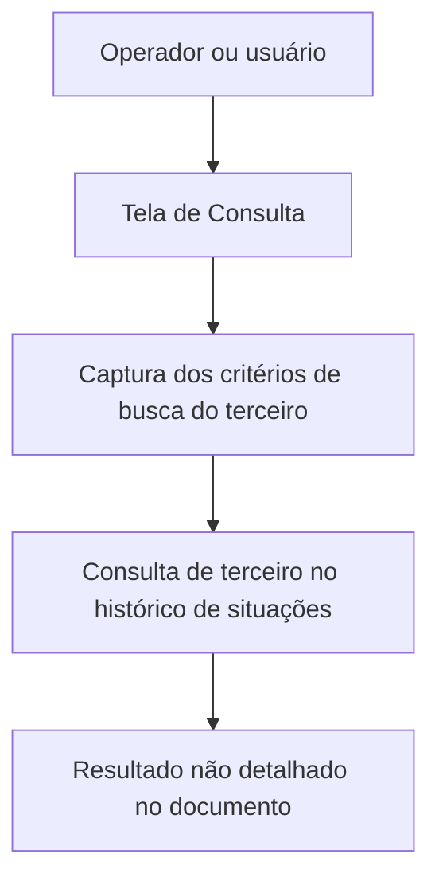

# Consulta de Terceiro por Situação no Histórico — Operação Reef

## 1. Metadados do Documento
- **Arquivo de Origem:** Não identificado
- **Tipo de Documento:** Procedimento
- **Domínio / Sistema:** Reef / Mapfre
- **Público-Alvo:** Usuários de operação e consulta
- **Data/Versão Identificada:** Não identificada

---

## 2. Resumo Executivo & Contexto de Negócio

O documento descreve a operação **“Consultar Tercero por Situación en Histórico”** no contexto da documentação Reef. O objetivo declarado é capturar, na tela de consulta, os critérios de busca de um terceiro cujas combinações permitem realizar uma consulta no histórico de situações.

A operação está associada aos dados do terceiro, identificados no documento pela seção **“Datos del Tercero”**. A captura de informações segue uma sequência de preenchimento definida pela disposição dos campos na tela: da esquerda para a direita e de cima para baixo.

O conteúdo disponível apresenta o objetivo funcional da consulta, mas não detalha quais campos compõem os critérios de busca, quais combinações são válidas, quais resultados são retornados ou quais regras de validação são aplicadas.

A documentação contém referências ao ambiente documental Reef, à Mapfre e ao estado de ciclo de vida **“Approved Source”**. Não há evidência textual de integrações, APIs, tecnologias, métodos HTTP, contratos de dados, ambientes técnicos ou rotas operacionais.

---

## 3. Arquitetura, Componentes & Tecnologias Envolvidas

Os elementos explicitamente citados são:

| Componente / Elemento | Descrição baseada no documento |
| :--- | :--- |
| Reef | Ambiente ou contexto de documentação mencionado como “DOCUMENTACIÓN Reef”. |
| Tela de Consulta | Interface onde os critérios de busca do terceiro devem ser capturados. |
| Consulta de Terceiro por Situação no Histórico | Operação que consulta um terceiro no histórico de situações. |
| Dados do Terceiro | Seção funcional relacionada à consulta. |
| Mapfre | Referência corporativa presente no texto por meio de “Mapfredocument”. |
| Owner | Proprietário identificado como `user:agonzalez_mapfre.com`. |
| Lifecycle | Classificação apresentada como `Approved Source`. |



**Nota de Análise:** o diagrama representa apenas a sequência funcional explicitamente descrita. O documento não informa componentes de backend, banco de dados, serviços, APIs, protocolos, autenticação ou tecnologias de implementação.

---

## 4. Regras de Negócio, Especificações Funcionais & Processos

1. A operação tem como objetivo capturar, na tela de consulta, os critérios de busca relacionados a um terceiro.
2. As combinações dos critérios capturados devem possibilitar a consulta do terceiro no histórico de situações.
3. A sequência de captura das informações deve seguir a ordem visual dos campos:
   1. Da esquerda para a direita.
   2. De cima para baixo.
4. O documento associa a operação à seção ou ao contexto de **Dados do Terceiro**.
5. O documento não identifica os nomes dos campos de busca.
6. O documento não especifica valores permitidos, obrigatoriedade, regras de combinação, mensagens de erro, critérios de retorno ou comportamento para consultas sem resultado.
7. O documento não detalha o conceito funcional de “Situação”, nem quais estados históricos podem ser consultados.

---

## 5. Tabelas de Parâmetros, Ambientes e Estruturas de Dados

| Item / Parâmetro | Descrição / Função | Tipo / Valores / Formato | Ambiente / Observações |
| :--- | :--- | :--- | :--- |
| Critérios de busca do terceiro | Informações capturadas na tela de consulta para permitir a consulta no histórico de situações. | Não especificado | Os campos concretos não são detalhados. |
| Combinações de critérios | Combinações que possibilitam realizar a consulta do terceiro no histórico de situações. | Não especificado | Regras de combinação não detalhadas. |
| Ordem de captura | Define a sequência de preenchimento das informações. | Esquerda para direita; cima para baixo | Regra explicitamente descrita. |
| Dados do Terceiro | Contexto funcional relacionado à operação de consulta. | Não especificado | Não há estrutura de dados descrita. |
| Owner | Proprietário da documentação. | `user:agonzalez_mapfre.com` | Informação documental. |
| Lifecycle | Estado de ciclo de vida da documentação. | `Approved Source` | Informação documental. |
| Idioma da interface documental | Idioma exibido na navegação. | `ES` | Referência presente no conteúdo bruto. |

---

## 6. Bateria de Perguntas & Respostas para RAG (FAQ Sintético)

### P1: Qual é o objetivo da operação “Consultar Tercero por Situación en Histórico”?
**R:** O objetivo é capturar, na tela de consulta, os critérios de busca de um terceiro cujas combinações permitam realizar a consulta desse terceiro no histórico de situações.

### P2: Onde os critérios de busca do terceiro devem ser informados?
**R:** Os critérios de busca devem ser capturados na tela de consulta, conforme indicado no objetivo da operação.

### P3: Qual é a ordem de preenchimento dos campos da consulta?
**R:** A sequência de captura deve seguir a disposição visual dos campos: da esquerda para a direita e de cima para baixo.

### P4: Quais campos compõem os critérios de busca do terceiro?
**R:** O documento não identifica os campos que compõem os critérios de busca. Apenas informa que existem campos cuja sequência de captura deve ser seguida.

### P5: Quais combinações de critérios são aceitas para consultar o histórico?
**R:** O documento informa que as combinações dos critérios possibilitam a consulta, mas não define quais combinações são válidas ou obrigatórias.

### P6: A operação descreve quais informações são retornadas pela consulta histórica?
**R:** Não. O conteúdo disponível não descreve os dados retornados, o formato da resposta, a apresentação dos resultados ou o comportamento para ausência de registros.

### P7: O documento descreve APIs, microsserviços ou integrações técnicas para a consulta?
**R:** Não. Não há descrição de APIs, microsserviços, métodos HTTP, contratos JSON, bancos de dados, protocolos ou integrações técnicas.

### P8: Qual é o domínio ou sistema associado ao documento?
**R:** O documento faz referência à documentação Reef e à Mapfre por meio dos termos “DOCUMENTACIÓN Reef” e “Mapfredocument”.

### P9: Quem é o proprietário indicado para a documentação?
**R:** O proprietário indicado é `user:agonzalez_mapfre.com`.

### P10: Qual é o estado de ciclo de vida apresentado no documento?
**R:** O estado de ciclo de vida informado é `Approved Source`.

---

## 7. Glossário de Termos, Siglas & Conceitos-Chave

- **Reef:** Nome citado no contexto de documentação; o documento não fornece expansão ou definição adicional.
- **Tercero:** Termo em espanhol usado para identificar o terceiro que será objeto da consulta.
- **Situación en Histórico:** Histórico de situações associado ao terceiro; os tipos de situação não são detalhados.
- **Datos del Tercero:** Seção ou contexto de dados relativos ao terceiro.
- **Owner:** Proprietário da documentação, identificado como `user:agonzalez_mapfre.com`.
- **Lifecycle:** Estado de ciclo de vida do documento, apresentado como `Approved Source`.
- **ES:** Indicador de idioma exibido na navegação documental.

---

## 8. Notas Críticas, Riscos & Limitações

- O documento não apresenta os campos concretos usados como critérios de busca.
- O documento não define critérios obrigatórios, opcionais ou regras de validação.
- O documento não detalha as combinações de campos aceitas para a consulta.
- O documento não informa o comportamento em caso de dados inválidos, consulta sem resultados ou indisponibilidade do histórico.
- Não há especificações de APIs, integrações, autenticação, banco de dados, contratos de entrada ou saída, URLs, ambientes, servidores ou logs.
- A referência à operação é funcional e resumida; não há detalhamento técnico adicional para implementação ou operação de suporte.

---

## 9. Conteúdo Bruto Estruturado (Referência Fiel)

```text
--- [PÁGINA 1 DE 1] ---

OPERACIÓN CONSULTAR Tercero por Situación en Histórico
Objetivo
Capturar en la Pantalla de Consulta los Criterios de Búsqueda del Tercero cuyas combinaciones posibilitan realizar la Consulta del Tercero en
el Histórico de Situaciones.
Datos del Tercero
Consulta Tercero por Situación en Histórico
De izquierda a derecha y de arriba hacia abajo, los siguientes Campos marcan la secuencia de captura de la información.
Documentation / DOCUMENTACIÓN Reef
DOCUMENTACIÓN Reef
Mapfredocument
DOCUMENTACIÓN Reef
Owner
user:agonzalez_mapfre.com
Lifecycle
Approved Source
 / 
 VL
Buscar Inicio Soluciones Arquitecturas APIs Componentes Cloud Documentación Zeus Reef Ayuda
ES
```
