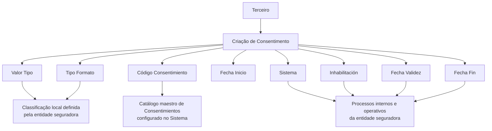

# Gestão de Consentimentos de Terceiros — Criação, Classificação e Vigência

## 1. Metadados do Documento
- **Arquivo de Origem:** Não identificado — conteúdo bruto fornecido pelo usuário
- **Tipo de Documento:** Especificação Técnica / Manual Funcional
- **Domínio / Sistema:** Reef / Mapfredocument — Consentimentos de Terceiros
- **Público-Alvo:** Negócio, Analistas Funcionais, Desenvolvedores e Operação
- **Data/Versão Identificada:** Não identificada

---

## 2. Resumo Executivo & Contexto de Negócio

O documento descreve o bloco funcional **“CREAR Consentimientos del Tercero”**, destinado à identificação, ao registro e à manutenção de consentimentos associados a um Terceiro. O consentimento é definido como uma manifestação de vontade livre, inequívoca, específica e informada, expressa por declaração ou ação afirmativa clara, para o tratamento de dados pessoais.

O objetivo declarado é habilitar a entidade seguradora a cumprir a vontade do Terceiro em seus processos internos. Para isso, o bloco captura atributos que determinam o escopo do consentimento, o código de consentimento, o formato segundo a normativa local de proteção de dados e as datas relacionadas ao ciclo de vida do consentimento.

A ação explicitamente habilitada é **CREAR**, indicando que o documento se concentra na criação de registros de consentimento. A sequência de captura deve ser seguida da esquerda para a direita e de cima para baixo. Quando não houver indicação expressa de campos específicos, os atributos podem ser utilizados tanto para Pessoas Físicas quanto para Pessoas Jurídicas.

A classificação dos consentimentos, dos tipos e dos formatos deve ser definida localmente pela entidade seguradora. O documento apresenta apenas valores exemplificativos e não estabelece um catálogo completo, contratos de integração, métodos HTTP, persistência, validações técnicas ou regras de autorização.

---

## 3. Arquitetura, Componentes & Tecnologias Envolvidas

Os elementos explicitamente citados são:

- **Reef / DOCUMENTACIÓN Reef:** contexto documental no qual o conteúdo é apresentado.
- **Mapfredocument:** referência exibida no cabeçalho da documentação.
- **Entidad Aseguradora / Compañía Aseguradora:** organização responsável por definir classificações locais e aplicar os consentimentos em processos internos.
- **Tercero:** titular ao qual o consentimento está associado.
- **Sistema:** componente não detalhado que recebe, interpreta e utiliza os atributos de consentimento.
- **Catálogo maestro de Consentimientos:** catálogo mestre configurado no Sistema, fonte de valores possíveis para o campo Código Consentimiento.
- **Procesos internos / procesos operativos:** processos corporativos que devem respeitar escopo, validade e inabilitação do consentimento.



> **Nota de Análise:** O documento não detalha arquitetura de software, interfaces, banco de dados, APIs, microsserviços, tecnologias de implementação, ambientes ou mecanismos de integração.

---

## 4. Regras de Negócio, Especificações Funcionais & Processos

### Definição de consentimento

O documento define consentimento como toda manifestação de vontade:

- Livre;
- Inequívoca;
- Específica;
- Informada;
- Realizada mediante declaração ou clara ação afirmativa;
- Pela qual o interessado aceita o tratamento de dados pessoais que lhe concernem.

### Objetivo funcional

O bloco de informação deve permitir a identificação dos Consentimientos del Tercero, habilitando a entidade seguradora a cumprir a vontade do Terceiro em seus processos.

### Ação habilitada

A única ação explicitamente apresentada é:

- **CREAR:** criação de consentimentos.

### Ordem de captura

A sequência de captura das informações deve ocorrer:

1. Da esquerda para a direita;
2. De cima para baixo.

### Aplicabilidade a tipos de pessoa

Quando o documento não especificar ou indicar expressamente campos, os campos podem ser empregados indistintamente para:

- Pessoas Físicas;
- Pessoas Jurídicas.

### Regras por atributo

1. **Valor Tipo**
   - Indica o âmbito do consentimento atribuído ao Terceiro.
   - Estabelece o âmbito de uso do consentimento na atividade da companhia seguradora.
   - A classificação deve ser definida localmente pela entidade seguradora.
   - A classificação será utilizada posteriormente nos processos internos da entidade.
   - Os valores apresentados no documento são exemplos.

2. **Código Consentimiento**
   - Contém o código do consentimento do Terceiro.
   - O código deve estar de acordo com a relação de valores possíveis no catálogo mestre de Consentimientos configurado no Sistema.

3. **Tipo Formato**
   - Classifica os consentimentos do Terceiro segundo a normativa local de proteção de dados.
   - A classificação deve ser definida pela entidade seguradora.
   - A classificação será utilizada posteriormente nos processos internos da entidade.
   - Os valores apresentados no documento são exemplos.

4. **Fecha Inicio**
   - Indica a data de alta do consentimento do Terceiro.

5. **Fecha Fin**
   - Indica a data de baixa na qual o consentimento do Terceiro deixa de estar ativo.

6. **Fecha Validez**
   - Indica ao Sistema a data a partir da qual o consentimento do Terceiro estará plenamente operativo.
   - O uso correto permite manter um histórico das alterações efetuadas nas informações do consentimento.

7. **Inhabilitación**
   - Indica ao Sistema que o consentimento associado ao Terceiro está inabilitado.
   - Um consentimento inabilitado não deve ser empregado, contemplado ou utilizado nos processos operativos da entidade.

---

## 5. Tabelas de Parâmetros, Ambientes e Estruturas de Dados

| Item / Parâmetro | Descrição / Função | Tipo / Valores / Formato | Ambiente / Observações |
| :--- | :--- | :--- | :--- |
| Ação habilitada | Permite criar um consentimento de Terceiro. | `CREAR` | Não são descritas ações de consulta, alteração ou exclusão. |
| Terceiro | Entidade à qual o consentimento é associado. | Pessoa Física ou Pessoa Jurídica | Campos sem indicação expressa podem ser aplicados a ambos os tipos. |
| Valor Tipo | Define o âmbito do consentimento associado ao Terceiro e seu uso na companhia seguradora. | Classificação local; exemplos: `001 Publicidad`, `002 Cesión de Datos`, `003 Perfilado` | Os valores são exemplificativos; a entidade seguradora define a classificação local. |
| Código Consentimiento | Identifica o consentimento do Terceiro. | Código existente no catálogo mestre de Consentimientos | O catálogo mestre deve estar configurado no Sistema. |
| Tipo Formato | Classifica o consentimento segundo a normativa local de proteção de dados. | Exemplos: `001 No Otorgado`, `002 Tácito`, `003 Expreso`, `004 Retirado` | Os valores são exemplificativos; a entidade seguradora define a classificação local. |
| Fecha Inicio | Data de alta do consentimento do Terceiro. | Data | Formato de data não especificado. |
| Fecha Fin | Data de baixa em que o consentimento deixa de estar ativo. | Data | Formato de data não especificado. |
| Fecha Validez | Data a partir da qual o consentimento está plenamente operativo no Sistema. | Data | Permite histórico das alterações efetuadas nas informações. |
| Inhabilitación | Sinaliza que o consentimento associado ao Terceiro está inabilitado. | Estado de inabilitação; valores não especificados | Consentimento inabilitado não deve ser utilizado em processos operativos. |
| Catálogo maestro de Consentimientos | Fonte de valores possíveis para Código Consentimiento. | Catálogo configurado no Sistema | Estrutura, manutenção e conteúdo do catálogo não são detalhados. |
| Entidade seguradora | Define localmente classificações de Tipo e Formato. | Organização responsável | As classificações serão usadas nos processos internos. |

---

## 6. Bateria de Perguntas & Respostas para RAG (FAQ Sintético)

### P1: Qual é o objetivo do bloco “CREAR Consentimientos del Tercero”?
**R:** O bloco tem o objetivo de identificar e registrar os consentimentos de um Terceiro, permitindo que a entidade seguradora cumpra a vontade desse Terceiro em seus processos internos e operativos.

### P2: Como o documento define consentimento?
**R:** Consentimento é uma manifestação de vontade livre, inequívoca, específica e informada, mediante a qual o interessado aceita o tratamento de dados pessoais que lhe concernem. Essa aceitação pode ocorrer por declaração ou por uma clara ação afirmativa.

### P3: Qual ação é explicitamente habilitada para consentimentos de Terceiros?
**R:** A ação habilitada explicitamente é **CREAR**, ou seja, a criação de registros de consentimentos de Terceiros.

### P4: Em qual ordem os atributos de consentimento devem ser capturados?
**R:** Os atributos devem ser capturados da esquerda para a direita e de cima para baixo, conforme a sequência apresentada no documento.

### P5: Os campos de consentimento podem ser utilizados para Pessoas Físicas e Pessoas Jurídicas?
**R:** Sim. Quando o documento não especificar ou indicar expressamente campos, os campos devem ser empregados indistintamente tanto no registro de Pessoas Físicas quanto no registro de Pessoas Jurídicas.

### P6: Qual é a finalidade do atributo Valor Tipo?
**R:** Valor Tipo indica o âmbito do consentimento atribuído ao Terceiro. Esse atributo estabelece como o consentimento será empregado na atividade da companhia seguradora. A classificação deve ser definida localmente pela entidade seguradora para uso posterior nos processos internos.

### P7: De onde deve vir o Código Consentimiento?
**R:** O Código Consentimiento deve corresponder a um dos valores possíveis existentes no catálogo mestre de Consentimientos configurado no Sistema.

### P8: O que representa o Tipo Formato de um consentimento?
**R:** Tipo Formato é uma classificação do consentimento do Terceiro de acordo com a normativa local de proteção de dados. Essa classificação deve ser definida pela entidade seguradora e utilizada posteriormente em seus processos internos.

### P9: Quais exemplos de Tipo Formato são apresentados no documento?
**R:** O documento apresenta como exemplos: `001 No Otorgado`, `002 Tácito`, `003 Expreso` e `004 Retirado`. O documento informa que esses exemplos não constituem necessariamente o catálogo completo.

### P10: Quando um consentimento passa a estar plenamente operativo no Sistema?
**R:** Um consentimento passa a estar plenamente operativo a partir da data informada em **Fecha Validez**. O uso correto desse atributo também permite manter histórico das alterações efetuadas nas informações do consentimento.

### P11: Qual é a diferença entre Fecha Inicio e Fecha Fin?
**R:** Fecha Inicio indica a data de alta do consentimento do Terceiro. Fecha Fin indica a data de baixa em que o consentimento deixa de estar ativo.

### P12: Como processos operativos devem tratar um consentimento inabilitado?
**R:** Quando o atributo Inhabilitación indicar que o consentimento associado ao Terceiro está inabilitado, o consentimento não deve ser empregado, contemplado ou utilizado nos processos operativos da entidade.

---

## 7. Glossário de Termos, Siglas & Conceitos-Chave

- **Consentimiento:** manifestação de vontade livre, inequívoca, específica e informada para aceitação do tratamento de dados pessoais.
- **Tercero:** entidade ou interessado ao qual o consentimento está associado.
- **CREAR:** ação habilitada para criação de consentimentos.
- **Valor Tipo:** atributo que define o âmbito de utilização do consentimento na atividade da companhia seguradora.
- **Código Consentimiento:** código de um consentimento conforme valores existentes no catálogo mestre configurado no Sistema.
- **Tipo Formato:** classificação do consentimento conforme a normativa local de proteção de dados.
- **Fecha Inicio:** data de alta do consentimento do Terceiro.
- **Fecha Fin:** data de baixa em que o consentimento deixa de estar ativo.
- **Fecha Validez:** data a partir da qual o consentimento está plenamente operativo no Sistema.
- **Inhabilitación:** estado que indica que o consentimento não deve ser utilizado nos processos operativos.
- **Catálogo maestro de Consentimientos:** catálogo configurado no Sistema contendo possíveis valores para Código Consentimiento.
- **Entidad Aseguradora / Compañía Aseguradora:** entidade responsável por definir localmente classificações de consentimento e empregá-las em processos internos.
- **No Otorgado:** exemplo de classificação de formato para consentimento não concedido.
- **Tácito:** exemplo de classificação de formato para consentimento tácito.
- **Expreso:** exemplo de classificação de formato para consentimento expresso.
- **Retirado:** exemplo de classificação de formato para consentimento retirado.
- **Reef:** referência ao ambiente ou área de documentação exibida no conteúdo.
- **Mapfredocument:** referência exibida no cabeçalho do conteúdo documental.

---

## 8. Notas Críticas, Riscos & Limitações

- O conteúdo disponibilizado possui apenas duas páginas e apresenta escopo funcional limitado à criação e descrição dos atributos de consentimentos.
- Os valores de **Valor Tipo** e **Tipo Formato** são explicitamente apresentados como exemplos; não devem ser tratados como catálogo completo ou obrigatório.
- A entidade seguradora deve definir localmente as classificações de tipo e formato, o que cria uma dependência de governança e parametrização local.
- O documento não especifica formatos de data para Fecha Inicio, Fecha Fin ou Fecha Validez.
- O documento não detalha regras de consistência entre Fecha Inicio, Fecha Fin e Fecha Validez.
- O documento não informa se Inhabilitación possui formato booleano, código, data, motivo ou outro tipo de representação.
- O documento não detalha métodos HTTP, contratos JSON, APIs, telas, persistência, banco de dados, autenticação, autorização, auditoria ou integrações.
- O documento não descreve o catálogo mestre de Consentimientos além de afirmar que ele deve estar configurado no Sistema.
- Um consentimento inabilitado não deve ser utilizado nos processos operativos; o documento não informa como o Sistema deve impedir tecnicamente esse uso.

---

## 9. Conteúdo Bruto Estruturado (Referência Fiel)

```text
--- [PÁGINA 1 DE 2] ---

CREAR Consentimientos del Tercero
Objetivo
Se entiende por consentimiento «toda manifestación de voluntad, libre, inequívoca, especíca e informada, mediante la que el interesado
acepta, ya sea mediante una declaración o una clara acción armativa, el tratamiento de datos personales que le conciernen.
El propósito de este bloque de información es la Identicación de los Consentimientos del Tercero lo cual habilita a la entidad Aseguradora
para cumplir con la voluntad del Tercero en sus procesos.
Acciones habilitadas
 CREAR ( )
Consentimientos
De izquierda a derecha y de arriba hacia abajo, los siguientes atributos marcan la secuencia de captura de la información.
Si no se especica o indica expresamente los Campos se emplearán indistintamente tanto en el registro de información de las Personas
Físicas como para las Personas Jurídicas.
Valor Tipo (  )
Esta propiedad indicará el ámbito del Consentimiento que se está asignando al Tercero.
Este atributo establece el ámbito de empleo del consentimiento del Tercero en la actividad de la Compañía Aseguradora, clasicación que ha
de ser denida localmente por parte de la entidad aseguradora para su posterior uso en los procesos internos de la entidad.
A modo de ejemplo sus valores podrían ser:
Código TIPO. Descripción
001 Publicidad
002 Cesión de Datos
Documentation / DOCUMENTACIÓN Reef
DOCUMENTACIÓN Reef
Mapfredocument
DOCUMENTACIÓN Reef
Owner
user:agonzalez_mapfre.com
Lifecycle
Approved Source
 / 
 VL
Buscar Inicio Soluciones Arquitecturas APIs Componentes Cloud Documentación Zeus Reef Ayuda
ES


--- [PÁGINA 2 DE 2] ---

Código TIPO. Descripción
003 Perlado
... ...
Código Consentimiento (  )
Este Campo contiene el código del consentimiento del Tercero de acuerdo con la relación de posibles valores existentes en el catálogo
maestro de Consentimientos congurado en el Sistema.
Tipo Formato (  )
Este atributo contiene una clasicación de los Consentimientos del Tercero de acuerdo con la Normativa de Protección de Datos local,
clasicación que ha de ser denida por parte de la entidad aseguradora para su posterior empleo en los procesos internos de la entidad.
A modo de ejemplo sus valores podrían ser:
FORMATO. Descripción
001 No Otorgado
002 Tácito
003 Expreso
004 Retirado
... ...
Fecha Inicio ( )
Este Atributo indicará la Fecha de ALTA del Consentimiento del Tercero.
Fecha Fin ( )
Este Atributo indicará la Fecha de BAJA en la que el Consentimiento del Tercero deja de estar activa.
Fecha Validez ( )
Esta propiedad le indica al sistema la fecha a partir de la cual el Consentimiento del Tercero estará plenamente operativo en el sistema por lo
que su correcto uso permite tener un histórico de los cambios efectuados con su información.
Inhabilitación ( )
Esta propiedad le indica al Sistema que el Consentimiento asociado al Tercero está inhabilitado, por lo que no debería ser empleado,
contemplado o utilizado en los procesos operativos de la entidad.
```
