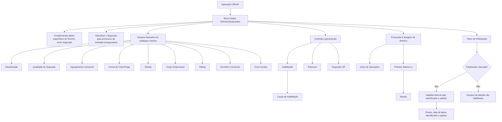

# Cadastro de Informações Específicas do Terceiro Segurado/Cliente no Sistema Reef

## 1. Metadados do Documento
- **Arquivo de Origem:** Não identificado no conteúdo extraído; referência exibida: `DOCUMENTACIÓN Reef`
- **Tipo de Documento:** Manual Operacional
- **Domínio / Sistema:** Reef / Dados de Clientes e Segurados / Entidade Asseguradora
- **Público-Alvo:** Operação, Negócio, Atendimento a Clientes, Área Técnica e Gestão de Clientes
- **Data/Versão Identificada:** Não identificada

---

## 2. Resumo Executivo & Contexto de Negócio

O documento descreve o bloco de informações utilizado para criar e complementar os dados específicos de um Terceiro classificado como Cliente e/ou Segurado no sistema Reef. O objetivo declarado possui duas dimensões: completar a informação específica do Terceiro enquanto Segurado e classificá-lo para que seja considerado, ou não, nos processos da entidade asseguradora.

A operação habilitada identificada é **CREAR**. A sequência de captura dos campos deve ocorrer da esquerda para a direita e de cima para baixo. Salvo indicação expressa em contrário, os atributos descritos aplicam-se tanto a Pessoas Físicas quanto a Pessoas Jurídicas.

Os atributos operacionais usam, em diversos casos, valores definidos em catálogos mestres configurados no sistema, incluindo classificação, qualidade, agrupamento comercial, forma de cobrança/pagamento, moedas, grupos empresariais, classificações de rating, escritórios comerciais, causas de inabilitação e zonas horárias. O documento não detalha os códigos, valores permitidos, interfaces técnicas ou contratos de integração desses catálogos.

O bloco também contém controles ligados a processos operacionais e regulatórios. Entre eles estão a inabilitação do Segurado, prevenção à lavagem de dinheiro para Pessoas Jurídicas, limite de prêmios, comunicação e consentimentos, identificação de Cliente VIP e gestão de adesão a plano de fidelização.

A funcionalidade de fidelização possui comportamento condicional: ao marcar o campo **Fidelización**, inicialmente desmarcado por padrão na operação de criação, são habilitados campos para informar a data de adesão, o identificador do plano e o número da apólice. O documento informa ainda campos para pontos acumulados e data de baixa no plano.

---

## 3. Arquitetura, Componentes & Tecnologias Envolvidas

Os componentes e conceitos explicitamente identificados são:

| Componente / Conceito | Papel descrito no documento |
| :--- | :--- |
| Reef | Sistema referenciado pela documentação e pelo cadastro de dados de Clientes/Segurados. |
| Dados Clientes/Asegurados | Bloco de informação usado para registrar atributos específicos do Terceiro enquanto Cliente e/ou Segurado. |
| Terceiro | Entidade cadastrada que pode ser tratada como Segurado, Cliente, Pessoa Física, Pessoa Jurídica ou Terceiro de Referência, conforme o contexto. |
| Entidade Asseguradora | Organização que utiliza os dados nos processos operacionais, de identificação, cobrança, prevenção à lavagem de dinheiro e fidelização. |
| Catálogo mestre | Fonte configurada no sistema para valores de diversos campos, como classificação, qualidade, agrupamento comercial, moedas e zonas horárias. |
| Configuração de Companhias | Configuração no sistema que pode estabelecer controle de prevenção à lavagem de dinheiro e limitar importes de prêmios. |
| Plano de Fidelização | Plano cuja adesão pode habilitar o registro de datas, identificador, apólice e pontos acumulados. |



**Nota de Análise:** O documento não descreve arquitetura de software, APIs, serviços, banco de dados, métodos HTTP, contratos JSON, tecnologias de implementação, URLs, ambientes ou rotas de log.

---

## 4. Regras de Negócio, Especificações Funcionais & Processos

### Operação de criação e escopo dos atributos

1. A ação habilitada indicada pelo documento é **CREAR**.
2. A captura dos campos no bloco **Datos Clientes/Asegurados** segue a sequência da esquerda para a direita e de cima para baixo.
3. Quando não houver indicação expressa em contrário, os atributos devem ser utilizados tanto para Pessoas Físicas quanto para Pessoas Jurídicas.
4. O cadastro tem o duplo propósito de:
   - Complementar a informação específica do Terceiro como Segurado.
   - Classificar o Segurado para incluí-lo ou não nos processos da entidade asseguradora.

### Classificação e dados comerciais

1. **Classificação** deve conter a classificação do Segurado conforme os valores existentes no catálogo mestre do sistema.
2. **Qualidade do Segurado** deve conter a qualidade do Segurado conforme o catálogo mestre de códigos de qualidade configurado no sistema.
3. **Agrupamento Comercial do Segurado** deve conter a agrupação comercial segundo os valores definidos no catálogo mestre de agrupações.
4. **Tipo de Retenção** contém o código de um dos tipos de retenção configurados localmente pela entidade asseguradora.
5. **Forma de Cobro/Pago** indica o código da forma de cobrança/pagamento do Segurado, conforme as formas de compensação definidas no catálogo mestre de compensações.
6. **Dia Sugerido de Pagamento** registra o dia sugerido pelo Cliente para que a entidade asseguradora realize as cobranças referentes aos prêmios dos seguros contratados.
7. **Oficina Comercial** contém o código do terceiro nível da estrutura comercial, de acordo com o catálogo mestre de escritórios comerciais.
8. **Grupo Empresarial** contém o código do grupo empresarial ao qual pertence o Segurado, conforme a relação de grupos empresariais identificados.

### Inabilitação do Segurado

1. A propriedade **Inhabilitación** informa ao sistema que o Segurado está inabilitado.
2. Um Segurado inabilitado não deve ser empregado, contemplado ou considerado nos processos operacionais da entidade.
3. Quando o Segurado estiver inabilitado, o atributo **Causa de Inhabilitación** deve conter o código de uma causa de inabilitação definida no catálogo mestre do sistema.

### Prevenção à lavagem de dinheiro e limites de prêmios

1. O campo **Aviso de Operaciones** aplica-se quando o Terceiro for uma Pessoa Jurídica e o controle de prevenção à lavagem de dinheiro estiver ativo.
2. Nessas condições, **Aviso de Operaciones** indica se será necessário avisar algum contato do Terceiro.
3. O contato que receberia esse aviso deve estar obrigatoriamente identificado como **Terceiro de Referência**.
4. **Primas Mayores a...** está relacionado ao controle de prevenção à lavagem de dinheiro configurável pela entidade asseguradora para limitar os importes dos prêmios dos Segurados.
5. **Moneda** contém o código da moeda na qual é expresso o valor de **Primas Mayores a...**, conforme o catálogo mestre de moedas configurado no sistema.

### Identificação, comunicação e dados corporativos

1. **Observaciones** permite registrar informações adicionais do Segurado conforme diretrizes da Direção de Clientes/Técnica da entidade asseguradora.
2. **Fecha Registro** deve registrar a data real em que o Segurado entrega a documentação solicitada pela entidade asseguradora, quando essa entrega fizer parte do processo de identificação de Clientes.
3. A **Fecha Registro** não deve ser confundida com a data de captura do Segurado no sistema.
4. **Robinson** determina se o Segurado deve ou não ser incluído em processos que impliquem contato ou comunicação, conforme os consentimentos concedidos pelo Segurado.
5. **Asegurado V.I.P** identifica o Segurado como Cliente Importante.
6. **Número de Empleados** contém o número de empregados do Segurado.
7. **Facturación** contém o valor estimado da faturação anual do Segurado.

### Zona horária

1. **Zona Horaria** deve conter o código da zona horária associada ao Segurado, conforme as zonas horárias habilitadas no sistema.
2. O documento diferencia:
   - **Huso horário:** faixa geográfica virtual orientada de norte a sul, limitada por meridianos igualmente espaçados, na qual geralmente vigora uma mesma hora oficial.
   - **Zona horária:** região geográfica que compartilha uma mesma hora oficial.
3. As zonas horárias foram construídas a partir dos fusos horários, mas podem não seguir fielmente seus traçados, pois os países ajustam livremente suas horas oficiais.
4. Os exemplos fornecidos são:
   - Espanha possui duas zonas horárias para diferenciar a Península Ibérica das Ilhas Canárias.
   - México possui quatro zonas horárias para diferenciar Zona Sudeste, Zona Centro, Zona do Pacífico e Zona Noroeste.

### Plano de fidelização

1. **Fidelización** permite indicar se o Segurado possui um plano de fidelização e se deve ser considerado nos processos da entidade relacionados a esse plano.
2. Na operação de criação, a marca de **Fidelización** é exibida desmarcada por padrão.
3. Ao clicar na marca de **Fidelización**, são habilitados os campos para informar:
   - Data de alta no plano.
   - Identificador do plano.
   - Número da apólice.
4. Caso o Segurado esteja incluído no plano:
   - **Puntos Plan de Fidelización** mostra o número de pontos acumulados.
   - Na operação de criação, os pontos estarão vazios ou terão valor `0`.
   - **Fecha de ALTA en el Plan de Fidelización** contém a data de adesão.
   - **Fecha de BAJA en el Plan de Fidelización** contém a data de saída, quando aplicável.
   - **Identificador en el Plan de Fidelización** mostra o número de associado, código ou chave identificadora do Segurado no plano.
   - **Póliza del Plan de Fidelización** permite, sem obrigatoriedade, capturar o número de uma apólice em vigor em que o Cliente/Segurado seja o Tomador.

---

## 5. Tabelas de Parâmetros, Ambientes e Estruturas de Dados

| Item / Parâmetro | Descrição / Função | Tipo / Valores / Formato | Ambiente / Observações |
| :--- | :--- | :--- | :--- |
| Ação habilitada | Permite criar o bloco de dados do Cliente/Segurado. | `CREAR` | O documento não detalha permissões, perfis ou pré-requisitos. |
| Classificação | Classificação do Segurado. | Valor do catálogo mestre existente no sistema. | Aplicável a Pessoas Físicas e Jurídicas, salvo indicação contrária. |
| Qualidade do Segurado | Qualidade do Segurado. | Código do catálogo mestre de qualidade. | Catálogo configurado no sistema. |
| Agrupamento Comercial do Segurado | Agrupação comercial do Segurado. | Valor do catálogo mestre de agrupações. | Catálogo configurado no sistema. |
| Tipo de Retenção | Código de um tipo de retenção. | Código configurado localmente. | Configuração local da entidade asseguradora. |
| Forma de Cobro/Pago | Forma de cobrança/pagamento do Segurado. | Código conforme catálogo mestre de compensações. | O documento usa a denominação “Cobro/Pago”. |
| Dia Sugerido de Pagamento | Dia sugerido pelo Cliente para realização de cobranças de prêmios. | Dia; formato não especificado. | Referente aos seguros contratados pelo Cliente. |
| Inhabilitación | Indica que o Segurado está inabilitado no sistema. | Marca/propriedade; valores não especificados. | Um Segurado inabilitado não deve participar dos processos operacionais. |
| Causa de Inhabilitación | Motivo da inabilitação do Segurado. | Código do catálogo mestre. | Aplicável quando o Segurado estiver inabilitado. |
| Observaciones | Informações adicionais do Segurado. | Texto; formato não especificado. | Conforme diretrizes da Direção de Clientes/Técnica. |
| Aviso de Operaciones | Indica necessidade de avisar um contato do Terceiro. | Marca/indicador; valores não especificados. | Aplicável a Pessoa Jurídica com controle de prevenção à lavagem de dinheiro ativo. |
| Terceiro de Referência | Contato do Terceiro que deve ser identificado para receber aviso de operações. | Identificação obrigatória quando aplicável. | Relacionado a Aviso de Operaciones. |
| Primas Mayores a... | Limite relacionado a importes de prêmios do Segurado. | Valor monetário; formato não especificado. | Relacionado à prevenção à lavagem de dinheiro e à configuração de Companhias. |
| Moneda | Moeda do valor informado em Primas Mayores a.... | Código do catálogo mestre de moedas. | Catálogo configurado no sistema. |
| Número de Empleados | Número de empregados do Segurado. | Número; formato não especificado. | Sem detalhamento de obrigatoriedade. |
| Facturación | Importância estimada da faturação anual do Segurado. | Valor monetário; formato não especificado. | Sem detalhamento de moeda ou regra de cálculo. |
| Grupo Empresarial | Grupo empresarial ao qual o Segurado pertence. | Código de grupo empresarial identificado. | O documento não detalha a fonte de manutenção dos grupos. |
| Tipo de Rating | Campo cujo texto subsequente descreve uma qualificação atribuída ao Segurado. | Valor do catálogo mestre de qualificações/rating. | O extrato não separa claramente o rótulo “Tipo de Rating” da descrição apresentada na página seguinte. |
| Oficina Comercial | Código do terceiro nível da estrutura comercial. | Código do catálogo mestre de escritórios comerciais. | Catálogo configurado no sistema. |
| Fecha Registro | Data real de entrega da documentação pelo Segurado. | Data; formato não especificado. | Não é a data de captura do Segurado no sistema. |
| Zona Horaria | Zona horária associada ao Segurado. | Código de zona horária habilitada. | O documento apresenta exemplos para Espanha e México. |
| Fidelización | Indica se o Segurado possui plano de fidelização. | Marca; inicialmente desmarcada na criação. | Quando marcada, habilita campos relacionados ao plano. |
| Puntos Plan de Fidelización | Pontos acumulados pelo Segurado no plano. | Número; vazio ou `0` durante a criação. | Aplicável quando o Segurado está incluído no plano. |
| Fecha de ALTA en el Plan de Fidelización | Data de entrada do Segurado no plano. | Data; formato não especificado. | Campo habilitado pela marca Fidelización. |
| Fecha de BAJA en el Plan de Fidelización | Data de saída do Segurado do plano. | Data; formato não especificado. | Aplicável quando houver baixa do plano. |
| Identificador en el Plan de Fidelización | Número de associado, código ou chave do Segurado no plano. | Identificador; formato não especificado. | Campo habilitado pela marca Fidelización. |
| Póliza del Plan de Fidelización | Número de apólice em vigor em que Cliente/Segurado seja Tomador. | Número de apólice; formato não especificado. | Captura não obrigatória. |
| Robinson | Define inclusão ou exclusão do Segurado em processos de contato/comunicação. | Indicador; valores não especificados. | Deve respeitar os consentimentos do Segurado. |
| Asegurado V.I.P | Identifica o Segurado como Cliente Importante. | Marca; valores não especificados. | O documento não define critérios para atribuição. |

---

## 6. Bateria de Perguntas & Respostas para RAG (FAQ Sintético)

### P1: Qual é o objetivo do bloco de Dados Clientes/Asegurados no Reef?
**R:** O bloco de Dados Clientes/Asegurados tem dois objetivos: complementar a informação específica do Terceiro como Segurado e classificar o Segurado para que seja contemplado ou não nos processos da entidade asseguradora.

### P2: Qual ação está habilitada no documento para os dados de Clientes/Segurados?
**R:** A ação habilitada explicitamente no documento é `CREAR`. O conteúdo não descreve ações de alteração, consulta ou exclusão.

### P3: Em qual ordem os campos do bloco devem ser preenchidos?
**R:** Os atributos devem ser capturados da esquerda para a direita e de cima para baixo. O documento também informa que, salvo indicação expressa, os atributos se aplicam a Pessoas Físicas e Pessoas Jurídicas.

### P4: O que acontece quando o campo Inhabilitación é marcado para um Segurado?
**R:** A propriedade Inhabilitación informa ao sistema que o Segurado está inabilitado. Por consequência, o Segurado não deve ser empregado, contemplado ou considerado nos processos operacionais da entidade asseguradora. Caso esteja inabilitado, a Causa de Inhabilitación deve conter um código de causa definido no catálogo mestre do sistema.

### P5: Qual é a finalidade do campo Aviso de Operaciones?
**R:** Aviso de Operaciones aplica-se quando o Terceiro é Pessoa Jurídica e o controle de prevenção à lavagem de dinheiro está ativo. O campo informa se será necessário avisar um contato do Terceiro, que obrigatoriamente deve estar identificado como Terceiro de Referência.

### P6: Como o campo Primas Mayores a... se relaciona com prevenção à lavagem de dinheiro?
**R:** Primas Mayores a... está relacionado ao controle de prevenção à lavagem de dinheiro que a entidade asseguradora pode estabelecer na configuração das Companhias para limitar os importes dos prêmios dos Segurados. O campo Moneda registra o código da moeda em que esse valor é expresso.

### P7: Qual diferença existe entre Fecha Registro e a data de captura do Segurado?
**R:** Fecha Registro deve registrar a data real em que o Segurado entregou a documentação solicitada pela entidade asseguradora, em entidades nas quais essa atividade faz parte do processo de identificação de Clientes. Essa data não deve ser confundida com a data em que o Segurado foi capturado no sistema.

### P8: Quando os campos do Plano de Fidelização são habilitados?
**R:** Na operação de criação, Fidelización aparece desmarcada por padrão. Ao marcar Fidelización, são habilitados os campos para registrar a data de alta, o identificador do plano e o número da apólice. O documento também descreve pontos acumulados e data de baixa para Segurados incluídos no plano.

### P9: Qual valor deve ser apresentado para os pontos do Plano de Fidelização durante a criação?
**R:** Durante a operação de criação, Puntos Plan de Fidelización estará vazio ou conterá `0` pontos.

### P10: O número da apólice do Plano de Fidelização é obrigatório?
**R:** Não. Póliza del Plan de Fidelización permite capturar, de forma não obrigatória, o número de uma apólice em vigor na qual o Cliente/Segurado seja o Tomador.

### P11: Como o campo Robinson afeta os processos de comunicação com o Segurado?
**R:** Robinson permite determinar se o Segurado deve ser incluído ou não nos processos da entidade que envolvam qualquer tipo de contato ou comunicação. A decisão deve observar os consentimentos concedidos pelo Segurado.

### P12: Qual informação é registrada em Oficina Comercial?
**R:** Oficina Comercial contém o código do terceiro nível da estrutura comercial, conforme os valores existentes no catálogo mestre de escritórios comerciais configurado no sistema.

---

## 7. Glossário de Termos, Siglas & Conceitos-Chave

- **Asegurado / Segurado:** Terceiro para o qual são registrados dados específicos relacionados aos seguros e aos processos da entidade asseguradora.
- **Catálogo mestre:** Relação configurada no sistema que fornece valores para determinados atributos, como classificação, qualidade, agrupamento comercial, moedas, rating, escritórios comerciais e zonas horárias.
- **CREAR:** Ação habilitada indicada no documento para criação dos dados.
- **Entidad Aseguradora / Entidade Asseguradora:** Organização que usa os dados do Segurado nos processos operacionais, de cobrança, identificação, prevenção à lavagem de dinheiro e fidelização.
- **Fidelización / Fidelização:** Controle que identifica se o Segurado possui plano de fidelização e habilita campos associados à adesão.
- **Huso Horario / Fuso horário:** Faixa geográfica virtual delimitada por meridianos, geralmente associada a uma mesma hora oficial.
- **Oficina Comercial:** Registro do código do terceiro nível da estrutura comercial.
- **Persona Física:** Categoria citada como aplicável aos atributos, salvo exceções expressas no documento.
- **Persona Jurídica:** Categoria citada como aplicável aos atributos; possui regra específica para Aviso de Operaciones quando a prevenção à lavagem de dinheiro estiver ativa.
- **Plan de Fidelización / Plano de Fidelização:** Plano no qual o Segurado pode ter data de alta, data de baixa, identificador, apólice e pontos acumulados.
- **Primas:** Importes dos prêmios dos seguros do Segurado.
- **Rating:** Qualificação atribuída ao Segurado conforme catálogo mestre de qualificações/rating.
- **Reef:** Sistema mencionado na documentação de referência.
- **Robinson:** Campo que indica se o Segurado deve ser incluído em processos de contato ou comunicação, conforme consentimentos.
- **Tercero / Terceiro:** Entidade cadastrada no sistema, tratada em determinados contextos como Cliente, Segurado ou Terceiro de Referência.
- **Tercero de Referencia / Terceiro de Referência:** Contato do Terceiro que deve estar identificado quando houver necessidade de aviso de operações.
- **Tomador:** Figura do Cliente/Segurado em uma apólice em vigor, mencionada como condição para captura opcional da apólice do plano de fidelização.
- **V.I.P:** Marca que identifica o Segurado como Cliente Importante.
- **Zona Horaria / Zona horária:** Região geográfica que compartilha uma mesma hora oficial.

---

## 8. Notas Críticas, Riscos & Limitações

- O conteúdo extraído apresenta caracteres corrompidos ou substituídos por `` em termos como “específica”, “clasificación”, “configurado” e “oficina”. Esta estrutura preserva o sentido inferível dos trechos, sem introduzir informações externas.
- O documento não identifica o nome original do arquivo, a versão, a data de publicação, o autor técnico nem o público-alvo formal.
- Não são especificados tipos técnicos de dados, formatos de data, tamanhos de campo, obrigatoriedade geral, regras de validação, mensagens de erro ou comportamento de persistência.
- Os catálogos mestres são citados, mas seus valores, códigos, responsáveis, integrações e regras de manutenção não são detalhados.
- Não há descrição de APIs, contratos JSON, banco de dados, tecnologias, microsserviços, autenticação, ambientes, URLs, rotas de log ou pipeline de implantação.
- O campo **Tipo de Rating** aparece ao fim da página 2, enquanto a descrição de qualificação/rating aparece no início da página 3. A extração não permite confirmar se existe outro rótulo intermediário omitido.
- O documento não define critérios para atribuir as marcas **Asegurado V.I.P**, **Robinson**, **Fidelización** ou **Inhabilitación**.
- O texto menciona prevenção à lavagem de dinheiro, mas não define limiares de prêmio, procedimentos de notificação, responsáveis, evidências exigidas ou regras de bloqueio.
- **Nota de Análise:** O documento lista campos funcionais de cadastro, mas não detalha métodos HTTP, contratos JSON, serviços, tabelas físicas ou fluxos de integração do sistema Reef.

---

## 9. Conteúdo Bruto Estruturado (Referência Fiel)

```text
--- [PÁGINA 1 DE 4] ---

CREAR Información especíca del Tercero Asegurado/Cliente
Objetivo
El registro de los Datos en este Bloque de Información obedece al doble propósito:
Complementar la información especíca del Tercero como Asegurado.
Clasicar al Asegurado para contemplarlo o no en los procesos de la entidad Aseguradora.
Acciones habilitadas
 CREAR ( )
Datos Clientes/Asegurados
De Izquierda a Derecha y de Arriba hacia Abajo, los siguientes atributos marcan la secuencia de captura de los Campos en este Bloque de
Información.
(Si no se especica o indica expresamente, los Atributos se emplearán tanto en Personas Físicas como en Personas Jurídicas).
Clasicación (  )
Este Campo contendrá la clasicación del Asegurado de acuerdo con la relación de valores existentes en el catálogo maestro existente en el
Sistema.
Calidad del Asegurado (  )
Este Campo contendrá la calidad del Asegurado de acuerdo con la relación de valores existentes en el catálogo maestro de códigos de
calidad congurado en el Sistema.
Documentation / DOCUMENTACIÓN Reef
DOCUMENTACIÓN Reef
Mapfredocument
DOCUMENTACIÓN Reef
Owner
user:agonzalez_mapfre.com
Lifecycle
Approved Source
 / 
 VL
Buscar Inicio Soluciones Arquitecturas APIs Componentes Cloud Documentación Zeus Reef Ayuda
ES


--- [PÁGINA 2 DE 4] ---

Agrupamiento Comercial del Asegurado (  )
Este Campo contendrá la Agrupación Comercial del Asegurado de acuerdo con la relación de valores denidos en el catálogo maestro de
agrupaciones congurado en el Sistema.
Tipo de Retención (  )
Este Dato contiene el código de uno de los Tipos de Retención congurados localmente por la Entidad Aseguradora.
Forma de Cobro/Pago (  )
Este Dato indicará el Código de la Forma de Cobro/Pago del Asegurado de acuerdo con las posibles Formas de Compensación denidas en
el catálogo maestro de compensaciones.
Día Sugerido de Pago ( )
Este Campo en la Creación del Cliente indica el día que éste sugiere para que la entidad aseguradora realice los cargos correspondientes para
realizar el pago de las primas de los Seguros que tenga contratados.
Inhabilitación ( )
Esta propiedad le indica al Sistema que el Asegurado está inhabilitado en el Sistema por lo que no debería ser empleado, contemplado o
considerado en los procesos operativos de la entidad.
Causa de Inhabilitación (  )
En el supuesto que el Asegurado estuviera Inhabilitado, este Atributo contendrá el código de una causa de inhabilitación denida en el
catálogo maestro del Sistema.
Observaciones ( )
El propósito de este campo permite capturar información adicional del Asegurado de acuerdo con los Planteamientos o directrices que
pudieran efectuar la Dirección de Clientes/Técnica de la entidad aseguradora.
Aviso de Operaciones (  )
En en el caso que el Tercero sea una Persona Jurídica y el control en la prevención del lavado de dinero esté activado, este campo indica si se
va o no a tener que avisar a algún contacto del Tercero que tendrá obligatoriamente que estar identicado como Tercero de Referencia.
Primas Mayores a ...
Esta Dato en la Creación del Asegurado está relacionado con el control en la prevención del lavado de dinero que la Entidad Aseguradora
puede establecer en la conguración de las Compañías en el Sistema, para limitar los importes de las Primas de los Asegurados.
Moneda
Este Campo contendrá el código de la Moneda en la que se ha expresado el valor del campo Primas Mayores a... del Asegurado de acuerdo
con la relación de valores existentes en el catálogo maestro de Monedas congurado en el Sistema.
Número de Empleados ( )
Este Contiene el número de empleados del Asegurado.
Facturación ( )
Este Atributo contendrá el importe de la Facturación Anual estimada del Asegurado.
Grupo Empresarial (  )
Este Campo contendrá el código del Grupo Empresarial al que pertenece el Asegurado de acuerdo a la posible relación de grupos
empresariales identicados.
Tipo de Rating (  )


--- [PÁGINA 3 DE 4] ---

Este Campo contendrá la Calicación asignada al Asegurado de acuerdo con la relación de valores existentes en el catálogo maestro de
calicaciones/rating congurado en el Sistema.
Ocina Comercial (  )
Este Dato contiene el código del Tercer Nivel de la Estructura Comercial de acuerdo con la relación de valores existentes en el catálogo
maestro de ocinas comerciales congurado en el Sistema.
Fecha Registro ( )
Este Dato se debe utilizar para registrar la fecha real en la que el Asegurado entrega la documentación solicitada por la entidad aseguradora
en aquellas entidades que tienen esta tarea como parte del Proceso de Identicación de sus Clientes.
No confundir con la Fecha en la que se captura el Asegurado en el Sistema.
Zona Horaria (  )
Un huso horario es cada una de las franjas geográcas virtuales, orientadas de norte a sur, limitadas por meridianos igualmente espaciados,
en las que se divide un planeta y en las que suele regir una misma hora ocial.
Una zona horaria en cambio, es una región geográca que comparte una misma hora ocial. Las zonas horarias se han construido a partir de
los husos horarios aunque no siguen elmente sus trazos, pues cada país ajusta su hora ocial libremente y con frecuencia no coinciden
estrictamente con la convención geográca.
Este Campo contendrá el código de la Zona Horaria asociada del Asegurado de acuerdo a la posible relación de zonas horarias habilitadas en
el Sistema.
Por ejemplo,
España tiene dos zonas horarias para distinguir la zona horaria de la Península Ibérica de la zona horaria de las Islas Canarias.
México tiene cuatro zonas horarias diferentes para distinguir la Zona Sureste, la Zona Centro, la Zona del Pacíco y la Zona Noroeste.
Fidelización ( )
Este Campo permite contemplar o no en los procesos de la entidad si el Asegurado cuenta con un Plan de Fidelización.
Al hacer click sobre la marca (en esta operación se muestra desmarcada por Defecto) se habilitan los campos correspondientes para poder
ingresar la fecha de alta, el identicador del Plan y el número de la póliza.
Robinson ( )
Este Dato permite conocer si el Asegurado se debe incluir o no en los procesos de la entidad que impliquen cualquier tipo de
contacto/comunicación con el , todo ello de acuerdo con los consentimientos otorgados por el Asegurado.
Asegurado V.I.P ( )
Esta marca permite identicar al Asegurado como un Cliente Importante.
Puntos Plan de Fidelización
En el supuesto que el Asegurado esté incluido en el Plan de Fidelización de la Entidad, este campo muestra el número de puntos acumulados
que tiene el Asegurado (en la Operación de Creación este dato estará vacío o contendrá 0 puntos)
Fecha de ALTA en el Plan de Fidelización ( )
En el supuesto que el Asegurado esté incluido en el Plan de Fidelización de la Entidad, este dato contiene la Fecha de Alta en el mismo.
Fecha de BAJA en el Plan de Fidelización ( )
En el supuesto que el Asegurado estuviera incluido en el Plan de Fidelización de la Entidad, este dato contendría la Fecha de Baja del
Asegurado en el Plan de Fidelización.
Consejo:


--- [PÁGINA 4 DE 4] ---

Identicador en el Plan de Fidelización ( )
En el supuesto que el Asegurado esté incluido en el Plan de Fidelización de la Entidad, este dato muestra el Número de Socio, código o clave
identicadora del Asegurado en el Plan.
Póliza del Plan de Fidelización (  )
Por último y en el supuesto que el Asegurado esté incluido en el Plan de Fidelización de la Entidad, este Dato permitirá capturar (no es una
acción obligatoria) el número de una de las pólizas en vigor en las que el la gura del Cliente/Asegurado se corresponde con El Tomador de la
misma.
```
