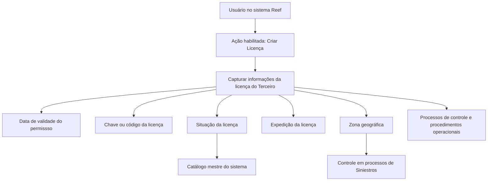

# Criação de Licença do Terceiro — Documentação Reef

## 1. Metadados do Documento
- **Arquivo de Origem:** Não identificado no conteúdo fornecido
- **Tipo de Documento:** Procedimento / Especificação Funcional
- **Domínio / Sistema:** Reef / Mapfre / Gestão de Terceiros e Licenças
- **Público-Alvo:** Operação, Analistas Funcionais e Usuários do sistema
- **Data/Versão Identificada:** Não identificada

---

## 2. Resumo Executivo & Contexto de Negócio

O documento descreve a ação habilitada de **criação de licença** para um Terceiro no sistema Reef. O objetivo declarado é identificar e registrar informações específicas da licença ou da permissão de condução associada ao Terceiro.

As informações capturadas permitem que a licença ou permissão de condução seja utilizada em processos de controle e procedimentos operacionais da entidade. O documento estabelece uma sequência de preenchimento dos atributos, orientada da esquerda para a direita e de cima para baixo na interface do sistema.

Os atributos documentados abrangem validade, código, situação, local de expedição e zona geográfica de aplicação da licença. A situação da licença depende de valores configurados no catálogo mestre do sistema.

A zona geográfica possui relevância operacional explícita, pois habilita o controle do uso da licença nos processos de **Siniestros** da entidade. O conteúdo não descreve regras de obrigatoriedade, formatos de data, métodos de integração, persistência de dados ou contratos técnicos.

---

## 3. Arquitetura, Componentes & Tecnologias Envolvidas

O conteúdo cita o sistema ou repositório documental **Reef**, a referência **Mapfredocument**, o conceito de **Terceiro**, o catálogo mestre do sistema e os processos de **Siniestros**. Não são detalhados microsserviços, APIs, bancos de dados, protocolos, ambientes, tecnologias de implementação ou integrações externas.



**Nota de Análise:** O documento não detalha a arquitetura técnica do Reef, nem especifica como os dados de licença são armazenados, validados ou integrados a outros sistemas.

---

## 4. Regras de Negócio, Especificações Funcionais & Processos

1. O sistema disponibiliza a ação habilitada **CREAR Licencia**.
2. A criação de licença deve identificar informações específicas da licença ou permissão de condução do Terceiro.
3. As informações registradas devem permitir o uso da licença em processos de controle e procedimentos operacionais da entidade.
4. A captura dos atributos segue a sequência visual apresentada na interface: da esquerda para a direita e de cima para baixo.
5. A **Data de Validade do Permisso** indica a data de validade da licença ou permissão de condução do Terceiro.
6. A **Chave/Código da Licença** identifica a chave ou o código da licença de condução.
7. A **Situação** representa o estado da licença do Terceiro, conforme valores possíveis configurados no catálogo mestre do sistema.
8. A **Expedição da Licença** contém o segundo nível da estrutura geográfica, ou estado, onde a licença foi expedida.
9. A **Zona Geográfica** representa o âmbito geográfico de aplicação ou uso da licença de condução do segurado.
10. A Zona Geográfica habilita o controle da licença nos processos de Siniestros da entidade.

**Nota de Análise:** O documento não informa se os atributos são obrigatórios, quais valores específicos compõem o catálogo mestre, nem quais validações ocorrem no momento da criação.

---

## 5. Tabelas de Parâmetros, Ambientes e Estruturas de Dados

| Item / Parâmetro | Descrição / Função | Tipo / Valores / Formato | Ambiente / Observações |
| :--- | :--- | :--- | :--- |
| Ação habilitada | Permite criar uma licença associada ao Terceiro. | `CREAR Licencia` | Sistema Reef. |
| Data de Validade do Permisso | Indica a data de validade da licença ou permissão de condução do Terceiro. | Data; formato não especificado. | Não detalha validação ou obrigatoriedade. |
| Chave/Código da Licença | Identifica a chave ou o código da licença de condução. | Código; formato não especificado. | Não detalha unicidade ou origem do código. |
| Situação | Indica o estado da licença do Terceiro. | Valores configurados no catálogo mestre do sistema. | Os valores do catálogo não são listados. |
| Expedição da Licença | Contém o segundo nível da estrutura geográfica ou estado no qual a licença foi expedida. | Estrutura geográfica / estado. | Não detalha países, regiões ou catálogo geográfico. |
| Zona Geográfica | Define o âmbito geográfico de aplicação ou uso da licença de condução do segurado. | Área ou âmbito geográfico; formato não especificado. | Habilita controle em processos de Siniestros. |
| Sequência de captura | Define a ordem de preenchimento dos atributos na interface. | Da esquerda para a direita e de cima para baixo. | Aplicável à tela de criação de licença. |
| Owner | Proprietário exibido na documentação. | `user:agonzalez_mapfre.com` | Informação de governança documental. |
| Lifecycle | Estado de ciclo de vida exibido na documentação. | `Approved Source` | O conteúdo não explica o significado operacional desse estado. |
| Referência documental | Nome exibido no conteúdo de documentação. | `Mapfredocument` | Associado à documentação Reef. |

---

## 6. Bateria de Perguntas & Respostas para RAG (FAQ Sintético)

### P1: Qual é o objetivo da criação de licença para um Terceiro no Reef?
**R:** O objetivo é identificar e registrar as informações específicas da licença ou permissão de condução do Terceiro, permitindo seu uso em processos de controle e procedimentos operacionais da entidade.

### P2: Qual ação está habilitada no procedimento documentado?
**R:** A ação habilitada é `CREAR Licencia`, destinada à criação de uma licença associada ao Terceiro.

### P3: Qual é a ordem de captura das informações na criação de licença?
**R:** O documento determina que os atributos sejam capturados na sequência apresentada na interface, da esquerda para a direita e de cima para baixo.

### P4: O que representa a Data de Validade do Permisso?
**R:** A Data de Validade do Permisso indica a data de validade da licença ou da permissão de condução do Terceiro. O documento não informa o formato da data nem regras de validação.

### P5: Qual é a finalidade da Chave/Código da Licença?
**R:** A Chave/Código da Licença identifica a chave ou o código da licença de condução. O documento não especifica se esse identificador é único, obrigatório ou gerado pelo sistema.

### P6: Como a Situação da licença é definida?
**R:** A Situação indica o estado da licença do Terceiro conforme os valores possíveis configurados no catálogo mestre do sistema. Os valores disponíveis nesse catálogo não são apresentados.

### P7: O que deve ser informado no campo Expedição da Licença?
**R:** O campo Expedição da Licença deve conter o segundo nível da estrutura geográfica, ou o estado, no qual a licença foi expedida.

### P8: Para que serve a Zona Geográfica da licença?
**R:** A Zona Geográfica informa o âmbito geográfico de aplicação ou uso da licença de condução do segurado. Esse atributo habilita o controle da licença nos processos de Siniestros da entidade.

### P9: O documento informa quais APIs ou serviços são usados para criar uma licença?
**R:** Não. O documento apresenta a ação de criação e os atributos de captura, mas não detalha APIs, métodos HTTP, contratos JSON, microsserviços ou integrações técnicas.

### P10: O documento define quais campos são obrigatórios na criação de licença?
**R:** Não. Embora os atributos sejam listados em uma sequência de captura, o conteúdo não identifica obrigatoriedade, regras de preenchimento, mensagens de erro ou validações de negócio.

---

## 7. Glossário de Termos, Siglas & Conceitos-Chave

- **Reef:** Nome do sistema ou contexto documental citado no conteúdo.
- **Terceiro:** Entidade ou pessoa para a qual são registradas informações da licença ou permissão de condução.
- **Licença:** Licença de condução associada ao Terceiro.
- **Permissão de condução:** Permissão de condução do Terceiro tratada pelo procedimento juntamente com a licença.
- **Catálogo mestre do sistema:** Catálogo configurado no sistema que contém os possíveis valores para a Situação da licença.
- **Siniestros:** Processos da entidade nos quais a Zona Geográfica da licença habilita controles.
- **Zona Geográfica:** Âmbito geográfico de aplicação ou uso da licença de condução do segurado.
- **Expedição da Licença:** Segundo nível da estrutura geográfica ou estado no qual a licença foi emitida.
- **Mapfredocument:** Referência exibida na documentação fornecida.
- **Lifecycle — Approved Source:** Estado de ciclo de vida exibido para o conteúdo documental; seu significado operacional não é detalhado.

---

## 8. Notas Críticas, Riscos & Limitações

- O documento não identifica o nome do arquivo de origem, data, versão, autor técnico ou histórico de alterações.
- Não são informados os campos obrigatórios, regras de preenchimento, mensagens de validação ou tratamento de erros.
- O formato, faixa válida e regra de expiração da Data de Validade do Permisso não são especificados.
- O catálogo mestre que define os valores da Situação é citado, mas seus valores não são listados.
- Não são detalhadas estruturas de dados, persistência, APIs, integrações, protocolos, autenticação ou permissões.
- Não há descrição de ambientes, URLs, servidores, logs ou monitoramento.
- A relação entre a Zona Geográfica e os processos de Siniestros é declarada, mas o comportamento de controle não é detalhado.
- **Nota de Análise:** O conteúdo é uma descrição funcional resumida da tela ou ação de criação de licença; não fornece detalhamento técnico suficiente para implementar integrações ou validações sem fontes adicionais.

---

## 9. Conteúdo Bruto Estruturado (Referência Fiel)

```text
--- [PÁGINA 1 DE 1] ---

CREAR Licencia del Tercero
Objetivo
Su propósito es la identicación de la información especíca de la licencia o permiso de conducción del Tercero lo que permitirá su uso en
los procesos de control y procedimientos operativos de la entidad.
Acciones habilitadas
 CREAR ( )
Licencia.
De Izquierda a Derecha y de Arriba hacia Abajo, los siguientes atributos marcan la secuencia de captura de la Información en el sistema.
Fecha de Validez del Permiso ( )
Esta propiedad indicará la Fecha de Validez de la Licencia o Permiso de Conducción del Tercero.
Clave/Código de la Licencia ( )
Este Dato identica la clave o el código de la Licencia de Conducir.
Situación (  )
Este Atributo indica el estado de la licencia del Tercero de acuerdo con los posibles valores congurados en el catálogo maestro del Sistema.
Expedición de la Licencia (  )
Este Dato contiene el segundo nivel de la estructura geográca ó estado, en el que la licencia ha sido expedida.
Zona Geográca (  )
Por último, este atributo contiene el ámbito geográco de aplicación o uso de la Licencia de conducir del Asegurado, atributo que habilita su
control en los procesos de Siniestros de la entidad.
Documentation / DOCUMENTACIÓN Reef
DOCUMENTACIÓN Reef
Mapfredocument
DOCUMENTACIÓN Reef
Owner
user:agonzalez_mapfre.com
Lifecycle
Approved Source
 / 
 VL
Buscar Inicio Soluciones Arquitecturas APIs Componentes Cloud Documentación Zeus Reef Ayuda
ES
```
