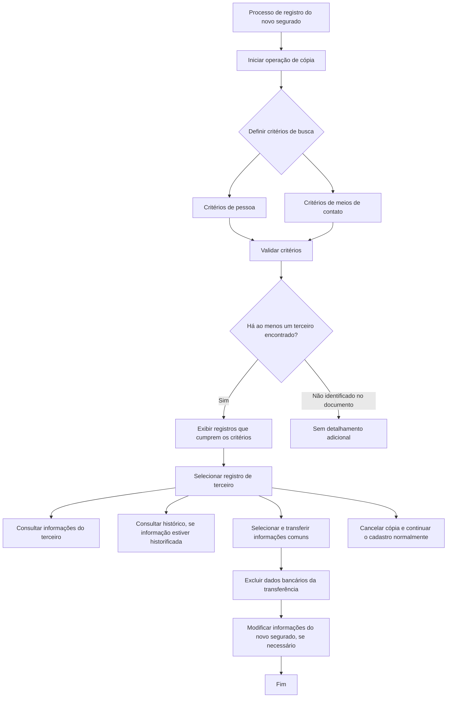

# Operação: Criar Segurado a Partir das Informações de Outro Terceiro

## 1. Metadados do Documento
- **Arquivo de Origem:** Não identificado no conteúdo fornecido
- **Tipo de Documento:** Procedimento
- **Domínio / Sistema:** Reef / Mapfre
- **Público-Alvo:** Operação, Negócio, Analistas Funcionais
- **Data/Versão Identificada:** Não identificada

---

## 2. Resumo Executivo & Contexto de Negócio

O documento descreve a operação **“Crear Asegurado Partiendo de la Información de Otro Tercero”**, destinada a registrar um novo segurado — pessoa física ou jurídica — reutilizando informações de um terceiro já existente no sistema.

A origem das informações não precisa estar limitada a um terceiro associado à **Atividade 1 - Segurado**. O terceiro de origem pode possuir qualquer atividade associada, sendo transferidos somente os dados de blocos de informação comuns entre a atividade existente e o novo segurado.

A operação de cópia pode ser iniciada em qualquer momento do processo de registro do novo segurado por meio de um botão não identificado na extração. A busca pelo terceiro de origem pode usar critérios relacionados à pessoa ou aos meios de contato.

Após a validação dos critérios e a localização de pelo menos um registro, o operador pode consultar os dados do terceiro, consultar seu histórico quando a informação estiver historificada, copiar dados para o novo segurado ou cancelar a cópia e prosseguir com o cadastro normal.

A principal restrição funcional explícita é que **dados bancários nunca são transferidos do terceiro de origem para o novo segurado**.

---

## 3. Arquitetura, Componentes & Tecnologias Envolvidas

Os componentes e elementos explicitamente citados são:

- **Sistema Reef:** contexto de documentação e operação.
- **MapfreDocument:** repositório ou contexto documental indicado no conteúdo.
- **Terceiro de origem:** registro previamente existente usado como fonte de informações.
- **Novo segurado:** entidade em registro, que pode ser pessoa física ou jurídica.
- **Atividade 1 - Segurado:** atividade citada como não obrigatória no terceiro de origem.
- **Bloco de dados bancários:** bloco explicitamente excluído do processo de transferência.
- **Histórico:** fonte de consulta aplicável quando as informações do terceiro estiverem historificadas.
- **Critérios de busca de pessoa:** critério possível para localizar o terceiro.
- **Critérios de busca de meios de contato:** critério alternativo ou complementar para localizar o terceiro.



> **Nota de Análise:** O documento não detalha telas, métodos HTTP, contratos de integração, banco de dados, tecnologias de implementação, formatos de mensagens ou regras de correspondência entre blocos de informação.

---

## 4. Regras de Negócio, Especificações Funcionais & Processos

### Regras de negócio

1. A operação permite capturar as informações de um novo segurado a partir das informações de outro terceiro previamente registrado no sistema.
2. O novo segurado pode ser uma **pessoa física** ou uma **pessoa jurídica**.
3. O terceiro de origem pode ter associada qualquer atividade.
4. O terceiro de origem não precisa possuir exclusivamente a **Atividade 1 - Segurado**.
5. Apenas dados pertencentes a blocos de informação comuns às duas atividades são transferidos.
6. Informações do bloco de **dados bancários** nunca devem ser transferidas do terceiro de origem.
7. A operação de cópia pode ser iniciada em qualquer momento do processo de registro do novo segurado.
8. A busca pode considerar dados de pessoa, dados de meios de contato ou ambos, conforme os critérios capturados.
9. Os critérios de busca precisam ser aceitos e validados antes da apresentação dos resultados.
10. A seleção de um terceiro depende da existência de pelo menos um registro que corresponda aos critérios de busca.
11. Após selecionar um terceiro, o operador pode consultar suas informações.
12. Se a informação do terceiro estiver historificada, o operador pode consultar o histórico.
13. Após a transferência, a informação do novo segurado pode ser modificada.
14. O operador pode cancelar a operação de cópia e continuar o cadastro do terceiro de forma natural.

### Fluxo operacional

1. Iniciar ou estar em andamento no processo de registro do novo segurado.
2. Acionar a operação de cópia por meio do botão mencionado no documento.
3. Informar critérios de busca relacionados à pessoa e/ou aos meios de contato.
4. Aceitar e validar os critérios capturados.
5. Exibir os registros que cumprem os critérios, caso exista pelo menos um resultado.
6. Selecionar um registro de terceiro.
7. Consultar as informações do terceiro, se necessário.
8. Consultar o histórico das informações, quando estas estiverem historificadas.
9. Selecionar e transferir as informações aplicáveis ao novo segurado.
10. Garantir que dados bancários não sejam transferidos.
11. Modificar as informações copiadas do novo segurado, se necessário.
12. Finalizar a operação ou cancelá-la para seguir com o cadastro normal.

---

## 5. Tabelas de Parâmetros, Ambientes e Estruturas de Dados

| Item / Parâmetro | Descrição / Função | Tipo / Valores / Formato | Ambiente / Observações |
| :--- | :--- | :--- | :--- |
| Novo segurado | Entidade cuja informação é registrada durante a operação. | Pessoa física ou pessoa jurídica. | Pode receber informações copiadas de outro terceiro. |
| Terceiro de origem | Registro previamente cadastrado utilizado como fonte de dados. | Terceiro com qualquer atividade associada. | Não precisa estar associado exclusivamente à Atividade 1 - Segurado. |
| Atividade 1 - Segurado | Atividade citada como possível associação de um terceiro. | Atividade de terceiro. | Não é condição obrigatória para que o terceiro seja usado como origem. |
| Blocos de informação comuns | Dados passíveis de transferência entre terceiro de origem e novo segurado. | Não detalhado. | Somente blocos comuns às atividades envolvidas devem ser transferidos. |
| Dados bancários | Informações bancárias do terceiro de origem. | Bloco de informação. | Nunca devem ser transferidos para o novo segurado. |
| Critérios de busca de pessoa | Dados usados para localizar terceiros. | Não detalhado. | Devem ser aceitos e validados. |
| Critérios de busca de meios de contato | Dados de contato usados para localizar terceiros. | Não detalhado. | Podem ser usados indistintamente dos critérios de pessoa. |
| Resultados da busca | Registros que satisfazem os critérios validados. | Um ou mais registros. | A seleção só é possível se houver pelo menos um resultado. |
| Histórico do terceiro | Consulta de versões históricas da informação do terceiro. | Informação historificada. | Disponível quando a informação do terceiro estiver historificada. |
| Operação de cópia | Função para copiar informações de um terceiro para o novo segurado. | Ação iniciada por botão. | Pode ser iniciada em qualquer momento do registro. |
| Cancelamento da cópia | Interrupção da operação de cópia. | Ação operacional. | Permite continuar o cadastro do terceiro de maneira natural. |
| Sistema / documentação | Contexto em que o procedimento está documentado. | Reef; MapfreDocument. | O conteúdo também apresenta referências a “DOCUMENTACIÓN Reef”. |
| Owner | Proprietário indicado na página documental. | `user:agonzalez_mapfre.com` | Valor reproduzido conforme extração. |
| Lifecycle | Estado de ciclo de vida mostrado na página. | `Approved Source` | Relação exata entre “Approved” e “Source” não foi detalhada. |
| Idioma | Idioma indicado na navegação documental. | `ES` | O conteúdo principal está em espanhol. |

---

## 6. Bateria de Perguntas & Respostas para RAG (FAQ Sintético)

### P1: Qual é a finalidade da operação “Criar Segurado a Partir das Informações de Outro Terceiro”?
**R:** A operação permite registrar um novo segurado, pessoa física ou jurídica, usando como base as informações de outro terceiro já registrado no sistema.

### P2: O terceiro de origem precisa possuir a Atividade 1 - Segurado?
**R:** Não. O documento estabelece que a informação do novo segurado pode proceder de um terceiro com qualquer atividade associada, não exclusivamente de um terceiro vinculado à Atividade 1 - Segurado.

### P3: Quais informações são transferidas do terceiro de origem para o novo segurado?
**R:** São transferidos os dados dos blocos de informação que forem comuns tanto à atividade associada ao terceiro de origem quanto à atividade do novo segurado. O documento não detalha a lista desses blocos.

### P4: Os dados bancários do terceiro de origem são copiados para o novo segurado?
**R:** Não. O documento determina expressamente que nenhuma informação do bloco de dados bancários deve ser transferida do terceiro de origem.

### P5: Em que momento do cadastro é possível iniciar a operação de cópia?
**R:** A operação de cópia pode ser iniciada em qualquer momento do processo de registro das informações do novo segurado.

### P6: Quais critérios podem ser utilizados para buscar o terceiro de origem?
**R:** A busca pode utilizar critérios relacionados aos dados da pessoa ou aos dados dos meios de contato. O documento afirma que esses critérios podem ser capturados indistintamente.

### P7: O que acontece depois que os critérios de busca são aceitos e validados?
**R:** Se o sistema encontrar pelo menos um registro que cumpra os critérios, os registros correspondentes são exibidos para que um terceiro possa ser selecionado.

### P8: O operador pode consultar informações antes de copiar dados do terceiro?
**R:** Sim. Depois de selecionar o terceiro, o operador pode consultar suas informações antes de decidir pela transferência de dados ao novo segurado.

### P9: Quando é possível consultar o histórico de um terceiro?
**R:** O histórico pode ser consultado quando as informações do terceiro estiverem historificadas.

### P10: É possível alterar as informações copiadas para o novo segurado?
**R:** Sim. O documento informa que os dados transferidos podem ser modificados como parte do processo de registro do novo segurado.

### P11: O que ocorre se o operador desistir da operação de cópia?
**R:** O operador pode cancelar a operação de cópia e continuar o cadastro do terceiro de maneira natural, sem a transferência de informações do terceiro de origem.

### P12: O documento informa detalhes técnicos sobre APIs, serviços ou formatos de dados?
**R:** Não. O conteúdo descreve o procedimento funcional de busca, seleção, consulta e transferência de informações, mas não fornece detalhes técnicos sobre APIs, contratos JSON, métodos HTTP, banco de dados ou tecnologias de implementação.

---

## 7. Glossário de Termos, Siglas & Conceitos-Chave

- **Reef:** Nome citado no contexto da documentação do procedimento.
- **MapfreDocument:** Nome citado na área de documentação apresentada no conteúdo.
- **Terceiro:** Registro previamente existente no sistema que pode ser usado como origem de informações.
- **Novo segurado:** Pessoa física ou jurídica que está sendo registrada e pode receber informações de um terceiro de origem.
- **Atividade 1 - Segurado:** Atividade mencionada no documento; não é exigida como atividade exclusiva do terceiro de origem.
- **Dados bancários:** Bloco de informações que não pode ser transferido do terceiro de origem.
- **Meios de contato:** Dados que podem ser usados como critérios de busca de terceiros.
- **Informação historificada:** Informação para a qual existe histórico disponível para consulta.
- **Operação de cópia:** Processo de consultar, selecionar e transferir informações aplicáveis de um terceiro para o novo segurado.
- **Owner:** Campo apresentado na página documental para indicar um proprietário.
- **Lifecycle:** Campo apresentado na página documental para indicar o estado de ciclo de vida.
- **ES:** Indicador de idioma espanhol mostrado na navegação.

---

## 8. Notas Críticas, Riscos & Limitações

- O documento não identifica o arquivo de origem, data, versão, autor formal ou identificador documental.
- O botão utilizado para iniciar a operação de cópia é mencionado, mas sua identificação visual, rótulo e comportamento detalhado não foram preservados na extração.
- Não há detalhamento dos campos que compõem os critérios de busca de pessoa ou de meios de contato.
- Não há definição dos blocos de informação considerados comuns entre atividades.
- Não há descrição de mensagens de validação, critérios de desempate, paginação, filtros adicionais ou comportamento quando não há resultados.
- Não são fornecidos detalhes de arquitetura técnica, integrações, APIs, métodos HTTP, contratos de dados, segurança, auditoria ou persistência.
- O texto extraído contém caracteres possivelmente corrompidos por OCR ou codificação, como `historicada` e `modicar`; o contexto indica “historificada” e “modificar”, mas a referência bruta é preservada sem correção.
- A relação exata entre os textos “Lifecycle”, “Approved Source” e “VL” não é explicada no conteúdo fornecido.

---

## 9. Conteúdo Bruto Estruturado (Referência Fiel)

```text
--- [PÁGINA 1 DE 1] ---

OPERACIÓN Crear Asegurado Partiendo de la Información de Otro
Tercero
Esta operación permite capturar la Información de un Nuevo Asegurado (sea este una Persona Física o Jurídica) partiendo de la información
de Otro Tercero previamente registrado en el Sistema.
La información para el Nuevo Asegurado puede proceder de un Tercero previamente registrado que tenga asociada cualquier Actividad
(en cuyo caso se trasladarán los datos de aquellos bloques de información que son comunes a ambas actividades) y no proceder
únicamente de un Tercero que tenga asociada la la Actividad 1 - Asegurado.
En cualquier caso Nunca se trasladará Información al Bloque de Información de los Datos Bancarios desde el Tercero Origen.
Para ello y en cualquier momento del Proceso de Registro de la Información para el Nuevo Asegurado podremos iniciar con la Operación de
Copiado pulsando sobre el Botón:
Proceso
INICIO CRITERIOS
de BÚSQUEDA, PERSONA?
CRITERIOS
de BÚSQUEDA, MEDIOS
de CONTACTO?
MOSTRAR REGISTROS
que CUMPLEN CRITERIOS
SELECCIONAR REGISTRO
TERCERO
CONSULTAR Información
TERCERO
SELECCIONAR & TRASLADAR Inf.
del TERCERO FIN
Una vez se acepten y validen los criterios de búsqueda que se hayan capturado (sean estos indistintamente los datos de la persona o los
datos de los Medios de Contacto) y en el supuesto que se encuentre al menos un registro como resultado de la búsqueda de dichos criterios
en el Sistema, podremos seleccionarlo para:
Consultar su información.
Consultar en el Histórico su información (caso que la información del Tercero esté historicada)
Trasladar al Nuevo Asegurado los datos del Tercero con la posibilidad de modicar su información.
Cancelar la Operación de copiado y continuar con el alta del Tercero de manera natural.
Documentation / DOCUMENTACIÓN Reef
DOCUMENTACIÓN Reef
Mapfredocument
DOCUMENTACIÓN Reef
Owner
user:agonzalez_mapfre.com
Lifecycle
Approved Source
 / 
 VL
Buscar Inicio Soluciones Arquitecturas APIs Componentes Cloud Documentación Zeus Reef Ayuda
ES
```
