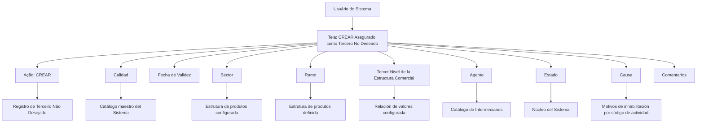

# Registro de Terceiro Não Desejado — Documentação Reef / Mapfre

## 1. Metadados do Documento
- **Arquivo de Origem:** `Não identificado`
- **Tipo de Documento:** Manual Operacional
- **Domínio / Sistema:** Reef / Mapfre — cadastro de Terceiros Não Desejados
- **Público-Alvo:** Operação, Negócio e usuários do sistema
- **Data/Versão Identificada:** Não identificada

---

## 2. Resumo Executivo & Contexto de Negócio

O documento descreve a tela **“CREAR Asegurado como Tercero No Deseado”**, cuja finalidade é permitir que o sistema registre um Terceiro como **Terceiro Não Desejado**. O registro é realizado conforme o código de atividade e os valores dos atributos que compõem a atribuição do Terceiro.

A funcionalidade disponibiliza a ação **CREAR** e organiza a captura das informações na seção **Datos Terceros No Deseados**, seguindo uma sequência de preenchimento da esquerda para a direita e de cima para baixo. Os atributos incluem qualidade, data de validade, setor, ramo, terceiro nível da estrutura comercial, agente, estado, causa e comentários.

O cadastro permite restringir a condição de Terceiro Não Desejado por dimensões organizacionais e de produto. Os códigos genéricos `9999` para **Sector**, `999` para **Ramo** e `9999` para **Tercer Nivel de la Estructura Comercial** permitem aplicar a classificação de forma abrangente a todos os valores existentes em cada dimensão.

A **Fecha de Validez** possibilita identificar desde quando o Terceiro deve ser tratado como Não Desejado e manter histórico das alterações efetuadas nas informações do Terceiro. A causa e os comentários permitem registrar a motivação da inabilitação e complementar a justificativa para considerar uma pessoa física ou jurídica indesejável.

---

## 3. Arquitetura, Componentes & Tecnologias Envolvidas

O documento menciona os seguintes componentes e contextos:

- **Sistema:** sistema não nomeado no conteúdo funcional; associado à documentação Reef / Mapfre.
- **Tela funcional:** `CREAR Asegurado como Tercero No Deseado`.
- **Ação habilitada:** `CREAR`.
- **Catálogo maestro del Sistema:** origem dos códigos de qualidade.
- **Estructura de productos configurada en el Sistema:** origem dos códigos de setor.
- **Estructura de productos definida en el Sistema:** origem dos códigos de ramo técnico.
- **Relación de valores configurada en el Sistema:** origem dos códigos do terceiro nível da estrutura comercial.
- **Catálogo de Intermediarios:** origem dos valores possíveis para agente.
- **Núcleo del Sistema:** fornece a classificação de estado.
- **Causas o motivos de inhabilitación configurados por código de actividad:** origem das causas de inabilitação.



> **Nota de Análise:** O documento não detalha tecnologias, APIs, métodos HTTP, contratos JSON, banco de dados, ambientes, URLs, autenticação ou integrações técnicas.

---

## 4. Regras de Negócio, Especificações Funcionais & Processos

### Processo de criação

1. O usuário acessa a tela **CREAR Asegurado como Tercero No Deseado**.
2. O usuário utiliza a ação habilitada **CREAR**.
3. O usuário preenche os atributos de **Datos Terceros No Deseados** na sequência indicada pelo documento: da esquerda para a direita e de cima para baixo.
4. O sistema registra o Terceiro como Terceiro Não Desejado de acordo com:
   - código de atividade;
   - valores dos atributos que compõem sua atribuição.
5. A data de validade determina a partir de quando o Terceiro será identificado como Não Desejado.
6. O uso de valores genéricos ou específicos em setor, ramo e terceiro nível da estrutura comercial define o escopo de aplicação da condição de Terceiro Não Desejado.

### Regras por atributo

- **Calidad:** deve capturar o código de qualidade associado ao Terceiro, conforme valores previamente codificados no catálogo mestre do sistema.
- **Fecha de Validez:** indica a data a partir da qual o Terceiro será identificado como Terceiro Não Desejado. O preenchimento correto permite preservar histórico das mudanças realizadas nas informações do Terceiro.
- **Sector:** contém o código do setor conforme a estrutura de produtos configurada no sistema.
  - O código genérico `9999` marca o Terceiro como Não Desejado para todos os setores existentes.
  - Um código de setor específico marca o Terceiro como Não Desejado somente para as operações daquele setor.
  - O sistema permite marcar o Terceiro como Não Desejado para apenas um setor entre os `n` setores existentes.
- **Ramo:** deve conter o código do ramo técnico conforme a estrutura de produtos definida no sistema.
  - O código genérico `999` marca o Terceiro como Não Desejado para todos os ramos existentes.
  - Um código de ramo técnico específico marca o Terceiro como Não Desejado apenas para aquele ramo.
- **Tercer Nivel de la Estructura Comercial:** deve conter o código do terceiro nível da estrutura comercial, conforme a relação de valores configurada no sistema.
  - O código genérico `9999` marca o Terceiro como Não Desejado para todas as oficinas existentes.
  - Um código de oficina específico marca o Terceiro como Não Desejado somente para aquela oficina.
- **Agente:** deve registrar o código do agente, segundo os valores possíveis configurados no catálogo de intermediários do sistema.
- **Estado:** contém uma classificação fornecida pelo núcleo do sistema sobre possíveis condições e situações que identificam o Terceiro como Não Desejado.
- **Causa:** contém o motivo da inabilitação do Terceiro, segundo causas ou motivos de inabilitação configurados por código de atividade no sistema.
- **Comentarios:** permite registrar texto livre para ampliar ou detalhar o motivo pelo qual o Terceiro é considerado uma pessoa física ou jurídica indesejável.

---

## 5. Tabelas de Parâmetros, Ambientes e Estruturas de Dados

| Item / Parâmetro | Descrição / Função | Tipo / Valores / Formato | Ambiente / Observações |
| :--- | :--- | :--- | :--- |
| Ação `CREAR` | Permite criar o registro de um Terceiro Não Desejado. | Ação habilitada. | Não há detalhamento sobre permissões ou comportamento posterior ao acionamento. |
| Calidad | Captura o código de qualidade associado ao Terceiro. | Código previamente codificado. | Valores provenientes do catálogo mestre do sistema. |
| Fecha de Validez | Define a data a partir da qual o Terceiro é identificado como Não Desejado. | Data. | Permite manter histórico das alterações das informações do Terceiro. |
| Sector | Define o escopo da condição de Terceiro Não Desejado por setor. | Código de setor; código genérico `9999`. | Baseado na estrutura de produtos configurada no sistema. `9999` aplica-se a todos os setores; código específico aplica-se somente às operações do setor informado. |
| Ramo | Define o escopo da condição de Terceiro Não Desejado por ramo técnico. | Código de ramo técnico; código genérico `999`. | Baseado na estrutura de produtos definida no sistema. `999` aplica-se a todos os ramos; código específico aplica-se somente ao ramo informado. |
| Tercer Nivel de la Estructura Comercial | Define o escopo da condição por terceiro nível da estrutura comercial ou oficina. | Código do terceiro nível; código genérico `9999`. | Baseado na relação de valores configurada no sistema. `9999` aplica-se a todas as oficinas; código específico aplica-se somente à oficina indicada. |
| Agente | Registra o código do agente. | Código de agente. | Valores provenientes do catálogo de intermediários do sistema. |
| Estado | Classifica as condições e situações que identificam o Terceiro como Não Desejado. | Classificação do núcleo do sistema. | O documento não enumera estados possíveis. |
| Causa | Registra o motivo de inabilitação do Terceiro. | Causa ou motivo configurado. | Configurado por código de atividade no sistema. |
| Comentarios | Complementa ou detalha a justificativa de classificação do Terceiro como pessoa física ou jurídica indesejável. | Texto plano. | Não há limite de tamanho ou regras de obrigatoriedade descritos. |

---

## 6. Bateria de Perguntas & Respostas para RAG (FAQ Sintético)

### P1: Qual é o objetivo da tela “CREAR Asegurado como Tercero No Deseado”?
**R:** A tela permite registrar um Terceiro como Terceiro Não Desejado. O registro é realizado de acordo com o código de atividade e com os valores dos atributos que compõem a atribuição do Terceiro.

### P2: Qual ação está habilitada para registrar um Terceiro Não Desejado?
**R:** A ação habilitada no documento é **CREAR**, utilizada para criar o registro de Terceiro Não Desejado.

### P3: Como o código `9999` deve ser usado no atributo Sector?
**R:** No atributo **Sector**, o código genérico `9999` permite marcar o Terceiro como Terceiro Não Desejado para todos os setores existentes. Quando é informado o código de um setor específico, a classificação aplica-se somente às operações daquele setor.

### P4: É possível marcar um Terceiro Não Desejado apenas para um setor específico?
**R:** Sim. O documento informa que, ao utilizar o código de um setor concreto, o sistema identifica o Terceiro como Não Desejado apenas para as operações desse setor. O sistema contempla a marcação para um único setor entre os `n` setores existentes.

### P5: Qual é a função do código `999` no atributo Ramo?
**R:** O código genérico `999` no atributo **Ramo** permite marcar o Terceiro como Não Desejado para todos os ramos existentes. Quando é informado o código de um ramo técnico específico, a classificação fica limitada àquele ramo.

### P6: Como a data de validade afeta o registro de Terceiro Não Desejado?
**R:** A **Fecha de Validez** determina a data a partir da qual o Terceiro será identificado como Terceiro Não Desejado. O uso correto dessa data permite manter histórico das mudanças efetuadas nas informações do Terceiro.

### P7: O que representa o código `9999` no terceiro nível da estrutura comercial?
**R:** No atributo **Tercer Nivel de la Estructura Comercial**, o código genérico `9999` permite marcar o Terceiro como Não Desejado para todas as oficinas existentes. Um código de oficina específico limita a identificação àquela oficina.

### P8: De onde vem o valor do atributo Agente?
**R:** O atributo **Agente** deve registrar o código do agente de acordo com a relação de valores possíveis configurada no catálogo de intermediários do sistema.

### P9: Quem fornece a classificação do atributo Estado?
**R:** O atributo **Estado** contém uma classificação fornecida pelo núcleo do sistema, relacionada às possíveis condições e situações que identificam o Terceiro como Terceiro Não Desejado.

### P10: Como a causa de inabilitação é definida?
**R:** O atributo **Causa** contém o motivo pelo qual o Terceiro está sendo inabilitado. As causas ou motivos de inabilitação são configurados no sistema por código de atividade.

### P11: Para que serve o atributo Comentarios?
**R:** O atributo **Comentarios** permite capturar texto plano para ampliar ou detalhar o motivo pelo qual o Terceiro está sendo considerado uma pessoa física ou jurídica indesejável.

### P12: O documento informa quais são os estados, causas ou códigos válidos para o cadastro?
**R:** Não. O documento informa as origens desses valores — núcleo do sistema, catálogo mestre, estrutura de produtos, relação de valores, catálogo de intermediários e configurações por código de atividade — mas não lista os códigos ou valores permitidos.

---

## 7. Glossário de Termos, Siglas & Conceitos-Chave

- **Terceiro Não Desejado / Tercero No Deseado:** classificação aplicada a um Terceiro considerado indesejável, com escopo que pode variar conforme setor, ramo e estrutura comercial.
- **Asegurado:** termo presente no título da tela; o documento não fornece definição adicional.
- **Calidad:** código de qualidade associado ao Terceiro, obtido a partir do catálogo mestre do sistema.
- **Fecha de Validez:** data a partir da qual o Terceiro deve ser identificado como Não Desejado.
- **Sector:** código de setor conforme a estrutura de produtos configurada no sistema.
- **Ramo:** código do ramo técnico conforme a estrutura de produtos definida no sistema.
- **Tercer Nivel de la Estructura Comercial:** código do terceiro nível da estrutura comercial, associado no texto à identificação por oficina.
- **Agente:** código de agente obtido a partir do catálogo de intermediários.
- **Estado:** classificação de condições e situações fornecida pelo núcleo do sistema.
- **Causa:** motivo da inabilitação, configurado por código de atividade.
- **Comentarios:** campo de texto plano para detalhar a razão da classificação como pessoa física ou jurídica indesejável.
- **Reef:** nome presente na identificação da documentação.
- **Mapfre / Mapfredocument:** identificação presente no conteúdo bruto da documentação.

---

## 8. Notas Críticas, Riscos & Limitações

- O documento não informa o nome do sistema operacional ou aplicação responsável pela tela, além das referências a Reef e Mapfre.
- Não foram documentados métodos HTTP, contratos JSON, APIs, integrações, banco de dados, logs, URLs, servidores, ambientes ou mecanismos de autenticação.
- O documento não especifica se os campos são obrigatórios, opcionais, editáveis, condicionais ou validados no momento da criação.
- Os catálogos, relações de valores, códigos de atividade, estados e causas são mencionados, mas seus valores permitidos não são apresentados.
- Não há detalhamento sobre o efeito operacional da classificação de Terceiro Não Desejado nas operações do sistema.
- Não há definição adicional para os termos **Consejo**, que aparece repetidamente no conteúdo bruto.
- **Nota de Análise:** O documento descreve o comportamento funcional dos códigos genéricos `9999` e `999`, mas não detalha regras para combinações entre setor, ramo, oficina, agente, estado e causa.

---

## 9. Conteúdo Bruto Estruturado (Referência Fiel)

```text
--- [PÁGINA 1 DE 2] ---

CREAR Asegurado como Tercero No Deseado
Objetivo
El propósito de esta pantalla es proporcionar la funcionalidad para que el Sistema pueda registrar al Tercero como un Tercero No Deseado,
de acuerdo con su código de actividad y de los valores de los atributos que conforman su asignación.
Acciones habilitadas
 CREAR ( )
Datos Terceros No Deseados
De Izquierda a Derecha y de Arriba hacia Abajo, los siguientes atributos marcan la secuencia de captura de la Información en el sistema.
Calidad (  )
Este Campo va a permitir capturar el código de calidad que se va a asociar al Tercero de acuerdo con los valores previamente codicados en
el catálogo maestro del Sistema, en el momento de registrarlo como Tercero No Deseado.
Fecha de Validez ( )
Esta propiedad le indica al sistema la fecha a partir de la cual el Tercero va a ser identicado como Tercero No Deseado por lo que su
correcto uso permite tener un histórico de los cambios efectuados en la Información del Tercero.
Sector (  )
Este Campo contiene el código del sector de acuerdo con la estructura de productos congurada en el Sistema.
Documentation / DOCUMENTACIÓN Reef
DOCUMENTACIÓN Reef
Mapfredocument
DOCUMENTACIÓN Reef
Owner
user:agonzalez_mapfre.com
Lifecycle
Approved Source
 / 
 VL
Buscar Inicio Soluciones Arquitecturas APIs Componentes Cloud Documentación Zeus Reef Ayuda
ES


--- [PÁGINA 2 DE 2] ---

Utilizando el valor genérico en este atributo (código 9999) el sistema permite marcar al Tercero como Tercero no Deseado para todos los
Sectores existentes o bien al utilizar el código de un Sector en concreto, identicar al Tercero como Tercero no Deseado únicamente para
las Operaciones de este Sector.
De esta manera el sistema contempla la posibilidad de marcaje de un Tercero como Tercero No Deseado para un único Sector de los n
existentes.
Ramo (  )
Este Campo deber contener el código del ramo técnico de acuerdo con la estructura de productos denida en el Sistema.
Utilizando el valor genérico en este atributo (código 999) el sistema permite marcar al Tercero como Tercero no Deseado para todos los
Ramos existentes o bien al utilizar el código de un Ramo Técnico de los n existentes, identicar al Tercero como Tercero no Deseado
únicamente para ese Ramo.
Tercer Nivel de la Estructura Comercial (  )
Este Campo ha de contener el código del tercer nivel de la Estructura Comercial, de acuerdo con la relación de valores congurada en el
Sistema.
Utilizando el valor genérico en este atributo (código 9999), el sistema permite marcar al Tercero como Tercero no Deseado para todas las
Ocinas existentes o bien al utilizar el código de una Ocina en Particular, identicar al Tercero como Tercero no Deseado únicamente
para esa Ocina.
Agente (  )
Este Campo tiene que registrar el código del agente de acuerdo con la relación de posibles valores congurada en el catálogo de
Intermediarios en el Sistema.
Estado (  )
Este atributo contiene una clasicación proporcionada por el núcleo del Sistema, de las posibles condiciones y situaciones que identican al
Tercero como Tercero No Deseado.
Causa (  )
Este Campo contiene el motivo por el cual se está Inhabilitando al Tercero, de acuerdo con las causas o motivos de inhabilitación que se
hayan congurado por código de actividad en el Sistema.
Comentarios ( )
Este Atributo permite capturar texto plano para ampliar o detallar el motivo por el que se está considerando al Tercero como una Persona
Física o Jurídica indeseable.
Consejo:
Consejo:
Consejo:
```
