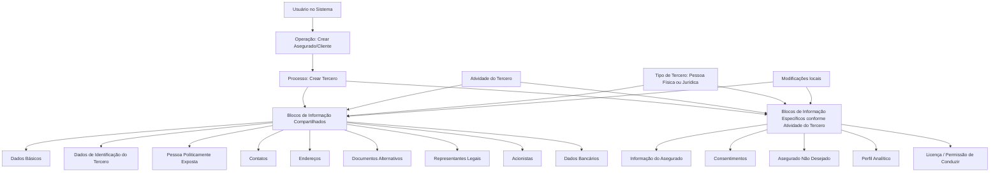

# Operação “Crear Asegurado/Cliente” — Registro de Informações de Terceiros no Reef

## 1. Metadados do Documento
- **Arquivo de Origem:** Não informado; conteúdo bruto fornecido contém 2 páginas.
- **Tipo de Documento:** Manual Operacional.
- **Domínio / Sistema:** Reef / Mapfre — gestão de Terceiros, Asegurados e Clientes.
- **Público-Alvo:** Usuários do sistema, analistas funcionais e equipes responsáveis pelo cadastro de Terceiros.
- **Data/Versão Identificada:** Não identificada.
- **Status documental identificado:** `Lifecycle: Approved Source`.
- **Proprietário identificado:** `user:agonzalez_mapfre.com`.

---

## 2. Resumo Executivo & Contexto de Negócio

O documento descreve a operação **“Crear Asegurado/Cliente”**, cuja finalidade é registrar informações de Asegurados no sistema Reef. A operação está associada ao processo de criação de um **Tercero**, termo utilizado pelo documento para representar a entidade cadastrada.

O cadastro de um Tercero é composto por blocos de informação compartilhados e blocos de informação específicos. Os blocos compartilhados abrangem informações cadastrais, identificação, contatos, endereços, documentos, representantes legais, acionistas e dados bancários. Os blocos específicos abrangem informações diretamente relacionadas ao Asegurado, consentimentos, classificação de Asegurado não desejado, perfil analítico e licença ou permissão de conduzir.

A obrigatoriedade e a habilitação dos campos não são uniformes para todos os cadastros. O documento informa que esses comportamentos podem variar segundo o código de atividade do Tercero, segundo o fato de o Tercero ser Pessoa Física ou Pessoa Jurídica e segundo modificações implementadas localmente.

A ordem de captura das informações também não é fixa. O usuário do sistema pode determinar a sequência de preenchimento dos diferentes blocos de informação. O documento não especifica regras de persistência, validações por campo, contratos de integração, métodos HTTP, modelo de dados físico ou critérios concretos para cada código de atividade.

---

## 3. Arquitetura, Componentes & Tecnologias Envolvidas

Os componentes e conceitos funcionais explicitamente identificados são:

- **Reef:** sistema ou domínio documental no qual a operação está registrada.
- **Mapfre:** contexto corporativo exibido na navegação documental.
- **Mapfredocument:** repositório ou contexto documental citado no conteúdo bruto.
- **Crear Tercero:** processo de criação do Tercero.
- **Crear Asegurado/Cliente:** operação para registrar informações de Asegurados.
- **Blocos de Informação Compartilhados:** estruturas reutilizáveis no cadastro de Terceros.
- **Blocos de Informação Específicos:** estruturas aplicáveis de acordo com a atividade do Tercero.
- **Usuário no Sistema:** responsável por definir a ordem de captura dos blocos de informação.



> **Nota de Análise:** O documento apresenta uma arquitetura funcional baseada em blocos de informação, mas não detalha módulos técnicos, bancos de dados, APIs, integrações, tecnologias de implementação, URLs, servidores ou ambientes.

---

## 4. Regras de Negócio, Especificações Funcionais & Processos

### 4.1 Finalidade da operação

A operação **Crear Asegurado/Cliente** permite registrar as informações dos Asegurados.

### 4.2 Processo principal

1. O usuário inicia o processo **Crear Tercero**.
2. O usuário registra informações por meio dos blocos de informação disponíveis.
3. O cadastro pode utilizar blocos compartilhados de informação.
4. O cadastro pode utilizar blocos específicos conforme a atividade do Tercero.
5. O usuário pode definir a ordem de preenchimento dos blocos de informação.
6. A obrigatoriedade e a habilitação de campos podem variar conforme regras aplicáveis ao Tercero.

### 4.3 Regras de obrigatoriedade e habilitação de campos

| Regra | Condição que influencia o comportamento | Impacto declarado |
| :--- | :--- | :--- |
| Variação por atividade | Código de atividade do Tercero | A obrigatoriedade e/ou habilitação dos campos pode variar nos blocos ou estruturas de informação compartilhadas. |
| Variação por tipo de Tercero | Pessoa Física ou Pessoa Jurídica | A obrigatoriedade e/ou habilitação dos campos pode variar nos blocos ou estruturas de informação compartilhadas. |
| Variação por implementação local | Modificações implementadas localmente | As modificações podem afetar o comportamento da aplicação em relação à obrigatoriedade do registro dos dados do Tercero. |
| Variação na ordem de captura | Critério adotado pelo usuário no sistema | A ordem de captura dos dados nos diferentes blocos de informação pode variar. |

### 4.4 Restrições e ausência de detalhamento

- O documento não apresenta quais campos são obrigatórios para cada código de atividade.
- O documento não informa quais blocos se aplicam exclusivamente a Pessoa Física ou Pessoa Jurídica.
- O documento não descreve como modificações locais são configuradas, aprovadas ou aplicadas.
- O documento não define validações de formato, tamanhos máximos, valores permitidos ou mensagens de erro.
- O documento não estabelece uma ordem obrigatória entre os blocos de informação.
- O documento não detalha o significado operacional ou os critérios de classificação de **Asegurado No Deseado**.
- O documento não descreve campos ou regras para **Perfil Analítico**, **Consentimientos** ou **Licencia / Permiso de Conducir**.

---

## 5. Tabelas de Parâmetros, Ambientes e Estruturas de Dados

### 5.1 Blocos de Informação Compartilhados no processo Crear Tercero

| Item / Parâmetro | Descrição / Função | Tipo / Valores / Formato | Ambiente / Observações |
| :--- | :--- | :--- | :--- |
| Dados Básicos | Bloco de informação compartilhado do cadastro de Tercero. | Bloco de informação. | Campos não detalhados. Obrigatoriedade e habilitação podem variar. |
| Dados de Identificação do Tercero | Bloco de informação compartilhado para identificação do Tercero. | Bloco de informação. | Campos, documentos e validações não detalhados. |
| Pessoa Politicamente Exposta | Bloco de informação compartilhado relacionado à condição de Pessoa Politicamente Exposta. | Bloco de informação. | Critérios e campos não detalhados. |
| Contatos | Bloco de informação compartilhado para informações de contato. | Bloco de informação. | Campos e regras não detalhados. |
| Endereços | Bloco de informação compartilhado para endereços. | Bloco de informação. | Campos e regras não detalhados. |
| Documentos Alternativos | Bloco de informação compartilhado para documentos alternativos. | Bloco de informação. | Tipos documentais não detalhados. |
| Representantes Legais | Bloco de informação compartilhado para representantes legais. | Bloco de informação. | Aplicabilidade por tipo de Tercero não detalhada. |
| Acionistas | Bloco de informação compartilhado para acionistas. | Bloco de informação. | Campos e aplicabilidade não detalhados. |
| Dados Bancários | Bloco de informação compartilhado para dados bancários. | Bloco de informação. | Campos, contas e validações não detalhados. |

### 5.2 Blocos de Informação Específicos conforme Atividade do Tercero

| Item / Parâmetro | Descrição / Função | Tipo / Valores / Formato | Ambiente / Observações |
| :--- | :--- | :--- | :--- |
| Informação do Asegurado | Bloco específico para informações do Asegurado. | Bloco de informação específico. | Aplicável de acordo com a atividade do Tercero. Campos não detalhados. |
| Consentimentos | Bloco específico para consentimentos do Asegurado. | Bloco de informação específico. | Modalidades, finalidades e regras não detalhadas. |
| Asegurado Não Desejado | Bloco específico para classificação de Asegurado Não Desejado. | Bloco de informação específico. | Critérios de classificação não detalhados. |
| Perfil Analítico | Bloco específico para perfil analítico. | Bloco de informação específico. | Variáveis, regras e cálculo não detalhados. |
| Licença / Permissão de Conduzir | Bloco específico para licença ou permissão de condução. | Bloco de informação específico. | Regras de validade, categoria e documentos não detalhadas. |

### 5.3 Fatores que influenciam o cadastro

| Item / Parâmetro | Descrição / Função | Tipo / Valores / Formato | Ambiente / Observações |
| :--- | :--- | :--- | :--- |
| Código de atividade do Tercero | Influencia a obrigatoriedade e/ou habilitação de campos em blocos ou estruturas de informação compartilhadas. | Código de atividade. | Valores não informados. |
| Tipo de Tercero | Pode influenciar a obrigatoriedade e/ou habilitação de campos. | Pessoa Física ou Pessoa Jurídica. | Critérios específicos não informados. |
| Modificações locais | Podem afetar o comportamento da aplicação quanto à obrigatoriedade dos dados do Tercero. | Implementação local. | Mecanismo de configuração não informado. |
| Critério do usuário | Pode determinar a ordem de captura das informações nos blocos. | Critério operacional do usuário. | Não há sequência obrigatória documentada. |

---

## 6. Bateria de Perguntas & Respostas para RAG (FAQ Sintético)

### P1: Qual é o objetivo da operação “Crear Asegurado/Cliente” no Reef?
**R:** A operação “Crear Asegurado/Cliente” permite registrar as informações dos Asegurados. O documento relaciona essa operação ao processo de criação de um Tercero por meio de blocos de informação compartilhados e específicos.

### P2: O que é criado durante o processo “Crear Tercero”?
**R:** O processo “Crear Tercero” organiza o registro de informações em blocos compartilhados — como Dados Básicos, Identificação, Contatos, Endereços e Dados Bancários — e em blocos específicos associados à atividade do Tercero, como Informação do Asegurado, Consentimentos e Licença ou Permissão de Conduzir.

### P3: A obrigatoriedade dos campos é igual para todos os Terceros?
**R:** Não. O documento informa que a obrigatoriedade e/ou a habilitação dos campos pode variar de acordo com o código de atividade do Tercero, com o tipo de Tercero — Pessoa Física ou Pessoa Jurídica — e com modificações implementadas localmente.

### P4: Quais blocos compartilhados estão disponíveis para o cadastro de um Tercero?
**R:** Os blocos compartilhados listados são: Dados Básicos, Dados de Identificação do Tercero, Pessoa Politicamente Exposta, Contatos, Endereços, Documentos Alternativos, Representantes Legais, Acionistas e Dados Bancários.

### P5: Quais blocos específicos podem ser usados para um Asegurado?
**R:** Os blocos específicos listados são: Informação do Asegurado, Consentimentos, Asegurado Não Desejado, Perfil Analítico e Licença ou Permissão de Conduzir. O documento indica que esses blocos são específicos de acordo com a atividade do Tercero.

### P6: A ordem de preenchimento dos blocos no cadastro é obrigatória?
**R:** Não há uma ordem fixa documentada. O texto informa que a ordem de captura dos dados nos diferentes blocos de informação pode variar conforme o critério seguido pelo usuário no sistema.

### P7: O cadastro de Pessoa Física e Pessoa Jurídica possui exatamente as mesmas regras?
**R:** O documento não afirma que as regras são iguais. Pelo contrário, informa que a obrigatoriedade e/ou habilitação dos campos pode variar quando o Tercero é uma Pessoa Física ou uma Pessoa Jurídica. Os critérios específicos dessa variação não são detalhados.

### P8: Como as modificações locais afetam a operação de criação de Asegurado?
**R:** Modificações implementadas localmente podem afetar o comportamento da aplicação quanto à obrigatoriedade do registro dos dados do Tercero. O documento não descreve quais modificações existem, como são configuradas ou quais campos são impactados.

### P9: O documento define os campos internos do bloco “Dados Bancários”?
**R:** Não. O documento apenas lista “Dados Bancários” como um bloco de informação compartilhado no processo Crear Tercero. Não há detalhamento de campos, formatos, validações ou regras de obrigatoriedade específicas.

### P10: O que significa “Asegurado Não Desejado” no processo?
**R:** “Asegurado Não Desejado” é apresentado como um bloco de informação específico de acordo com a atividade do Tercero. O documento não define o conceito, os critérios de classificação, as consequências operacionais ou os campos associados a esse bloco.

### P11: Existem APIs, URLs ou integrações técnicas documentadas para a operação?
**R:** Não. O conteúdo fornecido não apresenta APIs, métodos HTTP, contratos JSON, endpoints, URLs de ambiente, servidores, portas, bancos de dados ou integrações externas.

### P12: Quem pode determinar a sequência de registro dos dados?
**R:** O usuário no sistema pode determinar a ordem de captura dos dados nos diferentes blocos de informação, conforme o critério seguido durante a operação.

---

## 7. Glossário de Termos, Siglas & Conceitos-Chave

- **Asegurado:** entidade cujas informações são registradas pela operação “Crear Asegurado/Cliente”.
- **Asegurado No Deseado / Asegurado Não Desejado:** bloco de informação específico citado no documento; critérios funcionais não detalhados.
- **Consentimientos / Consentimentos:** bloco específico relacionado a consentimentos; conteúdo e regras não detalhados.
- **Crear Asegurado/Cliente:** operação destinada ao registro das informações dos Asegurados.
- **Crear Tercero:** processo de criação de um Tercero mediante blocos de informação.
- **Dados Básicos:** bloco de informação compartilhado listado no processo Crear Tercero.
- **Dados Bancários:** bloco de informação compartilhado listado no processo Crear Tercero.
- **Mapfre:** referência corporativa exibida na navegação documental.
- **Mapfredocument:** referência documental exibida no conteúdo bruto.
- **Perfil Analítico:** bloco de informação específico citado no documento; critérios e atributos não detalhados.
- **Pessoa Física:** tipo de Tercero que pode influenciar obrigatoriedade e habilitação de campos.
- **Pessoa Jurídica:** tipo de Tercero que pode influenciar obrigatoriedade e habilitação de campos.
- **Pessoa Politicamente Exposta:** bloco de informação compartilhado listado no processo Crear Tercero.
- **Reef:** domínio ou sistema identificado no contexto documental.
- **Tercero:** entidade objeto do processo de criação e de registro de informações.
- **VL:** sigla exibida na interface documental; significado não detalhado no conteúdo.

---

## 8. Notas Críticas, Riscos & Limitações

- **Ausência de detalhamento de campos:** o documento lista blocos de informação, mas não especifica atributos, tipos, formatos, domínios de valores ou validações.
- **Ausência de matriz de obrigatoriedade:** o texto declara que a obrigatoriedade pode variar por atividade, tipo de Tercero e modificações locais, mas não fornece a matriz de regras correspondente.
- **Dependência de configurações locais:** modificações implementadas localmente podem alterar o comportamento de obrigatoriedade, criando risco de diferenças funcionais entre implantações.
- **Ordem de preenchimento variável:** a possibilidade de o usuário definir a ordem de captura exige que fluxos operacionais e validações não assumam uma sequência única, embora o documento não detalhe como isso é controlado.
- **Sem especificação técnica de integração:** não há informações sobre APIs, contratos, persistência, autenticação, infraestrutura, logs ou monitoramento.
- **Sem definições funcionais completas:** blocos como Perfil Analítico, Asegurado Não Desejado, Consentimentos e Licença ou Permissão de Conduzir são somente citados.
- **Nota de Análise:** O documento lista o processo “Crear Tercero” e os respectivos blocos de informação, porém não detalha métodos HTTP, contratos JSON, regras de persistência ou critérios específicos de validação.

---

## 9. Conteúdo Bruto Estruturado (Referência Fiel)

```text
--- [PÁGINA 1 DE 2] ---

OPERACIÓN CREAR Asegurado/Cliente
¿En que consiste?
Esta operación permite registrar la Información de los Asegurados.
Premisas
La obligatoriedad y/o la habilitación de los campos en el registro de los datos de cada uno de los bloques o estructuras de información
compartidas puede variar de acuerdo con el código de actividad del Tercero:
La obligatoriedad y/o la habilitación de los campos en el registro de los datos de cada uno de los bloques o estructuras de información
pueden variar si el tipo de Tercero es una Persona Física o una Persona Jurídica:
Las modicaciones que se hubieran podido implementar localmente a su vez pueden afectar el comportamiento de la aplicación en
relación con la obligatoriedad en el registro de los Datos del Tercero.
Por último, el orden de captura de los datos en los distintos bloques de Información puede variar de acuerdo con el criterio seguido por el
Usuario en el Sistema.
Proceso
CREAR
TERCERO
Información
Asegurado Consentimientos Asegurado
No Deseado
Perfil
Analítico
Licencia
de Conducir
Bloques de Información Compartidos (CREAR TERCERO)
 Datos Básicos ( )
 Datos Identicación del Tercero ( )
 Persona Políticamente Expuesta ( )
 Contactos ( )
 Direcciones ( )
 Documentos Alternativos ( )
 Representantes Legales ( )
Ejemplo:
Ejemplo:
Documentation / DOCUMENTACIÓN Reef
DOCUMENTACIÓN Reef
Mapfredocument
DOCUMENTACIÓN Reef
Owner
user:agonzalez_mapfre.com
Lifecycle
Approved Source
 / 
 VL
Buscar Inicio Soluciones Arquitecturas APIs Componentes Cloud Documentación Zeus Reef Ayuda
ES


--- [PÁGINA 2 DE 2] ---

Accionistas ( )
 Datos Bancarios ( )
Bloques de Información Especícos de acuerdo con la Actividad del Tercero.
 Información del Asegurado ( )
 Consentimientos ( )
 Asegurado No Deseado ( )
 Perl Analítico ( )
 Licencia / Permiso de Conducir ( )
```
