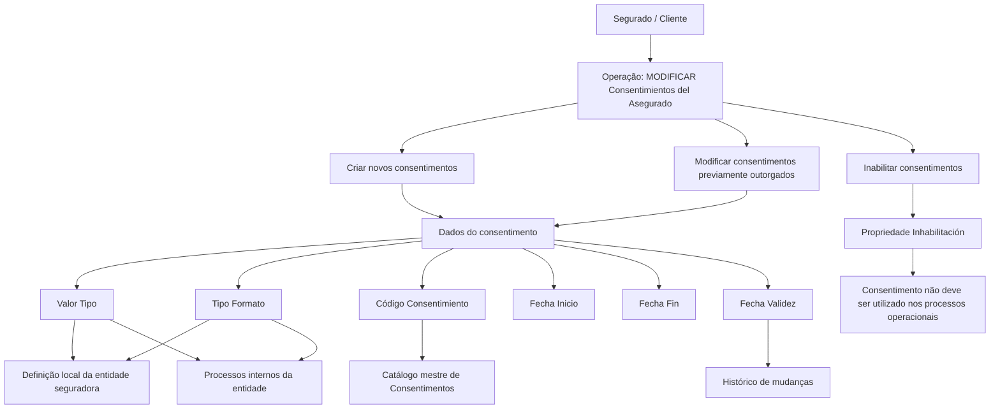

# Gestão de Consentimentos do Segurado — Operação de Criação, Modificação e Inabilitação

## 1. Metadados do Documento
- **Arquivo de Origem:** `Não identificado no conteúdo fornecido`
- **Tipo de Documento:** Especificação Técnica / Funcional
- **Domínio / Sistema:** Reef / Mapfre — Consentimentos do Asegurado ou Cliente
- **Público-Alvo:** Desenvolvedores, Arquitetos, Operação e Negócio
- **Data/Versão Identificada:** Não identificada

---

## 2. Resumo Executivo & Contexto de Negócio

O documento descreve a operação **“MODIFICAR Consentimientos del Asegurado”**, destinada à administração de consentimentos de um Segurado/Cliente. O consentimento é definido como uma manifestação de vontade livre, inequívoca, específica e informada, por meio da qual o interessado aceita o tratamento de dados pessoais que lhe dizem respeito.

A operação permite executar três ações sobre consentimentos: criar novos consentimentos, modificar informações de consentimentos previamente concedidos e inabilitar consentimentos associados ao Segurado/Cliente. O documento apresenta os atributos necessários para capturar e controlar essas informações.

A classificação dos consentimentos depende de catálogos e definições locais da entidade seguradora. O atributo **Valor Tipo**, por exemplo, define o âmbito de uso do consentimento na atividade da companhia seguradora. O atributo **Tipo Formato** classifica o consentimento conforme a normativa local de proteção de dados.

O modelo documentado também prevê controle temporal e operacional. As datas de início, fim e validade permitem registrar a alta, a baixa e o momento a partir do qual o consentimento está plenamente operacional, preservando o histórico de alterações. A propriedade de inabilitação indica que o consentimento não deve ser empregado nos processos operacionais da entidade.

---

## 3. Arquitetura, Componentes & Tecnologias Envolvidas

Os elementos identificados no conteúdo são:

| Componente / Elemento | Papel identificado no documento |
| :--- | :--- |
| Operação “MODIFICAR Consentimientos del Asegurado” | Administração de consentimentos do Segurado/Cliente. |
| Segurado/Cliente | Terceiro ao qual o consentimento está associado. |
| Sistema | Mantém catálogos de consentimentos, registra datas e considera a inabilitação nos processos operacionais. |
| Catálogo mestre de Consentimentos | Fonte dos valores possíveis para o campo Código Consentimento. |
| Entidade seguradora | Define localmente classificações para âmbito e formato dos consentimentos. |
| Processos internos da entidade | Utilizam as classificações locais de consentimento. |
| Processos operacionais da entidade | Não devem utilizar consentimentos inabilitados. |
| Reef / Mapfredocument | Referências presentes na navegação e documentação exibidas no conteúdo. |



**Nota de Análise:** O conteúdo não detalha interfaces, métodos HTTP, contratos JSON, banco de dados, integrações, autenticação, URLs técnicas, servidores ou tecnologias de implementação.

---

## 4. Regras de Negócio, Especificações Funcionais & Processos

### 4.1 Definição de consentimento

O consentimento é definido como:

> “toda manifestación de voluntad, libre, inequívoca, específica e informada, mediante la que el interesado acepta, ya sea mediante una declaración o una clara acción afirmativa, el tratamiento de datos personales que le conciernen.”

Portanto, o consentimento está relacionado à aceitação do tratamento de dados pessoais pelo interessado.

### 4.2 Ações permitidas

A operação contempla as seguintes ações:

1. **CREAR:** criar novos consentimentos.
2. **MODIFICAR:** modificar as informações de consentimentos previamente concedidos pelo Segurado/Cliente.
3. **INHABILITAR:** inabilitar consentimentos associados ao Segurado/Cliente.

### 4.3 Aplicabilidade dos campos

Os atributos de consentimento são apresentados em uma sequência de captura de informação, da esquerda para a direita e de cima para baixo.

Quando os campos não forem expressamente especificados ou indicados, o documento determina que sejam utilizados indistintamente para:

- Registro de informações de **Personas Físicas**.
- Registro de informações de **Personas Jurídicas**.

### 4.4 Valor Tipo

A propriedade **Valor Tipo** indica o âmbito do consentimento atribuído ao Terceiro.

A classificação de Valor Tipo:

- Define o âmbito de utilização do consentimento do Terceiro na atividade da companhia seguradora.
- Deve ser definida localmente pela entidade seguradora.
- Será utilizada posteriormente nos processos internos da entidade.

Exemplos de valores apresentados:

- `001` — Publicidad.
- `002` — Cesión de Datos.
- `003` — Perfilado.

### 4.5 Código Consentimiento

O campo **Código Consentimiento** contém o código do consentimento do Terceiro conforme a relação de valores possíveis existente no catálogo mestre de Consentimentos configurado no Sistema.

### 4.6 Tipo Formato

O atributo **Tipo Formato** contém uma classificação dos consentimentos do Terceiro conforme a normativa local de proteção de dados.

A classificação de Tipo Formato:

- Deve ser definida pela entidade seguradora.
- Será empregada posteriormente nos processos internos da entidade.

Exemplos de valores apresentados:

- `001` — No Otorgado.
- `002` — Tácito.
- `003` — Expreso.
- `004` — Retirado.

### 4.7 Datas do consentimento

- **Fecha Inicio:** indica a data de alta do consentimento do Terceiro.
- **Fecha Fin:** indica a data de baixa em que o consentimento do Terceiro deixa de estar ativo.
- **Fecha Validez:** informa ao Sistema a data a partir da qual o consentimento do Terceiro estará plenamente operacional.

O uso correto de **Fecha Validez** permite manter um histórico das alterações efetuadas nas informações do consentimento.

### 4.8 Inhabilitación

A propriedade **Inhabilitación** informa ao Sistema que o consentimento associado ao Terceiro está inabilitado.

Quando um consentimento estiver inabilitado:

- Não deve ser empregado.
- Não deve ser considerado.
- Não deve ser utilizado nos processos operacionais da entidade.

---

## 5. Tabelas de Parâmetros, Ambientes e Estruturas de Dados

| Item / Parâmetro | Descrição / Função | Tipo / Valores / Formato | Ambiente / Observações |
| :--- | :--- | :--- | :--- |
| CREAR | Cria novos consentimentos. | Ação da operação. | Aplicável à operação de consentimentos. |
| MODIFICAR | Modifica informações de consentimentos previamente outorgados pelo Segurado/Cliente. | Ação da operação. | Aplicável à operação de consentimentos. |
| INHABILITAR | Inabilita consentimentos associados ao Segurado/Cliente. | Ação da operação. | Consentimento inabilitado não deve ser usado em processos operacionais. |
| Valor Tipo | Indica o âmbito do consentimento atribuído ao Terceiro. | Classificação definida localmente. Exemplos: `001 Publicidad`, `002 Cesión de Datos`, `003 Perfilado`. | A entidade seguradora define a classificação para uso posterior em processos internos. |
| Código Consentimiento | Contém o código de consentimento do Terceiro. | Valor pertencente ao catálogo mestre de Consentimentos. | O catálogo deve estar configurado no Sistema. |
| Tipo Formato | Classifica o consentimento do Terceiro conforme normativa local de proteção de dados. | Exemplos: `001 No Otorgado`, `002 Tácito`, `003 Expreso`, `004 Retirado`. | Classificação definida pela entidade seguradora para processos internos. |
| Fecha Inicio | Indica a data de alta do consentimento do Terceiro. | Data. | Sem formato de data especificado. |
| Fecha Fin | Indica a data de baixa em que o consentimento deixa de estar ativo. | Data. | Sem formato de data especificado. |
| Fecha Validez | Indica a data a partir da qual o consentimento estará plenamente operacional no Sistema. | Data. | Permite histórico de alterações na informação do consentimento. |
| Inhabilitación | Indica que o consentimento associado ao Terceiro está inabilitado. | Propriedade / indicador. | O consentimento não deve ser empregado, contemplado ou utilizado nos processos operacionais. |
| Personas Físicas | Tipo de pessoa para o qual os campos podem ser utilizados. | Categoria de registro. | Aplicável indistintamente quando os campos não forem expressamente especificados. |
| Personas Jurídicas | Tipo de pessoa para o qual os campos podem ser utilizados. | Categoria de registro. | Aplicável indistintamente quando os campos não forem expressamente especificados. |

---

## 6. Bateria de Perguntas & Respostas para RAG (FAQ Sintético)

### P1: Qual é o objetivo da operação “MODIFICAR Consentimientos del Asegurado”?
**R:** A operação permite criar novos consentimentos, modificar informações de consentimentos previamente concedidos pelo Segurado/Cliente e inabilitar consentimentos associados ao Segurado/Cliente.

### P2: Como o documento define consentimento?
**R:** O documento define consentimento como uma manifestação de vontade livre, inequívoca, específica e informada, mediante a qual o interessado aceita, por declaração ou clara ação afirmativa, o tratamento de dados pessoais que lhe dizem respeito.

### P3: Quais ações podem ser executadas sobre um consentimento do Segurado/Cliente?
**R:** As ações apresentadas são CREAR, MODIFICAR e INHABILITAR. CREAR cria novos consentimentos, MODIFICAR altera dados de consentimentos previamente outorgados e INHABILITAR torna o consentimento não utilizável nos processos operacionais.

### P4: Para que serve o atributo Valor Tipo no consentimento?
**R:** Valor Tipo indica o âmbito do consentimento atribuído ao Terceiro. A classificação define o âmbito de uso do consentimento na atividade da companhia seguradora e deve ser definida localmente pela entidade seguradora para utilização posterior nos processos internos.

### P5: Quais são exemplos de valores para Valor Tipo?
**R:** O documento apresenta como exemplos `001 Publicidad`, `002 Cesión de Datos` e `003 Perfilado`. A lista é exemplificativa, pois a classificação deve ser definida localmente pela entidade seguradora.

### P6: De onde vem o valor do campo Código Consentimiento?
**R:** O Código Consentimiento contém o código do consentimento do Terceiro de acordo com a relação de valores possíveis existente no catálogo mestre de Consentimentos configurado no Sistema.

### P7: O que representa o atributo Tipo Formato?
**R:** Tipo Formato classifica os consentimentos do Terceiro conforme a normativa local de proteção de dados. Essa classificação deve ser definida pela entidade seguradora e utilizada posteriormente nos processos internos da entidade.

### P8: Quais exemplos de Tipo Formato são indicados?
**R:** Os exemplos apresentados são `001 No Otorgado`, `002 Tácito`, `003 Expreso` e `004 Retirado`.

### P9: Qual é a diferença entre Fecha Inicio, Fecha Fin e Fecha Validez?
**R:** Fecha Inicio indica a data de alta do consentimento. Fecha Fin indica a data de baixa em que o consentimento deixa de estar ativo. Fecha Validez indica a data a partir da qual o consentimento estará plenamente operacional no Sistema e permite manter histórico das alterações efetuadas em suas informações.

### P10: O que acontece quando um consentimento está marcado com Inhabilitación?
**R:** A propriedade Inhabilitación informa ao Sistema que o consentimento associado ao Terceiro está inabilitado. Nessa condição, o consentimento não deve ser empregado, contemplado ou utilizado nos processos operacionais da entidade.

### P11: Os campos de consentimento podem ser usados para pessoas físicas e jurídicas?
**R:** Sim. Quando os campos não forem expressamente especificados ou indicados, o documento informa que eles devem ser empregados indistintamente para o registro de informações de Personas Físicas e Personas Jurídicas.

### P12: O documento informa APIs, métodos HTTP ou contratos JSON para a operação de consentimentos?
**R:** Não. O conteúdo fornecido descreve ações e atributos funcionais de consentimento, mas não detalha métodos HTTP, endpoints, contratos JSON, integrações ou tecnologias de implementação.

---

## 7. Glossário de Termos, Siglas & Conceitos-Chave

- **Consentimiento:** Manifestação de vontade livre, inequívoca, específica e informada para aceitar o tratamento de dados pessoais.
- **Segurado / Asegurado:** Parte identificada no documento como pessoa associada aos consentimentos.
- **Cliente:** Termo utilizado junto a Segurado para identificar quem pode ter consentimentos previamente outorgados.
- **Tercero:** Entidade ou pessoa à qual o consentimento é atribuído.
- **CREAR:** Ação para criação de novos consentimentos.
- **MODIFICAR:** Ação para alteração de informações de consentimentos previamente outorgados.
- **INHABILITAR:** Ação para tornar um consentimento inabilitado.
- **Valor Tipo:** Propriedade que indica o âmbito de emprego do consentimento na atividade da companhia seguradora.
- **Código Consentimiento:** Código do consentimento do Terceiro obtido conforme catálogo mestre de Consentimentos configurado no Sistema.
- **Tipo Formato:** Classificação do consentimento de acordo com a normativa local de proteção de dados.
- **Fecha Inicio:** Data de alta do consentimento.
- **Fecha Fin:** Data de baixa em que o consentimento deixa de estar ativo.
- **Fecha Validez:** Data a partir da qual o consentimento estará plenamente operacional no Sistema.
- **Inhabilitación:** Propriedade que indica que o consentimento está inabilitado e não deve ser usado operacionalmente.
- **Personas Físicas:** Pessoas físicas.
- **Personas Jurídicas:** Pessoas jurídicas.
- **Reef:** Referência presente na documentação e navegação exibidas.
- **Mapfredocument:** Referência presente na documentação exibida.

---

## 8. Notas Críticas, Riscos & Limitações

- As classificações de **Valor Tipo** e **Tipo Formato** devem ser definidas localmente pela entidade seguradora; o documento apresenta apenas exemplos de valores.
- O documento não especifica o conjunto completo de valores dos catálogos, usando `... ...` após os exemplos apresentados.
- Não há formatos especificados para **Fecha Inicio**, **Fecha Fin** ou **Fecha Validez**.
- Não são definidos critérios de validação para datas, como obrigatoriedade, precedência temporal ou comportamento quando uma data não for informada.
- Não há detalhamento sobre persistência, interfaces, APIs, métodos HTTP, contratos JSON, autenticação, autorização, integrações ou tecnologias.
- O conteúdo não descreve como o Sistema deve impedir tecnicamente o uso de consentimentos inabilitados; apenas determina que eles não devem ser empregados, contemplados ou utilizados em processos operacionais.
- Não há detalhamento adicional sobre os controles ou regras de auditoria além da indicação de que Fecha Validez permite histórico de mudanças.

---

## 9. Conteúdo Bruto Estruturado (Referência Fiel)

```text
--- [PÁGINA 1 DE 2] ---

MODIFICAR Consentimientos del Asegurado
Objetivo
Se entiende por consentimiento «toda manifestación de voluntad, libre, inequívoca, especíca e informada, mediante la que el interesado
acepta, ya sea mediante una declaración o una clara acción armativa, el tratamiento de datos personales que le conciernen.
Esta Operación permite Crear Nuevos Consentimientos, Modicar la información de los Consentimientos otorgados previamente por el
Asegurado/Cliente además de poder Inhabilitarlos.
Posibles Acciones
 CREAR ( )
 MODIFICAR ( )
 INHABILITAR ( )
Consentimientos
De izquierda a derecha y de arriba hacia abajo, los siguientes atributos marcan la secuencia de captura de la información.
Si no se especica o indica expresamente los Campos se emplearán indistintamente tanto en el registro de información de las Personas
Físicas como para las Personas Jurídicas.
Valor Tipo (  )
Esta propiedad indicará el ámbito del Consentimiento que se esté asignando al Tercero.
Este atributo establece el ámbito de empleo del consentimiento del Tercero en la actividad de la Compañía Aseguradora, clasicación que ha
de ser denida localmente por parte de la entidad aseguradora para su posterior uso en los procesos internos de la entidad.
A modo de ejemplo sus valores podrían ser:
Código TIPO. Descripción
001 Publicidad
Documentation / DOCUMENTACIÓN Reef
DOCUMENTACIÓN Reef
Mapfredocument
DOCUMENTACIÓN Reef
Owner
user:agonzalez_mapfre.com
Lifecycle
Approved Source
 / 
 VL
Buscar Inicio Soluciones Arquitecturas APIs Componentes Cloud Documentación Zeus Reef Ayuda
ES


--- [PÁGINA 2 DE 2] ---

Código TIPO. Descripción
002 Cesión de Datos
003 Perlado
... ...
Código Consentimiento (  )
Este Campo contiene el código del consentimiento del Tercero de acuerdo con la relación de posibles valores existentes en el catálogo
maestro de Consentimientos congurado en el Sistema.
Tipo Formato (   )
Este atributo contiene una clasicación de los Consentimientos del Tercero de acuerdo con la Normativa de Protección de Datos local,
clasicación que ha de ser denida por parte de la entidad aseguradora para su posterior empleo en los procesos internos de la entidad.
A modo de ejemplo sus valores podrían ser:
FORMATO. Descripción
001 No Otorgado
002 Tácito
003 Expreso
004 Retirado
... ...
Fecha Inicio (  )
Este Atributo indicará la Fecha de ALTA del Consentimiento del Tercero.
Fecha Fin (  )
Este Atributo indicará la Fecha de BAJA en la que el Consentimiento del Tercero deja de estar activa.
Fecha Validez ( )
Esta propiedad le indica al sistema la fecha a partir de la cual el Consentimiento del Tercero estará plenamente operativo en el sistema por lo
que su correcto uso permite tener un histórico de los cambios efectuados con su información.
Inhabilitación ( )
Esta propiedad le indica al Sistema que el Consentimiento asociado al Tercero está inhabilitado, por lo que no debería ser empleado,
contemplado o utilizado en los procesos operativos de la entidad.
```
