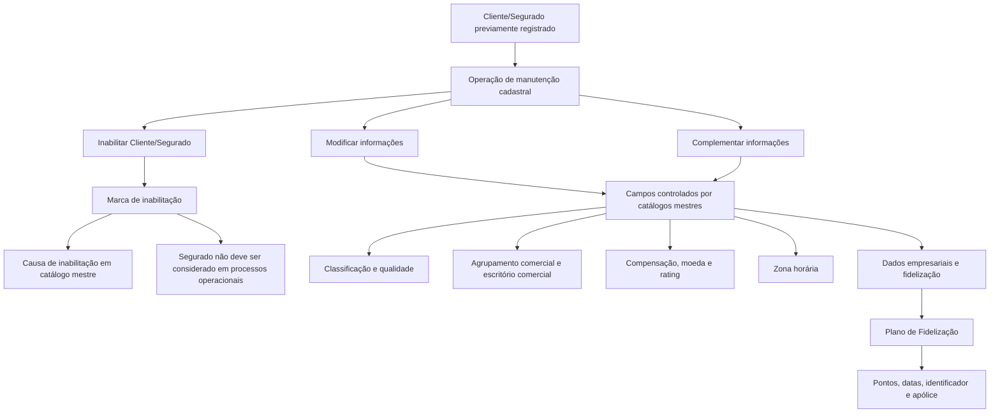

# Operação de Modificação, Complementação e Inabilitação de Dados de Cliente/Segurado no Sistema Reef

## 1. Metadados do Documento
- **Arquivo de Origem:** Não identificado — conteúdo bruto fornecido pelo usuário
- **Tipo de Documento:** Manual Operacional
- **Domínio / Sistema:** Reef / gestão de Clientes e Segurados em entidade seguradora
- **Público-Alvo:** Operação, Negócio, Analistas Funcionais e Desenvolvedores
- **Data/Versão Identificada:** Não identificada

---

## 2. Resumo Executivo & Contexto de Negócio

O documento descreve a operação de manutenção cadastral de informações previamente registradas de um Cliente/Segurado no sistema Reef. A operação permite modificar, complementar ou inabilitar um Cliente/Segurado, abrangendo dados de classificação, condições comerciais, cobrança, prevenção à lavagem de dinheiro, estrutura empresarial, identificação, comunicação e fidelização.

A sequência de captura dos campos é apresentada como ordem visual: da esquerda para a direita e de cima para baixo. Salvo indicação expressa em contrário, os atributos são aplicáveis tanto a Pessoas Físicas quanto a Pessoas Jurídicas.

A operação depende de catálogos mestres configurados no sistema para diversos atributos, incluindo classificação, qualidade, agrupamentos comerciais, formas de compensação, moedas, ratings, escritórios comerciais, zonas horárias e causas de inabilitação. Portanto, a consistência de valores cadastrais depende da manutenção desses catálogos mestres.

A inabilitação sinaliza que o Segurado não deve ser empregado, contemplado ou considerado nos processos operacionais da entidade seguradora. Já os controles relacionados a aviso de operações e limite de prêmio estão associados à prevenção de lavagem de dinheiro, com condições específicas para Pessoas Jurídicas e para entidades que possuam esses controles ativos.

O documento também descreve recursos de fidelização, consentimento de comunicação por meio do atributo Robinson e identificação de clientes importantes por meio da marca de Segurado V.I.P. Não há detalhamento de métodos HTTP, contratos JSON, interfaces técnicas, persistência de dados, perfis de acesso ou integrações externas.

---

## 3. Arquitetura, Componentes & Tecnologias Envolvidas

O conteúdo identifica o sistema Reef como ambiente de documentação e referência para a operação de alteração cadastral de Cliente/Segurado. A operação utiliza catálogos mestres do sistema para validar ou selecionar valores de diversos campos.

Componentes e conceitos explicitamente citados:

| Componente / Conceito | Papel identificado |
| :--- | :--- |
| Sistema Reef | Sistema no qual estão registrados os dados de Clientes/Segurados e configurados catálogos mestres. |
| Cliente/Segurado | Entidade cujas informações podem ser modificadas, complementadas ou inabilitadas. |
| Catálogos mestres | Fonte de valores para classificação, qualidade, agrupamento comercial, compensações, moedas, ratings, escritórios comerciais, zonas horárias e causas de inabilitação. |
| Entidade Seguradora | Organização que configura controles, tipos de retenção, prevenção à lavagem de dinheiro e processos operacionais. |
| Direção de Clientes/Técnica | Área que pode estabelecer orientações para o preenchimento de observações. |
| Plano de Fidelização | Estrutura para registrar participação, pontos, datas, identificador e apólice do Cliente/Segurado. |
| Processo de Identificação de Clientes | Processo no qual pode ser registrada a data real de entrega de documentação pelo Segurado. |
| Prevenção à lavagem de dinheiro | Controle associado a aviso de operações e a limites de prêmios. |



> **Nota de Análise:** O documento não detalha arquitetura de infraestrutura, microsserviços, banco de dados, APIs, protocolos, URLs, ambientes ou tecnologias de implementação.

---

## 4. Regras de Negócio, Especificações Funcionais & Processos

### 4.1 Ações permitidas

A operação permite as seguintes ações sobre informações previamente registradas de Cliente/Segurado:

1. **Modificar:** alterar informações existentes do Cliente/Segurado.
2. **Inabilitar:** marcar o Cliente/Segurado como inabilitado no sistema.
3. **Complementar:** complementar informações já registradas, conforme o objetivo declarado da operação.

### 4.2 Sequência de captura

A sequência de captura dos campos segue a disposição visual da estrutura de informação:

1. Da esquerda para a direita.
2. De cima para baixo.
3. Os atributos são aplicáveis a Pessoas Físicas e Pessoas Jurídicas, exceto quando houver indicação expressa em sentido diferente.

### 4.3 Regras de classificação, qualidade e agrupamento

- A **Classificação** do Segurado deve estar de acordo com valores do catálogo mestre existente no sistema.
- A **Qualidade do Segurado** deve estar de acordo com o catálogo mestre de códigos de qualidade configurado no sistema.
- O **Agrupamento Comercial do Segurado** deve usar valores definidos no catálogo mestre de agrupamentos.
- O **Grupo Empresarial** deve conter o código do grupo empresarial ao qual o Segurado pertence, conforme grupos empresariais identificados.
- O **Tipo de Rating** corresponde à qualificação atribuída ao Segurado conforme o catálogo mestre de qualificações/rating.

### 4.4 Regras de cobrança, retenção e prêmio

- O **Tipo de Retenção** contém o código de um dos tipos de retenção configurados localmente pela Entidade Seguradora.
- A **Forma de Cobro/Pago** indica o código da forma de cobrança/pagamento do Segurado, conforme formas de compensação definidas no catálogo mestre.
- O **Dia Sugerido de Pago** representa o dia sugerido pelo Segurado para que a Entidade Seguradora realize os débitos destinados ao pagamento dos prêmios de seguros contratados.
- **Primas Mayores a...** está relacionado ao controle de prevenção à lavagem de dinheiro configurável para limitar importes de prêmios de Segurados.
- A **Moneda** contém o código da moeda na qual foi expresso o valor de **Primas Mayores a...**, conforme o catálogo mestre de moedas.

### 4.5 Regras de inabilitação

- A propriedade **Inhabilitación** indica que o Segurado está inabilitado no sistema.
- Um Segurado inabilitado não deve ser empregado, contemplado ou considerado nos processos operacionais da Entidade Seguradora.
- Quando o Segurado estiver inabilitado, a **Causa de Inhabilitación** deve conter um código de causa definido no catálogo mestre do sistema.

### 4.6 Prevenção à lavagem de dinheiro

- O campo **Aviso de Operaciones** aplica-se quando o Terceiro for uma Pessoa Jurídica e o controle de prevenção à lavagem de dinheiro estiver ativo.
- Nesse cenário, o atributo informa se será necessário avisar algum contato do Terceiro.
- O contato que receberá o aviso deve estar obrigatoriamente identificado como **Tercero de Referencia**.
- O atributo **Primas Mayores a...** está relacionado à configuração de controle de prevenção à lavagem de dinheiro das Companhias no sistema.

### 4.7 Dados empresariais e comerciais

- **Número de Empleados** contém o número de empregados do Segurado.
- **Facturación** contém o importe estimado do faturamento anual do Segurado.
- **Oficina Comercial** contém o código do terceiro nível da Estrutura Comercial, conforme catálogo mestre de escritórios comerciais.
- **Observaciones** permite registrar informação adicional do Segurado segundo orientações ou diretrizes da Direção de Clientes/Técnica da Entidade Seguradora.

### 4.8 Registro, identificação e zona horária

- **Fecha Registro** deve registrar a data real em que o Segurado entrega a documentação solicitada pela Entidade Seguradora.
- O uso da data de registro é relevante em entidades que possuem essa atividade como parte do Processo de Identificação de Clientes.
- A **Fecha Registro** não deve ser confundida com a data de captura do Segurado no sistema, pois a data de captura é automaticamente registrada nos catálogos de informação.
- **Zona Horaria** contém o código da zona horária associada ao Segurado, de acordo com zonas horárias habilitadas no sistema.
- O documento menciona que Espanha possui duas zonas horárias, diferenciando a Península Ibérica e as Ilhas Canárias.
- O documento menciona que México possui quatro zonas horárias: Sureste, Centro, Pacífico e Noroeste.

### 4.9 Fidelização, comunicação e importância do cliente

- A marca **Fidelización** indica se o Segurado participa ou não de um Plano de Fidelização.
- Na operação descrita, a marca de Fidelização aparece desmarcada por padrão.
- Ao clicar na marca de Fidelização, são habilitados campos para informar data de alta, identificador do plano e número da apólice.
- **Puntos Plan de Fidelización** mostra o número de pontos acumulados quando o Segurado está incluído no plano.
- **Fecha de ALTA en el Plan de Fidelización** contém a data de adesão ao plano.
- **Fecha de BAJA en el Plan de Fidelización** contém a data de saída do Segurado do plano.
- **Identificador en el Plan de Fidelización** contém o número de sócio, código ou chave identificadora do Segurado no plano.
- **Póliza del Plan de Fidelización** permite capturar, sem obrigatoriedade, o número de uma apólice vigente na qual o Cliente/Segurado corresponde ao Tomador.
- **Robinson** indica se o Segurado deve ou não ser incluído em processos que impliquem contato ou comunicação, de acordo com os consentimentos concedidos.
- **Asegurado V.I.P** identifica o Segurado como Cliente Importante.

---

## 5. Tabelas de Parâmetros, Ambientes e Estruturas de Dados

| Item / Parâmetro | Descrição / Função | Tipo / Valores / Formato | Ambiente / Observações |
| :--- | :--- | :--- | :--- |
| MODIFICAR | Ação para modificar informações do Cliente/Segurado. | Ação operacional. | Citada como possível ação. |
| INHABILITAR | Ação para inabilitar o Cliente/Segurado. | Ação operacional. | O Segurado inabilitado não deve ser usado em processos operacionais. |
| Clasificación | Classificação do Segurado. | Valores do catálogo mestre. | Aplicável salvo indicação expressa em contrário. |
| Calidad del Asegurado | Qualidade do Segurado. | Códigos do catálogo mestre de qualidade. | Catálogo configurado no sistema. |
| Agrupamiento Comercial del Asegurado | Agrupamento comercial do Segurado. | Valores do catálogo mestre de agrupamentos. | Catálogo configurado no sistema. |
| Tipo de Retención | Tipo de retenção do Segurado. | Código de tipo de retenção. | Configurado localmente pela Entidade Seguradora. |
| Forma de Cobro/Pago | Forma de cobrança ou pagamento do Segurado. | Código de forma de compensação. | Conforme catálogo mestre de compensações. |
| Día Sugerido de Pago | Dia sugerido para realização de débitos para pagamento de prêmios. | Dia. | Relacionado aos seguros contratados pelo Segurado. |
| Inhabilitación | Indica que o Segurado está inabilitado. | Propriedade/marca. | Impede consideração em processos operacionais. |
| Causa de Inhabilitación | Motivo da inabilitação. | Código de causa. | Deve ser definido no catálogo mestre do sistema. |
| Observaciones | Informação adicional sobre o Segurado. | Texto não especificado. | Conforme orientações da Direção de Clientes/Técnica. |
| Aviso de Operaciones | Indica necessidade de avisar contato do Terceiro. | Indicador não detalhado. | Aplicável a Pessoa Jurídica com prevenção à lavagem de dinheiro ativa. |
| Primas Mayores a... | Limite relacionado ao valor de prêmios do Segurado. | Valor não detalhado. | Associado ao controle de prevenção à lavagem de dinheiro. |
| Moneda | Moeda do valor de Primas Mayores a.... | Código de moeda. | Conforme catálogo mestre de moedas. |
| Número de Empleados | Quantidade de empregados do Segurado. | Número. | Dado empresarial. |
| Facturación | Faturamento anual estimado do Segurado. | Importe. | Dado empresarial. |
| Grupo Empresarial | Grupo empresarial ao qual o Segurado pertence. | Código de grupo empresarial. | Conforme grupos empresariais identificados. |
| Tipo de Rating | Qualificação/rating atribuído ao Segurado. | Valores do catálogo mestre de qualificações/rating. | O texto associa a qualificação ao campo Tipo de Rating. |
| Oficina Comercial | Escritório comercial associado ao Segurado. | Código do terceiro nível da Estrutura Comercial. | Conforme catálogo mestre de escritórios comerciais. |
| Fecha Registro | Data real de entrega de documentação pelo Segurado. | Data. | Não confundir com a data automática de captura no sistema. |
| Zona Horaria | Zona horária associada ao Segurado. | Código de zona horária. | Deve corresponder a uma zona habilitada no sistema. |
| Fidelización | Indica participação em Plano de Fidelização. | Marca/indicador. | Desmarcada por padrão na operação descrita. |
| Robinson | Indica inclusão ou exclusão de processos de contato/comunicação. | Indicador não detalhado. | Deve respeitar consentimentos do Segurado. |
| Asegurado V.I.P | Identifica Cliente Importante. | Marca/indicador. | Sem critérios adicionais detalhados. |
| Puntos Plan de Fidelización | Pontos acumulados pelo Segurado no plano. | Número de pontos. | Exibido quando o Segurado participa do plano. |
| Fecha de ALTA en el Plan de Fidelización | Data de adesão ao plano. | Data. | Aplicável ao Segurado incluído no plano. |
| Fecha de BAJA en el Plan de Fidelización | Data de saída do plano. | Data. | Aplicável ao Segurado que esteve incluído no plano. |
| Identificador en el Plan de Fidelización | Número de sócio, código ou chave do Segurado no plano. | Identificador. | Aplicável ao Segurado incluído no plano. |
| Póliza del Plan de Fidelización | Número de apólice vigente vinculada ao plano. | Número de apólice. | Captura não obrigatória; Cliente/Segurado deve ser Tomador da apólice. |

---

## 6. Bateria de Perguntas & Respostas para RAG (FAQ Sintético)

### P1: Quais ações podem ser executadas na operação de manutenção de Cliente/Segurado no Reef?
**R:** A operação permite modificar ou complementar informações previamente registradas de Cliente/Segurado e permite inabilitar o Cliente/Segurado. O documento apresenta explicitamente as ações MODIFICAR e INHABILITAR.

### P2: Qual é o efeito operacional da inabilitação de um Segurado?
**R:** A propriedade Inhabilitación informa ao sistema que o Segurado está inabilitado. Um Segurado inabilitado não deve ser empregado, contemplado ou considerado nos processos operacionais da Entidade Seguradora.

### P3: Quando a causa de inabilitação deve ser registrada?
**R:** A Causa de Inhabilitación deve ser informada quando o Segurado estiver inabilitado. O atributo deve conter um código de causa de inabilitação definido no catálogo mestre do sistema.

### P4: Como o sistema trata a data de registro do Segurado?
**R:** A Fecha Registro registra a data real na qual o Segurado entrega a documentação solicitada pela Entidade Seguradora, especialmente quando essa entrega faz parte do Processo de Identificação de Clientes. Essa data não é a mesma data de captura do Segurado no sistema, pois a data de captura é registrada automaticamente nos catálogos de informação.

### P5: Quando o campo Aviso de Operaciones é aplicável?
**R:** O Aviso de Operaciones é aplicável quando o Terceiro é uma Pessoa Jurídica e o controle de prevenção à lavagem de dinheiro está ativo. O campo informa se algum contato do Terceiro deve ser avisado; esse contato deve estar identificado obrigatoriamente como Tercero de Referencia.

### P6: O que representa o campo Primas Mayores a...?
**R:** Primas Mayores a... é um dado relacionado ao controle de prevenção à lavagem de dinheiro que a Entidade Seguradora pode configurar nas Companhias do sistema para limitar os importes dos prêmios dos Segurados. A moeda desse valor é registrada no campo Moneda.

### P7: Qual é a origem dos valores de classificação, qualidade e agrupamento comercial?
**R:** A Clasificación utiliza valores do catálogo mestre existente no sistema. A Calidad del Asegurado utiliza códigos do catálogo mestre de qualidade configurado. O Agrupamiento Comercial del Asegurado utiliza valores definidos no catálogo mestre de agrupamentos.

### P8: O que acontece quando a marca Fidelización é selecionada?
**R:** A marca Fidelización permite indicar se o Segurado conta com um Plano de Fidelização. Na operação descrita, ela aparece desmarcada por padrão. Ao selecioná-la, são habilitados campos para informar a data de alta, o identificador do plano e o número da apólice.

### P9: A apólice do Plano de Fidelização é obrigatória?
**R:** Não. A Póliza del Plan de Fidelización permite capturar, de forma não obrigatória, o número de uma apólice vigente na qual o Cliente/Segurado corresponda ao Tomador.

### P10: Para que serve o atributo Robinson?
**R:** Robinson permite saber se o Segurado deve ou não ser incluído em processos da Entidade Seguradora que impliquem qualquer tipo de contato ou comunicação. Essa decisão deve considerar os consentimentos concedidos pelo Segurado.

### P11: O que identifica a marca Asegurado V.I.P?
**R:** A marca Asegurado V.I.P permite identificar o Segurado como um Cliente Importante. O documento não detalha critérios, benefícios ou regras adicionais para classificação como V.I.P.

### P12: Como deve ser preenchida a Zona Horaria?
**R:** Zona Horaria deve conter o código da zona horária associada ao Segurado, conforme a relação de zonas horárias habilitadas no sistema. O documento exemplifica duas zonas horárias na Espanha e quatro zonas horárias no México.

---

## 7. Glossário de Termos, Siglas & Conceitos-Chave

- **Reef:** Sistema ou contexto de documentação no qual a operação de manutenção de Cliente/Segurado está registrada.
- **Asegurado:** Segurado; entidade cujos dados são tratados pela operação.
- **Cliente/Segurado:** Cliente que também possui a condição de Segurado no contexto do documento.
- **Entidad Aseguradora:** Entidade seguradora responsável por configurar e executar processos associados ao Segurado.
- **Catálogo Maestro:** Catálogo mestre do sistema que contém relações de valores permitidos para determinados campos.
- **Tercero:** Terceiro relacionado ao processo; no caso de Aviso de Operaciones, pode ser uma Pessoa Jurídica.
- **Tercero de Referencia:** Contato do Terceiro que deve estar obrigatoriamente identificado dessa forma para receber aviso de operações.
- **Inhabilitación:** Propriedade que indica que o Segurado está inabilitado no sistema.
- **Primas:** Prêmios dos seguros contratados pelo Segurado.
- **Forma de Cobro/Pago:** Forma de cobrança ou pagamento associada ao Segurado.
- **Forma de Compensación:** Forma de compensação definida em catálogo mestre e usada para a Forma de Cobro/Pago.
- **Facturación:** Faturamento anual estimado do Segurado.
- **Rating:** Qualificação atribuída ao Segurado conforme catálogo mestre.
- **Oficina Comercial:** Escritório comercial; no documento, corresponde ao código do terceiro nível da Estrutura Comercial.
- **Proceso de Identificación de Clientes:** Processo que pode exigir o registro da data real de entrega de documentação.
- **Fidelización:** Participação do Segurado em Plano de Fidelização.
- **Robinson:** Dado que controla a inclusão do Segurado em processos de contato ou comunicação, respeitando consentimentos.
- **Asegurado V.I.P:** Marca utilizada para identificar um Cliente Importante.
- **Tomador:** Figura do Cliente/Segurado em uma apólice; exigida para a apólice informada no Plano de Fidelização.

---

## 8. Notas Críticas, Riscos & Limitações

- O documento não informa obrigatoriedade, tamanho, formato, máscara, domínio completo de valores ou regras de validação técnica para a maior parte dos campos.
- O documento não detalha perfis de acesso, permissões, trilha de auditoria, aprovação, integração externa ou mecanismo de persistência da modificação cadastral.
- O documento não especifica se a inabilitação pode ser revertida, quais processos já em andamento são afetados ou quais exceções operacionais podem existir.
- Os valores dos campos dependentes de catálogo mestre dependem da configuração prévia no sistema; a documentação não apresenta os valores desses catálogos.
- O controle de prevenção à lavagem de dinheiro é descrito condicionalmente, mas o documento não apresenta critérios de ativação, responsáveis, limites numéricos ou fluxos de notificação.
- O documento menciona um “Consejo:” ao final da página 3, mas não apresenta conteúdo associado no trecho fornecido.
- **Nota de Análise:** O documento não detalha APIs, métodos HTTP, contratos JSON, entidades de banco de dados, logs, URLs, ambientes ou tecnologias de implementação.

---

## 9. Conteúdo Bruto Estruturado (Referência Fiel)

```text
--- [PÁGINA 1 DE 4] ---

MODIFICAR Información especíca del Asegurado/Cliente
Objetivo
Esta Operación permite Modicar o Complementar la información del Asegurado/Cliente registrada previamente además de poder
Inhabilitarlo.
Posibles Acciones
 MODIFICAR ( )
 INHABILITAR ( )
Datos Clientes/Asegurados
De Izquierda a Derecha y de Arriba hacia Abajo, los siguientes atributos marcan la secuencia de captura de los Campos en esta Estructura de
Información.
(Si no se especica o indica expresamente, los Atributos se emplearán tanto en Personas Físicas como en Personas Jurídicas).
Clasicación (  )
Este Campo contendrá la clasicación del Asegurado de acuerdo con la relación de valores existentes en el catálogo maestro existente en el
Sistema.
Calidad del Asegurado (  )
Este Campo contendrá la calidad del Asegurado de acuerdo con la relación de valores existentes en el catálogo maestro de códigos de
calidad congurado en el Sistema.
Documentation / DOCUMENTACIÓN Reef
DOCUMENTACIÓN Reef
Mapfredocument
DOCUMENTACIÓN Reef
Owner
user:agonzalez_mapfre.com
Lifecycle
Approved Source
 / 
 VL
Buscar Inicio Soluciones Arquitecturas APIs Componentes Cloud Documentación Zeus Reef Ayuda
ES


--- [PÁGINA 2 DE 4] ---

Agrupamiento Comercial del Asegurado (  )
Este Campo contendrá la Agrupación Comercial del Asegurado de acuerdo con la relación de valores denidos en el catálogo maestro de
agrupaciones congurado en el Sistema.
Tipo de Retención (  )
Este Dato contiene el código de uno de los Tipos de Retención congurados localmente por la Entidad Aseguradora.
Forma de Cobro/Pago (  )
Este Dato indicará el Código de la Forma de Cobro/Pago del Asegurado de acuerdo con las posibles Formas de Compensación denidas en
el catálogo maestro de compensaciones.
Día Sugerido de Pago ( )
Este Campo del Asegurado indica el día que éste sugiere para que la entidad aseguradora realice los cargos correspondientes para realizar el
pago de las primas de los Seguros que tenga contratados.
Inhabilitación ( )
Esta propiedad le indica al Sistema que el Asegurado está inhabilitado en el Sistema por lo que no debería ser empleado, contemplado o
considerado en los procesos operativos de la entidad.
Causa de Inhabilitación (   )
En el supuesto que el Asegurado estuviera Inhabilitado, este Atributo contendrá el código de una causa de inhabilitación denida en el
catálogo maestro del Sistema.
Observaciones ( )
El propósito de este campo permite capturar información adicional del Asegurado de acuerdo con los Planteamientos o directrices que
pudieran efectuar la Dirección de Clientes/Técnica de la entidad aseguradora.
Aviso de Operaciones (  )
En en el caso que el Tercero sea una Persona Jurídica y el control en la prevención del lavado de dinero esté activado, este campo indica si se
va o no a tener que avisar a algún contacto del Tercero que tendrá obligatoriamente que estar identicado como Tercero de Referencia.
Primas Mayores a ...
Esta Dato del Asegurado está relacionado con el control en la prevención del lavado de dinero que la Entidad Aseguradora puede establecer
en la conguración de las Compañías en el Sistema, para limitar los importes de las Primas de los Asegurados.
Moneda
Este Campo contendrá el código de la Moneda en la que se ha expresado el valor del campo Primas Mayores a... del Asegurado de acuerdo
con la relación de valores existentes en el catálogo maestro de Monedas congurado en el Sistema.
Número de Empleados ( )
Este Contiene el número de empleados del Asegurado.
Facturación ( )
Este Atributo contendrá el importe de la Facturación Anual estimada del Asegurado.
Grupo Empresarial (  )
Este Campo contendrá el código del Grupo Empresarial al que pertenece el Asegurado de acuerdo a la posible relación de grupos
empresariales identicados.
Tipo de Rating (  )


--- [PÁGINA 3 DE 4] ---

Este Campo contendrá la Calicación asignada al Asegurado de acuerdo con la relación de valores existentes en el catálogo maestro de
calicaciones/rating congurado en el Sistema.
Ocina Comercial (  )
Este Dato contiene el código del Tercer Nivel de la Estructura Comercial de acuerdo con la relación de valores existentes en el catálogo
maestro de ocinas comerciales congurado en el Sistema.
Fecha Registro ( )
Este Dato se debe utilizar para registrar la fecha real en la que el Asegurado entrega la documentación solicitada por la entidad aseguradora
en aquellas entidades que tienen esta tarea como parte del Proceso de Identicación de sus Clientes.
No confundir con la Fecha en la que se captura el Asegurado en el Sistema y que automáticamente se registra en los catálogos de
información.
Zona Horaria (  )
Un huso horario es cada una de las franjas geográcas virtuales, orientadas de norte a sur, limitadas por meridianos igualmente espaciados,
en las que se divide un planeta y en las que suele regir una misma hora ocial.
Una zona horaria en cambio, es una región geográca que comparte una misma hora ocial. Las zonas horarias se han construido a partir de
los husos horarios aunque no siguen elmente sus trazos, pues cada país ajusta su hora ocial libremente y con frecuencia no coinciden
estrictamente con la convención geográca.
Este Campo contendrá el código de la Zona Horaria asociada del Asegurado de acuerdo a la posible relación de zonas horarias habilitadas en
el Sistema.
Por ejemplo,
España tiene dos zonas horarias para distinguir la zona horaria de la Península Ibérica de la zona horaria de las Islas Canarias.
México tiene cuatro zonas horarias diferentes para distinguir la Zona Sureste, la Zona Centro, la Zona del Pacíco y la Zona Noroeste.
Fidelización ( )
Este Campo permite contemplar o no en los procesos de la entidad si el Asegurado cuenta con un Plan de Fidelización.
Al hacer click sobre la marca (en esta operación se muestra desmarcada por Defecto) se habilitan los campos correspondientes para poder
ingresar la fecha de alta, el identicador del Plan y el número de la póliza.
Robinson ( )
Este Dato permite conocer si el Asegurado se debe incluir o no en los procesos de la entidad que impliquen cualquier tipo de
contacto/comunicación con el , todo ello de acuerdo con los consentimientos otorgados por el Asegurado.
Asegurado V.I.P ( )
Esta marca permite identicar al Asegurado como un Cliente Importante.
Puntos Plan de Fidelización
En el supuesto que el Asegurado esté incluido en el Plan de Fidelización de la Entidad, este campo muestra el número de puntos acumulados
que tiene el Asegurado.
Fecha de ALTA en el Plan de Fidelización ( )
En el supuesto que el Asegurado esté incluido en el Plan de Fidelización de la Entidad, este dato contiene la Fecha de Alta en el mismo.
Fecha de BAJA en el Plan de Fidelización ( )
En el supuesto que el Asegurado estuviera incluido en el Plan de Fidelización de la Entidad, este dato contendría la Fecha de Baja del
Asegurado en el Plan de Fidelización.
Consejo:


--- [PÁGINA 4 DE 4] ---

Identicador en el Plan de Fidelización ( )
En el supuesto que el Asegurado esté incluido en el Plan de Fidelización de la Entidad, este dato muestra el Número de Socio, código o clave
identicadora del Asegurado en el Plan.
Póliza del Plan de Fidelización (  )
Por último y en el supuesto que el Asegurado esté incluido en el Plan de Fidelización de la Entidad, este Dato permitirá capturar (no es una
acción obligatoria) el número de una de las pólizas en vigor en las que el la gura del Cliente/Asegurado se corresponde con El Tomador de la
misma.
```
