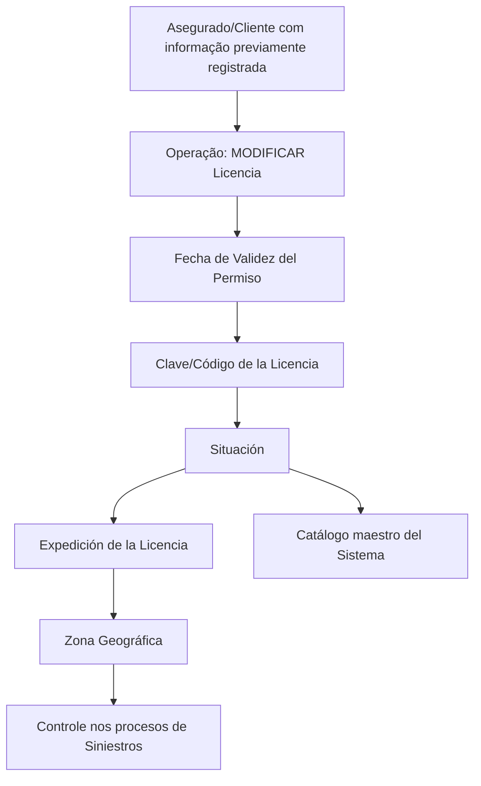

# Modificar Licencia de Conducir del Asegurado — Operación Reef

## 1. Metadados do Documento
- **Arquivo de Origem:** `Não identificado no conteúdo fornecido`
- **Tipo de Documento:** `Manual Operacional`
- **Domínio / Sistema:** `Reef / Mapfre`
- **Público-Alvo:** `Usuários operacionais, analistas funcionais e equipes de sinistros`
- **Data/Versão Identificada:** `Não identificada`

---

## 2. Resumo Executivo & Contexto de Negócio

O documento descreve a operação **“Modificar Licencia de Conducir del Asegurado”** no contexto da documentação Reef/Mapfre. A operação permite modificar ou complementar informações previamente registradas para o segurado/cliente.

A ação habilitada apresentada é **MODIFICAR Licencia**, voltada ao tratamento de dados da licença ou permissão de condução. O documento define uma sequência de captura de informações que deve ser interpretada da esquerda para a direita e de cima para baixo.

Os atributos apresentados abrangem a validade da licença ou permissão, a chave/código identificador, a situação da licença, o local de expedição e a zona geográfica de aplicação ou uso. Esses campos representam informações funcionais relacionadas ao terceiro e ao segurado.

A zona geográfica possui relevância operacional explícita: o atributo habilita seu controle nos processos de **Siniestros** da entidade. O documento não detalha interfaces, contratos de integração, validações técnicas, persistência de dados, métodos HTTP ou perfis de acesso.

---

## 3. Arquitetura, Componentes & Tecnologias Envolvidas

Os elementos identificados no conteúdo são:

- **Reef:** contexto de documentação e sistema mencionado.
- **Mapfre / Mapfredocument:** referências corporativas presentes no rodapé ou cabeçalho documental.
- **Operação MODIFICAR Licencia:** ação habilitada para alterar ou complementar informações prévias do segurado/cliente.
- **Catálogo maestro del Sistema:** origem dos valores possíveis para o atributo **Situación**.
- **Procesos de Siniestros:** processos da entidade que utilizam o controle associado à **Zona Geográfica**.
- **Terceiro:** entidade cujos dados de licença, validade, situação e expedição são referenciados em determinados atributos.
- **Asegurado/Cliente:** entidade com informação previamente registrada que pode ser modificada ou complementada.



**Nota de Análise:** o conteúdo não descreve arquitetura de aplicação, microsserviços, bancos de dados, APIs, protocolos, ambientes técnicos ou tecnologias de implementação.

---

## 4. Regras de Negócio, Especificações Funcionais & Processos

1. A operação **Modificar Licencia de Conducir del Asegurado** permite modificar ou complementar informações do **Asegurado/Cliente** que tenham sido registradas previamente.
2. A ação habilitada indicada no documento é **MODIFICAR Licencia**.
3. A sequência de captura da informação no sistema deve seguir a ordem visual: **da esquerda para a direita e de cima para baixo**.
4. **Fecha de Validez del Permiso** indica a data de validade da licença ou da permissão de condução do terceiro.
5. **Clave/Código de la Licencia** identifica a chave ou o código da licença de condução.
6. **Situación** indica o estado da licença do terceiro.
7. Os valores possíveis de **Situación** são configurados no **catálogo maestro del Sistema**.
8. **Expedición de la Licencia** contém o segundo nível da estrutura geográfica, ou o estado, no qual a licença foi expedida.
9. **Zona Geográfica** contém o âmbito geográfico de aplicação ou uso da licença de condução do segurado.
10. **Zona Geográfica** habilita o controle da licença nos processos de **Siniestros** da entidade.

---

## 5. Tabelas de Parâmetros, Ambientes e Estruturas de Dados

| Item / Parâmetro | Descrição / Função | Tipo / Valores / Formato | Ambiente / Observações |
| :--- | :--- | :--- | :--- |
| Operação | Modificar ou complementar informações previamente registradas do segurado/cliente. | `MODIFICAR Licencia` | Contexto Reef / Mapfre. |
| Fecha de Validez del Permiso | Indica a data de validade da licença ou permissão de condução do terceiro. | Data; formato não especificado. | Sem ambiente especificado. |
| Clave/Código de la Licencia | Identifica a chave ou o código da licença de condução. | Chave ou código; formato não especificado. | Sem ambiente especificado. |
| Situación | Indica o estado da licença do terceiro. | Valores configurados no catálogo maestro del Sistema. | O documento não lista os valores do catálogo. |
| Expedición de la Licencia | Contém o segundo nível da estrutura geográfica ou o estado onde a licença foi expedida. | Localização geográfica / estado. | Sem ambiente especificado. |
| Zona Geográfica | Contém o âmbito geográfico de aplicação ou uso da licença de condução do segurado. | Zona ou âmbito geográfico; formato não especificado. | Habilita controle nos procesos de Siniestros. |
| Catálogo maestro del Sistema | Fonte de configuração dos possíveis valores para a situação da licença. | Catálogo; valores não detalhados. | Referência funcional do sistema. |
| Procesos de Siniestros | Processos da entidade nos quais a zona geográfica habilita controle. | Processo corporativo; detalhes não especificados. | Dependência funcional da Zona Geográfica. |

---

## 6. Bateria de Perguntas & Respostas para RAG (FAQ Sintético)

### P1: Qual é a finalidade da operação “Modificar Licencia de Conducir del Asegurado”?
**R:** A operação permite modificar ou complementar informações do Asegurado/Cliente que tenham sido registradas previamente no sistema.

### P2: Qual ação está habilitada no documento para tratar a licença de condução?
**R:** A ação habilitada apresentada é **MODIFICAR Licencia**.

### P3: Em qual ordem os dados da licença devem ser capturados no sistema?
**R:** Os atributos devem ser capturados da esquerda para a direita e de cima para baixo, conforme a sequência apresentada no documento.

### P4: O que representa o campo “Fecha de Validez del Permiso”?
**R:** O campo indica a data de validade da licença ou da permissão de condução do terceiro.

### P5: Para que serve a “Clave/Código de la Licencia”?
**R:** A Clave/Código de la Licencia identifica a chave ou o código da licença de condução.

### P6: Como é determinado o valor do campo “Situación” da licença?
**R:** Situación indica o estado da licença do terceiro de acordo com os possíveis valores configurados no catálogo maestro del Sistema. O documento não apresenta quais são esses valores.

### P7: O que deve ser informado em “Expedición de la Licencia”?
**R:** O atributo deve conter o segundo nível da estrutura geográfica, ou o estado, no qual a licença foi expedida.

### P8: Qual é a função do atributo “Zona Geográfica”?
**R:** Zona Geográfica contém o âmbito geográfico de aplicação ou uso da licença de condução do segurado e habilita o controle dessa informação nos processos de Siniestros da entidade.

### P9: O documento especifica APIs, métodos HTTP ou contratos JSON da operação de modificação de licença?
**R:** Não. O documento apresenta a operação e seus atributos funcionais, mas não detalha APIs, métodos HTTP, contratos JSON, integrações ou tecnologias de implementação.

### P10: O documento informa o formato técnico ou as regras de validação da data de validade da licença?
**R:** Não. O conteúdo apenas informa que Fecha de Validez del Permiso representa a data de validade da licença ou permissão de condução do terceiro.

---

## 7. Glossário de Termos, Siglas & Conceitos-Chave

- **Asegurado:** segurado; entidade para a qual a licença de condução é tratada.
- **Cliente:** cliente; mencionado juntamente com Asegurado como entidade com informação previamente registrada.
- **Clave/Código de la Licencia:** chave ou código que identifica a licença de condução.
- **Expedición de la Licencia:** local de expedição da licença, representado pelo segundo nível da estrutura geográfica ou estado.
- **Licencia de Conducir:** licença de condução.
- **Permiso de Conducción:** permissão de condução.
- **Reef:** nome presente na documentação e no contexto do sistema.
- **Situación:** estado da licença do terceiro, determinado por valores configurados no catálogo maestro del Sistema.
- **Siniestros:** processos da entidade nos quais a Zona Geográfica habilita controle.
- **Tercero:** entidade referenciada como titular dos dados de validade, situação e expedição da licença.
- **Zona Geográfica:** âmbito geográfico de aplicação ou uso da licença de condução do segurado.
- **Catálogo maestro del Sistema:** catálogo do sistema que configura os valores possíveis para Situación.

---

## 8. Notas Críticas, Riscos & Limitações

- O documento não identifica nome de arquivo, data, versão ou responsável técnico; somente apresenta `Owner user:agonzalez_mapfre.com`.
- O documento não especifica formatos de campo, obrigatoriedade, tamanhos, máscaras, regras de consistência ou mensagens de erro.
- O documento informa que **Situación** depende de valores configurados no catálogo maestro del Sistema, mas não relaciona os valores válidos.
- O documento não detalha como a **Zona Geográfica** é usada nos procesos de Siniestros, apenas afirma que o atributo habilita esse controle.
- Não há detalhamento de APIs, métodos HTTP, contratos JSON, persistência, trilhas de auditoria, autenticação, autorização ou integrações.
- Não há detalhamento adicional sobre ambientes, URLs, servidores, rotas de log ou versões de componentes.

---

## 9. Conteúdo Bruto Estruturado (Referência Fiel)

```text
--- [PÁGINA 1 DE 1] ---

MODIFICAR Licencia de Conducir del Asegurado
Esta Operación permite Modicar o Complementar la información del Asegurado/Cliente registrada previamente.
Acciones habilitadas
 MODIFICAR ( )
Licencia.
De Izquierda a Derecha y de Arriba hacia Abajo, los siguientes atributos marcan la secuencia de captura de la Información en el sistema.
Fecha de Validez del Permiso ( )
Esta propiedad indicará la Fecha de Validez de la Licencia o Permiso de Conducción del Tercero.
Clave/Código de la Licencia ( )
Este Dato identica la clave o el código de la Licencia de Conducir.
Situación (  )
Este Atributo indica el estado de la licencia del Tercero de acuerdo con los posibles valores congurados en el catálogo maestro del Sistema.
Expedición de la Licencia (  )
Este Dato contiene el segundo nivel de la estructura geográca ó estado, en el que la licencia ha sido expedida.
Zona Geográca (  )
Por último, este atributo contiene el ámbito geográco de aplicación o uso de la Licencia de conducir del Asegurado, atributo que habilita su
control en los procesos de Siniestros de la entidad.
Documentation / DOCUMENTACIÓN Reef
DOCUMENTACIÓN Reef
Mapfredocument
DOCUMENTACIÓN Reef
Owner
user:agonzalez_mapfre.com
Lifecycle
Approved Source
 / 
 VL
Buscar Inicio Soluciones Arquitecturas APIs Componentes Cloud Documentación Zeus Reef Ayuda
ES
```
