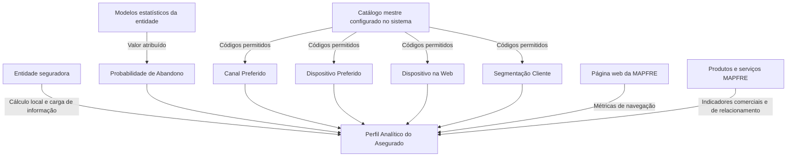
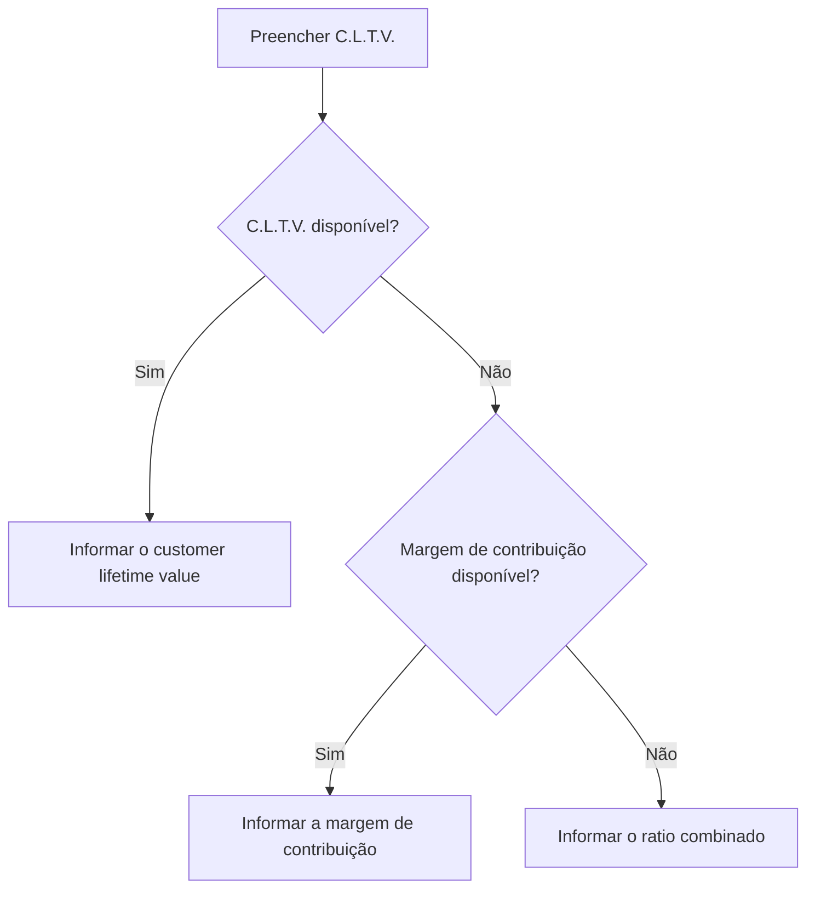

# Perfil Analítico do Asegurado — Bloco de Informação Reef

## 1. Metadados do Documento
- **Arquivo de Origem:** `Não identificado`
- **Tipo de Documento:** `Especificação Técnica`
- **Domínio / Sistema:** `Reef / MAPFRE / Perfil Analítico do Asegurado`
- **Público-Alvo:** `Desenvolvedores, Arquitetos, Operação, Negócio`
- **Data/Versão Identificada:** `Não identificada`

---

## 2. Resumo Executivo & Contexto de Negócio

O documento descreve o bloco de informação **Perfil Analítico do Asegurado**, destinado a visualizar dados analíticos de um terceiro/segurado. O cálculo e a carga dessas informações são realizados localmente pela entidade seguradora, que é a responsável final pela qualidade e coerência dos dados disponibilizados.

O Perfil Analítico reúne atributos de valor e comportamento do cliente, incluindo previsão de valor de vida do cliente, probabilidade de abandono, probabilidades de venda adicional e venda cruzada, indicadores de relacionamento, preferências de contato, dados de navegação web, presença em redes sociais e segmentação.

Alguns atributos possuem dependência explícita de catálogos mestres configurados no sistema. Os valores de **Canal Preferido**, **Dispositivo Preferido**, **Dispositivo na Web** e **Segmentação Cliente** devem utilizar os códigos definidos nos respectivos catálogos associados.

O documento não especifica contratos de integração, métodos HTTP, estruturas JSON, rotinas de cálculo, periodicidade de carga, tecnologias de persistência ou regras de validação técnica além das descrições funcionais apresentadas. A entidade seguradora define os seus próprios procedimentos e modelos estatísticos quando indicado.

---

## 3. Arquitetura, Componentes & Tecnologias Envolvidas

Os elementos identificados são:

| Componente / Entidade | Papel identificado |
| :--- | :--- |
| Entidade seguradora | Calcula e carrega localmente as informações do Perfil Analítico; responde pela qualidade e coerência dos dados. |
| Perfil Analítico do Asegurado | Bloco de informação que concentra atributos analíticos, comerciais, comportamentais e digitais do cliente. |
| MAPFRE | Organização mencionada como origem de produtos, serviços, contatos, página web, aplicativos e canais de relacionamento. |
| Reef | Contexto documental no qual o conteúdo é apresentado. |
| Catálogo mestre configurado no sistema | Fonte dos códigos permitidos para atributos associados a catálogo. |
| Modelos estatísticos da entidade | Base usada para atribuir o valor de Probabilidade de Abandono. |
| Página web da MAPFRE | Origem de métricas de navegação, visita, dispositivo, tempo, seção contratada e recorrência. |
| Aplicações MAPFRE | Origem do indicador App Engagement. |
| Canal de YouTube do cliente | Origem do número de subscritores indicado no perfil. |



**Nota de Análise:** o conteúdo não descreve microsserviços, bases de dados, interfaces, protocolos, ambientes técnicos, URLs, mecanismos de autenticação ou contratos de dados.

---

## 4. Regras de Negócio, Especificações Funcionais & Processos

### 4.1 Responsabilidade pela informação

1. O bloco permite visualizar dados do Perfil Analítico do Terceiro.
2. O cálculo e a carga das informações devem ser efetuados localmente pela entidade seguradora.
3. A entidade seguradora é a responsável final pela qualidade e coerência dos dados.
4. Os atributos que dependem de catálogo devem conter códigos válidos de acordo com o catálogo mestre configurado no sistema.

### 4.2 Regra de priorização para C.L.T.V.

O atributo **C.L.T.V.** corresponde ao *customer lifetime value*, ou valor de vida do cliente. O dado representa uma previsão do montante de dinheiro que a empresa espera receber de um usuário durante todo o período em que o usuário permanecer como cliente.

A regra de preenchimento indicada estabelece a seguinte prioridade:



### 4.3 Probabilidades comerciais e comportamentais

- **Probabilidade de Abandono:** valor atribuído pela entidade seguradora, com base nos seus modelos estatísticos, para representar a probabilidade de o segurado deixar de ser cliente.
- **Probabilidade Up Selling MOTOR:** probabilidade relacionada à técnica de venda adicional, na qual são oferecidos itens mais caros, atualizações ou complementos para gerar maiores receitas. A referência é o ramo técnico de Automóveis.
- **Probabilidade Cross Selling MOTOR:** probabilidade relacionada à venda cruzada de produtos complementares aos produtos que o cliente consome ou pretende consumir. A referência é o ramo técnico de Automóveis.
- **Probabilidade Up Selling Hogar:** equivalente ao conceito de Up Selling MOTOR, mas aplicado ao produto de Hogar.
- **Probabilidade Cross Selling Hogar:** equivalente ao conceito de Cross Selling MOTOR, mas aplicado ao produto de Hogar.
- **Probabilidade Up Selling Salud:** equivalente ao conceito de Up Selling MOTOR, mas aplicado ao produto de Salud.
- **Probabilidade Cross Selling Salud:** equivalente ao conceito de Cross Selling MOTOR, mas aplicado ao produto de Salud.

### 4.4 Indicadores de relacionamento, contato e composição

- **Indicador Saturação:** número total de contatos recebidos pelo cliente por parte da MAPFRE, considerando todos os produtos e serviços contratados.
- **Índice Relación:** número de apólices contratadas pelo cliente, independentemente do ramo em que foram emitidas.
- **Integralidad:** número de produtos e apólices de diferentes ramos contratados pelo cliente.
- **Cantidad de Beneficiarios:** número de beneficiários do cliente.
- **Canal Preferido:** canal de contato preferido pelo cliente para interagir com a MAPFRE; os valores devem estar no catálogo associado.
- **Dispositivo Preferido:** dispositivo preferido usado pelo cliente para interagir com a MAPFRE; os valores devem estar no catálogo associado.
- **Credit Score:** pontuação numérica baseada em análise de arquivos de crédito para representar a solvência de uma pessoa; normalmente baseada em relatório de crédito obtido em agências de crédito.

### 4.5 Regras e métricas de comportamento digital

- **Hora Día:** deve indicar a faixa horária do dia em que o segurado navega pela Internet.
- **Recurrencia:** faixa horária de maior recorrência na qual o cliente navega pela Internet.
- **Frecuencia Visita:** número de vezes que o cliente visita a página web da MAPFRE.
- **Visitantes Multi Dispositivo:** indica se o segurado visitou a página web da MAPFRE a partir de mais de um dispositivo diferente.
- **Tiempo en la Web:** tempo, em segundos, durante o qual o cliente navega pela web da MAPFRE.
- **Sections Site:** seção da página web em que o cliente contratou o produto ou serviço da MAPFRE.
- **Dispositivo en la Web:** dispositivo utilizado pelo cliente para acessar serviços ou a página web da MAPFRE; os valores devem estar no catálogo associado.
- **Followers:** número de seguidores do segurado, segundo os procedimentos de cálculo da entidade seguradora.
- **Suscriptores:** número de subscritores que o cliente possui em seu canal do YouTube.
- **App Engagement:** número de aplicações diferentes da MAPFRE utilizadas pelo cliente.
- **Segmentación Cliente:** segmentação atual do cliente; os valores devem estar no catálogo associado.

---

## 5. Tabelas de Parâmetros, Ambientes e Estruturas de Dados

| Item / Parâmetro | Descrição / Função | Tipo / Valores / Formato | Ambiente / Observações |
| :--- | :--- | :--- | :--- |
| Perfil Analítico do Asegurado | Bloco para visualização de dados analíticos de terceiro/segurado. | Não especificado. | Calculado e carregado localmente pela entidade seguradora. |
| C.L.T.V. | Previsão do valor monetário esperado do cliente durante seu relacionamento com a empresa. | Valor não especificado. | Se indisponível, informar margem de contribuição; se também indisponível, informar ratio combinado. |
| Margem de contribuição | Valor alternativo para C.L.T.V. quando este não estiver disponível. | Não especificado. | Utilizado antes do ratio combinado. |
| Ratio combinado | Valor alternativo para C.L.T.V. quando C.L.T.V. e margem de contribuição não estiverem disponíveis. | Não especificado. | Última alternativa definida pelo documento. |
| Probabilidade de Abandono | Probabilidade de o segurado deixar de ser cliente. | Valor atribuído conforme modelos estatísticos da entidade. | A entidade seguradora define o valor. |
| Probabilidade Up Selling MOTOR | Probabilidade de venda adicional associada ao ramo técnico de Automóveis. | Não especificado. | Inclui oferta de itens mais caros, atualizações ou complementos. |
| Probabilidade Cross Selling MOTOR | Probabilidade de venda cruzada associada ao ramo técnico de Automóveis. | Não especificado. | Refere-se a venda de produtos complementares. |
| Probabilidade Up Selling Hogar | Probabilidade de venda adicional para produto de Hogar. | Não especificado. | Similar à Probabilidade Up Selling MOTOR. |
| Probabilidade Cross Selling Hogar | Probabilidade de venda cruzada para produto de Hogar. | Não especificado. | Similar à Probabilidade Cross Selling MOTOR. |
| Probabilidade Up Selling Salud | Probabilidade de venda adicional para produto de Salud. | Não especificado. | Similar à Probabilidade Up Selling MOTOR. |
| Probabilidade Cross Selling Salud | Probabilidade de venda cruzada para produto de Salud. | Não especificado. | Similar à Probabilidade Cross Selling MOTOR. |
| Indicador Saturação | Número total de contatos recebidos pelo cliente da MAPFRE. | Número não especificado. | Considera todos os produtos e serviços contratados. |
| Índice Relación | Número de apólices contratadas pelo cliente. | Número não especificado. | Independe do ramo de emissão das apólices. |
| Integralidad | Número de produtos e apólices de diferentes ramos contratados pelo cliente. | Número não especificado. | Não há fórmula descrita. |
| Cantidad de Beneficiarios | Número de beneficiários do cliente. | Número não especificado. | Não há critério de cálculo descrito. |
| Canal Preferido | Canal preferido de contato do cliente com a MAPFRE. | Código do catálogo associado. | Deve respeitar o catálogo mestre configurado no sistema. |
| Dispositivo Preferido | Dispositivo preferido para interação do cliente com a MAPFRE. | Código do catálogo associado. | Deve respeitar o catálogo mestre configurado no sistema. |
| Credit Score | Pontuação numérica que representa a solvência de um indivíduo. | Pontuação numérica; formato não especificado. | Geralmente baseada em relatório de crédito obtido de agências de crédito. |
| Hora Día | Faixa horária do dia em que o segurado navega na Internet. | Faixa horária; formato não especificado. | O documento usa “dever indicar”. |
| Recurrencia | Faixa horária de maior recorrência de navegação na Internet. | Faixa horária; formato não especificado. | Não há detalhamento de cálculo. |
| Frecuencia Visita | Número de visitas do cliente à página web da MAPFRE. | Número não especificado. | Não há período de medição indicado. |
| Visitantes Multi Dispositivo | Indica visita à página web a partir de mais de um dispositivo diferente. | Indicador; valores não especificados. | Não há definição explícita de valores booleanos. |
| Tiempo en la Web | Tempo de navegação do cliente na web da MAPFRE. | Segundos. | Não há período de agregação definido. |
| Sections Site | Seção da página web na qual o cliente contratou produto ou serviço. | Não especificado. | Não há catálogo ou lista de seções apresentada. |
| Dispositivo en la Web | Dispositivo usado para acessar os serviços ou página web da MAPFRE. | Código do catálogo associado. | Deve respeitar o catálogo mestre configurado no sistema. |
| Followers | Número de seguidores do segurado. | Número não especificado. | Calculado conforme procedimentos da entidade seguradora. |
| Suscriptores | Número de subscritores do cliente em seu canal de YouTube. | Número não especificado. | O documento não define método de obtenção. |
| App Engagement | Número de aplicações diferentes da MAPFRE utilizadas pelo cliente. | Número não especificado. | Não há período ou critério de uso definido. |
| Segmentación Cliente | Segmentação atual do cliente. | Código do catálogo associado. | Deve respeitar o catálogo mestre configurado no sistema. |

---

## 6. Bateria de Perguntas & Respostas para RAG (FAQ Sintético)

### P1: Qual é a finalidade do bloco Perfil Analítico do Asegurado?
**R:** O bloco Perfil Analítico do Asegurado permite visualizar dados analíticos do terceiro ou segurado. As informações são calculadas e carregadas localmente pela entidade seguradora, que responde pela qualidade e coerência dos dados.

### P2: Quem é responsável pela qualidade e coerência dos dados do Perfil Analítico?
**R:** A entidade seguradora é a responsável final pela qualidade e coerência dos dados do Perfil Analítico, pois realiza localmente o cálculo e a carga das informações.

### P3: Qual é a regra de preenchimento do atributo C.L.T.V.?
**R:** O C.L.T.V. deve conter o *customer lifetime value*, isto é, a previsão do dinheiro que a empresa espera receber do cliente durante todo o tempo de relacionamento. Se o C.L.T.V. não estiver disponível, deve ser incluída a margem de contribuição. Se a margem de contribuição também não estiver disponível, deve ser informado o ratio combinado.

### P4: Como a Probabilidade de Abandono deve ser definida?
**R:** A Probabilidade de Abandono representa a possibilidade de o segurado deixar de ser cliente. O campo deve conter o valor atribuído pela entidade seguradora de acordo com os seus modelos estatísticos.

### P5: Qual é a diferença entre Up Selling MOTOR e Cross Selling MOTOR?
**R:** Up Selling MOTOR corresponde à probabilidade de venda adicional de itens mais caros, atualizações ou complementos, com referência ao ramo técnico de Automóveis. Cross Selling MOTOR corresponde à probabilidade de venda de produtos complementares aos produtos que o cliente consome ou pretende consumir, também com referência ao ramo técnico de Automóveis.

### P6: Quais atributos devem usar códigos de catálogos associados?
**R:** Canal Preferido, Dispositivo Preferido, Dispositivo na Web e Segmentação Cliente devem conter códigos conforme os valores existentes nos catálogos associados e no catálogo mestre configurado no sistema.

### P7: O que mede o Indicador Saturação?
**R:** O Indicador Saturação informa o número total de contatos recebidos pelo cliente por parte da MAPFRE, considerando todos os produtos e serviços contratados.

### P8: Como o Índice Relación difere de Integralidad?
**R:** O Índice Relación mostra o número de apólices contratadas pelo cliente, independentemente do ramo em que foram emitidas. Integralidad mostra o número de produtos e apólices de diferentes ramos contratados pelo cliente.

### P9: Em qual unidade o Tiempo en la Web é medido?
**R:** Tiempo en la Web mede, em segundos, o período durante o qual o cliente navega pela web da MAPFRE.

### P10: O que significa Visitantes Multi Dispositivo?
**R:** Visitantes Multi Dispositivo indica se o segurado acessou a página web da MAPFRE usando mais de um dispositivo diferente. O documento não especifica os valores técnicos possíveis para esse indicador.

### P11: Como é obtido o número de Followers?
**R:** Followers representa o número de seguidores do segurado. O documento estabelece que o dado é calculado de acordo com os procedimentos de cálculo da entidade seguradora, sem detalhar tais procedimentos.

### P12: O que representa App Engagement?
**R:** App Engagement mede o número de aplicações diferentes da MAPFRE utilizadas pelo cliente. O documento não define período de medição, frequência de atualização ou critério mínimo de uso.

---

## 7. Glossário de Termos, Siglas & Conceitos-Chave

- **App Engagement:** número de aplicações diferentes da MAPFRE utilizadas pelo cliente.
- **C.L.T.V.:** *Customer Lifetime Value*; previsão do valor monetário que a empresa espera receber do cliente durante toda a sua permanência como cliente.
- **Canal Preferido:** canal de contato preferido pelo cliente para interação com a MAPFRE.
- **Credit Score:** pontuação numérica que representa a solvência de um indivíduo com base em análise de arquivos ou relatórios de crédito.
- **Cross Selling:** venda cruzada de produtos complementares aos produtos consumidos ou pretendidos pelo cliente.
- **Dispositivo en la Web:** dispositivo usado pelo cliente para acessar serviços ou página web da MAPFRE.
- **Dispositivo Preferido:** dispositivo preferido pelo cliente para interagir com a MAPFRE.
- **Followers:** pessoas que acompanham a evolução, trabalho ou trajetória de alguém, especialmente em redes sociais; no perfil, corresponde ao número de seguidores do segurado.
- **Hogar:** produto de lar/residência mencionado no documento.
- **Integralidad:** indicador que mostra o número de produtos e apólices de diferentes ramos contratados pelo cliente.
- **MAPFRE:** organização mencionada como provedora de produtos, serviços, página web, aplicações e contatos.
- **MOTOR:** referência ao ramo técnico de Automóveis.
- **Probabilidade de Abandono:** previsão de que um consumidor deixe de ser cliente.
- **Ratio combinado:** valor alternativo a ser incluído quando não houver C.L.T.V. nem margem de contribuição.
- **Reef:** contexto ou plataforma de documentação citada no conteúdo.
- **Salud:** produto de saúde mencionado no documento.
- **Segmentación Cliente:** segmentação atual do cliente.
- **Up Selling:** venda adicional de itens mais caros, atualizações ou complementos.
- **Visitantes Multi Dispositivo:** indicador de acesso à página web por mais de um dispositivo distinto.

---

## 8. Notas Críticas, Riscos & Limitações

- A qualidade e a coerência dos dados dependem da entidade seguradora, pois o cálculo e a carga são efetuados localmente.
- O documento não define periodicidade, origem técnica, formato, unidade de armazenamento, regras de nulidade ou validações de domínio para a maior parte dos atributos.
- O documento não apresenta os códigos concretos dos catálogos associados a Canal Preferido, Dispositivo Preferido, Dispositivo na Web e Segmentação Cliente.
- Não são fornecidos contratos de API, métodos HTTP, payloads JSON, integrações, tecnologias, bancos de dados, URLs ou ambientes.
- Não são descritas fórmulas de cálculo para Indicador Saturação, Índice Relación, Integralidad, Recurrencia, Followers ou App Engagement.
- O documento estabelece a ordem de fallback do C.L.T.V., mas não define formato, escala, moeda ou regra para distinguir os três tipos de valor.
- A extração contém caracteres corrompidos em palavras como `Perl`, `congurado`, `beneciarios`, `identicar` e `ocinas`; o significado foi inferido somente quando a leitura contextual permitiu, sem adicionar conteúdo funcional.

---

## 9. Conteúdo Bruto Estruturado (Referência Fiel)

```text
--- [PÁGINA 1 DE 3] ---

MODIFICAR Perl Analítico del Asegurado
Objetivo
El propósito de este Bloque de Información es poder visualizar los datos del Perl Analítico del Tercero de acuerdo con el cálculo y carga de
información efectuada localmente por la Entidad aseguradora, responsable última de la calidad y coherencia de los Datos.
Los valores de los Datos: Canal y Dispositivo Preferido, Dispositivo en la Web y Segmentación Cliente deben contener determinados
códigos de acuerdo con la relación de los valores existentes en el catálogo maestro congurado en el Sistema.
Perl Analítico
C.L.T.V
Contendrá el El customer lifetime value o valor del tiempo de vida del cliente que no es sino un pronóstico sobre la cantidad de dinero que
espera recibir la empresa por parte de un usuario, durante todo el tiempo en que este siga siendo su cliente.
Si no se dispone de este dato deberá incluirse el margen de contribución y si tampoco se cuenta con él, el ratio combinado.
Probabilidad de Abandono
La predicción de abandono es una técnica de marketing que busca identicar tempranamente a aquellos consumidores que tienen una alta
probabilidad de dejar de ser clientes de la empresa.
Este Campo contiene el valor que la entidad, de acuerdo con sus modelos estadísticos, asigna al Asegurado.
IMPORTANTE
Documentation / DOCUMENTACIÓN Reef
DOCUMENTACIÓN Reef
Mapfredocument
DOCUMENTACIÓN Reef
Owner
user:agonzalez_mapfre.com
Lifecycle
Approved Source
 / 
 VL
Buscar Inicio Soluciones Arquitecturas APIs Componentes Cloud Documentación Zeus Reef Ayuda
ES


--- [PÁGINA 2 DE 3] ---

Probabilidad Up Selling MOTOR
En Marketing, se denomina 'Venta Adicional' a la técnica de ventas en la que un vendedor invita al cliente a comprar artículos más caros,
actualizaciones u otros complementos para generar mayores ingresos para la Entidad Aseguradora ... En este caso la probabilidad estaría
referenciada al Ramo Técnico de Automóviles.
Probabilidad Cross Selling MOTOR
En marketing, se llama 'Venta Cruzada' a la táctica mediante la cual un vendedor intenta vender productos complementarios a los que
consume o pretende consumir un cliente, en este caso la probabilidad está referenciada al Ramo Técnico de Automóviles.
Probabilidad Up Selling Hogar
Similar a lo indicado previamente en el dato de Probabilidad de Up Selling MOTOR pero en esta ocasión para el Producto de Hogar.
Probabilidad Cross Selling Hogar
Similar a lo indicado previamente en el Atributo de Probabilidad de Cross Selling MOTOR pero en esta ocasión para el Producto de Hogar.
Probabilidad Up Selling Salud
Similar a lo indicado previamente en el dato de Probabilidad de Up Selling MOTOR pero en esta ocasión para el Producto de Salud.
Probabilidad Cross Selling Salud
Similar a lo indicado previamente en el Atributo de Probabilidad de Cross Selling MOTOR pero en esta ocasión para el Producto de Salud.
Indicador Saturación
Este Atributo indica el número de contactos totales recibidos por el Cliente por parte de MAPFRE para todos sus productos y servicios
contratados.
Índice Relación
Muestra el número de pólizas contratadas por el Cliente, independientemente del ramo en el que estén emitidas.
Integralidad
Muestra el número de productos y pólizas de diferentes ramos contratadas por el Cliente.
Cantidad de Beneciarios
Este Dato muestra el número de beneciarios del Cliente.
Canal Preferido
Indica el canal preferido de contacto del Cliente para interaccionar con MAPFRE. Los valores posibles de este atributo se enumeran en su
catálogo asociado.
Dispositivo Preferido
Indica el dispositivo preferido utilizado por el Cliente para interaccionar con MAPFRE. Los valores posibles de este atributo se enumeran en
su catálogo asociado
Credit Score
Una puntuación de crédito es una expresión numérica basada en un análisis de nivel de los archivos de crédito de una persona, para
representar la solvencia de un individuo, solvencia basada principalmente en un informe de crédito que generalmente se obtiene de las
ocinas de crédito.
Hora Día
Este Campo deber indicar el tramo horario del día en las cuáles el Asegurado navega por Internet.
Recurrencia


--- [PÁGINA 3 DE 3] ---

Franja horaria de recurrencia más alta en la que el Cliente navega por Internet.
Frecuencia Visita
Muestra el número de veces en las que el Cliente visita la página web de MAPFRE.
Visitantes Multi Dispositivo
Indica si el Asegurado ha visitado la página web de MAPFRE desde más de un dispositivo diferente.
Tiempo en la Web
Mide el tiempo en segundos que el Cliente está navegando por la web de MAPFRE.
Sections Site
Muestra la sección de la página web en la que el Cliente contrató el producto o servicio de MAPFRE.
Dispositivo en la Web
Recoge el dispositivo que utiliza el Cliente para acceder a los servicios o la página web de MAPFRE. Los valores posibles de este atributo se
enumeran en su catálogo asociado.
Followers
Sabiendo que un Follower es una Persona interesada en algo o alguien y que siguen su evolución, su trabajo o su trayectoria, especialmente
en las redes sociales, este dato del Perl Analítico de los Asegurados contendrá el número de Followers del mismo (de acuerdo con los
procedimientos de cálculo de la entidad aseguradora)
Suscriptores
Indica el número de subscriptores que tiene el Cliente a su canal de YouTube.
App Engagement
Mide el número de aplicaciones diferentes de MAPFRE que utiliza el Cliente.
Segmentación Cliente
Identica la segmentación actual del Cliente. Los valores posibles de este atributo se enumeran en su catálogo asociado.
```
