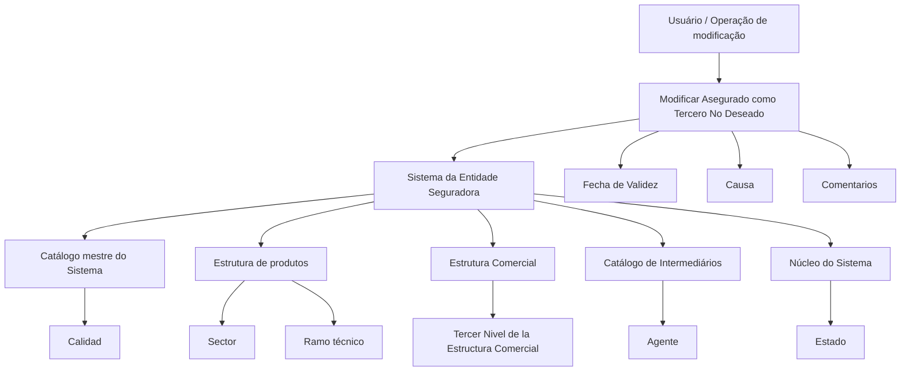

# Operação “Modificar Asegurado como Tercero No Deseado” — Especificação Funcional

## 1. Metadados do Documento
- **Arquivo de Origem:** Não informado; conteúdo bruto fornecido pelo usuário.
- **Tipo de Documento:** Especificação Técnica / Manual Funcional.
- **Domínio / Sistema:** Reef / Mapfredocument / Entidade Seguradora.
- **Público-Alvo:** Desenvolvedores, analistas funcionais, operação e negócio.
- **Data/Versão Identificada:** Não identificada.

---

## 2. Resumo Executivo & Contexto de Negócio

O documento descreve a operação **“Modificar Asegurado como Tercero No Deseado”**, destinada a modificar ou complementar informações previamente registradas para um segurado/cliente classificado como **Tercero No Deseado** em uma entidade seguradora.

A especificação apresenta os atributos de captura de informação e indica que a sequência de preenchimento deve ser interpretada da esquerda para a direita e de cima para baixo. Os atributos abrangem qualidade, validade, setor, ramo técnico, terceiro nível da estrutura comercial, agente, estado, causa e comentários.

O processo permite que a condição de Tercero No Deseado seja aplicada de forma abrangente ou restrita. Para setores, ramos e escritórios, o uso de códigos genéricos permite classificação aplicável a todos os elementos existentes; códigos específicos restringem a classificação ao setor, ramo ou escritório correspondente.

O documento não apresenta métodos HTTP, contratos JSON, telas completas, integrações, autenticação, persistência, fluxos de aprovação ou detalhes técnicos de implementação. Também menciona as ações “CREAR” e “MODIFICAR”, mas a extração não preserva com clareza quais estados estão efetivamente habilitados.

---

## 3. Arquitetura, Componentes & Tecnologias Envolvidas

Os elementos identificados no conteúdo são:

- **Reef:** Área de documentação referenciada como “DOCUMENTACIÓN Reef”.
- **Mapfredocument:** Referência presente no cabeçalho/rodapé do conteúdo.
- **Entidade Seguradora:** Contexto organizacional para o registro do Tercero No Deseado.
- **Sistema:** Núcleo que fornece classificações de estado, catálogos mestres, estrutura de produtos, estrutura comercial e catálogo de intermediários.
- **Catálogo mestre do Sistema:** Fonte dos códigos de qualidade.
- **Estrutura de produtos:** Fonte dos códigos de setor e ramo técnico.
- **Estrutura Comercial:** Fonte do terceiro nível da estrutura comercial.
- **Catálogo de Intermediários:** Fonte dos códigos de agente.
- **Núcleo do Sistema:** Fonte da classificação de estado do Tercero No Deseado.



**Nota de Análise:** O conteúdo não detalha arquitetura de software, protocolos, endpoints, banco de dados, interfaces de integração ou tecnologias de implementação.

---

## 4. Regras de Negócio, Especificações Funcionais & Processos

### Objetivo da operação

A operação permite **modificar ou complementar** a informação de um segurado/cliente que tenha sido previamente registrado como **Tercero No Deseado** para uma entidade seguradora.

### Ações mencionadas

O documento lista as ações:

- **CREAR**
- **MODIFICAR**

**Nota de Análise:** A extração contém marcadores vazios ao lado das ações e não permite afirmar se ambas estão habilitadas, selecionadas ou apenas listadas como possibilidades funcionais.

### Sequência de captura

A sequência dos atributos deve ser seguida:

1. Da esquerda para a direita.
2. De cima para baixo.

### Regras por atributo

#### Calidad

O atributo **Calidad** permite registrar o código de qualidade associado ao Tercero. O código deve estar previamente codificado no catálogo mestre do Sistema no momento do registro como Tercero No Deseado.

#### Fecha de Validez

O atributo **Fecha de Validez** define a data a partir da qual o Tercero será identificado como Tercero No Deseado. O uso correto desta data permite manter histórico das mudanças efetuadas nas informações do Tercero.

#### Sector

O atributo **Sector** contém o código de setor de acordo com a estrutura de produtos configurada no Sistema.

- O código genérico **9999** permite marcar o Tercero como Tercero No Deseado para todos os setores existentes.
- Um código de setor específico permite identificar o Tercero como Tercero No Deseado somente para operações daquele setor.
- O Sistema contempla a marcação de um Tercero como Tercero No Deseado para um único setor entre os setores existentes.

#### Ramo

O atributo **Ramo** deve conter o código do ramo técnico de acordo com a estrutura de produtos definida no Sistema.

- O código genérico **999** permite marcar o Tercero como Tercero No Deseado para todos os ramos existentes.
- Um código de ramo técnico específico permite identificar o Tercero como Tercero No Deseado somente para aquele ramo.

#### Tercer Nivel de la Estructura Comercial

O atributo **Tercer Nivel de la Estructura Comercial** deve conter o código do terceiro nível da estrutura comercial, segundo a relação de valores configurada no Sistema.

- O código genérico **9999** permite marcar o Tercero como Tercero No Deseado para todas as oficinas existentes.
- Um código de oficina específico permite identificar o Tercero como Tercero No Deseado apenas para aquela oficina.

#### Agente

O atributo **Agente** deve registrar o código do agente conforme a relação de valores configurada no catálogo de intermediários do Sistema.

#### Estado

O atributo **Estado** contém uma classificação fornecida pelo núcleo do Sistema para as possíveis condições e situações que identificam o Tercero como Tercero No Deseado.

#### Causa

O atributo **Causa** contém o motivo pelo qual o Tercero está sendo inabilitado. As causas ou motivos de inabilitação são configurados no Sistema por código de atividade.

#### Comentarios

O atributo **Comentarios** permite registrar texto livre para ampliar ou detalhar a razão pela qual o Tercero está sendo considerado uma pessoa física ou jurídica indesejável.

---

## 5. Tabelas de Parâmetros, Ambientes e Estruturas de Dados

| Item / Parâmetro | Descrição / Função | Tipo / Valores / Formato | Ambiente / Observações |
| :--- | :--- | :--- | :--- |
| Operação | Modificar ou complementar informações de segurado/cliente previamente registrado como Tercero No Deseado. | Operação funcional. | Entidade seguradora. |
| CREAR | Ação listada no documento. | Ação funcional. | O estado de habilitação não é determinável pela extração. |
| MODIFICAR | Ação listada no documento. | Ação funcional. | O estado de habilitação não é determinável pela extração. |
| Calidad | Associa um código de qualidade ao Tercero. | Código previamente cadastrado. | Catálogo mestre do Sistema. |
| Fecha de Validez | Define a data a partir da qual o Tercero é identificado como Tercero No Deseado. | Data. | Permite histórico de mudanças. |
| Sector | Define o setor associado à classificação. | Código de setor; `9999` como valor genérico. | Estrutura de produtos configurada no Sistema. |
| Sector = 9999 | Aplica a condição de Tercero No Deseado a todos os setores existentes. | Código genérico. | Aplicação global para setores. |
| Sector específico | Aplica a condição apenas às operações de um setor concreto. | Código de setor. | Aplicação restrita a um setor. |
| Ramo | Define o ramo técnico associado à classificação. | Código de ramo técnico; `999` como valor genérico. | Estrutura de produtos definida no Sistema. |
| Ramo = 999 | Aplica a condição de Tercero No Deseado a todos os ramos existentes. | Código genérico. | Aplicação global para ramos. |
| Ramo específico | Aplica a condição apenas a um ramo técnico. | Código de ramo técnico. | Aplicação restrita a um ramo. |
| Tercer Nivel de la Estructura Comercial | Define o código do terceiro nível da estrutura comercial. | Código configurado no Sistema; `9999` como valor genérico. | Relação de valores configurada no Sistema. |
| Tercer Nivel = 9999 | Aplica a condição de Tercero No Deseado a todas as oficinas existentes. | Código genérico. | Aplicação global para oficinas. |
| Oficina específica | Aplica a condição apenas a uma oficina particular. | Código de oficina. | Aplicação restrita à oficina indicada. |
| Agente | Registra o código do agente associado. | Código de agente. | Catálogo de Intermediários do Sistema. |
| Estado | Classificação das condições e situações que identificam um Tercero No Deseado. | Classificação fornecida pelo núcleo do Sistema. | Valores não detalhados no documento. |
| Causa | Registra o motivo da inabilitação do Tercero. | Código de causa/motivo. | Configurado por código de atividade no Sistema. |
| Comentarios | Complementa ou detalha o motivo de classificação. | Texto livre. | Para pessoa física ou jurídica considerada indesejável. |
| Reef | Referência de documentação. | Nome de área/plataforma documental. | “DOCUMENTACIÓN Reef”. |
| Mapfredocument | Referência documental apresentada no conteúdo. | Nome/identificador. | Sem detalhamento adicional. |
| Owner | Proprietário indicado na extração. | `user:agonzalez_mapfre.com` | Presente no conteúdo bruto. |
| Lifecycle | Ciclo de vida indicado na extração. | `Approved Source` | Presente no conteúdo bruto. |
| VL | Sigla exibida na extração. | `VL` | Significado não detalhado. |

---

## 6. Bateria de Perguntas & Respostas para RAG (FAQ Sintético)

### P1: Qual é o objetivo da operação “Modificar Asegurado como Tercero No Deseado”?
**R:** A operação permite modificar ou complementar informações de um segurado/cliente que já tenha sido registrado previamente como Tercero No Deseado para uma entidade seguradora.

### P2: Como o campo Fecha de Validez deve ser utilizado?
**R:** Fecha de Validez deve registrar a data a partir da qual o Tercero será identificado como Tercero No Deseado. O uso correto desse atributo permite manter o histórico das mudanças realizadas nas informações do Tercero.

### P3: O que acontece quando o código 9999 é informado no atributo Sector?
**R:** O código genérico `9999` no atributo Sector permite marcar o Tercero como Tercero No Deseado para todos os setores existentes no Sistema.

### P4: É possível restringir a condição de Tercero No Deseado a apenas um setor?
**R:** Sim. Ao informar o código de um setor concreto, o Sistema identifica o Tercero como Tercero No Deseado somente para as operações daquele setor. O documento afirma que o Sistema contempla a marcação para um único setor entre os setores existentes.

### P5: Qual código deve ser usado para aplicar a condição a todos os ramos técnicos?
**R:** O código genérico `999` deve ser utilizado no atributo Ramo para marcar o Tercero como Tercero No Deseado para todos os ramos existentes.

### P6: Como restringir a condição de Tercero No Deseado a um ramo técnico específico?
**R:** Deve-se informar o código de um ramo técnico específico no atributo Ramo. Dessa forma, o Tercero será identificado como Tercero No Deseado apenas para aquele ramo.

### P7: Qual é a função do atributo Tercer Nivel de la Estructura Comercial?
**R:** O atributo deve conter o código do terceiro nível da estrutura comercial, conforme a relação de valores configurada no Sistema. Esse atributo permite aplicar a condição para todas as oficinas ou restringi-la a uma oficina particular.

### P8: O que significa informar 9999 no terceiro nível da estrutura comercial?
**R:** O código genérico `9999` no atributo Tercer Nivel de la Estructura Comercial permite marcar o Tercero como Tercero No Deseado para todas as oficinas existentes.

### P9: De onde vem o código informado no campo Agente?
**R:** O campo Agente deve registrar um código conforme a relação de valores configurada no catálogo de Intermediários do Sistema.

### P10: Como o campo Estado é definido?
**R:** O campo Estado contém uma classificação fornecida pelo núcleo do Sistema, representando possíveis condições e situações que identificam o Tercero como Tercero No Deseado. O documento não detalha os valores possíveis dessa classificação.

### P11: Como a causa de inabilitação é registrada?
**R:** O campo Causa contém o motivo pelo qual o Tercero está sendo inabilitado. As causas ou motivos de inabilitação são configurados no Sistema por código de atividade.

### P12: Para que serve o campo Comentarios?
**R:** Comentarios permite capturar texto livre para ampliar ou detalhar o motivo pelo qual o Tercero é considerado uma pessoa física ou jurídica indesejável.

---

## 7. Glossário de Termos, Siglas & Conceitos-Chave

- **Agente:** Código de agente obtido conforme valores configurados no catálogo de Intermediários do Sistema.
- **Calidad:** Atributo que registra o código de qualidade associado ao Tercero.
- **Causa:** Motivo pelo qual o Tercero está sendo inabilitado.
- **Entidad Aseguradora:** Entidade seguradora para a qual o Tercero é classificado como não desejado.
- **Fecha de Validez:** Data a partir da qual o Tercero passa a ser identificado como Tercero No Deseado.
- **Mapfredocument:** Referência documental exibida no conteúdo; não há detalhamento funcional.
- **Núcleo del Sistema:** Componente do Sistema responsável por fornecer a classificação de Estado.
- **Oficina:** Unidade referenciada no terceiro nível da estrutura comercial.
- **Ramo:** Ramo técnico conforme estrutura de produtos definida no Sistema.
- **Reef:** Referência à documentação apresentada como “DOCUMENTACIÓN Reef”.
- **Sector:** Código de setor conforme a estrutura de produtos configurada no Sistema.
- **Tercero:** Segurado/cliente objeto do registro e da classificação.
- **Tercero No Deseado:** Pessoa física ou jurídica classificada como indesejável para a entidade seguradora, podendo ter a condição aplicada globalmente ou de forma restrita por setor, ramo ou oficina.
- **Tercer Nivel de la Estructura Comercial:** Código do terceiro nível da estrutura comercial, usado para escopo por oficina.
- **VL:** Sigla exibida no conteúdo bruto sem definição fornecida.

---

## 8. Notas Críticas, Riscos & Limitações

- O documento não especifica métodos HTTP, APIs, contratos JSON, modelos de dados, validações obrigatórias, mensagens de erro, permissões ou autenticação.
- Os valores permitidos para **Calidad**, **Estado**, **Causa** e **Agente** não são listados; o documento apenas aponta os catálogos ou componentes de origem.
- Não há definição de formato para **Fecha de Validez**.
- O documento não informa regras de precedência ou combinação entre setor, ramo, escritório, agente, estado e causa.
- As ações **CREAR** e **MODIFICAR** aparecem no conteúdo, mas o estado dos marcadores associados foi perdido ou não é interpretável na extração.
- A extração contém caracteres corrompidos, como `Modicar`, `codicados`, `identicado` e `Ocinas`; o significado foi interpretado apenas quando o contexto textual era inequívoco.
- A seção final contém “Consejo:” repetido três vezes, sem conteúdo adicional recuperado.
- Não há URLs de ambientes, nomes de servidores, rotas de logs, versões de software ou dependências técnicas explicitamente informadas.

---

## 9. Conteúdo Bruto Estruturado (Referência Fiel)

```text
--- [PÁGINA 1 DE 2] ---

MODIFICAR Asegurado como Tercero No Deseado
Objetivo
Esta Operación permite Modicar o Complementar la información del Asegurado/Cliente registrada previamente como Tercero No Deseado
para la Entidad Aseguradora.
Acciones habilitadas
 CREAR ( )  MODIFICAR ( )
Datos Terceros No Deseados
De Izquierda a Derecha y de Arriba hacia Abajo, los siguientes atributos marcan la secuencia de captura de la Información en el sistema.
Calidad (  )
Este Campo va a permitir capturar el código de calidad que se va a asociar al Tercero de acuerdo con los valores previamente codicados en
el catálogo maestro del Sistema, en el momento de registrarlo como Tercero No Deseado.
Fecha de Validez ( )
Esta propiedad le indica al sistema la fecha a partir de la cual el Tercero va a ser identicado como Tercero No Deseado por lo que su
correcto uso permite tener un histórico de los cambios efectuados en la Información del Tercero.
Sector (  )
Este Campo contiene el código del sector de acuerdo con la estructura de productos congurada en el Sistema.
Documentation / DOCUMENTACIÓN Reef
DOCUMENTACIÓN Reef
Mapfredocument
DOCUMENTACIÓN Reef
Owner
user:agonzalez_mapfre.com
Lifecycle
Approved Source
 / 
 VL
Buscar Inicio Soluciones Arquitecturas APIs Componentes Cloud Documentación Zeus Reef Ayuda
ES

--- [PÁGINA 2 DE 2] ---

Utilizando el valor genérico en este atributo (código 9999) el sistema permite marcar al Tercero como Tercero no Deseado para todos los
Sectores existentes o bien al utilizar el código de un Sector en concreto, identicar al Tercero como Tercero no Deseado únicamente para
las Operaciones de este Sector.
De esta manera el sistema contempla la posibilidad de marcaje de un Tercero como Tercero No Deseado para un único Sector de los n
existentes.
Ramo (  )
Este Campo deber contener el código del ramo técnico de acuerdo con la estructura de productos denida en el Sistema.
Utilizando el valor genérico en este atributo (código 999) el sistema permite marcar al Tercero como Tercero no Deseado para todos los
Ramos existentes o bien al utilizar el código de un Ramo Técnico de los n existentes, identicar al Tercero como Tercero no Deseado
únicamente para ese Ramo.
Tercer Nivel de la Estructura Comercial (  )
Este Campo ha de contener el código del tercer nivel de la Estructura Comercial, de acuerdo con la relación de valores congurada en el
Sistema.
Utilizando el valor genérico en este atributo (código 9999), el sistema permite marcar al Tercero como Tercero no Deseado para todas las
Ocinas existentes o bien al utilizar el código de una Ocina en Particular, identicar al Tercero como Tercero no Deseado únicamente
para esa Ocina.
Agente (  )
Este Campo tiene que registrar el código del agente de acuerdo con la relación de posibles valores congurada en el catálogo de
Intermediarios en el Sistema.
Estado (   )
Este atributo contiene una clasicación proporcionada por el núcleo del Sistema, de las posibles condiciones y situaciones que identican al
Tercero como Tercero No Deseado.
Causa (   )
Este Campo contiene el motivo por el cual se está Inhabilitando al Tercero, de acuerdo con las causas o motivos de inhabilitación que se
hayan congurado por código de actividad en el Sistema.
Comentarios (  )
Este Atributo permite capturar texto plano para ampliar o detallar el motivo por el que se está considerando al Tercero como una Persona
Física o Jurídica indeseable.
Consejo:
Consejo:
Consejo:
```
