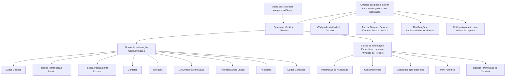

# Operação “Modificar Asegurado/Cliente” — Blocos de Informação Compartilhados e Específicos

## 1. Metadados do Documento
- **Arquivo de Origem:** `Não identificado no conteúdo fornecido`
- **Tipo de Documento:** Manual Operacional / Documentação Funcional
- **Domínio / Sistema:** Documentación Reef / Mapfre
- **Público-Alvo:** Usuários do Sistema, Analistas Funcionais, Desenvolvedores e Operação
- **Data/Versão Identificada:** Não identificada

---

## 2. Resumo Executivo & Contexto de Negócio

O documento descreve a operação **“Modificar Asegurado/Cliente”**, destinada a modificar informações de assegurados previamente registradas no sistema. O processo utiliza blocos de informação compartilhados e blocos de informação específicos associados à atividade do terceiro.

A obrigatoriedade e a habilitação dos campos podem variar conforme o **código de atividade do Terceiro**. Portanto, a operação não apresenta um conjunto único e invariável de campos obrigatórios para todos os registros.

O comportamento da captura e manutenção de dados também varia conforme o tipo de Terceiro: **Pessoa Física** ou **Pessoa Jurídica**. Além disso, modificações implementadas localmente podem alterar o comportamento da aplicação quanto à obrigatoriedade de preenchimento dos dados do Terceiro.

O documento informa que a ordem de captura dos dados nos diferentes blocos de informação pode variar de acordo com o critério adotado pelo usuário no sistema. A documentação lista blocos compartilhados, como Dados Básicos, Contatos e Direções, e blocos específicos, como Informação do Asegurado, Consentimentos e Licença/Permissão de Conduzir.

---

## 3. Arquitetura, Componentes & Tecnologias Envolvidas

A documentação não descreve arquitetura técnica de infraestrutura, integrações, APIs, bancos de dados, protocolos ou tecnologias de implementação. O conteúdo apresenta uma estrutura funcional de manutenção de dados de Terceiros, organizada por blocos de informação.

Componentes e elementos funcionais identificados:

- Operação **Modificar Asegurado/Cliente**.
- Processo **Modificar Terceiro**.
- Blocos de Informação Compartilhados.
- Blocos de Informação Específicos de acordo com a Atividade do Terceiro.
- Tipos de Terceiro: Pessoa Física e Pessoa Jurídica.
- Contexto documental: **Documentation / DOCUMENTACIÓN Reef**, **Mapfredocument** e **DOCUMENTACIÓN Reef**.
- Navegação documental visível: Buscar, Inicio, Soluciones, Arquitecturas, APIs, Componentes, Cloud, Documentación, Zeus, Reef e Ayuda.



> **Nota de Análise:** O documento não detalha métodos HTTP, contratos JSON, persistência de dados, autenticação, permissões, integrações, URLs operacionais ou tecnologias utilizadas pela aplicação.

---

## 4. Regras de Negócio, Especificações Funcionais & Processos

### Objetivo da operação

A operação **Modificar Asegurado/Cliente** permite modificar a informação de assegurados previamente registrada.

### Premissas de preenchimento e habilitação

1. A obrigatoriedade e/ou habilitação dos campos no registro de dados pode variar entre os blocos ou estruturas de informação compartilhadas.
2. A variação de obrigatoriedade e/ou habilitação depende do **código de atividade do Terceiro**.
3. A obrigatoriedade e/ou habilitação dos campos pode variar conforme o Terceiro seja uma **Pessoa Física** ou uma **Pessoa Jurídica**.
4. Modificações implementadas localmente podem afetar o comportamento da aplicação quanto à obrigatoriedade de registro dos Dados do Terceiro.
5. A ordem de captura dos dados nos blocos de informação pode variar de acordo com o critério seguido pelo usuário no sistema.

### Processo funcional identificado

1. O usuário acessa a operação **Modificar Asegurado/Cliente**.
2. O processo executado é denominado **Modificar Terceiro**.
3. O usuário atua sobre blocos de informação relacionados ao Terceiro e ao Asegurado.
4. Os blocos compartilhados podem conter informações básicas, identificação, contatos, endereços, documentos, representantes legais, acionistas e dados bancários.
5. Os blocos específicos são apresentados de acordo com a atividade do Terceiro e incluem informação do assegurado, consentimentos, assegurado não desejado, perfil analítico e licença/permissão de conduzir.
6. A obrigatoriedade, disponibilidade e sequência de captura dos campos não são fixas; elas podem ser influenciadas pelas premissas documentadas.

---

## 5. Tabelas de Parâmetros, Ambientes e Estruturas de Dados

| Item / Parâmetro | Descrição / Função | Tipo / Valores / Formato | Ambiente / Observações |
| :--- | :--- | :--- | :--- |
| Operação | Permite modificar informações previamente registradas dos assegurados. | Modificar Asegurado/Cliente | Não informado |
| Processo | Processo funcional associado à operação. | Modificar Terceiro | Não informado |
| Código de atividade do Terceiro | Pode influenciar a obrigatoriedade e/ou habilitação de campos nos blocos compartilhados. | Código de atividade | Valores não detalhados |
| Tipo de Terceiro | Pode influenciar a obrigatoriedade e/ou habilitação de campos. | Pessoa Física; Pessoa Jurídica | Critérios específicos não detalhados |
| Modificações locais | Podem afetar o comportamento da aplicação sobre a obrigatoriedade de registro dos dados do Terceiro. | Modificações implementadas localmente | Não detalhadas |
| Ordem de captura | A sequência de captura dos dados nos blocos pode variar. | Critério do usuário no sistema | Não há ordem obrigatória documentada |
| Dados Básicos | Bloco de informação compartilhado. | Bloco de dados | Campos não detalhados |
| Dados Identificação Terceiro | Bloco de informação compartilhado. | Bloco de dados | Campos não detalhados |
| Pessoa Politicamente Exposta | Bloco de informação compartilhado. | Bloco de dados | Critérios e campos não detalhados |
| Contatos | Bloco de informação compartilhado. | Bloco de dados | Campos não detalhados |
| Direções | Bloco de informação compartilhado. | Bloco de dados | Campos não detalhados |
| Documentos Alternativos | Bloco de informação compartilhado. | Bloco de dados | Campos não detalhados |
| Representantes Legais | Bloco de informação compartilhado. | Bloco de dados | Campos não detalhados |
| Acionistas | Bloco de informação compartilhado. | Bloco de dados | Campos não detalhados |
| Dados Bancários | Bloco de informação compartilhado. | Bloco de dados | Campos não detalhados |
| Informação do Asegurado | Bloco específico conforme atividade do Terceiro. | Bloco de dados | Campos não detalhados |
| Consentimentos | Bloco específico conforme atividade do Terceiro. | Bloco de dados | O ícone visual indica possibilidade de inclusão/expansão, mas o comportamento não é detalhado |
| Asegurado Não Desejado | Bloco específico conforme atividade do Terceiro. | Bloco de dados | Regras não detalhadas |
| Perfil Analítico | Bloco específico conforme atividade do Terceiro. | Bloco de dados | Regras não detalhadas |
| Licença / Permissão de Conduzir | Bloco específico conforme atividade do Terceiro. | Bloco de dados | Regras não detalhadas |
| Documentation / DOCUMENTACIÓN Reef | Contexto de documentação visível no material. | Repositório ou área documental | Relação técnica com a operação não detalhada |
| Mapfredocument | Elemento textual visível no material. | Nome apresentado no documento | Função não detalhada |
| Owner | Responsável exibido na documentação. | `user:agonzalez_mapfre.com` | Valor apresentado literalmente |
| Lifecycle | Estado exibido na documentação. | Approved Source | Contexto e significado operacional não detalhados |
| Idioma | Idioma visível na interface documental. | ES | Não há informação adicional |

---

## 6. Bateria de Perguntas & Respostas para RAG (FAQ Sintético)

### P1: Qual é o objetivo da operação “Modificar Asegurado/Cliente”?
**R:** A operação “Modificar Asegurado/Cliente” permite modificar informações de assegurados que já foram registradas previamente no sistema.

### P2: Quais fatores podem alterar a obrigatoriedade ou a habilitação de campos no processo Modificar Terceiro?
**R:** A obrigatoriedade e/ou habilitação dos campos pode variar de acordo com o código de atividade do Terceiro, com o tipo de Terceiro — Pessoa Física ou Pessoa Jurídica — e com modificações implementadas localmente que afetem o comportamento da aplicação.

### P3: A operação Modificar Asegurado/Cliente possui uma ordem fixa de preenchimento dos blocos de informação?
**R:** Não. O documento informa que a ordem de captura dos dados nos diferentes blocos de informação pode variar conforme o critério seguido pelo usuário no sistema.

### P4: Quais são os blocos de informação compartilhados no processo Modificar Terceiro?
**R:** Os blocos compartilhados listados são: Dados Básicos, Dados Identificação Terceiro, Pessoa Politicamente Exposta, Contatos, Direções, Documentos Alternativos, Representantes Legais, Acionistas e Dados Bancários.

### P5: Quais blocos de informação específicos podem ser utilizados conforme a atividade do Terceiro?
**R:** Os blocos específicos listados são: Informação do Asegurado, Consentimentos, Asegurado Não Desejado, Perfil Analítico e Licença / Permissão de Conduzir.

### P6: O que muda quando o Terceiro é Pessoa Física ou Pessoa Jurídica?
**R:** O documento estabelece que a obrigatoriedade e/ou habilitação dos campos no registro de dados pode variar quando o tipo de Terceiro é Pessoa Física ou Pessoa Jurídica. Os critérios específicos dessa variação não são detalhados.

### P7: As modificações locais podem impactar o cadastro do Terceiro?
**R:** Sim. O documento informa que modificações implementadas localmente podem afetar o comportamento da aplicação em relação à obrigatoriedade de registro dos Dados do Terceiro.

### P8: O documento especifica quais campos existem dentro do bloco Dados Bancários?
**R:** Não. O documento apenas lista Dados Bancários como um bloco de informação compartilhado; não detalha seus campos, formatos, validações ou regras de preenchimento.

### P9: O documento explica como funciona o bloco Consentimentos?
**R:** Não em detalhe. O bloco Consentimentos é listado como informação específica de acordo com a atividade do Terceiro. O material apresenta um ícone visual associado ao bloco, mas não descreve campos, regras, persistência ou comportamento funcional.

### P10: Existem APIs, métodos HTTP ou contratos de integração documentados para Modificar Asegurado/Cliente?
**R:** Não. O conteúdo fornecido não descreve APIs, métodos HTTP, contratos JSON, URLs de integração, tecnologias de implementação ou fluxos de comunicação entre sistemas.

### P11: Qual é a relação entre Modificar Asegurado/Cliente e Modificar Terceiro?
**R:** O documento apresenta “Modificar Terceiro” como o processo no qual são organizados os blocos de informação compartilhados e específicos utilizados pela operação “Modificar Asegurado/Cliente”.

### P12: O documento informa regras para classificar um Asegurado como “Não Desejado”?
**R:** Não. “Asegurado No Deseado” é apenas listado como um bloco de informação específico conforme a atividade do Terceiro. Não há critérios, regras de negócio ou condições de classificação descritas.

---

## 7. Glossário de Termos, Siglas & Conceitos-Chave

- **Asegurado / Cliente:** Entidade cujas informações previamente registradas podem ser modificadas pela operação descrita.
- **Terceiro:** Entidade de referência para a qual são registrados dados em blocos de informação compartilhados e específicos.
- **Pessoa Física:** Tipo de Terceiro mencionado como fator que pode alterar a obrigatoriedade ou habilitação de campos.
- **Pessoa Jurídica:** Tipo de Terceiro mencionado como fator que pode alterar a obrigatoriedade ou habilitação de campos.
- **Blocos de Informação Compartilhados:** Estruturas de informação utilizadas no processo Modificar Terceiro e listadas no documento.
- **Blocos de Informação Específicos:** Estruturas de informação associadas à atividade do Terceiro.
- **Dados Identificação Terceiro:** Bloco compartilhado listado para informações de identificação do Terceiro.
- **Pessoa Politicamente Exposta:** Bloco de informação compartilhado listado no processo. O documento não fornece definição adicional.
- **Asegurado Não Desejado:** Bloco de informação específico listado no documento. As regras de classificação não são detalhadas.
- **Perfil Analítico:** Bloco de informação específico listado no documento. Sua finalidade detalhada não é informada.
- **Reef:** Nome presente no contexto documental. O documento não define a sigla ou o significado do termo.
- **Mapfredocument:** Nome apresentado no material. A função ou definição não é detalhada.
- **Lifecycle:** Campo exibido no contexto documental, com o valor “Approved Source”.
- **ES:** Código de idioma exibido na interface documental. O documento não fornece explicação adicional.

---

## 8. Notas Críticas, Riscos & Limitações

- O conteúdo não identifica o arquivo de origem, data, versão, autor técnico, sistema de origem ou ambiente operacional da operação.
- O documento não detalha campos, tipos, formatos, regras de validação ou obrigatoriedade individual dos blocos de informação.
- Não são apresentados critérios objetivos para variação de campos por código de atividade do Terceiro.
- Não são apresentados critérios objetivos para diferenciação entre Pessoa Física e Pessoa Jurídica.
- As modificações locais são citadas como fator de impacto, mas não são identificadas nem descritas.
- Não há detalhamento sobre permissões, perfis de acesso, trilha de auditoria, tratamento de erros, persistência ou aprovação de alterações.
- Não há especificações de APIs, integrações, microsserviços, URLs, métodos HTTP, contratos de dados ou tecnologias de infraestrutura.
- **Nota de Análise:** O documento lista blocos como “Asegurado No Deseado”, “Perfil Analítico” e “Consentimientos”, porém não detalha regras funcionais, campos ou comportamento específico para esses blocos.
- **Nota de Análise:** O texto menciona documentação Reef, Mapfredocument e o estado “Approved Source”, mas não explica a relação operacional desses elementos com a funcionalidade Modificar Asegurado/Cliente.

---

## 9. Conteúdo Bruto Estruturado (Referência Fiel)

```text
--- [PÁGINA 1 DE 2] ---

OPERACIÓN MODIFICAR Asegurado/Cliente
¿En que consiste?
Esta operación permite Modicar la Información de los Asegurados registrada previamente.
Premisas
La obligatoriedad y/o la habilitación de los campos en el registro de los datos de cada uno de los bloques o estructuras de información
compartidas puede variar de acuerdo con el código de actividad del Tercero:
La obligatoriedad y/o la habilitación de los campos en el registro de los datos de cada uno de los bloques o estructuras de información
pueden variar si el tipo de Tercero es una Persona Física o una Persona Jurídica:
Las modicaciones que se hubieran podido implementar localmente a su vez pueden afectar el comportamiento de la aplicación en
relación con la obligatoriedad en el registro de los Datos del Tercero.
Por último, el orden de captura de los datos en los distintos bloques de Información puede variar de acuerdo con el criterio seguido por el
Usuario en el Sistema.
Proceso
MODIFICAR
TERCERO
Información
Asegurado Consentimientos Asegurado
No Deseado
Perfil
Analítico
Licencia
de Conducir
Bloques de Información Compartidos (MODIFICAR TERCERO)
 Datos Básicos ( )
 Datos Identicación Tercero ( )
 Persona Políticamente Expuesta(   )
 Contactos (   )
 Direcciones (   )
 Documentos Alternativos (   )
 Representantes Legales (   )
Ejemplo:
Ejemplo:
Documentation / DOCUMENTACIÓN Reef
DOCUMENTACIÓN Reef
Mapfredocument
DOCUMENTACIÓN Reef
Owner
user:agonzalez_mapfre.com
Lifecycle
Approved Source
 / 
 VL
Buscar Inicio Soluciones Arquitecturas APIs Componentes Cloud Documentación Zeus Reef Ayuda
ES


--- [PÁGINA 2 DE 2] ---

Accionistas (   )
 Datos Bancarios (   )
Bloques de Información Especícos de acuerdo con la Actividad del Tercero.
 Información del Asegurado (  )
 Consentimientos (:fontawesome-regular-square-plus  )
 Asegurado No Deseado (  )
 Perl Analítico ( )
 Licencia / Permiso de Conducir ( )
```
