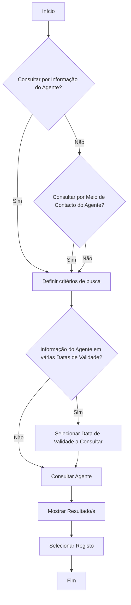

# Operação “Consultar Agente” — Consulta de Informação, Contacto e Histórico de Agentes

## 1. Metadados do Documento
- **Arquivo de Origem:** Não identificado no conteúdo fornecido
- **Tipo de Documento:** Procedimento
- **Domínio / Sistema:** Reef / Mapfre — consulta de agentes e histórico de agentes
- **Público-Alvo:** Operação, negócio e utilizadores que consultam dados de agentes
- **Data/Versão Identificada:** Não identificada

---

## 2. Resumo Executivo & Contexto de Negócio

O documento descreve a operação **“Consultar Agente”**, destinada à consulta de informação de agentes. A operação abrange tanto a situação mais recente do agente quanto situações temporais armazenadas no histórico, segundo a data de validade selecionada pelo utilizador.

A consulta aplica-se a agentes que sejam **Pessoas Físicas** ou **Pessoas Jurídicas**. O procedimento contempla consultas por informação do agente, por meio de contacto e por dados relacionados ao terceiro.

O fluxo operacional determina que, quando existirem informações do agente em várias datas de validade, o utilizador deve selecionar a data de validade que deseja consultar antes de executar a ação **“CONSULTAR Agente”**. Após a execução, o processo apresenta o resultado ou resultados encontrados e permite selecionar um registo.

O conteúdo faz referência à documentação Reef e ao contexto Mapfre. Não são apresentados métodos HTTP, contratos de integração, modelos de dados, permissões, URLs de ambiente, tecnologias de implementação ou detalhes sobre a persistência do histórico.

---

## 3. Arquitetura, Componentes & Tecnologias Envolvidas

### Componentes e conceitos identificados

| Componente / Conceito | Descrição sustentada pelo documento |
| :--- | :--- |
| Operação “Consultar Agente” | Operação para consultar informação de agentes. |
| Agente | Entidade consultada; pode ser Pessoa Física ou Pessoa Jurídica. |
| Histórico de Agentes | Fonte de consulta de situações temporais, de acordo com a data de validade selecionada. |
| Informação do Agente | Um dos critérios ou modalidades de consulta apresentados no fluxo. |
| Meio de Contacto do Agente | Um dos critérios ou modalidades de consulta apresentados no fluxo. |
| Dados do Terceiro | Critério de busca apresentado no documento. |
| Meio de Contacto do Terceiro | Critério de busca apresentado no documento. |
| Terceiro Não Desejado | Entidade que pode ser tratada como não desejada e criada através da opção indicada. |
| Reef | Contexto de documentação mencionado no conteúdo. |
| Mapfre | Organização ou contexto documental citado no conteúdo. |



> **Nota de Análise:** O documento apresenta um fluxo funcional da operação, mas não detalha a arquitetura de software, os sistemas responsáveis pela consulta, as interfaces de integração, os métodos de acesso ou os contratos de dados.

---

## 4. Regras de Negócio, Especificações Funcionais & Processos

### Escopo funcional da consulta

1. A operação **“Consultar Agente”** permite consultar informações de agentes.
2. A consulta pode recuperar:
   - A última situação do agente.
   - Uma situação temporal no histórico.
3. A consulta histórica depende da **data de validade selecionada**.
4. A consulta abrange agentes classificados como:
   - Pessoas Físicas.
   - Pessoas Jurídicas.
5. O fluxo apresenta consulta por:
   - Informação do agente.
   - Meio de contacto do agente.
6. Os critérios de busca apresentados incluem:
   - Consulta por dados do terceiro.
   - Consulta por meio de contacto do terceiro.
7. O documento inclui a possibilidade de:
   - Tratar o terceiro como **Terceiro Não Desejado**.
   - Criar um **Terceiro Não Desejado**.
8. Quando houver informação do agente em várias datas de validade, o utilizador deve selecionar a data de validade a consultar.
9. A execução da consulta é representada pela ação **“CONSULTAR Agente”**.
10. O resultado da consulta pode conter um ou mais registos, apresentados em **“Mostrar Resultado/s”**.
11. Após a apresentação dos resultados, o utilizador pode selecionar um registo.

### Fluxo operacional detalhado

1. Iniciar a operação de consulta de agente.
2. Determinar se a consulta será realizada por **informação do agente**.
3. Determinar se a consulta será realizada por **meio de contacto do agente**.
4. Preencher ou aplicar os critérios de busca disponíveis:
   - Dados do terceiro.
   - Meio de contacto do terceiro.
5. Aplicar, quando necessário, o tratamento de terceiro como **Terceiro Não Desejado**.
6. Criar um **Terceiro Não Desejado**, quando aplicável segundo a opção indicada no documento.
7. Verificar se existem informações do agente em várias datas de validade.
8. Quando existirem várias datas de validade, selecionar a data desejada.
9. Executar a ação **“CONSULTAR Agente”**.
10. Visualizar o resultado ou os resultados retornados.
11. Selecionar o registo de interesse.
12. Encerrar o fluxo.

> **Nota de Análise:** O documento apresenta as opções de consulta e as decisões do fluxo, mas não especifica quais campos compõem “Dados do Terceiro”, “Informação do Agente” ou “Meio de Contacto do Agente”. Também não descreve critérios de validação, regras de ordenação, mensagens de erro ou comportamento para ausência de resultados.

---

## 5. Tabelas de Parâmetros, Ambientes e Estruturas de Dados

| Item / Parâmetro | Descrição / Função | Tipo / Valores / Formato | Ambiente / Observações |
| :--- | :--- | :--- | :--- |
| Operação | Executa a consulta de informação de agentes. | “Consultar Agente” | Contexto Reef / Mapfre. |
| Situação em vigor | Permite consultar a situação atual do agente. | Opção de consulta | O documento também usa a expressão “última situação”. |
| Histórico de situações | Permite consultar situações temporais de agentes. | Opção de consulta | Dependente da data de validade selecionada. |
| Data de validade | Define a situação temporal do histórico que será consultada. | Data; formato não especificado | Deve ser selecionada quando houver várias datas de validade. |
| Informação do Agente | Modalidade ou critério de consulta indicado no fluxo. | Opção de consulta | Campos não detalhados. |
| Meio de Contacto do Agente | Modalidade ou critério de consulta indicado no fluxo. | Opção de consulta | Campos não detalhados. |
| Dados do Terceiro | Critério de busca apresentado no documento. | Opção de consulta | Estrutura não detalhada. |
| Meio de Contacto do Terceiro | Critério de busca apresentado no documento. | Opção de consulta | Estrutura não detalhada. |
| Tratar Terceiro como Terceiro Não Desejado | Ação ou tratamento disponível no processo. | Opção / ação | Regras e efeitos não detalhados. |
| Criar Terceiro Não Desejado | Ação disponibilizada no processo. | Opção / ação | Dados obrigatórios e resultado não detalhados. |
| Mostrar Resultado/s | Apresenta um ou mais resultados da consulta. | Saída do processo | Critérios de ordenação e paginação não informados. |
| Selecionar Registo | Permite escolher um resultado apresentado. | Ação do utilizador | Comportamento após a seleção não detalhado. |
| Tipo de agente | Classificação de agentes abrangidos pela consulta. | Pessoa Física; Pessoa Jurídica | Aplicável à consulta de agentes e ao histórico de agentes. |
| Reef | Referência de documentação e navegação. | Plataforma/contexto documental | Não há detalhes técnicos adicionais. |
| Mapfre | Referência organizacional ou documental. | Contexto corporativo | Citado como “Mapfredocument”. |
| Owner | Proprietário exibido na página documental. | `user:agonzalez_mapfre.com` | Valor literal extraído do conteúdo. |
| Lifecycle | Estado documental exibido na página. | `Approved Source` | Não há explicação adicional no texto. |

---

## 6. Bateria de Perguntas & Respostas para RAG (FAQ Sintético)

### P1: Em que consiste a operação “Consultar Agente”?
**R:** A operação “Consultar Agente” permite consultar informações de agentes, incluindo a última situação do agente ou uma situação temporal armazenada no histórico. A consulta histórica é realizada de acordo com a data de validade selecionada.

### P2: Quais tipos de agentes podem ser consultados?
**R:** O documento informa que a consulta de agentes e a consulta do histórico de agentes abrangem agentes que sejam Pessoas Físicas ou Pessoas Jurídicas.

### P3: É possível consultar o histórico de situações de um agente?
**R:** Sim. O documento apresenta a opção “Consultar en Histórico de Situaciones” e informa que a operação pode recuperar uma situação temporal no histórico conforme a data de validade selecionada.

### P4: Quando é necessário selecionar uma data de validade?
**R:** A data de validade deve ser selecionada quando existirem informações do agente em várias datas de validade. O fluxo indica a etapa “SELECCIONAR Fecha de Validez a Consultar” antes da execução da consulta.

### P5: A operação permite consultar a situação atual do agente?
**R:** Sim. O documento apresenta a opção “Consultar Situación en Vigor” e também descreve que a operação pode consultar a última situação do agente.

### P6: Quais critérios de busca relacionados ao terceiro são apresentados?
**R:** Os critérios de busca apresentados são “Consultar por Dados del Tercero” e “Consultar por Medio de Contacto del Tercero”. O conteúdo não especifica os campos que compõem esses critérios.

### P7: A consulta pode ser realizada por meio de contacto do agente?
**R:** Sim. O fluxo pergunta se o utilizador deseja “Consultar por Medio de Contacto del Agente”. O documento não detalha quais tipos de meio de contacto são suportados.

### P8: O que acontece depois de executar a ação “CONSULTAR Agente”?
**R:** Depois da ação “CONSULTAR Agente”, o fluxo indica “Mostrar Resultado/s”. Em seguida, o utilizador pode executar a etapa “Seleccionar Registro”.

### P9: O documento prevê tratamento de Terceiro Não Desejado?
**R:** Sim. O conteúdo apresenta as opções “Tratar Tercero como Tercero No Deseado” e “CREAR Tercero No Deseado”. Contudo, não detalha as condições de negócio, permissões ou efeitos dessas ações.

### P10: O documento define os métodos HTTP ou contratos de integração da operação “Consultar Agente”?
**R:** Não. O documento descreve o processo funcional de consulta, mas não apresenta métodos HTTP, endpoints, contratos JSON, tecnologias de integração ou especificações de API.

### P11: O que o documento informa sobre os resultados da busca?
**R:** O processo prevê a apresentação de um ou mais resultados por meio da etapa “Mostrar Resultado/s”, seguida da seleção de um registo. Não há detalhes sobre filtros, paginação, ordenação ou campos exibidos no resultado.

### P12: Qual é o contexto documental associado à operação?
**R:** O conteúdo faz referência a “DOCUMENTACIÓN Reef”, “Mapfredocument” e ao estado de ciclo de vida “Approved Source”. Também identifica o owner como `user:agonzalez_mapfre.com`.

---

## 7. Glossário de Termos, Siglas & Conceitos-Chave

- **Agente:** Entidade cuja informação, situação em vigor ou histórico de situações pode ser consultado.
- **Data de Validade:** Data selecionada para consultar uma situação temporal no histórico de um agente.
- **Histórico de Situações:** Conjunto de situações temporais associadas a agentes.
- **Meio de Contacto:** Critério de consulta aplicável ao agente ou ao terceiro; os tipos de contacto não são especificados.
- **Pessoa Física:** Tipo de agente abrangido pela consulta, conforme indicado no documento.
- **Pessoa Jurídica:** Tipo de agente abrangido pela consulta, conforme indicado no documento.
- **Reef:** Nome citado no contexto de documentação da operação.
- **Situação em Vigor:** Situação atual ou última situação consultável de um agente.
- **Terceiro:** Entidade referida nos critérios de busca por dados ou por meio de contacto.
- **Terceiro Não Desejado:** Classificação ou entidade que pode ser tratada e criada segundo opções apresentadas no processo.

---

## 8. Notas Críticas, Riscos & Limitações

- O conteúdo não identifica o nome do arquivo de origem, data, versão ou autor formal do procedimento.
- O documento não descreve arquitetura de software, serviços, bases de dados, interfaces, endpoints, métodos HTTP, autenticação ou autorização.
- Não há definição dos campos que compõem os critérios “Informação do Agente”, “Dados do Terceiro” e “Meio de Contacto”.
- Não são especificadas regras para pesquisa sem resultados, múltiplos resultados, erros de validação, dados inválidos ou indisponibilidade de serviços.
- O fluxo apresenta as opções relacionadas a **Terceiro Não Desejado**, mas não define condições de uso, permissões necessárias, persistência ou impactos dessa classificação.
- Não são apresentadas URLs, ambientes, servidores, parâmetros de configuração, rotas de log ou procedimentos operacionais de suporte.
- **Nota de Análise:** O documento descreve a operação funcional “Consultar Agente”, porém não detalha métodos HTTP, contratos JSON ou interfaces expostas.

---

## 9. Conteúdo Bruto Estruturado (Referência Fiel)

```text
--- [PÁGINA 1 DE 2] ---

OPERACIÓN CONSULTAR Agente
¿En que consiste?
Esta operación permite realizar la consulta de la información de los agentes, a su última situación o a una situación temporal en el Histórico
(de acuerdo con la fecha de validez seleccionada).
Proceso
SI
NO
SI
NO
SI
NOINICIO ¿Consultar por **Información**
del Agente?
¿Consultar por **Medio
de Contacto** del Agente?
Mostrar Resultado/s Seleccionar
Registro
¿Información Agente en
Varias **Fechas de Validez**?
**SELECCIONAR**
Fecha de Validez
a Consultar
**CONSULTAR** Agente
FIN
Criterios de Búsqueda
 ¿Consultar por Datos del Tercero? ( )
 ¿Consultar por Medio de Contacto del Tercero?( )
Tratar Tercero como Tercero No Deseado
 CREAR Tercero No Deseado ( )
Criterios de Búsqueda
 ¿Consultar por Datos del Tercero? ( )
 ¿Consultar por Medio de Contacto del Tercero?( )
Consultas
 ¿Consultar Situación en Vigor? ( )
 ¿Consultar en Histórico de Situaciones? ( )
Consulta de los Agentes & Consulta del Histórico de los Agentes, sean estos Personas Físicas o Personas Jurídicas.
Documentation / DOCUMENTACIÓN Reef
DOCUMENTACIÓN Reef
Mapfredocument
DOCUMENTACIÓN Reef
Owner
user:agonzalez_mapfre.com
Lifecycle
Approved Source
 / 
 VL
Buscar Inicio Soluciones Arquitecturas APIs Componentes Cloud Documentación Zeus Reef Ayuda
ES


--- [PÁGINA 2 DE 2] ---

Consultar Empleados Agente
Checking links...
```
