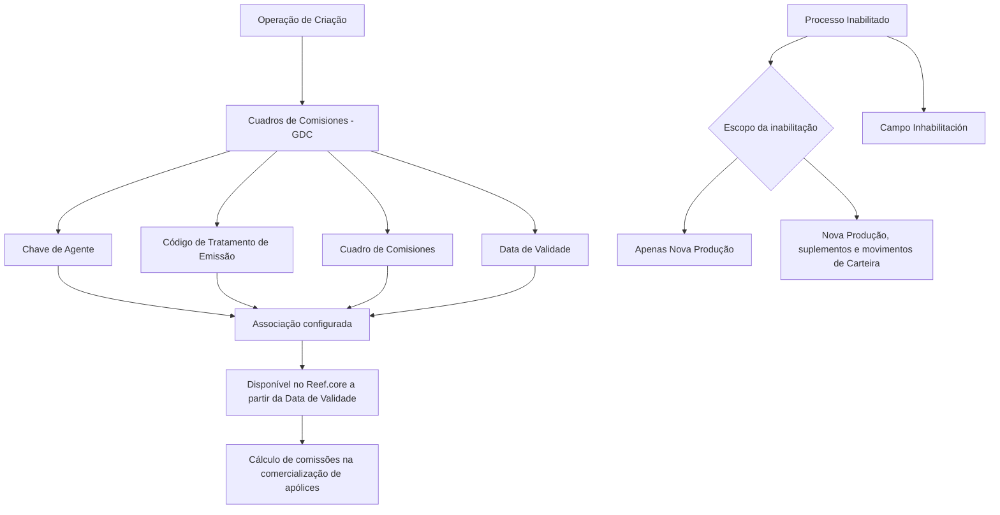

# Criação de Quadros de Comissões para Agentes no Reef.core

## 1. Metadados do Documento
- **Arquivo de Origem:** Não identificado no conteúdo extraído
- **Tipo de Documento:** Manual Operacional
- **Domínio / Sistema:** Reef.core — Cuadros de Comisiones (GDC)
- **Público-Alvo:** Usuários responsáveis pela configuração de agentes e comissões
- **Data/Versão Identificada:** Não identificada

---

## 2. Resumo Executivo & Contexto de Negócio

O documento descreve a operação de criação de associações entre um agente, um Código de Tratamento de Emissão e um Quadro de Comissões no sistema Reef.core. O objetivo explícito é registrar quais Quadros de Comissões podem ser empregados por determinado agente para calcular comissões na comercialização de suas apólices.

A configuração é realizada no bloco de informação **Cuadros de Comisiones (GDC)**, cujo preenchimento segue uma sequência definida: da esquerda para a direita e de cima para baixo. Os atributos principais identificam o intermediário, o tratamento de emissão aplicável e o quadro de comissões configurado na entidade.

O documento também define mecanismos de inabilitação. A inabilitação pode afetar exclusivamente apólices de Nova Produção ou abranger também movimentos de Nova Produção, suplementos emitidos sobre essas apólices e movimentos de Carteira. Entretanto, o próprio documento estabelece que o campo de inabilitação não faz sentido na operação de criação.

A data de validade controla o momento a partir do qual a associação entre agente, tratamento e quadro de comissões fica disponível para uso no sistema. Esse campo permite preservar o histórico de alterações efetuadas nas definições configuradas.

---

## 3. Arquitetura, Componentes & Tecnologias Envolvidas

Os componentes e conceitos identificados no documento são:

| Componente / Conceito | Função descrita |
| :--- | :--- |
| **Reef.core** | Sistema no qual são configurados tratamentos de emissão, quadros de comissões e associações aplicáveis aos agentes. |
| **Cuadros de Comisiones (GDC)** | Bloco de informação usado para registrar a relação de Quadros de Comissões que podem ser empregados por um agente. |
| **Agente / Intermediário** | Entidade identificada por uma chave previamente definida no sistema. |
| **Código de Tratamento de Emissão** | Chave de um Tratamento de Emissão existente na Estrutura de Produtos da entidade no Reef.core. |
| **Cuadro de Comisiones** | Chave de um Quadro de Comissões configurado na entidade. |
| **Data de Validade** | Data a partir da qual a associação configurada fica disponível para utilização no sistema. |
| **Nova Produção** | Comissões percebidas exclusivamente durante o primeiro ano de vigência da apólice. |
| **Carteira** | Comissões associadas a apólices vigentes em anos sucessivos, existentes enquanto as apólices mantiverem vigência. |



**Nota de Análise:** o conteúdo extraído não apresenta detalhes de arquitetura de infraestrutura, protocolos de integração, métodos HTTP, contratos JSON, bancos de dados, servidores, URLs de ambiente ou tecnologias de implementação.

---

## 4. Regras de Negócio, Especificações Funcionais & Processos

### 4.1 Objetivo da operação

A operação de criação registra a relação de Quadros de Comissões que podem ser usados por um agente no cálculo de comissões relacionadas à comercialização de suas apólices.

### 4.2 Sequência de captura

No bloco de informação **Cuadros de Comisiones (GDC)**, os atributos devem seguir a sequência de preenchimento definida no documento:

1. Da esquerda para a direita.
2. De cima para baixo.

### 4.3 Identificação do agente

A **Chave de Agente** identifica a chave do intermediário conforme definição realizada previamente no sistema.

### 4.4 Tratamento de emissão

O **Código de Tratamento de Emissão** deve conter uma das chaves dos Tratamentos de Emissão existentes na Estrutura de Produtos da entidade no Reef.core.

### 4.5 Quadro de comissões

O atributo **Cuadro de Comisiones** identifica uma das chaves dos Quadros de Comissões configurados na entidade.

### 4.6 Inabilitação do quadro de comissões

O campo **Proceso Inhabilitado** determina o impacto da inabilitação do Quadro de Comissões associado ao agente e ao tratamento de emissão definido.

A inabilitação pode ter os seguintes alcances:

1. Afetar somente as apólices de **Nova Produção**.
2. Afetar os movimentos de **Nova Produção**, os suplementos emitidos sobre essas apólices e os **Movimentos de Carteira**.

O campo **Inhabilitación** representa a marcação que indica que o Quadro de Comissões do agente, para o tratamento definido, está inabilitado para uso. Essa marcação deve ser coerente com o valor informado em **Proceso Inhabilitado**.

### 4.7 Restrição específica da operação de criação

Na operação de criação, o documento declara expressamente que o uso do campo **Inhabilitación** não faz sentido.

### 4.8 Data de validade e histórico

A **Fecha de Validez** estabelece a data a partir da qual a associação entre:

- o agente;
- o Código de Tratamento de Emissão; e
- o Quadro de Comissões

fica disponível no sistema para utilização.

O uso correto da Data de Validade permite manter o histórico das alterações realizadas nas definições configuradas.

### 4.9 Definições funcionais de comissões

| Tipo de comissão | Definição |
| :--- | :--- |
| **Comissões de Nova Produção** | Comissões percebidas exclusivamente durante o primeiro ano de vigência da apólice. Em geral, são de valor mais elevado para estimular a captação de novas operações. |
| **Comissões de Carteira** | Comissões originadas na carteira de quem as recebe, associadas a apólices vigentes em anos sucessivos. Existem enquanto as apólices subscritas por meio da gestão comercial do agente permanecerem vigentes. |

---

## 5. Tabelas de Parâmetros, Ambientes e Estruturas de Dados

| Item / Parâmetro | Descrição / Função | Tipo / Valores / Formato | Ambiente / Observações |
| :--- | :--- | :--- | :--- |
| **Clave de Agente** | Identifica a chave do intermediário. | Chave de agente previamente definida no sistema. | Aplicável ao bloco Cuadros de Comisiones. |
| **Código de Tratamento de Emissão** | Identifica o Tratamento de Emissão associado ao agente e ao Quadro de Comissões. | Uma chave de Tratamento de Emissão existente. | O tratamento deve existir na Estrutura de Produtos da entidade no Reef.core. |
| **Cuadro de Comisiones** | Identifica o Quadro de Comissões associado. | Uma chave de Quadro de Comissões configurado. | O quadro deve estar configurado na entidade. |
| **Proceso Inhabilitado** | Define o escopo da inabilitação do Quadro de Comissões do agente para o tratamento de emissão definido. | Nova Produção somente; ou Nova Produção, suplementos e Movimentos de Carteira. | Deve ser coerente com a marcação de Inhabilitación. |
| **Inhabilitación** | Indica que o Quadro de Comissões do agente, para o tratamento definido, está inabilitado para uso. | Campo de marcação/check. | Não faz sentido utilizá-lo na operação de criação. |
| **Fecha de Validez** | Define quando a associação entre agente, tratamento e quadro de comissões estará disponível para utilização. | Data. | Permite histórico de mudanças nas definições configuradas. |
| **Cuadros de Comisiones (GDC)** | Bloco de informação utilizado para a configuração apresentada. | Bloco funcional do sistema. | A sequência de captura é da esquerda para a direita e de cima para baixo. |
| **Nova Produção** | Classificação temporal das comissões durante a emissão. | Primeiro ano de vigência da apólice. | Pode ser afetada isoladamente por uma inabilitação. |
| **Carteira** | Classificação de comissões originadas em apólices vigentes nos anos subsequentes. | Vigência continuada da apólice. | Pode ser afetada juntamente com Nova Produção e suplementos. |

**Nota de Análise:** o documento não apresenta parâmetros de infraestrutura, identificadores de ambientes, nomes de servidores, portas, diretórios de log ou URLs.

---

## 6. Bateria de Perguntas & Respostas para RAG (FAQ Sintético)

### P1: Qual é o objetivo da operação de criação de Cuadros de Comisiones para um agente?
**R:** A operação de criação registra a relação de Quadros de Comissões que podem ser empregados por um agente para calcular comissões na comercialização de suas apólices.

### P2: Qual bloco de informação deve ser utilizado para configurar a relação de quadros de comissões de um agente?
**R:** A configuração é realizada no bloco de informação **Cuadros de Comisiones (GDC)**.

### P3: Qual é a ordem de preenchimento dos atributos no bloco Cuadros de Comisiones?
**R:** O documento determina que os atributos do bloco Cuadros de Comisiones devem ser capturados da esquerda para a direita e de cima para baixo.

### P4: O que a Chave de Agente representa no Reef.core?
**R:** A Chave de Agente identifica a chave do intermediário segundo a definição previamente realizada no sistema.

### P5: Que valor pode ser informado no Código de Tratamento de Emissão?
**R:** O Código de Tratamento de Emissão deve conter uma das chaves dos Tratamentos de Emissão existentes na Estrutura de Produtos da entidade no Reef.core.

### P6: O que o atributo Cuadro de Comisiones identifica?
**R:** O atributo Cuadro de Comisiones identifica uma das chaves dos Quadros de Comissões configurados na entidade.

### P7: O que o campo Proceso Inhabilitado controla?
**R:** O campo Proceso Inhabilitado define se a inabilitação do Quadro de Comissões do agente, para o tratamento de emissão informado, afeta somente apólices de Nova Produção ou também movimentos de Nova Produção, suplementos emitidos sobre essas apólices e Movimentos de Carteira.

### P8: O que significa marcar o campo Inhabilitación?
**R:** A marcação de Inhabilitación indica que o Quadro de Comissões do agente, para o Tratamento de Emissão definido, está inabilitado para ser utilizado. A marcação deve ser coerente com o valor informado no campo Proceso Inhabilitado.

### P9: O campo Inhabilitación deve ser usado durante a operação de criação?
**R:** Não. O documento afirma expressamente que, na operação de criação, não faz sentido utilizar o campo Inhabilitación.

### P10: Qual é a função da Fecha de Validez na associação entre agente, tratamento e quadro de comissões?
**R:** A Fecha de Validez determina a data a partir da qual a associação entre o agente, o Código de Tratamento de Emissão e o Quadro de Comissões fica disponível no sistema para uso.

### P11: Como a Fecha de Validez contribui para o histórico de configurações?
**R:** O uso correto da Fecha de Validez permite manter um histórico das alterações efetuadas nas definições configuradas, pois controla a disponibilidade temporal de cada associação.

### P12: O que são comissões de Nova Produção no Reef.core?
**R:** Comissões de Nova Produção são aquelas percebidas exclusivamente durante o primeiro ano de vigência da apólice. O documento indica que normalmente possuem valor mais elevado para estimular a captação de novas operações.

### P13: O que são comissões de Carteira no Reef.core?
**R:** Comissões de Carteira têm origem na carteira de quem as recebe, ou seja, em apólices vigentes nos anos subsequentes. Essas comissões existem enquanto permanecerem vigentes as apólices subscritas mediante a gestão comercial do agente.

---

## 7. Glossário de Termos, Siglas & Conceitos-Chave

- **Reef.core:** Sistema citado como local da configuração de Tratamentos de Emissão, Quadros de Comissões e respectivas associações.
- **GDC:** Sigla apresentada entre parênteses em **Cuadros de Comisiones (GDC)**. O conteúdo não expande formalmente a sigla.
- **Agente:** Entidade para a qual são registrados Quadros de Comissões utilizáveis no cálculo de comissões.
- **Intermediário:** Termo usado para a entidade identificada pela Chave de Agente.
- **Código de Tratamento de Emissão:** Chave de um Tratamento de Emissão existente na Estrutura de Produtos da entidade.
- **Tratamento de Emissão:** Configuração existente na Estrutura de Produtos da entidade no Reef.core.
- **Cuadro de Comisiones / Quadro de Comissões:** Configuração de comissão identificada por uma chave e associável a um agente.
- **Nova Produção:** Comissões recebidas exclusivamente no primeiro ano de vigência da apólice.
- **Carteira:** Comissões vinculadas a apólices vigentes em anos sucessivos.
- **Movimentos de Nova Produção:** Movimentos relacionados às apólices de Nova Produção; o documento não detalha sua natureza operacional.
- **Movimentos de Carteira:** Movimentos associados à Carteira; o documento não detalha sua natureza operacional.
- **Suplementos:** Emissões realizadas sobre apólices de Nova Produção; o documento não detalha seus tipos ou regras de processamento.
- **Fecha de Validez / Data de Validade:** Data a partir da qual a associação configurada fica disponível para utilização no sistema.
- **Inhabilitación / Inabilitação:** Marcação que indica indisponibilidade de um Quadro de Comissões para um agente e tratamento definidos.
- **Proceso Inhabilitado / Processo Inabilitado:** Campo que define o alcance da inabilitação.

---

## 8. Notas Críticas, Riscos & Limitações

- O documento não identifica o nome do arquivo de origem, data de publicação, versão, autor técnico ou responsável pelo processo.
- O conteúdo não apresenta detalhes sobre validações de formato, obrigatoriedade, tamanho ou domínio técnico dos campos.
- O documento não especifica como criar, consultar, alterar ou excluir Tratamentos de Emissão e Quadros de Comissões.
- Não foram descritos contratos de integração, APIs, métodos HTTP, eventos, bancos de dados, filas, URLs, servidores, credenciais ou rotas de logs.
- Os termos **Movimentos de Nova Produção**, **Movimentos de Carteira** e **suplementos** são citados, mas não recebem detalhamento funcional adicional.
- O campo **Inhabilitación** é descrito, porém o documento restringe seu uso na operação de criação ao afirmar que não faz sentido empregá-lo nessa operação.
- **Nota de Análise:** o documento lista o bloco **Cuadros de Comisiones (GDC)**, mas não detalha telas, permissões, mensagens de erro, mecanismos de persistência ou efeitos posteriores da configuração no cálculo efetivo das comissões.

---

## 9. Conteúdo Bruto Estruturado (Referência Fiel)

```text
--- [PÁGINA 1 DE 2] ---

CREAR Cuadros de Comisiones para el Agente
Objetivo
Registrar la relación de Cuadros de Comisiones que pueden ser empleados por el Agente para el cálculo de las comisiones en la
comercialización de sus pólizas.
Acciones habilitadas
 CREAR ( )
Cuadros de Comisiones (GDC)
Cuadros de Comisiones
De Izquierda a Derecha y de Arriba hacia Abajo, los siguientes atributos marcan la secuencia de captura en este Bloque de Información.
Clave de Agente
Esta propiedad identica la clave del intermediario de acuerdo con la denición de las mismas previamente realizada en el Sistema.
Código de Tratamiento de Emisión (  )
Este atributo ha de contener una de las claves de los Tratamientos de Emisión de Reef.core existentes en la Estructura de Productos de la
Entidad.
Cuadro de Comisiones (  )
Este atributo identica en el sistema una de las claves de los Cuadros de Comisiones congurados en la entidad.
Proceso Inhabilitado ( )
Este campo establece si la inhabilitación del Cuadro de Comisiones del Agente para el tratamiento de emisión denido va a afectar
únicamente a las pólizas de Nueva Producción o afecta tanto a los Movimientos de Nueva Producción como a los suplementos emitidos
sobre ellas o Movimientos de Cartera.
Inhabilitación ( )
El Check sobre este campo implica que el Cuadro de Comisiones del Agente y para el Tratamiento denido está inhabilitado para poder ser
empleado (en coherencia con el valor del Proceso Inhabilitado que se haya indicado)
En la OPERACIÓN de CREACIÓN no tiene sentido su empleo.
Documentation / DOCUMENTACIÓN Reef
DOCUMENTACIÓN Reef
Mapfredocument
DOCUMENTACIÓN Reef
Owner
user:agonzalez_mapfre.com
Lifecycle
Approved Source
 / 
 VL
Buscar Inicio Soluciones Arquitecturas APIs Componentes Cloud Documentación Zeus Reef Ayuda
ES


--- [PÁGINA 2 DE 2] ---

Fecha de Validez ( )
Esta propiedad establece la fecha a partir de la cual la asociación del Agente al Código del Tratamiento y al Cuadro de Comisiones está
disponible en el sistema para ser utilizada por lo que su correcto uso permite tener un histórico de los cambios efectuados en las
deniciones conguradas.
Preguntas frecuentes
(1) ¿Qué implican en Reef.core los Términos Nueva Producción y Cartera?
Atendiendo al momento temporal en el que se generan las comisiones en el proceso de emisión, puede establecerse la siguiente
clasicación:
Las Comisiones de nueva producción son aquellas que se perciben exclusivamente durante el primer año de vigencia de la póliza.
Generalmente y a n de estimular la labor de captación de nuevas operaciones, este tipo de comisión suele ser de importe más elevado que
la de cartera.
Las Comisiones de cartera en cambio tienen su origen en la cartera de quien la percibe (pólizas vigentes en años sucesivos) y son
comisiones que existen mientras tengan vigencia las pólizas suscritas a través de la gestión comercial del agente.
```
