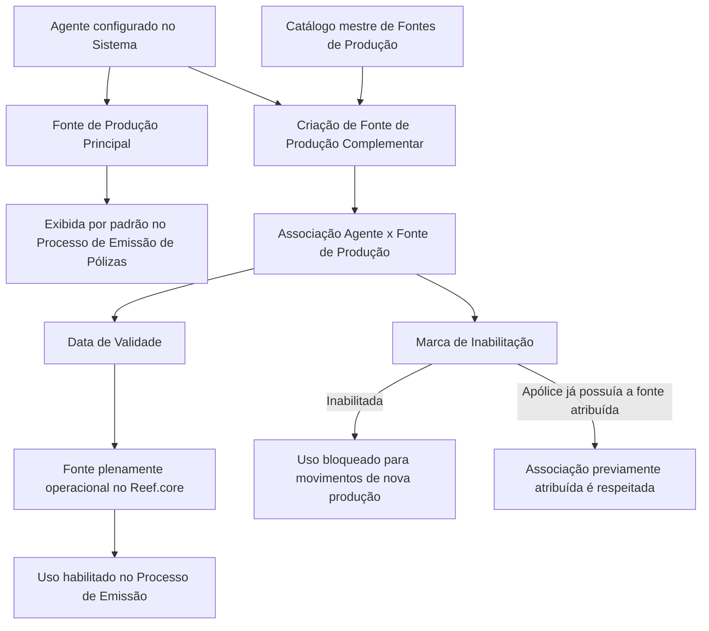

# Criação de Fontes de Produção Complementares para Agentes no Reef.core

## 1. Metadados do Documento
- **Arquivo de Origem:** `Não identificado — conteúdo bruto fornecido na solicitação`
- **Tipo de Documento:** `Procedimento`
- **Domínio / Sistema:** `Reef.core / Fontes de Produção / Processo de Emissão de Pólizas`
- **Público-Alvo:** `Operação, usuários responsáveis pela configuração de Agentes`
- **Data/Versão Identificada:** `Não identificada`
- **Status de Ciclo de Vida Identificado:** `Approved`
- **Proprietário Identificado:** `user:agonzalez_mapfre.com`

---

## 2. Resumo Executivo & Contexto de Negócio

O documento descreve o procedimento para criar Fontes de Produção complementares associadas a Agentes configurados no sistema Reef.core. Cada Agente possui habitualmente uma Fonte de Produção principal, pertencente à estrutura de canais da Companhia e utilizada com maior frequência pelo Agente.

A Fonte de Produção principal é apresentada por padrão durante o Processo de Emissão de Pólizas. O objetivo funcional do procedimento é registrar outras Fontes de Produção, denominadas complementares, pelas quais o Agente também pode comercializar apólices.

O cadastro de uma Fonte de Produção complementar depende de valores existentes no catálogo mestre de Fontes de Produção do sistema. Para cada associação entre Agente e Fonte de Produção, o procedimento prevê a captura da Fonte de Produção, da data a partir da qual a associação se torna operacional e de uma marca de inabilitação.

Quando uma Fonte de Produção associada ao Agente é inabilitada, ela deixa de poder ser utilizada no Processo de Emissão para movimentos de nova produção. Entretanto, a inabilitação não altera apólices que já possuíam essa Fonte de Produção previamente atribuída.

---

## 3. Arquitetura, Componentes & Tecnologias Envolvidas

Os componentes e conceitos explicitamente mencionados são:

- **Reef.core:** sistema no qual a data de validade e o estado de habilitação da Fonte de Produção associada ao Agente são administrados.
- **Agente:** entidade configurada no sistema e associada a uma Fonte de Produção principal e, opcionalmente, a Fontes de Produção complementares.
- **Fonte de Produção principal:** Fonte de Produção da estrutura de canais da Companhia habitualmente mais utilizada pelo Agente.
- **Fontes de Produção complementares:** Fontes adicionais que permitem ao Agente comercializar apólices.
- **Catálogo mestre de Fontes de Produção:** origem dos valores permitidos para o campo Fonte de Produção.
- **Processo de Emissão de Pólizas:** processo no qual a Fonte de Produção principal é exibida por padrão e no qual as fontes inabilitadas não podem ser usadas para nova produção.
- **Ação habilitada:** `CREAR`.



> **Nota de Análise:** o conteúdo não detalha interfaces, métodos HTTP, contratos JSON, banco de dados, integrações externas, autenticação ou tecnologia de implementação do Reef.core.

---

## 4. Regras de Negócio, Especificações Funcionais & Processos

### 4.1 Associação padrão de Fonte de Produção

1. Todos os Agentes configurados no sistema possuem uma Fonte de Produção atribuída.
2. A Fonte de Produção atribuída representa a Fonte de Produção da estrutura de canais da Companhia habitualmente mais utilizada pelo Agente.
3. Essa Fonte de Produção é a Fonte de Produção principal do Agente.
4. A Fonte de Produção principal é apresentada por padrão no Processo de Emissão de Pólizas.

### 4.2 Objetivo do cadastro complementar

1. O processo permite registrar a relação entre Fontes de Produção complementares e a Fonte de Produção principal.
2. As Fontes de Produção complementares representam canais pelos quais o Agente pode comercializar apólices.
3. A ação habilitada para o processo é `CREAR`.

### 4.3 Sequência de captura

O documento determina que a sequência de captura dos atributos no bloco de informações deve ser realizada da esquerda para a direita e de cima para baixo.

A sequência de atributos indicada é:

1. **Fonte de Produção**
2. **Data de Validade**
3. **Inabilitação**

### 4.4 Regras para o campo Fonte de Produção

1. O campo deve conter uma das Fontes de Produção associadas ao Agente.
2. Os valores disponíveis devem obedecer à relação de valores existente no catálogo mestre de Fontes de Produção do sistema.
3. O documento não informa o formato técnico, a chave, a obrigatoriedade explícita ou o mecanismo de seleção do campo.

### 4.5 Regras para o campo Data de Validade

1. No Reef.core, a Data de Validade contém a data a partir da qual a Fonte de Produção associada ao Agente está plenamente operacional.
2. A partir da Data de Validade, a Fonte de Produção é habilitada para uso no Processo de Emissão.
3. O documento não especifica formato de data, fuso horário, comportamento para datas futuras ou regra de validação cronológica.

### 4.6 Regras para o campo Inabilitação

1. O campo Inabilitação indica que a Fonte de Produção associada ao Agente está inabilitada no sistema.
2. Uma Fonte de Produção inabilitada não pode ser utilizada no Processo de Emissão para movimentos de nova produção.
3. A inabilitação respeita as apólices que já tinham a Fonte de Produção previamente atribuída.
4. O documento não define valores possíveis para a marca de Inabilitação, nem esclarece se o campo é booleano, textual ou baseado em lista de valores.

---

## 5. Tabelas de Parâmetros, Ambientes e Estruturas de Dados

| Item / Parâmetro | Descrição / Função | Tipo / Valores / Formato | Ambiente / Observações |
| :--- | :--- | :--- | :--- |
| Agente | Entidade configurada no sistema e associada a Fontes de Produção. | Não especificado. | Todos os Agentes configurados possuem uma Fonte de Produção atribuída. |
| Fonte de Produção principal | Fonte da estrutura de canais da Companhia habitualmente mais utilizada pelo Agente. | Não especificado. | Exibida por padrão no Processo de Emissão de Pólizas. |
| Fonte de Produção complementar | Fonte adicional associada ao Agente pela qual o Agente pode comercializar apólices. | Deve ser um valor existente no catálogo mestre de Fontes de Produção. | Registrada por meio da ação `CREAR`. |
| Fonte de Produção | Campo de captura para selecionar uma Fonte de Produção associada ao Agente. | Uma das Fontes de Produção disponíveis no catálogo mestre. | Primeiro atributo da sequência de captura. |
| Data de Validade | Data a partir da qual a Fonte de Produção associada ao Agente está plenamente operacional. | Data; formato não especificado. | No Reef.core, habilita o uso da Fonte de Produção no Processo de Emissão. |
| Inabilitação | Marca que indica que a Fonte de Produção associada ao Agente está inabilitada. | Não especificado. | Impede uso em nova produção; preserva apólices com atribuição prévia. |
| Catálogo mestre de Fontes de Produção | Catálogo que contém a relação de valores permitidos para o campo Fonte de Produção. | Não especificado. | Referência para associação de Fontes de Produção ao Agente. |
| Processo de Emissão de Pólizas | Processo operacional que utiliza as Fontes de Produção. | Processo; detalhes não especificados. | Exibe a fonte principal por padrão e bloqueia fontes inabilitadas para nova produção. |
| Ação habilitada | Ação disponível no procedimento documentado. | `CREAR` | O documento não descreve ações de alteração, consulta ou exclusão. |
| Sistema | Sistema citado para gestão da validade operacional da associação. | `Reef.core` | O documento também menciona “Sistema” de forma genérica. |
| Owner | Proprietário identificado no cabeçalho ou rodapé documental. | `user:agonzalez_mapfre.com` | Valor extraído literalmente. |
| Lifecycle | Estado de ciclo de vida identificado no documento. | `Approved` | Valor extraído literalmente. |

---

## 6. Bateria de Perguntas & Respostas para RAG (FAQ Sintético)

### P1: Qual é o objetivo do procedimento de criação de Fontes de Produção para Agentes?
**R:** O objetivo é registrar Fontes de Produção complementares relacionadas à Fonte de Produção principal de um Agente. Essas Fontes de Produção complementares representam canais adicionais pelos quais o Agente pode comercializar apólices.

### P2: O que é a Fonte de Produção principal de um Agente?
**R:** A Fonte de Produção principal é a Fonte de Produção da estrutura de canais da Companhia habitualmente mais utilizada pelo Agente. Todos os Agentes configurados no sistema possuem uma Fonte de Produção atribuída nessa condição.

### P3: Onde a Fonte de Produção principal é usada por padrão?
**R:** A Fonte de Produção principal é exibida por padrão no Processo de Emissão de Pólizas.

### P4: Qual ação está habilitada no procedimento documentado?
**R:** A ação habilitada explicitamente no documento é `CREAR`. O conteúdo não descreve ações de edição, consulta, exclusão ou aprovação de Fontes de Produção complementares.

### P5: De onde vêm os valores permitidos para o campo Fonte de Produção?
**R:** O campo Fonte de Produção deve conter uma das Fontes de Produção associadas ao Agente, de acordo com a relação de valores existente no catálogo mestre de Fontes de Produção do sistema.

### P6: Qual é a sequência de preenchimento dos campos no bloco de informações?
**R:** Os atributos devem ser capturados da esquerda para a direita e de cima para baixo. A sequência indicada é: Fonte de Produção, Data de Validade e Inabilitação.

### P7: O que significa a Data de Validade de uma Fonte de Produção no Reef.core?
**R:** No Reef.core, a Data de Validade informa a data a partir da qual a Fonte de Produção associada ao Agente está plenamente operacional. A partir dessa data, o uso da Fonte de Produção é habilitado no Processo de Emissão.

### P8: O que acontece quando uma Fonte de Produção associada ao Agente é inabilitada?
**R:** Quando a Fonte de Produção associada ao Agente é marcada como inabilitada, ela fica inabilitada no sistema e não pode ser utilizada no Processo de Emissão para movimentos de nova produção.

### P9: A inabilitação de uma Fonte de Produção altera apólices já emitidas?
**R:** Não. O documento determina que as apólices que já tinham a Fonte de Produção previamente atribuída devem ser respeitadas. A restrição de uso decorrente da inabilitação aplica-se aos movimentos de nova produção.

### P10: O documento especifica o formato da Data de Validade?
**R:** Não. O documento informa apenas que a Data de Validade determina a partir de quando a Fonte de Produção está plenamente operacional e habilitada para o Processo de Emissão. O formato da data não é detalhado.

### P11: O documento define os valores ou o tipo técnico do campo Inabilitação?
**R:** Não. O documento explica o efeito funcional da Inabilitação, mas não informa se o campo é booleano, uma lista de valores, um indicador textual ou outro formato técnico.

### P12: O documento detalha APIs, contratos de integração ou métodos HTTP do Reef.core?
**R:** Não. O conteúdo fornecido descreve regras funcionais para associação de Fontes de Produção a Agentes, mas não detalha APIs, métodos HTTP, contratos JSON, banco de dados ou integrações técnicas.

---

## 7. Glossário de Termos, Siglas & Conceitos-Chave

- **Agente:** entidade configurada no sistema que possui uma Fonte de Produção principal e pode ter Fontes de Produção complementares associadas.
- **Catálogo mestre de Fontes de Produção:** catálogo existente no sistema que contém a relação de valores usada para o campo Fonte de Produção.
- **Data de Validade:** data a partir da qual uma Fonte de Produção associada ao Agente está plenamente operacional no Reef.core.
- **Fonte de Produção:** elemento da estrutura de canais da Companhia associado a um Agente e utilizado no Processo de Emissão de Pólizas.
- **Fonte de Produção complementar:** Fonte de Produção adicional vinculada ao Agente, pela qual o Agente pode comercializar apólices.
- **Fonte de Produção principal:** Fonte de Produção habitualmente mais utilizada pelo Agente e apresentada por padrão no Processo de Emissão de Pólizas.
- **Inabilitação:** marca que impede o uso da Fonte de Produção associada ao Agente em movimentos de nova produção.
- **Movimentos de nova produção:** movimentos no Processo de Emissão para os quais uma Fonte de Produção inabilitada não pode ser utilizada.
- **Processo de Emissão de Pólizas:** processo no qual a Fonte de Produção principal é exibida por padrão e no qual é controlado o uso de Fontes de Produção inabilitadas.
- **Reef.core:** sistema citado como responsável pelo comportamento da Data de Validade da Fonte de Produção associada ao Agente.

---

## 8. Notas Críticas, Riscos & Limitações

- O documento não identifica o nome do arquivo de origem, a data de publicação, a versão ou o autor formal.
- O conteúdo não informa se a Fonte de Produção complementar exige aprovação, validação adicional ou permissões específicas.
- O documento não descreve o formato técnico dos campos Fonte de Produção, Data de Validade e Inabilitação.
- Não há detalhamento sobre comportamento para Data de Validade futura, data retroativa, data ausente ou conflito entre associações.
- Não há descrição de mensagens de erro, regras de obrigatoriedade de campos, trilha de auditoria ou critérios de exclusão.
- Não são informados métodos HTTP, contratos JSON, URLs, ambientes, servidores, portas, banco de dados ou integrações externas.
- O conteúdo indica somente a ação `CREAR`; não há confirmação de capacidades de alteração, consulta, exclusão ou reabilitação.
- A regra de preservação de apólices anteriormente associadas à Fonte de Produção inabilitada deve ser considerada em qualquer operação que afete nova produção.
- **Nota de Análise:** o documento lista o sistema Reef.core, mas não detalha a arquitetura técnica, os módulos internos ou as interfaces expostas pelo sistema.

---

## 9. Conteúdo Bruto Estruturado (Referência Fiel)

```text
--- [PÁGINA 1 DE 1] ---

CREAR Fuentes de Producción para el Agente

Contexto

Todos y cada uno de los Agentes configurados en el Sistema tienen asignada la Fuente de Producción de la Estructura de Canales de la
Compañía habitualmente más utilizada por el Agente.

Esta Fuente de Producción se mostrará por defecto en el Proceso de Emisión de Pólizas.

Objetivo

Registrar la relación de Fuentes de Producción Complementarias a la Fuente de Producción Principal a través de las cuales el Agente puede
comercializar sus pólizas.

Acciones habilitadas

 CREAR ( )

Fuentes de Producción

Fuentes de Producción

De Izquierda a Derecha y de Arriba hacia Abajo, los siguientes atributos marcan la secuencia de captura en este Bloque de Información.

Fuente de Producción (  )

Este Campo contendrá Una de las Fuentes de Producción que el Agente tendrá asociadas de acuerdo con la relación de valores existentes en
el catálogo maestro de Fuentes de Producción existente en el Sistema.

Fecha de Validez ( )

El valor de este campo en Reef.core contiene la fecha a partir de la cual la Fuente de Producción asociada al Agente está plenamente
operativa y se habilita por tanto su uso en el Proceso de Emisión.

Inhabilitación ( )

Este Campo marca que la Fuente de Producción asociada al Agente está inhabilitada en el Sistema y por tanto se inhabilita su uso en el
Proceso de Emisión para los movimientos de nueva producción (respetándose en cambio en aquellas pólizas que la tuvieran previamente
asignada).

Documentation / DOCUMENTACIÓN Reef
DOCUMENTACIÓN Reef
Mapfredocument
DOCUMENTACIÓN Reef
Owner
user:agonzalez_mapfre.com
Lifecycle
Approved Source
 / 
 VL
Buscar Inicio Soluciones Arquitecturas APIs Componentes Cloud Documentación Zeus Reef Ayuda
ES
```
