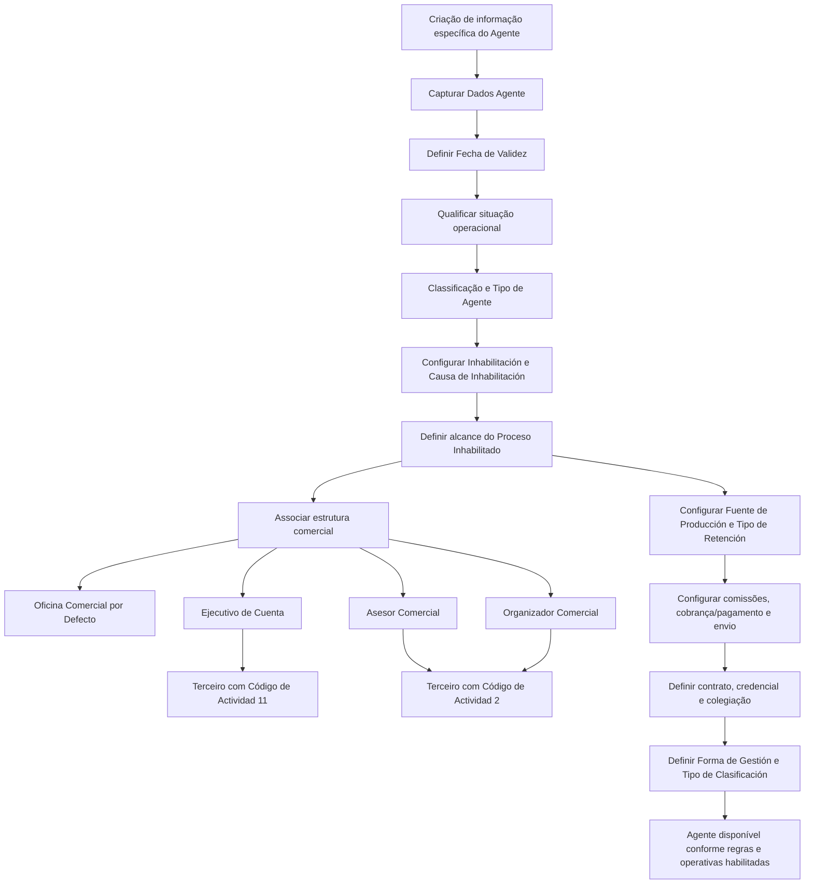
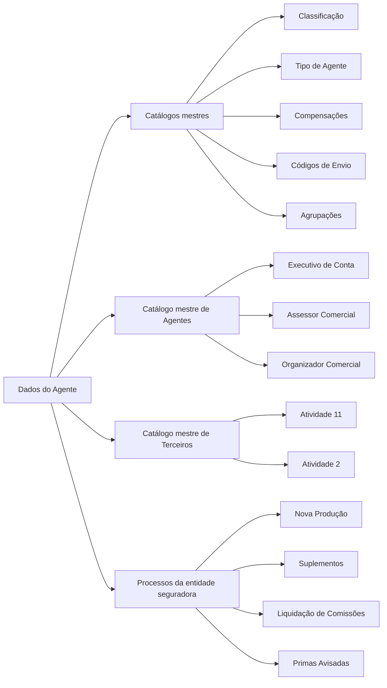

# Criação de Informação Específica do Agente — Dados Operacionais, Classificação e Habilitações no Reef

## 1. Metadados do Documento
- **Arquivo de Origem:** `Não identificado no conteúdo fornecido`
- **Tipo de Documento:** Manual Operacional / Especificação Funcional
- **Domínio / Sistema:** Reef / entidade seguradora / gestão de Agentes e Intermediários
- **Público-Alvo:** Desenvolvedores, Arquitetos, Operação, Negócio e áreas Comercial e de Clientes
- **Data/Versão Identificada:** Não identificada
- **Owner identificado no conteúdo:** `user:agonzalez_mapfre.com`
- **Lifecycle identificado no conteúdo:** Approved

---

## 2. Resumo Executivo & Contexto de Negócio

O documento descreve a estrutura funcional para **criar e capturar informação específica de um Agente** no sistema Reef. O propósito central é identificar, detalhar e classificar a informação operacional do Agente para que a entidade seguradora possa considerar essa informação nos processos corporativos que a demandem.

A estrutura de Dados do Agente cobre atributos de vigência, situação, classificação, inabilitação, relacionamento comercial, contratos, credenciais profissionais, comissões, cobrança/pagamento, entrega de documentação e agrupamentos comerciais. Os atributos devem ser capturados seguindo a sequência de esquerda para direita e de cima para baixo. Quando não houver indicação expressa em contrário, os atributos aplicam-se tanto a Pessoas Físicas quanto a Pessoas Jurídicas.

A informação permite manter um histórico das alterações realizadas na configuração e nos dados dos Agentes. A **Fecha de Validez** determina a data a partir da qual o Agente fica plenamente operativo no sistema, sendo fundamental para a rastreabilidade temporal da configuração operacional.

O documento também define regras de elegibilidade para processos relevantes, incluindo comercialização de Nova Produção, suplementos de carteira, pagamento de liquidação de comissões, operação de Primas Avisadas e capacidade de cobrança de prémios. Parte dos valores deve obrigatoriamente ser selecionada em catálogos mestres configurados no sistema ou localmente pela entidade seguradora.

A especificação não apresenta detalhes técnicos de implementação, tais como APIs, métodos HTTP, contratos JSON, persistência, endpoints, integrações, perfis de acesso, campos obrigatórios, formatos de data ou validações de interface. A documentação é predominantemente funcional e orientada ao cadastro e à governança operacional do Agente.

---

## 3. Arquitetura, Componentes & Tecnologias Envolvidas

### Componentes e conceitos identificados

| Componente / Conceito | Papel descrito no documento |
| :--- | :--- |
| **Reef** | Sistema/documentação no qual está definida a estrutura de criação de informação específica do Agente. |
| **Dados Agente** | Estrutura de atributos para identificar, classificar, habilitar e relacionar operacionalmente um Agente. |
| **Entidade Seguradora** | Organização que configura catálogos, diretrizes e processos operacionais aplicáveis ao Agente. |
| **Catálogos mestres do Sistema** | Fonte de valores para classificações, causas de inabilitação, tipos de intermediários, escritórios comerciais, compensações, qualidade, envio, agrupamentos e outros atributos. |
| **Catálogo mestre de Agentes** | Fonte de relacionamento para Executivo de Conta, Assessor Comercial e Organizador Comercial. |
| **Catálogo mestre de Terceiros** | Deve conter o Executivo de Conta com Código de Atividade 11 e o Assessor Comercial/Organizador Comercial com Código de Atividade 2. |
| **Estrutura comercial da Companhia** | Origem das Oficinas Comerciais previamente definidas e atribuíveis por padrão ao Agente. |
| **Catálogo de Fuentes de Producción** | Define a Fuente de Producción por Defecto configurada localmente. |
| **Catálogo de Tipos de Retención** | Define os tipos de retenção configurados localmente pela entidade seguradora. |
| **Catálogo de Compensaciones** | Define as Formas de Cobro/Pago disponíveis para o Agente. |
| **Catálogo de Códigos de Calidad** | Define a classificação qualitativa do Agente. |
| **Catálogo de Códigos de Envío** | Define o método de envio da documentação ao Agente. |
| **Catálogo de Agrupaciones** | Define a Agrupación Comercial associada ao Agente. |
| **Nova Produção** | Operação comercial que pode ser bloqueada por inabilitação do Agente. |
| **Suplementos** | Operação sobre a carteira de pólizas e aplicações que também pode ser afetada pela inabilitação. |
| **Liquidação de Comissões** | Processo de pagamento do qual o Agente pode ser excluído por razões comerciais. |
| **Primas Avisadas** | Conceito cuja operação depende de estar ativo na entidade seguradora e da qualificação do Agente. |

### Fluxo funcional de configuração do Agente



### Dependências funcionais entre cadastros e processos



> **Nota de Análise:** O documento descreve relações funcionais entre Dados do Agente, catálogos mestres e processos seguradores, mas não detalha arquitetura técnica, persistência, mecanismos de integração, APIs, eventos ou contratos de dados.

---

## 4. Regras de Negócio, Especificações Funcionais & Processos

### 4.1 Objetivo da estrutura de Dados do Agente

A captura da informação nesta estrutura atende à necessidade de:

1. Identificar informação de âmbito operativo do Agente.
2. Detalhar informação de âmbito operativo do Agente.
3. Classificar adequadamente o Agente.
4. Permitir que a entidade seguradora contemple, ou não, essa circunstância nos processos que o demandem.

A ação habilitada identificada pelo documento é:

- **CREAR**

### 4.2 Sequência de captura

A captura dos atributos de Dados do Agente deve seguir a sequência:

1. Da esquerda para a direita.
2. De cima para baixo.

Se não houver especificação ou indicação expressa, os atributos são utilizados tanto para:

- Pessoas Físicas.
- Pessoas Jurídicas.

### 4.3 Vigência e histórico

#### Fecha de Validez

A **Fecha de Validez** indica ao sistema a data a partir da qual o Agente está plenamente operativo. O uso correto desse atributo permite à entidade seguradora manter histórico das alterações realizadas na configuração e na informação dos Agentes.

### 4.4 Qualificação de produtor direto

#### ¿Productor Directo?

A ativação da marca **¿Productor Directo?** qualifica o Agente como **Productor Directo**.

### 4.5 Situação do Agente

O campo **Situación** atribui um código de situação ao Agente. A entidade seguradora deve avaliar a conveniência de utilizar esse código transversalmente nos processos da companhia e aplicá-lo nos processos que o demandem.

Quando o idioma utilizado na definição for espanhol, os valores documentados são:

| Código de Situação | Descrição |
| :--- | :--- |
| `1` | Agente Activo |
| `2` | Agente Inactivo |
| `3` | Agente Retirado |

### 4.6 Classificação e tipologia

#### Clasificación

O campo **Clasificación** contém a classificação concedida ao Agente conforme os valores existentes no catálogo mestre de Classificações configurado no sistema.

#### Tipo de Agente

O campo **Tipo de Agente** contém a tipologia do Agente conforme os valores existentes no catálogo mestre de Tipos de Intermediários configurado no sistema.

### 4.7 Inabilitação do Agente

#### Inhabilitación

O campo **Inhabilitación** indica que o Agente está inabilitado no sistema. A partir do momento da inabilitação, o Agente não deve ser empregado, contemplado ou considerado em parte ou em todos os processos operativos da entidade seguradora.

#### Causa de Inhabilitación

Quando o Agente estiver inabilitado, o campo **Causa de Inhabilitación** deve conter o código de uma causa de inabilitação definida no catálogo mestre do sistema.

#### Proceso Inhabilitado

O campo **Proceso Inhabilitado** determina o alcance da inabilitação para atividades comerciais:

1. O Agente fica inabilitado para comercializar pólizas ou aplicações de **Nueva Producción**.
2. O Agente fica inabilitado para intermediar pólizas e aplicações de **Nueva Producción** e também suplementos da carteira das suas pólizas e aplicações.

> **Nota de Análise:** O documento informa os dois alcances funcionais possíveis para o Proceso Inhabilitado, mas não apresenta códigos, valores de domínio ou regra de seleção entre esses alcances.

### 4.8 Relacionamento comercial e organizacional

#### Oficina Comercial por Defecto

O campo **Oficina Comercial por Defecto** contém a Oficina Comercial atribuída por padrão ao Agente. A seleção deve respeitar os valores existentes no catálogo mestre de Oficinas Comerciales previamente definidas na estrutura comercial da Companhia.

#### Ejecutivo de Cuenta

O campo **Ejecutivo de Cuenta** contém o código do Executivo de Conta atribuído ao Agente, conforme a relação existente no catálogo mestre de Agentes.

Regra obrigatória:

- O código do Executivo de Conta deve ser um código de Terceiro configurado no sistema com **Código de Actividad 11**.

#### Asesor Comercial

O campo **Asesor Comercial** contém o código do Assessor Comercial atribuído ao Agente, conforme a relação existente no catálogo mestre de Agentes.

#### Organizador Comercial

O campo **Organizador Comercial** contém o código do Organizador Comercial atribuído ao Agente, conforme a relação existente no catálogo mestre de Agentes.

Regras obrigatórias aplicáveis ao Assessor Comercial e ao Organizador Comercial:

- O código do Assessor Comercial deve ser um código de Terceiro configurado no sistema com **Código de Actividad 2**.
- O código do Organizador Comercial deve ser um código de Terceiro configurado no sistema com **Código de Actividad 2**.

### 4.9 Produção, retenção, comissões e compensação

#### Fuente de Producción por Defecto

O campo **Fuente de Producción por Defecto** contém a fonte de produção padrão atribuída ao Agente, conforme os valores do catálogo mestre de Fuentes de Producción configuradas localmente.

#### Tipo de Retención

O campo **Tipo de Retención** contém o código de um dos Tipos de Retenção configurados localmente pela entidade seguradora.

#### Exclusión de Comisiones

O atributo **Exclusión de Comisiones** significa que a entidade seguradora exclui o Agente, por motivos comerciais, do processo de pagamento da liquidação de comissões configurado na entidade.

#### Forma de Cobro/Pago

O campo **Forma de Cobro/Pago** indica o código da forma de cobrança/pagamento do Agente, de acordo com as possíveis Formas de Compensación definidas no catálogo mestre de Compensaciones.

### 4.10 Qualidade, envio e agrupamento

#### Calidad del Agente

O campo **Calidad del Agente** contém uma classificação qualitativa do Agente conforme os valores existentes no catálogo mestre de Códigos de Calidad configurado no sistema.

#### Tipo de Envío

O campo **Tipo de Envío** contém uma chave que identifica o método de envio pelo qual a entidade seguradora disponibilizará documentação ao Agente. O documento cita como exemplo cópias das **CC.PP** das suas pólizas. Os valores seguem o catálogo mestre de Códigos de Envío configurado corporativamente no núcleo do sistema.

#### Agrupamiento Comercial del Agente

O campo **Agrupamiento Comercial del Agente** contém a Agrupação Comercial do Asegurado conforme os valores configurados no catálogo mestre de Agrupaciones do sistema.

> **Nota de Análise:** O texto associa o campo “Agrupamiento Comercial del Agente” à “Agrupación Comercial del Asegurado”. A documentação fornecida não esclarece se essa referência é intencional ou se representa uma inconsistência terminológica.

### 4.11 Primas Avisadas

O atributo **Primas Avisadas?** qualifica o Agente para estar, ou não, em condição de realizar a sua operação, desde que a entidade seguradora tenha ativo o conceito de Primas Avisadas.

### 4.12 Contrato do Agente

#### Contrato

O campo **Contrato** contém o código ou a chave do contrato privado celebrado entre a entidade seguradora e o Agente.

#### Fecha de Efecto del Contrato

A **Fecha de Efecto del Contrato** é a data de efeito do contrato que habilita o Agente a exercer comercialmente como Agente.

#### Fecha de Vencimiento del Contrato

A **Fecha de Vencimiento del Contrato** é a data em que termina o contrato celebrado previamente entre a entidade seguradora e o Agente.

### 4.13 Colegiação e credencial profissional

#### Número de Colegiación

O campo **Número de Colegiación** contém a chave ou código da cédula profissional que habilita o Agente a exercer como mediador de seguros, em razão da sua pertença a um colégio profissional ou associação semelhante de caráter oficial.

#### Fecha de Efecto de la Credencial

A **Fecha de Efecto de la Credencial** corresponde à data de efeito da colegiação do Agente.

#### Fecha de Vencimiento de la Credencial

A **Fecha de Vencimiento de la Credencial** corresponde à data em que termina a colegiação do Agente.

### 4.14 Observações e forma de gestão

#### Observaciones

O campo **Observaciones** permite capturar informação adicional do Agente de acordo com os planteamentos ou diretrizes que possam ser definidos pelas Direções de Clientes ou Comercial da entidade seguradora.

#### Forma de Gestión

O campo **Forma de Gestión** identifica a forma de gestão atribuída ao Agente de acordo com os planteamentos ou diretrizes das Direções de Clientes, Comercial ou áreas equivalentes da entidade seguradora.

Exemplos documentados para idioma espanhol:

| Código de Forma de Gestión | Descrição |
| :--- | :--- |
| `AA1` | No puede Cobrar Primas |
| `BB1` | Puede Cobrar Primas |
| `CC1` | Solo a Cuentas Corporativas |
| `...` | `...` |

Regra de coerência:

- Deve existir total coerência entre as Formas de Gestión definidas e as operativas habilitadas ao Agente pela entidade seguradora.

### 4.15 Tipo de classificação

O atributo **Tipo de Clasificación** permite à entidade seguradora associar ao Agente um código de agrupamento que classifica o Agente e complementa a informação habilitada no núcleo do sistema.

Quando o idioma utilizado na definição for espanhol, os valores documentados são:

| Código de Classificação | Descrição |
| :--- | :--- |
| `1` | Agente Bueno |
| `2` | Agente Regular |
| `3` | Agente Malo |

---

## 5. Tabelas de Parâmetros, Ambientes e Estruturas de Dados

### 5.1 Estrutura de atributos do Agente

| Item / Parâmetro | Descrição / Função | Tipo / Valores / Formato | Ambiente / Observações |
| :--- | :--- | :--- | :--- |
| Acción habilitada | Permite criar informação específica do Agente. | `CREAR` | Única ação explicitamente identificada. |
| Fecha de Validez | Indica a data a partir da qual o Agente está plenamente operativo. | Data; formato não especificado. | Permite histórico de mudanças de configuração e informação. |
| ¿Productor Directo? | Qualifica o Agente como Productor Directo quando a marca é ativada. | Marca; valores não especificados. | Não há detalhe sobre valores técnicos da marca. |
| Situación | Atribui código de situação ao Agente. | `1`, `2`, `3` quando o idioma é espanhol. | Pode ser usado transversalmente nos processos da companhia conforme conveniência da entidade seguradora. |
| Clasificación | Armazena classificação do Agente. | Valor de catálogo mestre de Classificações. | Catálogo configurado no sistema. |
| Inhabilitación | Indica que o Agente está inabilitado no sistema. | Marca; valores não especificados. | Após inabilitação, o Agente não deve ser considerado em parte ou todos os processos operativos. |
| Causa de Inhabilitación | Registra a causa de inabilitação do Agente. | Código de catálogo mestre. | Aplicável quando o Agente estiver inabilitado. |
| Proceso Inhabilitado | Define o alcance da inabilitação nas operações comerciais. | Nova Produção; ou Nova Produção mais Suplementos. | Códigos ou valores técnicos não especificados. |
| Tipo de Agente | Define a tipologia do Agente. | Valor de catálogo mestre de Tipos de Intermediários. | Catálogo configurado no sistema. |
| Oficina Comercial por Defecto | Define a Oficina Comercial padrão atribuída ao Agente. | Valor de catálogo mestre de Oficinas Comerciales. | Oficinas devem estar previamente definidas na estrutura comercial da Companhia. |
| Ejecutivo de Cuenta | Define o Executivo de Conta atribuído ao Agente. | Código de Agente / código de Terceiro. | Deve ser Terceiro configurado com Código de Actividad `11`. |
| Asesor Comercial | Define o Assessor Comercial atribuído ao Agente. | Código de Agente / código de Terceiro. | Deve ser Terceiro configurado com Código de Actividad `2`. |
| Organizador Comercial | Define o Organizador Comercial atribuído ao Agente. | Código de Agente / código de Terceiro. | Deve ser Terceiro configurado com Código de Actividad `2`. |
| Fuente de Producción por Defecto | Define a fonte de produção padrão do Agente. | Valor de catálogo mestre de Fuentes de Producción. | Catálogo configurado localmente. |
| Tipo de Retención | Define o tipo de retenção do Agente. | Código de Tipo de Retención. | Configurado localmente pela entidade seguradora. |
| Exclusión de Comisiones | Exclui comercialmente o Agente do pagamento da liquidação de comissões. | Marca; valores não especificados. | Afeta o Processo de Pago de la Liquidación de Comisiones. |
| Forma de Cobro/Pago | Define a forma de cobrança/pagamento do Agente. | Código de Forma de Compensación. | Valores oriundos do catálogo mestre de Compensaciones. |
| Calidad del Agente | Define classificação qualitativa do Agente. | Valor de catálogo mestre de Códigos de Calidad. | Catálogo configurado no sistema. |
| Tipo de Envío | Define método de envio de documentação ao Agente. | Chave de Códigos de Envío. | Catálogo configurado corporativamente no núcleo do sistema. |
| Agrupamiento Comercial del Agente | Contém a Agrupação Comercial referenciada no documento. | Valor de catálogo mestre de Agrupaciones. | O texto menciona “Agrupación Comercial del Asegurado”. |
| Primas Avisadas? | Qualifica o Agente para realizar sua operação de Primas Avisadas. | Marca; valores não especificados. | Depende de a entidade seguradora ter ativo o conceito de Primas Avisadas. |
| Contrato | Identifica o contrato privado entre entidade seguradora e Agente. | Código ou chave. | Sem formato especificado. |
| Fecha de Efecto del Contrato | Data que habilita comercialmente o Agente conforme contrato. | Data; formato não especificado. | Relacionada ao início de vigência do contrato. |
| Fecha de Vencimiento del Contrato | Data de baixa do contrato celebrado. | Data; formato não especificado. | Relacionada ao término do contrato. |
| Número de Colegiación | Identifica a cédula profissional do Agente. | Chave ou código. | Habilita atuação como mediador de seguros em razão de colegiação ou associação oficial. |
| Fecha de Efecto de la Credencial | Data de efeito da colegiação do Agente. | Data; formato não especificado. | Relacionada à credencial profissional. |
| Fecha de Vencimiento de la Credencial | Data de baixa da colegiação do Agente. | Data; formato não especificado. | Relacionada à credencial profissional. |
| Observaciones | Armazena informação adicional do Agente. | Texto; formato não especificado. | Conforme diretrizes das Direções de Clientes ou Comercial. |
| Forma de Gestión | Define a forma de gestão atribuída ao Agente. | Código de Forma de Gestión. | Deve ser coerente com as operativas habilitadas ao Agente. |
| Tipo de Clasificación | Associa código de agrupamento classificatório complementar ao Agente. | `1`, `2`, `3` quando o idioma é espanhol. | Complementa informação habilitada no núcleo do sistema. |

### 5.2 Valores documentados de situação

| Item / Parâmetro | Descrição / Função | Tipo / Valores / Formato | Ambiente / Observações |
| :--- | :--- | :--- | :--- |
| Situación `1` | Agente Activo | Código numérico `1` | Aplicável quando o idioma da definição é espanhol. |
| Situación `2` | Agente Inactivo | Código numérico `2` | Aplicável quando o idioma da definição é espanhol. |
| Situación `3` | Agente Retirado | Código numérico `3` | Aplicável quando o idioma da definição é espanhol. |

### 5.3 Códigos de atividade exigidos

| Item / Parâmetro | Descrição / Função | Tipo / Valores / Formato | Ambiente / Observações |
| :--- | :--- | :--- | :--- |
| Ejecutivo de Cuenta | Código do Executivo de Conta atribuído ao Agente. | Código de Terceiro com Código de Actividad `11`. | Deve estar configurado no sistema. |
| Asesor Comercial | Código do Assessor Comercial atribuído ao Agente. | Código de Terceiro com Código de Actividad `2`. | Deve estar configurado no sistema. |
| Organizador Comercial | Código do Organizador Comercial atribuído ao Agente. | Código de Terceiro com Código de Actividad `2`. | Deve estar configurado no sistema. |

### 5.4 Formas de gestão exemplificadas

| Item / Parâmetro | Descrição / Função | Tipo / Valores / Formato | Ambiente / Observações |
| :--- | :--- | :--- | :--- |
| Forma de Gestión `AA1` | No puede Cobrar Primas | Código alfanumérico `AA1` | Exemplo para definição em espanhol. |
| Forma de Gestión `BB1` | Puede Cobrar Primas | Código alfanumérico `BB1` | Exemplo para definição em espanhol. |
| Forma de Gestión `CC1` | Solo a Cuentas Corporativas | Código alfanumérico `CC1` | Exemplo para definição em espanhol. |

### 5.5 Tipo de classificação documentado

| Item / Parâmetro | Descrição / Função | Tipo / Valores / Formato | Ambiente / Observações |
| :--- | :--- | :--- | :--- |
| Tipo de Clasificación `1` | Agente Bueno | Código numérico `1` | Aplicável quando o idioma da definição é espanhol. |
| Tipo de Clasificación `2` | Agente Regular | Código numérico `2` | Aplicável quando o idioma da definição é espanhol. |
| Tipo de Clasificación `3` | Agente Malo | Código numérico `3` | Aplicável quando o idioma da definição é espanhol. |

---

## 6. Bateria de Perguntas & Respostas para RAG (FAQ Sintético)

### P1: Qual é o objetivo da estrutura de criação de informação específica do Agente no Reef?
**R:** A estrutura tem o objetivo de identificar, detalhar e classificar a informação operacional do Agente. Essa informação permite que a entidade seguradora considere ou não determinadas circunstâncias do Agente nos processos corporativos que as demandem.

### P2: Para que serve a Fecha de Validez do Agente?
**R:** A Fecha de Validez indica a data a partir da qual o Agente está plenamente operativo no sistema. A utilização correta da Fecha de Validez permite à entidade seguradora manter histórico das mudanças efetuadas na configuração e na informação dos Agentes.

### P3: Quais valores de Situación estão documentados para definições em espanhol?
**R:** Os valores documentados são: código `1` para **Agente Activo**, código `2` para **Agente Inactivo** e código `3` para **Agente Retirado**. O campo Situación pode ser usado transversalmente nos processos da companhia quando a entidade seguradora assim determinar.

### P4: O que acontece quando um Agente é marcado com Inhabilitación?
**R:** Quando o Agente está inabilitado, o sistema deve considerar que o Agente não deve ser empregado, contemplado ou considerado em parte ou em todos os processos operativos da entidade seguradora a partir do momento da sua inabilitação. A causa deve ser registrada por meio de um código do catálogo mestre de Causas de Inhabilitación.

### P5: Qual é a diferença entre os alcances possíveis de Proceso Inhabilitado?
**R:** O Proceso Inhabilitado pode estabelecer que o Agente está inabilitado somente para comercializar pólizas ou aplicações de Nueva Producción, ou que o Agente está inabilitado tanto para intermediar pólizas e aplicações de Nueva Producción quanto para intermediar suplementos à carteira das suas pólizas e aplicações.

### P6: Qual requisito deve ser atendido pelo Executivo de Cuenta associado ao Agente?
**R:** O Executivo de Cuenta deve ser associado por um código existente no catálogo mestre de Agentes. Além disso, o código do Executivo de Cuenta deve corresponder a um Terceiro configurado no sistema com Código de Actividad `11`.

### P7: Quais requisitos se aplicam ao Asesor Comercial e ao Organizador Comercial?
**R:** Tanto o Asesor Comercial quanto o Organizador Comercial são associados por códigos conforme o catálogo mestre de Agentes. Cada um desses códigos deve corresponder a um Terceiro configurado no sistema com Código de Actividad `2`.

### P8: O que significa Exclusión de Comisiones no cadastro do Agente?
**R:** Exclusión de Comisiones significa que, por questões comerciais, a entidade seguradora exclui o Agente do Processo de Pago de la Liquidación de Comisiones configurado na entidade.

### P9: Como é definida a Forma de Cobro/Pago de um Agente?
**R:** A Forma de Cobro/Pago informa o código da forma de cobrança ou pagamento do Agente. Esse código deve estar de acordo com as possíveis Formas de Compensación definidas no catálogo mestre de Compensaciones.

### P10: Qual é a finalidade de Tipo de Envío?
**R:** Tipo de Envío identifica o método de envio pelo qual a entidade seguradora disponibiliza documentação ao Agente. O documento cita como exemplo cópias das CC.PP das pólizas do Agente. Os valores devem seguir o catálogo mestre de Códigos de Envío configurado corporativamente no núcleo do sistema.

### P11: Em que condição o atributo Primas Avisadas? produz efeito operacional?
**R:** O atributo Primas Avisadas? qualifica o Agente para estar, ou não, em condição de realizar a sua operação. Essa qualificação somente é aplicável quando a entidade seguradora tiver ativo o conceito de Primas Avisadas.

### P12: Qual é a relação entre contrato e habilitação comercial do Agente?
**R:** O campo Contrato registra o código ou chave do contrato privado entre a entidade seguradora e o Agente. A Fecha de Efecto del Contrato é a data que habilita o Agente a exercer comercialmente, enquanto a Fecha de Vencimiento del Contrato é a data de baixa do contrato previamente celebrado.

### P13: O que representa o Número de Colegiación?
**R:** O Número de Colegiación contém a chave ou código da cédula profissional que habilita um Agente, por pertencer a um colégio profissional ou associação semelhante de caráter oficial, a atuar como mediador de seguros.

### P14: Quais exemplos de Forma de Gestión o documento apresenta?
**R:** O documento apresenta, para definições em espanhol, os exemplos `AA1` — No puede Cobrar Primas; `BB1` — Puede Cobrar Primas; e `CC1` — Solo a Cuentas Corporativas. Deve existir total coerência entre as Formas de Gestión definidas e as operativas habilitadas ao Agente.

### P15: Quais valores de Tipo de Clasificación estão definidos quando o idioma é espanhol?
**R:** Os valores são `1` para **Agente Bueno**, `2` para **Agente Regular** e `3` para **Agente Malo**. O Tipo de Clasificación permite associar um código de agrupamento ao Agente que complementa a informação habilitada no núcleo do sistema.

---

## 7. Glossário de Termos, Siglas & Conceitos-Chave

- **Agente:** Entidade cujo cadastro operacional, comercial, contratual e classificatório é tratado pela estrutura documentada.
- **Asegurado:** Termo utilizado no texto ao descrever a Agrupación Comercial associada ao campo Agrupamiento Comercial del Agente.
- **Asesor Comercial:** Assessor Comercial atribuído ao Agente; deve corresponder a Terceiro com Código de Actividad 2.
- **Catálogo maestro:** Repositório configurado no sistema que disponibiliza valores válidos para atributos de negócio.
- **CC.PP:** Sigla citada como exemplo de documentação das pólizas enviada ao Agente; o significado por extenso não é definido no conteúdo fornecido.
- **Código de Actividad:** Código atribuído a Terceiros para qualificar a função exercida; `11` para Ejecutivo de Cuenta e `2` para Asesor Comercial e Organizador Comercial.
- **Colegiación:** Vinculação profissional que habilita o Agente a atuar como mediador de seguros.
- **Compensaciones:** Catálogo mestre que define Formas de Cobro/Pago.
- **Ejecutivo de Cuenta:** Executivo de Conta atribuído ao Agente; deve corresponder a Terceiro com Código de Actividad 11.
- **Entidad Aseguradora:** Organização que configura catálogos, processos, diretrizes e habilitações aplicáveis ao Agente.
- **Fecha de Efecto:** Data de início de eficácia de contrato ou credencial.
- **Fecha de Validez:** Data a partir da qual o Agente está plenamente operativo no sistema.
- **Fecha de Vencimiento:** Data em que ocorre a baixa ou término de contrato ou colegiação.
- **Forma de Gestión:** Código que identifica a forma de gestão aplicável ao Agente.
- **Fuente de Producción:** Fonte de produção atribuível ao Agente, configurada localmente.
- **Inhabilitación:** Condição que impede o uso, consideração ou participação do Agente em parte ou todos os processos operativos.
- **Nueva Producción:** Comercialização de novas pólizas ou aplicações.
- **Oficina Comercial:** Unidade comercial atribuível por padrão ao Agente conforme a estrutura comercial da Companhia.
- **Organizador Comercial:** Organizador Comercial atribuído ao Agente; deve corresponder a Terceiro com Código de Actividad 2.
- **Primas Avisadas:** Conceito que, quando operativo na entidade seguradora, permite qualificar se o Agente está em condição de realizar sua operação.
- **Productor Directo:** Qualificação atribuída ao Agente pela ativação da marca ¿Productor Directo?.
- **Reef:** Sistema ou contexto documental em que a estrutura de Dados do Agente está publicada.
- **Suplementos:** Operações relativas à carteira de pólizas e aplicações do Agente.
- **Tercero:** Entidade cadastrada no sistema que pode ser referenciada por código e Código de Actividad.
- **Tipo de Retención:** Tipo de retenção configurado localmente pela entidade seguradora.

---

## 8. Notas Críticas, Riscos & Limitações

- O documento não identifica o nome do arquivo original, data de publicação, versão funcional, versão técnica ou responsável técnico além do owner `user:agonzalez_mapfre.com`.
- A ação habilitada explicitamente apresentada é somente **CREAR**. Não há detalhe sobre ações de alteração, consulta, exclusão, aprovação ou auditoria.
- Não são definidos formatos de data, tamanho de campos, obrigatoriedade, nulidade, mensagens de erro, regras de interface ou validações de persistência.
- Não há especificação de APIs, endpoints, métodos HTTP, contratos JSON, tópicos de mensageria, banco de dados, modelos físicos ou integrações com sistemas externos.
- Vários atributos dependem de catálogos mestres, mas o documento não fornece os valores completos desses catálogos, exceto para Situación, Forma de Gestión exemplificada e Tipo de Clasificación.
- A inabilitação pode afetar parte ou todos os processos operativos, mas o documento não define quais processos são afetados em cada situação além de Nueva Producción e Suplementos no campo Proceso Inhabilitado.
- A regra de “total coerência” entre Forma de Gestión e operativas habilitadas é mandatória, porém não define uma matriz de correspondência entre códigos de gestão e operações.
- O documento menciona que os atributos se aplicam a Pessoas Físicas e Pessoas Jurídicas quando não houver indicação expressa, mas não lista exceções por tipo de pessoa.
- O campo **Agrupamiento Comercial del Agente** é descrito como contendo a **Agrupación Comercial del Asegurado**. O conteúdo não esclarece a terminologia, sendo necessário validar essa relação com a fonte funcional.
- A sigla **CC.PP** é mencionada como exemplo de documentação de pólizas, mas não é expandida no documento.
- Não há detalhamento sobre como a expiração de contrato ou credencial deve alterar automaticamente a situação, a inabilitação ou as operativas do Agente.

---

## 9. Conteúdo Bruto Estruturado (Referência Fiel)

```text
--- [PÁGINA 1 DE 4] ---

CREAR Información especíca del Agente
Objetivo
La captura de la información en esta Estructura obedece a la necesidad de identicar y detallar la información de ámbito operativo del
Agente además de clasicarlo adecuadamente para poder contemplar o no esta circunstancia en los procesos de la entidad Aseguradora
que así lo demanden.
Acciones habilitadas
 CREAR ( )
Datos Agente
Agente
De Izquierda a Derecha y de Arriba hacia Abajo, los siguientes atributos marcan la secuencia de captura de los Datos.
Si no se especica o indica expresamente, los Atributos se emplearán tanto en Personas Físicas como en Personas Jurídicas
Fecha de Validez ( )
Esta propiedad le indica al Sistema la fecha a partir de la cual el Agente está plenamente operativo en el sistema por lo que su empleo y
correcta utilización permite tener en la entidad Aseguradora un histórico de los cambios efectuados en la conguración e información de los
Agentes.
¿Productor Directo? ( )
La activación de esta marca en la captura de la información del Agente calica al Agente como Productor Directo.
Situación (  )
El sentido de este campo es asignar un código de situación al Agente para que la entidad aseguradora, tras haber analizado la conveniencia
de utilizarlo transversalmente en los procesos de la compañía, lo utilice adecuadamente en aquellos procesos que así lo puedan demandar.
Si el Idioma utilizado en la denición es el español, sus valores son:
TIPOS de SITUACIÓN DESCRIPCIÓN
1 Agente Activo
Documentation / DOCUMENTACIÓN Reef
DOCUMENTACIÓN Reef
Mapfredocument
DOCUMENTACIÓN Reef
Owner
user:agonzalez_mapfre.com
Lifecycle
Approved Source
 / 
 VL
Buscar Inicio Soluciones Arquitecturas APIs Componentes Cloud Documentación Zeus Reef Ayuda
ES


--- [PÁGINA 2 DE 4] ---

TIPOS de SITUACIÓN DESCRIPCIÓN
2 Agente Inactivo
3 Agente Retirado
Clasicación (  )
Este Campo contendrá la Clasicación que se le otorga al Agente de acuerdo con la relación de valores existentes en el catálogo maestro de
Clasicaciones congurado en el Sistema.
Inhabilitación ( )
Este Campo le indica al Sistema que el Agente está inhabilitado en el Sistema por lo que a partir del momento de su inhabilitación no debería
ser empleado, contemplado o considerado en parte o en todos los procesos operativos de la entidad.
Causa de Inhabilitación (  )
En el supuesto que el Agente estuviera Inhabilitado, este atributo del Agente contendrá el código de una Causa de Inhabilitación denida en el
catálogo maestro del Sistema.
Proceso Inhabilitado ( )
Este campo establece si el Agente está inhabilitado para comercializar pólizas o aplicaciones de Nueva Producción o bien está inhabilitado
para intermediar tanto pólizas y aplicaciones de Nueva Producción como Suplementos a la cartera de sus pólizas y aplicaciones.
Tipo de Agente (  )
Este dato contendrá la Tipología del Agente de acuerdo con la relación de valores existentes en el catálogo maestro de Tipos de
Intermediarios congurado en el Sistema.
Ocina Comercial por Defecto (  )
Este Campo contendrá la Ocina Comercial que el Agente va a tener asignada por defecto de acuerdo con la relación de valores existentes
en el catálogo maestro de Ocinas Comerciales denidas previamente en la estructura comercial de la Compañía.
Ejecutivo de Cuenta(  )
Este Campo contendrá el código del Ejecutivo de Cuenta al que estará asignado el Agente, de acuerdo con la relación existente en el catálogo
maestro de Agentes existente en el Sistema.
El Código del Ejecutivo de Cuenta ha de ser un código de Tercero congurado en el Sistema con el Código de Actividad 11.
Asesor Comercial (  )
Este Campo contendrá el código del Asesor Comercial que tendrá asignado el Agente, de acuerdo con la relación existente en el catálogo
maestro de Agentes existente en el Sistema.
Organizador Comercial (  )
Este Campo contendrá el código del Organizador Comercial al que estará asignado el Agente, de acuerdo con la relación existente en el
catálogo maestro de Agentes existente en el Sistema.
Tanto el Código del Asesor Comercial como el Código del Organizador Comercial han de ser códigos de Terceros congurados en el
Sistema con el Código de Actividad 2.
Ejecutivo de Cuenta
Organizador Comercial


--- [PÁGINA 3 DE 4] ---

Fuente de Producción por Defecto (  )
Este Campo contendrá la Fuente de Producción por defecto que el Agente va a tener asignada de acuerdo con la relación de valores
existentes en el catálogo maestro de Fuentes de Producción conguradas localmente.
Tipo de Retención (  )
Este Dato contiene el código de uno de los Tipos de Retención congurados localmente por la Entidad Aseguradora.
Exclusión de Comisiones ( )
Este atributo implica que la entidad Aseguradora excluye por cuestiones comerciales al Agente del Proceso de Pago de la Liquidación de
Comisiones congurado en la Entidad.
Forma de Cobro/Pago (  )
Este Dato indicará el Código de la Forma de Cobro/Pago del Agente de acuerdo con las posibles Formas de Compensación denidas en el
catálogo maestro de Compensaciones.
Calidad del Agente (  )
Este Campo contendrá una clasicación cualitativa del Agente de acuerdo con la relación de valores existentes en el catálogo maestro de
Códigos de Calidad congurado en el Sistema.
Tipo de Envío (  )
Este campo contiene una clave que identica el método de envío por el cual la entidad aseguradora dispondrá al Agente de su
documentación, como por ejemplo las copias de las CC.PP de sus pólizas, ... todo ello de acuerdo con los valores del catálogo maestro de
Códigos de Envío congurado corporativamente en el núcleo del Sistema.
Agrupamiento Comercial del Agente (  )
Este Campo contendrá la Agrupación Comercial del Asegurado de acuerdo con la relación de valores congurados en el catálogo maestro de
Agrupaciones del Sistema.
Primas Avisadas? ( )
Siempre y cuando la entidad Aseguradora tenga operativo el concepto de Primas Avisadas, este Atributo en la conguración del Agente le
calica para estar o no en disposición de poder realizar su Operativa.
Contrato ( )
Código o Clave del Contrato Privado celebrado entre la Entidad Aseguradora y el Agente.
Fecha de Efecto del Contrato ( )
Fecha de Efecto del Contrato que habilita al Agente para poder ejercer comercialmente como tal.
Fecha de Vencimiento del Contrato ( )
Fecha en la que causa baja el contrato celebrado previamente entre la entidad Aseguradora y el Agente.
Número de Colegiación ( )
Este Campo contiene la clave/código de la Cédula Profesional por la que un Agente, por pertenecer a un colegio profesional o asociación
semejante de carácter ocial, está habilitado para ejercer como mediador de Seguros.
Fecha de Efecto de la Credencial ( )
Fecha de Efecto de la Colegiación del Agente.
Fecha de Vencimiento de la Credencial ( )
Fecha en la que causa baja la Colegiación del Agente.


--- [PÁGINA 4 DE 4] ---

Observaciones ( )
El propósito de este campo es permitir la captura de información adicional del Agente de acuerdo con los Planteamientos o directrices que
pudieran efectuar las Direcciones de Clientes o Comercial de la entidad aseguradora.
Forma de Gestión (  )
El propósito de este campo es identicar la Forma de Gestión que tendrá asignado al Agente de acuerdo con los Planteamientos o directrices
que pudieran efectuar las Direcciones de Clientes, Comercial,... de la entidad aseguradora.
A modo de ejemplo y si el Idioma utilizado en la denición es el español:
FORMAS DE GESTIÓN DESCRIPCIÓN
AA1 No puede Cobrar Primas
BB1 Puede Cobrar Primas
CC1 Solo a Cuentas Corporativas
... ...
NOTA: Debe existir una total coherencia entre las forma de Gestión denidas y las operativas habilitadas al Agente por parte de la entidad
Aseguradora.
Tipo de Clasicación (  )
Este atributo permite a la entidad Aseguradora asociar al Agente un código de Agrupamiento que clasique al Agente y que complemente la
información que está habilitada en el núcleo del Sistema.
Si el Idioma utilizado en la denición es el español, sus valores son:
CLASIFICACIONES DESCRIPCIÓN
1 Agente Bueno
2 Agente Regular
3 Agente Malo
```
