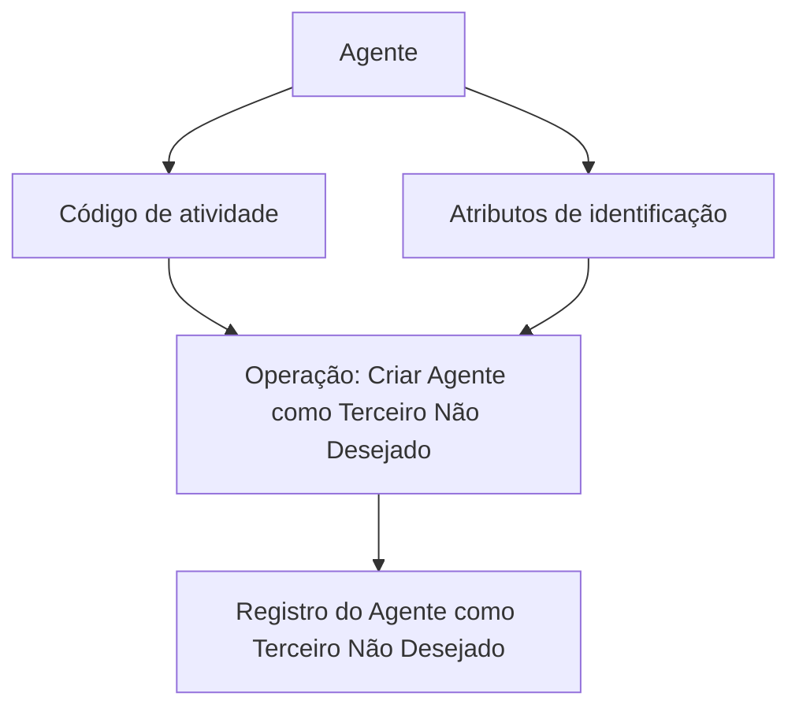

# Operação Criar Agente como Terceiro Não Desejado — Documentação Reef

## 1. Metadados do Documento
- **Arquivo de Origem:** Não identificado
- **Tipo de Documento:** Procedimento
- **Domínio / Sistema:** Reef / Mapfre
- **Público-Alvo:** Operação, Negócio e usuários da documentação Reef
- **Data/Versão Identificada:** Não identificada

---

## 2. Resumo Executivo & Contexto de Negócio

O documento descreve a operação **“Crear Agente como Tercero no Deseado”**, associada à documentação do sistema Reef no contexto Mapfre. A operação permite registrar um agente como **Terceiro Não Desejado**.

O registro é realizado de acordo com o **código de atividade** do agente e com os **valores dos atributos que compõem a identificação** do agente. O texto não detalha quais códigos de atividade são válidos, quais atributos de identificação são avaliados ou quais regras determinam a condição de “não desejado”.

A documentação está identificada como aprovada no ciclo de vida documental e apresenta referências a Reef, Mapfredocument, Zeus, Soluções, Arquiteturas, APIs, Componentes e Cloud. Contudo, o conteúdo fornecido não especifica integrações, contratos técnicos, telas, APIs, permissões ou consequências operacionais do registro.

> **Nota de Análise:** O documento apresenta somente uma descrição resumida da operação. Não há detalhamento adicional sobre validações, persistência, métodos HTTP, estruturas JSON, mensagens de erro ou fluxo de aprovação.

---

## 3. Arquitetura, Componentes & Tecnologias Envolvidas

Os elementos explicitamente citados são:

- **Reef:** sistema ou domínio documental ao qual a operação pertence.
- **Mapfre / Mapfredocument:** contexto corporativo e documental apresentado no conteúdo.
- **Operação “CREAR Agente No Deseado”:** funcionalidade para registrar um agente como Terceiro Não Desejado.
- **Código de atividade:** dado utilizado no registro do agente.
- **Atributos de identificação:** conjunto de valores que compõem a identificação do agente.
- **Zeus, Soluciones, Arquitecturas, APIs, Componentes, Cloud:** itens de navegação ou categorias citadas na interface documental, sem detalhamento de relacionamento técnico.



> **Nota de Análise:** O diagrama representa exclusivamente a sequência declarada pelo texto: a operação considera o código de atividade e os valores dos atributos de identificação para registrar o agente. O documento não informa sistemas de origem, banco de dados, APIs ou componentes técnicos intermediários.

---

## 4. Regras de Negócio, Especificações Funcionais & Processos

### 4.1 Objetivo da operação

A operação **“Crear Agente como Tercero no Deseado”** permite registrar um agente como um **Terceiro Não Desejado**.

### 4.2 Critérios explicitamente mencionados

O registro do agente como Terceiro Não Desejado deve considerar:

1. O **código de atividade** do agente.
2. Os **valores dos atributos que compõem a identificação** do agente.

### 4.3 Fluxo funcional identificado

1. Identificar o agente a ser tratado.
2. Considerar o código de atividade associado ao agente.
3. Considerar os valores dos atributos que formam a identificação do agente.
4. Executar a operação **“CREAR Agente No Deseado”**.
5. Registrar o agente como Terceiro Não Desejado.

### 4.4 Restrições de detalhamento

O conteúdo não informa:

- Critérios para classificar um agente como Terceiro Não Desejado.
- Lista de códigos de atividade aceitos ou rejeitados.
- Relação de atributos obrigatórios de identificação.
- Regras de validação dos atributos.
- Processo de aprovação, revisão ou reversão do registro.
- Mensagens de erro, exceções ou trilha de auditoria.
- Efeitos posteriores do status de Terceiro Não Desejado em outros processos.

---

## 5. Tabelas de Parâmetros, Ambientes e Estruturas de Dados

| Item / Parâmetro | Descrição / Função | Tipo / Valores / Formato | Ambiente / Observações |
| :--- | :--- | :--- | :--- |
| Agente | Entidade a ser registrada como Terceiro Não Desejado. | Não especificado | Associado à operação “CREAR Agente No Deseado”. |
| Terceiro Não Desejado | Classificação ou registro atribuído ao agente pela operação. | Não especificado | O documento não define implicações dessa classificação. |
| Código de atividade | Informação considerada para registrar o agente como Terceiro Não Desejado. | Não especificado | Não há lista de códigos, formato ou regra de validação. |
| Atributos de identificação | Valores que compõem a identificação do agente e são considerados no registro. | Não especificado | Atributos individuais não são enumerados. |
| Operação “CREAR Agente No Deseado” | Operação funcional para criar o registro de Agente Não Desejado. | Operação | Documentação Reef. |
| Reef | Sistema ou domínio da documentação apresentada. | Sistema / domínio | Referenciado como “Documentation / DOCUMENTACIÓN Reef”. |
| Mapfre | Contexto corporativo citado no documento. | Organização / domínio | O texto também apresenta a referência “Mapfredocument”. |
| Lifecycle | Estado documental exibido como “Approved”. | Estado documental | Não há data ou versão associada. |
| Owner | Proprietário documental exibido no conteúdo. | Identificador de usuário | `user:agonzalez_mapfre.com` |

---

## 6. Bateria de Perguntas & Respostas para RAG (FAQ Sintético)

### P1: Qual é o objetivo da operação “Crear Agente como Tercero no Deseado”?
**R:** A operação permite registrar um agente como um Terceiro Não Desejado. O registro considera o código de atividade do agente e os valores dos atributos que compõem a identificação do agente.

### P2: Quais informações do agente são consideradas no registro como Terceiro Não Desejado?
**R:** O documento informa que a operação considera o código de atividade do agente e os valores dos atributos que conformam ou compõem sua identificação. Os campos específicos não são detalhados.

### P3: O documento informa quais códigos de atividade classificam um agente como Terceiro Não Desejado?
**R:** Não. O documento menciona o código de atividade como elemento usado pela operação, mas não apresenta códigos permitidos, proibidos, obrigatórios ou regras de classificação.

### P4: Quais atributos de identificação do agente devem ser enviados?
**R:** O conteúdo informa apenas que os valores dos atributos que compõem a identificação são utilizados. Não há lista de atributos, formatos, obrigatoriedade ou validações.

### P5: Em qual sistema ou domínio a operação está documentada?
**R:** A operação é apresentada na documentação Reef, com referências ao contexto Mapfre e à denominação “Mapfredocument”.

### P6: A documentação descreve uma API para criar um Agente Não Desejado?
**R:** Não. Apesar de a navegação documental mencionar “APIs”, o conteúdo fornecido não especifica endpoint, método HTTP, autenticação, payload, resposta ou contrato de integração para a operação.

### P7: Existe informação sobre como desfazer o registro de Terceiro Não Desejado?
**R:** Não. O texto descreve somente a criação ou registro de um agente como Terceiro Não Desejado e não apresenta processo de remoção, reversão ou atualização.

### P8: O documento define as consequências operacionais de um agente ser registrado como Terceiro Não Desejado?
**R:** Não. O conteúdo não descreve bloqueios, restrições, impactos em processos, notificações ou integrações decorrentes do registro.

### P9: Qual é o estado do ciclo de vida da documentação?
**R:** O conteúdo apresenta o campo “Lifecycle” com o valor “Approved”.

### P10: Quem aparece como proprietário da documentação?
**R:** O proprietário apresentado no conteúdo é `user:agonzalez_mapfre.com`.

---

## 7. Glossário de Termos, Siglas & Conceitos-Chave

- **Agente:** entidade que pode ser registrada como Terceiro Não Desejado pela operação descrita.
- **Terceiro Não Desejado:** classificação ou registro aplicado ao agente pela operação “Crear Agente como Tercero no Deseado”.
- **Código de atividade:** informação do agente considerada no processo de registro.
- **Atributos de identificação:** valores que conformam ou compõem a identificação do agente.
- **Reef:** sistema, domínio ou espaço documental citado no conteúdo.
- **Mapfre:** contexto corporativo referenciado pela documentação.
- **Mapfredocument:** denominação exibida no conteúdo documental.
- **Lifecycle:** campo de ciclo de vida documental; o valor exibido é “Approved”.
- **Owner:** campo que identifica o proprietário da documentação.

---

## 8. Notas Críticas, Riscos & Limitações

- O documento não define o significado operacional, jurídico ou de negócio da classificação **Terceiro Não Desejado**.
- Não são especificados os códigos de atividade utilizados pela operação.
- Não são listados os atributos que compõem a identificação do agente.
- Não há contratos de API, parâmetros de entrada, estruturas de resposta ou detalhes de persistência.
- Não há informações sobre autenticação, autorização, perfis de acesso ou matriz de permissões.
- Não há descrição de tratamento de erros, exceções, auditoria ou reversão do registro.
- Não foi identificada data, versão, autoria formal ou nome do arquivo de origem.
- A referência a “APIs”, “Arquitecturas”, “Componentes”, “Cloud” e “Zeus” aparece apenas como navegação documental; não é possível inferir integração técnica entre esses elementos.

---

## 9. Conteúdo Bruto Estruturado (Referência Fiel)

```text
--- [PÁGINA 1 DE 1] ---

OPERACIÓN CREAR Agente como Tercero no Deseado
¿En que consiste?
Esta operación permite registrar al Agente como un Tercero No Deseado, de acuerdo con su código de actividad y de los valores de los
atributos que conforman su identicación.
Información del Agente No Deseado
 CREAR Agente No Deseado ( )
Documentation / DOCUMENTACIÓN Reef
DOCUMENTACIÓN Reef
Mapfredocument
DOCUMENTACIÓN Reef
Owner
user:agonzalez_mapfre.com
Lifecycle
Approved Source
 / 
 VL
Buscar Inicio Soluciones Arquitecturas APIs Componentes Cloud Documentación Zeus Reef Ayuda
ES
```
