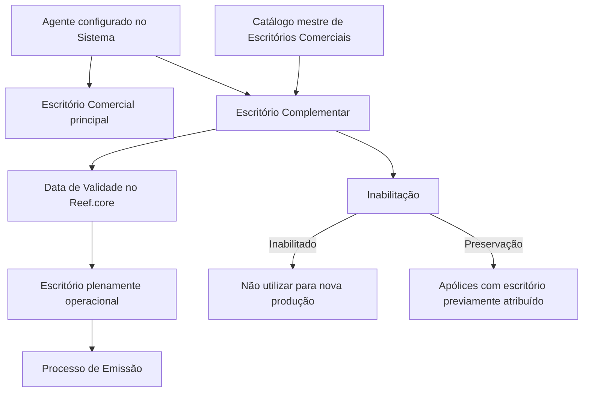

# Criação de Escritórios Habilitados para Agentes — Documentação Reef.core

## 1. Metadados do Documento
- **Arquivo de Origem:** Não informado
- **Tipo de Documento:** Especificação Técnica / Procedimento Funcional
- **Domínio / Sistema:** Reef.core; Estrutura Comercial; Emissão de Apólices
- **Público-Alvo:** Negócio, Operação, Analistas Funcionais e Usuários do Reef.core
- **Data/Versão Identificada:** Não identificada

---

## 2. Resumo Executivo & Contexto de Negócio

O documento descreve a funcionalidade de criação e manutenção de **Escritórios Habilitados** para um agente comercial no sistema Reef.core. Cada agente configurado possui uma associação a um Escritório da Estrutura Comercial da companhia.

Normalmente, a associação entre agente e escritório comercial é única. Entretanto, por motivos comerciais, um agente pode ser autorizado a emitir produção em escritórios complementares. Esses escritórios complementares ampliam os locais da Estrutura Comercial nos quais o agente pode comercializar e contabilizar apólices.

O objetivo funcional é registrar a relação de Escritórios Complementares em que determinado agente está autorizado a operar. A autorização influencia diretamente o Processo de Emissão, pois define quais escritórios comerciais podem ser utilizados para novas emissões vinculadas ao agente.

A funcionalidade disponibiliza a ação de **CRIAR** e organiza a captura das informações no bloco “Dados Agente Escritórios Habilitados”. A sequência de preenchimento deve ser seguida da esquerda para a direita e de cima para baixo.

A vigência operacional da associação é controlada pela **Data de Validade**. A desativação é controlada pelo campo **Inabilitação**, que bloqueia o uso do escritório para movimentos de nova produção, mas preserva apólices que já possuíam o escritório previamente atribuído.

---

## 3. Arquitetura, Componentes & Tecnologias Envolvidas

### Componentes e entidades identificados

| Componente / Entidade | Papel descrito |
| :--- | :--- |
| Reef.core | Sistema que armazena a data a partir da qual o escritório associado ao agente torna-se plenamente operacional. |
| Agente | Entidade comercial configurada no sistema e associada a um Escritório Comercial. |
| Escritório Comercial | Unidade da Estrutura Comercial da companhia que pode ser associada ao agente. |
| Escritório Complementar | Escritório adicional no qual o agente pode comercializar e contabilizar apólices. |
| Estrutura Comercial | Estrutura organizacional da companhia que define os Escritórios Comerciais. |
| Catálogo mestre de Escritórios Comerciais | Fonte de valores permitidos para o campo Escritório Comercial. |
| Processo de Emissão | Processo que utiliza escritórios habilitados para emissão e movimentos de nova produção. |
| Apólices | Registros cuja associação histórica de escritório é preservada mesmo após inabilitação. |



**Nota de Análise:** O documento não detalha métodos HTTP, contratos JSON, banco de dados, integrações externas, perfis de acesso, APIs ou regras técnicas de persistência para a funcionalidade de Escritórios Habilitados.

---

## 4. Regras de Negócio, Especificações Funcionais & Processos

### Objetivo funcional

Registrar a relação de Escritórios Complementares da Estrutura Comercial da entidade nos quais um agente está autorizado a:

1. Comercializar apólices.
2. Contabilizar apólices.
3. Utilizar o escritório no Processo de Emissão, desde que a associação esteja válida e não esteja inabilitada.

### Regras de associação de escritórios

1. Todos os agentes configurados no sistema possuem um Escritório da Estrutura Comercial da companhia atribuído.
2. A associação de um agente a um escritório normalmente é única.
3. Por motivos comerciais, um agente pode possuir autorização para emitir produção em Escritórios Complementares.
4. O Escritório Comercial informado deve pertencer ao catálogo mestre de Escritórios Comerciais definido na Estrutura Comercial da companhia.
5. A tela ou funcionalidade possui a ação habilitada **CRIAR**.

### Sequência de captura de dados

O bloco “Dados Agente Escritórios Habilitados” deve ser preenchido da esquerda para a direita e de cima para baixo, considerando a seguinte ordem:

1. Escritório Comercial.
2. Data de Validade.
3. Inabilitação.

### Regra de validade operacional

1. A Data de Validade representa a data a partir da qual o Escritório Comercial associado ao agente se torna plenamente operacional no Reef.core.
2. A partir da Data de Validade, o escritório é habilitado para uso no Processo de Emissão.

### Regra de inabilitação

1. O campo Inabilitação indica que o Escritório Comercial associado ao agente está inabilitado no sistema.
2. Um Escritório Comercial inabilitado não pode ser utilizado no Processo de Emissão para movimentos de nova produção.
3. A inabilitação não remove nem altera o uso do escritório em apólices que já possuíam aquele escritório previamente atribuído.

---

## 5. Tabelas de Parâmetros, Ambientes e Estruturas de Dados

| Item / Parâmetro | Descrição / Função | Tipo / Valores / Formato | Ambiente / Observações |
| :--- | :--- | :--- | :--- |
| Ação habilitada | Permite registrar uma relação de Escritório Complementar para um agente. | CRIAR | O documento somente identifica a ação CRIAR. |
| Dados Escritórios Habilitados | Seção funcional relacionada à manutenção de escritórios autorizados. | Bloco de informação | Associado ao agente configurado no sistema. |
| Dados Agente Escritórios Habilitados | Bloco de captura de atributos da relação entre agente e escritório. | Bloco de informação | Preenchimento da esquerda para a direita e de cima para baixo. |
| Escritório Comercial | Escritório que o agente pode possuir associado. | Valor selecionado do catálogo mestre | Deve pertencer ao catálogo mestre de Escritórios Comerciais da Estrutura Comercial. |
| Data de Validade | Data a partir da qual o escritório associado ao agente está plenamente operacional. | Data | No Reef.core, habilita o uso do escritório no Processo de Emissão. |
| Inabilitação | Marca que o escritório associado ao agente está inabilitado no sistema. | Indicador de inabilitação | Bloqueia nova produção; preserva apólices com associação anterior. |
| Escritório Complementar | Escritório adicional no qual o agente pode emitir produção. | Relação comercial | Permitido em ocasiões e por motivos comerciais. |
| Nova produção | Movimentos de emissão para os quais um escritório inabilitado não pode ser utilizado. | Movimento de emissão | Não afeta apólices que já tinham o escritório atribuído. |

---

## 6. Bateria de Perguntas & Respostas para RAG (FAQ Sintético)

### P1: Qual é o objetivo da funcionalidade de Escritórios Habilitados no Reef.core?
**R:** A funcionalidade registra os Escritórios Complementares da Estrutura Comercial nos quais um agente está autorizado a comercializar e contabilizar apólices. Esses escritórios podem ser utilizados pelo agente no Processo de Emissão quando estiverem válidos e não inabilitados.

### P2: Todo agente possui um Escritório Comercial associado?
**R:** Sim. O documento informa que todos os agentes configurados no sistema possuem um Escritório da Estrutura Comercial da companhia atribuído.

### P3: Um agente pode ter mais de um Escritório Comercial?
**R:** Normalmente, a associação de escritório para o agente é única. Porém, por motivos comerciais, o agente pode ser autorizado a emitir produção em Escritórios Complementares.

### P4: De onde vêm os valores permitidos para o campo Escritório Comercial?
**R:** O campo Escritório Comercial deve conter um dos escritórios disponíveis no catálogo mestre de Escritórios Comerciais definidos na Estrutura Comercial da companhia.

### P5: O que representa a Data de Validade de um Escritório Comercial associado ao agente?
**R:** A Data de Validade indica, no Reef.core, a data a partir da qual o Escritório Comercial associado ao agente está plenamente operacional. A partir dessa data, o escritório fica habilitado para uso no Processo de Emissão.

### P6: O que acontece quando um Escritório Comercial é marcado como inabilitado?
**R:** O escritório associado ao agente fica inabilitado no sistema e não pode ser utilizado no Processo de Emissão para movimentos de nova produção.

### P7: A inabilitação de um escritório altera apólices já existentes?
**R:** Não. O documento determina que apólices que já possuíam previamente aquele Escritório Comercial atribuído devem respeitar a associação anterior, mesmo após a inabilitação para nova produção.

### P8: Qual ação está explicitamente habilitada na funcionalidade?
**R:** A documentação identifica a ação **CRIAR** como ação habilitada para a funcionalidade de Escritórios Habilitados.

### P9: Qual é a ordem de preenchimento dos dados do agente e dos escritórios habilitados?
**R:** Os atributos do bloco “Dados Agente Escritórios Habilitados” devem ser capturados da esquerda para a direita e de cima para baixo: Escritório Comercial, Data de Validade e Inabilitação.

### P10: O documento especifica APIs, métodos HTTP ou contratos JSON para Escritórios Habilitados?
**R:** Não. O conteúdo apresentado descreve regras funcionais e campos da funcionalidade, mas não detalha APIs, métodos HTTP, contratos JSON, banco de dados ou integrações técnicas.

---

## 7. Glossário de Termos, Siglas & Conceitos-Chave

- **Reef.core:** Sistema citado como responsável por conter a Data de Validade a partir da qual o escritório associado ao agente está plenamente operacional.
- **Agente:** Entidade comercial configurada no sistema, associada a um Escritório Comercial da Estrutura Comercial.
- **Escritório Comercial:** Escritório definido na Estrutura Comercial da companhia e associado ao agente.
- **Escritório Complementar:** Escritório adicional no qual o agente pode ser autorizado a emitir produção.
- **Estrutura Comercial:** Estrutura organizacional da companhia que contém os Escritórios Comerciais.
- **Catálogo mestre de Escritórios Comerciais:** Catálogo que disponibiliza os valores possíveis para seleção do Escritório Comercial.
- **Processo de Emissão:** Processo no qual escritórios associados e válidos podem ser utilizados.
- **Nova produção:** Movimentos para os quais um Escritório Comercial inabilitado não pode ser utilizado.
- **Inabilitação:** Indicador que desativa o uso do Escritório Comercial para movimentos de nova produção.
- **Apólice:** Registro cuja associação histórica com um Escritório Comercial é preservada quando o escritório é inabilitado.

---

## 8. Notas Críticas, Riscos & Limitações

- O documento não identifica o nome do arquivo de origem, versão, data de publicação ou responsável formal pelo conteúdo.
- O documento cita o Reef.core, mas não detalha arquitetura interna, componentes técnicos, APIs, banco de dados ou integrações.
- Não são informados formatos de data, obrigatoriedade dos campos, validações de preenchimento, mensagens de erro ou regras de alteração/exclusão.
- Não são identificados perfis, permissões ou matrizes de acesso para executar a ação CRIAR.
- A inabilitação apresenta impacto operacional relevante: bloqueia nova produção, mas preserva associações históricas de apólices previamente atribuídas.
- **Nota de Análise:** O documento apresenta somente a ação CRIAR; não há detalhamento sobre consulta, alteração, exclusão ou reabilitação de Escritórios Comerciais.

---

## 9. Conteúdo Bruto Estruturado (Referência Fiel)

```text
--- [PÁGINA 1 DE 1] ---

CREAR Ocinas Habilitadas para el Agente
Contexto
Todos y cada uno de los Agentes congurados en el Sistema tienen asignada una Ocina de la Estructura Comercial de la Compañía.
Normalmente esta asignación es única pero en ocasiones y por motivos comerciales se permite que un agente pueda emitir su producción
en otras Ocinas complementarias.
Objetivo
Registrar la relación de Ocinas Complementarias de la Estructura Comercial de la Entidad en las que se permite al Agente comercializar y
contabilizar sus pólizas.
Acciones habilitadas
 CREAR ( )
Datos Ocinas Habilitadas
Datos Agente Ocinas Habilitadas
De Izquierda a Derecha y de Arriba hacia Abajo, los siguientes atributos marcan la secuencia de captura en este Bloque de Información.
Ocina Comercial (  )
Este Campo contendrá una de las Ocinas Comerciales que el Agente puede tener asociadas, de acuerdo con la relación de valores
existentes en el catálogo maestro de Ocinas Comerciales denidas en la estructura comercial de la Compañía.
Fecha de Validez ( )
El valor de este campo en Reef.core contiene la fecha a partir de la cual la Ocina asociada al Agente está plenamente operativa y se habilita
por tanto su uso en el Proceso de Emisión.
Inhabilitación ( )
Este Campo marca que la Ocina Comercial asociada al Agente está inhabilitada en el Sistema y por tanto se inhabilita su uso en el Proceso
de Emisión para los movimientos de nueva producción (respetándose en cambio en aquellas pólizas que la tuvieran previamente asignada).
Documentation / DOCUMENTACIÓN Reef
DOCUMENTACIÓN Reef
Mapfredocument
DOCUMENTACIÓN Reef
Owner
user:agonzalez_mapfre.com
Lifecycle
Approved Source
 / 
 VL
Buscar Inicio Soluciones Arquitecturas APIs Componentes Cloud Documentación Zeus Reef Ayuda
ES
```
