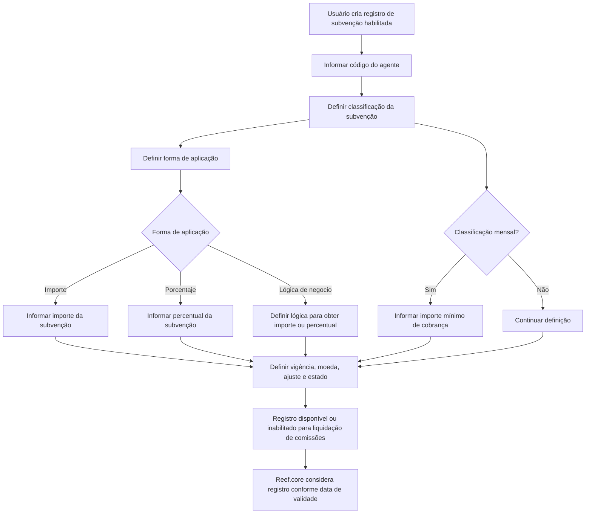

# Cadastro de Subvenções Habilitadas para o Agente no Reef.core

## 1. Metadados do Documento
- **Arquivo de Origem:** Não informado; conteúdo bruto apresentado como documentação Reef / Mapfre.
- **Tipo de Documento:** Especificação Funcional.
- **Domínio / Sistema:** Reef.core — gestão de subvenções concedidas a agentes.
- **Público-Alvo:** Analistas funcionais, desenvolvedores, arquitetos, operação e áreas de comissionamento.
- **Data/Versão Identificada:** Não identificada.
- **Owner identificado no conteúdo:** `user:agonzalez_mapfre.com`.
- **Lifecycle identificado no conteúdo:** `Approved`.

---

## 2. Resumo Executivo & Contexto de Negócio

O documento descreve a funcionalidade **“Crear Subvenciones Habilitadas para el Agente”** no sistema Reef.core. O objetivo declarado é registrar a relação de subvenções concedidas a um agente em razão da comercialização de apólices e/ou da cobrança dos recibos vinculados às apólices desse agente.

A tela de informações possui ação habilitada de **criação** e define uma sequência de captura de atributos “da esquerda para a direita e de cima para baixo”. Os atributos permitem identificar o agente, classificar a subvenção, definir como ela será aplicada, estabelecer vigência, valores, moeda, regras de cálculo e o estado de habilitação para utilização na liquidação de comissões.

A classificação da subvenção pode representar uma subvenção mensal ou uma aplicação associada à cobrança e ao cancelamento de cobrança de recibos. A forma de aplicação pode ser configurada como valor monetário, percentual ou lógica de negócio. Cada forma de aplicação determina quais atributos complementares devem ser utilizados durante a definição da subvenção.

A especificação também estabelece controles temporais e operacionais: data de início da concessão, data de caducidade, data de validade e inabilitação do registro. A data de validade é apresentada como mecanismo para disponibilizar a subvenção nos processos aplicáveis e manter histórico das alterações nas definições de subvenções.

---

## 3. Arquitetura, Componentes & Tecnologias Envolvidas

O conteúdo cita o sistema **Reef.core** como o ambiente corporativo no qual valores de classificação e formas de aplicação são configurados e no qual o registro da subvenção é utilizado. O documento também relaciona a definição de subvenções ao processo de **liquidação de comissões** e à **conta corrente do agente**.

Não são descritos microsserviços, APIs, métodos HTTP, contratos JSON, bancos de dados, servidores, URLs de ambiente, tecnologias de infraestrutura ou mecanismos de integração.

> **Nota de Análise:** O documento descreve uma tela funcional e seus atributos, mas não detalha arquitetura física, integrações técnicas, contratos de serviço ou componentes de software internos do Reef.core.



### Componentes e conceitos identificados

| Componente / Conceito | Função descrita no documento | Relação com a subvenção |
| :--- | :--- | :--- |
| Reef.core | Sistema corporativo citado como local de configuração de valores possíveis. | Armazena ou considera a definição da subvenção nos processos aplicáveis. |
| Agente / Intermediário | Entidade identificada pela seguradora. | É o beneficiário da subvenção concedida. |
| Apólices | Produtos comercializados pelo agente. | A comercialização de apólices é uma das razões declaradas para concessão de subvenção. |
| Recibos | Recibos associados às apólices do agente. | Podem estar associados à cobrança e ao cancelamento de cobrança para aplicação de subvenção. |
| Conta corrente do agente | Registro associado ao agente. | O código do conceito de ajuste identifica nela a subvenção concedida. |
| Liquidação de comissões | Processo estabelecido pela entidade seguradora. | Pode utilizar o registro de subvenção, salvo quando estiver inabilitado. |
| Entidade seguradora | Organização que identifica o intermediário e considera critérios de negócio. | Concede a subvenção e estabelece o processo de liquidação de comissões. |

---

## 4. Regras de Negócio, Especificações Funcionais & Processos

### 4.1 Objetivo funcional

A funcionalidade registra a relação de subvenções concedidas ao agente por:

1. Comercializar apólices.
2. Cobrar os recibos das apólices do agente.

### 4.2 Ação habilitada

A documentação apresenta a ação habilitada:

- **CREAR**.

> **Nota de Análise:** O conteúdo somente explicita a ação de criação. Não há detalhamento sobre ações de alteração, exclusão, consulta, aprovação, workflow ou permissões.

### 4.3 Sequência de captura dos dados

A tela de informação orienta que os atributos devem ser capturados:

- Da esquerda para a direita.
- De cima para baixo.

### 4.4 Identificação do agente

O **Código do Agente** identifica a chave do intermediário de acordo com a identificação realizada pela entidade seguradora.

### 4.5 Classificação da subvenção

A **Classificação da subvenção** determina a classificação da subvenção concedida conforme valores configurados em nível corporativo no Reef.core:

1. **SUBVENCIÓN MENSUAL**.
2. **APLICACIÓN EN EL COBRO Y ANULADO DE COBRO DE LOS RECIBOS**.

A classificação mensal possui uma dependência funcional específica: quando a classificação indica subvenção mensal, deve-se considerar o atributo **Importe mínimo cobranza**.

### 4.6 Forma de aplicação da subvenção

A **Forma de aplicación de la subvención** determina como a subvenção será aplicada, conforme valores configurados em nível corporativo no Reef.core:

1. **IMPORTE** — de acordo com a moeda da definição.
2. **PORCENTAJE**.
3. **LÓGICA DE NEGOCIO**.

A forma de aplicação controla os atributos necessários para a definição:

| Forma de aplicação | Atributo relacionado | Regra descrita |
| :--- | :--- | :--- |
| IMPORTE | Importe de la subvención | O valor identifica o importe concedido ao agente quando a forma de aplicação for importe. |
| PORCENTAJE | Porcentaje de la subvención | O percentual é aplicado sobre o total das comissões do agente quando a forma de aplicação for percentual. |
| LÓGICA DE NEGOCIO | Lógica de negocio para obtener el importe o porcentaje de la subvención | A lógica permite avaliar dinamicamente critérios de negócio considerados pela entidade seguradora para obter o importe ou percentual aplicável. |

### 4.7 Conceito de ajuste e agrupamento contábil

O **Código del concepto de ajuste** identifica o código do conceito de ajuste de comissões que identificará especificamente a subvenção concedida na conta corrente do agente.

O documento estabelece a seguinte restrição:

- A agrupação contábil do conceito de ajuste deve ser do tipo **MP**.

> **Nota de Análise:** A documentação não define o significado da sigla “MP”, os valores possíveis de agrupação contábil nem o mecanismo de validação dessa restrição.

### 4.8 Vigência da concessão

A concessão da subvenção possui os seguintes controles de data:

| Campo | Regra funcional |
| :--- | :--- |
| Fecha inicio concesión Subvención | Identifica a data desde a qual a subvenção é concedida ao agente. |
| Fecha caducidad concesión Subvención | Determina a data de caducidade da subvenção concedida. |
| Fecha de Validez | Estabelece a data a partir da qual a subvenção fica disponível no sistema para ser considerada nos processos correspondentes. |

A data de validade deve ser utilizada corretamente para manter o histórico de alterações efetuadas nas definições de subvenções.

### 4.9 Valor, moeda e percentual

O **Importe de la subvención** identifica o valor da subvenção concedida ao agente somente quando a forma de aplicação determinar que a subvenção é um importe.

A **Moneda** identifica o código da moeda para a qual a subvenção é concedida.

O **Porcentaje de la subvención** identifica o percentual da subvenção a ser aplicado sobre o total das comissões do agente somente quando a forma de aplicação for percentual.

### 4.10 Importe mínimo de cobrança

O **Importe mínimo cobranza** determina o valor mínimo que o agente deve cobrar para receber a subvenção mensal, somente quando a classificação da subvenção indicar que se trata de uma subvenção mensal.

### 4.11 Lógica de negócio dinâmica

A **Lógica de negocio para obtener el importe o porcentaje de la subvención** é aplicável somente quando a forma de aplicação determinar que o valor será obtido pela execução de uma lógica de negócio.

A finalidade declarada dessa lógica é avaliar dinamicamente os critérios de negócio considerados pela entidade seguradora para obter:

- O importe da subvenção; ou
- O percentual da subvenção a aplicar.

> **Nota de Análise:** O documento não informa a linguagem, o motor de regras, os critérios específicos, a assinatura de execução, entradas, saídas ou tratamento de erros da lógica de negócio.

### 4.12 Inabilitação para liquidação de comissões

O campo **Inhabilitación** informa ao Reef.core que o registro que identifica a subvenção está inabilitado para utilização no processo de liquidação de comissões estabelecido pela entidade seguradora.

---

## 5. Tabelas de Parâmetros, Ambientes e Estruturas de Dados

### 5.1 Atributos da tela “Datos Subvenciones Habilitadas”

| Item / Parâmetro | Descrição / Função | Tipo / Valores / Formato | Ambiente / Observações |
| :--- | :--- | :--- | :--- |
| Código del Agente | Identifica a chave do intermediário segundo a identificação feita pela entidade seguradora. | Código do agente; formato não informado. | Relaciona a subvenção ao agente. |
| Clasificación de la subvención | Determina a classificação da subvenção concedida. | `SUBVENCIÓN MENSUAL`; `APLICACIÓN EN EL COBRO Y ANULADO DE COBRO DE LOS RECIBOS`. | Valores configurados corporativamente no Reef.core. |
| Forma de aplicación de la subvención | Determina a forma de aplicação da subvenção concedida. | `IMPORTE`; `PORCENTAJE`; `LÓGICA DE NEGOCIO`. | Valores configurados corporativamente no Reef.core. |
| Código del concepto de ajuste | Identifica o conceito de ajuste de comissões que identificará a subvenção na conta corrente do agente. | Código; formato não informado. | A agrupação contábil do conceito deve ser do tipo `MP`. |
| Fecha inicio concesión Subvención | Identifica a data desde a qual a subvenção é concedida ao agente. | Data; formato não informado. | Define o início da concessão. |
| Fecha caducidad concesión Subvención | Determina a data de caducidade da subvenção concedida. | Data; formato não informado. | Define a caducidade da concessão. |
| Importe de la subvención | Identifica o valor da subvenção concedida ao agente. | Importe monetário; formato não informado. | Aplicável quando a forma de aplicação for `IMPORTE`. |
| Moneda | Identifica o código da moeda para a qual a subvenção é concedida. | Código de moeda; padrão não informado. | Relacionada ao valor monetário da subvenção. |
| Importe mínimo cobranza | Determina o importe mínimo que o agente deve cobrar para perceber a subvenção mensal. | Importe monetário; formato não informado. | Aplicável quando a classificação for `SUBVENCIÓN MENSUAL`. |
| Lógica de negocio para obtener el importe o porcentaje de la subvención | Permite avaliar dinamicamente critérios de negócio para obter o importe ou percentual a aplicar. | Lógica de negócio; tecnologia e formato não informados. | Aplicável quando a forma de aplicação for `LÓGICA DE NEGOCIO`. |
| Porcentaje de la subvención | Identifica o percentual a aplicar sobre o total das comissões do agente. | Percentual; formato, precisão e limites não informados. | Aplicável quando a forma de aplicação for `PORCENTAJE`. |
| Inhabilitación | Indica ao Reef.core que o registro de subvenção está inabilitado para uso na liquidação de comissões. | Indicador; valores não informados. | Afeta o processo de liquidação de comissões. |
| Fecha de Validez | Estabelece a data a partir da qual a subvenção está disponível no sistema. | Data; formato não informado. | Permite histórico de alterações das definições de subvenções. |

### 5.2 Matriz de aplicabilidade condicional

| Condição | Campo / comportamento aplicável | Efeito descrito |
| :--- | :--- | :--- |
| Forma de aplicação = `IMPORTE` | Importe de la subvención | Identifica o valor da subvenção concedida ao agente. |
| Forma de aplicação = `PORCENTAJE` | Porcentaje de la subvención | Define percentual aplicado sobre o total das comissões do agente. |
| Forma de aplicação = `LÓGICA DE NEGOCIO` | Lógica de negocio para obtener el importe o porcentaje de la subvención | Avalia dinamicamente critérios de negócio para obter importe ou percentual aplicável. |
| Classificação = `SUBVENCIÓN MENSUAL` | Importe mínimo cobranza | Define o importe mínimo que o agente deve cobrar para receber a subvenção mensal. |
| Registro marcado com Inhabilitación | Utilização na liquidação de comissões | O registro fica inabilitado para ser utilizado no processo de liquidação de comissões. |
| Fecha de Validez alcançada | Disponibilidade da subvenção no sistema | A subvenção pode ser considerada nos processos nos quais deve ser utilizada. |

### 5.3 Ambientes, servidores e rotas

| Item / Parâmetro | Descrição / Função | Tipo / Valores / Formato | Ambiente / Observações |
| :--- | :--- | :--- | :--- |
| Ambiente Reef.core | Sistema corporativo citado na documentação. | Sistema corporativo. | Não há URL, servidor, porta ou ambiente de implantação informado. |
| Documentación Reef / Mapfredocument | Referência de documentação exibida no conteúdo. | Identificador textual de documentação. | Não há rota técnica ou URL explícita. |
| Lifecycle | Estado da documentação. | `Approved`. | Exibido no conteúdo original. |
| Owner | Proprietário identificado no cabeçalho. | `user:agonzalez_mapfre.com`. | Exibido no conteúdo original. |

---

## 6. Bateria de Perguntas & Respostas para RAG (FAQ Sintético)

### P1: Qual é o objetivo da funcionalidade “Crear Subvenciones Habilitadas para el Agente” no Reef.core?
**R:** O objetivo é registrar a relação de subvenções concedidas ao agente por comercializar apólices e/ou por cobrar os recibos das apólices desse agente. A definição registra identificação do agente, classificação, forma de aplicação, valores, moeda, vigência, lógica de negócio e estado de habilitação para a liquidação de comissões.

### P2: Quais classificações de subvenção podem ser configuradas?
**R:** O documento informa dois valores possíveis configurados corporativamente no Reef.core: `SUBVENCIÓN MENSUAL` e `APLICACIÓN EN EL COBRO Y ANULADO DE COBRO DE LOS RECIBOS`.

### P3: Quando o campo “Importe mínimo cobranza” deve ser utilizado?
**R:** O campo “Importe mínimo cobranza” deve ser utilizado quando a classificação da subvenção indicar uma `SUBVENCIÓN MENSUAL`. Esse atributo determina o importe mínimo que o agente deve cobrar para receber a subvenção mensal.

### P4: Quais são as formas de aplicação da subvenção?
**R:** A forma de aplicação da subvenção pode ser `IMPORTE`, `PORCENTAJE` ou `LÓGICA DE NEGOCIO`. Esses valores são configurados em nível corporativo no Reef.core.

### P5: Como o importe da subvenção é definido quando a forma de aplicação é IMPORTE?
**R:** Quando a forma de aplicação determina `IMPORTE`, o atributo “Importe de la subvención” identifica o valor da subvenção concedida ao agente. A forma `IMPORTE` é descrita como vinculada à moeda da definição.

### P6: Sobre qual base o percentual da subvenção é aplicado?
**R:** Quando a forma de aplicação é `PORCENTAJE`, o atributo “Porcentaje de la subvención” identifica o percentual que será aplicado sobre o total das comissões do agente.

### P7: Para que serve a lógica de negócio na definição da subvenção?
**R:** A lógica de negócio é aplicável quando a forma de aplicação é `LÓGICA DE NEGOCIO`. Ela permite avaliar dinamicamente os critérios de negócio considerados pela entidade seguradora para obter o importe ou o percentual da subvenção que deve ser aplicado.

### P8: Qual requisito contábil existe para o código do conceito de ajuste?
**R:** O código do conceito de ajuste identifica o conceito de ajuste de comissões que identificará a subvenção concedida na conta corrente do agente. A agrupação contábil desse conceito de ajuste deve ser do tipo `MP`.

### P9: Qual é a finalidade da “Fecha de Validez” da subvenção?
**R:** A “Fecha de Validez” estabelece a data a partir da qual a subvenção está disponível no sistema para ser considerada nos processos em que deve ser utilizada. O documento afirma que seu uso correto permite manter histórico das alterações realizadas nas definições das subvenções.

### P10: O que acontece quando uma subvenção está marcada com “Inhabilitación”?
**R:** Quando o campo “Inhabilitación” indica que o registro está inabilitado, o Reef.core deve considerar que a subvenção não pode ser utilizada no processo de liquidação de comissões estabelecido pela entidade seguradora.

### P11: Qual é a diferença entre a data de início, a data de caducidade e a data de validade?
**R:** A data de início da concessão identifica desde quando a subvenção é concedida ao agente. A data de caducidade determina quando a concessão expira. A data de validade estabelece a partir de quando a subvenção está disponível no sistema para ser considerada nos processos aplicáveis e também suporta o histórico de mudanças na definição.

### P12: O documento define APIs, métodos HTTP ou contratos JSON para o cadastro de subvenções?
**R:** Não. O documento descreve atributos funcionais da tela de informações e regras condicionais de negócio, mas não detalha APIs, métodos HTTP, contratos JSON, endpoints, tecnologias de integração ou estrutura de persistência.

---

## 7. Glossário de Termos, Siglas & Conceitos-Chave

- **Agente:** Entidade que recebe a subvenção por comercializar apólices e/ou cobrar os recibos de suas apólices.
- **Intermediário:** Entidade identificada pelo código do agente, de acordo com a identificação realizada pela entidade seguradora.
- **Apólice:** Elemento comercializado pelo agente; a comercialização de apólices é uma das razões citadas para concessão de subvenção.
- **Recibo:** Elemento associado às apólices do agente, citado nos processos de cobrança e cancelamento de cobrança.
- **Subvenção:** Concessão registrada para o agente, com classificação, forma de aplicação, valores, vigência e regras de utilização.
- **SUBVENCIÓN MENSUAL:** Classificação de subvenção para a qual o documento prevê a definição de um importe mínimo de cobrança.
- **APLICACIÓN EN EL COBRO Y ANULADO DE COBRO DE LOS RECIBOS:** Classificação de subvenção relacionada à cobrança e ao cancelamento de cobrança dos recibos.
- **IMPORTE:** Forma de aplicação em que a subvenção é definida por valor, de acordo com a moeda da definição.
- **PORCENTAJE:** Forma de aplicação em que a subvenção é definida por percentual aplicado sobre o total das comissões do agente.
- **LÓGICA DE NEGOCIO:** Forma de aplicação em que critérios de negócio são avaliados dinamicamente para obter o importe ou percentual da subvenção.
- **Código del concepto de ajuste:** Código do conceito de ajuste de comissões que identifica a subvenção na conta corrente do agente.
- **MP:** Tipo exigido para a agrupação contábil do conceito de ajuste. O documento não expande o significado da sigla.
- **Liquidação de comissões:** Processo estabelecido pela entidade seguradora no qual a subvenção pode ser utilizada, salvo se o registro estiver inabilitado.
- **Inhabilitación:** Campo que indica que o registro de subvenção está inabilitado para uso no processo de liquidação de comissões.
- **Fecha de Validez:** Data a partir da qual a subvenção fica disponível para os processos relevantes no sistema.

---

## 8. Notas Críticas, Riscos & Limitações

- O documento não apresenta identificação explícita do arquivo de origem, data de publicação, versão funcional ou versão do Reef.core.
- Não há detalhamento de APIs, endpoints, métodos HTTP, contratos JSON, modelo de dados, banco de dados, tecnologia de implementação ou mecanismos de integração.
- O documento não informa formatos de data, formato dos códigos, moedas aceitas, precisão monetária, precisão percentual, limites numéricos ou obrigatoriedade dos campos.
- A sigla **MP** é indicada como tipo obrigatório de agrupação contábil, porém o significado, catálogo de valores e mecanismo de validação não são descritos.
- A lógica de negócio para cálculo dinâmico é citada, mas não há especificação de regras, motor de execução, parâmetros de entrada, retorno, responsáveis, tratamento de erro ou rastreabilidade.
- Não há descrição de permissões, papéis de usuário, aprovação, auditoria, alteração, exclusão ou consulta de registros de subvenção.
- A documentação afirma que a data de validade permite manter histórico das alterações, mas não explica como versões coexistem, como conflitos de datas são tratados ou qual regra determina a seleção de uma definição histórica.
- Não são definidos comportamentos para cenários como subvenção expirada, ausência de moeda, classificação incompatível com forma de aplicação, código de ajuste sem agrupação `MP` ou lógica de negócio sem retorno.
- A documentação somente identifica a ação **CREAR**; não existe detalhamento adicional sobre o ciclo de vida operacional do registro após a criação.

---

## 9. Conteúdo Bruto Estruturado (Referência Fiel)

```text
--- [PÁGINA 1 DE 2] ---

CREAR Subvenciones Habilitadas para el Agente
Objetivo
Registrar la relación de Subvenciones concedidas al Agente por comercializar pólizas y/ó cobrar los recibos de sus pólizas.
Acciones habilitadas
 CREAR ( )
Datos Subvenciones Habilitadas
De Izquierda a Derecha y de Arriba hacia Abajo, los siguientes atributos marcan la secuencia de captura en esta pantalla de Información.
Código del Agente (  )
Este campo identica la clave del intermediario de acuerdo con la identicación realizada por la entidad aseguradora.
Clasicación de la subvención (  )
Esta propiedad determina la clasicación de la subvención concedida, de acuerdo con uno de los posibles valores congurados a nivel
corporativo en Reef.core:
(1) SUBVENCIÓN MENSUAL.
(2) APLICACIÓN EN EL COBRO Y ANULADO DE COBRO DE LOS RECIBOS.
Forma de aplicación de la subvención (  )
Esta propiedad determina la forma de aplicación de la subvención concedida, de acuerdo con uno de los posibles valores congurados a
nivel corporativo en Reef.core:
(1) IMPORTE (de acuerdo a la Moneda de la denición)
(2) PORCENTAJE
(3) LÓGICA DE NEGOCIO
Documentation / DOCUMENTACIÓN Reef
DOCUMENTACIÓN Reef
Mapfredocument
DOCUMENTACIÓN Reef
Owner
user:agonzalez_mapfre.com
Lifecycle
Approved Source
 / 
 VL
Buscar Inicio Soluciones Arquitecturas APIs Componentes Cloud Documentación Zeus Reef Ayuda
ES


--- [PÁGINA 2 DE 2] ---

Código del concepto de ajuste (  )
Identica el código del concepto de ajuste de comisiones, que identicará especícamente en la cuenta corriente del agente la subvención
concedida.
La agrupación contable del concepto de ajuste debe ser del tipo MP.
Fecha inicio concesión Subvención ( )
Identica la fecha desde la que se concede la subvención al agente.
Fecha caducidad concesión Subvención ( )
Este dato determina la fecha de caducidad de la subvención concedida.
Importe de la subvención ( )
Siempre y cuando la forma de aplicación de la subvención determine que sea un importe, este atributo identica el importe de la subvención
concedida al agente.
Moneda (  )
Este campo identica el código de la moneda para la que se concede la subvención.
Importe mínimo cobranza ( )
Siempre y cuando la clasicación de la subvención indique que sea una subvención mensual, esta propiedad determina el importe mínimo
que el Agente tiene que cobrar para percibir la subvención mensual.
Lógica de negocio para obtener el importe o porcentaje de la subvención ( )
Siempre y cuando la forma de aplicación de la subvención determine que vaya a ser obtenida mediante la ejecución de una lógica de negocio,
este atributo permite evaluar dinámicamente los criterios de negocio que se hubieren considerado por parte de la entidad aseguradora al n
de obtener el importe o el porcentaje de la subvención a aplicar.
Porcentaje de la subvención ( )
Siempre y cuando la forma de aplicación de la subvención determine que sea un porcentaje, esta propiedad de la denición identica el
porcentaje de la subvención que se va a aplicar sobre el total de las comisiones del Agente.
Inhabilitación ( )
Este campo le indica a Reef.core que el registro que identica la subvención está inhabilitado para poder ser utilizado en el proceso de
liquidación de comisiones que tenga establecida la entidad aseguradora.
Fecha de Validez ( )
Este dato establece la fecha a partir de la cual la subvención está disponible en el sistema para ser contemplada en los procesos en los que
deba ser considerada. Su correcto uso, por tanto, permite tener un histórico de los cambios efectuados en las deniciones de las
subvenciones.
```
