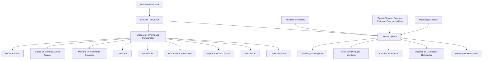

# Operação Criar Agente — Documentação Reef

## 1. Metadados do Documento
- **Arquivo de Origem:** Não identificado no conteúdo extraído
- **Tipo de Documento:** Procedimento
- **Domínio / Sistema:** Reef / Mapfre
- **Público-Alvo:** Usuários do sistema, Operação, Negócio
- **Data/Versão Identificada:** Não identificada

---

## 2. Resumo Executivo & Contexto de Negócio

O documento descreve a operação **“CREAR Agente”**, destinada à captura e criação das informações de um Agente no sistema Reef. A operação inclui informações compartilhadas com o processo **“CREAR TERCERO”** e informações específicas relacionadas à atividade de Agente.

A obrigatoriedade e a habilitação dos campos dependem do código de atividade do Tercero. O documento também determina que essas condições podem variar conforme o Tercero seja uma **Persona Física** ou uma **Persona Jurídica**.

Modificações implementadas localmente podem alterar o comportamento da aplicação quanto à obrigatoriedade do registro de Dados do Tercero. O documento também estabelece que a ordem de preenchimento dos blocos de informação pode variar conforme o critério adotado pelo usuário no sistema.

O processo de criação do Agente abrange a criação da informação do Agente, fontes de produção, oficinas habilitadas, quadros de comissões e subvenções habilitadas. O material não detalha campos, contratos técnicos, regras de cálculo, métodos HTTP ou integrações externas.

---

## 3. Arquitetura, Componentes & Tecnologias Envolvidas

Os componentes e blocos de informação identificados no documento são:

- Sistema/documentação: **Reef**
- Contexto corporativo exibido: **Mapfre**
- Processo compartilhado: **CREAR TERCERO**
- Processo específico: **CREAR Agente**
- Entidade central: **Agente**
- Entidade relacionada: **Tercero**
- Tipos de Tercero: **Persona Física** e **Persona Jurídica**
- Blocos compartilhados e específicos de informação
- Itens específicos do Agente: fontes de produção, oficinas, quadros de comissões e subvenções habilitadas



**Nota de Análise:** O documento apresenta um fluxo funcional de criação de Agente, mas não detalha arquitetura de software, APIs, tecnologias de implementação, bancos de dados, URLs, ambientes ou contratos de integração.

---

## 4. Regras de Negócio, Especificações Funcionais & Processos

### Objetivo da operação

A operação **CREAR Agente** permite capturar a informação de um Agente.

### Premissas de obrigatoriedade e habilitação

1. A obrigatoriedade e/ou habilitação dos campos para registro dos dados de cada bloco ou estrutura de informação compartilhada pode variar conforme o **código de atividade do Tercero**.
2. A obrigatoriedade e/ou habilitação dos campos pode variar quando o tipo de Tercero for:
   - **Persona Física**
   - **Persona Jurídica**
3. Modificações implementadas localmente podem afetar o comportamento da aplicação em relação à obrigatoriedade no registro dos Dados do Tercero.
4. A ordem de captura dos dados nos diferentes blocos de informação pode variar segundo o critério seguido pelo usuário no sistema.

### Processo de criação

O processo apresentado contém as seguintes atividades:

1. Criar Tercero.
2. Criar informação do Agente.
3. Criar fontes de produção.
4. Criar oficinas habilitadas.
5. Criar quadros de comissões.
6. Criar subvenções habilitadas.

### Blocos compartilhados com CREAR TERCERO

Os seguintes blocos são apresentados como blocos de informação compartilhados do processo CREAR TERCERO:

- Datos Básicos
- Datos Identificación del Tercero
- Persona Políticamente Expuesta
- Contactos
- Direcciones
- Documentos Alternativos
- Representantes Legales
- Accionistas
- Datos Bancarios

### Blocos específicos conforme a atividade do Tercero

Para a atividade de Agente, o documento apresenta:

- Información del Agente
- Fuentes de Producción Habilitadas
- Oficinas Habilitadas
- Cuadros de Comisiones Habilitados
- Información Complementaria del Agente
- Subvenciones Habilitadas

**Nota de Análise:** O documento não especifica quais campos pertencem a cada bloco, quais campos são obrigatórios para cada código de atividade, nem quais modificações locais estão implementadas.

---

## 5. Tabelas de Parâmetros, Ambientes e Estruturas de Dados

| Item / Parâmetro | Descrição / Função | Tipo / Valores / Formato | Ambiente / Observações |
| :--- | :--- | :--- | :--- |
| Operação | Captura informações de um Agente | CREAR Agente | Sistema Reef |
| Entidade relacionada | Entidade utilizada no processo compartilhado | Tercero | Processo CREAR TERCERO |
| Código de atividade do Tercero | Pode determinar obrigatoriedade e habilitação de campos | Código de atividade | Valores não detalhados |
| Tipo de Tercero | Pode alterar obrigatoriedade e habilitação de campos | Persona Física; Persona Jurídica | Critério funcional |
| Modificações locais | Podem afetar a obrigatoriedade do registro dos Dados do Tercero | Modificações locais | Não detalhadas |
| Ordem de captura | Pode variar nos blocos de informação | Definida pelo critério do usuário | Não há sequência mandatória detalhada |
| Datos Básicos | Bloco de informação compartilhado | Bloco funcional | CREAR TERCERO |
| Datos Identificación del Tercero | Bloco de informação compartilhado | Bloco funcional | CREAR TERCERO |
| Persona Políticamente Expuesta | Bloco de informação compartilhado | Bloco funcional | CREAR TERCERO |
| Contactos | Bloco de informação compartilhado | Bloco funcional | CREAR TERCERO |
| Direcciones | Bloco de informação compartilhado | Bloco funcional | CREAR TERCERO |
| Documentos Alternativos | Bloco de informação compartilhado | Bloco funcional | CREAR TERCERO |
| Representantes Legales | Bloco de informação compartilhado | Bloco funcional | CREAR TERCERO |
| Accionistas | Bloco de informação compartilhado | Bloco funcional | CREAR TERCERO |
| Datos Bancarios | Bloco de informação compartilhado | Bloco funcional | CREAR TERCERO |
| Información del Agente | Bloco específico da atividade do Tercero | Bloco funcional | Agente |
| Fuentes de Producción Habilitadas | Bloco específico da atividade do Tercero | Bloco funcional | Agente |
| Oficinas Habilitadas | Bloco específico da atividade do Tercero | Bloco funcional | Agente |
| Cuadros de Comisiones Habilitados | Bloco específico da atividade do Tercero | Bloco funcional | Agente |
| Información Complementaria del Agente | Informação complementar do Agente | Bloco funcional | Agente |
| Subvenciones Habilitadas | Bloco específico da atividade do Tercero | Bloco funcional | Agente |

---

## 6. Bateria de Perguntas & Respostas para RAG (FAQ Sintético)

### P1: Qual é a finalidade da operação CREAR Agente no sistema Reef?
**R:** A operação CREAR Agente permite capturar a informação de um Agente. O processo inclui blocos compartilhados com CREAR TERCERO e blocos específicos da atividade do Agente.

### P2: A obrigatoriedade dos campos no cadastro de um Agente é sempre a mesma?
**R:** Não. A obrigatoriedade e/ou habilitação dos campos pode variar conforme o código de atividade do Tercero, o tipo de Tercero e modificações implementadas localmente.

### P3: Como o tipo de Tercero influencia a criação de um Agente?
**R:** O documento informa que a obrigatoriedade e/ou habilitação dos campos pode variar quando o Tercero é uma Persona Física ou uma Persona Jurídica. Não são detalhadas as diferenças concretas entre os dois tipos.

### P4: Quais fatores podem alterar o comportamento de obrigatoriedade dos Dados do Tercero?
**R:** O código de atividade do Tercero, o tipo de Tercero e modificações implementadas localmente podem afetar a obrigatoriedade e/ou habilitação dos campos associados aos Dados do Tercero.

### P5: A ordem de preenchimento dos blocos de informação é obrigatória?
**R:** Não necessariamente. O documento informa que a ordem de captura de dados nos diferentes blocos de informação pode variar de acordo com o critério seguido pelo usuário no sistema.

### P6: Quais blocos de informação são compartilhados com o processo CREAR TERCERO?
**R:** Os blocos compartilhados são Datos Básicos, Datos Identificación del Tercero, Persona Políticamente Expuesta, Contactos, Direcciones, Documentos Alternativos, Representantes Legales, Accionistas e Datos Bancarios.

### P7: Quais informações específicas devem ser criadas para um Agente?
**R:** O documento apresenta Información del Agente, Fuentes de Producción Habilitadas, Oficinas Habilitadas, Cuadros de Comisiones Habilitados, Información Complementaria del Agente e Subvenciones Habilitadas.

### P8: O processo CREAR Agente inclui informações de comissões?
**R:** Sim. O processo inclui a criação de Cuadros de Comisiones, e a lista de blocos específicos menciona Cuadros de Comisiones Habilitados.

### P9: O processo CREAR Agente inclui fontes de produção?
**R:** Sim. O fluxo apresenta a atividade “Crear Fuentes de Producción”, e os blocos específicos incluem “Fuentes de Producción Habilitadas”.

### P10: O documento define os campos de dados bancários do Agente?
**R:** Não. O documento apenas lista Datos Bancarios como um bloco de informação compartilhado de CREAR TERCERO, sem detalhar campos, formatos, validações ou regras de obrigatoriedade.

### P11: Existem APIs, métodos HTTP ou contratos JSON documentados para CREAR Agente?
**R:** Não. O conteúdo extraído não apresenta APIs, métodos HTTP, contratos JSON, URLs, portas, tecnologias de implementação ou integrações técnicas.

### P12: O documento apresenta critérios para habilitar oficinas, comissões ou subvenções?
**R:** Não. O documento lista Oficinas Habilitadas, Cuadros de Comisiones Habilitados e Subvenciones Habilitadas, mas não descreve critérios de habilitação, regras de validação ou dados necessários.

---

## 7. Glossário de Termos, Siglas & Conceitos-Chave

- **Reef:** Sistema ou domínio de documentação identificado no conteúdo extraído.
- **CREAR Agente:** Operação para captura e criação de informações de um Agente.
- **CREAR TERCERO:** Processo que contém blocos de informação compartilhados utilizados na operação CREAR Agente.
- **Agente:** Entidade cuja informação é capturada pela operação CREAR Agente.
- **Tercero:** Entidade referenciada nas premissas e no processo CREAR TERCERO.
- **Persona Física:** Tipo de Tercero citado como fator que pode alterar obrigatoriedade e habilitação de campos.
- **Persona Jurídica:** Tipo de Tercero citado como fator que pode alterar obrigatoriedade e habilitação de campos.
- **Persona Políticamente Expuesta:** Bloco de informação compartilhado listado no processo CREAR TERCERO.
- **Fuentes de Producción Habilitadas:** Bloco específico relacionado à atividade do Agente.
- **Oficinas Habilitadas:** Bloco específico relacionado à atividade do Agente.
- **Cuadros de Comisiones Habilitados:** Bloco específico relacionado à atividade do Agente.
- **Subvenciones Habilitadas:** Bloco específico relacionado à atividade do Agente.

---

## 8. Notas Críticas, Riscos & Limitações

- O conteúdo não identifica nome do arquivo, data, versão ou autoria documental completa.
- O documento não apresenta detalhamento de campos, tipos de dados, formatos, valores permitidos ou mensagens de validação.
- Os códigos de atividade do Tercero são citados como critério de comportamento, mas seus códigos e regras correspondentes não foram fornecidos.
- As modificações locais são mencionadas como fator de impacto, mas não são identificadas ou descritas.
- Não há especificação de arquitetura técnica, serviços, APIs, métodos HTTP, contratos JSON, banco de dados, logs, URLs ou ambientes.
- Não há detalhamento dos critérios de habilitação para fontes de produção, oficinas, quadros de comissões e subvenções.
- Há caracteres possivelmente corrompidos na extração, como `modicaciones`, `Identicación`, `Especícos` e `Ocinas`. O conteúdo foi preservado na referência fiel.

---

## 9. Conteúdo Bruto Estruturado (Referência Fiel)

```text
--- [PÁGINA 1 DE 2] ---

OPERACIÓN CREAR Agente
¿En que consiste?
Esta operación permite capturar la Información de un Agente.
Premisas
La obligatoriedad y/o la habilitación de los campos en el registro de los datos de cada uno de los bloques o estructuras de información
compartidas puede variar de acuerdo con el código de actividad del Tercero:
La obligatoriedad y/o la habilitación de los campos en el registro de los datos de cada uno de los bloques o estructuras de información
pueden variar si el tipo de Tercero es una Persona Física o una Persona Jurídica:
Las modicaciones que se hubieran podido implementar localmente a su vez pueden afectar el comportamiento de la aplicación en
relación con la obligatoriedad en el registro de los Datos del Tercero.
Por último, el orden de captura de los datos en los distintos bloques de Información puede variar de acuerdo con el criterio seguido por el
Usuario en el Sistema.
Proceso
CREAR
TERCERO
Crear Información
del Agente
Crear Fuentes de
Producción
Crear Oficinas
Habilitadas
Crear Cuadros de
Comisiones
Crear Subvenciones
Habilitadas
Bloques de Información Compartidos (CREAR TERCERO)
 Datos Básicos ( )
 Datos Identicación del Tercero ( )
 Persona Políticamente Expuesta ( )
 Contactos ( )
 Direcciones ( )
 Documentos Alternativos ( )
 Representantes Legales ( )
Ejemplo:
Ejemplo:
Documentation / DOCUMENTACIÓN Reef
DOCUMENTACIÓN Reef
Mapfredocument
DOCUMENTACIÓN Reef
Owner
user:agonzalez_mapfre.com
Lifecycle
Approved Source
 / 
 VL
Buscar Inicio Soluciones Arquitecturas APIs Componentes Cloud Documentación Zeus Reef Ayuda
ES


--- [PÁGINA 2 DE 2] ---

Accionistas ( )
 Datos Bancarios ( )
Bloques de Información Especícos de acuerdo con la Actividad del Tercero.
 Información del Agente (  )
 Fuentes de Producción Habilitadas ( )
 Ocinas Habilitadas ( )
 Cuadros de Comisiones Habilitados ( )
Información Complementaria del Agente.
 Subvenciones Habilitadas ( )
```
