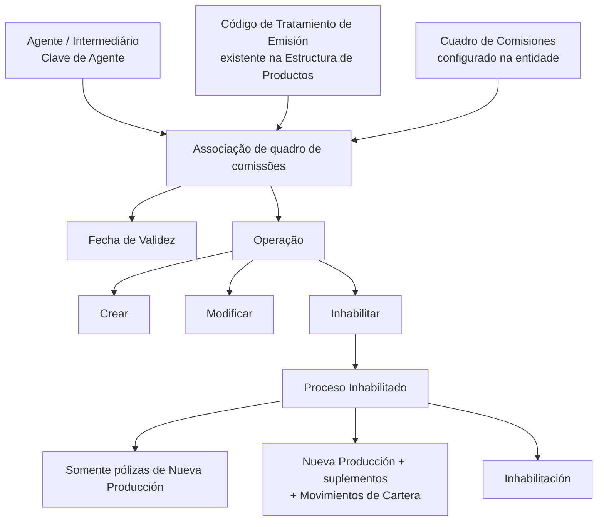

# Gestão de Quadros de Comissões para Agente no Reef.core

## 1. Metadados do Documento
- **Arquivo de Origem:** Não identificado no conteúdo fornecido
- **Tipo de Documento:** Manual Operacional
- **Domínio / Sistema:** Reef.core — gestão de comissões de agentes
- **Público-Alvo:** Operação, negócio e usuários responsáveis pela configuração de agentes
- **Data/Versão Identificada:** Não identificada

---

## 2. Resumo Executivo & Contexto de Negócio

O documento descreve a operação de gestão de **Cuadros de Comisiones** — quadros de comissões — associados a um agente no sistema Reef.core. A operação permite criar novos quadros de comissões para uso no cálculo de comissões sobre a comercialização de apólices, além de modificar ou inabilitar associações previamente habilitadas para o agente.

A configuração relaciona três elementos centrais: a chave do agente ou intermediário, um código de tratamento de emissão existente na estrutura de produtos da entidade e uma chave de quadro de comissões configurada na entidade. Essa associação determina qual quadro poderá ser empregado para determinado tratamento de emissão do agente.

O processo contempla regras de inabilitação com impacto distinto entre movimentos de **Nueva Producción** e movimentos relacionados à **Cartera**. O campo `Proceso Inhabilitado` determina o escopo da inabilitação, enquanto o campo `Inhabilitación` efetiva a indisponibilidade do quadro de comissões para o agente e tratamento definidos.

A `Fecha de Validez` permite controlar a data a partir da qual a associação entre agente, tratamento de emissão e quadro de comissões fica habilitada no sistema. Segundo o documento, esse mecanismo suporta o histórico das alterações efetuadas nas definições configuradas.

---

## 3. Arquitetura, Componentes & Tecnologias Envolvidas

| Componente / Entidade | Papel descrito no documento |
| :--- | :--- |
| **Reef.core** | Sistema no qual são configurados os tratamentos de emissão, quadros de comissões e associações aplicáveis a agentes. |
| **Agente / Intermediário** | Entidade identificada por uma chave e que pode utilizar quadros de comissões no cálculo de comissões de apólices comercializadas. |
| **Estructura de Productos de la Entidad** | Estrutura da entidade que contém os tratamentos de emissão existentes e válidos para associação. |
| **Código de Tratamiento de Emisión** | Chave de um tratamento de emissão existente na estrutura de produtos da entidade. |
| **Cuadro de Comisiones** | Chave de quadro de comissões configurado na entidade e associado ao agente e ao tratamento de emissão. |
| **Proceso Inhabilitado** | Definição do escopo de impacto de uma inabilitação: somente nova produção ou nova produção, suplementos e movimentos de carteira. |
| **Inhabilitación** | Campo cujo check indica que o quadro de comissões do agente, para o tratamento definido, está inabilitado. |
| **Fecha de Validez** | Data a partir da qual a associação configurada pode ser utilizada no sistema. |



> **Nota de Análise:** O documento não detalha métodos HTTP, contratos JSON, banco de dados, interfaces, APIs, autenticação, integrações externas ou tecnologias de infraestrutura do Reef.core.

---

## 4. Regras de Negócio, Especificações Funcionais & Processos

### Operações permitidas

A operação de gestão de quadros de comissões para agente prevê três ações:

1. **CREAR:** criar novos quadros de comissões que poderão ser empregados pelo agente no cálculo das comissões relativas à comercialização de suas apólices.
2. **MODIFICAR:** alterar quadros de comissões que o agente possua previamente habilitados.
3. **INHABILITAR:** inabilitar quadros de comissões previamente habilitados para o agente.

### Sequência de captura de atributos

O documento determina que os atributos do bloco de informação `Cuadros de Comisiones (GDC)` seguem uma sequência de captura da esquerda para a direita e de cima para baixo:

1. `Clave de Agente`
2. `Código de Tratamiento de Emisión`
3. `Cuadro de Comisiones`
4. `Proceso Inhabilitado`
5. `Inhabilitación`
6. `Fecha de Validez`

### Regras da associação de comissões

- A `Clave de Agente` identifica a chave do intermediário conforme definição previamente realizada no sistema.
- O `Código de Tratamiento de Emisión` deve conter uma das chaves dos tratamentos de emissão Reef.core existentes na estrutura de produtos da entidade.
- O `Cuadro de Comisiones` identifica uma das chaves dos quadros de comissões configurados na entidade.
- A associação configurada vincula agente, código de tratamento de emissão e quadro de comissões.

### Regras de inabilitação

- O campo `Proceso Inhabilitado` define se a inabilitação do quadro de comissões do agente, para o tratamento de emissão definido:
  - afeta somente apólices de **Nueva Producción**; ou
  - afeta movimentos de **Nueva Producción**, suplementos emitidos sobre essas apólices e **Movimientos de Cartera**.
- O check do campo `Inhabilitación` implica que o quadro de comissões do agente, para o tratamento definido, fica inabilitado para utilização.
- A inabilitação deve ser coerente com o valor informado em `Proceso Inhabilitado`.

### Regras de vigência e histórico

- A `Fecha de Validez` determina a data a partir da qual a associação entre agente, código de tratamento e quadro de comissões fica habilitada no sistema.
- O uso correto da `Fecha de Validez` permite manter histórico das alterações realizadas nas definições configuradas.

### Conceitos de comissão

- **Comissões de Nueva Producción:** comissões percebidas exclusivamente durante o primeiro ano de vigência da apólice. O documento informa que, em geral, esse tipo de comissão possui valor mais elevado para estimular a captação de novas operações.
- **Comissões de Cartera:** comissões originadas na carteira de quem as recebe, associadas a apólices vigentes em anos subsequentes. Essas comissões existem enquanto as apólices subscritas por meio da gestão comercial do agente permanecerem vigentes.

---

## 5. Tabelas de Parâmetros, Ambientes e Estruturas de Dados

| Item / Parâmetro | Descrição / Função | Tipo / Valores / Formato | Ambiente / Observações |
| :--- | :--- | :--- | :--- |
| `Clave de Agente` | Mostra e identifica a chave do intermediário. | Chave de agente; formato não detalhado. | Deve estar previamente definida no sistema. |
| `Código de Tratamiento de Emisión` | Identifica o tratamento de emissão aplicável à associação. | Chave de tratamento de emissão; formato não detalhado. | Deve corresponder a um tratamento de emissão Reef.core existente na estrutura de produtos da entidade. |
| `Cuadro de Comisiones` | Identifica o quadro de comissões associado ao agente. | Chave de quadro de comissões; formato não detalhado. | O quadro deve estar configurado na entidade. |
| `Proceso Inhabilitado` | Define o alcance operacional da inabilitação do quadro de comissões. | Valores descritos conceitualmente: somente Nueva Producción; ou Nueva Producción, suplementos e Movimientos de Cartera. | O documento não informa valores codificados, tipo de campo ou enumerações. |
| `Inhabilitación` | Inabilita o quadro de comissões do agente para o tratamento definido. | Campo de check. | Deve estar em coerência com o valor de `Proceso Inhabilitado`. |
| `Fecha de Validez` | Define a data inicial de habilitação da associação no sistema. | Data; formato não detalhado. | Suporta histórico de alterações das definições configuradas. |
| `CREAR` | Cria novos quadros de comissões para utilização pelo agente. | Ação operacional. | Associada ao cálculo de comissões na comercialização de apólices. |
| `MODIFICAR` | Altera quadros de comissões previamente habilitados para o agente. | Ação operacional. | O documento não detalha restrições de modificação. |
| `INHABILITAR` | Inabilita quadros de comissões previamente habilitados para o agente. | Ação operacional. | O impacto depende de `Proceso Inhabilitado`. |

---

## 6. Bateria de Perguntas & Respostas para RAG (FAQ Sintético)

### P1: Qual é o objetivo da operação de gestão de Cuadros de Comisiones para o agente no Reef.core?
**R:** A operação permite criar novos quadros de comissões que podem ser utilizados pelo agente no cálculo de comissões sobre a comercialização de suas apólices. Também permite modificar ou inabilitar quadros de comissões que o agente possua previamente habilitados.

### P2: Quais são as ações disponíveis na operação de Cuadros de Comisiones?
**R:** As ações disponíveis são `CREAR`, `MODIFICAR` e `INHABILITAR`. Criar adiciona novos quadros de comissões para uso do agente; modificar altera quadros previamente habilitados; e inabilitar torna indisponível um quadro de comissões para o agente e tratamento definidos.

### P3: Qual é a sequência de captura dos atributos no bloco Cuadros de Comisiones (GDC)?
**R:** A sequência indicada é: `Clave de Agente`, `Código de Tratamiento de Emisión`, `Cuadro de Comisiones`, `Proceso Inhabilitado`, `Inhabilitación` e `Fecha de Validez`. O documento estabelece que a sequência deve ser seguida da esquerda para a direita e de cima para baixo.

### P4: Qual validação deve ser aplicada ao Código de Tratamiento de Emisión?
**R:** O Código de Tratamiento de Emisión deve conter uma chave de tratamento de emissão Reef.core existente na Estructura de Productos de la Entidad. O documento não informa o formato técnico da chave nem os valores permitidos.

### P5: O que identifica o campo Cuadro de Comisiones?
**R:** O campo Cuadro de Comisiones identifica no sistema uma das chaves dos quadros de comissões configurados na entidade. Essa chave é associada ao agente e ao código de tratamento de emissão.

### P6: Qual é o efeito do campo Proceso Inhabilitado?
**R:** O campo Proceso Inhabilitado determina se a inabilitação do quadro de comissões do agente afetará apenas apólices de Nueva Producción ou se afetará movimentos de Nueva Producción, suplementos emitidos sobre essas apólices e Movimientos de Cartera.

### P7: O que acontece quando o campo Inhabilitación está marcado?
**R:** Quando o check de Inhabilitación está marcado, o quadro de comissões do agente para o tratamento definido fica inabilitado para uso. Essa inabilitação deve ser coerente com o escopo informado no campo Proceso Inhabilitado.

### P8: Para que serve a Fecha de Validez na associação de agente, tratamento e quadro de comissões?
**R:** A Fecha de Validez estabelece a data a partir da qual a associação entre agente, código de tratamento e quadro de comissões fica habilitada no sistema para utilização. O documento informa que seu uso correto permite manter um histórico das alterações nas definições configuradas.

### P9: O que são comissões de Nueva Producción no Reef.core?
**R:** As comissões de Nueva Producción são percebidas exclusivamente durante o primeiro ano de vigência da apólice. O documento informa que esse tipo de comissão geralmente possui valor mais elevado para estimular a captação de novas operações.

### P10: O que são comissões de Cartera no Reef.core?
**R:** As comissões de Cartera são originadas na carteira de quem as percebe, correspondendo a apólices vigentes em anos subsequentes. Essas comissões existem enquanto as apólices subscritas por meio da gestão comercial do agente permanecerem vigentes.

### P11: O documento define os valores técnicos aceitos pelo campo Proceso Inhabilitado?
**R:** Não. O documento descreve os dois escopos funcionais possíveis — somente Nueva Producción ou Nueva Producción com suplementos e Movimientos de Cartera — mas não informa códigos, valores booleanos, enumerações, formato de campo ou regras de persistência.

---

## 7. Glossário de Termos, Siglas & Conceitos-Chave

- **Reef.core:** Sistema citado como origem dos tratamentos de emissão existentes na estrutura de produtos da entidade.
- **GDC:** Sigla apresentada junto de `Cuadros de Comisiones`; o documento não fornece expansão adicional além dessa associação.
- **Agente / Intermediário:** Entidade identificada por uma chave e relacionada ao uso de quadros de comissões.
- **Cuadro de Comisiones:** Configuração identificada por chave, utilizada no cálculo das comissões de apólices comercializadas pelo agente.
- **Código de Tratamiento de Emisión:** Chave de um tratamento de emissão existente na estrutura de produtos da entidade.
- **Nueva Producción:** Comissões geradas exclusivamente durante o primeiro ano de vigência da apólice.
- **Cartera:** Comissões associadas a apólices vigentes em anos subsequentes, existentes enquanto as apólices vinculadas à gestão comercial do agente estiverem vigentes.
- **Movimientos de Cartera:** Movimentos relacionados à carteira; o documento não detalha os tipos de movimento.
- **Suplementos:** Suplementos emitidos sobre apólices de Nueva Producción; o documento não detalha seus tipos ou efeitos.
- **Fecha de Validez:** Data a partir da qual a associação configurada fica habilitada para uso no sistema.

---

## 8. Notas Críticas, Riscos & Limitações

- O documento não identifica o arquivo de origem, data, versão, autor técnico ou histórico de revisões.
- Não são apresentados formato, domínio de valores, obrigatoriedade, tamanho ou mecanismo de validação técnica dos campos.
- O documento não informa como são persistidas as associações entre agente, tratamento de emissão e quadro de comissões.
- Não há detalhamento sobre permissões de usuário, trilha de auditoria, aprovação, reversão de inabilitações ou tratamento de erros.
- Não são especificadas APIs, métodos HTTP, contratos JSON, bancos de dados, endpoints, logs ou ambientes.
- O campo `Proceso Inhabilitado` possui descrição funcional, mas não possui valores codificados documentados.
- O documento menciona suplementos e Movimientos de Cartera, porém não detalha a classificação ou o comportamento operacional de cada tipo de movimento.
- **Nota de Análise:** O conteúdo descreve a configuração funcional de quadros de comissões, mas não detalha a fórmula de cálculo das comissões nem a forma como o Reef.core aplica o quadro selecionado às apólices.

---

## 9. Conteúdo Bruto Estruturado (Referência Fiel)

```text
--- [PÁGINA 1 DE 2] ---

MODIFICAR Cuadros de Comisiones para el Agente
Objetivo
Esta Operación permite Crear nuevos cuadros de comisiones que pueden ser empleados por el Agente para el cálculo de las comisiones en
la comercialización de sus pólizas además de Modicar o Inhabilitar los que tuviera el Agente previamente habilitados.
Posibles Acciones
 CREAR ( )  MODIFICAR ( )  INHABILITAR ( )
Cuadros de Comisiones (GDC)
De Izquierda a Derecha y de Arriba hacia Abajo, los siguientes atributos marcan la secuencia de captura en este Bloque de Información.
Clave de Agente (  )
Esta propiedad muestra e identica la clave del intermediario de acuerdo con la denición de las mismas previamente realizada en el
Sistema.
Código de Tratamiento de Emisión (  )
Este atributo ha de contener una de las claves de los Tratamientos de Emisión de Reef.core existentes en la Estructura de Productos de la
Entidad.
Cuadro de Comisiones (  )
Este dato identica en el sistema una de las claves de los Cuadros de Comisiones congurados en la entidad.
Proceso Inhabilitado (   )
Este campo establece si la inhabilitación del Cuadro de Comisiones del Agente para el tratamiento de emisión denido va a afectar
únicamente a las pólizas de Nueva Producción o afecta tanto a los Movimientos de Nueva Producción como a los suplementos emitidos
sobre ellas o Movimientos de Cartera.
Documentation / DOCUMENTACIÓN Reef
DOCUMENTACIÓN Reef
Mapfredocument
DOCUMENTACIÓN Reef
Owner
user:agonzalez_mapfre.com
Lifecycle
Approved Source
 / 
 VL
Buscar Inicio Soluciones Arquitecturas APIs Componentes Cloud Documentación Zeus Reef Ayuda
ES


--- [PÁGINA 2 DE 2] ---

Inhabilitación (  )
El Check sobre este campo implica que el Cuadro de Comisiones del Agente y para el Tratamiento denido está inhabilitado para poder ser
empleado (en coherencia con el valor del Proceso Inhabilitado que se haya indicado)
Fecha de Validez ( )
Esta propiedad establece la fecha a partir de la cual la asociación del Agente al Código del Tratamiento y al Cuadro de Comisiones está
habilitado en el sistema para ser utilizada por lo que su correcto uso permite tener un histórico de los cambios efectuados en las deniciones
conguradas.
Preguntas frecuentes
(1) ¿Qué implican en Reef.core los Términos Nueva Producción y Cartera?
Atendiendo al momento temporal en el que se generan las comisiones en el proceso de emisión, puede establecerse la siguiente
clasicación:
Las Comisiones de nueva producción son aquellas que se perciben exclusivamente durante el primer año de vigencia de la póliza.
Generalmente y a n de estimular la labor de captación de nuevas operaciones, este tipo de comisión suele ser de importe más elevado que
la de cartera.
Las Comisiones de cartera en cambio tienen su origen en la cartera de quien la percibe (pólizas vigentes en años sucesivos) y son
comisiones que existen mientras tengan vigencia las pólizas suscritas a través de la gestión comercial del agente.
```
