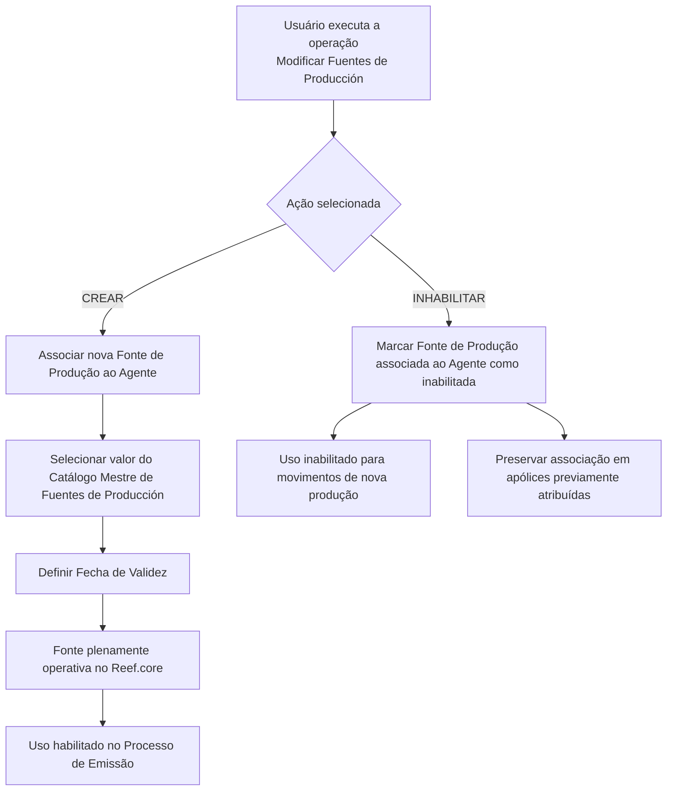

# Modificar Fuentes de Producción para el Agente — Documentación Reef

## 1. Metadados do Documento
- **Arquivo de Origem:** Não identificado no conteúdo extraído
- **Tipo de Documento:** Procedimento
- **Domínio / Sistema:** Reef.core / Processo de Emissão / Gestão de Agentes
- **Público-Alvo:** Operação, usuários de negócio e equipes responsáveis pela manutenção de dados de agentes
- **Data/Versão Identificada:** Não identificada
- **Lifecycle Identificado:** Approved Source
- **Owner Identificado:** `user:agonzalez_mapfre.com`

---

## 2. Resumo Executivo & Contexto de Negócio

O documento descreve a operação **“Modificar Fuentes de Producción para el Agente”** no sistema **Reef.core**. A operação permite administrar as fontes de produção associadas a um agente, incluindo a criação de novas fontes complementares e a inabilitação de fontes previamente habilitadas.

As fontes de produção são utilizadas no contexto do **Processo de Emissão**. Cada fonte associada a um agente possui uma data de validade que define a partir de quando a fonte está plenamente operativa e apta para utilização no processo de emissão.

A inabilitação de uma fonte de produção restringe o uso dessa fonte em movimentos de **nova produção**. Entretanto, o documento determina que apólices que já possuíam a fonte previamente atribuída continuam respeitando essa associação.

A captura dos atributos do bloco de informação deve seguir a sequência visual definida pelo formulário: da esquerda para a direita e de cima para baixo. O conteúdo não detalha APIs, contratos JSON, permissões, validações adicionais ou métodos técnicos de integração.

---

## 3. Arquitetura, Componentes & Tecnologias Envolvidas

Os componentes e conceitos identificados são:

- **Reef.core:** sistema no qual o campo de data de validade é mantido.
- **Agente:** entidade à qual as fontes de produção são associadas.
- **Fonte de Produção:** valor associado ao agente, selecionado a partir do catálogo mestre de fontes de produção existente no sistema.
- **Catálogo Mestre de Fuentes de Producción:** origem dos valores válidos para a associação.
- **Processo de Emissão:** processo que utiliza fontes de produção operativas.
- **Movimentos de Nova Produção:** movimentos para os quais uma fonte inabilitada deixa de ser utilizada.
- **Apólices previamente atribuídas:** apólices que preservam a fonte de produção já associada, mesmo após inabilitação.



---

## 4. Regras de Negócio, Especificações Funcionais & Processos

### Objetivo da operação

A operação permite:

1. Criar novas fontes de produção complementares para um agente.
2. Inabilitar fontes de produção que já estavam habilitadas para o agente.

### Ações possíveis

As ações explicitamente listadas no documento são:

- **CREAR:** criar uma nova fonte de produção associada ao agente.
- **INHABILITAR:** inabilitar uma fonte de produção previamente associada ao agente.

### Sequência de captura

Os atributos do bloco **Fuentes de Producción** devem ser preenchidos na seguinte ordem:

1. Da esquerda para a direita.
2. De cima para baixo.

### Fonte de Produção

O campo **Fuente de Producción** deve conter uma das fontes de produção que o agente terá associadas. Os valores disponíveis devem obedecer à relação de valores existente no catálogo mestre de fontes de produção do sistema.

### Data de Validade

O campo **Fecha de Validez** determina, no Reef.core, a data a partir da qual a fonte de produção associada ao agente:

- Está plenamente operativa.
- Fica habilitada para utilização no Processo de Emissão.

### Inabilitação

O campo **Inhabilitación** indica que a fonte de produção associada ao agente está inabilitada no sistema.

Quando uma fonte de produção é inabilitada:

- O uso da fonte fica inabilitado no Processo de Emissão para movimentos de nova produção.
- A fonte permanece respeitada em apólices que já possuíam essa fonte previamente atribuída.

---

## 5. Tabelas de Parâmetros, Ambientes e Estruturas de Dados

| Item / Parâmetro | Descrição / Função | Tipo / Valores / Formato | Ambiente / Observações |
| :--- | :--- | :--- | :--- |
| Operação | Administração das fontes de produção de um agente | Modificar Fuentes de Producción para el Agente | Permite criar fontes complementares e inabilitar fontes habilitadas previamente |
| Ação | Define a operação a executar sobre as fontes de produção | `CREAR` ou `INHABILITAR` | O documento não detalha regras adicionais de seleção |
| Fuente de Producción | Fonte de produção associada ao agente | Valor existente no catálogo mestre de Fuentes de Producción | O agente pode ter fontes associadas conforme a relação do catálogo mestre |
| Fecha de Validez | Data a partir da qual a fonte associada fica plenamente operativa | Data; formato não especificado | No Reef.core, habilita o uso da fonte no Processo de Emissão |
| Inhabilitación | Marca a fonte associada ao agente como inabilitada | Campo de marcação; formato não especificado | Inabilita uso para nova produção, preservando apólices previamente atribuídas |
| Catálogo Mestre de Fuentes de Producción | Catálogo que fornece os valores de fonte de produção | Catálogo de sistema | Referência obrigatória para o campo Fuente de Producción |
| Processo de Emissão | Processo que utiliza a fonte de produção operativa | Processo de negócio | Fonte fica utilizável após a data de validade |
| Movimentos de Nova Produção | Movimentos para os quais uma fonte inabilitada não pode ser usada | Processo de negócio | Restrição aplicada após inabilitação |
| Apólices previamente atribuídas | Apólices que já tinham a fonte associada | Apólices existentes | A associação prévia é respeitada após inabilitação |
| Sistema | Plataforma citada para a vigência operacional da fonte | Reef.core | Não há versão técnica identificada |
| Lifecycle | Estado de ciclo de vida exibido no conteúdo | `Approved Source` | Metadado documental |
| Owner | Proprietário identificado no conteúdo | `user:agonzalez_mapfre.com` | Metadado documental |

---

## 6. Bateria de Perguntas & Respostas para RAG (FAQ Sintético)

### P1: Qual é o objetivo da operação “Modificar Fuentes de Producción para el Agente”?
**R:** A operação permite criar novas fontes de produção complementares para um agente e inabilitar fontes de produção que estavam previamente habilitadas para esse agente.

### P2: Quais ações estão disponíveis na operação de fontes de produção do agente?
**R:** O documento lista duas ações possíveis: `CREAR`, para criar uma nova fonte de produção associada ao agente, e `INHABILITAR`, para inabilitar uma fonte de produção já habilitada.

### P3: De onde vêm os valores permitidos para o campo Fuente de Producción?
**R:** O campo Fuente de Producción deve conter uma das fontes de produção associadas ao agente de acordo com os valores existentes no catálogo mestre de Fuentes de Producción do sistema.

### P4: Qual é a finalidade do campo Fecha de Validez no Reef.core?
**R:** No Reef.core, o campo Fecha de Validez contém a data a partir da qual a fonte de produção associada ao agente está plenamente operativa e passa a estar habilitada para uso no Processo de Emissão.

### P5: O que ocorre quando uma fonte de produção é inabilitada?
**R:** A inabilitação marca a fonte de produção associada ao agente como inabilitada no sistema e impede seu uso no Processo de Emissão para movimentos de nova produção.

### P6: A inabilitação de uma fonte altera apólices que já tinham essa fonte atribuída?
**R:** Não. O documento determina que a fonte permanece respeitada nas apólices que a possuíam previamente atribuída, mesmo que fique inabilitada para movimentos de nova produção.

### P7: Qual é a ordem de preenchimento dos atributos no bloco Fuentes de Producción?
**R:** Os atributos devem ser capturados da esquerda para a direita e de cima para baixo.

### P8: Uma fonte de produção pode ser usada no Processo de Emissão antes da Fecha de Validez?
**R:** O documento informa que a fonte passa a estar plenamente operativa e habilitada para uso no Processo de Emissão a partir da Fecha de Validez. Não há detalhamento adicional sobre uso anterior a essa data.

### P9: O documento detalha APIs, métodos HTTP ou contratos JSON para modificar fontes de produção?
**R:** Não. O conteúdo descreve regras funcionais e campos do procedimento, mas não apresenta APIs, métodos HTTP, contratos JSON, endpoints ou especificações de integração técnica.

### P10: Qual sistema é citado como responsável pela vigência operacional da fonte de produção?
**R:** O sistema citado é o Reef.core, no qual a Fecha de Validez estabelece quando a fonte de produção associada ao agente fica plenamente operativa.

---

## 7. Glossário de Termos, Siglas & Conceitos-Chave

- **Reef.core:** Sistema citado no documento como o local em que a data de validade determina a operação plena da fonte de produção.
- **Agente:** Entidade à qual uma ou mais fontes de produção podem ser associadas.
- **Fuente de Producción:** Fonte de produção associável a um agente e utilizada no Processo de Emissão.
- **Catálogo Mestre de Fuentes de Producción:** Catálogo do sistema que contém a relação de valores disponíveis para fontes de produção.
- **Fecha de Validez:** Data a partir da qual uma fonte de produção associada ao agente fica plenamente operativa.
- **Inhabilitación:** Marca de inabilitação de uma fonte de produção associada ao agente.
- **Processo de Emissão:** Processo no qual uma fonte de produção operacional pode ser utilizada.
- **Movimentos de Nova Produção:** Movimentos do Processo de Emissão para os quais fontes inabilitadas não podem ser utilizadas.
- **Apólice:** Registro que pode preservar a associação anterior a uma fonte de produção após sua inabilitação.
- **CREAR:** Ação disponível para criar uma fonte de produção complementar.
- **INHABILITAR:** Ação disponível para inabilitar uma fonte de produção previamente habilitada.
- **VL:** Sigla exibida no conteúdo extraído sem definição adicional.

---

## 8. Notas Críticas, Riscos & Limitações

- **Nota de Análise:** O documento não identifica o nome do arquivo de origem, data, versão ou autor editorial além do campo `Owner`.
- **Nota de Análise:** O documento não especifica o formato aceito pelo campo Fecha de Validez.
- **Nota de Análise:** O documento não detalha critérios de validação para criação ou inabilitação de fontes de produção.
- **Nota de Análise:** O documento não descreve permissões, perfis de acesso, trilha de auditoria ou mecanismos de reversão de uma inabilitação.
- **Nota de Análise:** O documento não apresenta APIs, endpoints, contratos JSON, bancos de dados, logs, servidores, URLs de ambiente ou integrações técnicas.
- **Risco Operacional:** A inabilitação impacta movimentos de nova produção; a operação deve considerar que apólices com associação prévia mantêm a fonte previamente atribuída.
- **Dependência Funcional:** A associação de fontes de produção depende dos valores existentes no catálogo mestre de Fuentes de Producción.

---

## 9. Conteúdo Bruto Estruturado (Referência Fiel)

```text
--- [PÁGINA 1 DE 1] ---

MODIFICAR Fuentes de Producción para el Agente
Objetivo
Esta Operación permite Crear nuevas fuentes de producción complementarias además de Inhabilitar las que tuviera previamente habilitadas
el Agente.
Posibles Acciones
 CREAR ( )  INHABILITAR ( )
Fuentes de Producción
De Izquierda a Derecha y de Arriba hacia Abajo, los siguientes atributos marcan la secuencia de captura en este Bloque de Información.
Fuente de Producción (  )
Este Campo contendrá Una de las Fuentes de Producción que el Agente tendrá asociadas de acuerdo con la relación de valores existentes en
el catálogo maestro de Fuentes de Producción existente en el Sistema.
Fecha de Validez ( )
El valor de este campo en Reef.core contiene la fecha a partir de la cual la Fuente de Producción asociada al Agente está plenamente
operativa y se habilita por tanto su uso en el Proceso de Emisión.
Inhabilitación (  )
Este Campo marca que la Fuente de Producción asociada al Agente está inhabilitada en el Sistema y por tanto se inhabilita su uso en el
Proceso de Emisión para los movimientos de nueva producción (respetándose en cambio en aquellas pólizas que la tuvieran previamente
asignada).
Documentation / DOCUMENTACIÓN Reef
DOCUMENTACIÓN Reef
Mapfredocument
DOCUMENTACIÓN Reef
Owner
user:agonzalez_mapfre.com
Lifecycle
Approved Source
 / 
 VL
Buscar Inicio Soluciones Arquitecturas APIs Componentes Cloud Documentación Zeus Reef Ayuda
ES
```
