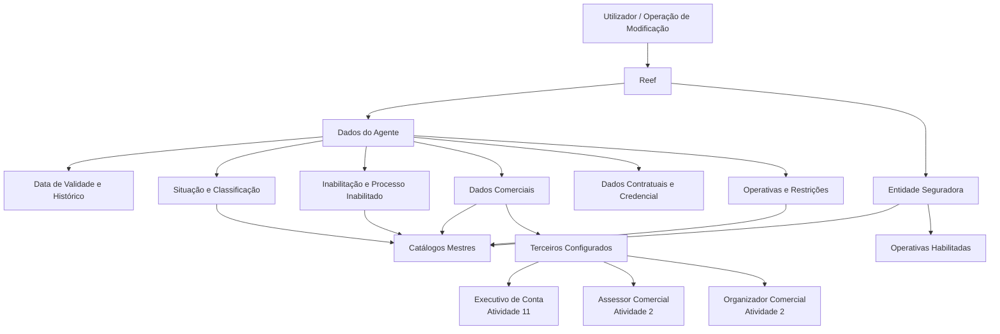

# Modificação e Inabilitação de Informações de Agentes no Reef

## 1. Metadados do Documento
- **Arquivo de Origem:** Não identificado
- **Tipo de Documento:** Especificação Funcional
- **Domínio / Sistema:** Reef / gestão de Agentes de entidade seguradora
- **Público-Alvo:** Negócio, operação, analistas funcionais e desenvolvedores
- **Data/Versão Identificada:** Não identificada

---

## 2. Resumo Executivo & Contexto de Negócio

O documento descreve a operação de **modificar informações previamente registadas de um Agente** no sistema Reef e a possibilidade de **inabilitar** esse Agente. A configuração apresentada abrange dados operacionais, comerciais, contratuais, de classificação e de elegibilidade para processos da entidade seguradora.

A funcionalidade suporta a manutenção do histórico de alterações por meio da **Data de Validade**, que determina a data a partir da qual o Agente está plenamente operacional no sistema. A documentação também define atributos que regulam a participação do Agente em processos como nova produção, suplementos de carteira, recebimento de prémios e liquidação de comissões.

Diversos atributos dependem de catálogos mestres configurados no sistema, incluindo classificações, tipos de intermediários, escritórios comerciais, fontes de produção, tipos de retenção, formas de compensação, códigos de qualidade, códigos de envio e agrupamentos comerciais.

O documento estabelece restrições explícitas para a atribuição de perfis comerciais: o **Executivo de Conta** deve ser um Terceiro com Código de Atividade 11; o **Assessor Comercial** e o **Organizador Comercial** devem ser Terceiros com Código de Atividade 2. Também exige coerência total entre a Forma de Gestão atribuída e as operações habilitadas ao Agente.

---

## 3. Arquitetura, Componentes & Tecnologias Envolvidas

Os componentes e conceitos explicitamente citados são:

- **Sistema Reef:** ambiente documental e funcional onde a operação é descrita.
- **Operação de modificação de Agente:** permite modificar dados e inabilitar um Agente.
- **Agente:** entidade cuja informação comercial, contratual e operacional é configurada.
- **Entidade Seguradora:** responsável por definir catálogos, diretrizes comerciais, operações habilitadas e regras locais.
- **Catálogos mestres do sistema:** fontes de valores para atributos como classificação, tipos de intermediários, escritórios comerciais e formas de compensação.
- **Catálogo corporativo no núcleo do sistema:** origem dos Códigos de Envio.
- **Terceiros configurados no sistema:** referência obrigatória para Executivo de Conta, Assessor Comercial e Organizador Comercial.



> **Nota de Análise:** o documento descreve atributos funcionais e suas dependências de catálogo, mas não detalha interfaces, métodos HTTP, contratos JSON, base de dados, autenticação ou integrações técnicas externas.

---

## 4. Regras de Negócio, Especificações Funcionais & Processos

### Operações disponíveis

A operação disponibiliza duas ações possíveis:

1. **MODIFICAR:** alterar informações previamente registadas do Agente.
2. **INHABILITAR:** marcar o Agente como inabilitado no sistema.

### Sequência de captura

Os dados do Agente seguem uma sequência de captura definida de **esquerda para direita** e de **cima para baixo**. Quando não existir indicação expressa em contrário, os atributos aplicam-se tanto a:

- Pessoas Físicas.
- Pessoas Jurídicas.

### Regras de validade e histórico

- A **Data de Validade** indica a partir de qual data o Agente está plenamente operacional no sistema.
- A utilização correta da Data de Validade permite à entidade seguradora manter um histórico das alterações efetuadas na configuração e nas informações dos Agentes.

### Regras de qualificação comercial

- A ativação de **Produtor Direto** qualifica o Agente como Produtor Direto.
- A **Situação** atribui um código ao Agente para uso transversal nos processos da companhia, conforme a conveniência analisada pela entidade seguradora.
- A **Classificação** do Agente deve corresponder a um valor existente no catálogo mestre de Classificações.
- O **Tipo de Agente** deve corresponder a uma tipologia existente no catálogo mestre de Tipos de Intermediários.
- A **Qualidade do Agente** deve corresponder a uma classificação qualitativa disponível no catálogo mestre de Códigos de Qualidade.
- O **Tipo de Classificação** permite associar um código de Agrupamento que classifica e complementa as informações habilitadas no núcleo do sistema.

### Regras de inabilitação

- Quando o atributo **Inabilitação** estiver ativo, o Agente fica inabilitado no sistema.
- A partir da inabilitação, o Agente não deve ser utilizado, considerado ou contemplado em parte ou na totalidade dos processos operacionais da entidade.
- Quando o Agente estiver inabilitado, a **Causa de Inabilitação** deve conter um código definido no catálogo mestre de Causas de Inabilitação.
- O atributo **Processo Inabilitado** determina se o Agente está inabilitado:
  - Apenas para comercializar apólices e aplicações de Nova Produção; ou
  - Para intermediar apólices e aplicações de Nova Produção e também suplementos da carteira das suas apólices e aplicações.

### Regras de atribuição comercial

- A **Oficina Comercial por Defeito** deve ser selecionada no catálogo mestre de Oficinas Comerciais previamente definido na estrutura comercial da companhia.
- O **Executivo de Conta** deve ser um código de Terceiro configurado no sistema com **Código de Atividade 11**.
- O **Assessor Comercial** deve ser um código de Terceiro configurado no sistema com **Código de Atividade 2**.
- O **Organizador Comercial** deve ser um código de Terceiro configurado no sistema com **Código de Atividade 2**.
- A **Fonte de Produção por Defeito** deve ser selecionada no catálogo mestre local de Fontes de Produção.
- O **Agrupamento Comercial do Agente** deve ser selecionado no catálogo mestre de Agrupamentos do sistema.

### Regras financeiras e operacionais

- O **Tipo de Retenção** contém o código de um Tipo de Retenção configurado localmente pela entidade seguradora.
- A **Exclusão de Comissões** exclui o Agente, por questões comerciais, do processo de pagamento da liquidação de comissões configurado na entidade.
- A **Forma de Cobro/Pago** deve corresponder a uma Forma de Compensação definida no catálogo mestre de Compensações.
- O atributo **Primas Avisadas** qualifica o Agente para estar, ou não, apto a realizar a sua operação, desde que a entidade seguradora tenha o conceito de Primas Avisadas operativo.
- O **Tipo de Envio** identifica o método pelo qual a entidade seguradora disponibiliza documentação ao Agente, por exemplo cópias de CC.PP. das suas apólices, segundo o catálogo mestre corporativo de Códigos de Envio.

### Regras contratuais e de credencial

- O **Contrato** é o código ou chave do contrato privado celebrado entre a entidade seguradora e o Agente.
- A **Data de Alta do Contrato** é a data de efeito do contrato que habilita comercialmente o Agente.
- A **Data de Vencimento do Contrato** é a data em que termina o contrato previamente celebrado.
- O **Número de Colegiación** contém a chave ou código da cédula profissional pela qual o Agente está habilitado a exercer como mediador de seguros, em razão de pertencer a um colégio profissional ou associação oficial semelhante.
- A **Data de Expedición de la Credencial** é a data de efeito da colegiação do Agente.
- A **Data de Vencimiento de la Credencial** é a data em que a colegiação do Agente termina.

### Regras de gestão

- **Observações** permite capturar informação adicional segundo orientações das Direções de Clientes ou Comercial da entidade seguradora.
- **Forma de Gestão** identifica a forma de gestão atribuída ao Agente segundo orientações das Direções de Clientes e Comercial.
- Deve existir **total coerência** entre as Formas de Gestão definidas e as operações habilitadas ao Agente pela entidade seguradora.

---

## 5. Tabelas de Parâmetros, Ambientes e Estruturas de Dados

| Item / Parâmetro | Descrição / Função | Tipo / Valores / Formato | Ambiente / Observações |
| :--- | :--- | :--- | :--- |
| Ação MODIFICAR | Modifica a informação previamente registada do Agente. | Ação operacional. | Operação de manutenção de Agente. |
| Ação INHABILITAR | Inabilita o Agente no sistema. | Ação operacional. | O Agente não deve ser usado ou considerado nos processos aplicáveis. |
| Data de Validade | Define quando o Agente está plenamente operativo. | Data. | Permite histórico de alterações de configuração e informação. |
| Produtor Direto | Qualifica o Agente como Produtor Direto. | Marca de ativação. | Aplicável na captura de informação do Agente. |
| Situação | Atribui um código de situação ao Agente. | Código. | Pode ser usado transversalmente nos processos da companhia. |
| Situação 1 | Agente Ativo. | Valor de Situação. | Valor apresentado quando o idioma de definição é espanhol. |
| Situação 2 | Agente Inativo. | Valor de Situação. | Valor apresentado quando o idioma de definição é espanhol. |
| Situação 3 | Agente Retirado. | Valor de Situação. | Valor apresentado quando o idioma de definição é espanhol. |
| Classificação | Classificação atribuída ao Agente. | Valor de catálogo mestre. | Catálogo mestre de Classificações configurado no sistema. |
| Inabilitação | Indica que o Agente está inabilitado no sistema. | Marca de ativação. | Restringe a utilização em processos operacionais. |
| Causa de Inabilitação | Identifica a causa da inabilitação. | Código de catálogo. | Preenchido quando o Agente estiver inabilitado. |
| Processo Inabilitado | Define o escopo operacional da inabilitação. | Opção operacional. | Nova Produção apenas, ou Nova Produção e Suplementos. |
| Tipo de Agente | Define a tipologia do Agente. | Valor de catálogo mestre. | Catálogo mestre de Tipos de Intermediários. |
| Oficina Comercial por Defeito | Define a oficina comercial atribuída por padrão. | Valor de catálogo mestre. | Catálogo de Oficinas Comerciais da estrutura comercial. |
| Executivo de Conta | Código do Executivo de Conta do Agente. | Código de Terceiro. | Deve possuir Código de Atividade 11. |
| Assessor Comercial | Código do Assessor Comercial do Agente. | Código de Terceiro. | Deve possuir Código de Atividade 2. |
| Organizador Comercial | Código do Organizador Comercial do Agente. | Código de Terceiro. | Deve possuir Código de Atividade 2. |
| Fonte de Produção por Defeito | Fonte de Produção atribuída por padrão ao Agente. | Valor de catálogo mestre. | Catálogo local de Fontes de Produção. |
| Tipo de Retenção | Código de um Tipo de Retenção. | Código configurado localmente. | Configurado pela entidade seguradora. |
| Exclusão de Comissões | Exclui o Agente do pagamento da liquidação de comissões. | Marca de ativação. | Aplicada por questões comerciais. |
| Forma de Cobro/Pago | Forma de cobrança ou pagamento do Agente. | Código de Forma de Compensação. | Catálogo mestre de Compensações. |
| Qualidade do Agente | Classificação qualitativa do Agente. | Valor de catálogo mestre. | Catálogo mestre de Códigos de Qualidade. |
| Tipo de Envio | Método de disponibilização de documentação ao Agente. | Chave de Código de Envio. | Catálogo corporativo no núcleo do sistema. |
| Agrupamento Comercial do Agente | Agrupação comercial atribuída ao Agente. | Valor de catálogo mestre. | Catálogo mestre de Agrupamentos do sistema. |
| Primas Avisadas | Qualifica o Agente para realizar a sua operação. | Marca de ativação. | Depende de a entidade ter o conceito operativo. |
| Contrato | Código ou chave do contrato privado entre entidade seguradora e Agente. | Código ou chave. | Contrato privado. |
| Data de Alta do Contrato | Data de efeito do contrato. | Data. | Habilita o exercício comercial do Agente. |
| Data de Vencimento do Contrato | Data de término do contrato. | Data. | Baixa do contrato celebrado previamente. |
| Número de Colegiación | Código da cédula profissional do mediador de seguros. | Chave ou código. | Relacionado à colegiação ou associação oficial. |
| Data de Expedición de la Credencial | Data de efeito da colegiação do Agente. | Data. | Credencial profissional. |
| Data de Vencimiento de la Credencial | Data de baixa da colegiação. | Data. | Credencial profissional. |
| Observações | Regista informação adicional sobre o Agente. | Texto. | Conforme diretrizes das áreas de Clientes ou Comercial. |
| Forma de Gestão | Identifica a forma de gestão atribuída ao Agente. | Código. | Deve ser coerente com as operações habilitadas. |
| AA1 | Não pode cobrar prémios. | Código de Forma de Gestão. | Exemplo apresentado em espanhol. |
| BB1 | Pode cobrar prémios. | Código de Forma de Gestão. | Exemplo apresentado em espanhol. |
| CC1 | Apenas para contas corporativas. | Código de Forma de Gestão. | Exemplo apresentado em espanhol. |
| Tipo de Classificação | Código de agrupamento que classifica e complementa a informação do Agente. | Código. | Complementa a informação habilitada no núcleo do sistema. |
| Classificação 1 | Agente Bom. | Valor de Tipo de Classificação. | Valor apresentado quando o idioma de definição é espanhol. |
| Classificação 2 | Agente Regular. | Valor de Tipo de Classificação. | Valor apresentado quando o idioma de definição é espanhol. |
| Classificação 3 | Agente Mau. | Valor de Tipo de Classificação. | Valor apresentado quando o idioma de definição é espanhol. |

---

## 6. Bateria de Perguntas & Respostas para RAG (FAQ Sintético)

### P1: Qual é o objetivo da operação descrita no documento?
**R:** A operação permite modificar a informação de um Agente previamente registada no sistema e também inabilitar esse Agente.

### P2: Para que serve a Data de Validade do Agente?
**R:** A Data de Validade indica a partir de quando o Agente está plenamente operativo no sistema. A sua utilização correta permite à entidade seguradora manter um histórico das alterações efetuadas na configuração e nas informações do Agente.

### P3: Quais são os valores de Situação do Agente quando o idioma de definição é espanhol?
**R:** Os valores apresentados são: `1` para Agente Ativo, `2` para Agente Inativo e `3` para Agente Retirado.

### P4: O que acontece quando um Agente é inabilitado?
**R:** A partir do momento da inabilitação, o Agente não deve ser utilizado, contemplado ou considerado em parte ou na totalidade dos processos operacionais da entidade seguradora.

### P5: Como o atributo Processo Inabilitado restringe a atuação do Agente?
**R:** O Processo Inabilitado define se o Agente fica impedido apenas de comercializar apólices e aplicações de Nova Produção ou se fica impedido de intermediar tanto Nova Produção como suplementos à carteira das suas apólices e aplicações.

### P6: Qual é a restrição para configurar um Executivo de Conta?
**R:** O código do Executivo de Conta deve ser um código de Terceiro configurado no sistema com Código de Atividade 11.

### P7: Quais são as restrições para configurar o Assessor Comercial e o Organizador Comercial?
**R:** Tanto o código do Assessor Comercial como o código do Organizador Comercial devem ser códigos de Terceiros configurados no sistema com Código de Atividade 2.

### P8: Qual é o efeito da Exclusão de Comissões?
**R:** A Exclusão de Comissões implica que a entidade seguradora exclui o Agente, por questões comerciais, do processo de pagamento da liquidação de comissões configurado na entidade.

### P9: Como é definida a Forma de Cobro/Pago do Agente?
**R:** A Forma de Cobro/Pago indica o código da forma de cobrança ou pagamento do Agente conforme as Formas de Compensação definidas no catálogo mestre de Compensações.

### P10: Qual é a finalidade do atributo Primas Avisadas?
**R:** Quando a entidade seguradora tiver o conceito de Primas Avisadas operativo, esse atributo qualifica o Agente para estar, ou não, em condições de realizar a sua operação.

### P11: O que representam as datas do contrato do Agente?
**R:** A Data de Alta do Contrato é a data de efeito que habilita o Agente a exercer comercialmente. A Data de Vencimento do Contrato é a data em que o contrato privado previamente celebrado entre a entidade seguradora e o Agente termina.

### P12: Que regra deve ser respeitada ao atribuir uma Forma de Gestão?
**R:** Deve existir total coerência entre as Formas de Gestão definidas e as operações habilitadas ao Agente pela entidade seguradora.

---

## 7. Glossário de Termos, Siglas & Conceitos-Chave

- **Agente:** entidade cuja informação comercial, contratual, operacional e classificatória é configurada no sistema.
- **Assessor Comercial:** Terceiro atribuído ao Agente; deve possuir Código de Atividade 2.
- **CC.PP.:** sigla apresentada como exemplo de documentação de apólices; o documento não fornece expansão.
- **Código de Atividade:** código de configuração exigido para determinados Terceiros: 11 para Executivo de Conta e 2 para Assessor Comercial e Organizador Comercial.
- **Códigos de Envio:** catálogo corporativo que identifica o método de disponibilização de documentação ao Agente.
- **Entidade Seguradora:** organização responsável por configurar catálogos, contratos, diretrizes comerciais e operações habilitadas.
- **Executivo de Conta:** Terceiro atribuído ao Agente; deve possuir Código de Atividade 11.
- **Forma de Gestão:** classificação de gestão atribuída ao Agente, que deve ser coerente com as operações habilitadas.
- **Inabilitação:** condição que impede o uso do Agente em parte ou na totalidade dos processos operacionais.
- **Nova Produção:** comercialização de apólices e aplicações novas; o documento não fornece detalhamento adicional.
- **Organizador Comercial:** Terceiro atribuído ao Agente; deve possuir Código de Atividade 2.
- **Primas Avisadas:** conceito que, quando operativo na entidade seguradora, qualifica o Agente para realizar ou não a sua operação.
- **Reef:** sistema ou domínio documental identificado no conteúdo fornecido.
- **Suplementos:** suplementos à carteira de apólices e aplicações do Agente; o documento não detalha a natureza operacional desses suplementos.
- **Terceiro:** entidade ou registo configurado no sistema e utilizado para atribuição de papéis comerciais.

---

## 8. Notas Críticas, Riscos & Limitações

- O documento não identifica o nome do arquivo, data, versão, autor formal ou ciclo de vida completo da especificação.
- Não são descritos métodos de acesso, ecrãs, APIs, serviços, contratos de dados, mecanismos de autenticação ou persistência.
- Os valores de Situação, Formas de Gestão e Tipos de Classificação são apresentados condicionalmente ao uso do espanhol como idioma de definição.
- Diversos atributos dependem de catálogos mestres, mas o documento não apresenta os catálogos completos nem os processos de manutenção desses valores.
- A configuração de Inabilitação pode afetar processos operacionais da entidade; a documentação não detalha controles de aprovação, auditoria, reversão ou propagação da inabilitação.
- A Forma de Gestão exige coerência total com as operações habilitadas, mas o documento não define uma matriz explícita de compatibilidade entre códigos de gestão e operações.
- **Nota de Análise:** o documento lista o sistema Reef e múltiplos atributos do Agente, porém não detalha fluxos técnicos, serviços, integrações ou contratos expostos.

---

## 9. Conteúdo Bruto Estruturado (Referência Fiel)

```text
--- [PÁGINA 1 DE 4] ---

MODIFICAR Información especíca del Agente
Objetivo
Esta Operación permite Modicar la información del Agente registrada previamente además de poder Inhabilitarlo.
Posibles Acciones
 MODIFICAR ( )
 INHABILITAR ( )
Datos Agente
De Izquierda a Derecha y de Arriba hacia Abajo, los siguientes atributos marcan la secuencia de captura de los Datos. Si no se especica o
indica expresamente, los Atributos se emplearán tanto en Personas Físicas como en Personas Jurídicas
Fecha de Validez ( )
Esta propiedad le indica al Sistema la fecha a partir de la cual el Agente está plenamente operativo en el sistema por lo que su empleo y
correcta utilización permite tener en la entidad Aseguradora un histórico de los cambios efectuados en la conguración e información de los
Agentes.
¿Productor Directo? ( )
La activación de esta marca en la captura de la información del Agente calica al Agente como Productor Directo.
Situación (  )
Documentation / DOCUMENTACIÓN Reef
DOCUMENTACIÓN Reef
Mapfredocument
DOCUMENTACIÓN Reef
Owner
user:agonzalez_mapfre.com
Lifecycle
Approved Source
 / 
 VL
Buscar Inicio Soluciones Arquitecturas APIs Componentes Cloud Documentación Zeus Reef Ayuda
ES

--- [PÁGINA 2 DE 4] ---

El sentido de este campo es asignar un código de situación al Agente para que la entidad aseguradora, tras haber analizado la conveniencia
de utilizarlo transversalmente en los procesos de la compañía, lo utilice adecuadamente en aquellos procesos que así lo puedan demandar.
Si el Idioma utilizado en la denición es el español, sus valores son:
TIPOS de SITUACIÓN DESCRIPCIÓN
1 Agente Activo
2 Agente Inactivo
3 Agente Retirado
Clasicación (  )
Este Campo contendrá la Clasicación que se le otorga al Agente de acuerdo con la relación de valores existentes en el catálogo maestro de
Clasicaciones congurado en el Sistema.
Inhabilitación ( )
Este Campo le indica al Sistema que el Agente está inhabilitado en el Sistema por lo que a partir del momento de su inhabilitación no debería
ser empleado, contemplado o considerado en parte o en todos los procesos operativos de la entidad.
Causa de Inhabilitación (   )
En el supuesto que el Agente estuviera Inhabilitado, este atributo del Agente contendrá el código de una Causa de Inhabilitación denida en el
catálogo maestro del Sistema.
Proceso Inhabilitado (   )
Este campo establece si el Agente está inhabilitado para comercializar pólizas o aplicaciones de Nueva Producción o bien está inhabilitado
para intermediar tanto pólizas y aplicaciones de Nueva Producción como Suplementos a la cartera de sus pólizas y aplicaciones.
Tipo de Agente (  )
Este dato contendrá la Tipología del Agente de acuerdo con la relación de valores existentes en el catálogo maestro de Tipos de
Intermediarios congurado en el Sistema.
Ocina Comercial por Defecto (  )
Este Campo contendrá la Ocina Comercial que el Agente va a tener asignada por defecto de acuerdo con la relación de valores existentes
en el catálogo maestro de Ocinas Comerciales denidas previamente en la estructura comercial de la Compañía.
Ejecutivo de Cuenta (  )
Este Campo contendrá el código del Ejecutivo de Cuenta al que estará asignado el Agente, de acuerdo con la relación existente en el catálogo
maestro de Agentes existente en el Sistema.
El Código del Ejecutivo de Cuenta ha de ser un código de Tercero congurado en el Sistema con el Código de Actividad 11.
Asesor Comercial (  )
Este Campo contendrá el código del Asesor Comercial que tendrá asignado el Agente, de acuerdo con la relación existente en el catálogo
maestro de Agentes existente en el Sistema.
Organizador Comercial (  )
Este Campo contendrá el código del Organizador Comercial al que estará asignado el Agente, de acuerdo con la relación existente en el
catálogo maestro de Agentes existente en el Sistema.
Ejecutivo de Cuenta

--- [PÁGINA 3 DE 4] ---

Tanto el Código del Asesor Comercial como el Código del Organizador Comercial han de ser códigos de Terceros congurados en el
Sistema con el Código de Actividad 2.
Fuente de Producción por Defecto (  )
Este Campo contendrá la Fuente de Producción por defecto que el Agente va a tener asignada de acuerdo con la relación de valores
existentes en el catálogo maestro de Fuentes de Producción conguradas localmente.
Tipo de Retención (  )
Este Dato contiene el código de uno de los Tipos de Retención congurados localmente por la Entidad Aseguradora.
Exclusión de Comisiones ( )
Este atributo implica que la entidad Aseguradora excluye por cuestiones comerciales al Agente del Proceso de Pago de la Liquidación de
Comisiones congurado en la Entidad.
Forma de Cobro/Pago (  )
Este Dato indicará el Código de la Forma de Cobro/Pago del Agente de acuerdo con las posibles Formas de Compensación denidas en el
catálogo maestro de Compensaciones.
Calidad del Agente (  )
Este Campo contendrá una clasicación cualitativa del Agente de acuerdo con la relación de valores existentes en el catálogo maestro de
Códigos de Calidad congurado en el Sistema.
Tipo de Envío (  )
Este campo contiene una clave que identica el método de envío por el cual la entidad aseguradora dispondrá al Agente de su
documentación, como por ejemplo las copias de las CC.PP de sus pólizas, ... todo ello de acuerdo con los valores del catálogo maestro de
Códigos de Envío congurado corporativamente en el núcleo del Sistema.
Agrupamiento Comercial del Agente (  )
Este Campo contendrá la Agrupación Comercial del Asegurado de acuerdo con la relación de valores congurados en el catálogo maestro de
Agrupaciones del Sistema.
Primas Avisadas? ( )
Siempre y cuando la entidad Aseguradora tenga operativo el concepto de Primas Avisadas, este Atributo en la conguración del Agente le
calica para estar o no en disposición de poder realizar su Operativa.
Contrato ( )
Código o Clave del Contrato Privado celebrado entre la Entidad Aseguradora y el Agente.
Fecha de Alta del Contrato ( )
Fecha de Efecto del Contrato que habilita al Agente para poder ejercer comercialmente como tal.
Fecha de Vencimiento del Contrato ( )
Fecha en la que causa baja el contrato celebrado previamente entre la entidad Aseguradora y el Agente.
Número de Colegiación ( )
Este Campo contiene la clave/código de la Cédula Profesional por la que un Agente, por pertenecer a un colegio profesional o asociación
semejante de carácter ocial, está habilitado para ejercer como mediador de Seguros.
Fecha de Expedición de la Credencial ( )
Organizador Comercial

--- [PÁGINA 4 DE 4] ---

Fecha de Efecto de la Colegiación del Agente.
Fecha de Vencimiento de la Credencial ( )
Fecha en la que causa baja la Colegiación del Agente.
Observaciones ( )
El propósito de este campo es permitir la captura de información adicional del Agente de acuerdo con los Planteamientos o directrices que
pudieran efectuar las Direcciones de Clientes o Comercial de la entidad aseguradora.
Forma de Gestión (  )
El propósito de este campo es identicar la Forma de Gestión que tendrá asignado al Agente de acuerdo con los Planteamientos o directrices
que pudieran efectuar las Direcciones de Clientes, Comercial,... de la entidad aseguradora.
A modo de ejemplo y si el Idioma utilizado en la denición es el español:
FORMAS DE GESTIÓN DESCRIPCIÓN
AA1 No puede Cobrar Primas
BB1 Puede Cobrar Primas
CC1 Solo a Cuentas Corporativas
... ...
NOTA: Debe existir una total coherencia entre las forma de Gestión denidas y las operativas habilitadas al Agente por parte de la entidad
Aseguradora.
Tipo de Clasicación (  )
Este atributo permite a la entidad Aseguradora asociar al Agente un código de Agrupamiento que clasique al Agente y que complemente la
información que está habilitada en el núcleo del Sistema.
Si el Idioma utilizado en la denición es el español, sus valores son:
CLASIFICACIONES DESCRIPCIÓN
1 Agente Bueno
2 Agente Regular
3 Agente Malo
```
