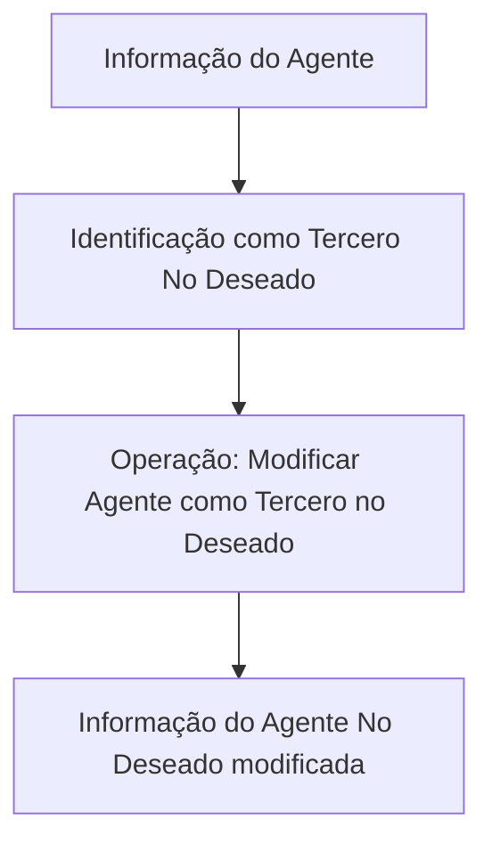

# Documentação Reef — Operação “Modificar Agente como Tercero no Deseado”

## 1. Metadados do Documento
- **Arquivo de Origem:** `Não identificado`
- **Tipo de Documento:** `Procedimento`
- **Domínio / Sistema:** `Reef / Mapfre`
- **Público-Alvo:** `Não identificado`
- **Data/Versão Identificada:** `Não identificada`

---

## 2. Resumo Executivo & Contexto de Negócio

O conteúdo descreve a operação **“Modificar Agente como Tercero no Deseado”** no contexto da documentação Reef. A finalidade declarada é modificar a informação de um agente pela qual esse agente é identificado como **Tercero No Deseado**.

A operação está associada à seção ou funcionalidade denominada **“Información del Agente No Deseado”** e apresenta a ação **“MODIFICAR Agente No Deseado”**. O material também contém referências de navegação à documentação Reef, incluindo áreas como Soluciones, Arquitecturas, APIs, Componentes, Cloud, Documentación, Zeus, Reef e Ayuda.

O documento não especifica telas, campos editáveis, critérios de validação, regras de autorização, métodos HTTP, contratos JSON, persistência de dados ou fluxos de aprovação associados à alteração do agente.

---

## 3. Arquitetura, Componentes & Tecnologias Envolvidas

Os componentes e contextos explicitamente identificados são:

| Componente / Termo | Papel identificado no conteúdo |
| :--- | :--- |
| Reef | Contexto da documentação e domínio da operação. |
| Mapfredocument | Referência apresentada no cabeçalho da documentação. |
| Agente | Entidade cuja informação pode ser modificada. |
| Tercero No Deseado | Classificação atribuída ao agente por meio de sua informação identificadora. |
| Información del Agente No Deseado | Área funcional relacionada à modificação do agente. |
| MODIFICAR Agente No Deseado | Ação ou operação apresentada no documento. |
| Zeus | Item disponível na navegação da documentação, sem relação funcional detalhada. |



> **Nota de Análise:** O diagrama representa somente o fluxo funcional mínimo sustentado pelo texto. O documento não detalha sistemas integrados, interfaces, serviços, bancos de dados ou tecnologias de implementação.

---

## 4. Regras de Negócio, Especificações Funcionais & Processos

1. A operação é denominada **“Modificar Agente como Tercero no Deseado”**.
2. A operação permite modificar a informação do agente usada para identificar esse agente como **Tercero No Deseado**.
3. A operação está vinculada à informação de agente não desejado, indicada como **“Información del Agente No Deseado”**.
4. A ação disponível é apresentada como **“MODIFICAR Agente No Deseado”**.
5. O conteúdo não informa quais atributos do agente podem ser alterados.
6. O conteúdo não informa valores permitidos, obrigatoriedade de campos, regras de validação, mensagens de erro ou condições de bloqueio.
7. O conteúdo não descreve etapas operacionais detalhadas para executar a modificação.
8. O conteúdo não descreve impactos da alteração em processos posteriores, integrações ou cadastros relacionados.

---

## 5. Tabelas de Parâmetros, Ambientes e Estruturas de Dados

| Item / Parâmetro | Descrição / Função | Tipo / Valores / Formato | Ambiente / Observações |
| :--- | :--- | :--- | :--- |
| Operação | Modificar Agente como Tercero no Deseado. | Operação funcional. | Contexto da documentação Reef. |
| Entidade | Agente. | Entidade de negócio. | O documento não detalha atributos do agente. |
| Classificação | Tercero No Deseado. | Classificação do agente. | O critério de classificação não é detalhado. |
| Informação modificada | Informação do agente utilizada para identificá-lo como Tercero No Deseado. | Não especificado. | Campos, formatos e validações não são informados. |
| Ação apresentada | MODIFICAR Agente No Deseado. | Ação de interface ou procedimento. | O mecanismo de execução não é descrito. |
| Owner | `user:agonzalez_mapfre.com` | Identificação de proprietário apresentada no documento. | Associado à documentação. |
| Lifecycle | `Approved Source` | Estado de ciclo de vida apresentado. | Não há detalhamento adicional. |
| Idioma | `ES` | Espanhol. | Indicado na navegação. |

---

## 6. Bateria de Perguntas & Respostas para RAG (FAQ Sintético)

### P1: Qual é a finalidade da operação “Modificar Agente como Tercero no Deseado”?
**R:** A operação permite modificar a informação de um agente pela qual esse agente é identificado como Tercero No Deseado.

### P2: Qual entidade é tratada pela operação descrita?
**R:** A entidade tratada é o agente. O documento indica que a informação desse agente pode ser modificada para alterar a identificação associada à condição de Tercero No Deseado.

### P3: O que significa “Información del Agente No Deseado” no documento?
**R:** “Información del Agente No Deseado” é a seção ou contexto funcional relacionado às informações do agente identificado como Tercero No Deseado. O conteúdo não detalha quais campos compõem essa informação.

### P4: Quais campos do agente podem ser modificados?
**R:** O documento não identifica os campos, atributos, formatos ou valores que podem ser modificados na informação do agente.

### P5: O documento descreve validações para modificar um agente não desejado?
**R:** Não. O conteúdo não apresenta critérios de validação, obrigatoriedade de campos, regras de negócio condicionais ou mensagens de erro.

### P6: Existe detalhamento de API ou método HTTP para a operação?
**R:** Não. O documento não informa APIs, endpoints, métodos HTTP, contratos JSON, autenticação ou integração técnica para a operação.

### P7: Qual é a ação apresentada para alterar a informação do agente?
**R:** A ação apresentada no conteúdo é “MODIFICAR Agente No Deseado”.

### P8: O documento informa quais sistemas recebem a alteração do agente?
**R:** Não. Não são descritos sistemas consumidores, integrações, bancos de dados, filas, serviços ou impactos posteriores à modificação.

### P9: Qual é o estado de ciclo de vida indicado para a documentação?
**R:** O documento apresenta o campo Lifecycle com o valor “Approved Source”.

### P10: Em qual contexto documental a operação está registrada?
**R:** A operação está registrada no contexto da documentação Reef, com referências também a Mapfredocument.

---

## 7. Glossário de Termos, Siglas & Conceitos-Chave

- **Agente:** Entidade cuja informação pode ser modificada na operação descrita.
- **Tercero No Deseado:** Classificação aplicada ao agente conforme a informação usada para identificá-lo. O documento não define critérios para essa classificação.
- **Información del Agente No Deseado:** Informação relacionada ao agente identificado como Tercero No Deseado.
- **Reef:** Contexto ou domínio da documentação apresentada.
- **Mapfredocument:** Referência documental exibida no conteúdo.
- **Lifecycle:** Campo de ciclo de vida documental, apresentado com o valor `Approved Source`.
- **Zeus:** Item de navegação citado na documentação, sem definição funcional adicional.

---

## 8. Notas Críticas, Riscos & Limitações

- O documento contém apenas uma descrição resumida da operação.
- Não há detalhamento de campos, formulários, contratos, serviços, APIs ou mecanismos técnicos de alteração.
- Não há critérios documentados para determinar quando um agente deve ser identificado como Tercero No Deseado.
- Não há evidência de regras de autorização, segregação de funções, trilha de auditoria ou aprovação para executar a modificação.
- Não são descritos impactos operacionais, integrações dependentes ou procedimentos de reversão.
- A expressão original `Modicar` apresenta um caractere corrompido na extração; o contexto indica a intenção textual de “Modificar”, sem que o documento forneça outra interpretação.

---

## 9. Conteúdo Bruto Estruturado (Referência Fiel)

```text
--- [PÁGINA 1 DE 1] ---

OPERACIÓN MODIFICAR Agente como Tercero no Deseado
¿En que consiste?
Esta operación permite Modicar la información del Agente por la que se le identica como Tercero No Deseado.
Información del Agente No Deseado
 MODIFICAR Agente No Deseado (  )
Documentation / DOCUMENTACIÓN Reef
DOCUMENTACIÓN Reef
Mapfredocument
DOCUMENTACIÓN Reef
Owner
user:agonzalez_mapfre.com
Lifecycle
Approved Source
 / 
 VL
Buscar Inicio Soluciones Arquitecturas APIs Componentes Cloud Documentación Zeus Reef Ayuda
ES
```
