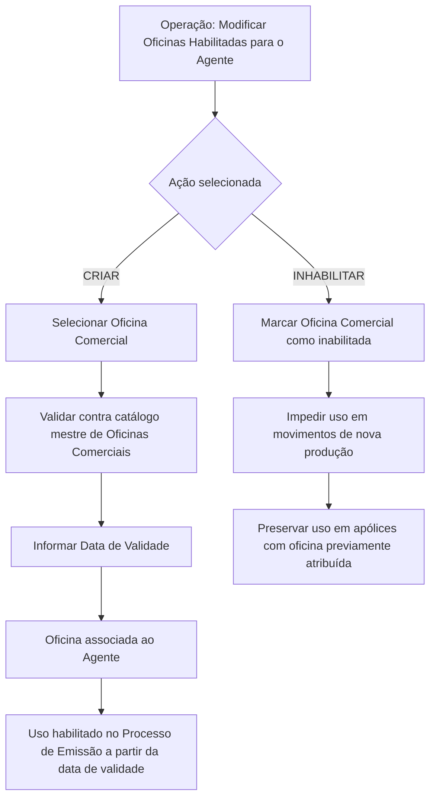

# Operação de Modificação de Oficinas Habilitadas para Agente no Reef.core

## 1. Metadados do Documento
- **Arquivo de Origem:** Não informado no conteúdo fornecido
- **Tipo de Documento:** Procedimento / Especificação Funcional
- **Domínio / Sistema:** Reef.core — gestão de agentes, oficinas comerciais e processo de emissão
- **Público-Alvo:** Operação, negócio, analistas funcionais e desenvolvedores
- **Data/Versão Identificada:** Não identificada

---

## 2. Resumo Executivo & Contexto de Negócio

O documento descreve a operação **“Modificar Oficinas Habilitadas para el Agente”**, destinada à administração das oficinas comerciais associadas a um agente no sistema Reef.core. A operação permite criar novas associações de oficinas comerciais complementares e inabilitar associações previamente habilitadas.

A disponibilidade da oficina comercial para o agente é controlada por uma data de validade e por uma marcação de inabilitação. A data de validade estabelece a partir de quando a oficina associada se torna plenamente operacional no Reef.core e pode ser utilizada no processo de emissão.

A inabilitação impede o uso da oficina comercial no processo de emissão para movimentos de nova produção. Entretanto, o documento preserva explicitamente a utilização da oficina em apólices que já possuíam aquela oficina previamente atribuída, evitando impacto retroativo sobre vínculos existentes.

O conteúdo disponível apresenta a sequência de captura dos atributos no bloco de informações — da esquerda para a direita e de cima para baixo —, mas não detalha telas, métodos HTTP, contratos de integração, perfis de acesso ou validações técnicas adicionais.

---

## 3. Arquitetura, Componentes & Tecnologias Envolvidas

Componentes e conceitos identificados:

- **Reef.core:** sistema que contém a data a partir da qual a oficina associada ao agente está plenamente operativa.
- **Agente:** entidade que pode possuir uma ou mais oficinas comerciais associadas.
- **Oficina Comercial:** oficina selecionada conforme o catálogo mestre de oficinas comerciais definido na estrutura comercial da companhia.
- **Catálogo mestre de Oficinas Comerciais:** fonte de valores permitidos para associação ao agente.
- **Processo de Emissão:** processo que utiliza oficinas comerciais habilitadas para movimentos de nova produção.
- **Apólices previamente associadas:** apólices cujo vínculo histórico com uma oficina inabilitada deve ser respeitado.



> **Nota de Análise:** O documento não detalha interfaces, APIs, persistência de dados, tecnologias de implementação, autenticação, autorização ou contratos JSON/XML relacionados à operação.

---

## 4. Regras de Negócio, Especificações Funcionais & Processos

1. A operação permite administrar as oficinas comerciais habilitadas para um agente.
2. Existem duas ações possíveis na operação:
   - **CRIAR**
   - **INHABILITAR**
3. A ação **CRIAR** permite criar novas oficinas comerciais complementares para o agente.
4. A ação **INHABILITAR** permite inabilitar oficinas que já estavam previamente habilitadas para o agente.
5. Os atributos do bloco **Datos Oficinas Habilitadas** devem ser capturados na sequência apresentada da esquerda para a direita e de cima para baixo.
6. O campo **Oficina Comercial** deve conter uma das oficinas comerciais que podem ser associadas ao agente.
7. A seleção de uma oficina comercial depende da relação de valores existente no catálogo mestre de oficinas comerciais definido na estrutura comercial da companhia.
8. O campo **Fecha de Validez** no Reef.core contém a data a partir da qual a oficina associada ao agente fica plenamente operativa.
9. A partir da data de validade, a oficina comercial pode ser utilizada no processo de emissão.
10. O campo **Inhabilitación** marca que uma oficina comercial associada ao agente está inabilitada no sistema.
11. Uma oficina marcada como inabilitada não pode ser usada no processo de emissão para movimentos de nova produção.
12. A inabilitação não remove nem altera o uso histórico da oficina em apólices que já possuíam aquela oficina previamente atribuída.

---

## 5. Tabelas de Parâmetros, Ambientes e Estruturas de Dados

| Item / Parâmetro | Descrição / Função | Tipo / Valores / Formato | Ambiente / Observações |
| :--- | :--- | :--- | :--- |
| Operação | Modifica as oficinas habilitadas para um agente. | Criar ou inabilitar. | Reef.core |
| Ação | Define a operação a executar sobre oficinas comerciais do agente. | `CREAR` ou `INHABILITAR`. | O documento apresenta as duas opções como ações possíveis. |
| Oficina Comercial | Oficina comercial associável ao agente. | Valor proveniente do catálogo mestre de oficinas comerciais. | Deve respeitar a estrutura comercial da companhia. |
| Fecha de Validez | Data a partir da qual a oficina associada está plenamente operativa. | Data; formato não informado. | No Reef.core, habilita o uso da oficina no processo de emissão. |
| Inhabilitación | Marca a oficina comercial associada como inabilitada no sistema. | Marcação; formato ou valores não informados. | Bloqueia o uso para movimentos de nova produção. |
| Processo de Emissão | Processo corporativo no qual uma oficina comercial habilitada pode ser utilizada. | Processo; detalhamento não informado. | Afetado pela data de validade e pela inabilitação. |
| Nova produção | Movimentos de emissão que não podem utilizar uma oficina inabilitada. | Categoria de movimento; detalhamento não informado. | Restrição aplicável após inabilitação. |
| Apólices previamente atribuídas | Apólices que já possuíam a oficina comercial associada. | Apólices existentes. | O vínculo com a oficina é respeitado mesmo após a inabilitação. |
| Owner | Proprietário identificado no conteúdo documental. | `user:agonzalez_mapfre.com` | Identificado na seção “Documentation / DOCUMENTACIÓN Reef”. |
| Lifecycle | Estado de ciclo de vida identificado. | `Approved Source` | Não há detalhamento adicional. |

---

## 6. Bateria de Perguntas & Respostas para RAG (FAQ Sintético)

### P1: Qual é o objetivo da operação “Modificar Oficinas Habilitadas para el Agente”?
**R:** A operação permite criar novas oficinas comerciais complementares para um agente e inabilitar oficinas comerciais que já estavam previamente habilitadas para esse agente.

### P2: Quais ações podem ser realizadas na manutenção de oficinas habilitadas para um agente?
**R:** O documento apresenta duas ações possíveis: `CREAR`, para criar uma nova associação de oficina comercial, e `INHABILITAR`, para marcar como inabilitada uma oficina previamente habilitada para o agente.

### P3: Como a Oficina Comercial deve ser selecionada para associação ao agente?
**R:** A Oficina Comercial deve corresponder a uma das oficinas que o agente pode ter associadas, conforme a relação de valores existente no catálogo mestre de Oficinas Comerciais definido na estrutura comercial da companhia.

### P4: Qual é a finalidade do campo Fecha de Validez no Reef.core?
**R:** O campo Fecha de Validez contém a data a partir da qual a oficina associada ao agente passa a estar plenamente operativa no Reef.core e, portanto, fica habilitada para uso no processo de emissão.

### P5: Uma oficina comercial pode ser usada no processo de emissão antes da Fecha de Validez?
**R:** O documento informa que a data de validade é o marco a partir do qual a oficina fica plenamente operativa e habilitada para uso no processo de emissão. Não há detalhamento adicional sobre comportamentos anteriores a essa data.

### P6: O que acontece quando uma Oficina Comercial é marcada com Inhabilitación?
**R:** A marcação de Inhabilitación indica que a oficina comercial associada ao agente está inabilitada no sistema. Como consequência, a oficina deixa de poder ser utilizada no processo de emissão para movimentos de nova produção.

### P7: A inabilitação de uma oficina comercial afeta apólices já existentes?
**R:** Não. O documento determina que a inabilitação deve ser respeitada para nova produção, mas deve preservar o uso da oficina nas apólices que já tinham aquela oficina previamente atribuída.

### P8: Qual é a restrição de negócio aplicável à nova produção após a inabilitação?
**R:** Uma oficina comercial inabilitada não pode ser utilizada no processo de emissão para movimentos de nova produção.

### P9: O documento define formatos técnicos para os campos Oficina Comercial, Fecha de Validez e Inhabilitación?
**R:** Não. O documento descreve a finalidade funcional dos campos, mas não informa formato de data, tipo de dado, tamanho, valores booleanos, regras de obrigatoriedade ou validações técnicas.

### P10: O documento descreve APIs ou métodos HTTP para criar ou inabilitar oficinas?
**R:** Não. O conteúdo apresenta a operação funcional e seus campos, mas não detalha APIs, métodos HTTP, endpoints, contratos de integração ou estruturas de requisição e resposta.

---

## 7. Glossário de Termos, Siglas & Conceitos-Chave

- **Reef.core:** Sistema citado como responsável por conter a data a partir da qual uma oficina associada ao agente fica plenamente operativa.
- **Agente:** Entidade que pode possuir oficinas comerciais associadas.
- **Oficina Comercial:** Unidade comercial associável a um agente e utilizável no processo de emissão conforme as regras de validade e inabilitação.
- **Catálogo mestre de Oficinas Comerciais:** Relação de valores de oficinas comerciais definida na estrutura comercial da companhia.
- **Fecha de Validez:** Data a partir da qual a oficina comercial associada ao agente fica plenamente operativa.
- **Inhabilitación:** Marcação que indica que a oficina comercial associada ao agente está inabilitada no sistema.
- **Processo de Emissão:** Processo no qual uma oficina comercial habilitada pode ser utilizada.
- **Nova produção:** Movimentos do processo de emissão para os quais uma oficina inabilitada não pode ser utilizada.
- **Apólice:** Registro cuja associação prévia com uma oficina comercial deve ser preservada após a inabilitação.
- **Lifecycle — Approved Source:** Estado documental identificado no conteúdo, sem explicação adicional.

---

## 8. Notas Críticas, Riscos & Limitações

- O documento não identifica arquivo de origem, data, versão ou autor formal; apenas apresenta o owner `user:agonzalez_mapfre.com`.
- O conteúdo não informa se os campos são obrigatórios, quais são seus tipos técnicos, formatos ou regras de validação.
- Não há descrição de permissões, perfis de usuário, trilha de auditoria, tratamento de erros ou aprovação para criação e inabilitação.
- Não há detalhamento de APIs, integrações, banco de dados, eventos ou contratos técnicos.
- A regra de preservação de apólices previamente associadas é crítica: a inabilitação deve bloquear nova produção sem invalidar vínculos históricos.
- O documento usa terminologia em espanhol, enquanto a presente estrutura analítica utiliza português para organização; os nomes funcionais originais foram preservados quando relevantes.

---

## 9. Conteúdo Bruto Estruturado (Referência Fiel)

```text
--- [PÁGINA 1 DE 1] ---

MODIFICAR Ocinas Habilitadas para el Agente
Objetivo
Esta Operación permite Crear nuevas Ocinas Comerciales Complementarias además de Inhabilitar aquellas Ocinas que tuviera
previamente habilitadas el Agente.
Posibles Acciones
 CREAR ( )  INHABILITAR ( )
Datos Ocinas Habilitadas
De Izquierda a Derecha y de Arriba hacia Abajo, los siguientes atributos marcan la secuencia de captura en este Bloque de Información.
Ocina Comercial (  )
Este Campo contendrá una de las Ocinas Comerciales que el Agente puede tener asociadas, de acuerdo con la relación de valores
existentes en el catálogo maestro de Ocinas Comerciales denidas en la estructura comercial de la Compañía.
Fecha de Validez ( )
El valor de este campo en Reef.core contiene la fecha a partir de la cual la Ocina asociada al Agente está plenamente operativa y se habilita
por tanto su uso en el Proceso de Emisión.
Inhabilitación (  )
Este Campo marca que la Ocina Comercial asociada al Agente está inhabilitada en el Sistema y por tanto se inhabilita su uso en el Proceso
de Emisión para los movimientos de nueva producción (respetándose en cambio en aquellas pólizas que la tuvieran previamente asignada).
Documentation / DOCUMENTACIÓN Reef
DOCUMENTACIÓN Reef
Mapfredocument
DOCUMENTACIÓN Reef
Owner
user:agonzalez_mapfre.com
Lifecycle
Approved Source
 /
VL
Buscar Inicio Soluciones Arquitecturas APIs Componentes Cloud Documentación Zeus Reef Ayuda
ES
```
