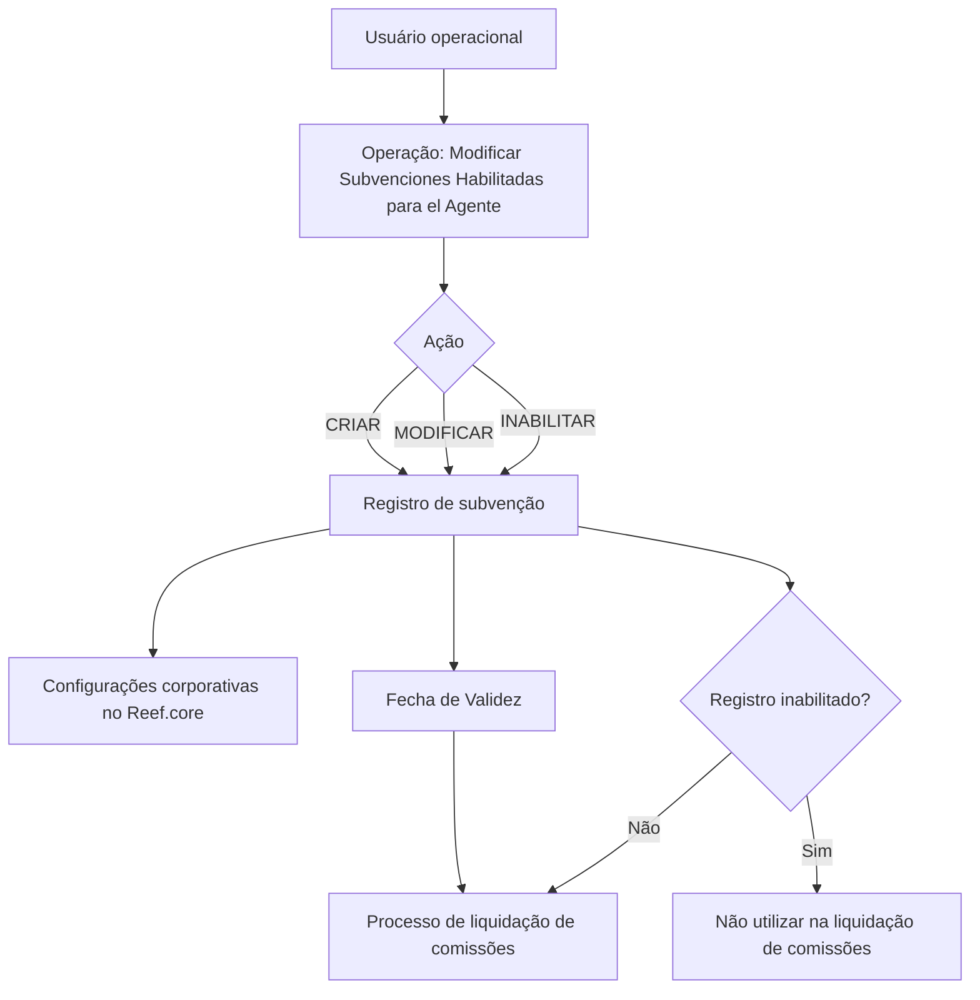

# Gestão de Subvenções Habilitadas para Agentes no Reef.core

## 1. Metadados do Documento
- **Arquivo de Origem:** Não identificado no conteúdo fornecido
- **Tipo de Documento:** Manual Operacional
- **Domínio / Sistema:** Reef.core / Gestão de agentes e comissões
- **Público-Alvo:** Operação, negócio, administradores funcionais e equipes responsáveis por liquidação de comissões
- **Data/Versão Identificada:** Não identificada

---

## 2. Resumo Executivo & Contexto de Negócio

O documento descreve a operação **“Modificar Subvenciones Habilitadas para el Agente”** no sistema Reef.core. A operação permite gerir subvenções concedidas a agentes pela entidade seguradora em razão da comercialização e/ou cobrança de recibos de apólices.

As ações previstas são criar, modificar ou inabilitar subvenções previamente habilitadas para um agente. A manutenção da definição de subvenção abrange identificação do agente, classificação, forma de aplicação, conceito de ajuste, período de vigência, valores monetários, moeda, percentual, lógica dinâmica de negócio e critérios mínimos de cobrança.

As subvenções podem ser classificadas como mensais ou relacionadas à aplicação durante a cobrança e anulação de cobrança de recibos. A forma de aplicação pode ser por importe, por percentual ou por lógica de negócio, com atributos condicionais conforme a opção selecionada.

O registro de subvenção pode ser inabilitado para impedir sua utilização no processo de liquidação de comissões. A **Fecha de Validez** permite que alterações nas definições de subvenções sejam historizadas e passem a ser consideradas apenas a partir da data estabelecida.

---

## 3. Arquitetura, Componentes & Tecnologias Envolvidas

O conteúdo identifica o sistema **Reef.core** como repositório corporativo de valores configurados para classificação e forma de aplicação de subvenções. Também identifica o processo de **liquidación de comisiones** como consumidor das definições de subvenção habilitadas.

Não são detalhados métodos HTTP, APIs, contratos JSON, persistência de dados, microsserviços, servidores, URLs técnicas ou tecnologias de implementação.



---

## 4. Regras de Negócio, Especificações Funcionais & Processos

### Operações disponíveis
A operação permite executar as seguintes ações sobre subvenções de agentes:

1. **CRIAR:** criar uma nova subvenção para o agente.
2. **MODIFICAR:** alterar uma subvenção previamente habilitada para o agente.
3. **INABILITAR:** tornar indisponível uma subvenção para uso no processo de liquidação de comissões.

### Sequência de captura
A documentação determina que os atributos da tela devem ser tratados da esquerda para a direita e de cima para baixo como sequência de captura de informações.

### Regras de classificação
A classificação da subvenção é configurada corporativamente no Reef.core e pode assumir um dos seguintes valores:

1. **SUBVENCIÓN MENSUAL**
2. **APLICACIÓN EN EL COBRO Y ANULADO DE COBRO DE LOS RECIBOS**

### Regras de forma de aplicação
A forma de aplicação da subvenção é configurada corporativamente no Reef.core e pode assumir os seguintes valores:

1. **IMPORTE**, de acordo com a moeda da definição.
2. **PORCENTAJE**.
3. **LÓGICA DE NEGOCIO**.

### Regras condicionais de atributos

- O **Importe de la subvención** é aplicável quando a forma de aplicação determina que a subvenção é um importe.
- O **Porcentaje de la subvención** é aplicável quando a forma de aplicação determina que a subvenção é um percentual; o percentual incide sobre o total das comissões do agente.
- A **Lógica de negocio para obtener el importe o porcentaje de la subvención** é aplicável quando a forma de aplicação determina execução de lógica de negócio. Essa lógica avalia dinamicamente os critérios definidos pela entidade seguradora para obter o importe ou percentual aplicável.
- O **Importe mínimo cobranza** é aplicável quando a classificação da subvenção é mensal. O atributo determina o importe mínimo que o agente deve cobrar para receber a subvenção mensal.
- O **Código del concepto de ajuste** identifica o conceito de ajuste de comissões que identificará especificamente, na conta corrente do agente, a subvenção concedida.
- A agrupação contábil do conceito de ajuste deve ser do tipo **MP**.
- A **Inhabilitación** informa ao Reef.core que o registro de subvenção não pode ser usado no processo de liquidação de comissões estabelecido pela entidade seguradora.
- A **Fecha de Validez** determina a data a partir da qual a subvenção fica disponível no sistema e pode ser considerada pelos processos aplicáveis. O uso correto da data permite manter histórico das alterações nas definições de subvenções.

---

## 5. Tabelas de Parâmetros, Ambientes e Estruturas de Dados

| Item / Parâmetro | Descrição / Função | Tipo / Valores / Formato | Ambiente / Observações |
| :--- | :--- | :--- | :--- |
| Ação | Define a operação a executar sobre a subvenção do agente. | CRIAR, MODIFICAR ou INABILITAR. | Operação de gestão de subvenções. |
| Código do Agente | Exibe a chave do intermediário para o qual a subvenção é criada, modificada ou inabilitada. | Código/chave de intermediário. | Associado ao agente beneficiário. |
| Classificação da subvenção | Exibe a classificação da subvenção concedida. | SUBVENCIÓN MENSUAL; APLICACIÓN EN EL COBRO Y ANULADO DE COBRO DE LOS RECIBOS. | Valores configurados corporativamente no Reef.core. |
| Forma de aplicação da subvenção | Determina a forma de aplicação da subvenção. | IMPORTE; PORCENTAJE; LÓGICA DE NEGOCIO. | Valores configurados corporativamente no Reef.core. |
| Código do conceito de ajuste | Identifica o conceito de ajuste de comissões que identifica a subvenção na conta corrente do agente. | Código de conceito de ajuste. | A agrupação contábil deve ser do tipo MP. |
| Data de início da concessão | Indica a data desde a qual a subvenção é concedida ao agente. | Data. | Define o início da concessão. |
| Data de caducidade da concessão | Indica a data de caducidade da subvenção concedida. | Data. | Define o encerramento da concessão. |
| Importe da subvenção | Identifica o valor da subvenção concedida ao agente. | Importe monetário. | Aplicável somente quando a forma de aplicação é IMPORTE. |
| Moeda | Identifica o código da moeda para a qual a subvenção é concedida. | Código de moeda. | Relacionada à concessão da subvenção. |
| Importe mínimo de cobrança | Define o importe mínimo que o agente deve cobrar para perceber a subvenção mensal. | Importe monetário. | Aplicável somente à classificação SUBVENCIÓN MENSUAL. |
| Lógica de negócio para importe ou percentual | Permite avaliar dinamicamente critérios de negócio definidos pela entidade seguradora. | Lógica de negócio. | Aplicável somente quando a forma de aplicação é LÓGICA DE NEGOCIO. |
| Percentual da subvenção | Define o percentual aplicado sobre o total das comissões do agente. | Percentual. | Aplicável somente quando a forma de aplicação é PORCENTAJE. |
| Inabilitação | Informa que o registro de subvenção está inabilitado para uso. | Indicador de inabilitação. | Impede uso na liquidação de comissões. |
| Data de validade | Define a data a partir da qual a subvenção fica disponível no sistema. | Data. | Permite histórico de mudanças na definição de subvenções. |

---

## 6. Bateria de Perguntas & Respostas para RAG (FAQ Sintético)

### P1: Qual é o objetivo da operação “Modificar Subvenciones Habilitadas para el Agente”?
**R:** A operação permite criar novas subvenções para agentes pela comercialização e/ou cobrança de recibos de apólices, além de modificar ou inabilitar subvenções anteriormente habilitadas para o agente.

### P2: Quais ações podem ser realizadas sobre uma subvenção de agente?
**R:** As ações disponíveis são CRIAR, MODIFICAR e INABILITAR uma subvenção associada ao agente.

### P3: O que representa o Código do Agente na gestão de subvenções?
**R:** O Código do Agente mostra a chave do intermediário para o qual a entidade seguradora cria, modifica ou inabilita a subvenção concedida.

### P4: Quais classificações de subvenção estão previstas no Reef.core?
**R:** O Reef.core prevê as classificações SUBVENCIÓN MENSUAL e APLICACIÓN EN EL COBRO Y ANULADO DE COBRO DE LOS RECIBOS.

### P5: Quais são as formas de aplicação possíveis para uma subvenção?
**R:** A forma de aplicação pode ser IMPORTE, PORCENTAJE ou LÓGICA DE NEGOCIO. Os valores são configurados corporativamente no Reef.core.

### P6: Quando o Importe de la subvención deve ser utilizado?
**R:** O Importe de la subvención deve ser informado quando a forma de aplicação da subvenção determinar que a concessão ocorre por importe, de acordo com a moeda da definição.

### P7: Como o percentual de uma subvenção é aplicado?
**R:** Quando a forma de aplicação for PORCENTAJE, o percentual da subvenção é aplicado sobre o total das comissões do agente.

### P8: Em que situação o Importe mínimo cobranza é relevante?
**R:** O Importe mínimo cobranza é relevante quando a classificação da subvenção for SUBVENCIÓN MENSUAL. Ele determina o importe mínimo que o agente precisa cobrar para receber a subvenção mensal.

### P9: Qual requisito contábil existe para o Código del concepto de ajuste?
**R:** A agrupação contábil do conceito de ajuste deve ser do tipo MP. O código identifica na conta corrente do agente a subvenção concedida.

### P10: Qual é a finalidade da lógica de negócio para obter importe ou percentual?
**R:** A lógica de negócio permite avaliar dinamicamente os critérios definidos pela entidade seguradora para determinar o importe ou o percentual de subvenção a aplicar.

### P11: O que acontece quando uma subvenção é inabilitada?
**R:** Quando o indicador de Inhabilitación é definido, o Reef.core considera que o registro da subvenção está inabilitado e ele não pode ser utilizado no processo de liquidação de comissões da entidade seguradora.

### P12: Qual é a função da Fecha de Validez?
**R:** A Fecha de Validez indica a data a partir da qual a subvenção fica disponível no sistema para ser considerada nos processos aplicáveis. O uso correto dessa data permite manter histórico das mudanças realizadas nas definições de subvenções.

---

## 7. Glossário de Termos, Siglas & Conceitos-Chave

- **Reef.core:** Sistema citado como responsável pelas configurações corporativas de classificações e formas de aplicação de subvenções.
- **Subvenção:** Concessão associada ao agente pela comercialização e/ou cobrança de recibos de apólices.
- **Agente:** Intermediário identificado pelo Código do Agente e destinatário da subvenção.
- **Recibo:** Elemento mencionado no contexto de cobrança e anulação de cobrança.
- **Liquidação de comissões:** Processo da entidade seguradora que pode utilizar subvenções habilitadas.
- **Conceito de ajuste:** Código de ajuste de comissões que identifica a subvenção na conta corrente do agente.
- **MP:** Tipo obrigatório de agrupação contábil para o conceito de ajuste.
- **Importe:** Forma de aplicação baseada em valor monetário.
- **Porcentaje:** Forma de aplicação baseada em percentual sobre o total das comissões do agente.
- **Lógica de negócio:** Forma de aplicação que avalia dinamicamente critérios definidos pela entidade seguradora.
- **Fecha de Validez:** Data a partir da qual a subvenção está disponível para consideração pelos processos do sistema.
- **Inhabilitación:** Indicador que impede a utilização do registro de subvenção na liquidação de comissões.

---

## 8. Notas Críticas, Riscos & Limitações

- O documento não detalha APIs, métodos HTTP, contratos de integração, banco de dados, estrutura física de armazenamento ou mecanismos técnicos de execução da lógica de negócio.
- O documento não informa formatos de data, precisão monetária, códigos de moeda aceitos, validações entre datas de início e caducidade ou regras de cálculo de comissão.
- A lógica de negócio dinâmica é mencionada, mas os critérios concretos, regras de priorização e mecanismo de configuração não são especificados.
- A inabilitação impede o uso da subvenção no processo de liquidação de comissões, mas o documento não esclarece se registros históricos ou liquidações anteriores são afetados.
- **Nota de Análise:** O documento cita Reef.core e o processo de liquidação de comissões, porém não detalha os componentes técnicos, interfaces ou contratos que conectam a manutenção da subvenção ao processo de liquidação.

---

## 9. Conteúdo Bruto Estruturado (Referência Fiel)

```text
--- [PÁGINA 1 DE 2] ---

MODIFICAR Subvenciones Habilitadas para el Agente
Objetivo
Esta Operación permite Crear nuevas subvenciones a los agentes por la comercialización y/ó la cobranza de los recibos de sus pólizas
además de Modicar o Inhabilitar aquellas que tuviera el Agente previamente habilitadas.
Posibles Acciones
 CREAR ( )  MODIFICAR ( )
 INHABILITAR ( )
Datos Subvenciones Habilitadas
De Izquierda a Derecha y de Arriba hacia Abajo, los siguientes atributos marcan la secuencia de captura en esta pantalla de Información.
Código del Agente
Este campo muestra la clave del intermediario para el que se crea, modica o inhabilita la subvención concedida por la entidad aseguradora.
Clasicación de la subvención
Esta propiedad visualiza la clasicación de la subvención concedida, de acuerdo con uno de los posibles valores congurados a nivel
corporativo en Reef.core:
(1) SUBVENCIÓN MENSUAL.
(2) APLICACIÓN EN EL COBRO Y ANULADO DE COBRO DE LOS RECIBOS.
Forma de aplicación de la subvención (   )
Esta propiedad determina la forma de aplicación de la subvención concedida, de acuerdo con uno de los posibles valores congurados a
nivel corporativo en Reef.core:
(1) IMPORTE (de acuerdo a la Moneda de la denición)
(2) PORCENTAJE
Documentation / DOCUMENTACIÓN Reef
DOCUMENTACIÓN Reef
Mapfredocument
DOCUMENTACIÓN Reef
Owner
user:agonzalez_mapfre.com
Lifecycle
Approved Source
 / 
 VL
Buscar Inicio Soluciones Arquitecturas APIs Componentes Cloud Documentación Zeus Reef Ayuda
ES


--- [PÁGINA 2 DE 2] ---

(3) LÓGICA DE NEGOCIO
Código del concepto de ajuste
Muestra e identica el código del concepto de ajuste de comisiones, que identicará especícamente en la cuenta corriente del agente la
subvención concedida.
La agrupación contable del concepto de ajuste debe ser del tipo MP.
Fecha inicio concesión Subvención
Muestra la fecha desde la que se concede la subvención al agente.
Fecha caducidad concesión Subvención
Este dato muestra la fecha de caducidad de la subvención concedida.
Importe de la subvención (  )
Siempre y cuando la forma de aplicación de la subvención determine que sea un importe, este atributo identica el importe de la subvención
concedida al agente.
Moneda (   )
Este campo identica el código de la moneda para la que se concede la subvención.
Importe mínimo cobranza (  )
Siempre y cuando la clasicación de la subvención indique que sea una subvención mensual, esta propiedad determina el importe mínimo
que el Agente tiene que cobrar para percibir la subvención mensual.
Lógica de negocio para obtener el importe o porcentaje de la subvención (  )
Siempre y cuando la forma de aplicación de la subvención determine que vaya a ser obtenida mediante la ejecución de una lógica de negocio,
este atributo permite evaluar dinámicamente los criterios de negocio que se hubieren considerado por parte de la entidad aseguradora al n
de obtener el importe o el porcentaje de la subvención a aplicar.
Porcentaje de la subvención (  )
Siempre y cuando la forma de aplicación de la subvención determine que sea un porcentaje, esta propiedad de la denición identica el
porcentaje de la subvención que se va a aplicar sobre el total de las comisiones del Agente.
Inhabilitación (  )
Este campo le indica a Reef.core que el registro que identica la subvención está inhabilitado para poder ser utilizado en el proceso de
liquidación de comisiones que tenga establecida la entidad aseguradora.
Fecha de Validez
Este dato muestra la fecha a partir de la cual la subvención está disponible en el sistema para ser contemplada en los procesos en los que
deba ser considerada. Su correcto uso, por tanto, permite tener un histórico de los cambios efectuados en las deniciones de las
subvenciones.
```
