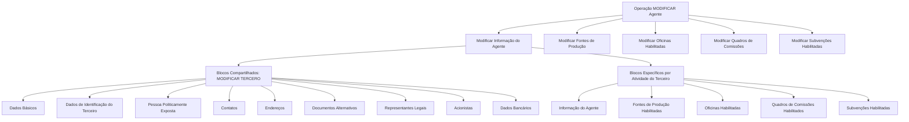

# Operação MODIFICAR Agente — Gestão de Informações de Agentes no Reef

## 1. Metadados do Documento
- **Arquivo de Origem:** Não identificado no conteúdo extraído
- **Tipo de Documento:** Procedimento
- **Domínio / Sistema:** Reef / Agentes / Terceiros
- **Público-Alvo:** Usuários do sistema
- **Data/Versão Identificada:** Não identificada

---

## 2. Resumo Executivo & Contexto de Negócio

O documento descreve a operação **MODIFICAR Agente**, destinada ao complemento, à modificação e/ou à inabilitação das informações cadastrais de um Agente. A operação é apresentada no contexto do sistema Reef e relaciona informações de Agente com estruturas compartilhadas de cadastro de Terceiro.

A obrigatoriedade e a habilitação dos campos não são fixas para todos os cadastros. Os requisitos podem variar conforme o código de atividade do Terceiro, a classificação do Terceiro como Pessoa Física ou Pessoa Jurídica e modificações implementadas localmente.

O procedimento organiza a atualização do Agente em blocos de informação compartilhados e específicos. Os blocos compartilhados estão associados à operação **MODIFICAR TERCERO**, enquanto os blocos específicos abrangem informações próprias do Agente, fontes de produção, oficinas, quadros de comissões e subvenções habilitadas.

O documento também estabelece que a ordem de captura dos dados nos blocos de informação pode variar conforme o critério adotado pelo Usuário no Sistema. Não são detalhados métodos de acesso, regras de validação por campo, contratos técnicos ou fluxos de aprovação.

---

## 3. Arquitetura, Componentes & Tecnologias Envolvidas

Os componentes funcionais identificados são:

- **Reef:** sistema/documentação em que a operação está registrada.
- **MODIFICAR Agente:** operação para complementar, modificar ou inabilitar informações de Agente.
- **MODIFICAR TERCERO:** estrutura que concentra blocos de informação compartilhados de Terceiro.
- **Informação do Agente:** bloco específico do Agente.
- **Fontes de Produção Habilitadas:** bloco específico relacionado às fontes de produção.
- **Oficinas Habilitadas:** bloco específico relacionado às oficinas.
- **Quadros de Comissões Habilitados:** bloco específico relacionado a comissões.
- **Subvenções Habilitadas:** informação complementar do Agente.



**Nota de Análise:** o documento apresenta blocos funcionais, mas não detalha integrações técnicas, APIs, microsserviços, bancos de dados, métodos HTTP, contratos JSON, URLs de ambiente ou tecnologias de implementação.

---

## 4. Regras de Negócio, Especificações Funcionais & Processos

1. A operação **MODIFICAR Agente** permite:
   - Complementar informações do Agente.
   - Modificar informações do Agente.
   - Inabilitar informações do Agente.

2. A obrigatoriedade e/ou habilitação dos campos de cada bloco ou estrutura compartilhada pode variar de acordo com:
   - O código de atividade do Terceiro.
   - O tipo de Terceiro: Pessoa Física ou Pessoa Jurídica.
   - Modificações implementadas localmente que afetem a obrigatoriedade do registro dos Dados do Terceiro.

3. A ordem de captura de dados nos diferentes blocos de informação pode variar de acordo com o critério seguido pelo Usuário no Sistema.

4. O processo de modificação inclui os seguintes escopos:
   - Modificar Informação do Agente.
   - Modificar Fontes de Produção.
   - Modificar Oficinas Habilitadas.
   - Modificar Quadros de Comissões.
   - Modificar Subvenções Habilitadas.

5. Os blocos de informação são separados em:
   - **Blocos de Informação Compartilhados**, associados a **MODIFICAR TERCERO**.
   - **Blocos de Informação Específicos**, definidos de acordo com a atividade do Terceiro.
   - **Informação Complementar do Agente**, que inclui Subvenções Habilitadas.

---

## 5. Tabelas de Parâmetros, Ambientes e Estruturas de Dados

| Item / Parâmetro | Descrição / Função | Tipo / Valores / Formato | Ambiente / Observações |
| :--- | :--- | :--- | :--- |
| Operação MODIFICAR Agente | Complementa, modifica e/ou inabilita informações do Agente | Operação funcional | Sistema Reef |
| Código de atividade do Terceiro | Pode alterar obrigatoriedade e habilitação de campos | Código de atividade | Valor não detalhado |
| Tipo de Terceiro | Pode alterar obrigatoriedade e habilitação de campos | Pessoa Física ou Pessoa Jurídica | Regras específicas não detalhadas |
| Modificações locais | Podem afetar a obrigatoriedade de registro dos Dados do Terceiro | Modificação local | Sem detalhamento técnico |
| Ordem de captura dos dados | Pode variar entre blocos de informação | Critério do Usuário no Sistema | Sem sequência obrigatória informada |
| Dados Básicos | Bloco de informação compartilhado | Bloco cadastral | MODIFICAR TERCERO |
| Dados de Identificação do Terceiro | Bloco de informação compartilhado | Bloco cadastral | MODIFICAR TERCERO |
| Pessoa Politicamente Exposta | Bloco de informação compartilhado | Bloco cadastral | MODIFICAR TERCERO |
| Contatos | Bloco de informação compartilhado | Bloco cadastral | MODIFICAR TERCERO |
| Direções | Bloco de informação compartilhado | Bloco cadastral | MODIFICAR TERCERO |
| Documentos Alternativos | Bloco de informação compartilhado | Bloco cadastral | MODIFICAR TERCERO |
| Representantes Legais | Bloco de informação compartilhado | Bloco cadastral | MODIFICAR TERCERO |
| Acionistas | Bloco de informação compartilhado | Bloco cadastral | MODIFICAR TERCERO |
| Dados Bancários | Bloco de informação compartilhado | Bloco cadastral | MODIFICAR TERCERO |
| Informação do Agente | Bloco específico conforme atividade do Terceiro | Bloco funcional | Operação MODIFICAR Agente |
| Fontes de Produção Habilitadas | Bloco específico conforme atividade do Terceiro | Bloco funcional | Operação MODIFICAR Agente |
| Oficinas Habilitadas | Bloco específico conforme atividade do Terceiro | Bloco funcional | Operação MODIFICAR Agente |
| Quadros de Comissões Habilitados | Bloco específico conforme atividade do Terceiro | Bloco funcional | Operação MODIFICAR Agente |
| Subvenções Habilitadas | Informação complementar do Agente | Bloco funcional | Operação MODIFICAR Agente |

---

## 6. Bateria de Perguntas & Respostas para RAG (FAQ Sintético)

### P1: Em que consiste a operação MODIFICAR Agente?
**R:** A operação MODIFICAR Agente consiste no complemento, na modificação e/ou na inabilitação das informações do Agente.

### P2: Quais fatores podem alterar a obrigatoriedade ou a habilitação dos campos do cadastro?
**R:** A obrigatoriedade e/ou a habilitação dos campos podem variar conforme o código de atividade do Terceiro, o tipo de Terceiro — Pessoa Física ou Pessoa Jurídica — e modificações implementadas localmente que afetem o registro dos Dados do Terceiro.

### P3: A ordem de preenchimento dos blocos de informação é fixa na operação MODIFICAR Agente?
**R:** Não. O documento informa que a ordem de captura dos dados nos distintos blocos de informação pode variar de acordo com o critério seguido pelo Usuário no Sistema.

### P4: Quais ações funcionais fazem parte do processo MODIFICAR Agente?
**R:** O processo inclui modificar a Informação do Agente, as Fontes de Produção, as Oficinas Habilitadas, os Quadros de Comissões e as Subvenções Habilitadas.

### P5: Quais são os blocos de informação compartilhados em MODIFICAR TERCERO?
**R:** Os blocos compartilhados são Dados Básicos, Dados de Identificação do Terceiro, Pessoa Politicamente Exposta, Contatos, Direções, Documentos Alternativos, Representantes Legais, Acionistas e Dados Bancários.

### P6: Quais são os blocos específicos definidos conforme a atividade do Terceiro?
**R:** Os blocos específicos são Informação do Agente, Fontes de Produção Habilitadas, Oficinas Habilitadas e Quadros de Comissões Habilitados.

### P7: Onde as Subvenções Habilitadas se encaixam na estrutura de informações?
**R:** As Subvenções Habilitadas são classificadas pelo documento como Informação Complementar do Agente.

### P8: O documento define quais campos são obrigatórios para Pessoa Física e Pessoa Jurídica?
**R:** Não. O documento informa que a obrigatoriedade e/ou habilitação pode variar conforme o Terceiro seja Pessoa Física ou Pessoa Jurídica, mas não especifica os campos aplicáveis a cada tipo.

### P9: O documento apresenta regras técnicas, APIs ou contratos de integração para MODIFICAR Agente?
**R:** Não. O conteúdo descreve a operação e seus blocos funcionais, mas não detalha APIs, métodos HTTP, contratos JSON, integrações, bancos de dados ou tecnologias de implementação.

### P10: Modificações locais podem impactar a operação MODIFICAR Agente?
**R:** Sim. O documento informa que modificações implementadas localmente podem afetar o comportamento da aplicação em relação à obrigatoriedade do registro dos Dados do Terceiro.

---

## 7. Glossário de Termos, Siglas & Conceitos-Chave

- **Agente:** entidade cujas informações podem ser complementadas, modificadas ou inabilitadas na operação descrita.
- **Terceiro:** entidade cadastral cujos dados compartilhados são tratados em blocos de informação associados a MODIFICAR TERCERO.
- **MODIFICAR Agente:** operação para gestão das informações do Agente.
- **MODIFICAR TERCERO:** estrutura associada aos blocos de informação compartilhados do Terceiro.
- **Pessoa Física:** tipo de Terceiro que pode influenciar a obrigatoriedade e/ou habilitação de campos.
- **Pessoa Jurídica:** tipo de Terceiro que pode influenciar a obrigatoriedade e/ou habilitação de campos.
- **Pessoa Politicamente Exposta:** bloco de informação compartilhado listado em MODIFICAR TERCERO.
- **Reef:** sistema/documentação citado no conteúdo original.
- **Subvenções Habilitadas:** informação complementar do Agente.

---

## 8. Notas Críticas, Riscos & Limitações

- O documento não especifica campos obrigatórios por código de atividade, Pessoa Física ou Pessoa Jurídica.
- O documento não apresenta critérios detalhados para habilitação, inabilitação ou validação de cada bloco.
- Modificações implementadas localmente podem alterar o comportamento da aplicação em relação à obrigatoriedade dos Dados do Terceiro.
- A ordem de captura de dados pode variar conforme o critério do Usuário, o que pode resultar em diferentes sequências operacionais.
- Não há detalhamento sobre permissões, perfis de acesso, auditoria, tratamento de erros, URLs, ambientes, APIs ou contratos de integração.
- **Nota de Análise:** o conteúdo fornece uma visão funcional resumida e não detalha a implementação técnica da operação MODIFICAR Agente.

---

## 9. Conteúdo Bruto Estruturado (Referência Fiel)

```text
--- [PÁGINA 1 DE 2] ---

OPERACIÓN MODIFICAR Agente
¿En que consiste?
Esta operación consiste en el Complemento, Modicación y/o Inhabilitación de la información del Agente.
Premisas
La obligatoriedad y/o la habilitación de los campos en el registro de los datos de cada uno de los bloques o estructuras de información
compartidas puede variar de acuerdo con el código de actividad del Tercero:
La obligatoriedad y/o la habilitación de los campos en el registro de los datos de cada uno de los bloques o estructuras de información
pueden variar si el tipo de Tercero es una Persona Física o una Persona Jurídica:
Las modicaciones que se hubieran podido implementar localmente a su vez pueden afectar el comportamiento de la aplicación en
relación con la obligatoriedad en el registro de los Datos del Tercero.
Por último, el orden de captura de los datos en los distintos bloques de Información puede variar de acuerdo con el criterio seguido por el
Usuario en el Sistema.
Proceso
MODIFICAR
TERCERO
Modificar Información
del Agente
Modificar Fuentes de
Producción
Modificar Oficinas
Habilitadas
Modificar Cuadros de
Comisiones
Modificar Subvenciones
Habilitadas
Bloques de Información Compartidos (MODIFICAR TERCERO)
 Datos Básicos ( )
 Datos Identicación Tercero ( )
 Persona Políticamente Expuesta(   )
 Contactos (   )
 Direcciones (   )
 Documentos Alternativos (   )
 Representantes Legales (   )
Ejemplo:
Ejemplo:
Documentation / DOCUMENTACIÓN Reef
DOCUMENTACIÓN Reef
Mapfredocument
DOCUMENTACIÓN Reef
Owner
user:agonzalez_mapfre.com
Lifecycle
Approved Source
 / 
 VL
Buscar Inicio Soluciones Arquitecturas APIs Componentes Cloud Documentación Zeus Reef Ayuda
ES


--- [PÁGINA 2 DE 2] ---

Accionistas (   )
 Datos Bancarios (   )
Bloques de Información Especícos de acuerdo con la Actividad del Tercero.
 Información del Agente (  )
 Fuentes de Producción Habilitadas (  )
 Ocinas Habilitadas (  )
 Cuadros de Comisiones Habilitados (   )
Información Complementaria del Agente.
 Subvenciones Habilitadas (   )
```
