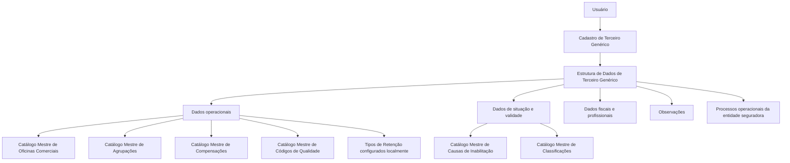

# Modificação das Informações para Terceiros Genéricos — Documentação Reef

## 1. Metadados do Documento
- **Arquivo de Origem:** Não informado no conteúdo extraído
- **Tipo de Documento:** Especificação Funcional
- **Domínio / Sistema:** Reef / Mapfredocument / entidade seguradora
- **Público-Alvo:** Analistas funcionais, desenvolvedores, operação e áreas de negócio de seguradoras
- **Data/Versão Identificada:** Não identificada
- **Owner Identificado:** `user:agonzalez_mapfre.com`
- **Lifecycle Identificado:** Approved Source

---

## 2. Resumo Executivo & Contexto de Negócio

O documento descreve a modificação e a captura de informações associadas ao cadastro de **Terceiros Genéricos** em uma entidade seguradora. O objetivo declarado é classificar, identificar e detalhar dados de âmbito operacional do Terceiro Genérico, permitindo que esses dados sejam utilizados adequadamente nos processos corporativos que os demandem.

A estrutura documentada contempla a ação habilitada de **CRIAR** e define uma sequência de preenchimento de atributos no bloco de informações de Terceiro Genérico. A ordem de captura deve ser interpretada da esquerda para a direita e de cima para baixo.

Salvo indicação expressa em contrário, os atributos descritos aplicam-se tanto a **Pessoas Físicas** quanto a **Pessoas Jurídicas**. Os campos dependem amplamente de catálogos mestres existentes no sistema, como os catálogos de Oficinas Comerciais, Agrupamentos, Compensações, Códigos de Qualidade, Causas de Inabilitação e Classificações.

O cadastro também suporta aspectos operacionais e históricos, incluindo data de validade, situação de inabilitação, causa de inabilitação, identificação fiscal, tratamento de IVA e observações livres. O uso correto da data de validade é explicitamente relacionado à manutenção do histórico de mudanças efetuadas na configuração do Terceiro.

---

## 3. Arquitetura, Componentes & Tecnologias Envolvidas

Os elementos identificados no conteúdo são:

- **Reef:** Área de documentação indicada no cabeçalho.
- **Mapfredocument:** Referência documental apresentada no conteúdo extraído.
- **Sistema da entidade seguradora:** Sistema que mantém os catálogos mestres e utiliza os dados de Terceiros Genéricos nos processos operacionais.
- **Estrutura de dados de Terceiro Genérico:** Bloco de informação para classificação, identificação e detalhamento operacional.
- **Catálogos mestres do sistema:** Fontes de valores para diversos atributos cadastrais.
- **Usuário:** Responsável pela captura de observações adicionais.
- **Direções de Negócio:** Podem definir diretrizes para o preenchimento de observações.

> **Nota de Análise:** O documento não detalha arquitetura técnica, APIs, bancos de dados, métodos HTTP, contratos JSON, microsserviços, URLs, ambientes, tecnologias de implementação ou mecanismos de integração.



---

## 4. Regras de Negócio, Especificações Funcionais & Processos

### 4.1 Objetivo da estrutura de dados

A captura das informações na estrutura de dados de Terceiro Genérico atende à necessidade de:

1. Classificar o Terceiro Genérico.
2. Identificar o Terceiro Genérico.
3. Detalhar informações operacionais do Terceiro Genérico.
4. Permitir o tratamento adequado do Terceiro Genérico nos processos da entidade seguradora que necessitem dessas informações.

### 4.2 Ação habilitada

A ação habilitada identificada no documento é:

- **CRIAR**

> **Nota de Análise:** O conteúdo não descreve regras adicionais para alteração, exclusão, consulta, aprovação ou workflow de cadastro do Terceiro Genérico.

### 4.3 Sequência de captura dos campos

A sequência de captura dos campos deve seguir a seguinte orientação:

1. Ler os atributos da esquerda para a direita.
2. Ler os atributos de cima para baixo.
3. Aplicar os atributos tanto a Pessoas Físicas quanto a Pessoas Jurídicas, exceto quando houver uma indicação expressa em sentido diferente.

### 4.4 Regras por atributo

#### Oficina Comercial Associada

- O atributo contém o código do **terceiro nível da Estrutura Comercial**.
- O código identifica a origem do Terceiro Genérico.
- Os valores devem estar de acordo com o catálogo mestre de Oficinas Comerciais existente no sistema.

#### Agrupamento Comercial do Segurado

- O campo contém o Agrupamento Comercial associado ao Terceiro Genérico.
- O valor deve pertencer à relação de valores definida no catálogo mestre de Agrupamentos existente no sistema.

#### Compensação

- O dado indica o código da Forma de Cobrança/Pagamento do Segurado.
- O código deve corresponder a uma das Formas de Compensação definidas no catálogo mestre de Compensações.

#### Qualidade do Terceiro Genérico

- O campo contém a condição de qualidade vinculada ao Terceiro Genérico.
- O valor deve corresponder a um dos valores existentes no catálogo mestre de Códigos de Qualidade.

#### Tipo de Retenção

- O dado contém o código de um Tipo de Retenção.
- Os Tipos de Retenção são configurados localmente pela entidade seguradora.

#### Data de Validade

- A propriedade indica a data a partir da qual o Terceiro Genérico está plenamente operacional no sistema.
- O uso correto da Data de Validade permite manter o histórico das alterações realizadas na configuração do Terceiro.

#### Inabilitação

- A propriedade indica ao sistema que o Terceiro Genérico está inabilitado.
- Um Terceiro Genérico inabilitado não deve ser utilizado, contemplado ou considerado nos processos operacionais da entidade seguradora.

#### Causa de Inabilitação

- O atributo é aplicável quando o Terceiro Genérico estiver inabilitado.
- O campo contém o código de uma das Causas de Inabilitação definidas no catálogo mestre do sistema.

#### Classificação

- O campo contém a Classificação do Terceiro Genérico.
- O valor deve corresponder à relação de valores existente no catálogo mestre de Classificações.

#### Número de Registro Profissional

- O campo contém a chave ou o código da Cédula Profissional do Terceiro.
- A Cédula Profissional está relacionada à habilitação para exercício profissional, decorrente da participação do Terceiro em um conselho profissional ou associação oficial semelhante.

#### Identificação Fiscal

- O campo contém a chave do identificador fiscal do Terceiro Genérico.
- A identificação fiscal deve estar de acordo com a legislação do país no qual está localizada a entidade seguradora.

#### IVA

- O campo contém o Tipo do Imposto sobre Valor Agregado, identificado no documento como IVA.
- O IVA identifica a tributação fiscal do Terceiro Genérico pelos serviços prestados à entidade seguradora.

#### Observações

- O campo permite ao usuário registrar informações adicionais do Terceiro Genérico.
- O preenchimento deve seguir os direcionamentos ou as diretrizes que possam ser definidos pelas Direções de Negócio da entidade seguradora.

> **Nota de Análise:** O documento não informa obrigatoriedade, formato, tamanho máximo, domínio técnico, validação de dados, regras de preenchimento condicional ou mensagem de erro para os atributos apresentados.

---

## 5. Tabelas de Parâmetros, Ambientes e Estruturas de Dados

| Item / Parâmetro | Descrição / Função | Tipo / Valores / Formato | Ambiente / Observações |
| :--- | :--- | :--- | :--- |
| Ação habilitada | Permite criar informações de Terceiro Genérico. | `CRIAR` | Outras ações não foram detalhadas. |
| Oficina Comercial Associada | Código do terceiro nível da Estrutura Comercial de origem do Terceiro Genérico. | Código existente no catálogo mestre de Oficinas Comerciais. | Aplicável salvo indicação contrária para Pessoas Físicas e Pessoas Jurídicas. |
| Agrupamento Comercial do Segurado | Agrupamento Comercial associado ao Terceiro Genérico. | Valor definido no catálogo mestre de Agrupamentos. | O documento não apresenta a lista de agrupamentos. |
| Compensação | Código da Forma de Cobrança/Pagamento do Segurado. | Código de uma Forma de Compensação do catálogo mestre. | O documento não apresenta os códigos possíveis. |
| Qualidade do Terceiro Genérico | Condição de qualidade vinculada ao Terceiro Genérico. | Valor existente no catálogo mestre de Códigos de Qualidade. | O documento não define os valores do catálogo. |
| Tipo de Retenção | Código de um Tipo de Retenção. | Tipo de Retenção configurado localmente. | Configuração local da entidade seguradora. |
| Data de Validade | Data a partir da qual o Terceiro Genérico está plenamente operacional. | Data; formato não informado. | Permite histórico de mudanças de configuração. |
| Inabilitação | Indica que o Terceiro Genérico está inabilitado no sistema. | Valor/formato não informado. | O Terceiro inabilitado não deve participar dos processos operacionais. |
| Causa de Inabilitação | Código da causa da inabilitação do Terceiro Genérico. | Código definido no catálogo mestre de Causas de Inabilitação. | Aplicável quando o Terceiro Genérico estiver inabilitado. |
| Classificação | Classificação atribuída ao Terceiro Genérico. | Valor existente no catálogo mestre de Classificações. | O documento não apresenta a lista de classificações. |
| Número de Registro Profissional | Chave ou código da Cédula Profissional do Terceiro. | Código; formato não informado. | Relacionado à habilitação profissional por conselho ou associação oficial. |
| Identificação Fiscal | Chave do identificador fiscal do Terceiro Genérico. | Formato definido pela legislação do país da entidade seguradora. | Legislação aplicável não identificada. |
| IVA | Tipo de Imposto sobre Valor Agregado aplicável ao Terceiro Genérico. | Tipo de IVA; valores não informados. | Identifica a tributação pelos serviços prestados à entidade seguradora. |
| Observações | Registro de informações adicionais do Terceiro Genérico. | Texto; tamanho e formato não informados. | Deve seguir diretrizes das Direções de Negócio, quando existirem. |
| Owner | Proprietário identificado na documentação. | `user:agonzalez_mapfre.com` | Extraído do cabeçalho documental. |
| Lifecycle | Estado de ciclo de vida da documentação. | `Approved Source` | Extraído do cabeçalho documental. |

---

## 6. Bateria de Perguntas & Respostas para RAG (FAQ Sintético)

### P1: Qual é o objetivo da estrutura de dados de Terceiro Genérico?
**R:** A estrutura de dados de Terceiro Genérico existe para classificar, identificar e detalhar informações de âmbito operacional do Terceiro Genérico. Essas informações permitem que os processos da entidade seguradora tratem o Terceiro Genérico adequadamente quando necessário.

### P2: Qual ação está habilitada na documentação de Terceiro Genérico?
**R:** A única ação habilitada explicitamente no conteúdo é **CRIAR**. O documento não detalha ações de alteração, exclusão, consulta ou aprovação.

### P3: Em que ordem os campos do bloco de Terceiro Genérico devem ser capturados?
**R:** Os campos devem ser capturados da esquerda para a direita e de cima para baixo. O documento também informa que, quando não houver indicação expressa em contrário, os atributos são utilizados tanto para Pessoas Físicas quanto para Pessoas Jurídicas.

### P4: Como deve ser preenchida a Oficina Comercial Associada?
**R:** A Oficina Comercial Associada deve conter o código do terceiro nível da Estrutura Comercial de onde procede o Terceiro Genérico. O código deve estar de acordo com os valores existentes no catálogo mestre de Oficinas Comerciais do sistema.

### P5: Qual é a finalidade do campo Compensação?
**R:** O campo Compensação indica o código da Forma de Cobrança/Pagamento do Segurado. O valor deve corresponder a uma das Formas de Compensação definidas no catálogo mestre de Compensações.

### P6: Para que serve a Data de Validade do Terceiro Genérico?
**R:** A Data de Validade informa a partir de quando o Terceiro Genérico está plenamente operacional no sistema. A utilização correta desse atributo permite que a entidade seguradora mantenha o histórico das alterações realizadas na configuração do Terceiro.

### P7: O que acontece quando um Terceiro Genérico está inabilitado?
**R:** Quando a propriedade Inabilitação indica que o Terceiro Genérico está inabilitado, o sistema não deve utilizá-lo, contemplá-lo ou considerá-lo nos processos operacionais da entidade seguradora.

### P8: Quando a Causa de Inabilitação deve ser informada?
**R:** A Causa de Inabilitação deve ser informada no caso de o Terceiro Genérico estar inabilitado. O atributo deve conter o código de uma das Causas de Inabilitação definidas no catálogo mestre do sistema.

### P9: Como a Identificação Fiscal deve ser tratada?
**R:** A Identificação Fiscal é a chave do identificador fiscal do Terceiro Genérico. O preenchimento deve obedecer à legislação do país onde está localizada a entidade seguradora.

### P10: O que representa o campo IVA no cadastro de Terceiro Genérico?
**R:** O campo IVA contém o Tipo do Imposto sobre Valor Agregado aplicável ao Terceiro Genérico. Esse dado identifica a tributação fiscal do Terceiro pelos serviços prestados à entidade seguradora.

### P11: Qual é o propósito do Número de Registro Profissional?
**R:** O Número de Registro Profissional contém a chave ou o código da Cédula Profissional do Terceiro. O campo demonstra a habilitação do Terceiro para exercer sua profissão em razão de participação em conselho profissional ou associação oficial semelhante.

### P12: Que tipo de informação pode ser registrada no campo Observações?
**R:** O campo Observações permite que o usuário registre informações adicionais sobre o Terceiro Genérico. O conteúdo deve seguir eventuais diretrizes ou orientações estabelecidas pelas Direções de Negócio da entidade seguradora.

---

## 7. Glossário de Termos, Siglas & Conceitos-Chave

- **Terceiro Genérico:** Entidade cadastrada cuja informação operacional precisa ser classificada, identificada e detalhada para uso nos processos da entidade seguradora.
- **Estrutura Comercial:** Estrutura organizacional comercial mencionada como referência para a Oficina Comercial Associada.
- **Oficina Comercial:** Unidade ou referência comercial cujo catálogo mestre fornece o código do terceiro nível da Estrutura Comercial.
- **Agrupamento Comercial:** Agrupação associada ao Terceiro Genérico e definida no catálogo mestre de Agrupamentos.
- **Compensação:** Forma de Cobrança/Pagamento do Segurado, identificada por código no catálogo mestre de Compensações.
- **Tipo de Retenção:** Código de retenção configurado localmente pela entidade seguradora.
- **Inabilitação:** Condição que impede o uso, consideração ou contemplação do Terceiro Genérico em processos operacionais.
- **Causa de Inabilitação:** Motivo codificado para a condição de inabilitação do Terceiro Genérico.
- **Cédula Profissional:** Chave ou código que habilita o Terceiro ao exercício profissional por vínculo com conselho profissional ou associação oficial semelhante.
- **IVA:** Imposto sobre Valor Agregado associado ao gravame fiscal do Terceiro Genérico pelos serviços prestados à entidade seguradora.
- **Reef:** Área ou contexto de documentação identificado no cabeçalho extraído.
- **Mapfredocument:** Referência documental identificada no conteúdo extraído.
- **Approved Source:** Estado de ciclo de vida identificado no cabeçalho da documentação.

---

## 8. Notas Críticas, Riscos & Limitações

- O conteúdo não apresenta nome de arquivo, data, versão ou identificador formal do documento de origem.
- O documento não detalha arquitetura técnica, integrações, APIs, contratos de dados, banco de dados, URLs, ambientes, logs ou mecanismos de segurança.
- Os campos dependem de catálogos mestres do sistema, mas os valores concretos desses catálogos não foram fornecidos.
- Não foram identificadas regras de obrigatoriedade, formatos de campo, tamanhos máximos, mensagens de validação ou regras de consistência entre atributos.
- O atributo **Inabilitação** possui efeito operacional explícito: Terceiros Genéricos inabilitados não devem ser utilizados, considerados ou contemplados em processos operacionais.
- A **Causa de Inabilitação** é condicional à situação de inabilitação, porém o documento não especifica validações técnicas que garantam essa dependência.
- O documento cita um exemplo para Observações, mas nenhum conteúdo de exemplo foi efetivamente extraído.
- **Nota de Análise:** O documento lista a documentação Reef e Mapfredocument, porém não detalha a relação técnica ou funcional entre essas referências e o cadastro de Terceiro Genérico.

---

## 9. Conteúdo Bruto Estruturado (Referência Fiel)

```text
--- [PÁGINA 1 DE 2] ---

MODIFICAR Información para los Terceros Genéricos
Objetivo
La captura de la información en esta Estructura de datos obedece a la necesidad de clasicar, identicar y detallar la información de ámbito
operativo del Tercero Genérico para poder contemplarlo adecuadamente en los procesos de la entidad Aseguradora que así lo demanden.
Acciones habilitadas
 CREAR ( )
Datos Tercero Genérico
De Izquierda a Derecha y de Arriba hacia Abajo, los siguientes atributos marcan la secuencia de captura de los Campos en este Bloque de
Información.
Si no se especica o indica expresamente, los Atributos se emplearán tanto en Personas Físicas como en Personas Jurídicas.
Ocina Comercial Asociada (  )
Este atributo contiene el código del Tercer Nivel de la Estructura Comercial del que procede el Tercero Genérico, de acuerdo con la relación de
valores existentes en el catálogo maestro de Ocinas Comerciales existente en el Sistema.
Agrupamiento Comercial del Asegurado (  )
Este Campo contendrá la Agrupación Comercial que se asocia al Tercero Genérico de acuerdo con la relación de valores denidos en el
catálogo maestro de Agrupaciones existente en el Sistema.
Compensación (  )
Este Dato indicará el Código de la Forma de Cobro/Pago del Asegurado de acuerdo con las posibles Formas de Compensación denidas en
el catálogo maestro de Compensaciones
Documentation / DOCUMENTACIÓN Reef
DOCUMENTACIÓN Reef
Mapfredocument
DOCUMENTACIÓN Reef
Owner
user:agonzalez_mapfre.com
Lifecycle
Approved Source
 /
VL
Buscar Inicio Soluciones Arquitecturas APIs Componentes Cloud Documentación Zeus Reef Ayuda
ES

--- [PÁGINA 2 DE 2] ---

Calidad del Tercero Genérico (  )
Este Campo contendrá la condición de calidad vinculada al Tercero Genérico de acuerdo con uno de valores existentes en el catálogo
maestro de Códigos de Calidad existente en el Sistema.
Tipo de Retención (  )
Este Dato contiene el código de uno de los Tipos de Retención congurados localmente por la Entidad Aseguradora.
Fecha de Validez ( )
Esta propiedad indica la fecha a partir de la cual el Tercero Genérico está plenamente operativo en el sistema por lo que su empleo y correcta
utilización permite tener en la entidad Aseguradora un histórico de los cambios efectuados en la conguración del Tercero.
Inhabilitación ( )
Esta propiedad le indica al Sistema que el Tercero Genérico está inhabilitado en el Sistema por lo que no debería ser empleado, contemplado
o considerado en los procesos operativos de la entidad.
Causa de Inhabilitación (  )
En el supuesto que el Tercero Genérico estuviera Inhabilitado, este atributo contendrá el código de una de las Causas de Inhabilitación
denidas en el catálogo maestro del Sistema.
Clasicación (  )
Este Campo contendrá la Clasicación del Tercero Genérico de acuerdo con la relación de valores existentes en el catálogo maestro de
Clasicaciones existente en el Sistema.
Número de Colegiación ( )
Este Campo va a contener la clave ó código de la Cédula Profesional por la que el Tercero, por pertenecer a un colegio profesional o
asociación semejante de carácter ocial, está habilitado para ejercer en el desempeño de su profesión.
Identicación Fiscal ( )
Clave del Identicador scal del Tercero Genérico de acuerdo con la Legislación del País en el que se ubica la Entidad Aseguradora.
IVA (  )
Este campo contiene el Tipo del Impuesto de Valor Añadido (IVA) que identicará el gravamen scal del Tercero Genérico por los servicios
prestados a la Entidad Aseguradora.
Observaciones ( )
El propósito de este campo permite al Usuario capturar información adicional del Tercero Genérico de acuerdo con los Planteamientos o
directrices que pudieran efectuar las Direcciones de Negocio de la entidad aseguradora.
Ejemplo:
Ejemplo:
```
