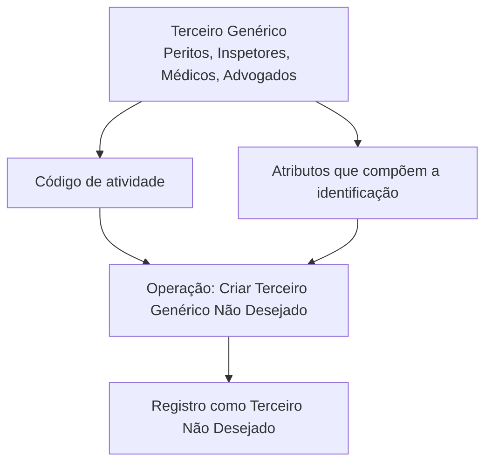

# Operação Criar Terceiro Genérico como Terceiro Não Desejado — Documentação Reef

## 1. Metadados do Documento
- **Arquivo de Origem:** Não identificado no conteúdo fornecido
- **Tipo de Documento:** Procedimento
- **Domínio / Sistema:** Reef / Mapfre
- **Público-Alvo:** Não identificado explicitamente
- **Data/Versão Identificada:** Não identificada
- **Estado do Ciclo de Vida:** Approved Source
- **Proprietário Identificado:** `user:agonzalez_mapfre.com`

---

## 2. Resumo Executivo & Contexto de Negócio

O documento descreve a operação **“Crear Tercero Genérico como Tercero no Deseado”**, disponível na documentação Reef. A operação permite registrar um Terceiro Genérico — incluindo exemplos como peritos, inspetores, médicos e advogados — como um **Terceiro Não Desejado**.

O registro como Terceiro Não Desejado é realizado de acordo com o **código de atividade** do Terceiro Genérico e com os valores dos **atributos que compõem sua identificação**. O conteúdo fornecido não detalha os critérios de elegibilidade, valores permitidos, telas, contratos de API ou etapas operacionais.

A página está classificada como documentação Reef e apresenta o estado de ciclo de vida **Approved Source**. O conteúdo também referencia a navegação corporativa Mapfre, incluindo áreas como Soluções, Arquiteturas, APIs, Componentes, Cloud, Documentação, Zeus, Reef e Ajuda.

---

## 3. Arquitetura, Componentes & Tecnologias Envolvidas

Os componentes e elementos explicitamente citados são:

- **Reef:** contexto da documentação e da operação.
- **Mapfre:** contexto corporativo apresentado na interface documental.
- **Terceiro Genérico:** entidade que pode ser registrada.
- **Terceiro Não Desejado:** classificação ou resultado do registro.
- **Código de atividade:** dado utilizado para o registro.
- **Atributos de identificação:** valores que compõem a identificação do Terceiro Genérico.



> **Nota de Análise:** O documento não detalha sistemas integrados, microsserviços, APIs, tecnologias de implementação, persistência de dados ou ambientes técnicos.

---

## 4. Regras de Negócio, Especificações Funcionais & Processos

1. A operação permite registrar um **Terceiro Genérico** como **Terceiro Não Desejado**.
2. O Terceiro Genérico pode incluir, entre outros exemplos apresentados, **peritos, inspetores, médicos e advogados**.
3. O registro deve considerar o **código de atividade** do Terceiro Genérico.
4. O registro deve considerar os valores dos **atributos que compõem a identificação** do Terceiro Genérico.
5. O documento não informa:
   - quais códigos de atividade são aceitos;
   - quais atributos compõem a identificação;
   - regras de validação dos atributos;
   - critérios que tornam um Terceiro Genérico não desejado;
   - responsáveis pela aprovação;
   - comportamento para registros duplicados;
   - métodos HTTP, contratos JSON ou operações de API.

---

## 5. Tabelas de Parâmetros, Ambientes e Estruturas de Dados

| Item / Parâmetro | Descrição / Função | Tipo / Valores / Formato | Ambiente / Observações |
| :--- | :--- | :--- | :--- |
| Terceiro Genérico | Entidade que pode ser registrada como Terceiro Não Desejado. | Exemplos: Peritos, Inspetores, Médicos, Advogados. | O documento não apresenta estrutura de dados. |
| Terceiro Não Desejado | Classificação atribuída ao Terceiro Genérico por meio da operação descrita. | Não especificado. | Não são descritos critérios de classificação. |
| Código de atividade | Informação considerada no registro do Terceiro Genérico como não desejado. | Não especificado. | Valores válidos não informados. |
| Atributos de identificação | Valores que compõem a identificação do Terceiro Genérico e são considerados no registro. | Não especificado. | Lista de atributos não informada. |
| Operação | “CREAR Tercero Genérico No Deseado”. | Procedimento funcional. | Associada à documentação Reef. |
| Lifecycle | Estado apresentado na página documental. | `Approved Source` | Sem detalhamento adicional. |
| Owner | Proprietário exibido na página documental. | `user:agonzalez_mapfre.com` | Sem detalhamento adicional. |
| Idioma da interface | Idioma exibido na navegação da página. | `ES` | O conteúdo da operação está em espanhol. |

---

## 6. Bateria de Perguntas & Respostas para RAG (FAQ Sintético)

### P1: Qual é o objetivo da operação “Crear Tercero Genérico como Tercero no Deseado”?
**R:** A operação permite registrar um Terceiro Genérico como Terceiro Não Desejado. O registro considera o código de atividade e os valores dos atributos que compõem a identificação do Terceiro Genérico.

### P2: Quais exemplos de Terceiro Genérico são citados na documentação?
**R:** A documentação cita como exemplos de Terceiro Genérico: peritos, inspetores, médicos e advogados.

### P3: Quais informações são consideradas para registrar um Terceiro Genérico como não desejado?
**R:** O registro é realizado de acordo com o código de atividade do Terceiro Genérico e com os valores dos atributos que formam sua identificação.

### P4: A documentação informa quais códigos de atividade podem ser utilizados?
**R:** Não. O documento informa que o código de atividade é considerado na operação, mas não especifica os códigos permitidos, regras de validação ou mapeamentos.

### P5: Quais atributos compõem a identificação do Terceiro Genérico?
**R:** O documento apenas informa que existem atributos que compõem a identificação do Terceiro Genérico. A lista, o formato e as regras de preenchimento desses atributos não são apresentados.

### P6: O documento descreve APIs ou métodos HTTP para criar um Terceiro Genérico Não Desejado?
**R:** Não. O conteúdo não detalha APIs, métodos HTTP, endpoints, contratos JSON, autenticação ou integrações técnicas.

### P7: A operação pertence a qual contexto documental?
**R:** A operação é apresentada na documentação Reef, em um contexto corporativo que também referencia Mapfre.

### P8: Qual é o estado do ciclo de vida apresentado para a página documental?
**R:** A página apresenta o ciclo de vida como `Approved Source`.

### P9: Quem é o proprietário identificado na página da documentação?
**R:** O proprietário apresentado é `user:agonzalez_mapfre.com`.

### P10: O documento explica os critérios para classificar um Terceiro Genérico como não desejado?
**R:** Não. O documento informa que a classificação depende do código de atividade e dos atributos de identificação, mas não detalha os critérios de negócio aplicáveis.

---

## 7. Glossário de Termos, Siglas & Conceitos-Chave

- **Reef:** Nome do contexto de documentação no qual a operação é apresentada.
- **Mapfre:** Nome exibido na interface corporativa de documentação.
- **Terceiro Genérico:** Entidade que pode ser registrada como Terceiro Não Desejado; os exemplos citados são peritos, inspetores, médicos e advogados.
- **Terceiro Não Desejado:** Classificação atribuída ao Terceiro Genérico pela operação documentada.
- **Código de atividade:** Informação do Terceiro Genérico considerada no registro como Terceiro Não Desejado.
- **Atributos de identificação:** Valores que compõem a identificação do Terceiro Genérico e são considerados no registro.
- **Lifecycle:** Campo de ciclo de vida exibido como `Approved Source`.
- **Owner:** Campo de propriedade exibido como `user:agonzalez_mapfre.com`.

---

## 8. Notas Críticas, Riscos & Limitações

- O conteúdo fornecido é resumido e não descreve o procedimento operacional passo a passo.
- Não há detalhamento dos códigos de atividade, atributos de identificação ou regras de validação.
- Não há contratos de integração, APIs, URLs, ambientes, credenciais, perfis de acesso ou mecanismos de auditoria.
- Não são informados critérios objetivos para determinar que um Terceiro Genérico deve ser classificado como Terceiro Não Desejado.
- Não há informação sobre tratamento de falhas, duplicidades, alterações, exclusões ou aprovação do registro.
- **Nota de Análise:** O documento lista a operação de criação de Terceiro Genérico Não Desejado, porém não detalha métodos HTTP, contratos JSON, persistência, regras de acesso ou fluxos de aprovação.

---

## 9. Conteúdo Bruto Estruturado (Referência Fiel)

```text
--- [PÁGINA 1 DE 1] ---

OPERACIÓN CREAR Tercero Genérico como Tercero no Deseado
¿En que consiste?
Esta operación permite registrar al Tercero Genérico (Peritos, Inspectores, Médicos, Abogados,...) como un Tercero No Deseado, de acuerdo
con su código de actividad y de los valores de los atributos que conforman su identicación.
Información del Tercero Genérico No Deseado
 CREAR Tercero Genérico No Deseado ( )
Documentation / DOCUMENTACIÓN Reef
DOCUMENTACIÓN Reef
Mapfredocument
DOCUMENTACIÓN Reef
Owner
user:agonzalez_mapfre.com
Lifecycle
Approved Source
 /
VL
Buscar Inicio Soluciones Arquitecturas APIs Componentes Cloud Documentación Zeus Reef Ayuda
ES
```
