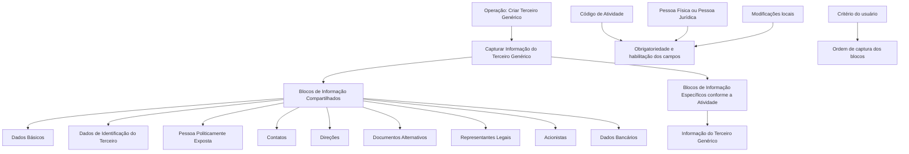

# Operação Criar Terceiro Genérico — Documentação Reef

## 1. Metadados do Documento
- **Arquivo de Origem:** `Não identificado`
- **Tipo de Documento:** `Procedimento`
- **Domínio / Sistema:** `Reef / Mapfre`
- **Público-Alvo:** `Usuários do sistema`
- **Data/Versão Identificada:** `Não identificada`

---

## 2. Resumo Executivo & Contexto de Negócio

O documento descreve a operação **Criar Terceiro Genérico**, destinada à captura das informações associadas aos denominados Terceiros Genéricos. A operação organiza o cadastro em blocos de informação compartilhados e em blocos específicos conforme a atividade do Terceiro.

A obrigatoriedade e a habilitação dos campos não são uniformes para todos os cadastros. Esses comportamentos podem variar de acordo com o código de atividade do Terceiro, com a classificação como Pessoa Física ou Pessoa Jurídica e com modificações implementadas localmente.

O fluxo de captura não possui uma sequência fixa universal. O documento informa que a ordem de preenchimento dos blocos de informação pode variar conforme o critério adotado pelo usuário no sistema.

A documentação apresenta blocos compartilhados, como Dados Básicos, Contatos e Dados Bancários, além de blocos específicos definidos conforme a atividade do Terceiro. Entretanto, o conteúdo não detalha campos individuais, regras de validação por campo, contratos técnicos, métodos HTTP ou integrações externas.

---

## 3. Arquitetura, Componentes & Tecnologias Envolvidas

Os elementos identificados no documento são:

- Operação **Criar Terceiro Genérico**.
- Blocos de Informação Compartilhados da operação **Criar Terceiro**.
- Blocos de Informação Específicos conforme a Atividade do Terceiro.
- Sistema ou repositório documental identificado como **Reef**.
- Referência visual a **Mapfre** e **Mapfredocument**.
- Estruturas relacionadas a Pessoa Física, Pessoa Jurídica, código de atividade e configurações locais.



> **Nota de Análise:** O documento não descreve arquitetura técnica de infraestrutura, APIs, bancos de dados, microsserviços, URLs de ambiente, tecnologias de implementação ou contratos de integração.

---

## 4. Regras de Negócio, Especificações Funcionais & Processos

### Operação principal

A operação **Criar Terceiro Genérico** permite capturar a informação dos denominados Terceiros Genéricos.

### Premissas de preenchimento

1. A obrigatoriedade e/ou a habilitação dos campos registrados em cada bloco ou estrutura de informação compartilhada podem variar conforme o **código de atividade do Terceiro**.
2. A obrigatoriedade e/ou a habilitação dos campos também podem variar quando o tipo de Terceiro for:
   - Pessoa Física.
   - Pessoa Jurídica.
3. Modificações implementadas localmente podem afetar o comportamento da aplicação em relação à obrigatoriedade de registro dos Dados do Terceiro.
4. A ordem de captura dos dados nos diferentes blocos de informação pode variar de acordo com o critério seguido pelo usuário no sistema.

### Processo de criação

1. Iniciar a operação **Criar Terceiro**.
2. Capturar a Informação do Terceiro Genérico.
3. Registrar os dados aplicáveis nos blocos de informação compartilhados.
4. Registrar os dados nos blocos específicos conforme a atividade do Terceiro.
5. Considerar as regras de obrigatoriedade e habilitação aplicáveis ao código de atividade, tipo de Terceiro e modificações locais.
6. Preencher os blocos na ordem definida pelo critério do usuário no sistema.

---

## 5. Tabelas de Parâmetros, Ambientes e Estruturas de Dados

| Item / Parâmetro | Descrição / Função | Tipo / Valores / Formato | Ambiente / Observações |
| :--- | :--- | :--- | :--- |
| Operação Criar Terceiro Genérico | Permite capturar informações dos denominados Terceiros Genéricos. | Operação de cadastro. | Documento associado à documentação Reef. |
| Código de atividade do Terceiro | Pode influenciar a obrigatoriedade e a habilitação de campos nos blocos compartilhados. | Código de atividade. | Valores não detalhados. |
| Tipo de Terceiro | Pode influenciar a obrigatoriedade e a habilitação de campos. | Pessoa Física ou Pessoa Jurídica. | Regras específicas não detalhadas. |
| Modificações locais | Podem afetar a obrigatoriedade no registro dos Dados do Terceiro. | Configuração ou implementação local. | Não detalhada. |
| Ordem de captura | Pode variar entre os blocos de informação. | Critério seguido pelo usuário no sistema. | Não há sequência obrigatória documentada. |
| Dados Básicos | Bloco de Informação Compartilhado. | Estrutura de informação. | Campos não detalhados. |
| Dados de Identificação do Terceiro | Bloco de Informação Compartilhado. | Estrutura de informação. | Campos não detalhados. |
| Pessoa Politicamente Exposta | Bloco de Informação Compartilhado. | Estrutura de informação. | Campos e critérios não detalhados. |
| Contatos | Bloco de Informação Compartilhado. | Estrutura de informação. | Campos não detalhados. |
| Direções | Bloco de Informação Compartilhado. | Estrutura de informação. | Campos não detalhados. |
| Documentos Alternativos | Bloco de Informação Compartilhado. | Estrutura de informação. | Campos não detalhados. |
| Representantes Legais | Bloco de Informação Compartilhado. | Estrutura de informação. | Campos não detalhados. |
| Acionistas | Bloco de Informação Compartilhado. | Estrutura de informação. | Campos não detalhados. |
| Dados Bancários | Bloco de Informação Compartilhado. | Estrutura de informação. | Campos não detalhados. |
| Informação do Terceiro Genérico | Bloco específico de acordo com a atividade do Terceiro. | Estrutura de informação. | Conteúdo não detalhado. |

---

## 6. Bateria de Perguntas & Respostas para RAG (FAQ Sintético)

### P1: Em que consiste a operação Criar Terceiro Genérico?
**R:** A operação Criar Terceiro Genérico permite capturar a informação dos denominados Terceiros Genéricos por meio de blocos de informação compartilhados e blocos específicos conforme a atividade do Terceiro.

### P2: A obrigatoriedade dos campos é igual para todos os Terceiros?
**R:** Não. A obrigatoriedade e/ou a habilitação dos campos pode variar conforme o código de atividade do Terceiro, o tipo de Terceiro — Pessoa Física ou Pessoa Jurídica — e modificações implementadas localmente.

### P3: O código de atividade do Terceiro influencia o cadastro?
**R:** Sim. O documento estabelece que o código de atividade do Terceiro pode influenciar a obrigatoriedade e/ou a habilitação dos campos em cada bloco ou estrutura de informação compartilhada.

### P4: Qual é o impacto de o Terceiro ser Pessoa Física ou Pessoa Jurídica?
**R:** O tipo de Terceiro pode alterar a obrigatoriedade e/ou a habilitação dos campos registrados nos blocos ou estruturas de informação compartilhada.

### P5: Modificações locais podem alterar o comportamento do cadastro?
**R:** Sim. O documento informa que modificações implementadas localmente podem afetar o comportamento da aplicação quanto à obrigatoriedade do registro dos Dados do Terceiro.

### P6: Existe uma ordem fixa para preencher os blocos de informação?
**R:** Não. A ordem de captura dos dados nos blocos de informação pode variar segundo o critério seguido pelo usuário no sistema.

### P7: Quais blocos de informação compartilhados são citados para Criar Terceiro?
**R:** O documento cita Dados Básicos, Dados de Identificação do Terceiro, Pessoa Politicamente Exposta, Contatos, Direções, Documentos Alternativos, Representantes Legais, Acionistas e Dados Bancários.

### P8: O que são os blocos específicos de acordo com a atividade do Terceiro?
**R:** São blocos de informação aplicáveis conforme a atividade do Terceiro. O documento identifica a Informação do Terceiro Genérico como bloco específico, mas não detalha seus campos ou critérios de preenchimento.

### P9: O documento informa quais campos existem em Dados Bancários?
**R:** Não. O documento apenas lista Dados Bancários como um Bloco de Informação Compartilhado, sem apresentar campos, formatos, validações ou obrigatoriedade específica.

### P10: O documento define APIs ou contratos técnicos para Criar Terceiro Genérico?
**R:** Não. O conteúdo fornecido não apresenta métodos HTTP, endpoints, contratos JSON, integrações, tecnologias de implementação ou especificações de API.

---

## 7. Glossário de Termos, Siglas & Conceitos-Chave

- **Terceiro Genérico:** Entidade cujas informações são capturadas pela operação Criar Terceiro Genérico.
- **Blocos de Informação Compartilhados:** Estruturas de informação listadas para a operação Criar Terceiro, incluindo Dados Básicos, Contatos, Dados Bancários e outros blocos citados.
- **Blocos de Informação Específicos:** Estruturas de informação aplicáveis de acordo com a atividade do Terceiro.
- **Pessoa Física:** Tipo de Terceiro citado como fator que pode alterar obrigatoriedade e habilitação de campos.
- **Pessoa Jurídica:** Tipo de Terceiro citado como fator que pode alterar obrigatoriedade e habilitação de campos.
- **Pessoa Politicamente Exposta:** Bloco de Informação Compartilhado citado no processo Criar Terceiro.
- **Reef:** Nome presente na documentação e na identificação do repositório documental.
- **Mapfre:** Nome presente no rodapé ou identificação visual do conteúdo extraído.

---

## 8. Notas Críticas, Riscos & Limitações

- O documento não detalha os campos internos de nenhum bloco de informação.
- O documento não apresenta regras específicas de obrigatoriedade por código de atividade ou por tipo de Terceiro.
- O documento não informa quais modificações locais existem, onde são configuradas ou como alteram o comportamento da aplicação.
- O documento não define uma sequência obrigatória para a captura das informações; a ordem pode variar conforme o critério do usuário.
- O documento não descreve APIs, integrações, métodos HTTP, estruturas JSON, persistência de dados, autenticação, ambientes ou logs.
- O documento lista o bloco **Informação do Terceiro Genérico**, mas não fornece detalhamento adicional sobre sua estrutura ou regras.

---

## 9. Conteúdo Bruto Estruturado (Referência Fiel)

```text
--- [PÁGINA 1 DE 2] ---

OPERACIÓN CREAR Tercero Genérico
¿En que consiste?
Esta operación permite capturar la Información de los denominados Terceros Genéricos.
Premisas
La obligatoriedad y/o la habilitación de los campos en el registro de los datos de cada uno de los bloques o estructuras de información
compartidas puede variar de acuerdo con el código de actividad del Tercero:
La obligatoriedad y/o la habilitación de los campos en el registro de los datos de cada uno de los bloques o estructuras de información
pueden variar si el tipo de Tercero es una Persona Física o una Persona Jurídica:
Las modificaciones que se hubieran podido implementar localmente a su vez pueden afectar el comportamiento de la aplicación en
relación con la obligatoriedad en el registro de los Datos del Tercero.
Por último, el orden de captura de los datos en los distintos bloques de Información puede variar de acuerdo con el criterio seguido por el
Usuario en el Sistema.
Proceso
CREAR
TERCERO
Crear Información
del Tercero Genérico
Bloques de Información Compartidos (CREAR TERCERO)
 Datos Básicos ( )
 Datos Identificación del Tercero ( )
 Persona Políticamente Expuesta ( )
 Contactos ( )
 Direcciones ( )
 Documentos Alternativos ( )
 Representantes Legales ( )
Ejemplo:
Ejemplo:
Documentation / DOCUMENTACIÓN Reef
DOCUMENTACIÓN Reef
Mapfredocument
DOCUMENTACIÓN Reef
Owner
user:agonzalez_mapfre.com
Lifecycle
Approved Source
 /
VL
Buscar Inicio Soluciones Arquitecturas APIs Componentes Cloud Documentación Zeus Reef Ayuda
ES


--- [PÁGINA 2 DE 2] ---

Accionistas ( )
 Datos Bancarios ( )
Bloques de Información Específicos de acuerdo con la Actividad del Tercero.
 Información del Tercero Genérico ( )
```
