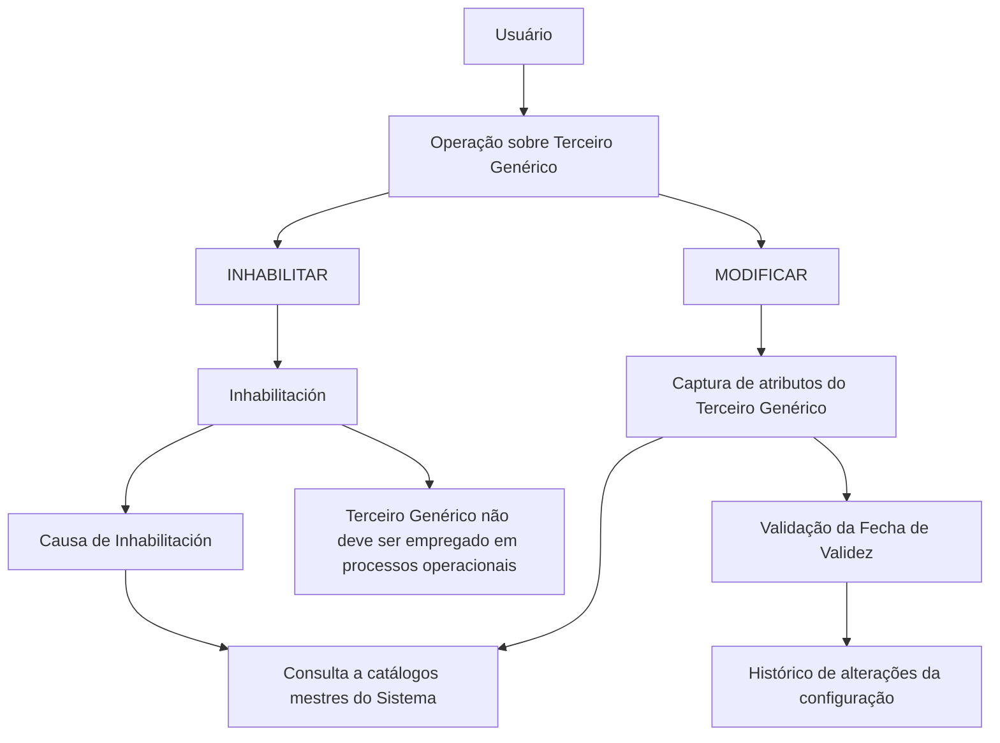

# Operação de Modificação e Inabilitação de Terceiros Genéricos — Documentação Reef

## 1. Metadados do Documento
- **Arquivo de Origem:** Não identificado no conteúdo fornecido
- **Tipo de Documento:** Especificação Funcional
- **Domínio / Sistema:** DOCUMENTACIÓN Reef / Sistema de gestão de Terceiros Genéricos
- **Público-Alvo:** Usuários operacionais, negócio e equipes responsáveis pela configuração de terceiros
- **Data/Versão Identificada:** Não identificada
- **Owner identificado:** `user:agonzalez_mapfre.com`
- **Lifecycle identificado:** `Approved`

---

## 2. Resumo Executivo & Contexto de Negócio

O documento descreve a operação destinada a complementar e modificar informações previamente registradas de um **Tercero Genérico** (Terceiro Genérico). A mesma operação também permite inabilitar o Terceiro Genérico no sistema.

As ações explicitamente habilitadas são **MODIFICAR** e **INHABILITAR**. A documentação organiza os atributos segundo a sequência de captura no bloco de informações de Terceiro Genérico, orientada da esquerda para a direita e de cima para baixo.

Salvo indicação expressa em contrário, os atributos se aplicam tanto a **Personas Físicas** quanto a **Personas Jurídicas**. Diversos atributos dependem de catálogos mestres existentes no sistema, incluindo catálogos de Escritórios Comerciais, Agrupamentos Comerciais, Compensações, Códigos de Qualidade, Causas de Inabilitação e Classificações.

A propriedade **Fecha de Validez** suporta o histórico de alterações de configuração do Terceiro Genérico. A data informada deve ser igual ou posterior à data registrada anteriormente. A propriedade **Inhabilitación** indica que o Terceiro Genérico não deve ser empregado, contemplado ou considerado nos processos operacionais da entidade seguradora.

---

## 3. Arquitetura, Componentes & Tecnologias Envolvidas

O conteúdo não descreve arquitetura técnica, APIs, protocolos, integrações, microsserviços, bancos de dados, URLs, ambientes ou tecnologias de implementação.

Os componentes funcionais identificados são:

- **DOCUMENTACIÓN Reef:** repositório ou contexto documental identificado no conteúdo.
- **Sistema:** sistema que registra, consulta e aplica a configuração do Terceiro Genérico.
- **Terceiro Genérico:** entidade cujas informações podem ser modificadas ou inabilitadas.
- **Entidade Seguradora:** entidade para a qual determinadas configurações, como Tipo de Retenção e Identificação Fiscal, são aplicáveis.
- **Catálogos mestres:** fontes de valores para diversos atributos do Terceiro Genérico.



> **Nota de Análise:** O documento não detalha interfaces, contratos JSON, métodos HTTP, persistência de dados, permissões, responsáveis pela aprovação nem comportamento de erro da operação.

---

## 4. Regras de Negócio, Especificações Funcionais & Processos

### 4.1 Objetivo da operação

A operação permite:

1. Complementar a informação do Terceiro Genérico previamente registrada.
2. Modificar a informação do Terceiro Genérico previamente registrada.
3. Inabilitar o Terceiro Genérico.

### 4.2 Ações habilitadas

- **MODIFICAR**
- **INHABILITAR**

### 4.3 Aplicabilidade dos atributos

Os atributos apresentados devem ser utilizados tanto para Pessoas Físicas quanto para Pessoas Jurídicas, exceto quando houver indicação expressa diferente no documento.

### 4.4 Sequência de captura

A sequência de captura dos atributos no bloco de informações deve seguir a disposição visual indicada pelo documento:

1. Da esquerda para a direita.
2. De cima para baixo.

### 4.5 Regras dos atributos

#### Oficina Comercial Asociada

O atributo contém o código do terceiro nível da Estrutura Comercial da qual procede o Terceiro Genérico. O valor deve respeitar a relação de valores existente no catálogo mestre de Escritórios Comerciais do sistema.

#### Agrupamiento Comercial del Asegurado

O campo contém a Agrupação Comercial associada ao Terceiro Genérico. O valor deve ser selecionado conforme a relação de valores definida no catálogo mestre de Agrupamentos existente no sistema.

#### Compensación

O dado indica o código da forma de cobrança/pagamento do segurado, conforme as possíveis Formas de Compensação definidas no catálogo mestre de Compensações.

#### Calidad del Tercero Genérico

O campo contém a condição de qualidade vinculada ao Terceiro Genérico, de acordo com um dos valores existentes no catálogo mestre de Códigos de Qualidade do sistema.

#### Tipo de Retención

O dado contém o código de um dos Tipos de Retenção configurados localmente pela Entidade Seguradora.

#### Fecha de Validez

A propriedade indica a data a partir da qual o Terceiro Genérico está plenamente operacional no sistema.

A utilização correta da Fecha de Validez permite manter um histórico das mudanças efetuadas na configuração do Terceiro Genérico na Entidade Seguradora.

A data informada deve ser:

- Igual à data registrada anteriormente; ou
- Superior à data registrada anteriormente.

#### Inhabilitación

A propriedade informa ao sistema que o Terceiro Genérico está inabilitado. Um Terceiro Genérico inabilitado não deve ser empregado, contemplado ou considerado nos processos operacionais da Entidade Seguradora.

#### Causa de Inhabilitación

Se o Terceiro Genérico estiver inabilitado, este atributo deve conter o código de uma das Causas de Inabilitação definidas no catálogo mestre do sistema.

#### Clasificación

O campo contém a Classificação do Terceiro Genérico conforme a relação de valores existente no catálogo mestre de Classificações do sistema.

#### Número de Colegiación

O campo contém a chave ou código da Cédula Profissional. Essa cédula habilita o Terceiro Genérico, por pertencer a um colégio profissional ou associação oficial semelhante, a exercer sua profissão.

#### Identificación Fiscal

O atributo representa a chave do identificador fiscal do Terceiro Genérico, de acordo com a legislação do país em que está localizada a Entidade Seguradora.

#### IVA

O campo contém o tipo do Imposto sobre Valor Agregado (IVA) que identifica a tributação fiscal do Terceiro Genérico pelos serviços prestados à Entidade Seguradora.

#### Observaciones

O campo permite ao usuário capturar informação adicional sobre o Terceiro Genérico, de acordo com os direcionamentos ou diretrizes que possam ser definidos pelas Direções de Negócio da Entidade Seguradora.

---

## 5. Tabelas de Parâmetros, Ambientes e Estruturas de Dados

| Item / Parâmetro | Descrição / Função | Tipo / Valores / Formato | Ambiente / Observações |
| :--- | :--- | :--- | :--- |
| Ação `MODIFICAR` | Complementar e modificar informações previamente registradas do Terceiro Genérico | Ação habilitada | A operação não detalha regras de autorização ou persistência |
| Ação `INHABILITAR` | Inabilitar o Terceiro Genérico | Ação habilitada | O Terceiro Genérico inabilitado não deve participar de processos operacionais |
| Oficina Comercial Asociada | Código do terceiro nível da Estrutura Comercial de origem do Terceiro Genérico | Código presente no catálogo mestre de Oficinas Comerciales | Sistema |
| Agrupamiento Comercial del Asegurado | Agrupação Comercial associada ao Terceiro Genérico | Valor presente no catálogo mestre de Agrupaciones | Sistema |
| Compensación | Código da forma de cobrança/pagamento do segurado | Forma de Compensação presente no catálogo mestre de Compensaciones | Sistema |
| Calidad del Tercero Genérico | Condição de qualidade vinculada ao Terceiro Genérico | Valor do catálogo mestre de Códigos de Calidad | Sistema |
| Tipo de Retención | Código de tipo de retenção | Um dos tipos configurados localmente pela Entidade Seguradora | Entidade Seguradora |
| Fecha de Validez | Data a partir da qual o Terceiro Genérico fica plenamente operacional | Data; igual ou superior à data registrada previamente | Permite histórico de alterações de configuração |
| Inhabilitación | Informa que o Terceiro Genérico está inabilitado | Propriedade de inabilitação | O Terceiro Genérico não deve ser empregado, contemplado ou considerado em processos operacionais |
| Causa de Inhabilitación | Motivo associado à inabilitação | Código do catálogo mestre de Causas de Inhabilitación | Aplicável quando o Terceiro Genérico estiver inabilitado |
| Clasificación | Classificação do Terceiro Genérico | Valor do catálogo mestre de Clasificaciones | Sistema |
| Número de Colegiación | Chave ou código da Cédula Profissional | Código ou chave | Relacionado à habilitação profissional do Terceiro |
| Identificación Fiscal | Chave do identificador fiscal do Terceiro Genérico | Conforme a legislação do país da Entidade Seguradora | Entidade Seguradora |
| IVA | Tipo do Imposto sobre Valor Agregado aplicável ao Terceiro Genérico | Tipo de IVA | Relacionado aos serviços prestados à Entidade Seguradora |
| Observaciones | Informação adicional sobre o Terceiro Genérico | Texto livre; formato não especificado | Conforme diretrizes das Direções de Negócio |

---

## 6. Bateria de Perguntas & Respostas para RAG (FAQ Sintético)

### P1: Qual é o objetivo da operação de Terceiro Genérico?
**R:** A operação permite complementar e modificar informações previamente registradas de um Terceiro Genérico. A operação também permite inabilitar o Terceiro Genérico no sistema.

### P2: Quais ações estão habilitadas na operação de Terceiro Genérico?
**R:** As ações habilitadas são `MODIFICAR` e `INHABILITAR`.

### P3: Os atributos do Terceiro Genérico são aplicáveis a Pessoas Físicas e Pessoas Jurídicas?
**R:** Sim. Caso não exista indicação expressa em sentido diferente, os atributos devem ser empregados tanto para Pessoas Físicas quanto para Pessoas Jurídicas.

### P4: Como deve ser preenchida a Fecha de Validez do Terceiro Genérico?
**R:** A Fecha de Validez indica a data a partir da qual o Terceiro Genérico está plenamente operacional no sistema. O valor informado deve ter a mesma data ou uma data superior à registrada previamente.

### P5: Qual é a finalidade da Fecha de Validez na configuração do Terceiro Genérico?
**R:** A Fecha de Validez permite manter, na Entidade Seguradora, um histórico das alterações efetuadas na configuração do Terceiro Genérico.

### P6: Qual é o efeito operacional da Inhabilitación?
**R:** A Inhabilitación informa ao sistema que o Terceiro Genérico está inabilitado. Um Terceiro Genérico inabilitado não deve ser empregado, contemplado nem considerado nos processos operacionais da Entidade Seguradora.

### P7: Quando a Causa de Inhabilitación deve ser informada?
**R:** A Causa de Inhabilitación deve conter o código de uma causa definida no catálogo mestre do sistema quando o Terceiro Genérico estiver inabilitado.

### P8: De onde deve vir o valor de Oficina Comercial Asociada?
**R:** Oficina Comercial Asociada deve conter o código do terceiro nível da Estrutura Comercial de origem do Terceiro Genérico, de acordo com os valores existentes no catálogo mestre de Oficinas Comerciales do sistema.

### P9: O que representa o atributo Compensación?
**R:** Compensación indica o código da forma de cobrança ou pagamento do segurado, conforme as possíveis Formas de Compensação definidas no catálogo mestre de Compensaciones.

### P10: Como é determinado o Tipo de Retención?
**R:** Tipo de Retención contém o código de um dos Tipos de Retenção configurados localmente pela Entidade Seguradora.

### P11: Qual é a finalidade do Número de Colegiación?
**R:** Número de Colegiación contém a chave ou código da Cédula Profissional que habilita o Terceiro Genérico, por sua vinculação a um colégio profissional ou associação oficial semelhante, para exercer sua profissão.

### P12: O que deve ser registrado em Observaciones?
**R:** Observaciones permite registrar informação adicional sobre o Terceiro Genérico, conforme os direcionamentos ou diretrizes que possam ser emitidos pelas Direções de Negócio da Entidade Seguradora.

---

## 7. Glossário de Termos, Siglas & Conceitos-Chave

- **DOCUMENTACIÓN Reef:** identificação do contexto documental exibido no conteúdo.
- **Terceiro Genérico / Tercero Genérico:** entidade cujas informações podem ser complementadas, modificadas ou inabilitadas.
- **MODIFICAR:** ação habilitada para complementar e modificar informações previamente registradas do Terceiro Genérico.
- **INHABILITAR:** ação habilitada para marcar o Terceiro Genérico como inabilitado no sistema.
- **Oficina Comercial Asociada:** código do terceiro nível da Estrutura Comercial de origem do Terceiro Genérico.
- **Agrupamiento Comercial del Asegurado:** agrupação comercial associada ao Terceiro Genérico.
- **Compensación:** código da forma de cobrança/pagamento do segurado.
- **Fecha de Validez:** data a partir da qual o Terceiro Genérico está plenamente operacional no sistema.
- **Inhabilitación:** propriedade que indica que o Terceiro Genérico não deve ser utilizado em processos operacionais.
- **Causa de Inhabilitación:** código do motivo de inabilitação, definido em catálogo mestre.
- **Número de Colegiación:** chave ou código da Cédula Profissional do Terceiro Genérico.
- **Identificación Fiscal:** chave do identificador fiscal do Terceiro Genérico.
- **IVA:** Imposto sobre Valor Agregado aplicado à tributação fiscal dos serviços prestados pelo Terceiro Genérico.
- **Catálogo maestro:** catálogo mestre do sistema que define valores permitidos para determinados atributos.
- **Entidad Aseguradora:** entidade seguradora para a qual as configurações e processos operacionais descritos são aplicáveis.

---

## 8. Notas Críticas, Riscos & Limitações

- O conteúdo não identifica o arquivo de origem, data, versão, autor formal ou histórico de revisões.
- O documento não descreve campos obrigatórios, formatos técnicos, tamanhos máximos, valores padrão ou regras de nulidade.
- O documento não especifica os códigos concretos disponíveis nos catálogos mestres.
- Não há detalhamento de perfis de acesso, permissões, trilha de auditoria, aprovação ou segregação de funções para modificar ou inabilitar um Terceiro Genérico.
- Não são documentados fluxos de erro, mensagens de validação, integrações, APIs, contratos de dados ou tecnologias de implementação.
- O texto extraído contém caracteres corrompidos em alguns trechos, como `Modicar`, `Ocina`, `congurados` e `scal`; a interpretação foi limitada ao significado contextual explícito.
- O documento inclui “Ejemplo:” duas vezes, sem apresentar conteúdo de exemplo adicional.

---

## 9. Conteúdo Bruto Estruturado (Referência Fiel)

```text
--- [PÁGINA 1 DE 2] ---

MODIFICAR Información para los Terceros Genéricos
Objetivo
Esta Operación permite Complementar y Modicar la información del Tercero Genérico registrada previamente además de poder
Inhabilitarlo.
Acciones habilitadas
 MODIFICAR ( )
 INHABILITAR ( )
Datos Tercero Genérico
De Izquierda a Derecha y de Arriba hacia Abajo, los siguientes atributos marcan la secuencia de captura en este Bloque de Información.
Si no se especica o indica expresamente, los Atributos se emplearán tanto en Personas Físicas como en Personas Jurídicas
Ocina Comercial Asociada (  )
Este atributo contiene el código del Tercer Nivel de la Estructura Comercial del que procede el Tercero Genérico, de acuerdo con la relación de
valores existentes en el catálogo maestro de Ocinas Comerciales existente en el Sistema.
Agrupamiento Comercial del Asegurado (  )
Este Campo contendrá la Agrupación Comercial que se asocia al Tercero Genérico de acuerdo con la relación de valores denidos en el
catálogo maestro de Agrupaciones existente en el Sistema.
Compensación (  )
Este Dato indicará el Código de la Forma de Cobro/Pago del Asegurado de acuerdo con las posibles Formas de Compensación denidas en
el catálogo maestro de Compensaciones
Documentation / DOCUMENTACIÓN Reef
DOCUMENTACIÓN Reef
Mapfredocument
DOCUMENTACIÓN Reef
Owner
user:agonzalez_mapfre.com
Lifecycle
Approved Source
 / 
 VL
Buscar Inicio Soluciones Arquitecturas APIs Componentes Cloud Documentación Zeus Reef Ayuda
ES

--- [PÁGINA 2 DE 2] ---

Calidad del Tercero Genérico (  )
Este Campo contendrá la condición de calidad vinculada al Tercero Genérico de acuerdo con uno de valores existentes en el catálogo
maestro de Códigos de Calidad existente en el Sistema.
Tipo de Retención (  )
Este Dato contiene el código de uno de los Tipos de Retención congurados localmente por la Entidad Aseguradora.
Fecha de Validez ( )
Esta propiedad indica la fecha a partir de la cual el Tercero Genérico está plenamente operativo en el sistema por lo que su empleo y correcta
utilización permite tener en la entidad Aseguradora un histórico de los cambios efectuados en la conguración del Tercero.
Por tanto su valor tendrá que tener la misma fecha u otra superior a la registrada previamente.
Inhabilitación ( )
Esta propiedad le indica al Sistema que el Tercero Genérico está inhabilitado en el Sistema por lo que no debería ser empleado, contemplado
o considerado en los procesos operativos de la entidad.
Causa de Inhabilitación (   )
En el supuesto que el Tercero Genérico estuviera Inhabilitado, este atributo contendrá el código de una de las Causas de Inhabilitación
denidas en el catálogo maestro del Sistema.
Clasicación (  )
Este Campo contendrá la Clasicación del Tercero Genérico de acuerdo con la relación de valores existentes en el catálogo maestro de
Clasicaciones existente en el Sistema.
Número de Colegiación ( )
Este Campo va a contener la clave ó código de la Cédula Profesional por la que el Tercero, por pertenecer a un colegio profesional o
asociación semejante de carácter ocial, está habilitado para ejercer en el desempeño de su profesión.
Identicación Fiscal ( )
Clave del Identicador scal del Tercero Genérico de acuerdo con la Legislación del País en el que se ubica la Entidad Aseguradora.
IVA (  )
Este campo contiene el Tipo del Impuesto de Valor Añadido (IVA) que identicará el gravamen scal del Tercero Genérico por los servicios
prestados a la Entidad Aseguradora.
Observaciones ( )
El propósito de este campo permite al Usuario capturar información adicional del Tercero Genérico de acuerdo con los Planteamientos o
directrices que pudieran efectuar las Direcciones de Negocio de la entidad aseguradora.
Ejemplo:
Ejemplo:
```
