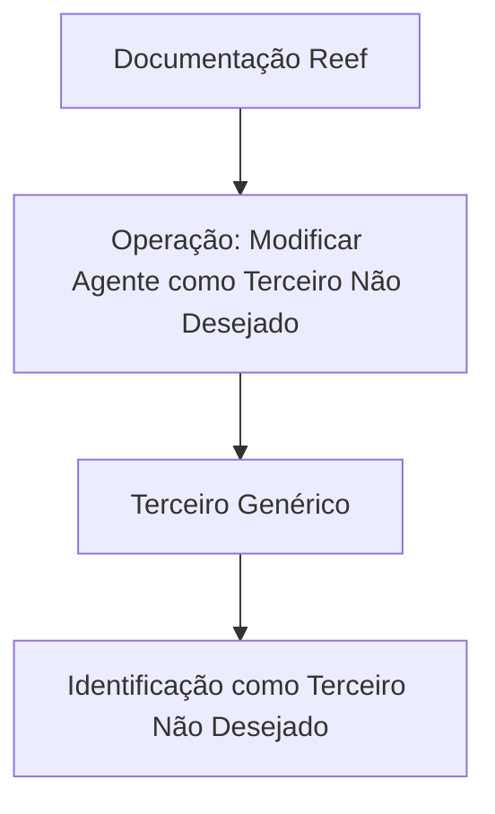

# Operação Reef: Modificar Agente como Terceiro Não Desejado

## 1. Metadados do Documento
- **Arquivo de Origem:** Não identificado
- **Tipo de Documento:** Documentação de operação
- **Domínio / Sistema:** Reef / Mapfre
- **Público-Alvo:** Não identificado
- **Data/Versão Identificada:** Não identificada

---

## 2. Resumo Executivo & Contexto de Negócio

O documento descreve a operação **“Modificar Agente como Terceiro Não Desejado”** no contexto da documentação Reef. A finalidade declarada é modificar informações de um **Terceiro Genérico** que o identificam como **Terceiro Não Desejado**.

A operação está associada à seção ou capacidade denominada **“Informação do Agente Não Desejado”**. O conteúdo também apresenta a expressão **“MODIFICAR Terceiro Genérico No Desejado”**, indicando que a modificação é aplicada a esse tipo de terceiro.

O documento contém elementos de navegação da documentação Reef, incluindo categorias como Soluções, Arquiteturas, APIs, Componentes, Cloud, Documentação e Zeus. Também identifica o proprietário como `user:agonzalez_mapfre.com` e o ciclo de vida como **Approved Source**.

Não há detalhamento adicional sobre regras de validação, campos editáveis, interfaces, contratos de API, métodos HTTP, permissões, persistência de dados ou efeitos posteriores da modificação.

---

## 3. Arquitetura, Componentes & Tecnologias Envolvidas

Os únicos sistemas e contextos explicitamente citados são:

| Componente / Termo | Papel identificado no documento |
| :--- | :--- |
| Reef | Sistema ou domínio da documentação da operação. |
| Mapfre | Contexto corporativo identificado pela ocorrência de `Mapfredocument`. |
| Terceiro Genérico | Entidade cuja informação é modificada para identificação como Terceiro Não Desejado. |
| Agente Não Desejado | Contexto funcional associado às informações tratadas pela operação. |
| Zeus | Categoria disponível na navegação da documentação Reef. |
| Soluções, Arquiteturas, APIs, Componentes, Cloud, Documentação | Categorias de navegação apresentadas no conteúdo bruto. |



> **Nota de Análise:** O diagrama representa somente a relação funcional explicitamente apresentada. O documento não descreve arquitetura técnica, integrações, APIs, bancos de dados, camadas de software ou fluxo operacional detalhado.

---

## 4. Regras de Negócio, Especificações Funcionais & Processos

1. A operação é denominada **“Modificar Agente como Terceiro Não Desejado”**.
2. A operação permite modificar a informação de um **Terceiro Genérico**.
3. A finalidade da modificação é identificar o Terceiro Genérico como **Terceiro Não Desejado**.
4. O documento associa a operação à **Informação do Agente Não Desejado**.
5. O conteúdo inclui a designação **“MODIFICAR Terceiro Genérico No Desejado”**.
6. O documento não especifica:
   - Os campos que podem ser modificados.
   - As condições para classificar um Terceiro Genérico como Terceiro Não Desejado.
   - Os perfis ou permissões necessários para executar a operação.
   - As validações de entrada.
   - Os estados anteriores ou posteriores do registro.
   - O canal de execução, tela, endpoint, método HTTP ou contrato JSON.
   - As consequências operacionais ou integrações disparadas pela modificação.

---

## 5. Tabelas de Parâmetros, Ambientes e Estruturas de Dados

| Item / Parâmetro | Descrição / Função | Tipo / Valores / Formato | Ambiente / Observações |
| :--- | :--- | :--- | :--- |
| Operação | Modificar Agente como Terceiro Não Desejado. | Operação funcional. | Documentação Reef. |
| Entidade tratada | Terceiro Genérico. | Entidade de negócio. | A informação da entidade é modificada. |
| Resultado funcional | Identificação como Terceiro Não Desejado. | Classificação ou identificação funcional. | Critérios não detalhados. |
| Contexto de informação | Informação do Agente Não Desejado. | Seção ou contexto funcional. | Não há campos descritos. |
| Owner | `user:agonzalez_mapfre.com` | Identificador de proprietário. | Apresentado como Owner. |
| Lifecycle | Approved Source | Estado de ciclo de vida. | Significado operacional não detalhado. |
| Idioma da documentação | ES | Código exibido na navegação. | O conteúdo operacional está em espanhol. |
| Navegação | Buscar, Inicio, Soluciones, Arquitecturas, APIs, Componentes, Cloud, Documentación, Zeus, Reef, Ayuda | Itens de navegação. | Sem especificação funcional adicional. |

---

## 6. Bateria de Perguntas & Respostas para RAG (FAQ Sintético)

### P1: Qual é o objetivo da operação “Modificar Agente como Terceiro Não Desejado”?
**R:** A operação permite modificar a informação de um Terceiro Genérico para que esse Terceiro Genérico seja identificado como Terceiro Não Desejado.

### P2: Qual entidade de negócio é alterada pela operação documentada?
**R:** A entidade mencionada no documento é o **Terceiro Genérico**.

### P3: Qual classificação é associada ao Terceiro Genérico após a modificação?
**R:** O objetivo declarado da modificação é identificar o Terceiro Genérico como **Terceiro Não Desejado**.

### P4: O documento informa quais campos do Terceiro Genérico podem ser modificados?
**R:** Não. O documento informa que a informação do Terceiro Genérico é modificada, mas não enumera campos, atributos, formatos ou regras de preenchimento.

### P5: A operação “Modificar Agente como Terceiro Não Desejado” descreve endpoints ou métodos HTTP?
**R:** Não. O documento não detalha APIs, endpoints, métodos HTTP, contratos JSON ou integrações técnicas.

### P6: Quais regras validam a classificação de um Terceiro Genérico como Terceiro Não Desejado?
**R:** O documento não apresenta critérios, condições de negócio, validações ou evidências necessárias para essa classificação.

### P7: Em qual contexto documental a operação está registrada?
**R:** A operação está registrada na **Documentação Reef**, com referências ao contexto corporativo Mapfre.

### P8: Quem é indicado como proprietário do conteúdo documentado?
**R:** O campo **Owner** apresenta `user:agonzalez_mapfre.com`.

### P9: Qual ciclo de vida é exibido para o documento?
**R:** O documento exibe o valor **Approved Source** no campo **Lifecycle**.

### P10: O documento define permissões ou perfis de acesso para modificar um Agente como Terceiro Não Desejado?
**R:** Não. Não há informação sobre usuários autorizados, matrizes de permissão, autenticação ou perfis de acesso.

---

## 7. Glossário de Termos, Siglas & Conceitos-Chave

- **Reef:** Sistema ou domínio documental citado como “DOCUMENTACIÓN Reef”.
- **Terceiro Genérico:** Entidade de negócio cuja informação pode ser modificada pela operação.
- **Terceiro Não Desejado:** Identificação atribuída ao Terceiro Genérico como resultado pretendido pela operação.
- **Agente Não Desejado:** Contexto funcional citado na seção “Información del Agente No Deseado”.
- **Owner:** Campo que identifica o proprietário do documento; o valor apresentado é `user:agonzalez_mapfre.com`.
- **Lifecycle:** Campo de ciclo de vida do documento; o valor apresentado é **Approved Source**.
- **Zeus:** Termo exibido como categoria de navegação na documentação Reef.
- **ES:** Código de idioma exibido na interface de navegação.

---

## 8. Notas Críticas, Riscos & Limitações

- O documento possui conteúdo funcional muito resumido.
- Não são apresentados campos, parâmetros, formatos, regras de validação ou critérios de elegibilidade.
- Não há descrição de tela, procedimento passo a passo, mecanismo de persistência ou confirmação de sucesso.
- Não são descritas integrações com APIs, microsserviços, bancos de dados ou sistemas externos.
- Não há dados sobre controle de acesso, auditoria, logs, tratamento de erros ou reversão da alteração.
- **Nota de Análise:** O documento lista a operação de modificação de um Terceiro Genérico para identificação como Terceiro Não Desejado, porém não detalha o comportamento técnico ou funcional necessário para executar e validar essa modificação.

---

## 9. Conteúdo Bruto Estruturado (Referência Fiel)

```text
--- [PÁGINA 1 DE 1] ---

OPERACIÓN MODIFICAR Agente como Tercero no Deseado
¿En que consiste?
Esta operación permite Modicar la información del Tercero Genérico por la que se le identica como Tercero No Deseado.
Información del Agente No Deseado
 MODIFICAR Tercero Genérico No Deseado (  )
Documentation / DOCUMENTACIÓN Reef
DOCUMENTACIÓN Reef
Mapfredocument
DOCUMENTACIÓN Reef
Owner
user:agonzalez_mapfre.com
Lifecycle
Approved Source
 / 
 VL
Buscar Inicio Soluciones Arquitecturas APIs Componentes Cloud Documentación Zeus Reef Ayuda
ES
```
