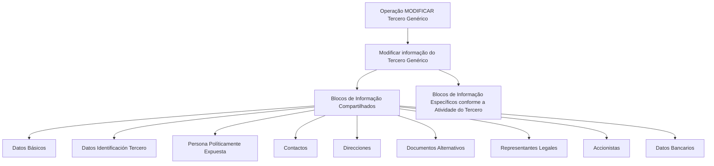

# Operação MODIFICAR Tercero Genérico — Blocos de Informação Compartilhados e Específicos

## 1. Metadados do Documento
- **Arquivo de Origem:** Não identificado
- **Tipo de Documento:** Procedimento
- **Domínio / Sistema:** DOCUMENTACIÓN Reef / Mapfredocument
- **Público-Alvo:** Usuários do sistema, Operação e Negócio
- **Data/Versão Identificada:** Não identificada

---

## 2. Resumo Executivo & Contexto de Negócio

O documento descreve a operação **MODIFICAR Tercero Genérico**, destinada a complementar, modificar e/ou inabilitar informações de um Tercero Genérico. A operação pode atuar em qualquer bloco ou estrutura de dados que contenha e agrupe informações desse terceiro.

A obrigatoriedade e a habilitação dos campos não são fixas. O documento estabelece que esses atributos podem variar conforme o código de atividade do Tercero, bem como conforme o tipo de terceiro: **Persona Física** ou **Persona Jurídica**.

O comportamento da aplicação também pode ser afetado por modificações implementadas localmente. Essas modificações podem alterar regras relacionadas à obrigatoriedade do registro dos Dados do Tercero.

O processo de captura ou alteração não possui uma sequência única obrigatória para todos os usuários. O documento informa que a ordem de preenchimento dos blocos de informação pode variar de acordo com o critério adotado pelo usuário no sistema.

---

## 3. Arquitetura, Componentes & Tecnologias Envolvidas

O conteúdo não descreve arquitetura técnica, integrações, tecnologias de implementação, APIs, métodos HTTP, contratos JSON, servidores ou ambientes de execução. O documento apresenta uma estrutura funcional composta por blocos de informação compartilhados e blocos específicos vinculados à atividade do Tercero.



> **Nota de Análise:** O documento referencia DOCUMENTACIÓN Reef e Mapfredocument no conteúdo de exemplo, mas não detalha a função técnica dessas plataformas na operação MODIFICAR Tercero Genérico.

---

## 4. Regras de Negócio, Especificações Funcionais & Processos

### Escopo da operação

A operação **MODIFICAR Tercero Genérico** permite:

1. Complementar informações do Tercero Genérico.
2. Modificar informações do Tercero Genérico.
3. Inabilitar informações do Tercero Genérico.
4. Atuar em qualquer bloco ou estrutura de dados que contenha e agrupe informações do Tercero Genérico.

### Premissas e condições de comportamento

1. A obrigatoriedade e/ou habilitação dos campos registrados em cada bloco ou estrutura de informação compartilhada pode variar conforme o **código de atividade do Tercero**.
2. A obrigatoriedade e/ou habilitação dos campos registrados nos blocos ou estruturas de informação pode variar quando o tipo de Tercero for:
   - Persona Física.
   - Persona Jurídica.
3. Modificações implementadas localmente podem afetar o comportamento da aplicação em relação à obrigatoriedade do registro dos Dados do Tercero.
4. A ordem de captura dos dados nos diferentes blocos de informação pode variar de acordo com o critério seguido pelo usuário no sistema.
5. Existem blocos de informação compartilhados, aplicáveis no contexto de MODIFICAR TERCERO.
6. Existem blocos de informação específicos, definidos de acordo com a atividade do Tercero.

### Processo funcional identificado

1. O usuário inicia a operação **MODIFICAR TERCERO**.
2. O usuário modifica a informação do Tercero Genérico.
3. O usuário atua nos blocos de informação compartilhados aplicáveis.
4. O usuário pode atuar nos blocos de informação específicos de acordo com a atividade do Tercero.
5. A aplicação determina habilitação e obrigatoriedade de campos conforme código de atividade, tipo de Tercero e possíveis modificações locais.

---

## 5. Tabelas de Parâmetros, Ambientes e Estruturas de Dados

| Item / Parâmetro | Descrição / Função | Tipo / Valores / Formato | Ambiente / Observações |
| :--- | :--- | :--- | :--- |
| Operação | MODIFICAR Tercero Genérico | Operação funcional | Permite complementar, modificar e/ou inabilitar informação do Tercero Genérico |
| Código de atividade do Tercero | Critério que pode afetar a obrigatoriedade e habilitação de campos | Código de atividade | Valores não detalhados |
| Tipo de Tercero | Critério que pode afetar a obrigatoriedade e habilitação de campos | Persona Física ou Persona Jurídica | Regras específicas não detalhadas |
| Modificações locais | Alterações implementadas localmente que podem afetar o comportamento da aplicação | Não detalhado | Podem afetar a obrigatoriedade no registro dos Dados do Tercero |
| Ordem de captura | Sequência de preenchimento ou alteração de blocos de informação | Definida pelo critério do usuário | Não há ordem fixa especificada |
| Datos Básicos | Bloco de informação compartilhado | Estrutura de dados | Conteúdo de campos não detalhado |
| Datos Identificación Tercero | Bloco de informação compartilhado | Estrutura de dados | Conteúdo de campos não detalhado |
| Persona Políticamente Expuesta | Bloco de informação compartilhado | Estrutura de dados | Conteúdo de campos não detalhado |
| Contactos | Bloco de informação compartilhado | Estrutura de dados | Conteúdo de campos não detalhado |
| Direcciones | Bloco de informação compartilhado | Estrutura de dados | Conteúdo de campos não detalhado |
| Documentos Alternativos | Bloco de informação compartilhado | Estrutura de dados | Conteúdo de campos não detalhado |
| Representantes Legales | Bloco de informação compartilhado | Estrutura de dados | Conteúdo de campos não detalhado |
| Accionistas | Bloco de informação compartilhado | Estrutura de dados | Conteúdo de campos não detalhado |
| Datos Bancarios | Bloco de informação compartilhado | Estrutura de dados | Conteúdo de campos não detalhado |
| Blocos específicos por atividade | Estruturas de informação específicas para a atividade do Tercero | Não detalhado | O documento não lista os blocos ou campos específicos |

---

## 6. Bateria de Perguntas & Respostas para RAG (FAQ Sintético)

### P1: Qual é o objetivo da operação MODIFICAR Tercero Genérico?
**R:** A operação MODIFICAR Tercero Genérico permite complementar, modificar e/ou inabilitar informações do Tercero Genérico em qualquer bloco ou estrutura de dados que contenha e agrupe essas informações.

### P2: A obrigatoriedade dos campos do Tercero Genérico é sempre a mesma?
**R:** Não. A obrigatoriedade e/ou habilitação dos campos pode variar conforme o código de atividade do Tercero, o tipo de Tercero e modificações implementadas localmente.

### P3: Quais tipos de Tercero podem alterar as regras de obrigatoriedade dos campos?
**R:** O documento informa que as regras de obrigatoriedade e habilitação dos campos podem variar quando o Tercero é uma Persona Física ou uma Persona Jurídica.

### P4: O código de atividade do Tercero influencia o preenchimento de dados?
**R:** Sim. A obrigatoriedade e/ou habilitação dos campos em cada bloco ou estrutura de informação compartilhada pode variar de acordo com o código de atividade do Tercero.

### P5: Quais blocos de informação compartilhados podem ser tratados na operação MODIFICAR TERCERO?
**R:** O documento lista os blocos Datos Básicos, Datos Identificación Tercero, Persona Políticamente Expuesta, Contactos, Direcciones, Documentos Alternativos, Representantes Legales, Accionistas e Datos Bancarios.

### P6: Existe uma ordem obrigatória para capturar ou modificar os dados nos blocos de informação?
**R:** Não. O documento estabelece que a ordem de captura dos dados nos diferentes blocos de informação pode variar de acordo com o critério seguido pelo usuário no sistema.

### P7: O que são os blocos de informação específicos de acordo com a atividade do Tercero?
**R:** São blocos de informação cuja aplicabilidade depende da atividade do Tercero. O documento confirma sua existência, mas não especifica quais são esses blocos, seus campos ou suas regras de preenchimento.

### P8: Modificações locais podem alterar o comportamento da operação?
**R:** Sim. As modificações implementadas localmente podem afetar o comportamento da aplicação, especialmente em relação à obrigatoriedade do registro dos Dados do Tercero.

### P9: O documento define os métodos HTTP ou contratos de integração da operação MODIFICAR Tercero Genérico?
**R:** Não. O conteúdo fornecido não descreve APIs, métodos HTTP, contratos JSON, endpoints, mecanismos de integração ou tecnologias de implementação.

### P10: A operação permite apenas modificar dados existentes?
**R:** Não. Além de modificar informações, a operação permite complementar e/ou inabilitar informações do Tercero Genérico.

---

## 7. Glossário de Termos, Siglas & Conceitos-Chave

- **Tercero Genérico:** Entidade cujas informações podem ser complementadas, modificadas ou inabilitadas pela operação descrita.
- **MODIFICAR TERCERO:** Processo funcional para modificar informações do Tercero Genérico.
- **Persona Física:** Tipo de Tercero mencionado como critério que pode alterar obrigatoriedade e habilitação de campos.
- **Persona Jurídica:** Tipo de Tercero mencionado como critério que pode alterar obrigatoriedade e habilitação de campos.
- **Persona Políticamente Expuesta:** Bloco de informação compartilhado listado no processo MODIFICAR TERCERO.
- **Datos Básicos:** Bloco de informação compartilhado listado no processo MODIFICAR TERCERO.
- **Datos Bancarios:** Bloco de informação compartilhado listado no processo MODIFICAR TERCERO.
- **Representantes Legales:** Bloco de informação compartilhado listado no processo MODIFICAR TERCERO.
- **Accionistas:** Bloco de informação compartilhado listado no processo MODIFICAR TERCERO.
- **DOCUMENTACIÓN Reef:** Referência documental apresentada no exemplo do conteúdo bruto.
- **Mapfredocument:** Termo exibido no exemplo do conteúdo bruto; sua função não é detalhada.

---

## 8. Notas Críticas, Riscos & Limitações

- O documento não detalha os campos internos de nenhum bloco de informação compartilhado.
- O documento não apresenta valores, formatos, domínios permitidos ou regras de validação específicas para os campos.
- O documento não informa quais são os blocos específicos associados a cada atividade do Tercero.
- O documento não define critérios concretos que relacionem códigos de atividade a campos obrigatórios ou habilitados.
- O documento menciona modificações locais, mas não identifica quais modificações existem, onde são configuradas ou quais regras são afetadas.
- Não há informações sobre APIs, integrações, banco de dados, autenticação, perfis de acesso, URLs, servidores, ambientes, logs ou mecanismos de auditoria.
- **Nota de Análise:** O conteúdo descreve o processo funcional em nível resumido; não há detalhamento adicional sobre telas, campos, contratos técnicos ou fluxos de exceção.

---

## 9. Conteúdo Bruto Estruturado (Referência Fiel)

```text
--- [PÁGINA 1 DE 2] ---

OPERACIÓN MODIFICAR Tercero Genérico
Esta operación consiste en Complementar, Modicar y/o Inhabilitar la información del Tercero Genérico en cualquiera de los bloques o
estructuras de datos que la contienen y agrupan.
Premisas
La obligatoriedad y/o la habilitación de los campos en el registro de los datos de cada uno de los bloques o estructuras de información
compartidas puede variar de acuerdo con el código de actividad del Tercero:
La obligatoriedad y/o la habilitación de los campos en el registro de los datos de cada uno de los bloques o estructuras de información
pueden variar si el tipo de Tercero es una Persona Física o una Persona Jurídica:
Las modicaciones que se hubieran podido implementar localmente a su vez pueden afectar el comportamiento de la aplicación en
relación con la obligatoriedad en el registro de los Datos del Tercero.
Por último, el orden de captura de los datos en los distintos bloques de Información puede variar de acuerdo con el criterio seguido por el
Usuario en el Sistema.
Proceso
MODIFICAR
TERCERO
Modificar Información
del Tercero Genérico
Bloques de Información Compartidos (MODIFICAR TERCERO)
 Datos Básicos ( )
 Datos Identicación Tercero ( )
 Persona Políticamente Expuesta(   )
 Contactos (   )
 Direcciones (   )
 Documentos Alternativos (   )
 Representantes Legales (   )
Ejemplo:
Ejemplo:
Documentation / DOCUMENTACIÓN Reef
DOCUMENTACIÓN Reef
Mapfredocument
DOCUMENTACIÓN Reef
Owner
user:agonzalez_mapfre.com
Lifecycle
Approved Source
 / 
 VL
Buscar Inicio Soluciones Arquitecturas APIs Componentes Cloud Documentación Zeus Reef Ayuda
ES


--- [PÁGINA 2 DE 2] ---

Accionistas (   )
 Datos Bancarios (   )
Bloques de Información Especícos de acuerdo con la Actividad del Tercero.
 Modicar Información del Tercero Genérico (  )
```
