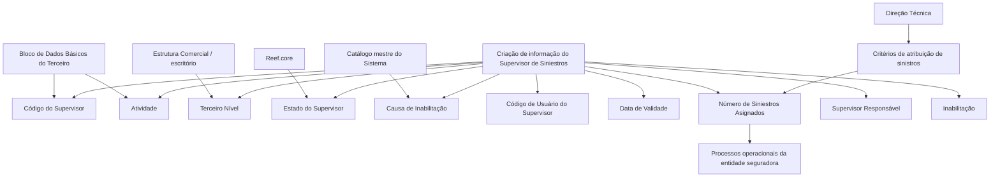

# Criação de Informação Específica do Supervisor de Sinistros — Documentação Reef

## 1. Metadados do Documento
- **Arquivo de Origem:** Não identificado no conteúdo extraído
- **Tipo de Documento:** Especificação Funcional
- **Domínio / Sistema:** Reef / Reef.core — Supervisor de Siniestros
- **Público-Alvo:** Negócio, Operação, Analistas Funcionais, Desenvolvedores e Arquitetos
- **Data/Versão Identificada:** Não identificada

---

## 2. Resumo Executivo & Contexto de Negócio

O documento descreve a estrutura de informação para **criar e manter dados operacionais de um Supervisor de Siniestros** no sistema Reef. O objetivo declarado é identificar e detalhar o âmbito operacional do Supervisor para que os processos da entidade seguradora possam utilizá-lo adequadamente.

A ação explicitamente habilitada na estrutura é **CREAR**. A captura dos campos segue uma sequência visual: da esquerda para a direita e de cima para baixo. Salvo indicação expressa em contrário, os atributos aplicam-se tanto a Pessoas Físicas quanto a Pessoas Jurídicas.

Parte dos atributos é herdada do bloco de Dados Básicos do Terceiro, como o Código do Supervisor e a Atividade. Outros atributos registram a vinculação do Supervisor à Estrutura Comercial, seu estado no sistema, a data a partir da qual está plenamente operacional, responsabilidades sobre outros supervisores e condições de inabilitação.

O documento também estabelece que o número de sinistros atribuídos ao Supervisor é atualizado em eventos operacionais de abertura, término, atribuição ou reatribuição de sinistros, conforme critérios de atribuição configurados pela Direção Técnica. Na criação inicial do Supervisor, esse campo não apresenta informação.

---

## 3. Arquitetura, Componentes & Tecnologias Envolvidas

Os componentes e conceitos explicitamente citados são:

- **Reef:** contexto documental e sistema de referência.
- **Reef.core:** componente onde estão configurados os valores possíveis para o Estado do Supervisor.
- **Bloco de Dados Básicos do Terceiro:** fonte de herança para o Código do Supervisor e a Atividade.
- **Estrutura Comercial:** estrutura organizacional que contém o Terceiro Nível, também referido como escritório.
- **Catálogo mestre do Sistema:** origem do código da causa de inabilitação.
- **Direção Técnica:** responsável por considerar/configurar os critérios de atribuição de sinistros.
- **Sistema da entidade seguradora:** consumidor dos dados operacionais registrados para o Supervisor de Siniestros.



---

## 4. Regras de Negócio, Especificações Funcionais & Processos

1. A estrutura existe para capturar informação operacional do Supervisor de Siniestros e permitir que processos da entidade seguradora utilizem essa informação adequadamente.
2. A ação habilitada identificada no documento é **CREAR**.
3. A sequência de captura dos campos deve seguir a ordem visual, da esquerda para a direita e de cima para baixo.
4. Quando não houver indicação expressa, os atributos devem ser utilizados tanto para Pessoas Físicas quanto para Pessoas Jurídicas.
5. O Código do Supervisor é proveniente do Bloco de Dados Básicos do Terceiro e identifica o código do Supervisor no Sistema.
6. O Código de Usuário do Supervisor contém o código pelo qual o Supervisor se identifica no Sistema.
7. A Atividade é herdada do Bloco de Dados Básicos do Terceiro e apresenta o código de Atividade do Terceiro para os Supervisores.
8. O Terceiro Nível registra o código do Terceiro Nível da Estrutura Comercial, ou escritório, ao qual o Supervisor está atribuído.
9. O Estado do Supervisor deve assumir um dos valores configurados em Reef.core.
10. A Data de Validade determina a data a partir da qual o Supervisor está plenamente operacional no Sistema. O uso correto permite manter histórico das alterações realizadas na configuração dos Supervisores.
11. O Número de Siniestros Asignados representa a quantidade de sinistros atribuídos ao Supervisor.
12. O Número de Siniestros Asignados deve ser atualizado sempre que um sinistro for aberto, terminado, atribuído ou reatribuído.
13. A atualização do Número de Siniestros Asignados deve observar os critérios de atribuição de sinistros configurados pela Direção Técnica no Sistema.
14. Na captura inicial do Supervisor, o Número de Siniestros Asignados não deve exibir informação.
15. O atributo Supervisor Responsável identifica se o Supervisor registrado terá o papel de responsável por outro Supervisor ou por um grupo de Supervisores.
16. A Inabilitação informa ao Sistema que o Supervisor de Siniestros está inabilitado. A partir do momento da inabilitação, o Supervisor não deveria ser utilizado, contemplado ou considerado nos processos operacionais da entidade.
17. Quando o Supervisor estiver inabilitado, a Causa de Inabilitação deve conter um código de causa definido no catálogo mestre do Sistema.

---

## 5. Tabelas de Parâmetros, Ambientes e Estruturas de Dados

| Item / Parâmetro | Descrição / Função | Tipo / Valores / Formato | Ambiente / Observações |
| :--- | :--- | :--- | :--- |
| Ação habilitada | Permite criar a informação do Supervisor. | `CREAR` | Nenhuma outra ação é explicitamente descrita. |
| Código do Supervisor | Identifica o código do Supervisor no Sistema. | Não detalhado | Herdado do Bloco de Dados Básicos do Terceiro. |
| Código de Usuário do Supervisor | Contém o código do usuário com o qual o Supervisor se identifica no Sistema. | Não detalhado | Campo do bloco de informação. |
| Atividade | Mostra o código de Atividade do Terceiro para os Supervisores. | Não detalhado | Herdado do Bloco de Dados Básicos do Terceiro. |
| Terceiro Nível | Código do Terceiro Nível da Estrutura Comercial ou escritório ao qual o Supervisor está atribuído. | Não detalhado | Associado à Estrutura Comercial. |
| Estado do Supervisor | Mostra o estado atual do Supervisor. | Um dos valores configurados | Valores configurados em `Reef.core`. |
| Data de Validade | Indica a data a partir da qual o Supervisor está plenamente operacional. | Data; formato não detalhado | Suporta histórico de alterações na configuração dos Supervisores. |
| Número de Siniestros Asignados | Quantidade de sinistros atribuídos ao Supervisor. | Número; formato não detalhado | Atualizado em abertura, término, atribuição e reatribuição de sinistros. Não apresenta informação na captura inicial. |
| Supervisor Responsável | Indica se o Supervisor registrado será responsável por outro Supervisor ou grupo de Supervisores. | Não detalhado | O documento não especifica valores permitidos. |
| Inabilitação | Indica que o Supervisor está inabilitado no Sistema. | Não detalhado | Após a inabilitação, não deveria ser usado nos processos operacionais. |
| Causa de Inabilitação | Código da causa de inabilitação. | Código; catálogo não detalhado | Deve ser preenchido quando o Supervisor estiver inabilitado; origem no catálogo mestre do Sistema. |
| Sequência de captura | Define a ordem de preenchimento dos campos. | Esquerda para direita; cima para baixo | Aplicável ao bloco de informação descrito. |
| Abrangência de atributos | Define a aplicabilidade padrão dos atributos. | Pessoas Físicas e Pessoas Jurídicas | Válido quando não houver indicação expressa em contrário. |

---

## 6. Bateria de Perguntas & Respostas para RAG (FAQ Sintético)

### P1: Qual é o objetivo da estrutura de criação de informação do Supervisor de Siniestros?
**R:** A estrutura tem o objetivo de identificar e detalhar a informação de âmbito operacional do Supervisor de Siniestros, permitindo que os processos da entidade seguradora que dependem dessa informação possam contemplá-la adequadamente.

### P2: Qual ação está habilitada para a estrutura de dados do Supervisor?
**R:** O documento identifica explicitamente a ação **CREAR** como ação habilitada para a estrutura de informação do Supervisor de Siniestros.

### P3: Qual é a sequência de captura dos campos do bloco Dados Supervisor?
**R:** Os campos devem ser capturados da esquerda para a direita e de cima para baixo, conforme a sequência visual indicada no bloco de informação.

### P4: O Código do Supervisor é informado manualmente ou herdado?
**R:** O Código do Supervisor é herdado do Bloco de Dados Básicos do Terceiro. Esse dado identifica o código do Supervisor no Sistema.

### P5: Onde são definidos os valores possíveis para o Estado do Supervisor?
**R:** O Estado do Supervisor deve ter um dos valores configurados em **Reef.core**. O documento não enumera quais são esses valores configurados.

### P6: Para que serve a Data de Validade do Supervisor?
**R:** A Data de Validade informa ao Sistema a data a partir da qual o Supervisor está plenamente operacional. Sua utilização correta permite manter um histórico das mudanças realizadas na configuração dos Supervisores da entidade seguradora.

### P7: Quando o Número de Siniestros Asignados deve ser atualizado?
**R:** O Número de Siniestros Asignados deve ser atualizado quando um sinistro é aberto, terminado, atribuído ou reatribuído. A atualização deve respeitar os critérios de atribuição de sinistros configurados pela Direção Técnica no Sistema.

### P8: O que aparece no Número de Siniestros Asignados durante a criação inicial do Supervisor?
**R:** Na captura inicial do Supervisor, o campo Número de Siniestros Asignados não mostra nenhuma informação.

### P9: Qual é a finalidade do campo Supervisor Responsável?
**R:** O campo Supervisor Responsável identifica se o Supervisor de Siniestros que está sendo registrado também terá o papel de responsável por outro Supervisor ou por um grupo de Supervisores.

### P10: Qual é o efeito operacional da Inabilitação de um Supervisor de Siniestros?
**R:** A Inabilitação informa que o Supervisor está inabilitado no Sistema. A partir desse momento, o Supervisor não deveria ser empregado, contemplado ou considerado nos processos operacionais da entidade seguradora.

### P11: Quando a Causa de Inabilitação deve ser informada e de onde vem seu valor?
**R:** A Causa de Inabilitação deve conter um código quando o Supervisor estiver inabilitado. Esse código corresponde a uma causa de inabilitação definida no catálogo mestre do Sistema.

### P12: Os atributos do bloco são aplicáveis a Pessoas Físicas e Pessoas Jurídicas?
**R:** Sim. Quando o documento não especifica ou indica expressamente uma exceção, os atributos devem ser empregados tanto para Pessoas Físicas quanto para Pessoas Jurídicas.

---

## 7. Glossário de Termos, Siglas & Conceitos-Chave

- **Reef:** Sistema/contexto documental citado como referência para a configuração e documentação do Supervisor.
- **Reef.core:** Componente no qual estão configurados os valores possíveis para o Estado do Supervisor.
- **Supervisor de Siniestros:** Supervisor associado ao tratamento operacional de sinistros na entidade seguradora.
- **Siniestro:** Termo utilizado no documento para representar um sinistro.
- **Terceiro:** Entidade cujos Dados Básicos fornecem, por herança, o Código do Supervisor e a Atividade.
- **Bloco de Dados Básicos do Terceiro:** Bloco de origem dos dados herdados Código do Supervisor e Atividade.
- **Estrutura Comercial:** Estrutura organizacional que contém o Terceiro Nível ou escritório de atribuição do Supervisor.
- **Terceiro Nível:** Código do nível da Estrutura Comercial ao qual o Supervisor está atribuído.
- **Direção Técnica:** Área mencionada como responsável por considerar/configurar critérios de atribuição de sinistros no Sistema.
- **Catálogo mestre do Sistema:** Fonte de definição dos códigos de causa de inabilitação.
- **Inabilitação:** Condição que impede que o Supervisor seja utilizado, contemplado ou considerado nos processos operacionais.

---

## 8. Notas Críticas, Riscos & Limitações

- **Nota de Análise:** O documento não detalha formatos, tipos técnicos, obrigatoriedade, tamanhos máximos, valores padrão ou regras de validação para os campos descritos.
- **Nota de Análise:** O documento afirma que os valores de Estado do Supervisor são configurados em Reef.core, mas não lista os estados permitidos.
- **Nota de Análise:** Os critérios de atribuição de sinistros são atribuídos à Direção Técnica, porém os critérios específicos não são apresentados.
- **Nota de Análise:** O documento não descreve métodos HTTP, contratos JSON, integrações, bancos de dados, permissões, trilhas de auditoria ou rotas de log.
- **Risco operacional:** Um Supervisor inabilitado não deveria ser considerado nos processos operacionais. A implementação ou operação inadequada dessa regra pode permitir o uso indevido de um Supervisor inabilitado.
- **Limitação da extração:** O conteúdo termina com o marcador `Nota:` sem texto subsequente; não há detalhamento adicional disponível para essa nota.

---

## 9. Conteúdo Bruto Estruturado (Referência Fiel)

```text
--- [PÁGINA 1 DE 2] ---

CREAR Información especíca del Supervisor
Objetivo
La captura de la información en esta Estructura obedece a la necesidad de identicar y detallar la información de ámbito operativo del
Supervisor de Siniestros para poder contemplarla adecuadamente en los procesos de la entidad Aseguradora que así lo demanden.
Acciones habilitadas
 CREAR ( )
Datos Supervisor
De Izquierda a Derecha y de Arriba hacia Abajo, los siguientes atributos marcan la secuencia de captura de los Campos en este Bloque de
Información.
Si no se especica o indica expresamente, los Atributos se emplearán tanto en Personas Físicas como en Personas Jurídicas.
Código del Supervisor
Este dato procede y se hereda del Bloque de Datos Básicos del Tercero e identica el código del Supervisor en el Sistema.
Código de Usuario del Supervisor ( )
Este campo del bloque de información contiene el código del usuario con el que el Supervisor se identica en el sistema.
Actividad
El valor de este dato se hereda del Bloque de Datos Básicos del Tercero y muestra el código de Actividad del Tercero para los Supervisores.
Tercer Nivel (  )
Este dato es el código del Tercer Nivel de la Estructura Comercial (ocina) al que está asignado el Supervisor.
Estado del Supervisor (  )
Documentation / DOCUMENTACIÓN Reef
DOCUMENTACIÓN Reef
Mapfredocument
DOCUMENTACIÓN Reef
Owner
user:agonzalez_mapfre.com
Lifecycle
Approved Source
 / 
 VL
Buscar Inicio Soluciones Arquitecturas APIs Componentes Cloud Documentación Zeus Reef Ayuda
ES


--- [PÁGINA 2 DE 2] ---

Este Campo muestra el estado en el que se encuentra el Supervisor, estado que tiene que tener uno de los posibles valores congurados en
Reef.core.
Fecha de Validez ( )
Esta propiedad le indica al Sistema la fecha a partir de la cual el supervisor está plenamente operativo en el sistema por lo que su empleo y
correcta utilización permite tener en la entidad Aseguradora un histórico de los cambios efectuados en la conguración de los Supervisores.
Número de Siniestros Asignados
Este dato contiene el número de siniestros asignados que tiene asignado un Supervisor, sabiendo que cada vez que se abre, se termina, se
asigna o se reasigna un siniestro, se actualiza y modica su contenido (Todo ello de acuerdo con los criterios de asignación de siniestros que
la Dirección Técnica haya considerado congurar en el sistema)
En la captura inicial del supervisor este dato no mostrará información alguna.
Supervisor Responsable ( )
Este campo identica si el Supervisor de siniestros que estamos registrando va a su vez a tener el rol de Responsable de otro supervisor o
grupo de supervisores.
Inhabilitación ( )
Este Campo le indica al Sistema que el Supervisor de Siniestros está inhabilitado en el Sistema por lo que a partir del momento de su
inhabilitación no debería ser empleado, contemplado o considerado en los procesos operativos de la entidad.
Causa de Inhabilitación (  )
En el supuesto que el Supervisor estuviera Inhabilitado, este Atributo contendrá el código de una causa de Inhabilitación denida en el
catálogo maestro del Sistema.
Nota:
```
