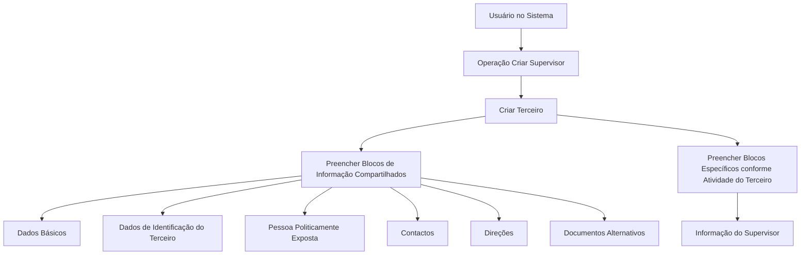

# Operação Criar Supervisor — Registro de Informações de Supervisores de Sinistros

## 1. Metadados do Documento
- **Arquivo de Origem:** `Não identificado no conteúdo fornecido`
- **Tipo de Documento:** `Manual Operacional`
- **Domínio / Sistema:** `REEF / Mapfre — gestão de Terceiros e Supervisores de Sinistros`
- **Público-Alvo:** `Usuários do sistema, operação e equipes funcionais`
- **Data/Versão Identificada:** `Não identificada`

---

## 2. Resumo Executivo & Contexto de Negócio

O documento descreve a operação **Criar Supervisor**, destinada a capturar as informações de Supervisores de Sinistros. O registro do Supervisor é realizado por meio da criação de um Terceiro e do preenchimento de blocos de informação compartilhados e específicos.

A obrigatoriedade e a habilitação dos campos podem variar conforme o código de atividade do Terceiro. O comportamento dos campos também pode variar segundo o tipo de Terceiro, distinguindo Pessoa Física e Pessoa Jurídica.

O documento informa que modificações implementadas localmente podem impactar a obrigatoriedade do registro dos Dados do Terceiro. Portanto, a configuração local da aplicação é uma dependência relevante para a execução operacional da criação de Supervisores.

A ordem de captura dos dados nos blocos de informação não é fixa: ela pode variar conforme o critério seguido pelo usuário no sistema. O fluxo apresentado vincula a criação do Terceiro ao preenchimento da Informação do Supervisor.

---

## 3. Arquitetura, Componentes & Tecnologias Envolvidas

Os componentes e conceitos citados são:

| Componente / Termo | Papel descrito no documento |
| :--- | :--- |
| Operação Criar Supervisor | Processo para capturar informações de Supervisores de Sinistros. |
| Criar Terceiro | Etapa associada à criação do registro que suporta a informação do Supervisor. |
| Blocos de Informação Compartidos | Conjunto de estruturas informacionais relacionadas ao Terceiro. |
| Informação do Supervisor | Bloco específico associado à atividade do Terceiro. |
| REEF | Nome citado nos elementos de documentação e navegação. |
| Mapfre | Nome presente no contexto documental e no usuário proprietário exibido. |
| Mapfredocument | Termo exibido na área de documentação. |
| Zeus | Termo exibido no menu de navegação da documentação. |



> **Nota de Análise:** O documento não descreve integrações técnicas, APIs, métodos HTTP, contratos JSON, banco de dados, servidores, ambientes de execução ou tecnologias de implementação da operação Criar Supervisor.

---

## 4. Regras de Negócio, Especificações Funcionais & Processos

### Objetivo da operação

A operação **Criar Supervisor** permite capturar a informação dos **Supervisores de Sinistros**.

### Premissas de preenchimento

1. A obrigatoriedade e/ou habilitação dos campos de cada bloco ou estrutura de informação compartilhada pode variar de acordo com o **código de atividade do Terceiro**.
2. A obrigatoriedade e/ou habilitação dos campos também pode variar conforme o tipo de Terceiro:
   - Pessoa Física;
   - Pessoa Jurídica.
3. Modificações implementadas localmente podem afetar o comportamento da aplicação em relação à obrigatoriedade de registro dos Dados do Terceiro.
4. A ordem de captura de dados nos diferentes blocos de informação pode variar conforme o critério seguido pelo usuário no sistema.

### Processo identificado

1. Executar a operação **Criar Supervisor**.
2. Criar o registro de **Terceiro**.
3. Registrar informações nos blocos de informação compartilhados aplicáveis.
4. Registrar informações nos blocos específicos conforme a atividade do Terceiro.
5. Preencher a **Informação do Supervisor**.

### Blocos de Informação Compartilhados

- Dados Básicos;
- Dados de Identificação do Terceiro;
- Pessoa Politicamente Exposta;
- Contactos;
- Direções;
- Documentos Alternativos;
- Representantes Legales;
- Accionistas.

### Bloco de Informação Específico

- Informação do Supervisor.

> **Nota de Análise:** O documento lista os blocos de informação, mas não detalha os campos internos, regras de validação por campo, valores aceitos, mensagens de erro ou critérios para determinar o código de atividade do Terceiro.

---

## 5. Tabelas de Parâmetros, Ambientes e Estruturas de Dados

| Item / Parâmetro | Descrição / Função | Tipo / Valores / Formato | Ambiente / Observações |
| :--- | :--- | :--- | :--- |
| Operação Criar Supervisor | Permite capturar informações de Supervisores de Sinistros. | Operação funcional | Não detalhado. |
| Terceiro | Registro criado no processo de criação de Supervisor. | Entidade / registro | Pode ser Pessoa Física ou Pessoa Jurídica. |
| Código de atividade do Terceiro | Pode determinar a obrigatoriedade e/ou habilitação dos campos. | Código de atividade | Valores não detalhados. |
| Tipo de Terceiro | Pode alterar obrigatoriedade e habilitação de campos. | Pessoa Física ou Pessoa Jurídica | Critérios de classificação não detalhados. |
| Dados Básicos | Bloco de informação compartilhado. | Estrutura de informação | Campos não detalhados. |
| Dados de Identificação do Terceiro | Bloco de informação compartilhado. | Estrutura de informação | Campos não detalhados. |
| Pessoa Politicamente Exposta | Bloco de informação compartilhado. | Estrutura de informação | Campos não detalhados. |
| Contactos | Bloco de informação compartilhado. | Estrutura de informação | Campos não detalhados. |
| Direções | Bloco de informação compartilhado. | Estrutura de informação | Campos não detalhados. |
| Documentos Alternativos | Bloco de informação compartilhado. | Estrutura de informação | Campos não detalhados. |
| Representantes Legales | Bloco de informação compartilhado. | Estrutura de informação | Campos não detalhados. |
| Accionistas | Bloco de informação compartilhado. | Estrutura de informação | Campos não detalhados. |
| Informação do Supervisor | Bloco específico conforme a atividade do Terceiro. | Estrutura de informação específica | Campos não detalhados. |
| Modificações locais | Podem afetar a obrigatoriedade de registro dos Dados do Terceiro. | Configuração / implementação local | Não detalhada. |
| Owner | Proprietário exibido na página documental. | Identificador de usuário | `user:agonzalez_mapfre.com` |
| Lifecycle | Estado exibido na página documental. | Estado | `Approved Source` |

---

## 6. Bateria de Perguntas & Respostas para RAG (FAQ Sintético)

### P1: Qual é o objetivo da operação Criar Supervisor?
**R:** A operação Criar Supervisor permite capturar as informações dos Supervisores de Sinistros. O processo inclui a criação de um Terceiro e o preenchimento de blocos de informação compartilhados e específicos.

### P2: O cadastro de Supervisor exige a criação de um Terceiro?
**R:** Sim. O fluxo apresentado no documento inclui a etapa Criar Terceiro antes do preenchimento da Informação do Supervisor.

### P3: Quais fatores podem alterar a obrigatoriedade dos campos no cadastro de Supervisor?
**R:** A obrigatoriedade e/ou habilitação dos campos pode variar conforme o código de atividade do Terceiro, o tipo de Terceiro — Pessoa Física ou Pessoa Jurídica — e modificações implementadas localmente.

### P4: A ordem de preenchimento dos blocos de informação é obrigatória?
**R:** Não. O documento afirma que a ordem de captura dos dados nos diferentes blocos de informação pode variar de acordo com o critério seguido pelo usuário no sistema.

### P5: Quais blocos compartilhados são mencionados na operação Criar Supervisor?
**R:** O documento cita Dados Básicos, Dados de Identificação do Terceiro, Pessoa Politicamente Exposta, Contactos, Direções, Documentos Alternativos, Representantes Legales e Accionistas.

### P6: Qual bloco específico deve ser preenchido para o Supervisor?
**R:** O bloco específico mencionado é Informação do Supervisor, incluído entre os blocos de informação específicos de acordo com a atividade do Terceiro.

### P7: O documento detalha os campos da Informação do Supervisor?
**R:** Não. O documento apenas identifica Informação do Supervisor como um bloco específico; não apresenta seus campos, formatos, obrigatoriedade individual ou regras de validação.

### P8: O que pode ocorrer quando existem modificações locais na aplicação?
**R:** Modificações implementadas localmente podem afetar o comportamento da aplicação quanto à obrigatoriedade no registro dos Dados do Terceiro.

### P9: Quais tipos de Terceiro são citados no documento?
**R:** O documento cita Pessoa Física e Pessoa Jurídica como tipos de Terceiro que podem influenciar a obrigatoriedade e/ou habilitação dos campos.

### P10: O documento fornece URLs, APIs ou integrações para Criar Supervisor?
**R:** Não. O conteúdo fornecido não especifica URLs, endpoints, APIs, protocolos de integração, métodos HTTP ou contratos de dados.

---

## 7. Glossário de Termos, Siglas & Conceitos-Chave

- **Accionistas:** Bloco de informação compartilhado listado no processo.
- **Blocos de Informação Compartilhados:** Estruturas de informação relacionadas à criação do Terceiro e compartilhadas no processo apresentado.
- **Código de atividade do Terceiro:** Critério que pode alterar a obrigatoriedade e/ou habilitação de campos.
- **Criar Terceiro:** Etapa de criação do registro de Terceiro no fluxo de Criar Supervisor.
- **Informação do Supervisor:** Bloco de informação específico associado à atividade do Terceiro.
- **Mapfre:** Nome citado no contexto de documentação e no identificador de proprietário exibido.
- **Pessoa Física:** Tipo de Terceiro que pode influenciar o comportamento dos campos.
- **Pessoa Jurídica:** Tipo de Terceiro que pode influenciar o comportamento dos campos.
- **Pessoa Politicamente Exposta:** Bloco de informação compartilhado listado no documento.
- **REEF:** Nome citado nos elementos de documentação exibidos.
- **Supervisor de Sinistros:** Entidade cujas informações são capturadas pela operação Criar Supervisor.
- **Terceiro:** Registro utilizado no processo de criação do Supervisor.
- **Zeus:** Termo exibido no menu de navegação da documentação.

---

## 8. Notas Críticas, Riscos & Limitações

- O documento não identifica o arquivo de origem, versão, data de publicação ou autores formais.
- Não há detalhamento dos campos existentes em cada bloco de informação.
- Não há matriz explícita que relacione códigos de atividade do Terceiro aos campos obrigatórios ou habilitados.
- Não há critérios funcionais detalhados para distinguir Pessoa Física de Pessoa Jurídica no processo.
- Modificações locais podem alterar o comportamento da aplicação, introduzindo risco de divergência entre ambientes ou instalações.
- O documento não especifica mensagens de erro, exceções, permissões, perfis de acesso, trilha de auditoria ou regras de aprovação.
- Não são descritos métodos HTTP, APIs, contratos JSON, integrações, URLs, servidores ou ambientes técnicos.
- O status `Approved Source` aparece na interface documental, mas o documento não explica o significado operacional desse estado.

---

## 9. Conteúdo Bruto Estruturado (Referência Fiel)

```text
--- [PÁGINA 1 DE 2] ---

OPERACIÓN CREAR Supervisor
¿En que consiste?
Esta operación permite capturar la Información de los Supervisores de Siniestros.
Premisas
La obligatoriedad y/o la habilitación de los campos en el registro de los datos de cada uno de los bloques o estructuras de información
compartidas puede variar de acuerdo con el código de actividad del Tercero:
La obligatoriedad y/o la habilitación de los campos en el registro de los datos de cada uno de los bloques o estructuras de información
pueden variar si el tipo de Tercero es una Persona Física o una Persona Jurídica:
Las modicaciones que se hubieran podido implementar localmente a su vez pueden afectar el comportamiento de la aplicación en
relación con la obligatoriedad en el registro de los Datos del Tercero.
Por último, el orden de captura de los datos en los distintos bloques de Información puede variar de acuerdo con el criterio seguido por el
Usuario en el Sistema.
Proceso
CREAR
TERCERO
Crear Información
del Supervisor
Bloques de Información Compartidos (CREAR TERCERO)
 Datos Básicos ( )
 Datos Identicación del Tercero ( )
 Persona Políticamente Expuesta ( )
 Contactos ( )
 Direcciones ( )
 Documentos Alternativos ( )
Ejemplo:
Ejemplo:
Documentation / DOCUMENTACIÓN Reef
DOCUMENTACIÓN Reef
Mapfredocument
DOCUMENTACIÓN Reef
Owner
user:agonzalez_mapfre.com
Lifecycle
Approved Source
 / 
 VL
Buscar Inicio Soluciones Arquitecturas APIs Componentes Cloud Documentación Zeus Reef Ayuda
ES


--- [PÁGINA 2 DE 2] ---

Representantes Legales ( )
 Accionistas ( )
Bloques de Información Especícos de acuerdo con la Actividad del Tercero.
 Información del Supervisor ( )
```
