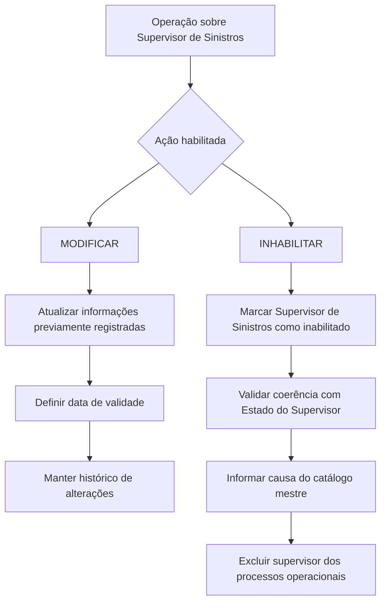

# Modificação e Inabilitação de Supervisor de Sinistros no Reef.core

## 1. Metadados do Documento
- **Arquivo de Origem:** Não identificado no conteúdo fornecido
- **Tipo de Documento:** Especificação Funcional
- **Domínio / Sistema:** Reef.core — gestão de Supervisores de Sinistros
- **Público-Alvo:** Desenvolvedores, Arquitetos, Operação e Negócio
- **Data/Versão Identificada:** Não identificada

---

## 2. Resumo Executivo & Contexto de Negócio

O documento descreve uma operação destinada a modificar informações previamente registradas de um Supervisor de Sinistros e, adicionalmente, possibilitar a inabilitação desse supervisor no sistema. As ações explicitamente habilitadas são **MODIFICAR** e **INHABILITAR**.

A operação abrange dados de identificação do Supervisor de Sinistros, sua vinculação ao Terceiro Nível da Estrutura Comercial, seu estado, a data a partir da qual alterações passam a vigorar, a quantidade de sinistros atribuídos e a indicação de responsabilidade sobre outros supervisores ou grupos de supervisores.

A data de validade permite que o sistema mantenha um histórico das alterações realizadas na configuração dos supervisores. O documento estabelece que os dados, quando não houver indicação expressa em contrário, são aplicáveis tanto a Pessoas Físicas quanto a Pessoas Jurídicas.

A inabilitação possui impacto operacional direto: após a inabilitação, o Supervisor de Sinistros não deve ser utilizado, contemplado ou considerado nos processos operacionais da entidade. O valor de inabilitação deve estar em conformidade com o estado atribuído ao supervisor, e a causa de inabilitação deve referenciar uma causa previamente definida no catálogo mestre do sistema.

---

## 3. Arquitetura, Componentes & Tecnologias Envolvidas

O conteúdo fornecido não descreve arquitetura técnica, APIs, protocolos, bancos de dados, contratos JSON, métodos HTTP, servidores, portas ou integrações entre microsserviços.

Os elementos explicitamente citados são:

- **Reef.core:** sistema no qual o estado do Supervisor de Sinistros deve possuir um dos valores configurados.
- **Estrutura Comercial:** estrutura organizacional que contém o Terceiro Nível, também denominado oficina, ao qual o supervisor é atribuído.
- **Catálogo mestre do Sistema:** origem das causas de inabilitação disponíveis para seleção.
- **Sistema de gestão de sinistros:** contexto no qual a abertura, término, atribuição ou reatribuição de sinistros atualiza o número de sinistros atribuídos ao supervisor.



> **Nota de Análise:** O documento cita o Reef.core e catálogos configurados, mas não detalha a arquitetura de software, interfaces de integração, persistência de dados ou mecanismos técnicos de validação.

---

## 4. Regras de Negócio, Especificações Funcionais & Processos

### Ações habilitadas

A operação disponibiliza duas ações:

1. **MODIFICAR:** permite alterar as informações previamente registradas para um Supervisor de Sinistros.
2. **INHABILITAR:** permite indicar que o Supervisor de Sinistros está inabilitado no sistema.

### Sequência de captura dos campos

O documento determina que os atributos do bloco de informações devem ser capturados na sequência apresentada, de esquerda para direita e de cima para baixo.

Quando não houver especificação ou indicação expressa em sentido diferente, os atributos aplicam-se tanto a:

- Pessoas Físicas.
- Pessoas Jurídicas.

### Identificação e associação organizacional

- O **Código de Usuário do Supervisor** contém o código pelo qual o Supervisor de Sinistros se identifica no sistema.
- O **Terceiro Nível** representa o código do Terceiro Nível da Estrutura Comercial, também referido como oficina, ao qual o supervisor será atribuído.

### Estado e vigência das alterações

- O **Estado do Supervisor** deve possuir um dos valores configurados no Reef.core.
- A **Data de Validade** determina a data a partir da qual as alterações realizadas nas informações do supervisor tornam-se plenamente operacionais no sistema.
- O uso correto da Data de Validade permite manter um histórico das modificações efetuadas na configuração dos Supervisores de Sinistros.

### Atualização da quantidade de sinistros atribuídos

O campo **Número de Sinistros Atribuídos** apresenta a quantidade de sinistros atribuídos ao supervisor. O conteúdo desse campo deve ser atualizado e modificado quando ocorrer qualquer uma das seguintes situações:

- Abertura de um sinistro.
- Término de um sinistro.
- Atribuição de um sinistro.
- Reatribuição de um sinistro.

A atualização deve considerar os critérios de atribuição de sinistros definidos no sistema.

### Responsabilidade hierárquica

O campo **Supervisor Responsável** identifica se o Supervisor de Sinistros cuja informação está sendo modificada terá, adicionalmente, o papel de responsável por outro supervisor ou por um grupo de supervisores.

### Inabilitação do Supervisor de Sinistros

- O campo **Inabilitação** informa ao sistema que o Supervisor de Sinistros está inabilitado.
- A partir do momento da inabilitação, o Supervisor de Sinistros não deve ser empregado, contemplado ou considerado nos processos operacionais da entidade.
- O valor do campo Inabilitação deve estar em consonância com o valor do campo que determina o Estado do Supervisor.
- Quando o supervisor estiver inabilitado, o campo **Causa de Inabilitação** deve conter o código de uma causa de inabilitação definida no catálogo mestre do sistema.

---

## 5. Tabelas de Parâmetros, Ambientes e Estruturas de Dados

| Item / Parâmetro | Descrição / Função | Tipo / Valores / Formato | Ambiente / Observações |
| :--- | :--- | :--- | :--- |
| Ação | Define a operação a executar sobre o Supervisor de Sinistros. | MODIFICAR ou INHABILITAR. | Ambas as ações são explicitamente habilitadas no documento. |
| Código de Usuário do Supervisor | Código pelo qual o Supervisor de Sinistros se identifica no sistema. | Código de usuário. | Não há formato técnico detalhado. |
| Terceiro Nível | Código do Terceiro Nível da Estrutura Comercial ao qual o supervisor é atribuído. | Código de estrutura comercial / oficina. | O documento trata Terceiro Nível como “oficina”. |
| Estado do Supervisor | Exibe o estado no qual se encontra o Supervisor de Sinistros. | Um dos valores configurados no Reef.core. | Os valores possíveis não são listados no conteúdo fornecido. |
| Data de Validade | Indica a data a partir da qual as alterações do supervisor tornam-se plenamente operacionais. | Data. | Permite manter histórico das alterações de configuração. |
| Número de Sinistros Atribuídos | Mostra a quantidade de sinistros atribuídos ao Supervisor de Sinistros. | Número. | Atualizado em abertura, término, atribuição ou reatribuição de sinistros. |
| Supervisor Responsável | Indica se o supervisor terá o papel de responsável por outro supervisor ou grupo de supervisores. | Indicador não detalhado. | O formato e os valores admitidos não são informados. |
| Inabilitação | Indica que o Supervisor de Sinistros está inabilitado no sistema. | Indicador não detalhado. | Deve estar coerente com o Estado do Supervisor. |
| Causa de Inabilitação | Código da causa de inabilitação aplicável ao Supervisor de Sinistros inabilitado. | Código de causa. | A causa deve existir no catálogo mestre do sistema. |
| Reef.core | Sistema citado como fonte de configuração dos estados possíveis do supervisor. | Sistema / plataforma. | Não há detalhes de versão, acesso ou integração. |
| Estrutura Comercial | Estrutura organizacional que contém o Terceiro Nível de atribuição do supervisor. | Estrutura organizacional. | O Terceiro Nível é referido como oficina. |
| Catálogo mestre do Sistema | Catálogo que define as causas de inabilitação disponíveis. | Catálogo de referência. | Não há lista de causas no documento. |

---

## 6. Bateria de Perguntas & Respostas para RAG (FAQ Sintético)

### P1: Quais ações podem ser executadas na operação de Supervisor de Sinistros?
**R:** A operação habilita as ações **MODIFICAR** e **INHABILITAR**. A ação MODIFICAR permite alterar informações já registradas para o Supervisor de Sinistros. A ação INHABILITAR permite indicar que o supervisor está inabilitado no sistema.

### P2: Qual é a finalidade da Data de Validade na modificação de um Supervisor de Sinistros?
**R:** A Data de Validade informa a data a partir da qual as alterações realizadas nas informações do Supervisor de Sinistros tornam-se plenamente operacionais no sistema. A utilização correta desse campo permite manter um histórico das modificações efetuadas na configuração dos supervisores.

### P3: Como o Código de Usuário do Supervisor é utilizado?
**R:** O Código de Usuário do Supervisor contém o código pelo qual o Supervisor de Sinistros se identifica no sistema. O documento não especifica formato, tamanho ou regras adicionais para esse código.

### P4: O que representa o campo Terceiro Nível?
**R:** O Terceiro Nível é o código do Terceiro Nível da Estrutura Comercial, também chamado de oficina, ao qual o Supervisor de Sinistros será atribuído.

### P5: De onde vêm os valores possíveis para o Estado do Supervisor?
**R:** O Estado do Supervisor deve possuir um dos possíveis valores configurados no Reef.core. O documento não apresenta a lista desses estados nem detalha como essa configuração é administrada.

### P6: Em quais eventos o Número de Sinistros Atribuídos deve ser atualizado?
**R:** O Número de Sinistros Atribuídos deve ser atualizado sempre que um sinistro for aberto, terminado, atribuído ou reatribuído. A atualização deve respeitar os critérios de atribuição de sinistros considerados pelo sistema.

### P7: Qual é o papel do campo Supervisor Responsável?
**R:** O campo Supervisor Responsável identifica se o Supervisor de Sinistros cuja informação está sendo modificada terá também o papel de responsável por outro supervisor ou por um grupo de supervisores.

### P8: Qual é o efeito operacional da inabilitação de um Supervisor de Sinistros?
**R:** Após a inabilitação, o Supervisor de Sinistros não deve ser empregado, contemplado ou considerado nos processos operacionais da entidade. O documento não especifica quais processos, telas, integrações ou mecanismos técnicos aplicam essa restrição.

### P9: Existe uma relação entre o campo Inabilitação e o Estado do Supervisor?
**R:** Sim. O valor informado para Inabilitação deve estar em consonância com o valor atribuído ao campo Estado do Supervisor. O documento exige coerência entre esses dois campos, mas não define a matriz de combinações válidas.

### P10: Quando a Causa de Inabilitação deve ser preenchida?
**R:** Quando o Supervisor de Sinistros estiver inabilitado, a Causa de Inabilitação deve conter o código de uma das causas de inabilitação definidas no catálogo mestre do sistema.

### P11: As regras do bloco de dados aplicam-se a Pessoas Físicas e Pessoas Jurídicas?
**R:** Sim. Quando não houver especificação ou indicação expressa em contrário, os atributos do bloco de informações devem ser utilizados tanto para Pessoas Físicas quanto para Pessoas Jurídicas.

### P12: O documento especifica APIs ou contratos técnicos para modificar supervisores?
**R:** Não. O conteúdo descreve regras funcionais e campos da operação, mas não detalha métodos HTTP, endpoints, contratos JSON, autenticação, integrações, tecnologias de persistência ou APIs.

---

## 7. Glossário de Termos, Siglas & Conceitos-Chave

- **Reef.core:** Sistema citado como local de configuração dos valores possíveis para o Estado do Supervisor.
- **Supervisor de Sinistros:** Entidade funcional cuja informação pode ser modificada ou inabilitada no sistema.
- **Sinistro:** Item operacional cuja abertura, término, atribuição ou reatribuição influencia o Número de Sinistros Atribuídos a um supervisor.
- **Terceiro Nível:** Código do terceiro nível da Estrutura Comercial ao qual o supervisor é designado; também denominado oficina no documento.
- **Estrutura Comercial:** Estrutura organizacional utilizada para atribuir o Supervisor de Sinistros a um Terceiro Nível.
- **Data de Validade:** Data a partir da qual alterações nas informações do supervisor tornam-se plenamente operacionais.
- **Inabilitação:** Condição que determina que o Supervisor de Sinistros não deve ser empregado, contemplado ou considerado nos processos operacionais.
- **Causa de Inabilitação:** Código de uma causa definida no catálogo mestre do sistema, aplicável quando o supervisor estiver inabilitado.
- **Catálogo mestre do Sistema:** Fonte de referência que contém as causas de inabilitação permitidas.
- **Supervisor Responsável:** Supervisor de Sinistros que também possui responsabilidade sobre outro supervisor ou grupo de supervisores.

---

## 8. Notas Críticas, Riscos & Limitações

- O documento não identifica o nome do arquivo de origem, data, versão, autores técnicos ou aprovação funcional além de referências de interface de documentação.
- Não há detalhamento de APIs, métodos HTTP, endpoints, contratos de entrada e saída, autenticação ou mecanismos de persistência.
- Os valores possíveis para Estado do Supervisor configurados no Reef.core não são apresentados.
- O documento não define a matriz de coerência entre Estado do Supervisor e Inabilitação.
- Não são informados os valores possíveis, o tipo técnico ou a obrigatoriedade do campo Supervisor Responsável.
- As causas de inabilitação são mencionadas, mas a lista de códigos e descrições do catálogo mestre não está incluída.
- Não são detalhados os critérios de atribuição de sinistros usados para atualizar o Número de Sinistros Atribuídos.
- O texto fornecido termina em “Consejo:” sem conteúdo adicional. Não é possível inferir a recomendação originalmente associada.
- Há caracteres de extração corrompidos no conteúdo bruto, como `Modicar`, `congurados` e `denidas`; a interpretação semântica foi preservada sem inventar conteúdo ausente.

---

## 9. Conteúdo Bruto Estruturado (Referência Fiel)

```text
--- [PÁGINA 1 DE 2] ---

MODIFICAR Información especíca del Supervisor de Siniestros
Objetivo
Esta Operación permite Modicar la información del Supervisor de Siniestros registrada previamente además de poder Inhabilitarlo.
Acciones habilitadas
 MODIFICAR ( )
 INHABILITAR ( )
Datos Supervisor
De Izquierda a Derecha y de Arriba hacia Abajo, los siguientes atributos marcan la secuencia de captura de los Campos en este Bloque de
Información.
Si no se especica o indica expresamente, los Atributos se emplearán tanto en Personas Físicas como en Personas Jurídicas.
Código de Usuario del Supervisor (  )
Este campo del bloque de información contiene el código del usuario con el que el Supervisor se identica en el sistema.
Tercer Nivel (  )
Este dato es el código del Tercer Nivel de la Estructura Comercial (ocina) al que estará asignado el Supervisor.
Estado del Supervisor (  )
Este Campo muestra el estado en el que se encuentra el Supervisor, estado que tiene que tener uno de los posibles valores congurados en
Reef.core.
Fecha de Validez ( )
Esta propiedad le indica al Sistema la fecha a partir de la cual los cambios en la información del supervisor está plenamente operativa en el
sistema por lo que su empleo y correcta utilización permite tener un histórico de los cambios efectuados en la conguración de los
Documentation / DOCUMENTACIÓN Reef
DOCUMENTACIÓN Reef
Mapfredocument
DOCUMENTACIÓN Reef
Owner
user:agonzalez_mapfre.com
Lifecycle
Approved Source
 / 
 VL
Buscar Inicio Soluciones Arquitecturas APIs Componentes Cloud Documentación Zeus Reef Ayuda
ES


--- [PÁGINA 2 DE 2] ---

Supervisores.
Número de Siniestros Asignados
Este dato muestra el número de siniestros asignados que tiene asignado un Supervisor, sabiendo que cada vez que se abre, se termina, se
asigna o se reasigna un siniestro, se actualiza y modica su contenido (de acuerdo con los criterios de asignación de siniestros que se hayan
considerado en el sistema)
Supervisor Responsable ( )
Este campo identica si el Supervisor de siniestros del que estamos modicando su información va a su vez a tener el rol de Responsable de
otro supervisor o grupo de supervisores.
Inhabilitación ( )
Este Campo le indica al Sistema que el Supervisor de Siniestros está inhabilitado en el Sistema por lo que a partir del momento de su
inhabilitación no debería ser empleado, contemplado o considerado en los procesos operativos de la entidad.
El valor de este dato debe estar en consonancia con el valor asignado en el campo que determina el Estado del Supervisor.
Causa de Inhabilitación (   )
En el supuesto que el Supervisor esté Inhabilitado, este Atributo contendrá el código de una de las causas de Inhabilitación denidas en el
catálogo maestro del Sistema.
Consejo:
```
