# Operação Modificar Supervisor de Sinistros — Documentação Reef / Mapfre

## 1. Metadados do Documento
- **Arquivo de Origem:** Não informado; conteúdo extraído de documentação Reef / Mapfre.
- **Tipo de Documento:** Procedimento funcional.
- **Domínio / Sistema:** Reef / Mapfre — operação **MODIFICAR TERCERO**.
- **Público-Alvo:** Usuários do sistema, analistas funcionais e equipes de suporte.
- **Data/Versão Identificada:** Não identificada.
- **Owner identificado no conteúdo:** `user:agonzalez_mapfre.com`
- **Lifecycle identificado no conteúdo:** `Approved Source`

---

## 2. Resumo Executivo & Contexto de Negócio

O documento descreve a operação **Modificar Supervisor de Siniestros**, inserida no contexto da funcionalidade **MODIFICAR TERCERO**. A operação permite complementar, modificar e/ou inabilitar informações relacionadas ao Supervisor de Sinistros nas estruturas de dados que contêm essa informação.

A documentação estabelece que o comportamento de obrigatoriedade e habilitação dos campos não é necessariamente uniforme. A obrigatoriedade e a disponibilidade de cada campo podem variar conforme o código de atividade do terceiro e conforme o terceiro seja classificado como **Pessoa Física** ou **Pessoa Jurídica**.

O documento também alerta que modificações implementadas localmente podem alterar o comportamento da aplicação, especialmente no que se refere à obrigatoriedade do registro dos Dados do Terceiro. Portanto, a operação deve considerar configurações ou customizações locais existentes.

O processo de captura e alteração das informações pode ocorrer em ordens distintas nos blocos de informação. Essa ordem varia conforme o critério seguido pelo usuário no sistema, não sendo definida uma sequência única e obrigatória no conteúdo fornecido.

---

## 3. Arquitetura, Componentes & Tecnologias Envolvidas

O conteúdo não descreve uma arquitetura técnica de software, tecnologias, protocolos, APIs, métodos HTTP, bancos de dados, ambientes ou contratos de integração. A estrutura identificada é funcional e organiza a operação em blocos de informação compartilhados e específicos.

Componentes funcionais explicitamente citados:

- Operação **MODIFICAR TERCERO**.
- Ação **Modificar Información del Supervisor de Siniestros**.
- Blocos de Informação Compartilhados.
- Blocos de Informação Específicos de acordo com a Atividade do Terceiro.
- Dados do Terceiro.
- Supervisor de Sinistros.
- Documentação Reef / Mapfre.

```mermaid
graph TD
  A[Usuário no Sistema] --> B[MODIFICAR TERCERO]
  B --> C[Modificar Informação do Supervisor de Sinistros]
  
  C --> D[Blocos de Informação Compartilhados]
  C --> E[Blocos de Informação Específicos conforme Atividade do Terceiro]
  
  D --> D1[Dados Básicos]
  D --> D2[Dados de Identificação do Terceiro]
  D --> D3[Pessoa Politicamente Exposta]
  D --> D4[Contatos]
  D --> D5[Direções]
  D --> D6[Documentos Alternativos]
  D --> D7[Representantes Legais]
  D --> D8[Acionistas]
  
  E --> E1[Modificar Informação do Supervisor de Sinistros]
  
  F[Código de Atividade do Terceiro] --> G[Obrigatoriedade e habilitação de campos]
  H[Tipo de Terceiro: Pessoa Física ou Jurídica] --> G
  I[Modificações locais] --> G
  G --> C
```



> **Nota de Análise:** O documento apresenta um fluxo funcional, mas não detalha telas, campos específicos, regras de persistência, métodos HTTP, contratos JSON, APIs, serviços, bases de dados ou mecanismos de auditoria.

---

## 4. Regras de Negócio, Especificações Funcionais & Processos

### Objetivo da operação

A operação **Modificar Supervisor de Siniestros** consiste em:

1. Complementar informações do Supervisor de Sinistros.
2. Modificar informações do Supervisor de Sinistros.
3. Inabilitar informações do Supervisor de Sinistros.
4. Executar essas ações em qualquer bloco ou estrutura de dados que contenha e estruture a informação do Supervisor de Sinistros.

### Premissas funcionais

1. A obrigatoriedade e/ou habilitação dos campos no registro de dados dos blocos ou estruturas de informação compartilhadas pode variar de acordo com o **código de atividade do Terceiro**.
2. A obrigatoriedade e/ou habilitação dos campos no registro de dados dos blocos ou estruturas de informação pode variar caso o tipo de Terceiro seja:
   - Pessoa Física.
   - Pessoa Jurídica.
3. Modificações implementadas localmente podem afetar o comportamento da aplicação em relação à obrigatoriedade do registro dos Dados do Terceiro.
4. A ordem de captura de dados nos diferentes blocos de informação pode variar de acordo com o critério seguido pelo usuário no sistema.
5. O documento não define quais campos são obrigatórios, opcionais ou inabilitáveis para cada código de atividade ou tipo de Terceiro.
6. O documento não detalha as modificações locais que podem influenciar o comportamento da aplicação.

### Processo funcional identificado

1. O usuário acessa a operação **MODIFICAR TERCERO**.
2. O usuário seleciona ou atua sobre a ação **Modificar Información del Supervisor de Siniestros**.
3. A informação pode estar distribuída em blocos compartilhados de informação.
4. A informação também pode estar presente em blocos específicos conforme a atividade do Terceiro.
5. Durante o registro ou alteração, a aplicação pode variar a obrigatoriedade e a habilitação dos campos conforme:
   - Código de atividade do Terceiro.
   - Classificação do Terceiro como Pessoa Física ou Pessoa Jurídica.
   - Modificações locais aplicadas à solução.
6. A sequência de preenchimento dos blocos pode variar conforme a escolha do usuário no sistema.

---

## 5. Tabelas de Parâmetros, Ambientes e Estruturas de Dados

| Item / Parâmetro | Descrição / Função | Tipo / Valores / Formato | Ambiente / Observações |
| :--- | :--- | :--- | :--- |
| Operação | Operação funcional principal mencionada no documento. | `MODIFICAR TERCERO` | Permite acessar a alteração de informações do Supervisor de Sinistros. |
| Ação funcional | Ação para complementar, modificar e/ou inabilitar dados. | `Modificar Información del Supervisor de Siniestros` | Pode ocorrer em blocos ou estruturas que contenham a informação. |
| Supervisor de Sinistros | Entidade ou informação tratada pela operação. | Não detalhado | Não há definição de atributos, identificadores ou regras específicas do Supervisor de Sinistros. |
| Código de atividade do Terceiro | Critério que pode influenciar obrigatoriedade e habilitação de campos. | Código não especificado | O documento não informa lista de códigos nem mapeamento de regras. |
| Tipo de Terceiro | Critério que pode influenciar obrigatoriedade e habilitação de campos. | Pessoa Física; Pessoa Jurídica | Não há detalhamento de comportamento por tipo. |
| Modificações locais | Alterações locais que podem afetar o comportamento da aplicação. | Não especificado | Podem afetar a obrigatoriedade no registro dos Dados do Terceiro. |
| Ordem de captura de dados | Sequência de preenchimento dos blocos de informação. | Variável | Pode variar conforme o critério adotado pelo usuário no sistema. |
| Dados Básicos | Bloco de informação compartilhado. | Não detalhado | Associado ao processo MODIFICAR TERCERO. |
| Dados Identificação Terceiro | Bloco de informação compartilhado. | Não detalhado | Grafia apresentada: `Datos Identificación Tercero`. |
| Pessoa Politicamente Exposta | Bloco de informação compartilhado. | Não detalhado | Grafia apresentada: `Persona Políticamente Expuesta`. |
| Contatos | Bloco de informação compartilhado. | Não detalhado | Grafia apresentada: `Contactos`. |
| Direções | Bloco de informação compartilhado. | Não detalhado | Grafia apresentada: `Direcciones`. |
| Documentos Alternativos | Bloco de informação compartilhado. | Não detalhado | Grafia apresentada: `Documentos Alternativos`. |
| Representantes Legais | Bloco de informação compartilhado. | Não detalhado | Grafia apresentada: `Representantes Legales`. |
| Acionistas | Bloco de informação compartilhado. | Não detalhado | Grafia apresentada: `Accionistas`. |
| Blocos de Informação Específicos | Estruturas dependentes da atividade do Terceiro. | Conforme atividade do Terceiro | O conteúdo não enumera atividades ou blocos específicos adicionais. |
| Owner | Identificação de propriedade exibida na documentação. | `user:agonzalez_mapfre.com` | Associado à página de documentação Reef / Mapfre. |
| Lifecycle | Estado de ciclo de vida exibido na documentação. | `Approved Source` | Não há detalhamento adicional do significado operacional desse estado. |

---

## 6. Bateria de Perguntas & Respostas para RAG (FAQ Sintético)

### P1: Qual é o objetivo da operação Modificar Supervisor de Siniestros?
**R:** A operação Modificar Supervisor de Siniestros permite complementar, modificar e/ou inabilitar a informação do Supervisor de Sinistros em qualquer bloco ou estrutura de dados que contenha essa informação.

### P2: Em qual operação do sistema ocorre a modificação da informação do Supervisor de Sinistros?
**R:** A modificação da informação do Supervisor de Sinistros ocorre no contexto da operação **MODIFICAR TERCERO**, conforme indicado no fluxo funcional do documento.

### P3: O código de atividade do Terceiro pode alterar a obrigatoriedade dos campos?
**R:** Sim. O documento informa que a obrigatoriedade e/ou a habilitação dos campos no registro dos dados dos blocos ou estruturas de informação compartilhadas pode variar de acordo com o código de atividade do Terceiro.

### P4: O tipo de Terceiro influencia o preenchimento dos dados?
**R:** Sim. A obrigatoriedade e/ou a habilitação dos campos pode variar se o tipo de Terceiro for uma Pessoa Física ou uma Pessoa Jurídica. O documento não especifica quais campos ou regras se aplicam a cada tipo.

### P5: Quais blocos de informação compartilhados são citados para a operação MODIFICAR TERCERO?
**R:** O documento cita os blocos Dados Básicos, Dados Identificação Terceiro, Pessoa Politicamente Exposta, Contatos, Direções, Documentos Alternativos, Representantes Legais e Acionistas.

### P6: Existem blocos de informação específicos para a atividade do Terceiro?
**R:** Sim. O documento menciona a existência de Blocos de Informação Específicos de acordo com a Atividade do Terceiro. Entretanto, não apresenta uma lista de atividades, blocos específicos ou regras de associação.

### P7: As modificações locais podem impactar o comportamento da operação?
**R:** Sim. O documento declara que modificações implementadas localmente podem afetar o comportamento da aplicação em relação à obrigatoriedade do registro dos Dados do Terceiro.

### P8: Há uma ordem obrigatória para capturar dados nos blocos de informação?
**R:** Não. O documento informa que a ordem de captura dos dados nos diversos blocos de informação pode variar de acordo com o critério seguido pelo usuário no sistema.

### P9: O documento informa os campos específicos do Supervisor de Sinistros?
**R:** Não. O documento descreve a possibilidade de complementar, modificar ou inabilitar informações do Supervisor de Sinistros, mas não relaciona os campos, formatos, validações, valores permitidos ou identificadores dessa informação.

### P10: O documento detalha APIs, métodos HTTP ou contratos de integração para Modificar Supervisor de Siniestros?
**R:** Não. O conteúdo fornecido não apresenta APIs, endpoints, métodos HTTP, contratos JSON, tecnologias de integração, serviços ou bancos de dados relacionados à operação.

### P11: Quem é o owner identificado na documentação Reef / Mapfre?
**R:** O conteúdo exibe o owner como `user:agonzalez_mapfre.com`.

### P12: Qual lifecycle é exibido na documentação?
**R:** O lifecycle exibido no conteúdo é `Approved Source`. O documento não explica o significado desse estado dentro do processo de governança documental.

---

## 7. Glossário de Termos, Siglas & Conceitos-Chave

- **MODIFICAR TERCERO:** Operação do sistema na qual ocorre a modificação das informações relacionadas ao Terceiro.
- **Terceiro:** Entidade cujos dados são registrados ou modificados no sistema. O documento diferencia Terceiro como Pessoa Física ou Pessoa Jurídica.
- **Supervisor de Sinistros:** Informação ou entidade funcional que pode ser complementada, modificada e/ou inabilitada na operação descrita.
- **Siniestros:** Termo apresentado no documento em espanhol; relacionado ao contexto do Supervisor de Sinistros.
- **Pessoa Física:** Tipo de Terceiro citado como critério que pode alterar obrigatoriedade e habilitação de campos.
- **Pessoa Jurídica:** Tipo de Terceiro citado como critério que pode alterar obrigatoriedade e habilitação de campos.
- **Pessoa Politicamente Exposta:** Bloco de informação compartilhado citado no processo MODIFICAR TERCERO.
- **Blocos de Informação Compartilhados:** Estruturas de informação apresentadas como parte da operação MODIFICAR TERCERO.
- **Blocos de Informação Específicos:** Estruturas de informação que variam de acordo com a atividade do Terceiro.
- **Dados do Terceiro:** Dados cujo registro pode ter obrigatoriedade afetada por modificações locais.
- **Reef:** Nome apresentado na navegação e na documentação exibida.
- **Mapfre:** Nome apresentado na documentação exibida.
- **Approved Source:** Valor de lifecycle exibido na documentação, sem definição adicional no conteúdo.

---

## 8. Notas Críticas, Riscos & Limitações

- O documento não detalha os campos que compõem a informação do Supervisor de Sinistros.
- O documento não define quais campos são obrigatórios, opcionais ou inabilitados por código de atividade do Terceiro.
- Não há matriz de regras para Pessoa Física e Pessoa Jurídica.
- As modificações locais são citadas como fator de impacto, mas não são descritas, catalogadas ou vinculadas a ambientes específicos.
- A ordem de captura de dados é variável conforme o critério do usuário, o que pode gerar diferenças operacionais no preenchimento dos blocos.
- Não há detalhamento de mensagens de erro, validações, permissões, perfis de acesso, trilha de auditoria ou critérios de aprovação.
- Não foram identificadas informações sobre APIs, métodos HTTP, integrações, bancos de dados, URLs, servidores, portas, tecnologias ou ambientes.
- **Nota de Análise:** O documento lista a operação e os blocos relacionados, mas não detalha o comportamento específico de cada bloco nem os contratos funcionais ou técnicos expostos pela aplicação.

---

## 9. Conteúdo Bruto Estruturado (Referência Fiel)

```text
--- [PÁGINA 1 DE 2] ---

OPERACIÓN MODIFICAR Supervisor
¿En que consiste?
Esta operación consiste en Complementar, Modicar y/o Inhabilitar la información del Supervisor de Siniestros en cualquiera de los bloques
o estructuras de datos que la contienen y estructuran.
Premisas
La obligatoriedad y/o la habilitación de los campos en el registro de los datos de cada uno de los bloques o estructuras de información
compartidas puede variar de acuerdo con el código de actividad del Tercero:
La obligatoriedad y/o la habilitación de los campos en el registro de los datos de cada uno de los bloques o estructuras de información
pueden variar si el tipo de Tercero es una Persona Física o una Persona Jurídica:
Las modicaciones que se hubieran podido implementar localmente a su vez pueden afectar el comportamiento de la aplicación en
relación con la obligatoriedad en el registro de los Datos del Tercero.
Por último, el orden de captura de los datos en los distintos bloques de Información puede variar de acuerdo con el criterio seguido por el
Usuario en el Sistema.
Proceso
MODIFICAR
TERCERO
Modificar Información
del Supervisor de Siniestros
Bloques de Información Compartidos (MODIFICAR TERCERO)
 Datos Básicos ( )
 Datos Identicación Tercero ( )
 Persona Políticamente Expuesta(   )
 Contactos (   )
 Direcciones (   )
 Documentos Alternativos (   )
Ejemplo:
Ejemplo:
Documentation / DOCUMENTACIÓN Reef
DOCUMENTACIÓN Reef
Mapfredocument
DOCUMENTACIÓN Reef
Owner
user:agonzalez_mapfre.com
Lifecycle
Approved Source
 / 
 VL
Buscar Inicio Soluciones Arquitecturas APIs Componentes Cloud Documentación Zeus Reef Ayuda
ES


--- [PÁGINA 2 DE 2] ---

Representantes Legales (   )
 Accionistas (   )
Bloques de Información Especícos de acuerdo con la Actividad del Tercero.
 Modicar Información del Supervisor de Siniestros (  )
```
