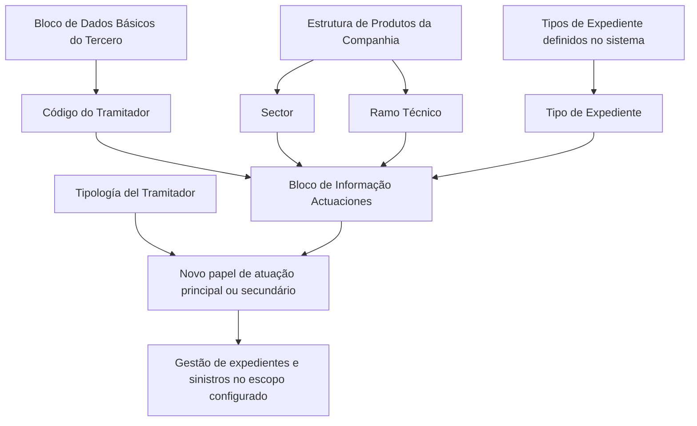
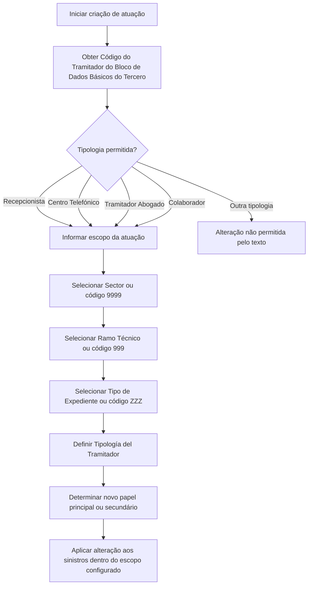

# Gestão de Atuações do Tramitador no REEF — Regras de Alteração de Papel por Setor, Ramo Técnico e Tipo de Expediente

## 1. Metadados do Documento
- **Arquivo de Origem:** `Não identificado no texto extraído`
- **Tipo de Documento:** Especificação Técnica / Documentação Funcional
- **Domínio / Sistema:** DOCUMENTACIÓN Reef / Mapfredocument
- **Público-Alvo:** Analistas funcionais, desenvolvedores, operadores e gestores de tramitação de sinistros
- **Data/Versão Identificada:** Não identificada

---

## 2. Resumo Executivo & Contexto de Negócio

O documento descreve a funcionalidade **“CREAR Actuaciones del Tramitador”**, destinada ao cadastro de atuações de um tramitador no sistema REEF. A funcionalidade permite que determinados tramitadores possam gerir expedientes para combinações específicas de setor, ramo técnico e tipo de expediente, mesmo quando o papel originalmente configurado restringe essa capacidade.

A necessidade de negócio explicitada consiste em permitir que um tramitador tenha o seu papel de atuação principal alterado para sinistros associados a uma segmentação determinada. A segmentação utiliza a Estrutura de Produtos da Companhia e é composta pelos campos **Sector**, **Ramo Técnico** e **Tipo de Expediente**.

A alteração de atuação não está disponível para todas as categorias de tramitador. O documento limita a funcionalidade às tipologias: **Recepcionista**, **Centro Telefónico**, **Tramitador Abogado** e **Colaborador**. A tipologia do tramitador é também o campo que determina o novo papel de atuação, que pode ser principal ou secundário.

A documentação estabelece códigos genéricos para ampliar o escopo da alteração: `9999` para todos os setores, `999` para todos os ramos técnicos e `ZZZ` para todos os tipos de expediente definidos no sistema. Quando é utilizado um código específico, a alteração aplica-se exclusivamente aos sinistros pertencentes àquele valor específico.

---

## 3. Arquitetura, Componentes & Tecnologias Envolvidas

Os componentes e conceitos explicitamente citados são:

| Componente / Conceito | Papel no conteúdo |
| :--- | :--- |
| DOCUMENTACIÓN Reef | Área de documentação identificada no cabeçalho extraído. |
| REEF | Sistema ou domínio documental associado à funcionalidade de atuações do tramitador. |
| Mapfredocument | Identificador presente no cabeçalho da documentação. |
| Estrutura de Produtos da Companhia | Origem das chaves de Setor e Ramo Técnico utilizadas para delimitar o novo papel de atuação. |
| Bloco de Dados Básicos do Tercero | Origem do Código do Tramitador, que é herdado por essa estrutura. |
| Bloco de Informação “Actuaciones” | Estrutura em que são visualizados ou registrados os campos da funcionalidade. |
| Tramitador | Entidade cuja capacidade de gerir expedientes e papel de atuação podem ser configurados. |
| Expediente / Siniestro | Objeto operacional afetado pela alteração de papel de atuação. |



> **Nota de Análise:** O texto não informa tecnologias de implementação, APIs, bancos de dados, métodos HTTP, contratos JSON, ambientes, servidores, URLs operacionais ou mecanismos de persistência.

---

## 4. Regras de Negócio, Especificações Funcionais & Processos

### 4.1 Objetivo funcional

O registro de informações na estrutura de atuações existe para permitir que um tramitador possa gerir expedientes para um setor, ramo técnico e tipo de expediente determinados, mesmo se o papel originalmente configurado para o tramitador impedir a gestão de expedientes.

A estrutura também permite alterar o papel de atuação principal que o tramitador tenha configurado.

### 4.2 Ação habilitada

A única ação explicitamente indicada no trecho é:

- **CREAR:** criação de atuações do tramitador.

> **Nota de Análise:** O conteúdo extraído apresenta `CREAR ( )`, sem detalhar o significado do marcador entre parênteses, permissões necessárias, validações de criação ou comportamento da interface.

### 4.3 Sequência de apresentação ou registro

O documento informa que os campos do bloco de informação seguem uma sequência de visualização ou registro definida da esquerda para a direita e de cima para baixo. Os campos apresentados são:

1. Código do Tramitador.
2. Sector.
3. Ramo Técnico.
4. Tipo de Expediente.
5. Tipología del Tramitador.

### 4.4 Elegibilidade por tipologia do tramitador

A alteração de papel de atuação é permitida somente quando a tipologia do tramitador for uma das seguintes:

- Recepcionista.
- Centro Telefónico.
- Tramitador Abogado.
- Colaborador.

O documento não descreve regras específicas adicionais para cada uma dessas tipologias.

### 4.5 Regra do Código do Tramitador

O **Código do Tramitador** é herdado do **Bloco de Dados Básicos do Tercero**. O campo identifica o código do tramitador no sistema.

### 4.6 Regra de escopo por Sector

O campo **Sector** identifica a chave do setor da Estrutura de Produtos da Companhia para o qual será alterado o papel de atuação principal do tramitador.

- O código genérico `9999` altera o papel de atuação para sinistros de **todos os setores** configurados no sistema.
- Um código específico de setor altera o papel de atuação exclusivamente para sinistros daquele setor.

### 4.7 Regra de escopo por Ramo Técnico

O campo **Ramo Técnico** identifica a chave do ramo técnico da Estrutura de Produtos da Companhia para o qual será alterado o papel de atuação principal do tramitador.

- O código genérico `999` altera o papel de atuação para sinistros de **todos os ramos técnicos** configurados no sistema.
- Um código específico de ramo técnico altera o papel de atuação exclusivamente para sinistros daquele ramo técnico.

### 4.8 Regra de escopo por Tipo de Expediente

O campo **Tipo de Expediente** identifica a chave do tipo de expediente para o qual será alterado o papel de atuação do tramitador.

Exemplos de tipos de expediente citados:

- `DPM` — Daños Materiales Propios.
- `RC` — Responsabilidad Civil.
- `DAP` — Lesionados.

Regras de abrangência:

- O código genérico `ZZZ` altera o papel de atuação para sinistros de **todos os tipos de expediente** definidos no sistema.
- Um código específico de tipo de expediente altera o papel de atuação exclusivamente para sinistros daquela tipologia.

### 4.9 Regra da Tipología del Tramitador

O campo **Tipología del Tramitador** determina o novo papel de atuação atribuído ao tramitador. O documento explicita que o papel determinado pode ser:

- Papel de atuação principal; ou
- Papel de atuação secundário.

> **Nota de Análise:** O documento não lista os valores possíveis para o campo Tipología del Tramitador, não define o mapeamento entre cada tipologia e o papel resultante, e não explica em quais condições a atuação será principal ou secundária.

### 4.10 Fluxo funcional reconstruído



---

## 5. Tabelas de Parâmetros, Ambientes e Estruturas de Dados

| Item / Parâmetro | Descrição / Função | Tipo / Valores / Formato | Ambiente / Observações |
| :--- | :--- | :--- | :--- |
| Código do Tramitador | Identifica o código do tramitador no sistema. | Código herdado. | Procede do Bloco de Dados Básicos do Tercero. |
| Sector | Identifica a chave do setor da Estrutura de Produtos da Companhia para a qual muda o papel de atuação principal. | Código de setor; `9999` como valor genérico. | `9999` aplica a alteração a todos os setores configurados; código específico limita o efeito ao setor indicado. |
| Ramo Técnico | Identifica a chave do ramo técnico da Estrutura de Produtos da Companhia para a qual muda o papel de atuação principal. | Código de ramo técnico; `999` como valor genérico. | `999` aplica a alteração a todos os ramos técnicos configurados; código específico limita o efeito ao ramo indicado. |
| Tipo de Expediente | Identifica a chave do tipo de expediente sobre o qual muda o papel de atuação do tramitador. | Código de tipo de expediente; `ZZZ` como valor genérico. | `ZZZ` aplica a alteração a todos os tipos de expediente definidos no sistema. |
| DPM | Tipo de expediente citado como exemplo. | `DPM` — Daños Materiales Propios. | O documento não fornece detalhamento adicional. |
| RC | Tipo de expediente citado como exemplo. | `RC` — Responsabilidad Civil. | O documento não fornece detalhamento adicional. |
| DAP | Tipo de expediente citado como exemplo. | `DAP` — Lesionados. | O documento não fornece detalhamento adicional. |
| Tipología del Tramitador | Determina o novo papel de atuação atribuído ao tramitador. | Valor de tipologia não detalhado no trecho. | O novo papel pode ser principal ou secundário. |
| Recepcionista | Tipologia elegível para a alteração de atuação. | Tipologia de tramitador. | Permitida pelo documento. |
| Centro Telefónico | Tipologia elegível para a alteração de atuação. | Tipologia de tramitador. | Permitida pelo documento. |
| Tramitador Abogado | Tipologia elegível para a alteração de atuação. | Tipologia de tramitador. | Permitida pelo documento. |
| Colaborador | Tipologia elegível para a alteração de atuação. | Tipologia de tramitador. | Permitida pelo documento. |
| Ação CREAR | Ação habilitada na estrutura de atuações. | Criação. | O comportamento detalhado da ação não foi fornecido. |

> **Nota de Análise:** Não foram identificados ambientes técnicos, URLs, servidores, rotas de log, portas, variáveis de configuração ou estruturas de dados com campos técnicos além dos parâmetros funcionais listados.

---

## 6. Bateria de Perguntas & Respostas para RAG (FAQ Sintético)

### P1: Qual é o objetivo da funcionalidade “CREAR Actuaciones del Tramitador”?
**R:** A funcionalidade permite registrar atuações para que um tramitador possa gerir expedientes de um setor, ramo técnico e tipo de expediente determinados, mesmo quando o seu papel configurado inicialmente impede essa gestão. A funcionalidade também permite alterar o papel de atuação principal configurado para o tramitador.

### P2: Quais tipologias de tramitador podem ter o papel de atuação alterado?
**R:** O documento permite a alteração somente para as tipologias Recepcionista, Centro Telefónico, Tramitador Abogado e Colaborador.

### P3: De onde vem o Código do Tramitador utilizado na estrutura de atuações?
**R:** O Código do Tramitador procede e é herdado do Bloco de Dados Básicos do Tercero. Esse código identifica o tramitador no sistema.

### P4: O que acontece quando o campo Sector recebe o código `9999`?
**R:** O código genérico `9999` faz com que o papel de atuação do tramitador seja alterado para sinistros de todos os setores configurados no sistema.

### P5: Como restringir a alteração de papel de atuação a um único setor?
**R:** Deve-se utilizar o código de um setor concreto existente na Estrutura de Produtos da Companhia. Nesse caso, a alteração é aplicada exclusivamente aos sinistros daquele setor.

### P6: Qual é o significado do código `999` no campo Ramo Técnico?
**R:** O código `999` é o valor genérico do campo Ramo Técnico. Quando utilizado, o novo papel de atuação do tramitador é aplicado a sinistros de todos os ramos técnicos configurados no sistema.

### P7: O que representa o código `ZZZ` no campo Tipo de Expediente?
**R:** O código `ZZZ` é o valor genérico para Tipo de Expediente. Ele permite alterar o papel de atuação do tramitador para sinistros de todos os tipos de expediente definidos no sistema.

### P8: Quais tipos de expediente são citados como exemplos no documento?
**R:** O documento cita DPM para Daños Materiales Propios, RC para Responsabilidad Civil e DAP para Lesionados. O texto usa esses códigos como exemplos de tipos de expediente sobre os quais o papel de atuação pode ser alterado.

### P9: O campo Tipología del Tramitador define o quê?
**R:** O campo Tipología del Tramitador determina o novo papel de atuação atribuído ao tramitador. Segundo o documento, esse papel pode ser um papel de atuação principal ou um papel de atuação secundário.

### P10: É possível aplicar uma alteração somente a um ramo técnico específico?
**R:** Sim. Ao informar o código de um ramo técnico particular existente, a alteração de papel de atuação é aplicada exclusivamente aos sinistros daquele ramo técnico. O código genérico `999` deve ser usado apenas quando a alteração deve abranger todos os ramos técnicos configurados.

### P11: A documentação descreve APIs, contratos JSON ou métodos HTTP para criar atuações?
**R:** Não. O texto extraído descreve regras funcionais e parâmetros de escopo, mas não detalha APIs, métodos HTTP, contratos JSON, tecnologias de implementação ou mecanismos técnicos de integração.

### P12: Qual é a ordem de visualização ou registro dos campos no bloco Actuaciones?
**R:** O documento informa que a sequência é definida da esquerda para a direita e de cima para baixo. Os campos apresentados são Código do Tramitador, Sector, Ramo Técnico, Tipo de Expediente e Tipología del Tramitador.

---

## 7. Glossário de Termos, Siglas & Conceitos-Chave

- **Actuaciones:** Bloco ou estrutura de informação usado para registrar a atuação atribuída ao tramitador.
- **Código del Tramitador:** Código que identifica o tramitador no sistema; é herdado do Bloco de Dados Básicos do Tercero.
- **Colaborador:** Uma das tipologias de tramitador elegíveis para alteração de atuação.
- **Centro Telefónico:** Uma das tipologias de tramitador elegíveis para alteração de atuação.
- **DAP:** Código de tipo de expediente citado como “Lesionados”.
- **DPM:** Código de tipo de expediente citado como “Daños Materiales Propios”.
- **Expediente:** Entidade de processo cuja gestão pode ser habilitada ou delimitada pelo papel de atuação do tramitador.
- **Papel de atuação principal:** Papel configurado para o tramitador que pode ser alterado conforme setor, ramo técnico e tipo de expediente.
- **Papel de atuação secundário:** Papel alternativo citado como possível resultado da configuração pela Tipología del Tramitador.
- **Ramo Técnico:** Chave da Estrutura de Produtos da Companhia utilizada para delimitar a aplicação do papel de atuação.
- **RC:** Código de tipo de expediente citado como “Responsabilidad Civil”.
- **REEF:** Nome associado à área de documentação identificada como DOCUMENTACIÓN Reef.
- **Sector:** Chave da Estrutura de Produtos da Companhia utilizada para delimitar a aplicação do papel de atuação.
- **Siniestro:** Sinistro ao qual a alteração de papel de atuação pode ser aplicada.
- **Tipología del Tramitador:** Campo que determina o novo papel de atuação principal ou secundário do tramitador.
- **Tramitador Abogado:** Uma das tipologias de tramitador elegíveis para alteração de atuação.
- **Tercero:** Entidade que contém o Bloco de Dados Básicos de onde o Código do Tramitador é herdado.

---

## 8. Notas Críticas, Riscos & Limitações

- O texto não descreve validações detalhadas para a ação **CREAR**.
- O texto não informa se os códigos `9999`, `999` e `ZZZ` podem ser combinados livremente na mesma configuração.
- O documento não especifica precedência entre atuações genéricas e atuações específicas caso existam ambas para o mesmo tramitador.
- O documento não define o catálogo completo de valores para **Tipología del Tramitador** nem o mapeamento de cada tipologia para um papel principal ou secundário.
- O documento não explica como o sistema trata conflitos, duplicidades, atualização, exclusão ou auditoria de atuações.
- Não há detalhamento de controle de acesso, matriz de permissões, aprovação ou segregação de funções para a criação de atuações.
- Não foram identificadas informações sobre APIs, integrações, persistência, logs, monitoramento, ambientes, versões ou dependências técnicas.
- O trecho final apresenta três ocorrências de “Consejo:” sem conteúdo subsequente. Portanto, não é possível recuperar recomendações associadas a esses itens.

---

## 9. Conteúdo Bruto Estruturado (Referência Fiel)

```text
--- [PÁGINA 1 DE 2] ---

CREAR Actuaciones del Tramitador
Objetivo
El registro de información en esta Estructura obedece a la necesidad de permitir el que un tramitador, cuyo rol en principio le impide gestionar
expedientes, pueda hacerlo para un sector, ramo técnico y tipo de expediente determinados o cambiar el rol de actuación principal que tenga
congurado.
Esto está permitido siempre y cuando la tipología del Tramitador sea una de las siguientes:
Recepcionista.
Centro Telefónico.
Tramitador Abogado, ó
Colaborador.
Acciones habilitadas
 CREAR ( )
Actuaciones
De Izquierda a Derecha y de Arriba hacia Abajo, los siguientes campos marcan la secuencia de visualización o registro de los Campos en este
Bloque de Información.
Código del Tramitador
Este dato procede y se hereda del Bloque de Datos Básicos del Tercero e identica el código del tramitador en el Sistema.
Sector (  )
Este campo identica la clave del Sector de la Estructura de Productos de la Compañía para la que se cambia el rol de actuación principal del
tramitador.
Documentation / DOCUMENTACIÓN Reef
DOCUMENTACIÓN Reef
Mapfredocument
DOCUMENTACIÓN Reef
Owner
user:agonzalez_mapfre.com
Lifecycle
Approved Source
 / 
 VL
Buscar Inicio Soluciones Arquitecturas APIs Componentes Cloud Documentación Zeus Reef Ayuda
ES


--- [PÁGINA 2 DE 2] ---

Utilizando el valor genérico en este campo (código 9999) se cambiará el rol de actuación del tramitador para los siniestros de todos los
sectores congurados en el sistema o bien, al utilizar el código de un sector en concreto de los existentes, cambiar el rol de actuación
exclusivamente para los siniestros de este.
Ramo Técnico (  )
Este campo identica la clave del ramo técnico de la Estructura de Productos de la Compañía para la que se cambia el rol de actuación
principal del tramitador.
Utilizando el valor genérico en este campo (código 999) se cambiará el rol de actuación del tramitador para los siniestros de todos los
ramos técnicos congurados en el sistema o bien, al utilizar el código de un ramo en particular de los existentes, cambiar el rol de
actuación exclusivamente para los siniestros de este.
Tipo de Expediente (  )
Esta campo identica la clave del tipo de expediente' (DPM - Daños Materiales Propios,RC - Responsabilidad Civil, DAP - Lesionados,...) sobre
el que se cambia el rol de actuación del tramitador.
Utilizando el valor genérico en este campo (código ZZZ) se cambiará el rol de actuación del tramitador para los siniestros de todos los
tipos de expedientes denidos en el sistema o bien, al utilizar el código de un tipo de expediente en particular, cambiar el rol de actuación
exclusivamente para los siniestros de esta tipología.
Tipología del Tramitador (  )
Este campo del determinará el nuevo rol de actuación (o rol de actuación secundario) asignado al tramitador.
Consejo:
Consejo:
Consejo:
```
