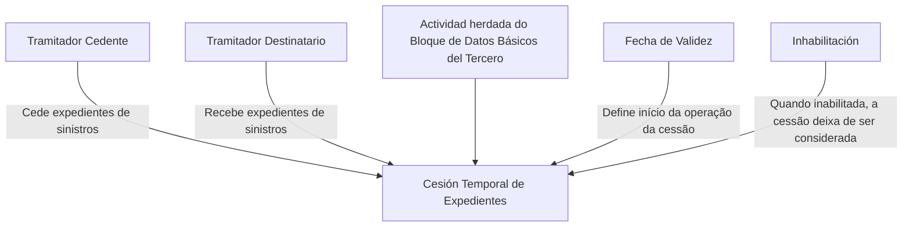
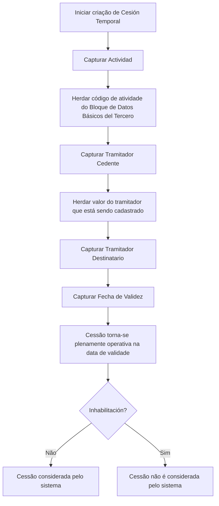

# Cesiones Temporales de Expedientes del Tramitador — Documentação Reef

## 1. Metadados do Documento
- **Arquivo de Origem:** Não identificado no conteúdo fornecido
- **Tipo de Documento:** Manual Operacional
- **Domínio / Sistema:** Reef / Mapfredocument
- **Público-Alvo:** Operação, usuários responsáveis pela gestão de tramitadores e expedientes
- **Data/Versão Identificada:** Não identificada
- **Owner identificado:** `user:agonzalez_mapfre.com`
- **Lifecycle identificado:** `Approved Source / VL`

---

## 2. Resumo Executivo & Contexto de Negócio

O documento descreve a criação de **cesiones temporales** de expedientes para um **Tramitador** no sistema Reef. A finalidade funcional é reassociar temporariamente os expedientes de sinistros de um tramitador a outro tramitador, permitindo que a gestão dos expedientes continue sem interrupção.

A necessidade de negócio citada está associada à indisponibilidade temporária do tramitador originalmente responsável, incluindo situações como doença, férias e baixa temporária. A cessão temporária estabelece um tramitador cedente, que transfere os expedientes, e um tramitador destinatário, que passa a recebê-los.

A operação habilitada no bloco de informação é **CREAR**. A captura dos campos segue uma sequência de preenchimento indicada como da esquerda para a direita e de cima para baixo.

A vigência operacional da cessão depende da **Fecha de Validez**, que informa ao sistema a data a partir da qual a cessão de expedientes passa a ter efeito. A propriedade **Inhabilitación** permite indicar que a cessão está inabilitada; após a inabilitação, a cessão deixa de ser considerada pelo sistema.

---

## 3. Arquitetura, Componentes & Tecnologias Envolvidas

O conteúdo fornecido identifica os seguintes elementos:

- **Reef:** sistema ou domínio de documentação no qual a funcionalidade é apresentada.
- **Mapfredocument:** identificação presente no conteúdo de documentação.
- **Tramitador Cedente:** tramitador que transfere expedientes de sinistros.
- **Tramitador Destinatario:** tramitador que recebe expedientes de sinistros.
- **Expedientes:** registros cuja gestão é transferida entre tramitadores.
- **Siniestros:** contexto dos expedientes transferidos.
- **Bloque de Datos Básicos del Tercero:** origem do dado de atividade.
- **Bloque de Información:** bloco no qual os campos da cessão temporária são capturados.



**Nota de Análise:** o documento não detalha arquitetura técnica de infraestrutura, APIs, métodos HTTP, contratos JSON, banco de dados, URLs de ambiente, servidores ou tecnologias de implementação.

---

## 4. Regras de Negócio, Especificações Funcionais & Processos

### Objetivo funcional

A estrutura de **Cesiones Temporales** existe para reassociar os expedientes de um Tramitador a outro tramitador, mantendo a continuidade da gestão. O documento cita como exemplos de indisponibilidade do tramitador: enfermidade, férias e baixa temporal.

### Ação habilitada

A ação habilitada no bloco é:

- **CREAR**

### Sequência de captura

O documento determina que os campos do bloco de informação devem seguir a sequência de captura:

1. Da esquerda para a direita.
2. De cima para baixo.

### Regras dos campos

1. **Actividad**
   - O dado é proveniente do **Bloque de Datos Básicos del Tercero**.
   - O dado é herdado desse bloco.
   - O campo identifica o código de atividade correspondente aos Tramitadores.

2. **Tramitador Cedente**
   - Contém o código do Tramitador que cede os expedientes de sinistros.
   - O valor é herdado do tramitador que está sendo cadastrado.

3. **Tramitador Destinatario**
   - Contém o código do Tramitador que recebe os expedientes de sinistros.

4. **Fecha de Validez**
   - Informa ao sistema a data a partir da qual a cessão de expedientes entra em vigor.
   - A cessão passa a estar plenamente operativa no sistema a partir dessa data.

5. **Inhabilitación**
   - Indica ao sistema que a cessão de expedientes do Tramitador está inabilitada.
   - A partir do momento de inabilitação, a cessão não deve ser considerada pelo sistema.



---

## 5. Tabelas de Parâmetros, Ambientes e Estruturas de Dados

| Item / Parâmetro | Descrição / Função | Tipo / Valores / Formato | Ambiente / Observações |
| :--- | :--- | :--- | :--- |
| Acción habilitada | Permite criar uma cessão temporária de expedientes. | `CREAR` | O documento não apresenta outras ações. |
| Cesiones Temporales | Estrutura utilizada para reassociar expedientes de um Tramitador a outro Tramitador. | Estrutura funcional | Aplicável para continuidade de gestão em casos como enfermidade, férias ou baixa temporal. |
| Actividad | Identifica o código de atividade correspondente aos Tramitadores. | Código de atividade | Procede e é herdado do Bloque de Datos Básicos del Tercero. |
| Tramitador Cedente | Identifica o Tramitador que cede os expedientes de sinistros. | Código do Tramitador | O valor é herdado do tramitador que está sendo cadastrado. |
| Tramitador Destinatario | Identifica o Tramitador que recebe os expedientes de sinistros. | Código do Tramitador | O documento não informa regras adicionais de validação. |
| Fecha de Validez | Define quando a cessão de expedientes passa a existir e operar plenamente no sistema. | Data | Marca o início da vigência operacional da cessão. |
| Inhabilitación | Indica que a cessão de expedientes está inabilitada. | Estado/propriedade | Após a inabilitação, a cessão deixa de ser considerada pelo sistema. |
| Orden de captura | Define a ordem de preenchimento dos campos no bloco de informação. | Esquerda para direita; cima para baixo | Regra explícita de sequência de captura. |
| Reef | Sistema ou contexto documental no qual a funcionalidade é apresentada. | Nome de sistema/domínio | Não há detalhamento técnico adicional. |
| Mapfredocument | Identificação exibida na documentação. | Nome/identificador | Relação técnica com Reef não é detalhada. |
| Owner | Proprietário identificado no conteúdo. | `user:agonzalez_mapfre.com` | Conforme metadado exibido no documento. |
| Lifecycle | Estado de ciclo de vida identificado. | `Approved Source / VL` | O significado de `VL` não é definido no conteúdo. |

---

## 6. Bateria de Perguntas & Respostas para RAG (FAQ Sintético)

### P1: Qual é o objetivo das Cesiones Temporales de Expedientes del Tramitador?
**R:** O objetivo é reassociar os expedientes de um Tramitador a outro Tramitador para garantir a continuidade da gestão dos expedientes. O documento cita como exemplos de necessidade operacional enfermidade, férias e baixa temporal do tramitador originalmente responsável.

### P2: Qual ação está habilitada na estrutura de Cesiones Temporales?
**R:** A ação habilitada é `CREAR`. O conteúdo fornecido não identifica ações adicionais, como alteração, consulta ou exclusão.

### P3: O que representa o campo Actividad em uma cessão temporal?
**R:** O campo **Actividad** identifica o código de atividade correspondente aos Tramitadores. Esse dado procede e é herdado do **Bloque de Datos Básicos del Tercero**.

### P4: De onde vem o valor do Tramitador Cedente?
**R:** O campo **Tramitador Cedente** contém o código do Tramitador que cede os expedientes de sinistros. O documento informa que esse valor é herdado do tramitador que está sendo cadastrado.

### P5: Qual é a função do Tramitador Destinatario?
**R:** O campo **Tramitador Destinatario** contém o código do Tramitador que recebe os expedientes de sinistros transferidos pelo Tramitador Cedente.

### P6: Quando uma cessão temporária passa a estar operativa no sistema?
**R:** A cessão temporária passa a ter efeito e fica plenamente operativa a partir da data informada no campo **Fecha de Validez**.

### P7: O que acontece quando uma cessão temporária é inabilitada?
**R:** Quando a propriedade **Inhabilitación** indica que a cessão de expedientes está inabilitada, a cessão deixa de ser considerada pelo sistema a partir do momento de sua inabilitação.

### P8: Qual é a ordem de preenchimento dos campos na estrutura de Cesiones Temporales?
**R:** Os campos devem ser capturados da esquerda para a direita e de cima para baixo, conforme a sequência indicada no bloco de informação.

### P9: O documento define APIs ou contratos de integração para Cesiones Temporales?
**R:** Não. O conteúdo fornecido descreve campos e regras funcionais da criação de cessões temporárias, mas não detalha APIs, métodos HTTP, contratos JSON, eventos, filas ou mecanismos de integração.

### P10: Quais são os dados mínimos explicitamente descritos para uma cessão temporária?
**R:** O documento descreve os campos **Actividad**, **Tramitador Cedente**, **Tramitador Destinatario**, **Fecha de Validez** e **Inhabilitación**, além da ação habilitada `CREAR`.

---

## 7. Glossário de Termos, Siglas & Conceitos-Chave

- **Actividad:** campo que identifica o código de atividade correspondente aos Tramitadores; o valor é herdado do Bloque de Datos Básicos del Tercero.
- **Bloque de Datos Básicos del Tercero:** bloco de origem do dado de atividade.
- **Cesiones Temporales:** estrutura usada para transferir temporariamente a gestão de expedientes de um Tramitador para outro.
- **CREAR:** ação habilitada para a criação de uma cessão temporária.
- **Expedientes:** registros cuja gestão é reassociada entre Tramitadores.
- **Fecha de Validez:** data a partir da qual a cessão de expedientes entra em vigor e fica plenamente operativa.
- **Inhabilitación:** propriedade que determina que uma cessão está inabilitada e não deve mais ser considerada pelo sistema.
- **Mapfredocument:** identificação presente no conteúdo de documentação.
- **Reef:** sistema ou domínio documental identificado no conteúdo.
- **Siniestros:** contexto dos expedientes transferidos entre Tramitadores.
- **Tramitador:** responsável pela gestão de expedientes.
- **Tramitador Cedente:** Tramitador que transfere os expedientes de sinistros.
- **Tramitador Destinatario:** Tramitador que recebe os expedientes de sinistros.
- **VL:** sigla presente no metadado `Approved Source / VL`; o significado não é definido no conteúdo fornecido.

---

## 8. Notas Críticas, Riscos & Limitações

- O documento não identifica o arquivo de origem, versão, data de publicação ou histórico de alterações.
- O documento não detalha critérios de validação para códigos de Tramitador, formato da Fecha de Validez ou obrigatoriedade dos campos.
- O documento não informa como o sistema trata conflitos entre cessões temporárias, cessões sobrepostas ou múltiplos destinatários para o mesmo Tramitador Cedente.
- O documento não esclarece se uma Inhabilitación pode ser revertida, nem descreve fluxo de reabilitação.
- Não há detalhes sobre APIs, banco de dados, integrações, logs, autenticação, auditoria ou tratamento de erros.
- **Nota de Análise:** o conteúdo apresenta regras funcionais de alto nível e não fornece detalhamento adicional sobre implementação técnica ou contratos operacionais.

---

## 9. Conteúdo Bruto Estruturado (Referência Fiel)

```text
--- [PÁGINA 1 DE 2] ---

CREAR Cesiones Temporales de Expedientes del Tramitador
Objetivo
La captura de la información en esta Estructura obedece a la necesidad de reasignar los Expedientes del Tramitador a algún otro tramitador
continuando así con su gestión (ya sea por enfermedad, vacaciones, baja temporal,...)
Acciones habilitadas
 CREAR ( )
Cesiones Temporales
De Izquierda a Derecha y de Arriba hacia Abajo, los siguientes campos marcan la secuencia de captura de los Campos en este Bloque de
Información.
Actividad (  )
Este dato procede y se hereda del Bloque de Datos Básicos del Tercero e identica el código de actividad que le corresponde a los
Tramitadores.
Tramitador Cedente (  )
Este campo contiene el código del Tramitador que cede los expedientes de los siniestros y su valor se hereda del tramitador que estamos
dando de alta.
Tramitador Destinatario (  )
Este campo, por el contrario, contiene el código del Tramitador que recibe los expedientes de los siniestros.
Fecha de Validez ( )
Esta propiedad le indica al Sistema la fecha a partir de la cual la cesión de expedientes tomará cuerpo y estará plenamente operativa en el
sistema.
Inhabilitación ( )
Documentation / DOCUMENTACIÓN Reef
DOCUMENTACIÓN Reef
Mapfredocument
DOCUMENTACIÓN Reef
Owner
user:agonzalez_mapfre.com
Lifecycle
Approved Source
 / 
 VL
Buscar Inicio Soluciones Arquitecturas APIs Componentes Cloud Documentación Zeus Reef Ayuda
ES


--- [PÁGINA 2 DE 2] ---

Este Campo le indica al Sistema que la cesión de expedientes del Tramitador está inhabilitada en el Sistema por lo que a partir del momento
de su inhabilitación no se va a considerar su cesión.
```
