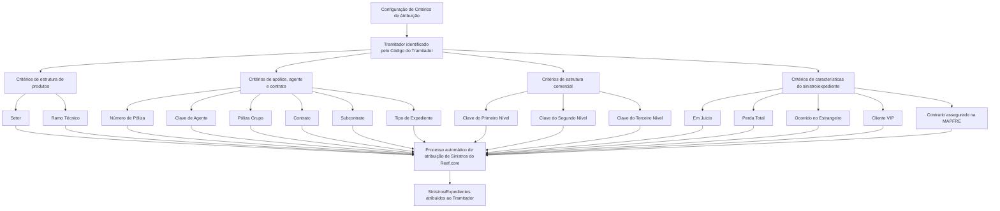

# Critérios de Atribuição de Sinistros ao Tramitador no Reef.core

## 1. Metadados do Documento
- **Arquivo de Origem:** Não informado
- **Tipo de Documento:** Manual Operacional
- **Domínio / Sistema:** Reef.core — gestão e atribuição automática de Sinistros/Expedientes
- **Público-Alvo:** Operação, analistas funcionais, gestores de sinistros e administradores do sistema
- **Data/Versão Identificada:** Não identificada

---

## 2. Resumo Executivo & Contexto de Negócio

O documento descreve a funcionalidade **“Crear Criterios de Asignación de Siniestros del Tramitador”** do Reef.core. A funcionalidade permite configurar critérios de atribuição e distribuição de sinistros associados explicitamente a um Tramitador, para que o processo automático de atribuição de sinistros do Reef.core considere esses critérios.

A configuração especializa a gestão de cada Tramitador. Essa especialização pode ocorrer por atributos da estrutura de produtos da companhia, como Setor e Ramo Técnico, por informações de apólice — Número de Póliza, Póliza Grupo, Contrato e Subcontrato —, por dados de intermediação, como Clave de Agente, e por níveis da estrutura comercial.

O processo também contempla filtros por características específicas de sinistros e expedientes: tipo de expediente, processos judiciais, perda total, ocorrência no exterior, cliente VIP e existência de terceiro assegurado pela MAPFRE. A ativação de determinados campos habilita a atribuição de sinistros ou expedientes com essas condições ao Tramitador configurado.

O documento apresenta valores genéricos para alguns critérios: `9999` para todos os Setores, `999` para todos os Ramos Técnicos e `ZZZ` para todos os Tipos de Expediente. A combinação apropriada dos critérios permite associar um Tramitador a sinistros de todos, vários ou apenas um Setor, além de restringir a atribuição pelos demais atributos cadastrados.

Não são documentados métodos HTTP, contratos de API, persistência de dados, interfaces técnicas, prioridades entre critérios ou algoritmo detalhado de decisão do processo automático de atribuição do Reef.core.

---

## 3. Arquitetura, Componentes & Tecnologias Envolvidas

### Componentes e elementos identificados

| Componente / Elemento | Papel descrito no documento |
| :--- | :--- |
| **Reef.core** | Sistema que implementa o processo automático de atribuição de Sinistros e considera os critérios associados ao Tramitador. |
| **Tramitador** | Responsável pela gestão de Sinistros/Expedientes atribuídos de acordo com os critérios configurados. |
| **Processo de Asignación automático de Siniestros** | Processo automático do Reef.core que avalia os critérios de atribuição configurados para os Tramitadores. |
| **Estrutura de Produtos da Compañía** | Fonte das chaves de Setor e Ramo Técnico usadas para especializar a gestão. |
| **Estrutura Comercial no Sistema** | Fonte das chaves de Primeiro, Segundo e Terceiro Nível usadas para especializar a atribuição. |
| **Módulo de Juicios** | Módulo relacionado à identificação de Sinistros/Expedientes em processo judicial. |
| **MAPFRE** | Entidade citada no critério de expedientes cujo Contrario esteja assegurado na MAPFRE. |



**Nota de Análise:** O documento identifica o Reef.core, o processo automático de atribuição e o módulo de Juicios, mas não detalha arquitetura de infraestrutura, integrações, bancos de dados, APIs, tecnologias de implementação ou contratos de comunicação entre componentes.

---

## 4. Regras de Negócio, Especificações Funcionais & Processos

### Objetivo da configuração

A captura das informações na estrutura de critérios existe para configurar os critérios de atribuição de Sinistros que serão associados expressamente a um Tramitador. O processo automático de atribuição de Sinistros do Reef.core deve considerar esses critérios configurados.

### Ação habilitada

A ação explicitamente identificada no documento é:

- **CREAR:** criação de critérios de atribuição.

### Sequência de captura

Os atributos do bloco de informações devem ser capturados na sequência apresentada, da esquerda para a direita e de cima para baixo. Quando não houver especificação ou indicação expressa em contrário, os atributos devem ser utilizados tanto para **Personas Físicas** quanto para **Personas Jurídicas**.

### Regras por critério

1. **Código do Tramitador**
   - Identifica o código do Tramitador ao qual são concedidos critérios de atribuição e distribuição de Sinistros.
   - Constitui a referência do responsável que receberá a especialização de gestão.

2. **Setor**
   - Identifica a chave do Setor da Estrutura de Produtos da Companhia.
   - Permite especializar as tarefas de gestão do Tramitador para que Sinistros/Expedientes com a característica de Setor sejam atribuídos exclusivamente a esse Tramitador.
   - O código genérico `9999` permite atribuir ao Tramitador sinistros de todos os Setores configurados no sistema.
   - Um código de Setor específico restringe a atribuição aos sinistros daquele Setor.
   - A combinação adequada de critérios pode atribuir ao Tramitador sinistros de todos, vários ou um único Setor.

3. **Ramo Técnico**
   - Identifica a chave do Ramo Técnico da Estrutura de Produtos da Companhia.
   - Permite especializar as tarefas de gestão do Tramitador para que Sinistros/Expedientes com esse Ramo Técnico sejam atribuídos exclusivamente a esse Tramitador.
   - O código genérico `999` permite atribuir sinistros de todos os Ramos Técnicos configurados.
   - Um código de Ramo Técnico particular restringe a atribuição aos sinistros daquele ramo.

4. **Número de Póliza**
   - Identifica a chave de uma Póliza.
   - É utilizado quando, por características técnicas, características comerciais ou experiência do Tramitador, a entidade considera adequado que um Tramitador específico seja responsável pela gestão dos Sinistros e/ou Expedientes da Póliza.

5. **Clave de Agente**
   - Identifica a chave do intermediário.
   - Permite especializar a gestão do Tramitador para que Sinistros/Expedientes das Pólizas intermediadas por esse Agente possam ser atribuídos ao Tramitador.

6. **Póliza Grupo**
   - Identifica o código de uma Póliza Grupo.
   - Permite especializar a gestão do Tramitador para que Sinistros/Expedientes das Pólizas associadas à Póliza Grupo possam ser atribuídos ao Tramitador.

7. **Contrato**
   - Identifica o código de um Contrato.
   - Permite ao Reef.core especializar a gestão do Tramitador para Sinistros/Expedientes de Pólizas associadas ao Contrato.

8. **Subcontrato**
   - Identifica a chave de um Subcontrato.
   - Permite especializar a gestão do Tramitador para Sinistros/Expedientes de Pólizas associadas ao Subcontrato.

9. **Tipo de Expediente**
   - Identifica a chave de um tipo de expediente para especializar a gestão do Tramitador.
   - Exemplos apresentados: `DPM - Daños Materiales Propios`, `RC - Responsabilidad Civil` e `DAP - Lesionados`.
   - O código genérico `ZZZ` permite atribuir ao Tramitador sinistros de todos os Tipos de Expediente configurados.
   - Um código específico de Tipo de Expediente restringe a atribuição aos sinistros daquele tipo.

10. **Clave do Primeiro Nível**
    - Contém o código que identifica o Primeiro Nível da Estrutura Comercial no Sistema.
    - Permite especializar a gestão do Tramitador para Sinistros/Expedientes de Pólizas associadas àquela chave.

11. **Clave do Segundo Nível**
    - Contém o código que identifica o Segundo Nível da Estrutura Comercial no Sistema.
    - Permite especializar a gestão do Tramitador para Sinistros/Expedientes de Pólizas associadas àquela chave.

12. **Clave do Terceiro Nível**
    - Contém o código que identifica o Terceiro Nível da Estrutura Comercial no Sistema.
    - Permite especializar a gestão do Tramitador para Sinistros/Expedientes de Pólizas associadas àquela chave.

13. **Sinistros/Expedientes em Juicios**
    - Quando o campo é ativado, o Tramitador pode receber Sinistros e Expedientes em processo judicial.
    - O documento relaciona essa condição ao módulo de Juicios.

14. **Sinistros com Pérdida Total**
    - Quando o campo é ativado, o Tramitador pode receber Sinistros e Expedientes identificados como perda total.

15. **Sinistros ocorridos no Extranjero**
    - Permite atribuir ao Tramitador Sinistros e Expedientes identificados como ocorridos no exterior.

16. **Sinistros de Clientes VIP**
    - A ativação do campo modula o processo de atribuição implementado no Reef.core.
    - Permite que o Tramitador receba Sinistros e Expedientes pertencentes a Pólizas de Clientes VIP.

17. **Sinistros/Expedientes com Contrario en MAPFRE**
    - Quando ativado, permite atribuir ao Tramitador Expedientes — normalmente de Pólizas de automóveis — cujo Contrario esteja assegurado na MAPFRE.

---

## 5. Tabelas de Parâmetros, Ambientes e Estruturas de Dados

| Item / Parâmetro | Descrição / Função | Tipo / Valores / Formato | Ambiente / Observações |
| :--- | :--- | :--- | :--- |
| Código do Tramitador | Identifica o Tramitador que recebe os critérios de atribuição e distribuição de Sinistros. | Código do Tramitador. | Valor específico não informado. |
| Setor | Especializa a gestão por Setor da Estrutura de Produtos da Companhia. | Código de Setor; `9999` representa todos os Setores. | Código específico considera exclusivamente aquele Setor. |
| Ramo Técnico | Especializa a gestão por Ramo Técnico da Estrutura de Produtos da Companhia. | Código de Ramo Técnico; `999` representa todos os Ramos Técnicos. | Código específico considera exclusivamente aquele Ramo Técnico. |
| Número de Póliza | Direciona a gestão de Sinistros/Expedientes de uma Póliza a um Tramitador determinado. | Chave de Póliza. | Aplicável por características técnicas, comerciais ou experiência do Tramitador. |
| Clave de Agente | Especializa a gestão por intermediário de Póliza. | Chave do intermediário / Agente. | Aplica-se a Pólizas intermediadas pelo Agente. |
| Póliza Grupo | Especializa a gestão por Póliza Grupo. | Código de Póliza Grupo. | Aplica-se a Pólizas associadas à Póliza Grupo. |
| Contrato | Especializa a gestão por Contrato. | Código de Contrato. | Aplica-se a Pólizas associadas ao Contrato. |
| Subcontrato | Especializa a gestão por Subcontrato. | Chave de Subcontrato. | Aplica-se a Pólizas associadas ao Subcontrato. |
| Tipo de Expediente | Especializa a gestão por tipo de expediente. | Código de tipo; exemplos: `DPM`, `RC`, `DAP`; `ZZZ` representa todos os tipos. | Código específico considera exclusivamente aquele tipo. |
| Clave do Primeiro Nível | Especializa a gestão pela primeira camada da Estrutura Comercial. | Código do Primeiro Nível. | Aplica-se a Pólizas associadas à chave. |
| Clave do Segundo Nível | Especializa a gestão pela segunda camada da Estrutura Comercial. | Código do Segundo Nível. | Aplica-se a Pólizas associadas à chave. |
| Clave do Terceiro Nível | Especializa a gestão pela terceira camada da Estrutura Comercial. | Código do Terceiro Nível. | Aplica-se a Pólizas associadas à chave. |
| Se contemplan los Siniestros/Expedientes en Juicios | Habilita atribuição de casos em processo judicial. | Campo de ativação. | Relacionado ao módulo de Juicios. |
| Se contemplan los Siniestros con Pérdida Total | Habilita atribuição de casos identificados como perda total. | Campo de ativação. | Sem valores adicionais documentados. |
| Se contemplan los Siniestros acaecidos en el Extranjero | Habilita atribuição de casos ocorridos no exterior. | Campo de ativação. | Sem valores adicionais documentados. |
| Se contemplan los Siniestros de Clientes VIP | Habilita atribuição de casos pertencentes a Pólizas de Clientes VIP. | Campo de ativação. | Modula o processo de atribuição do Reef.core. |
| Se contemplan los Siniestros/Expedientes con Contrario en MAPFRE | Habilita atribuição de expedientes cujo terceiro esteja assegurado na MAPFRE. | Campo de ativação. | Normalmente aplicável a Pólizas de automóveis. |

---

## 6. Bateria de Perguntas & Respostas para RAG (FAQ Sintético)

### P1: Qual é o objetivo dos critérios de atribuição de sinistros ao Tramitador no Reef.core?
**R:** Os critérios configuram a atribuição e distribuição de Sinistros associados expressamente a um Tramitador. O processo automático de atribuição de Sinistros do Reef.core considera esses critérios para direcionar Sinistros/Expedientes ao Tramitador apropriado.

### P2: Qual código deve ser utilizado para permitir que um Tramitador receba sinistros de todos os Setores?
**R:** Deve ser utilizado o código genérico `9999` no campo Setor. Esse valor permite que o Tramitador receba sinistros de todos os Setores configurados no sistema.

### P3: Como restringir a atribuição de sinistros a um único Setor?
**R:** Deve-se informar o código de um Setor específico no campo Setor. O documento estabelece que o uso de um código de Setor existente permite considerar exclusivamente a atribuição de sinistros daquele Setor.

### P4: Qual valor permite considerar todos os Ramos Técnicos para um Tramitador?
**R:** O campo Ramo Técnico aceita o código genérico `999`, que permite atribuir ao Tramitador sinistros de todos os Ramos Técnicos configurados no sistema.

### P5: Para que serve o Número de Póliza nos critérios de atribuição?
**R:** O Número de Póliza identifica uma Póliza para a qual, por características técnicas, comerciais ou pela experiência do Tramitador, a entidade considera adequado designar um Tramitador determinado como responsável pela gestão dos seus Sinistros e/ou Expedientes.

### P6: Quais tipos de expediente são exemplificados pelo documento?
**R:** O documento exemplifica os tipos `DPM - Daños Materiales Propios`, `RC - Responsabilidad Civil` e `DAP - Lesionados`. Esses tipos podem ser usados para especializar a gestão do Tramitador.

### P7: Qual código de Tipo de Expediente permite atribuição de todos os tipos configurados?
**R:** O código genérico `ZZZ` no atributo Tipo de Expediente permite atribuir ao Tramitador sinistros de todos os Tipos de Expediente configurados no sistema.

### P8: É possível atribuir ao Tramitador sinistros que estejam em processo judicial?
**R:** Sim. Quando o campo “Se contemplan los Siniestros/Expedientes en Juicios” é ativado, o Tramitador pode receber Sinistros e Expedientes que estejam em processo judicial, relacionado ao módulo de Juicios.

### P9: Como a estrutura comercial influencia a atribuição de sinistros?
**R:** As chaves do Primeiro, Segundo e Terceiro Nível da Estrutura Comercial permitem especializar a gestão do Tramitador. Os Sinistros/Expedientes de Pólizas associadas a essas chaves podem ser atribuídos ao Tramitador.

### P10: O que acontece quando o campo de Clientes VIP é ativado?
**R:** A ativação do campo modula o processo de atribuição implementado no Reef.core, permitindo que o Tramitador receba Sinistros e Expedientes pertencentes a Pólizas de Clientes VIP.

### P11: É possível atribuir sinistros com perda total a um Tramitador?
**R:** Sim. A ativação do campo “Se contemplan los Siniestros con Pérdida Total” permite que o Tramitador receba Sinistros e Expedientes identificados como perda total.

### P12: Qual é a finalidade do critério Contrario en MAPFRE?
**R:** Quando ativado, esse critério permite atribuir ao Tramitador Expedientes, normalmente de Pólizas de automóveis, cujo Contrario esteja assegurado na MAPFRE.

---

## 7. Glossário de Termos, Siglas & Conceitos-Chave

- **Reef.core:** Sistema que implementa o processo automático de atribuição de Sinistros e considera os critérios associados a Tramitadores.
- **Tramitador:** Responsável pela gestão de Sinistros/Expedientes atribuídos segundo critérios configurados.
- **Sinistro:** Ocorrência tratada pelo processo de atribuição e gestão descrito no documento.
- **Expediente:** Registro ou caso de gestão associado a Sinistros, Pólizas e critérios de atribuição.
- **Setor:** Chave da Estrutura de Produtos da Companhia usada para especializar a gestão.
- **Ramo Técnico:** Chave da Estrutura de Produtos da Companhia usada para especializar a gestão.
- **Póliza:** Apólice identificada por sua chave ou Número de Póliza.
- **Póliza Grupo:** Apólice cujo código permite especializar a gestão das Pólizas associadas.
- **Contrato:** Código que relaciona Pólizas e possibilita especializar a gestão do Tramitador.
- **Subcontrato:** Chave que relaciona Pólizas e possibilita especializar a gestão do Tramitador.
- **Clave de Agente:** Chave do intermediário de uma Póliza.
- **DPM:** Daños Materiales Propios.
- **RC:** Responsabilidad Civil.
- **DAP:** Lesionados.
- **Juicios:** Processos judiciais, relacionados no documento ao módulo de Juicios.
- **Pérdida Total:** Condição que identifica determinados Sinistros e Expedientes como perda total.
- **Cliente VIP:** Cliente cujas Pólizas podem ser usadas como critério específico de atribuição.
- **Contrario:** Terceiro envolvido em um expediente; o documento considera especificamente o caso em que esteja assegurado na MAPFRE.
- **MAPFRE:** Entidade citada como seguradora do Contrario em determinados Expedientes.

---

## 8. Notas Críticas, Riscos & Limitações

- O documento não informa o nome do arquivo de origem, data, versão, autor ou responsáveis técnicos.
- O documento descreve critérios funcionais, mas não especifica a lógica de combinação, precedência, conflito ou prioridade entre critérios concorrentes.
- Não são apresentados métodos HTTP, endpoints, contratos JSON, eventos, integrações, bancos de dados ou tecnologias de implementação.
- Não há descrição de validações de formato, obrigatoriedade de campos, mensagens de erro ou comportamento para códigos inexistentes.
- Não é detalhado se a ativação dos campos de Juicios, Pérdida Total, Extranjero, Clientes VIP e Contrario en MAPFRE atua como filtro obrigatório, critério adicional ou outra regra interna do processo automático.
- Os valores genéricos documentados são exclusivamente `9999` para Setor, `999` para Ramo Técnico e `ZZZ` para Tipo de Expediente.
- O documento cita a ação **CREAR**, mas não detalha ações de consulta, alteração, exclusão, aprovação ou auditoria dos critérios.

---

## 9. Conteúdo Bruto Estruturado (Referência Fiel)

```text
--- [PÁGINA 1 DE 3] ---

CREAR Criterios de Asignación de Siniestros del Tramitador
Objetivo
La captura de la información en esta Estructura obedece a la necesidad de configurar los criterios de asignación de Siniestros que se van a
asociar expresamente al Tramitador para que el Proceso de Asignación automático de Siniestros de Reef.core los tome en consideración.
Acciones habilitadas
 CREAR ( )
Criterios de asignación
De Izquierda a Derecha y de Arriba hacia Abajo, los siguientes atributos marcan la secuencia de captura de los Campos en este Bloque de
Información.
Si no se especifica o indica expresamente, los Atributos se emplearán tanto en Personas Físicas como en Personas Jurídicas.
Código del Tramitador (  )
Este dato identifica el código del Tramitador al que se le están otorgando los criterios de asignación y distribución de Siniestros.
Sector (  )
Este campo identifica la clave del Sector de la Estructura de Productos de la Compañía, clave que permite 'especializar' las labores de Gestión
del Tramitador para que los siniestros/expedientes con esta característica le sean asignados únicamente a ellos.
Documentation / DOCUMENTACIÓN Reef
DOCUMENTACIÓN Reef
Mapfredocument
DOCUMENTACIÓN Reef
Owner
user:agonzalez_mapfre.com
Lifecycle
Approved Source
 / 
 VL
Buscar Inicio Soluciones Arquitecturas APIs Componentes Cloud Documentación Zeus Reef Ayuda
ES


--- [PÁGINA 2 DE 3] ---

Utilizando el valor genérico en este campo (código 9999) el sistema permite asignar al tramitador siniestros de todos los sectores
configurados en el sistema o bien, al utilizar el código de un sector en concreto de los existentes, considerar la asignación de siniestros
exclusivamente de este.
De esta manera y realizando las combinaciones adecuadas, al Tramitador se le podrán asignar siniestros de todos, de varios o de un único
Sector.
Ramo Técnico (  )
Esta propiedad identifica la clave del Ramo Técnico de la Estructura de Productos de la Compañía, clave que a su vez permitirá 'especializar'
las labores de Gestión del Tramitador para que los siniestros/expedientes con esta característica sean asignados únicamente a ellos.
Utilizando el valor genérico en este atributo (código 999) el sistema permite asignar al tramitador siniestros de todos los ramos técnicos
configurados en el sistema o bien, al utilizar el código de un ramo técnico en particular, considerar la asignación de siniestros
exclusivamente de este.
Número de Póliza ( )
Este campo identifica la clave de una Póliza en la que por sus especiales características técnicas o comerciales o por la experiencia del
Tramitador, la entidad considere adecuado sea un Tramitador determinado quien se encargue y responsabilice de la Gestión de sus Siniestros
y/o expedientes.
Clave de Agente (  )
Este campo identifica la clave del intermediario, clave que permitirá 'especializar' las labores de Gestión del Tramitador para que los
siniestros/expedientes de las pólizas intermediadas por este Agente le puedan ser asignados.
Póliza Grupo (  )
Este dato identifica el Código de una póliza Grupo, código que permitirá 'especializar' las labores de Gestión del Tramitador para que los
siniestros/expedientes de las pólizas asociadas a la póliza grupo le puedan ser asignados.
Contrato (  )
Esta otro campo identifica el código de un Contrato, código que permite a Reef.core 'especializar' las labores de Gestión del Tramitador para
que los siniestros/expedientes de las pólizas asociadas a dicho Contrato le puedan ser asignados.
Subcontrato (  )
Esta dato identifica la clave de un Subcontrato que permite 'especializar' las labores de Gestión del Tramitador para que los
siniestros/expedientes de las pólizas asociadas a dicho Subcontrato puedan serle asignados.
Tipo de Expediente (  )
Esta campo identifica la clave de un 'tipo de expediente' determinado (DPM - Daños Materiales Propios,RC - Responsabilidad Civil, DAP -
Lesionados,...) que permite especializar la gestión del Tramitador.
Utilizando el valor genérico en este atributo (código ZZZ) el sistema permite asignar al tramitador siniestros de todos los tipos de
Expedientes configurados en el sistema o bien, al utilizar el código de un tipo de expediente en particular, considerar la asignación de
siniestros exclusivamente de este.
Clave del Primer Nivel (  )
Este dato contiene el código por el que se identifica el Primer Nivel de la Estructura Comercial en el Sistema, clave que permite 'especializar'
las labores de Gestión del Tramitador para que los siniestros/expedientes de las pólizas asociadas a dicha Clave puedan serle asignados.
Consejo:
Consejo:
Consejo:


--- [PÁGINA 3 DE 3] ---

Clave del Segundo Nivel (  )
Este dato contiene el código por el que se identificará el Segundo Nivel de la Estructura Comercial en el Sistema que permite 'especializar' las
labores de Gestión del Tramitador para que los siniestros/expedientes de las pólizas asociadas a dicha Clave le sean asignados.
Clave del Tercer Nivel (  )
Este campo contiene el código por el que se identificará el Tercer Nivel de la Estructura Comercial en el Sistema que permite 'especializar' las
labores de Gestión del Tramitador para que los siniestros/expedientes de las pólizas asociadas a dicha Clave puedan serle asignados.
Se contemplan los Siniestros/Expedientes en Juicios ( )
Si se activa este campo al Tramitador se le podrán asignar los Siniestros y Expedientes que estén en proceso Judicial (módulo de Juicios).
Se contemplan los Siniestros con Pérdida Total ( )
De igual forma, si se activa este campo al Tramitador se le podrán asignar los Siniestros y Expedientes que estén identificados como pérdida
total.
Se contemplan los Siniestros acaecidos en el Extranjero ( )
Además, se pueden asignar al Tramitador los Siniestros y Expedientes que estén identificados como que hayan ocurrido en el Extranjero.
Se contemplan los Siniestros de Clientes VIP ( )
La activación de este dato modulará el Proceso de Asignación implementado en Reef.core permitiendo que al Tramitador se le puedan
asignar los Siniestros y Expedientes que pertenezcan a pólizas de Clientes VIP.
Se contemplan los Siniestros/Expedientes con Contrario en MAPFRE ( )
Por último, si se activa este campo al Tramitador se le podrán asignar Expedientes (normalmente de Pólizas de automóviles) cuyo Contrario
esté a su vez asegurado en MAPFRE.
```
