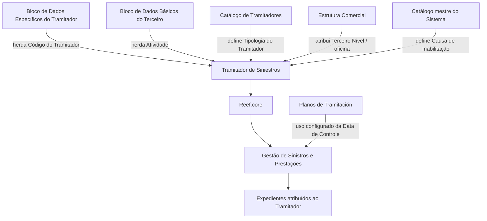

# Criação de Informação Específica do Tramitador de Sinistros no Reef.core

## 1. Metadados do Documento
- **Arquivo de Origem:** Não identificado
- **Tipo de Documento:** Especificação Funcional
- **Domínio / Sistema:** Reef.core / Gestão de Sinistros e Prestações / Mapfre
- **Público-Alvo:** Operação, analistas funcionais, administradores de catálogo e equipes de gestão de sinistros
- **Data/Versão Identificada:** Não identificada

---

## 2. Resumo Executivo & Contexto de Negócio

O documento descreve a criação e a captura de informações específicas do **Tramitador de Siniestros** no sistema **Reef.core**. A estrutura existe para identificar e detalhar informações operacionais do tramitador, permitindo que essas informações sejam utilizadas pelos processos da entidade seguradora que necessitem desses dados.

A ação habilitada indicada é **CREAR**, isto é, criação. Os atributos devem ser capturados na sequência apresentada, da esquerda para a direita e de cima para baixo. Quando não houver indicação expressa em contrário, os atributos são aplicáveis tanto a pessoas físicas quanto a pessoas jurídicas.

A estrutura reúne atributos de identificação, relacionamento organizacional, atividade, tipologia, estado operacional, capacidade de atendimento de expedientes e permissões funcionais. Parte dos dados é herdada de outros blocos de informação, incluindo o **Bloco de Dados Específicos do Tramitador** e o **Bloco de Dados Básicos do Terceiro**.

A configuração do tramitador influencia diretamente a operação de sinistros. Em especial, os campos de inabilitação, causa de inabilitação, exibição de perguntas sobre consequências, quantidade de expedientes atribuídos, limite máximo de expedientes e permissão para modificar a data de controle regulam como o tramitador pode ser utilizado nos processos operacionais da entidade seguradora.

---

## 3. Arquitetura, Componentes & Tecnologias Envolvidas

Os componentes e elementos explicitamente citados são:

| Componente / Entidade | Papel descrito |
| :--- | :--- |
| **Reef.core** | Sistema no qual são configurados tipos possíveis de tipologia do tramitador e estados possíveis do tramitador; também altera o comportamento de visualização de consequências em sinistros. |
| **Tramitador de Siniestros** | Entidade operacional responsável pela gestão de expedientes de sinistros e prestações. |
| **Bloco de Dados Específicos do Tramitador** | Origem herdada do código do tramitador. |
| **Bloco de Dados Básicos do Terceiro** | Origem herdada do código de atividade do terceiro para os tramitadores. |
| **Catálogo de Tramitadores** | Fonte da propriedade de tipologia do tramitador. |
| **Estrutura Comercial** | Estrutura que contém o Terceiro Nível, correspondente à oficina à qual o tramitador está atribuído. |
| **Catálogo mestre do Sistema** | Fonte da causa de inabilitação quando o tramitador estiver inabilitado. |
| **Planos de Tramitación** | Contexto em que a data de controle pode ser utilizada, desde que a companhia tenha definido seu uso. |
| **Processo de Gestão de Sinistros e Prestações** | Processo operacional apoiado pela configuração de perguntas associadas às consequências. |



> **Nota de Análise:** O documento menciona o Reef.core, mas não detalha arquitetura de implantação, APIs, protocolos de integração, métodos HTTP, contratos JSON, bancos de dados, URLs ou ambientes técnicos.

---

## 4. Regras de Negócio, Especificações Funcionais & Processos

### 4.1 Objetivo da estrutura de informação

A captura das informações na estrutura do tramitador atende à necessidade de identificar e detalhar informações de âmbito operacional do **Tramitador de Siniestros**. Essas informações podem ser utilizadas nos processos da entidade seguradora que demandem esses dados.

### 4.2 Ação habilitada

A ação habilitada no documento é:

- **CREAR**

> **Nota de Análise:** O documento não descreve ações de alteração, exclusão, consulta, aprovação ou workflow de criação.

### 4.3 Sequência de captura

A captura dos campos do bloco **Dados Tramitador** segue a sequência visual:

1. Da esquerda para a direita.
2. De cima para baixo.

Quando não houver especificação ou indicação expressa, os atributos devem ser utilizados tanto para:

- Pessoas físicas.
- Pessoas jurídicas.

### 4.4 Regras por atributo

#### Código do Tramitador

- O código do tramitador é proveniente e herdado do **Bloco de Dados Específicos do Tramitador**.
- O código identifica o tramitador no sistema.

#### Código de Usuário do Tramitador

- O campo contém o código de usuário com o qual o tramitador se identificará ao conectar-se ao sistema.

#### Atividade

- O valor da atividade é herdado do **Bloco de Dados Básicos do Terceiro**.
- A atividade identifica o código de atividade do terceiro para os tramitadores.

#### Tipologia do Tramitador

- A tipologia é uma propriedade do **Catálogo de Tramitadores**.
- A tipologia do tramitador deve corresponder a um dos tipos possíveis configurados no **Reef.core**.

#### Terceiro Nível

- O Terceiro Nível corresponde ao código do Terceiro Nível da Estrutura Comercial.
- O Terceiro Nível representa a oficina à qual o tramitador está atribuído.

#### Código do Supervisor

- O campo contém o código do supervisor atribuído ao tramitador.

#### Estado do Tramitador

- O campo registra o estado em que o tramitador se encontra na data de captura das informações.
- O estado deve ser um dos estados possíveis configurados no **Reef.core**.

#### Inabilitação

- O campo informa ao sistema que o Tramitador de Siniestros está inabilitado.
- A partir do momento da inabilitação, o tramitador não deve ser empregado, contemplado ou considerado nos processos operacionais da entidade.

#### Causa de Inabilitação

- Caso o tramitador esteja inabilitado, esse campo deve conter o código de uma causa de inabilitação.
- A causa deve estar definida no catálogo mestre do sistema.

#### Pergunta Consequências

- A ativação do campo altera o comportamento do **Reef.core**.
- Para os sinistros atribuídos ao tramitador, o sistema passa a exibir possíveis perguntas associadas às consequências, em vez de apresentar as descrições das consequências.
- A ativação pode atuar como facilitador e guia para a tomada de decisão no Processo de Gestão de Sinistros e Prestações, de acordo com a expertise do tramitador.

#### Número de Expedientes Atribuídos

- O campo apresenta o número de expedientes pendentes atribuídos ao tramitador.
- O conteúdo é atualizado e modificado sempre que um expediente for:
  - Aberto;
  - Finalizado;
  - Atribuído;
  - Reatribuído.
- A atualização considera os critérios de atribuição de sinistros/expedientes configurados no sistema para os tramitadores.
- Na captura inicial do tramitador, o campo não apresentará informação.

#### Número Máximo de Expedientes Atribuídos

- O campo identifica a quantidade máxima de expedientes ativos e pendentes que o tramitador poderá gerenciar simultaneamente.

#### Modifica Data de Controle

- O campo identifica se o tramitador possui capacidade para modificar a data de controle durante a gestão de sinistros/expedientes.
- Essa capacidade depende de a companhia ter indicado que os Planos de Tramitación trabalharão com a Data de Controle.

---

## 5. Tabelas de Parâmetros, Ambientes e Estruturas de Dados

| Item / Parâmetro | Descrição / Função | Tipo / Valores / Formato | Ambiente / Observações |
| :--- | :--- | :--- | :--- |
| Ação habilitada | Permite a criação da informação específica do tramitador. | `CREAR` | Outras ações não são detalhadas. |
| Código do Tramitador | Identifica o código do tramitador no sistema. | Código | Herdado do Bloco de Dados Específicos do Tramitador. |
| Código de Usuário do Tramitador | Código de usuário utilizado pelo tramitador para identificar-se ao conectar-se ao sistema. | Código de usuário | O formato não é informado. |
| Atividade | Identifica o código de atividade do terceiro para os tramitadores. | Código de atividade | Herdado do Bloco de Dados Básicos do Terceiro. |
| Tipologia do Tramitador | Indica a tipologia do tramitador. | Um dos tipos configurados no Reef.core | Propriedade do Catálogo de Tramitadores. |
| Terceiro Nível | Indica o código da oficina na Estrutura Comercial. | Código | Representa a atribuição organizacional do tramitador. |
| Código do Supervisor | Identifica o supervisor atribuído ao tramitador. | Código | O formato e a origem do código não são detalhados. |
| Estado do Tramitador | Registra o estado do tramitador na data da captura. | Um dos estados configurados no Reef.core | Estados permitidos não são enumerados. |
| Inabilitação | Informa que o tramitador está inabilitado no sistema. | Campo de ativação, valores não detalhados | O tramitador não deve ser empregado, contemplado ou considerado operacionalmente após a inabilitação. |
| Causa de Inabilitação | Identifica o motivo da inabilitação. | Código de causa | Aplicável quando o tramitador estiver inabilitado; definido no catálogo mestre do sistema. |
| Pergunta Consequências | Define a exibição de perguntas associadas às consequências em sinistros atribuídos. | Campo de ativação, valores não detalhados | No Reef.core, substitui a apresentação das descrições das consequências. |
| Número de Expedientes Atribuídos | Mostra a quantidade de expedientes pendentes atribuídos ao tramitador. | Número | Atualizado em abertura, finalização, atribuição ou reatribuição; sem informação na captura inicial. |
| Número Máximo de Expedientes Atribuídos | Define o máximo de expedientes ativos e pendentes que o tramitador pode gerenciar simultaneamente. | Número | Limite de capacidade operacional do tramitador. |
| Modifica Data de Controle | Indica se o tramitador pode alterar a data de controle na gestão de sinistros/expedientes. | Campo de habilitação, valores não detalhados | Depende de configuração da companhia para uso da Data de Controle nos Planos de Tramitación. |

---

## 6. Bateria de Perguntas & Respostas para RAG (FAQ Sintético)

### P1: Qual é o objetivo da estrutura de informações específicas do Tramitador de Siniestros?
**R:** A estrutura tem como objetivo identificar e detalhar informações operacionais do Tramitador de Siniestros para que essas informações possam ser utilizadas pelos processos da entidade seguradora que demandem esses dados.

### P2: Qual ação está habilitada no documento de criação de informações do tramitador?
**R:** O documento indica exclusivamente a ação habilitada `CREAR`. Não há detalhamento de ações de alteração, exclusão, consulta ou aprovação.

### P3: De onde vem o Código do Tramitador?
**R:** O Código do Tramitador é proveniente e herdado do Bloco de Dados Específicos do Tramitador. Esse código identifica o tramitador no sistema.

### P4: Como o Código de Usuário do Tramitador é utilizado?
**R:** O Código de Usuário do Tramitador contém o código com o qual o tramitador se identifica ao conectar-se ao sistema. O documento não informa o formato, a política de autenticação ou a origem desse código.

### P5: Qual é a origem do campo Atividade do tramitador?
**R:** O campo Atividade é herdado do Bloco de Dados Básicos do Terceiro e identifica o código de atividade do terceiro para os tramitadores.

### P6: Quais restrições existem para a Tipologia e o Estado do Tramitador?
**R:** A Tipologia do Tramitador deve ser um dos tipos configurados para o Reef.core, e o Estado do Tramitador deve ser um dos estados configurados no Reef.core. O documento não lista os tipos ou estados permitidos.

### P7: O que ocorre quando um Tramitador de Siniestros é inabilitado?
**R:** A inabilitação informa ao sistema que o Tramitador de Siniestros está inabilitado. A partir do momento da inabilitação, o tramitador não deve ser empregado, contemplado ou considerado nos processos operacionais da entidade. Quando estiver inabilitado, deve ser informado o código de uma causa de inabilitação definida no catálogo mestre do sistema.

### P8: Qual comportamento é ativado pelo campo Pergunta Consequências?
**R:** A ativação de Pergunta Consequências modifica o comportamento do Reef.core para que, nos sinistros atribuídos ao tramitador, sejam visualizadas possíveis perguntas associadas às consequências em vez das descrições das consequências. Essa configuração pode servir como facilitador e guia na tomada de decisões do Processo de Gestão de Sinistros e Prestações.

### P9: Quando o Número de Expedientes Atribuídos é atualizado?
**R:** O Número de Expedientes Atribuídos é atualizado e modificado sempre que um expediente é aberto, finalizado, atribuído ou reatribuído. A atualização segue os critérios de atribuição de sinistros/expedientes configurados no sistema para os tramitadores.

### P10: O que é mostrado no Número de Expedientes Atribuídos durante a criação inicial do tramitador?
**R:** Na captura inicial do tramitador, o campo Número de Expedientes Atribuídos não apresenta nenhuma informação.

### P11: Qual é a função do Número Máximo de Expedientes Atribuídos?
**R:** O Número Máximo de Expedientes Atribuídos define a quantidade máxima de expedientes ativos e pendentes que o tramitador poderá gerenciar ao mesmo tempo.

### P12: Em que condição um tramitador pode modificar a Data de Controle?
**R:** O tramitador pode modificar a Data de Controle caso o campo Modifica Data de Controle indique que ele possui essa capacidade e caso tenha sido indicado, no nível da companhia, que os Planos de Tramitación trabalharão com a Data de Controle.

---

## 7. Glossário de Termos, Siglas & Conceitos-Chave

- **Reef.core:** Sistema citado como responsável pela configuração dos tipos possíveis de tipologia e estados do tramitador, além do comportamento relacionado às perguntas de consequências.
- **Tramitador de Siniestros:** Entidade responsável pela gestão de expedientes de sinistros e prestações.
- **Expediente:** Registro de sinistro ou processo operacional atribuído a um tramitador, com status pendente, ativo, aberto, finalizado, atribuído ou reatribuído conforme o contexto do documento.
- **Catálogo de Tramitadores:** Catálogo que apresenta a propriedade de Tipologia do Tramitador.
- **Estrutura Comercial:** Estrutura organizacional que contém o Terceiro Nível, identificado no documento como oficina.
- **Terceiro Nível:** Código da Estrutura Comercial, correspondente à oficina à qual o tramitador está atribuído.
- **Catálogo mestre do Sistema:** Catálogo que define as causas de inabilitação.
- **Pergunta Consequências:** Campo cuja ativação faz o Reef.core apresentar possíveis perguntas associadas às consequências, em substituição às descrições dessas consequências.
- **Data de Controle:** Data usada na gestão de sinistros/expedientes quando os Planos de Tramitación estiverem configurados para trabalhar com ela.
- **Planos de Tramitación:** Planos mencionados como configuração de companhia relacionada ao uso da Data de Controle.
- **Bloco de Dados Específicos do Tramitador:** Origem do Código do Tramitador.
- **Bloco de Dados Básicos do Terceiro:** Origem do campo Atividade.

---

## 8. Notas Críticas, Riscos & Limitações

- O documento não identifica nome do arquivo, data, versão, autor técnico, ambiente, URL, servidor ou rota de logs.
- Os valores permitidos para Tipologia do Tramitador e Estado do Tramitador não são enumerados; apenas é informado que devem estar configurados no Reef.core.
- Não são detalhados os formatos, tamanhos, obrigatoriedade, valores padrão ou regras de validação de campos.
- O documento usa marcações entre parênteses em diversos campos, mas não define explicitamente o significado dessas marcações.
- Não há contratos de integração, APIs, eventos, endpoints, métodos HTTP, estruturas JSON ou detalhes de persistência.
- Não há descrição de como o sistema bloqueia tecnicamente o uso de um tramitador inabilitado; existe apenas a regra operacional de que ele não deve ser empregado, contemplado ou considerado.
- O campo Número de Expedientes Atribuídos depende dos critérios de atribuição configurados no sistema para os tramitadores, mas tais critérios não são apresentados.
- A alteração da Data de Controle depende de uma configuração no nível da companhia e dos Planos de Tramitación, sem detalhamento de onde essa configuração é mantida.
- O trecho final contém duas ocorrências de “Consejo:” sem conteúdo adicional associado.

---

## 9. Conteúdo Bruto Estruturado (Referência Fiel)

```text
--- [PÁGINA 1 DE 2] ---

CREAR Información especíca del Tramitador
Objetivo
La captura de la información en esta Estructura obedece a la necesidad de identicar y detallar la información de ámbito operativo del
Tramitador de Siniestros para poder utilizarla en los procesos de la entidad Aseguradora que así lo demanden.
Acciones habilitadas
 CREAR ( )
Datos Tramitador
De Izquierda a Derecha y de Arriba hacia Abajo, los siguientes atributos marcan la secuencia de captura de los Campos en este Bloque de
Información.
Si no se especica o indica expresamente, los Atributos se emplearán tanto en Personas Físicas como en Personas Jurídicas.
Código del Tramitador
Este dato procede y se hereda del 'Bloque de Datos Especícos del Tramitador' e identica su código en el Sistema.
Código de Usuario del Tramitador (  )
Este campo del bloque de información contiene el código del usuario con el que el Tramitador se va a identicar al conectarse al sistema.
Actividad
El valor de este dato se hereda del Bloque de Datos Básicos del Tercero e identica el código de Actividad del Tercero para los Tramitadores.
Tipología del Tramitador (  )
Documentation / DOCUMENTACIÓN Reef
DOCUMENTACIÓN Reef
Mapfredocument
DOCUMENTACIÓN Reef
Owner
user:agonzalez_mapfre.com
Lifecycle
Approved Source
 / 
 VL
Buscar Inicio Soluciones Arquitecturas APIs Componentes Cloud Documentación Zeus Reef Ayuda
ES


--- [PÁGINA 2 DE 2] ---

Esta propiedad del Catálogo de Tramitadores muestra la Tipología del mismo, tipología que tiene que tener uno de los posibles tipos
congurados para Reef.core.
Tercer Nivel (  )
Este dato es el código del Tercer Nivel de la Estructura Comercial (ocina) al que está asignado el Tramitador.
Código del Supervisor (  )
Este dato contiene el código del Supervisor que tendrá asignado el Tramitador.
Estado del Tramitador (  )
Este campo registra el estado en el que se encuentra el Tramitador a la fecha de captura de su información, estado que tiene que tener uno
de los posibles estados congurados en Reef.core.
Inhabilitación ( )
Este Campo le indica al Sistema que el Tramitador de Siniestros está inhabilitado en el Sistema por lo que a partir del momento de su
inhabilitación no debería ser empleado, contemplado o considerado en los procesos operativos de la entidad.
Causa de Inhabilitación (  )
En el supuesto que el Tramitador estuviera Inhabilitado, este campo va a contener el código de una causa de Inhabilitación denida en el
catálogo maestro del Sistema.
Pregunta Consecuencias? ( )
La activación de este campo hace que el comportamiento de Reef.core varíe para que en los siniestros que tenga asignados el Tramitador se
visualicen las posibles preguntas asociadas a las consecuencias en vez de mostrar las descripciones de las mismas.
De acuerdo con la expertise del Tramitador en la gestión de los expedientes de siniestros, la activación de este campo le puede servir de
facilitador y guía en la toma de decisiones del Proceso de Gestión de Siniestros y Prestaciones.
Número de Expedientes Asignados
Este dato muestra el número de expedientes pendientes que tiene asignado un Tramitador, sabiendo que cada vez que se abre, se termina, se
asigna o se reasigna un expediente, se actualiza y modica su contenido (Todo ello de acuerdo con los criterios de asignación de
siniestros/expedientes que se hayan considerado y congurado en el sistema para los tramitadores).
En la captura inicial del tramitador este dato no mostrará información alguna.
Número Máximo de Expedientes Asignados ( )
Este campo identica el número máximo de expedientes activos y pendientes que podrá tener gestionando el tramitador al mismo tiempo.
Modica Fecha de Control ( )
Este campo identica si el Tramitador está o no capacitado para modicar la fecha de control en la gestión de los siniestros/expedientes
(siempre y cuando se haya indicado a nivel de compañía que en los Planes de Tramitación se vaya a trabajar con la Fecha de Control).
Consejo:
Consejo:
```
