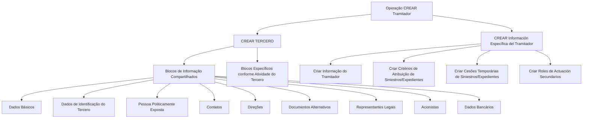

# Operação Criar Tramitador — Captura de Informações e Blocos de Cadastro

## 1. Metadados do Documento
- **Arquivo de Origem:** Não informado; conteúdo bruto extraído de documento corporativo Reef/Mapfre.
- **Tipo de Documento:** Procedimento funcional.
- **Domínio / Sistema:** Reef / Mapfre — operação de cadastro de Tramitadores de Siniestros.
- **Público-Alvo:** Usuários do sistema, analistas funcionais e equipes de operação.
- **Data/Versão Identificada:** Não identificada.

---

## 2. Resumo Executivo & Contexto de Negócio

O documento descreve a operação **CREAR Tramitador**, destinada a capturar as informações de **Tramitadores de Siniestros**. O processo envolve a criação de um terceiro e, posteriormente, o preenchimento de informações específicas relacionadas ao papel de tramitador.

A operação utiliza blocos de informação compartilhados no cadastro de terceiros, incluindo dados básicos, identificação, contatos, endereços e representantes legais. Também existem blocos específicos conforme a atividade do terceiro e informações próprias do tramitador.

A obrigatoriedade e a habilitação dos campos podem variar conforme o código de atividade do terceiro. Essas condições também podem variar quando o terceiro é uma pessoa física ou uma pessoa jurídica.

O documento informa que modificações implementadas localmente podem alterar o comportamento da aplicação quanto à obrigatoriedade do registro de dados do terceiro. Além disso, a ordem de captura de dados nos blocos de informação pode variar de acordo com o critério adotado pelo usuário no sistema.

---

## 3. Arquitetura, Componentes & Tecnologias Envolvidas

Os componentes funcionais identificados no documento são:

- Operação **CREAR Tramitador**.
- Processo de **CREAR TERCERO**.
- Blocos de informação compartilhados para cadastro de terceiros.
- Blocos de informação específicos conforme a atividade do terceiro.
- Processo de criação de informação específica do tramitador.
- Criação de critérios de atribuição de sinistros/processos.
- Criação de cessões temporárias de sinistros/processos.
- Criação de papéis de atuação secundários.
- Portal de documentação **Reef / Mapfredocument**.



**Nota de Análise:** O documento não detalha tecnologias de implementação, APIs, métodos HTTP, contratos JSON, infraestrutura, ambientes técnicos ou integrações entre sistemas.

---

## 4. Regras de Negócio, Especificações Funcionais & Processos

### 4.1 Finalidade da operação

A operação **CREAR Tramitador** permite capturar informações relativas a **Tramitadores de Siniestros**.

### 4.2 Premissas para captura de dados

1. A obrigatoriedade e/ou habilitação dos campos registrados em cada bloco ou estrutura de informação compartilhada pode variar de acordo com o **código de atividade do Tercero**.
2. A obrigatoriedade e/ou habilitação dos campos dos blocos ou estruturas de informação pode variar conforme o tipo de Tercero:
   - **Persona Física**;
   - **Persona Jurídica**.
3. Modificações implementadas localmente podem afetar o comportamento da aplicação em relação à obrigatoriedade no registro dos **Datos del Tercero**.
4. A sequência de captura de dados nos diversos blocos de informação pode variar de acordo com o critério seguido pelo usuário no sistema.

### 4.3 Processo funcional identificado

1. Executar o processo **CREAR TERCERO**.
2. Registrar os blocos de informação compartilhados aplicáveis ao terceiro.
3. Registrar blocos de informação específicos segundo a atividade do terceiro.
4. Executar o processo **CREAR INFORMACIÓN ESPECÍFICA DEL TRAMITADOR**.
5. Criar a informação do tramitador.
6. Criar critérios de atribuição de sinistros/processos, quando aplicável.
7. Criar cessões temporárias de sinistros/processos, quando aplicável.
8. Criar papéis de atuação secundários, quando aplicável.

**Nota de Análise:** O documento apresenta os blocos e etapas, porém não detalha campos obrigatórios por atividade, regras de validação, valores aceitos, telas, mensagens de erro ou critérios para determinar quando cada bloco específico deve ser preenchido.

---

## 5. Tabelas de Parâmetros, Ambientes e Estruturas de Dados

| Item / Parâmetro | Descrição / Função | Tipo / Valores / Formato | Ambiente / Observações |
| :--- | :--- | :--- | :--- |
| Operação CREAR Tramitador | Permite capturar informações dos Tramitadores de Siniestros. | Operação funcional. | Domínio Reef / Mapfre. |
| Código de atividade do Tercero | Pode alterar a obrigatoriedade e/ou habilitação de campos nos blocos compartilhados. | Código de atividade; valores não detalhados. | Regra funcional. |
| Tipo de Tercero | Pode alterar a obrigatoriedade e/ou habilitação de campos. | Persona Física ou Persona Jurídica. | Regra funcional. |
| Modificações locais | Podem afetar o comportamento da aplicação relativo à obrigatoriedade de dados do terceiro. | Não detalhado. | Dependência de configuração ou implementação local não especificada. |
| Ordem de captura | Pode variar conforme o critério seguido pelo usuário no sistema. | Sequência operacional. | Não há ordem obrigatória detalhada. |
| Datos Básicos | Bloco de informação compartilhado do processo CREAR TERCERO. | Bloco de cadastro. | Campos não detalhados. |
| Datos Identificación del Tercero | Bloco de identificação do terceiro. | Bloco de cadastro. | Campos não detalhados. |
| Persona Políticamente Expuesta | Bloco de informação compartilhado. | Bloco de cadastro. | Critérios e campos não detalhados. |
| Contactos | Bloco de informação compartilhado. | Bloco de cadastro. | Campos não detalhados. |
| Direcciones | Bloco de informação compartilhado. | Bloco de cadastro. | Campos não detalhados. |
| Documentos Alternativos | Bloco de informação compartilhado. | Bloco de cadastro. | Campos não detalhados. |
| Representantes Legales | Bloco de informação compartilhado. | Bloco de cadastro. | Campos não detalhados. |
| Accionistas | Bloco de informação compartilhado. | Bloco de cadastro. | Campos não detalhados. |
| Datos Bancarios | Bloco de informação compartilhado. | Bloco de cadastro. | Campos não detalhados. |
| Blocos específicos conforme atividade | Blocos aplicáveis de acordo com a atividade do terceiro. | Blocos funcionais; conteúdo não detalhado. | Dependem da atividade do Tercero. |
| Crear Información del Tramitador | Registra informação específica do tramitador. | Processo funcional. | Campos não detalhados. |
| Crear Criterios de Asignación | Cria critérios para atribuição de sinistros/processos. | Processo funcional. | Critérios não detalhados. |
| Crear Cesiones Temporales | Cria cessões temporárias de sinistros/processos. | Processo funcional. | Regras e duração não detalhadas. |
| Crear Roles de Actuación Secundarios | Cria papéis secundários de atuação. | Processo funcional. | Papéis possíveis não detalhados. |
| Owner | Proprietário exibido na documentação. | `user:agonzalez_mapfre.com` | Texto extraído da página 1. |
| Lifecycle | Estado do ciclo de vida exibido. | `Approved Source` | Texto extraído da página 1. |
| Navegação do portal | Menus exibidos no portal de documentação. | Buscar, Inicio, Soluciones, Arquitecturas, APIs, Componentes, Cloud, Documentación, Zeus, Reef, Ayuda. | Não são parâmetros da operação. |

---

## 6. Bateria de Perguntas & Respostas para RAG (FAQ Sintético)

### P1: Qual é a finalidade da operação CREAR Tramitador?
**R:** A operação CREAR Tramitador permite capturar as informações dos Tramitadores de Siniestros.

### P2: Qual processo deve ser executado para cadastrar as informações compartilhadas do tramitador?
**R:** O documento indica o processo CREAR TERCERO para registrar os blocos de informação compartilhados associados ao terceiro.

### P3: Quais fatores podem alterar a obrigatoriedade ou a habilitação dos campos do terceiro?
**R:** A obrigatoriedade e/ou habilitação dos campos pode variar conforme o código de atividade do Tercero, conforme o tipo de Tercero — Persona Física ou Persona Jurídica — e conforme modificações implementadas localmente.

### P4: As modificações locais podem influenciar o comportamento da aplicação?
**R:** Sim. O documento informa que modificações implementadas localmente podem afetar o comportamento da aplicação quanto à obrigatoriedade no registro dos Datos del Tercero.

### P5: A ordem de preenchimento dos blocos de informação é fixa?
**R:** Não necessariamente. O documento indica que a ordem de captura dos dados nos diferentes blocos de informação pode variar segundo o critério seguido pelo usuário no sistema.

### P6: Quais blocos de informação compartilhados são citados para CREAR TERCERO?
**R:** O documento cita Datos Básicos, Datos Identificación del Tercero, Persona Políticamente Expuesta, Contactos, Direcciones, Documentos Alternativos, Representantes Legales, Accionistas e Datos Bancarios.

### P7: O que são os blocos de informação específicos de acordo com a atividade do terceiro?
**R:** São blocos de informação mencionados como aplicáveis conforme a atividade do Tercero. O documento não especifica quais blocos existem, quais atividades os acionam ou quais campos contêm.

### P8: Quais ações fazem parte da criação de informação específica do tramitador?
**R:** A criação de informação específica do tramitador inclui criar a informação do tramitador, criar critérios de atribuição de sinistros/processos, criar cessões temporárias de sinistros/processos e criar papéis de atuação secundários.

### P9: O documento define os campos da informação específica do tramitador?
**R:** Não. O documento lista a ação “Crear Información del Tramitador”, mas não descreve os campos, formatos, validações ou obrigatoriedades dessa informação.

### P10: O documento detalha os critérios de atribuição de sinistros/processos?
**R:** Não. O documento menciona “Crear Criterios de Asignación de Siniestros/Expedientes”, mas não apresenta critérios, regras de prioridade, dados de entrada ou resultados esperados.

### P11: O documento informa como funcionam as cessões temporárias de sinistros/processos?
**R:** Não. O documento cita a criação de cessões temporárias de sinistros/processos, mas não detalha duração, condições, responsáveis ou regras de reversão.

### P12: Quais tecnologias, APIs ou contratos técnicos são definidos para a operação CREAR Tramitador?
**R:** O conteúdo fornecido não define tecnologias, APIs, endpoints, métodos HTTP, contratos JSON, versões, portas ou ambientes técnicos para a operação CREAR Tramitador.

---

## 7. Glossário de Termos, Siglas & Conceitos-Chave

- **CREAR Tramitador:** Operação destinada à captura de informações de Tramitadores de Siniestros.
- **CREAR TERCERO:** Processo de criação do terceiro e de preenchimento de blocos de informação compartilhados.
- **Tercero:** Entidade cadastrada no sistema, que pode ser Persona Física ou Persona Jurídica.
- **Tramitador:** Entidade para a qual são capturadas informações relacionadas a Siniestros.
- **Siniestros:** Termo utilizado no documento em relação à atribuição e cessão de expedientes.
- **Expedientes:** Termo citado em conjunto com Siniestros nas operações de atribuição e cessão temporária.
- **Persona Física:** Tipo de Tercero mencionado no documento.
- **Persona Jurídica:** Tipo de Tercero mencionado no documento.
- **Persona Políticamente Expuesta:** Bloco de informação compartilhado no processo CREAR TERCERO.
- **Criterios de Asignación:** Critérios de atribuição de Siniestros/Expedientes; o conteúdo dos critérios não é detalhado.
- **Cesiones Temporales:** Cessões temporárias de Siniestros/Expedientes; regras não detalhadas.
- **Roles de Actuación Secundarios:** Papéis secundários de atuação; tipos e permissões não detalhados.
- **Reef:** Nome presente na documentação e nos menus do portal.
- **Mapfredocument:** Nome apresentado no cabeçalho do conteúdo extraído.

---

## 8. Notas Críticas, Riscos & Limitações

- O documento não informa o nome do arquivo de origem, data, versão ou autoria formal além do campo `Owner`.
- Não há detalhamento de campos, formatos, valores permitidos, validações ou mensagens de erro para os blocos de informação.
- Não são definidos critérios objetivos para classificar o código de atividade do Tercero ou determinar os blocos específicos aplicáveis.
- O documento menciona modificações locais que podem alterar obrigatoriedades, mas não identifica as configurações, responsáveis, localidades ou mecanismos dessas modificações.
- Não há especificação de tecnologias, integrações, APIs, endpoints, segurança, permissões, logs ou ambientes.
- A expressão `Checking links...` consta no material extraído, sem contexto suficiente para determinar seu significado funcional ou técnico.
- A extração contém caracteres possivelmente corrompidos em palavras como `modicaciones`, `Especícos` e `Identicación`; eles foram preservados no conteúdo bruto para fidelidade de auditoria.

---

## 9. Conteúdo Bruto Estruturado (Referência Fiel)

```text
--- [PÁGINA 1 DE 2] ---

OPERACIÓN CREAR Tramitador
¿En que consiste?
Esta operación permite capturar la Información de los Tramitadores de Siniestros.
Premisas
La obligatoriedad y/o la habilitación de los campos en el registro de los datos de cada uno de los bloques o estructuras de información
compartidas puede variar de acuerdo con el código de actividad del Tercero:
La obligatoriedad y/o la habilitación de los campos en el registro de los datos de cada uno de los bloques o estructuras de información
pueden variar si el tipo de Tercero es una Persona Física o una Persona Jurídica:
Las modicaciones que se hubieran podido implementar localmente a su vez pueden afectar el comportamiento de la aplicación en
relación con la obligatoriedad en el registro de los Datos del Tercero.
Por último, el orden de captura de los datos en los distintos bloques de Información puede variar de acuerdo con el criterio seguido por el
Usuario en el Sistema.
Proceso
CREAR
TERCERO
CREAR Información
Específica del Tramitador
Bloques de Información Compartidos (CREAR TERCERO)
 Datos Básicos ( )
 Datos Identicación del Tercero ( )
 Persona Políticamente Expuesta ( )
 Contactos ( )
 Direcciones ( )
 Documentos Alternativos ( )
 Representantes Legales ( )
Ejemplo:
Ejemplo:
Documentation / DOCUMENTACIÓN Reef
DOCUMENTACIÓN Reef
Mapfredocument
DOCUMENTACIÓN Reef
Owner
user:agonzalez_mapfre.com
Lifecycle
Approved Source
 / 
 VL
Buscar Inicio Soluciones Arquitecturas APIs Componentes Cloud Documentación Zeus Reef Ayuda
ES


--- [PÁGINA 2 DE 2] ---

Accionistas ( )
 Datos Bancarios ( )
Bloques de Información Especícos de acuerdo con la Actividad del Tercero.
CREAR INFORMACIÓN
ESPECÍFICA DEL TRAMITADOR
Crear Información
del Tramitador
Crear Criterios de Asignación
de Siniestros/Expedientes
Crear Cesiones Temporales de
Siniestros/Expedientes
Crear Roles de
Actuación Secundarios
 Crear Información del Tramitador ( )
 Crear Criterios de Asignación ( )
 Crear Cesiones Temporales de Siniestros/Expedientes ( )
 Crear roles de Actuación Secundarios ( )
Checking links...
```
