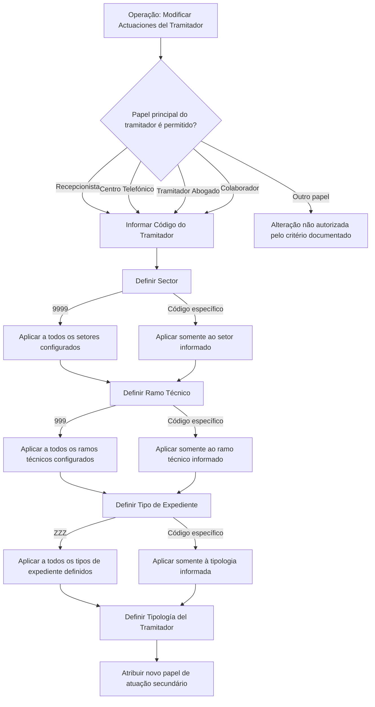

# Modificar Actuaciones del Tramitador — DOCUMENTACIÓN Reef

## 1. Metadados do Documento
- **Arquivo de Origem:** Não identificado no conteúdo fornecido
- **Tipo de Documento:** Especificação Técnica / Procedimento Funcional
- **Domínio / Sistema:** Reef / Mapfre — gestão de sinistros e atuações de tramitadores
- **Público-Alvo:** Desenvolvedores, analistas funcionais, operação e administradores do sistema
- **Data/Versão Identificada:** Não identificada

---

## 2. Resumo Executivo & Contexto de Negócio

O documento descreve a operação **“Modificar Actuaciones del Tramitador”**, destinada a alterar os papéis de atuação secundários previamente atribuídos a um **Tramitador de Siniestros**. A operação é aplicável somente quando a tipologia ou papel de atuação principal do tramitador pertence a um conjunto explicitamente permitido.

Os papéis principais habilitados para essa alteração são: **Recepcionista**, **Centro Telefónico**, **Tramitador Abogado** e **Colaborador**. O documento lista as ações **CRIAR** e **MODIFICAR**, mas não detalha o comportamento operacional, permissões ou pré-condições específicas para cada uma dessas ações.

A configuração da alteração é segmentada por critérios da estrutura de produtos da companhia: **Sector**, **Ramo Técnico** e **Tipo de Expediente**. Cada critério dispõe de um código genérico que permite aplicar a mudança a todos os valores configurados no sistema ou, alternativamente, de um código específico para restringir a alteração a um setor, ramo técnico ou tipo de expediente determinado.

O campo **Tipología del Tramitador** determina o novo papel de atuação — ou papel de atuação secundário — que será atribuído ao tramitador. O conteúdo fornecido não especifica valores válidos para esse campo, nem descreve contratos técnicos, telas, serviços, métodos HTTP, persistência ou mecanismos de auditoria.

---

## 3. Arquitetura, Componentes & Tecnologias Envolvidas

### Componentes e elementos identificados

| Componente / Elemento | Descrição baseada no documento |
| :--- | :--- |
| Reef | Contexto documental identificado como “DOCUMENTACIÓN Reef”. |
| Mapfredocument | Elemento exibido na navegação/cabeçalho do conteúdo. Não há detalhamento funcional. |
| Tramitador de Siniestros | Entidade cujo papel de atuação secundário pode ser alterado. |
| Sistema | Repositório lógico de setores, ramos técnicos e tipos de expediente configurados. O documento não detalha sua implementação. |
| Estructura de Productos de la Compañía | Estrutura da companhia usada para identificar setores e ramos técnicos. |
| Papel de atuação principal | Papel já associado ao tramitador e usado como condição de elegibilidade para alteração. |
| Papel de atuação secundário | Novo papel de atuação atribuído ao tramitador pela operação. |
| Tipo de Expediente | Classificação de expediente/sinistro, incluindo exemplos DPM, RC e DAP. |



---

## 4. Regras de Negócio, Especificações Funcionais & Processos

### 4.1 Objetivo da operação

A operação permite modificar os papéis de atuação secundários atribuídos previamente ao **Tramitador de Siniestros**.

### 4.2 Condição de elegibilidade

A alteração é permitida desde que a tipologia ou papel de atuação principal do tramitador seja um dos seguintes:

1. **Recepcionista**
2. **Centro Telefónico**
3. **Tramitador Abogado**
4. **Colaborador**

> **Nota de Análise:** O documento não informa o comportamento da operação quando o tramitador possui outro papel principal, mas estabelece que a modificação somente é permitida para os quatro papéis listados.

### 4.3 Ações habilitadas

O documento lista as ações:

- **CRIAR**
- **MODIFICAR**

> **Nota de Análise:** Não há detalhamento adicional sobre a diferença funcional entre criar e modificar, nem sobre fluxos de aprovação, exclusão, persistência ou validação.

### 4.4 Sequência de visualização ou registro dos campos

O documento informa que os campos do bloco **Actuaciones** seguem a sequência de visualização ou registro da esquerda para a direita e de cima para baixo:

1. Código del Tramitador
2. Sector
3. Ramo Técnico
4. Tipo de Expediente
5. Tipología del Tramitador

### 4.5 Regras para Código del Tramitador

- O **Código del Tramitador** é herdado do bloco **Datos Específicos del tramitador**.
- O código identifica o tramitador no sistema.

### 4.6 Regras para Sector

- O campo **Sector** visualiza ou identifica a chave do setor da **Estructura de Productos de la Compañía**.
- O setor é associado ao papel de atuação principal do tramitador.
- O valor genérico **9999** altera o papel de atuação do tramitador para sinistros de **todos os setores configurados no sistema**.
- Um código de setor específico altera o papel de atuação somente para sinistros daquele setor.

### 4.7 Regras para Ramo Técnico

- O campo **Ramo Técnico** mostra ou identifica a chave do ramo técnico da **Estructura de Productos de la Compañía**.
- O ramo técnico está associado ao papel de atuação secundário do tramitador.
- O valor genérico **999** altera o papel de atuação do tramitador para sinistros de **todos os ramos técnicos configurados no sistema**.
- Um código de ramo técnico específico altera o papel de atuação somente para sinistros daquele ramo técnico.

### 4.8 Regras para Tipo de Expediente

- O campo **Tipo de Expediente** identifica a chave do tipo de expediente sobre o qual é criado o papel de atuação do tramitador.
- O documento fornece como exemplos:
  - **DPM — Daños Materiales Propios**
  - **RC — Responsabilidad Civil**
  - **DAP — Lesionados**
- O valor genérico **ZZZ** altera o papel de atuação do tramitador para sinistros de **todos os tipos de expediente definidos no sistema**.
- Um código específico de tipo de expediente altera o papel de atuação somente para sinistros da tipologia correspondente.

### 4.9 Regras para Tipología del Tramitador

- O campo **Tipología del Tramitador** determina o novo papel de atuação atribuído ao tramitador.
- O novo papel de atuação é também denominado **papel de atuação secundário**.

> **Nota de Análise:** O documento não apresenta a lista de valores aceitos para Tipología del Tramitador, nem as regras de compatibilidade entre tipologia, setor, ramo técnico e tipo de expediente.

---

## 5. Tabelas de Parâmetros, Ambientes e Estruturas de Dados

| Item / Parâmetro | Descrição / Função | Tipo / Valores / Formato | Ambiente / Observações |
| :--- | :--- | :--- | :--- |
| Código del Tramitador | Identifica o código do tramitador no sistema. | Não especificado. | Herdado do bloco Datos Específicos del tramitador. |
| Papel de atuação principal | Critério que determina se a alteração de atuações é permitida. | Recepcionista; Centro Telefónico; Tramitador Abogado; Colaborador. | Somente os valores listados permitem a operação, segundo o documento. |
| Sector | Identifica a chave do setor na Estructura de Productos de la Compañía. | Código específico ou código genérico `9999`. | `9999` aplica a mudança a todos os setores configurados; código específico limita a mudança ao setor correspondente. |
| Ramo Técnico | Identifica a chave do ramo técnico na Estructura de Productos de la Compañía. | Código específico ou código genérico `999`. | `999` aplica a mudança a todos os ramos técnicos configurados; código específico limita a mudança ao ramo correspondente. |
| Tipo de Expediente | Identifica a chave do tipo de expediente relacionado ao papel de atuação do tramitador. | Código específico ou código genérico `ZZZ`; exemplos: DPM, RC, DAP. | `ZZZ` aplica a mudança a todos os tipos de expediente definidos; código específico limita a mudança à tipologia correspondente. |
| Tipología del Tramitador | Determina o novo papel de atuação ou papel de atuação secundário. | Valores não especificados. | O documento não informa catálogo de valores, validações ou compatibilidades. |
| Ação CRIAR | Ação listada como habilitada. | Não especificado. | Sem detalhamento adicional. |
| Ação MODIFICAR | Ação listada como habilitada. | Não especificado. | Sem detalhamento adicional. |
| Sistema | Mantém setores, ramos técnicos e tipos de expediente configurados. | Não especificado. | Não há URL, ambiente, servidor ou tecnologia informados. |

---

## 6. Bateria de Perguntas & Respostas para RAG (FAQ Sintético)

### P1: Qual é o objetivo da operação “Modificar Actuaciones del Tramitador”?
**R:** A operação permite modificar os papéis de atuação secundários previamente atribuídos a um Tramitador de Siniestros. A modificação depende da tipologia ou papel de atuação principal do tramitador.

### P2: Quais papéis principais permitem a modificação das atuações secundárias do tramitador?
**R:** A modificação é permitida quando o papel de atuação principal do tramitador é Recepcionista, Centro Telefónico, Tramitador Abogado ou Colaborador.

### P3: O que representa o Código del Tramitador?
**R:** O Código del Tramitador identifica o código do tramitador no sistema. Esse dado é herdado do bloco Datos Específicos del tramitador.

### P4: O que acontece quando o campo Sector recebe o código 9999?
**R:** O código genérico `9999` faz com que a alteração do papel de atuação do tramitador seja aplicada aos sinistros de todos os setores configurados no sistema.

### P5: Como restringir a alteração de atuação a um único setor?
**R:** Para restringir a alteração a um setor, deve-se utilizar o código de um setor específico existente. Nesse caso, a mudança será aplicada exclusivamente aos sinistros daquele setor.

### P6: Qual é o efeito do código 999 no campo Ramo Técnico?
**R:** O código genérico `999` altera o papel de atuação do tramitador para sinistros de todos os ramos técnicos configurados no sistema.

### P7: Qual é o efeito do código ZZZ no campo Tipo de Expediente?
**R:** O código genérico `ZZZ` altera o papel de atuação do tramitador para sinistros de todos os tipos de expediente definidos no sistema.

### P8: Quais exemplos de tipos de expediente são apresentados?
**R:** O documento apresenta DPM para Daños Materiales Propios, RC para Responsabilidad Civil e DAP para Lesionados.

### P9: Como limitar a alteração a um tipo de expediente específico?
**R:** Deve-se utilizar o código de um tipo de expediente específico. A alteração será aplicada exclusivamente aos sinistros dessa tipologia.

### P10: Qual campo determina o novo papel de atuação secundário do tramitador?
**R:** O campo Tipología del Tramitador determina o novo papel de atuação — também chamado de papel de atuação secundário — que será atribuído ao tramitador.

### P11: O documento especifica quais valores são válidos para Tipología del Tramitador?
**R:** Não. O documento informa a finalidade do campo Tipología del Tramitador, mas não apresenta o catálogo de valores válidos nem regras de compatibilidade.

### P12: O documento descreve APIs, métodos HTTP ou contratos JSON para a operação?
**R:** Não. O conteúdo fornecido não detalha APIs, métodos HTTP, contratos JSON, URLs, tecnologias de implementação, persistência ou rotas de logs.

---

## 7. Glossário de Termos, Siglas & Conceitos-Chave

- **Actuaciones:** Papéis ou atuações atribuídos ao tramitador no contexto de sinistros.
- **Centro Telefónico:** Papel de atuação principal elegível para a operação de modificação.
- **Código del Tramitador:** Código que identifica o tramitador no sistema.
- **Colaborador:** Papel de atuação principal elegível para a operação de modificação.
- **DAP:** Lesionados; exemplo de Tipo de Expediente listado no documento.
- **DPM:** Daños Materiales Propios; exemplo de Tipo de Expediente listado no documento.
- **Estructura de Productos de la Compañía:** Estrutura corporativa usada para identificar setores e ramos técnicos.
- **Papel de atuação principal:** Papel do tramitador usado como condição para permitir a alteração.
- **Papel de atuação secundário:** Novo papel de atuação atribuído ao tramitador pelo campo Tipología del Tramitador.
- **Ramo Técnico:** Chave de ramo técnico da estrutura de produtos da companhia.
- **RC:** Responsabilidad Civil; exemplo de Tipo de Expediente listado no documento.
- **Recepcionista:** Papel de atuação principal elegível para a operação de modificação.
- **Sector:** Chave do setor da estrutura de produtos da companhia.
- **Tipo de Expediente:** Chave que identifica a tipologia do expediente/sinistro.
- **Tipología del Tramitador:** Campo que determina o novo papel de atuação secundário.
- **Tramitador Abogado:** Papel de atuação principal elegível para a operação de modificação.
- **Tramitador de Siniestros:** Tramitador cujas atuações secundárias podem ser alteradas.

---

## 8. Notas Críticas, Riscos & Limitações

- O documento não informa o nome do arquivo de origem, data, versão, autor técnico ou histórico de alterações.
- As ações **CRIAR** e **MODIFICAR** são listadas, mas não possuem descrição funcional detalhada.
- Não há especificação de tecnologias, arquitetura física, microsserviços, banco de dados, APIs, métodos HTTP, contratos JSON, autenticação, autorização, URLs, servidores, ambientes ou rotas de logs.
- Não há lista de valores permitidos para o campo **Tipología del Tramitador**.
- Não há detalhamento sobre validações entre Sector, Ramo Técnico, Tipo de Expediente e Tipología del Tramitador.
- Não há regra explícita para tratar tramitadores cujo papel principal não pertença ao conjunto permitido.
- O texto extraído contém caracteres corrompidos, como `Modicar`, `congurados` e `denidos`; a interpretação foi preservada somente quando o contexto textual tornou o termo inequívoco.
- O trecho final apresenta três ocorrências de **“Consejo:”**, mas não contém o conteúdo dos conselhos.

---

## 9. Conteúdo Bruto Estruturado (Referência Fiel)

```text
--- [PÁGINA 1 DE 2] ---

MODIFICAR Actuaciones del Tramitador
Objetivo
Esta Operación permite Modicar los roles de actuación secundarios asignados al Tramitador de Siniestros previamente.
Esto está permitido siempre y cuando la tipología o rol de actuación principal del Tramitador sea uno de los siguientes:
Recepcionista.
Centro Telefónico.
Tramitador Abogado, ó
Colaborador.
Acciones habilitadas
 CREAR ( )
 MODIFICAR ( )
Actuaciones
De Izquierda a Derecha y de Arriba hacia Abajo, los siguientes campos marcan la secuencia de visualización o registro de los Campos en este
Bloque de Información.
Código del Tramitador
Este dato procede y se hereda del Bloque de Datos Especícos del tramitador e identica el código del tramitador en el Sistema.
Sector (  )
Este campo visualiza o identica la clave del Sector de la Estructura de Productos de la Compañía a la que se asigna el rol de actuación
principal del tramitador.
Documentation / DOCUMENTACIÓN Reef
DOCUMENTACIÓN Reef
Mapfredocument
DOCUMENTACIÓN Reef
Owner
user:agonzalez_mapfre.com
Lifecycle
Approved Source
 / 
 VL
Buscar Inicio Soluciones Arquitecturas APIs Componentes Cloud Documentación Zeus Reef Ayuda
ES


--- [PÁGINA 2 DE 2] ---

Utilizando el valor genérico en este campo (código 9999) se cambiará el rol de actuación del tramitador para los siniestros de todos los
sectores congurados en el sistema o bien, al utilizar el código de un sector en concreto de los existentes, cambiar el rol de actuación
exclusivamente para los siniestros de este.
Ramo Técnico (  )
Este campo muestra o identicará la clave del ramo técnico de la Estructura de Productos de la Compañía asociado al rol de actuación
secundario del tramitador.
Utilizando el valor genérico en este campo (código 999) se cambiará el rol de actuación del tramitador para los siniestros de todos los
ramos técnicos congurados en el sistema o bien, al utilizar el código de un ramo en particular de los existentes, cambiar el rol de
actuación exclusivamente para los siniestros de este.
Tipo de Expediente (  )
Esta campo identica la clave del tipo de expediente' (DPM - Daños Materiales Propios,RC - Responsabilidad Civil, DAP - Lesionados,...) sobre
el que se crea el rol de actuación del tramitador.
Utilizando el valor genérico en este campo (código ZZZ) se cambiará el rol de actuación del tramitador para los siniestros de todos los
tipos de expedientes denidos en el sistema o bien, al utilizar el código de un tipo de expediente en particular, cambiar el rol de actuación
exclusivamente para los siniestros de esta tipología.
Tipología del Tramitador (   )
Este campo del determinará el nuevo rol de actuación (o rol de actuación secundario) que se asigna al tramitador.
Consejo:
Consejo:
Consejo:
```
