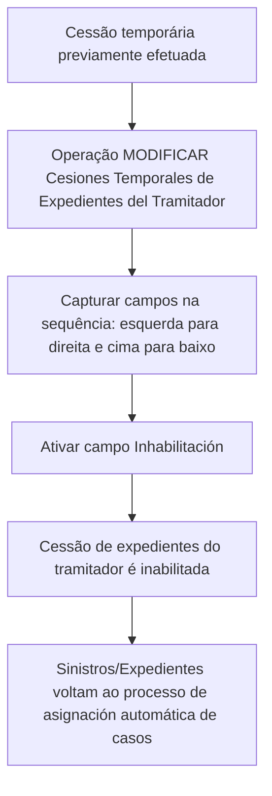

# Operação de Inabilitação de Cessões Temporárias de Expedientes do Tramitador — Documentação Reef

## 1. Metadados do Documento
- **Arquivo de Origem:** `Não identificado no conteúdo fornecido`
- **Tipo de Documento:** Manual Operacional
- **Domínio / Sistema:** Reef / Mapfre — gestão de sinistros e expedientes de tramitadores
- **Público-Alvo:** Operação, analistas funcionais e utilizadores responsáveis pela atribuição de casos
- **Data/Versão Identificada:** Não identificada

---

## 2. Resumo Executivo & Contexto de Negócio

O documento descreve a operação **“MODIFICAR Cesiones Temporales de Expedientes del Tramitador”** no contexto da documentação Reef da Mapfre. A operação permite inabilitar uma cessão temporária de sinistros ou expedientes que tenha sido efetuada anteriormente entre tramitadores.

A finalidade operacional da inabilitação é permitir que os sinistros ou expedientes cedidos regressem ao processo de **asignación automática de casos**. O documento não detalha a lógica interna desse processo de atribuição automática, os critérios utilizados para atribuir casos ou os impactos técnicos da reinserção.

A operação apresenta duas ações habilitadas: **CREAR** e **INHABILITAR**. Contudo, o conteúdo fornecido detalha explicitamente o efeito da inabilitação, sem explicar o comportamento, pré-requisitos ou persistência da ação de criação.

A captura dos campos do bloco de informação deve seguir uma ordem definida: **da esquerda para a direita e de cima para baixo**. Os campos documentados abrangem atividade, tramitador cedente, tramitador destinatário, data de validade e inabilitação.

---

## 3. Arquitetura, Componentes & Tecnologias Envolvidas

O conteúdo não descreve arquitetura de software, integrações, APIs, microsserviços, bancos de dados, tecnologias, URLs de ambiente ou mecanismos de autenticação. Os elementos funcionais explicitamente citados são:

- Sistema Reef.
- Documentação Mapfre.
- Processo de atribuição automática de casos.
- Tramitador cedente.
- Tramitador destinatário.
- Sinistros e expedientes.
- Bloco de Dados Básicos do Tercero.
- Bloco de informação de Cessões Temporárias.



> **Nota de Análise:** O documento não detalha componentes técnicos, contratos de integração, métodos HTTP, estruturas JSON, persistência de dados ou regras de autorização para executar a operação.

---

## 4. Regras de Negócio, Especificações Funcionais & Processos

### Objetivo funcional

A operação permite inabilitar a cessão de sinistros ou expedientes efetuada previamente. Após a inabilitação, os sinistros ou expedientes voltam a entrar no processo de atribuição automática de casos.

### Ações habilitadas

- **CREAR**
- **INHABILITAR**

> **Nota de Análise:** O documento apenas lista a ação **CREAR**, sem fornecer comportamento, campos obrigatórios, validações ou resultado esperado dessa ação.

### Sequência de captura de campos

A sequência de captura dos campos no bloco de informação de Cessões Temporárias deve obedecer à orientação visual:

1. Da esquerda para a direita.
2. De cima para baixo.

### Regras associadas aos campos

1. **Actividad**
   - O dado é proveniente do Bloco de Dados Básicos do Tercero.
   - O valor é herdado desse bloco.
   - O campo identifica o código de atividade correspondente aos tramitadores.

2. **Tramitador Cedente**
   - Contém o código do tramitador que cede os sinistros ou expedientes.

3. **Tramitador Destinatario**
   - Contém o código do tramitador que recebe os expedientes dos sinistros.

4. **Fecha de Validez**
   - Indica ao sistema a data a partir da qual a cessão de expedientes passa a vigorar.
   - A partir dessa data, a cessão estará plenamente operativa no sistema.

5. **Inhabilitación**
   - A ativação do campo provoca a inabilitação da cessão de expedientes do tramitador.
   - A inabilitação permite que os sinistros ou expedientes retornem ao processo de atribuição automática de casos.

---

## 5. Tabelas de Parâmetros, Ambientes e Estruturas de Dados

| Item / Parâmetro | Descrição / Função | Tipo / Valores / Formato | Ambiente / Observações |
| :--- | :--- | :--- | :--- |
| Operação | MODIFICAR Cesiones Temporales de Expedientes del Tramitador | Operação funcional | Permite inabilitar cessões previamente efetuadas |
| Ação | CREAR | Ação habilitada | O comportamento da ação não é detalhado |
| Ação | INHABILITAR | Ação habilitada | Associada à inabilitação da cessão de expedientes |
| Actividad | Identifica o código de atividade correspondente aos tramitadores | Código de atividade | Procede e é herdado do Bloco de Dados Básicos do Tercero |
| Tramitador Cedente | Identifica o tramitador que cede sinistros ou expedientes | Código do tramitador | Campo de origem da cessão |
| Tramitador Destinatario | Identifica o tramitador que recebe expedientes de sinistros | Código do tramitador | Campo de destino da cessão |
| Fecha de Validez | Define a data a partir da qual a cessão passa a vigorar | Data | A cessão torna-se plenamente operativa no sistema a partir dessa data |
| Inhabilitación | Inabilita a cessão de expedientes do tramitador | Campo ativável | Ao ser ativado, encerra a operacionalidade da cessão |
| Sinistros / Expedientes | Casos envolvidos na cessão temporária | Entidades de negócio | Após a inabilitação, retornam ao processo de atribuição automática |
| Processo de asignación automática de casos | Processo para o qual os casos retornam após inabilitação | Processo funcional | Critérios e funcionamento não são detalhados |
| Sequência de captura | Ordem de preenchimento dos campos no bloco de informação | Esquerda para direita; cima para baixo | Aplicável ao bloco de Cessões Temporárias |

---

## 6. Bateria de Perguntas & Respostas para RAG (FAQ Sintético)

### P1: Qual é o objetivo da operação “MODIFICAR Cesiones Temporales de Expedientes del Tramitador”?
**R:** A operação permite inabilitar uma cessão de sinistros ou expedientes que tenha sido efetuada anteriormente entre tramitadores. Como consequência, os sinistros ou expedientes voltam a participar no processo de atribuição automática de casos.

### P2: O que acontece quando uma cessão temporária de expedientes é inabilitada?
**R:** Quando a cessão é inabilitada, a cessão de expedientes do tramitador deixa de estar ativa. Os sinistros ou expedientes previamente cedidos voltam a entrar no processo de atribuição automática de casos.

### P3: Quais ações estão habilitadas na operação de Cessões Temporárias?
**R:** O documento lista as ações **CREAR** e **INHABILITAR** como ações habilitadas. O comportamento detalhado fornecido no documento refere-se à inabilitação.

### P4: Qual campo deve ser usado para inabilitar uma cessão de expedientes?
**R:** O campo **Inhabilitación** deve ser ativado. A ativação desse campo faz com que a cessão de expedientes do tramitador seja inabilitada.

### P5: Qual é a origem do campo Actividad?
**R:** O campo **Actividad** procede do **Bloco de Dados Básicos do Tercero** e é herdado desse bloco. O campo identifica o código de atividade que corresponde aos tramitadores.

### P6: O que representa o campo Tramitador Cedente?
**R:** O campo **Tramitador Cedente** contém o código do tramitador que cede os sinistros ou expedientes para outro tramitador.

### P7: O que representa o campo Tramitador Destinatario?
**R:** O campo **Tramitador Destinatario** contém o código do tramitador que recebe os expedientes dos sinistros cedidos.

### P8: Para que serve a Fecha de Validez em uma cessão temporária?
**R:** A **Fecha de Validez** informa ao sistema a data a partir da qual a cessão de expedientes passa a vigorar e estará plenamente operativa no sistema.

### P9: Em qual ordem os campos do bloco de Cessões Temporárias devem ser preenchidos?
**R:** Os campos devem ser capturados da esquerda para a direita e de cima para baixo, conforme a sequência visual apresentada no bloco de informação.

### P10: O documento explica como funciona a atribuição automática de casos?
**R:** Não. O documento informa somente que os sinistros ou expedientes retornam ao processo de atribuição automática de casos após a inabilitação da cessão. Não há detalhamento sobre regras, algoritmos, prioridades ou critérios desse processo.

### P11: O documento detalha os requisitos para criar uma cessão temporária?
**R:** Não. Embora a ação **CREAR** esteja listada como habilitada, o documento não descreve os requisitos, validações, fluxos ou efeitos operacionais da criação de uma cessão temporária.

---

## 7. Glossário de Termos, Siglas & Conceitos-Chave

- **Reef:** Nome presente na documentação e no domínio identificado no conteúdo fornecido.
- **Mapfre:** Nome presente no cabeçalho da documentação fornecida.
- **Tramitador:** Entidade associada ao tratamento de sinistros ou expedientes; pode atuar como cedente ou destinatário em uma cessão.
- **Tramitador Cedente:** Tramitador cujo código identifica quem cede os sinistros ou expedientes.
- **Tramitador Destinatario:** Tramitador cujo código identifica quem recebe os expedientes dos sinistros.
- **Cesiones Temporales:** Cessões temporárias de sinistros ou expedientes entre tramitadores.
- **Expediente:** Entidade de negócio referida no documento como objeto de cessão e de atribuição automática.
- **Siniestro:** Entidade de negócio referida no documento em conjunto com expedientes.
- **Actividad:** Campo que identifica o código de atividade correspondente aos tramitadores.
- **Fecha de Validez:** Data a partir da qual a cessão de expedientes passa a ser plenamente operativa.
- **Inhabilitación:** Campo cuja ativação inabilita a cessão de expedientes do tramitador.
- **Asignación automática de casos:** Processo para o qual sinistros ou expedientes retornam após a inabilitação da cessão.
- **Tercero:** Referência ao Bloco de Dados Básicos do qual o campo Actividad é herdado.

---

## 8. Notas Críticas, Riscos & Limitações

- O documento não identifica data, versão, nome do arquivo original ou autor funcional/técnico da operação.
- A ação **CREAR** é listada, mas não possui explicação funcional adicional.
- Não são informados campos obrigatórios, formatos, tamanhos, valores permitidos ou regras de validação para os códigos de atividade e de tramitadores.
- Não são descritas permissões, perfis de acesso, aprovação, auditoria ou rastreabilidade para criar ou inabilitar cessões.
- Não há informação sobre comportamento retroativo, tratamento de erros, reversão da inabilitação ou efeitos sobre expedientes já processados.
- O processo de **asignación automática de casos** é citado, mas não possui detalhamento sobre critérios, prioridades ou resultados.
- Não são apresentados detalhes técnicos de arquitetura, APIs, integrações, ambientes, logs, bancos de dados ou mecanismos de persistência.

---

## 9. Conteúdo Bruto Estruturado (Referência Fiel)

```text
--- [PÁGINA 1 DE 2] ---

Documentation / DOCUMENTACIÓN Reef
DOCUMENTACIÓN Reef
Mapfredocument
DOCUMENTACIÓN Reef
Owner
user:agonzalez_mapfre.com
Lifecycle
Approved Source
 /
 VL
Buscar Inicio Soluciones Arquitecturas APIs Componentes Cloud Documentación Zeus Reef Ayuda
ES


--- [PÁGINA 2 DE 2] ---

MODIFICAR Cesiones Temporales de Expedientes del Tramitador
Objetivo
Esta Operación permite Inhabilitar la cesión de los Siniestros/Expedientes efectuada previamente para volver a entrar en el proceso de
asignación automática de casos.
Acciones habilitadas
 CREAR ( )  INHABILITAR ( )
Cesiones Temporales
De Izquierda a Derecha y de Arriba hacia Abajo, los siguientes campos marcan la secuencia de captura de los Campos en este Bloque de
Información.
Actividad
Este dato procede y se hereda del Bloque de Datos Básicos del Tercero e identica el código de actividad que le corresponde a los
Tramitadores.
Tramitador Cedente (  )
Este campo contiene el código del Tramitador que cede los Siniestros/Expedientes.
Tramitador Destinatario (  )
Este campo, por el contrario, contiene el código del Tramitador que recibe los expedientes de los siniestros.
Fecha de Validez ( )
Esta propiedad le indica al Sistema la fecha a partir de la cual la cesión de expedientes tomará cuerpo y estará plenamente operativa en el
sistema.
Inhabilitación (  )
La activación de este campo hace que la cesión de expedientes del Tramitador se inhabilite.
```
